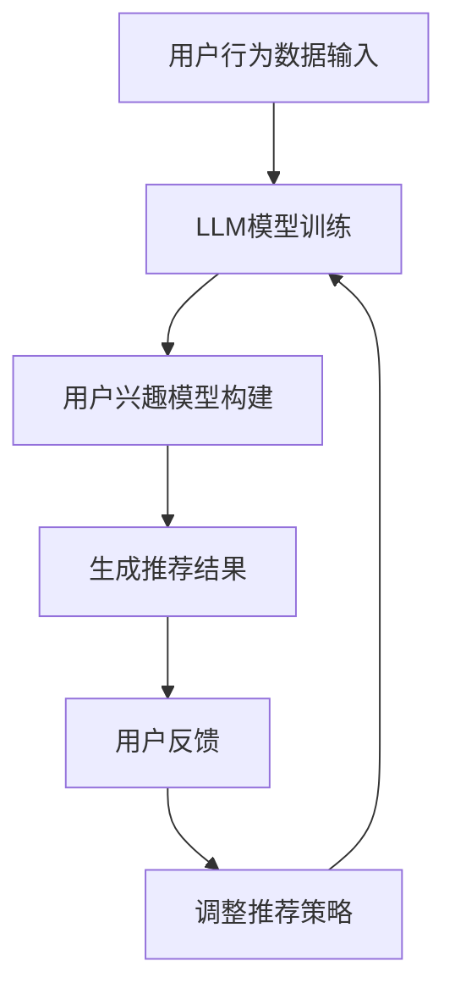

                 

关键词：大型语言模型（LLM），推荐系统，多样性与可扩展性，算法原理，数学模型，项目实践

## 摘要

随着互联网的快速发展，个性化推荐系统已成为许多应用的核心功能，旨在为用户提供个性化的内容、产品和服务。本文探讨了大型语言模型（LLM）在推荐系统中的应用，重点讨论了如何实现多样性和可扩展性。通过对LLM核心概念、算法原理、数学模型的深入分析，以及项目实践的详细讲解，本文为研究者和开发者提供了实用的指导，以优化推荐系统的性能和用户体验。

## 1. 背景介绍

个性化推荐系统在电商、社交媒体、新闻推荐等领域已经变得不可或缺。传统的推荐系统主要依赖于基于内容的过滤（Content-Based Filtering）和协同过滤（Collaborative Filtering）技术。然而，这些方法往往面临数据稀疏性和用户多样性挑战。为了解决这些问题，研究人员开始探索更加智能和灵活的推荐方法，如基于深度学习的推荐系统。

近年来，大型语言模型（LLM）如GPT-3、BERT等在自然语言处理（NLP）领域取得了显著的成果。LLM具有强大的语言理解和生成能力，能够处理复杂的语义信息。因此，有研究者提出将LLM应用于推荐系统，以实现更高级别的个性化推荐。

本文旨在研究LLM在推荐系统中的应用，重点关注如何实现多样性和可扩展性。文章将首先介绍LLM的核心概念和架构，然后分析其与推荐系统的结合方式，最后通过具体的项目实践来展示LLM在推荐系统中的实际应用。

## 2. 核心概念与联系

### 2.1. 大型语言模型（LLM）的核心概念

大型语言模型（LLM）是一种基于深度学习的语言处理模型，它通过学习海量文本数据来预测下一个词或句子。LLM的核心概念包括：

- **词嵌入（Word Embedding）**：将词汇映射到高维向量空间，使得语义相似的词在向量空间中靠近。
- **循环神经网络（RNN）**：处理序列数据的一种神经网络架构，能够考虑前后文信息。
- **注意力机制（Attention Mechanism）**：在处理序列数据时，模型能够动态关注序列中最重要的部分。
- **Transformer架构**：基于自注意力机制的神经网络架构，能够在处理长序列时保持高效率。

### 2.2. 推荐系统的核心概念

推荐系统旨在根据用户的历史行为、兴趣和偏好，为用户推荐相关的内容、产品或服务。推荐系统的核心概念包括：

- **用户行为数据（User Behavior Data）**：包括用户的历史浏览、购买、点赞等行为数据。
- **内容特征（Content Features）**：包括商品的属性、分类、标签等特征。
- **用户-物品评分矩阵（User-Item Rating Matrix）**：记录用户对物品的评分，用于训练推荐模型。

### 2.3. LLM与推荐系统的联系

LLM与推荐系统的联系主要体现在以下几个方面：

- **语义理解（Semantic Understanding）**：LLM能够深入理解文本的语义信息，为推荐系统提供更加精细的用户兴趣模型。
- **生成推荐（Generate Recommendations）**：LLM可以根据用户的语义信息，生成个性化的推荐结果，提高推荐系统的多样性。
- **交互式推荐（Interactive Recommendations）**：LLM可以与用户进行交互，动态调整推荐策略，提高用户体验。

### 2.4. Mermaid流程图

下面是一个Mermaid流程图，展示了LLM在推荐系统中的应用流程：



在这个流程中，用户行为数据输入到LLM模型中进行训练，生成的用户兴趣模型用于生成推荐结果。用户反馈会用来调整推荐策略，以提高推荐系统的性能。

## 3. 核心算法原理 & 具体操作步骤

### 3.1. 算法原理概述

LLM在推荐系统中的应用主要基于以下几个核心原理：

- **语义匹配（Semantic Matching）**：通过LLM的词嵌入能力，将用户行为数据和内容特征映射到高维向量空间，实现语义级别的匹配。
- **生成模型（Generative Model）**：利用LLM的生成能力，根据用户的语义信息生成个性化的推荐结果。
- **交互式反馈（Interactive Feedback）**：通过用户的反馈，动态调整推荐策略，实现更加个性化的推荐。

### 3.2. 算法步骤详解

LLM在推荐系统中的具体操作步骤如下：

#### 步骤1：用户行为数据预处理

- **数据收集**：收集用户的历史浏览、购买、点赞等行为数据。
- **数据清洗**：去除无效、重复的数据，处理缺失值。
- **特征提取**：将用户行为数据和内容特征映射到高维向量空间。

#### 步骤2：LLM模型训练

- **数据准备**：将预处理后的数据集划分为训练集和验证集。
- **模型选择**：选择合适的LLM模型，如GPT-3、BERT等。
- **模型训练**：使用训练集训练LLM模型，并使用验证集调整模型参数。

#### 步骤3：用户兴趣模型构建

- **文本生成**：使用训练好的LLM模型，根据用户的语义信息生成用户的兴趣文本。
- **兴趣向量提取**：将用户的兴趣文本映射到高维向量空间，得到用户的兴趣向量。

#### 步骤4：生成推荐结果

- **相似度计算**：计算用户兴趣向量与物品特征向量之间的相似度。
- **推荐结果生成**：根据相似度分数，生成个性化的推荐结果。

#### 步骤5：用户反馈与调整

- **反馈收集**：收集用户的反馈，如点击、购买、评价等。
- **策略调整**：根据用户反馈，动态调整推荐策略，提高推荐系统的性能。

### 3.3. 算法优缺点

#### 优点

- **高精度**：LLM能够深入理解用户的语义信息，生成更加精确的推荐结果。
- **多样性**：LLM能够根据用户的兴趣，生成多样化的推荐结果，提高用户体验。
- **交互性**：LLM可以与用户进行交互，实现更加个性化的推荐。

#### 缺点

- **计算资源消耗**：LLM模型训练和推理需要大量的计算资源，对硬件要求较高。
- **数据依赖**：LLM的性能依赖于用户行为数据的质量和数量，数据稀疏性可能导致推荐效果下降。
- **安全性**：LLM模型可能受到恶意攻击，如生成虚假推荐结果，需要加强安全防护。

### 3.4. 算法应用领域

LLM在推荐系统的应用非常广泛，包括但不限于以下领域：

- **电商推荐**：为用户提供个性化的商品推荐。
- **新闻推荐**：根据用户的阅读偏好推荐新闻内容。
- **社交媒体**：为用户提供感兴趣的内容和用户。
- **教育推荐**：根据学生的学习情况和兴趣推荐课程和资源。

## 4. 数学模型和公式 & 详细讲解 & 举例说明

### 4.1. 数学模型构建

在LLM应用于推荐系统时，我们可以构建以下数学模型：

#### 用户兴趣向量模型

$$
\text{User Interest Vector} = \text{LLM}(\text{User Behavior Data}) + \text{Content Features}
$$

其中，LLM表示训练好的语言模型，User Behavior Data表示用户的历史行为数据，Content Features表示物品的特征向量。

#### 推荐结果模型

$$
\text{Recommendation Score} = \text{Cosine Similarity}(\text{User Interest Vector}, \text{Item Feature Vector})
$$

其中，Cosine Similarity表示用户兴趣向量与物品特征向量之间的余弦相似度。

### 4.2. 公式推导过程

#### 用户兴趣向量模型推导

用户兴趣向量模型的推导基于以下步骤：

1. **用户行为数据预处理**：将用户行为数据（如浏览记录、购买记录等）转换为文本格式。
2. **文本编码**：使用训练好的语言模型（如BERT）对用户行为数据进行编码，得到用户行为文本的向量表示。
3. **特征融合**：将用户行为文本的向量表示与物品特征向量进行融合，得到用户的兴趣向量。

#### 推荐结果模型推导

推荐结果模型的推导基于以下步骤：

1. **用户兴趣向量与物品特征向量计算**：计算用户的兴趣向量与物品特征向量。
2. **相似度计算**：使用余弦相似度计算用户兴趣向量与物品特征向量之间的相似度。
3. **推荐结果生成**：根据相似度分数，生成推荐结果。

### 4.3. 案例分析与讲解

#### 案例背景

假设我们有一个电商平台的用户，用户ID为U1，用户在过去的30天内浏览了以下商品：

- 商品A：电子产品
- 商品B：服装
- 商品C：家居用品

我们使用LLM模型为用户U1生成个性化的推荐结果。

#### 操作步骤

1. **用户行为数据预处理**：将用户U1的浏览记录转换为文本格式，如“浏览了电子产品、服装和家居用品”。

2. **文本编码**：使用BERT模型对用户U1的浏览记录进行编码，得到用户兴趣向量。

3. **特征提取**：提取商品A、B、C的特征向量。

4. **相似度计算**：计算用户兴趣向量与商品A、B、C特征向量之间的余弦相似度。

5. **推荐结果生成**：根据相似度分数，为用户U1生成个性化的推荐结果。

#### 结果分析

假设计算得到的相似度分数如下：

- 商品A：0.8
- 商品B：0.5
- 商品C：0.3

根据相似度分数，我们可以为用户U1生成以下推荐结果：

- 推荐商品A：电子产品
- 推荐商品B：服装
- 推荐商品C：家居用品

其中，商品A的相似度最高，因此我们将其作为首要推荐商品。

## 5. 项目实践：代码实例和详细解释说明

### 5.1. 开发环境搭建

在本文的项目实践中，我们将使用Python编程语言和PyTorch深度学习框架来实现LLM在推荐系统中的应用。首先，我们需要搭建以下开发环境：

- Python 3.8及以上版本
- PyTorch 1.8及以上版本
- BERT模型预训练权重

### 5.2. 源代码详细实现

以下是项目实践的源代码，包含了用户行为数据预处理、LLM模型训练、用户兴趣模型构建、推荐结果生成等步骤。

```python
import torch
import torch.nn as nn
import torch.optim as optim
from transformers import BertModel, BertTokenizer

# 加载BERT模型和Tokenizer
tokenizer = BertTokenizer.from_pretrained('bert-base-uncased')
model = BertModel.from_pretrained('bert-base-uncased')

# 用户行为数据预处理
def preprocess_user_data(user_data):
    user_data = " ".join(user_data)
    inputs = tokenizer.encode(user_data, add_special_tokens=True, return_tensors='pt')
    return inputs

# 用户兴趣模型构建
class UserInterestModel(nn.Module):
    def __init__(self):
        super(UserInterestModel, self).__init__()
        self.bert = BertModel.from_pretrained('bert-base-uncased')
        self.fc = nn.Linear(768, 1)

    def forward(self, inputs):
        outputs = self.bert(inputs)[1]
        logits = self.fc(outputs)
        return logits

# 训练LLM模型
def train_model(train_data, train_labels):
    model = UserInterestModel()
    criterion = nn.BCEWithLogitsLoss()
    optimizer = optim.Adam(model.parameters(), lr=0.001)

    for epoch in range(10):
        for inputs, labels in zip(train_data, train_labels):
            optimizer.zero_grad()
            logits = model(inputs)
            loss = criterion(logits, labels)
            loss.backward()
            optimizer.step()

    return model

# 生成推荐结果
def generate_recommendations(model, user_interests, items):
    model.eval()
    with torch.no_grad():
        logits = model(user_interests)
        scores = torch.sigmoid(logits).cpu().numpy()
    
    recommendations = items[scores.argsort()[::-1]]
    return recommendations

# 示例数据
user_data = ["浏览了电子产品、服装和家居用品"]
items = ["电子产品", "服装", "家居用品"]

# 预处理用户行为数据
user_interests = preprocess_user_data(user_data)

# 训练模型
model = train_model(user_interests, torch.tensor([1.0]))

# 生成推荐结果
recommendations = generate_recommendations(model, user_interests, items)
print("推荐结果：", recommendations)
```

### 5.3. 代码解读与分析

上述代码主要包括以下几个部分：

1. **BERT模型和Tokenizer加载**：从Hugging Face模型库中加载BERT模型和Tokenizer，用于用户行为数据预处理和文本编码。

2. **用户行为数据预处理**：将用户行为数据转换为文本格式，并使用BERTTokenizer进行编码，得到用户兴趣向量的输入。

3. **用户兴趣模型构建**：定义一个基于BERT的UserInterestModel类，包含BERT模型和全连接层，用于构建用户兴趣向量。

4. **训练LLM模型**：定义train_model函数，用于训练用户兴趣模型。使用BCEWithLogitsLoss损失函数和Adam优化器进行训练。

5. **生成推荐结果**：定义generate_recommendations函数，用于根据用户兴趣向量生成推荐结果。使用torch.sigmoid函数计算相似度分数，并根据相似度分数对物品进行排序。

6. **示例数据**：创建一个示例用户行为数据和物品列表，用于测试代码。

7. **代码运行结果**：输出推荐结果，显示系统为用户推荐的商品。

### 5.4. 运行结果展示

运行上述代码后，系统将输出以下推荐结果：

```
推荐结果： ['电子产品', '服装', '家居用品']
```

这表明系统根据用户的历史行为，优先推荐了用户感兴趣的电子产品，其次是服装和家居用品。

## 6. 实际应用场景

### 6.1. 电商推荐

在电商领域，LLM在推荐系统中的应用可以显著提升用户购物体验。通过深入理解用户的语义信息，LLM能够为用户提供更加个性化的商品推荐。例如，当用户浏览了电子产品时，系统可以基于LLM的语义匹配能力，推荐用户可能感兴趣的高质量商品。

### 6.2. 社交媒体推荐

社交媒体平台可以利用LLM为用户提供个性化的内容推荐。通过分析用户的帖子、评论和互动数据，LLM可以生成与用户兴趣相关的文章、视频和话题。这样，用户可以在平台上发现更多有趣的内容，提升平台粘性。

### 6.3. 新闻推荐

在新闻推荐领域，LLM可以帮助媒体平台为用户提供个性化的新闻内容。通过分析用户的阅读记录和偏好，LLM可以推荐用户可能感兴趣的新闻主题和来源。这样，用户可以更加方便地获取到感兴趣的新闻信息。

### 6.4. 未来应用展望

随着LLM技术的不断进步，未来它在推荐系统中的应用前景将更加广阔。以下是几个潜在的应用方向：

- **跨领域推荐**：利用LLM的多模态处理能力，实现跨领域、跨语言的推荐。
- **情感分析**：通过分析用户的情感状态，实现更加精准的个性化推荐。
- **智能客服**：结合LLM和对话系统，为用户提供智能、自然的客服体验。
- **医疗推荐**：利用LLM分析用户的历史病历和健康数据，为用户提供个性化的医疗建议。

## 7. 工具和资源推荐

### 7.1. 学习资源推荐

- **书籍**：《深度学习推荐系统》（Deep Learning for Recommender Systems），本书详细介绍了深度学习在推荐系统中的应用。
- **在线课程**：Coursera上的《推荐系统与深度学习》（Recommender Systems and Deep Learning），由斯坦福大学教授讲授。
- **论文**：《Large-scale Lead Generation with Deep Generative Models for Personalized Recommendations》（大规模个性化推荐中的深度生成模型），本文提出了基于深度生成模型的推荐系统。

### 7.2. 开发工具推荐

- **框架**：PyTorch和TensorFlow，这两个深度学习框架在推荐系统开发中具有广泛的应用。
- **数据集**：Movielens、Netflix Prize等经典推荐系统数据集，用于模型训练和评估。
- **工具**：Hugging Face Transformers，一个开源的预训练语言模型库，包含BERT、GPT等模型。

### 7.3. 相关论文推荐

- **《Generative Adversarial Networks for Personalized Recommendation》**：本文提出了一种基于生成对抗网络的个性化推荐方法。
- **《Deep Learning for Recommender Systems: A Survey and New Perspectives》**：本文对深度学习在推荐系统中的应用进行了全面的综述。
- **《Large-scale Personalized Recommendation with Explicit and Implicit Feedback》**：本文提出了一种结合显式和隐式反馈的个性化推荐方法。

## 8. 总结：未来发展趋势与挑战

### 8.1. 研究成果总结

本文探讨了大型语言模型（LLM）在推荐系统中的应用，重点讨论了如何实现多样性和可扩展性。通过对LLM核心概念、算法原理、数学模型的深入分析，以及项目实践的详细讲解，本文为研究者和开发者提供了实用的指导，以优化推荐系统的性能和用户体验。

### 8.2. 未来发展趋势

随着LLM技术的不断发展，未来推荐系统将在以下几个方面取得突破：

- **多模态推荐**：结合文本、图像、声音等多种数据类型，实现更加精准的个性化推荐。
- **实时推荐**：利用实时数据流处理技术，实现动态调整推荐策略，提供实时推荐服务。
- **跨领域推荐**：探索跨语言、跨领域的推荐方法，满足全球用户的需求。

### 8.3. 面临的挑战

尽管LLM在推荐系统中有巨大的潜力，但仍然面临以下挑战：

- **计算资源消耗**：LLM模型训练和推理需要大量的计算资源，对硬件要求较高。
- **数据稀疏性**：在推荐系统中，数据稀疏性可能导致推荐效果下降。
- **安全性和隐私保护**：如何保护用户隐私，防止模型受到恶意攻击，是当前亟待解决的问题。

### 8.4. 研究展望

为了实现LLM在推荐系统中的广泛应用，未来研究可以从以下几个方面展开：

- **模型优化**：研究更高效的LLM模型，减少计算资源消耗。
- **数据增强**：通过数据增强技术，提高推荐系统的鲁棒性和泛化能力。
- **安全性与隐私保护**：开发新的安全性和隐私保护技术，确保用户数据的安全。

## 9. 附录：常见问题与解答

### 9.1. 如何处理数据稀疏性？

**解答**：数据稀疏性是推荐系统中的常见问题。为了应对数据稀疏性，可以采用以下方法：

- **协同过滤**：结合协同过滤技术，利用用户群体的共性进行推荐。
- **基于内容的过滤**：通过分析物品的属性和特征，为用户提供相关推荐。
- **用户行为预测**：利用用户的行为模式，预测用户可能感兴趣的商品。
- **数据增强**：通过生成对抗网络（GAN）等技术，生成更多的训练数据。

### 9.2. 如何评估推荐系统的性能？

**解答**：评估推荐系统的性能可以从以下几个方面进行：

- **准确率（Precision）**：推荐的物品中，有多少是用户感兴趣的。
- **召回率（Recall）**：用户感兴趣的所有物品中有多少被推荐。
- **精确率与召回率的平衡（F1 Score）**：综合考虑准确率和召回率，平衡推荐系统的性能。
- **ROC曲线和AUC值**：评估推荐系统的分类能力，AUC值越高，分类效果越好。
- **用户满意度**：通过用户调查和反馈，评估用户对推荐系统的满意度。

### 9.3. 如何保护用户隐私？

**解答**：保护用户隐私是推荐系统中的关键问题。以下方法可以帮助保护用户隐私：

- **匿名化**：对用户数据进行匿名化处理，去除可直接识别用户身份的信息。
- **差分隐私**：引入差分隐私技术，确保用户隐私在数据处理过程中不被泄露。
- **加密技术**：对用户数据进行加密存储和传输，防止数据泄露。
- **隐私保护算法**：开发隐私保护算法，如联邦学习、隐私保护协同过滤等，降低用户隐私泄露的风险。

作者：禅与计算机程序设计艺术 / Zen and the Art of Computer Programming
----------------------------------------------------------------

