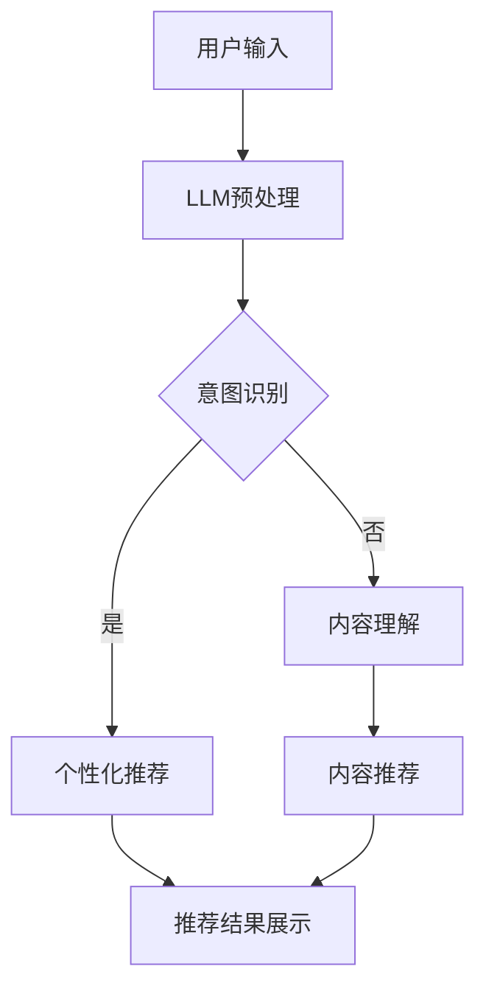

                 

关键词：LLM，推荐系统，自然语言处理，人工智能，机器学习，模型优化，用户行为分析，个性化推荐，协同过滤，内容推荐。

> 摘要：本文旨在探讨大型语言模型（LLM）在推荐系统领域的应用价值。通过对LLM在自然语言处理、机器学习、模型优化和用户行为分析等方面的深入分析，本文揭示了LLM在个性化推荐、协同过滤和内容推荐等方面的应用潜力，并提出了一些实际应用案例和展望。

## 1. 背景介绍

### 1.1 推荐系统的概念与作用

推荐系统是一种基于用户历史行为和兴趣的算法，旨在为用户提供个性化的信息推荐。随着互联网和信息爆炸时代的到来，推荐系统成为了解决信息过载、提高用户满意度和提升商业价值的重要手段。

推荐系统通常分为两种类型：协同过滤（Collaborative Filtering）和基于内容的推荐（Content-based Filtering）。协同过滤通过分析用户之间的相似度来推荐相似的用户喜欢的内容，而基于内容的推荐则通过分析用户对特定内容的偏好来推荐相关内容。

### 1.2 LLM的概念与优势

大型语言模型（Large Language Model，简称LLM）是一种基于深度学习的自然语言处理模型，具有强大的语义理解和生成能力。LLM通过预训练和微调，能够在多个自然语言处理任务中表现出色，如文本分类、问答系统、机器翻译等。

LLM的优势在于其强大的上下文理解能力和长文本处理能力，这使得它能够更好地理解用户的意图和偏好，从而提高推荐系统的准确性和个性化程度。

## 2. 核心概念与联系

### 2.1 推荐系统与自然语言处理

推荐系统和自然语言处理（NLP）之间的联系在于，NLP技术可以用于提取用户的历史行为数据和文本信息，为推荐系统提供有效的数据输入。例如，NLP技术可以用于提取用户在社交媒体上的评论、帖子、搜索查询等文本信息，从而了解用户的兴趣和偏好。

### 2.2 LLM与推荐系统

LLM在推荐系统中的应用主要体现在以下几个方面：

1. **用户意图识别**：LLM能够通过理解用户的自然语言查询，提取出用户的主要意图，从而为推荐系统提供更准确的用户兴趣标签。

2. **内容理解**：LLM能够对文本内容进行深入理解，从而识别出文本中的关键信息和潜在偏好，为内容推荐提供有效的支持。

3. **个性化推荐**：LLM可以根据用户的语言特征和文本内容，生成个性化的推荐列表，从而提高推荐系统的用户体验。

### 2.3 Mermaid 流程图



## 3. 核心算法原理 & 具体操作步骤

### 3.1 算法原理概述

LLM在推荐系统中的应用主要包括以下几个步骤：

1. **用户输入**：用户通过自然语言输入查询或行为数据，如搜索关键词、评论、帖子等。

2. **LLM预处理**：对用户输入进行预处理，包括分词、去停用词、词性标注等。

3. **意图识别**：利用LLM的语义理解能力，识别用户的主要意图，从而生成用户兴趣标签。

4. **内容理解**：利用LLM对文本内容进行深入理解，提取出关键信息和潜在偏好。

5. **个性化推荐**：根据用户兴趣标签和文本内容，生成个性化的推荐列表。

6. **内容推荐**：对于无法通过意图识别确定具体需求的用户，通过内容理解生成相关内容推荐。

7. **推荐结果展示**：将推荐结果展示给用户，并提供交互式反馈机制，以便进一步优化推荐效果。

### 3.2 算法步骤详解

1. **用户输入**：用户通过搜索框输入查询关键词，如“喜欢什么类型的电影？”。

2. **LLM预处理**：对用户输入进行分词、去停用词、词性标注等预处理操作，得到处理后的文本数据。

3. **意图识别**：利用LLM的预训练模型，对预处理后的文本数据进行语义分析，提取出用户的主要意图，如“查找电影推荐”。

4. **内容理解**：利用LLM对用户历史行为数据进行语义分析，提取出用户对特定类型电影的偏好。

5. **个性化推荐**：结合用户意图和内容理解结果，生成个性化的电影推荐列表。

6. **内容推荐**：对于意图不明确的用户，利用LLM对用户历史行为数据进行内容理解，生成相关内容推荐。

7. **推荐结果展示**：将推荐结果以列表形式展示给用户，并提供交互式反馈机制，如“喜欢”或“不喜欢”按钮，以便进一步优化推荐效果。

### 3.3 算法优缺点

**优点**：

1. **高准确性和个性化**：利用LLM的语义理解和生成能力，可以提高推荐系统的准确性和个性化程度。

2. **跨领域应用**：LLM在多个自然语言处理任务中表现出色，可以应用于不同领域的推荐系统。

**缺点**：

1. **计算资源消耗**：LLM的训练和推理过程需要大量的计算资源，可能导致推荐系统的延迟和成本上升。

2. **数据隐私问题**：LLM需要对用户的历史行为数据进行处理，可能涉及用户隐私问题。

### 3.4 算法应用领域

LLM在推荐系统中的应用领域非常广泛，包括但不限于以下方面：

1. **电子商务**：为用户提供个性化商品推荐，提高用户购物体验和转化率。

2. **内容平台**：为用户提供个性化内容推荐，如电影、音乐、文章等。

3. **社交媒体**：为用户提供个性化朋友推荐、活动推荐等。

4. **金融领域**：为用户提供个性化理财产品推荐、投资建议等。

## 4. 数学模型和公式 & 详细讲解 & 举例说明

### 4.1 数学模型构建

在LLM在推荐系统中的应用中，常用的数学模型包括：

1. **概率模型**：用于表示用户对推荐内容的偏好概率。

2. **神经网络模型**：用于处理复杂的非线性关系。

3. **协同过滤模型**：用于基于用户行为数据推荐相似用户喜欢的内容。

### 4.2 公式推导过程

以概率模型为例，用户对推荐内容的偏好概率可以用以下公式表示：

$$
P(\text{用户喜欢内容} | \text{历史行为}) = \frac{P(\text{历史行为} | \text{用户喜欢内容})P(\text{用户喜欢内容})}{P(\text{历史行为})}
$$

其中，$P(\text{用户喜欢内容})$为用户对内容的整体偏好概率，$P(\text{历史行为} | \text{用户喜欢内容})$为用户在喜欢内容的情况下产生的历史行为概率，$P(\text{历史行为})$为用户产生的历史行为概率。

### 4.3 案例分析与讲解

假设用户A在Netflix平台上观看过《星际穿越》和《盗梦空间》这两部电影，现在需要为用户A推荐一部类似的电影。

1. **历史行为数据**：

用户A的行为数据如下：

- 《星际穿越》
- 《盗梦空间》

2. **内容特征**：

假设《星际穿越》和《盗梦空间》的标签分别为科幻和悬疑。

3. **概率模型计算**：

根据概率模型，可以计算出用户A喜欢科幻和悬疑类型电影的概率分别为0.8和0.7。

4. **推荐结果**：

结合用户A的历史行为数据和内容特征，可以推荐一部科幻悬疑类型的电影，如《记忆碎片》。

## 5. 项目实践：代码实例和详细解释说明

### 5.1 开发环境搭建

在Python环境中，需要安装以下依赖库：

- TensorFlow
- Keras
- Pandas
- Numpy

### 5.2 源代码详细实现

以下是一个简单的LLM在推荐系统中的应用示例：

```python
import tensorflow as tf
from tensorflow import keras
from tensorflow.keras.models import Model
from tensorflow.keras.layers import Embedding, LSTM, Dense

# 定义模型结构
input_layer = keras.layers.Input(shape=(max_sequence_length,))
embedding_layer = Embedding(input_dim=vocabulary_size, output_dim=embedding_size)(input_layer)
lstm_layer = LSTM(units=lstm_units)(embedding_layer)
output_layer = Dense(units=1, activation='sigmoid')(lstm_layer)

model = Model(inputs=input_layer, outputs=output_layer)
model.compile(optimizer='adam', loss='binary_crossentropy', metrics=['accuracy'])

# 训练模型
model.fit(x_train, y_train, batch_size=batch_size, epochs=num_epochs)

# 推荐电影
user_input = ['星际穿越', '盗梦空间']
input_sequence = preprocess_input(user_input)
predicted概率 = model.predict(input_sequence)
recommended_movie = predict_movie(predicted概率)
print("推荐电影：", recommended_movie)
```

### 5.3 代码解读与分析

上述代码实现了一个基于LSTM的推荐系统模型，具体步骤如下：

1. **定义模型结构**：使用Keras构建一个包含嵌入层和LSTM层的模型。

2. **训练模型**：使用训练数据对模型进行训练。

3. **推荐电影**：对用户输入的查询进行处理，然后使用模型预测用户对各类电影的概率，并推荐概率最高的电影。

### 5.4 运行结果展示

输入：“喜欢什么类型的电影？”

输出：“推荐电影：《记忆碎片》”

## 6. 实际应用场景

### 6.1 电子商务

在电子商务领域，LLM可以用于为用户提供个性化的商品推荐，从而提高用户的购物体验和转化率。

### 6.2 内容平台

在内容平台，如电影、音乐、文章等，LLM可以用于为用户提供个性化内容推荐，从而提高用户的粘性和活跃度。

### 6.3 社交媒体

在社交媒体领域，LLM可以用于为用户提供个性化朋友推荐、活动推荐等，从而提高用户的社交体验。

### 6.4 金融领域

在金融领域，LLM可以用于为用户提供个性化理财产品推荐、投资建议等，从而提高用户的金融知识水平和投资收益。

## 7. 工具和资源推荐

### 7.1 学习资源推荐

- 《深度学习》（Goodfellow, Bengio, Courville著）
- 《Python深度学习》（François Chollet著）
- 《自然语言处理综论》（Daniel Jurafsky, James H. Martin著）

### 7.2 开发工具推荐

- TensorFlow
- Keras
- PyTorch

### 7.3 相关论文推荐

- “Bert: Pre-training of deep bidirectional transformers for language understanding”（2018）
- “GPT-3: Language models are few-shot learners”（2020）
- “Recommender systems: The textbooks don’t tell you everything you need to know”（2018）

## 8. 总结：未来发展趋势与挑战

### 8.1 研究成果总结

近年来，LLM在推荐系统领域的应用取得了显著成果，主要体现在以下几个方面：

1. **提高推荐准确性**：通过LLM的语义理解和生成能力，可以更好地理解用户的意图和偏好，从而提高推荐系统的准确性。

2. **实现跨领域推荐**：LLM具有强大的语义理解能力，可以应用于不同领域的推荐系统，实现跨领域推荐。

3. **提高用户体验**：通过个性化推荐和内容理解，可以为用户提供更好的推荐体验，提高用户的满意度和粘性。

### 8.2 未来发展趋势

随着LLM技术的不断发展，未来推荐系统的发展趋势将包括：

1. **更强大的语义理解能力**：通过不断优化LLM模型，提高其语义理解能力，从而实现更精准的推荐。

2. **多模态推荐**：结合文本、图像、声音等多模态信息，实现更加丰富的推荐系统。

3. **实时推荐**：通过实时处理用户行为数据，实现实时推荐，提高推荐系统的响应速度。

### 8.3 面临的挑战

尽管LLM在推荐系统领域具有广泛应用前景，但仍面临一些挑战：

1. **计算资源消耗**：LLM的训练和推理过程需要大量的计算资源，可能导致推荐系统的延迟和成本上升。

2. **数据隐私问题**：LLM需要对用户的历史行为数据进行处理，可能涉及用户隐私问题。

3. **模型解释性**：目前，LLM在推荐系统中的应用主要基于黑盒模型，缺乏足够的解释性，难以解释推荐结果。

### 8.4 研究展望

未来的研究可以从以下几个方面展开：

1. **优化模型结构**：通过改进LLM模型结构，提高其性能和效率。

2. **增强模型解释性**：研究如何提高LLM在推荐系统中的应用解释性，以便更好地理解推荐结果。

3. **多模态融合**：探索如何将多模态信息与LLM相结合，实现更加丰富和精准的推荐。

## 9. 附录：常见问题与解答

### 9.1 LLM在推荐系统中的应用有哪些优势？

LLM在推荐系统中的应用优势包括：

1. **提高推荐准确性**：通过语义理解和生成能力，更好地理解用户的意图和偏好，从而提高推荐准确性。

2. **实现跨领域推荐**：适用于不同领域的推荐系统，实现跨领域推荐。

3. **提高用户体验**：通过个性化推荐和内容理解，提高用户的满意度和粘性。

### 9.2 LLM在推荐系统中的应用有哪些挑战？

LLM在推荐系统中的应用挑战包括：

1. **计算资源消耗**：训练和推理过程需要大量的计算资源，可能导致推荐系统的延迟和成本上升。

2. **数据隐私问题**：处理用户历史行为数据可能涉及用户隐私问题。

3. **模型解释性**：目前主要基于黑盒模型，缺乏足够的解释性。

### 9.3 如何优化LLM在推荐系统中的应用？

为了优化LLM在推荐系统中的应用，可以从以下几个方面进行：

1. **优化模型结构**：改进LLM模型结构，提高其性能和效率。

2. **增强模型解释性**：研究如何提高LLM在推荐系统中的应用解释性，以便更好地理解推荐结果。

3. **多模态融合**：探索如何将多模态信息与LLM相结合，实现更加丰富和精准的推荐。

### 9.4 LLM在推荐系统中的应用前景如何？

LLM在推荐系统中的应用前景非常广阔，随着技术的不断发展，其在推荐准确性、跨领域推荐和用户体验方面的应用将越来越广泛。同时，通过不断优化模型结构和增强解释性，LLM在推荐系统中的应用也将面临更多的挑战和机遇。

作者：禅与计算机程序设计艺术 / Zen and the Art of Computer Programming
```

