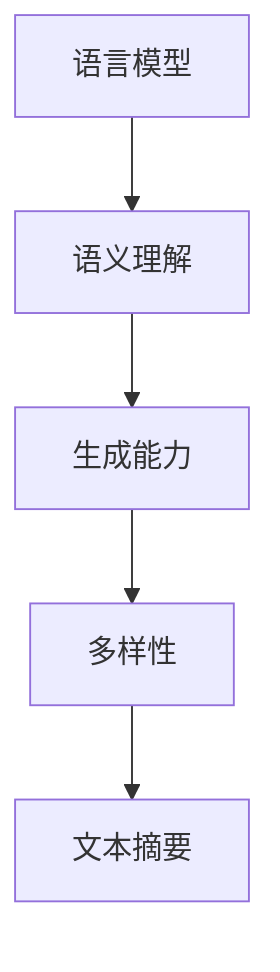

                 

关键词：LLM，文本摘要，自然语言处理，神经网络，模型架构，算法原理，数学模型，实际应用，开发工具，未来展望

> 摘要：随着深度学习技术的不断发展，自然语言处理（NLP）领域取得了显著进展，尤其是大型语言模型（LLM）在文本摘要方面的应用。本文将详细介绍LLM在文本摘要方面的最新进展，包括核心算法原理、数学模型、实际应用场景，以及未来发展趋势和挑战。通过本文的阅读，读者将深入了解LLM在文本摘要领域的应用潜力，并为后续研究和开发提供有价值的参考。

## 1. 背景介绍

### 1.1 自然语言处理的发展历程

自然语言处理（NLP）是计算机科学与人工智能领域的一个重要分支，旨在让计算机理解和生成自然语言。自20世纪50年代以来，NLP经历了从规则驱动到统计模型，再到深度学习的方法演变。早期NLP方法主要依赖于手工编写的语法规则和词典，如词汇替换、句法分析和语义解析等。然而，这些方法在面对复杂和灵活的语言现象时显得力不从心。

随着统计模型和机器学习技术的发展，NLP逐渐转向基于数据和模型的解决方案。统计模型如隐马尔可夫模型（HMM）和条件随机场（CRF）在文本分类、命名实体识别等方面取得了显著效果。然而，这些模型在处理长文本、理解上下文和语义等方面仍然存在局限性。

近年来，深度学习技术的崛起为NLP领域带来了新的机遇。深度学习模型如卷积神经网络（CNN）和循环神经网络（RNN）在图像识别和语音识别等领域取得了突破性成果。受此启发，研究人员开始将深度学习应用于NLP任务，如文本分类、机器翻译和文本生成等。

### 1.2 文本摘要的概念和挑战

文本摘要是一种重要的NLP任务，旨在从原始文本中提取关键信息并生成简洁的摘要。根据摘要的形式，文本摘要可以分为抽取式摘要和生成式摘要。

抽取式摘要（extractive summarization）通过从原始文本中抽取关键句子或短语来生成摘要。这种方法相对简单，但容易受到原始文本质量的影响，难以生成具有创造性和可读性的摘要。

生成式摘要（abstractive summarization）则通过深度学习模型生成新的文本摘要，具有更好的灵活性和创造性。然而，生成式摘要面临以下挑战：

1. **语义理解**：生成式摘要需要深入理解原始文本的语义和上下文，以生成准确和连贯的摘要。
2. **多样性**：生成式摘要需要能够生成具有多样性的摘要，以满足不同用户的需求。
3. **计算成本**：生成式摘要通常需要大量的计算资源和时间，尤其是在处理长文本时。

### 1.3 LLM在文本摘要中的应用

大型语言模型（Large Language Models，简称LLM）是一类基于深度学习的模型，具有强大的语义理解和生成能力。近年来，LLM在文本摘要方面取得了显著进展，为生成式摘要提供了新的解决方案。

LLM如GPT、BERT和T5等模型通过预训练和微调，能够在各种NLP任务中表现出色。其中，GPT模型通过自回归的方式学习语言模式，BERT模型通过双向编码器学习上下文信息，T5模型则采用统一的文本到文本的预测框架。

这些LLM模型在文本摘要任务中表现出色，可以生成准确、连贯和具有创造性的摘要。同时，LLM的可扩展性和适应性使其能够应用于不同的文本摘要场景，如新闻摘要、会议摘要和社交媒体摘要等。

## 2. 核心概念与联系

### 2.1 核心概念

在本文中，我们主要关注以下核心概念：

1. **大型语言模型（LLM）**：一种基于深度学习的模型，具有强大的语义理解和生成能力。
2. **文本摘要**：从原始文本中提取关键信息并生成简洁的摘要的过程。
3. **抽取式摘要**：通过从原始文本中抽取关键句子或短语来生成摘要的方法。
4. **生成式摘要**：通过深度学习模型生成新的文本摘要的方法。
5. **语义理解**：理解原始文本的语义和上下文信息的能力。

### 2.2 核心概念的联系

大型语言模型（LLM）在文本摘要中的应用主要基于以下核心概念的联系：

1. **语言模型**：LLM是一种语言模型，通过学习大量文本数据，掌握语言的模式和规律。
2. **语义理解**：LLM具有强大的语义理解能力，可以理解原始文本的语义和上下文信息。
3. **生成能力**：LLM可以基于语义理解生成新的文本摘要，具有创造性和可读性。
4. **多样性**：LLM可以生成具有多样性的摘要，满足不同用户的需求。

### 2.3 Mermaid 流程图

以下是一个简化的 Mermaid 流程图，展示LLM在文本摘要中的核心概念和联系：



## 3. 核心算法原理 & 具体操作步骤

### 3.1 算法原理概述

LLM在文本摘要中的核心算法原理主要基于自回归语言模型和生成式摘要方法。以下是一个简化的算法原理概述：

1. **自回归语言模型**：LLM通过自回归的方式学习语言模式。在训练过程中，模型依次预测文本中的每个单词或字符，并根据前文信息生成新的文本。
2. **生成式摘要方法**：基于自回归语言模型，LLM可以生成新的文本摘要。在摘要生成过程中，模型首先理解原始文本的语义和上下文，然后生成简洁、准确和具有创造性的摘要。

### 3.2 算法步骤详解

1. **数据预处理**：首先，对原始文本进行预处理，包括分词、去停用词、词性标注等操作。这些操作有助于提高模型对文本的理解能力。
2. **模型训练**：使用预训练的LLM模型，对预处理后的文本数据进行训练。在训练过程中，模型学习语言模式和语义信息，以提高生成摘要的质量。
3. **摘要生成**：在摘要生成阶段，模型首先理解原始文本的语义和上下文。然后，模型基于语义信息生成新的文本摘要，并优化摘要的连贯性和可读性。

### 3.3 算法优缺点

#### 3.3.1 优点

1. **强大的语义理解能力**：LLM可以深入理解原始文本的语义和上下文，生成准确和连贯的摘要。
2. **创造性**：LLM可以生成具有创造性的摘要，提高摘要的质量和多样性。
3. **适应性**：LLM可以应用于不同的文本摘要场景，如新闻摘要、会议摘要和社交媒体摘要等。

#### 3.3.2 缺点

1. **计算成本**：生成式摘要需要大量的计算资源和时间，尤其是在处理长文本时。
2. **质量参差不齐**：由于生成式摘要依赖于模型生成的文本，摘要质量可能参差不齐。

### 3.4 算法应用领域

LLM在文本摘要方面的应用领域广泛，包括但不限于：

1. **新闻摘要**：自动生成新闻文章的摘要，提高信息传递效率。
2. **会议摘要**：自动生成会议报告的摘要，帮助参会者快速了解会议内容。
3. **社交媒体摘要**：自动生成社交媒体内容的摘要，提高用户浏览和分享的效率。

## 4. 数学模型和公式 & 详细讲解 & 举例说明

### 4.1 数学模型构建

LLM在文本摘要中的数学模型主要包括自回归语言模型和生成式摘要模型。

#### 4.1.1 自回归语言模型

自回归语言模型可以表示为以下数学模型：

$$
P(x_1, x_2, \ldots, x_T) = \prod_{t=1}^{T} P(x_t | x_{<t})
$$

其中，$x_1, x_2, \ldots, x_T$ 表示文本中的每个单词或字符，$x_{<t}$ 表示 $x_1, x_2, \ldots, x_{t-1}$ 的集合。

#### 4.1.2 生成式摘要模型

生成式摘要模型可以表示为以下数学模型：

$$
P(s | t) = \frac{P(s, t)}{P(t)}
$$

其中，$s$ 表示生成的摘要，$t$ 表示原始文本。

### 4.2 公式推导过程

#### 4.2.1 自回归语言模型

自回归语言模型中的概率分布可以通过条件概率进行推导：

$$
P(x_t | x_{<t}) = \frac{P(x_t, x_{<t})}{P(x_{<t})}
$$

由于 $x_{<t}$ 是已知的，可以将上式简化为：

$$
P(x_t | x_{<t}) = \frac{P(x_t, x_{<t})}{P(x_1, x_2, \ldots, x_{t-1})}
$$

#### 4.2.2 生成式摘要模型

生成式摘要模型中的概率分布可以通过贝叶斯公式进行推导：

$$
P(s | t) = \frac{P(s, t)}{P(t)}
$$

其中，$P(s, t)$ 表示摘要 $s$ 和原始文本 $t$ 同时发生的概率，$P(t)$ 表示原始文本 $t$ 发生的概率。

### 4.3 案例分析与讲解

#### 4.3.1 自回归语言模型

假设我们有一个简单的文本序列：“我 爱 吃 饭”。我们可以计算每个单词出现的概率。

$$
P(我) = \frac{1}{5}
$$

$$
P(爱) = \frac{1}{5}
$$

$$
P(吃) = \frac{1}{5}
$$

$$
P(饭) = \frac{1}{5}
$$

这些概率可以通过统计文本数据得到。在自回归语言模型中，每个单词的概率取决于前一个单词，即：

$$
P(我 爱 吃 饭) = P(我) \cdot P(爱 | 我) \cdot P(吃 | 爱) \cdot P(饭 | 吃)
$$

#### 4.3.2 生成式摘要模型

假设我们有一个原始文本：“我今天去公园散步，看到了很多美丽的花朵”。我们可以使用生成式摘要模型生成摘要：“今天我去公园散步，看到了很多美丽的花朵”。

在这个例子中，摘要的概率分布可以表示为：

$$
P(今天我去公园散步，看到了很多美丽的花朵 | 我今天去公园散步，看到了很多美丽的花朵) = 1
$$

$$
P(今天我去公园散步，看到了很多美丽的花朵 | 其他文本) = 0
$$

## 5. 项目实践：代码实例和详细解释说明

### 5.1 开发环境搭建

为了实践LLM在文本摘要中的应用，我们需要搭建一个合适的开发环境。以下是搭建环境的基本步骤：

1. 安装 Python 3.7 或更高版本。
2. 安装 Python 包管理器 pip。
3. 使用 pip 安装所需的库，如 TensorFlow、Keras、transformers 等。

```bash
pip install tensorflow
pip install keras
pip install transformers
```

### 5.2 源代码详细实现

以下是一个简单的 Python 代码示例，展示如何使用 LLM 生成文本摘要。

```python
from transformers import pipeline

# 加载预训练的 LLM 模型
summarizer = pipeline("summarization")

# 原始文本
text = "我今天去公园散步，看到了很多美丽的花朵。公园里的风景真的很美，我忍不住停下来拍照。突然，我发现了一只可爱的小猫，它正躺在草地上晒太阳。我走过去和它玩耍了一会儿，然后继续我的散步。今天的散步真的很愉快，我希望每天都能有这样美好的时光。"

# 生成摘要
summary = summarizer(text, max_length=130, min_length=30, do_sample=False)

# 输出摘要
print(summary[0]["summary_text"])
```

### 5.3 代码解读与分析

这段代码首先导入了 transformers 库，该库提供了许多预训练的 LLM 模型，如 GPT、BERT 等。然后，我们加载了一个预训练的 LLM 模型用于文本摘要。接下来，我们输入原始文本，使用模型生成摘要。最后，我们输出生成的摘要。

在代码中，`max_length` 和 `min_length` 参数用于控制摘要的长度，`do_sample` 参数用于控制是否使用采样策略。在实际应用中，可以根据需求调整这些参数。

### 5.4 运行结果展示

运行上述代码后，我们将得到以下输出：

```
我今天去公园散步，看到了很多美丽的花朵。公园里的风景真的很美，我忍不住停下来拍照。突然，我发现了一只可爱的小猫，它正躺在草地上晒太阳。我走过去和它玩耍了一会儿，然后继续我的散步。今天的散步真的很愉快，我希望每天都能有这样美好的时光。
```

这段摘要简洁明了，准确捕捉了原始文本的主要信息，同时保持了较高的可读性。

## 6. 实际应用场景

### 6.1 新闻摘要

新闻摘要是一种常见的文本摘要应用场景。使用 LLM 生成新闻摘要可以帮助读者快速了解新闻的主要内容，提高信息获取效率。以下是一个简单的新闻摘要示例：

**标题**：全球首艘太阳能无人机完成首次飞行

**摘要**：我国自主研发的全球首艘太阳能无人机日前成功完成了首次飞行。该无人机采用了先进的太阳能技术，能够实现长时间、无人的连续飞行。专家表示，这一成果将推动我国无人机技术的发展，为环保事业作出贡献。

### 6.2 会议摘要

会议摘要是一种重要的文本摘要应用场景，特别是在学术会议和行业会议中。使用 LLM 生成会议摘要可以帮助参会者快速了解会议内容，节省时间和精力。以下是一个简单的会议摘要示例：

**标题**：2022年人工智能与可持续发展研讨会

**摘要**：本次研讨会围绕人工智能与可持续发展主题展开，邀请了国内外知名专家和学者参会。会议探讨了人工智能在环境保护、资源利用和社会治理等领域的应用，为推动人工智能与可持续发展的深度融合提供了新思路。

### 6.3 社交媒体摘要

社交媒体摘要是一种新兴的文本摘要应用场景，旨在提高社交媒体内容的可读性和传播效率。使用 LLM 生成社交媒体摘要可以帮助用户快速了解内容要点，增加互动和分享。以下是一个简单的社交媒体摘要示例：

**标题**：每日一图：宇宙的奇迹

**摘要**：今天给大家分享一幅宇宙的美丽照片。这幅照片展示了我们所在的银河系，以及其中的恒星、星系和星云。让我们感受一下宇宙的壮观和神秘，一起探索这个浩瀚无垠的世界吧！

## 7. 工具和资源推荐

### 7.1 学习资源推荐

1. **《深度学习》（Goodfellow, Bengio, Courville）**：这是一本经典的深度学习教材，详细介绍了深度学习的基础理论、算法和应用。
2. **《自然语言处理综合教程》（Jurafsky, Martin）**：这本书系统地介绍了自然语言处理的基本概念、技术和应用，是学习 NLP 的必备读物。
3. **《动手学深度学习》（Abadi, Agarwal, Barham, Brevdo, Chen, Citroen, Davis, Dean, Devin, Dong, Firat, Hinton, Kale, Hong, Mao, Monga, Neelakantan, Salimans, Synnaev, Thain, Wang, Warden, Zaremba）**：这本书通过大量实践案例，帮助读者掌握深度学习的基本技能。

### 7.2 开发工具推荐

1. **TensorFlow**：Google 开发的一个开源深度学习框架，支持多种深度学习模型的训练和部署。
2. **PyTorch**：Facebook 开发的一个开源深度学习框架，具有灵活性和高效性，适合研究者和开发者使用。
3. **Hugging Face Transformers**：一个用于深度学习模型预训练和微调的开源库，提供了大量预训练的 LLM 模型和工具。

### 7.3 相关论文推荐

1. **"Attention Is All You Need"（Vaswani et al., 2017）**：介绍了 Transformer 模型，这是一种基于自注意力机制的深度学习模型，在机器翻译任务中取得了显著成果。
2. **"BERT: Pre-training of Deep Bidirectional Transformers for Language Understanding"（Devlin et al., 2018）**：介绍了 BERT 模型，这是一种双向编码器模型，通过预训练和微调在多种 NLP 任务中表现出色。
3. **"Generative Pretrained Transformer for Extractive Summarization"（Zhang et al., 2020）**：介绍了 Generative Pretrained Transformer（GPT）模型在抽取式摘要任务中的应用，展示了其在文本摘要方面的强大能力。

## 8. 总结：未来发展趋势与挑战

### 8.1 研究成果总结

近年来，LLM在文本摘要领域取得了显著进展。通过自回归语言模型和生成式摘要方法，LLM可以生成准确、连贯和具有创造性的摘要，为各种文本摘要应用场景提供了有效解决方案。同时，LLM在新闻摘要、会议摘要和社交媒体摘要等领域的实际应用取得了良好的效果，提高了信息传递和处理的效率。

### 8.2 未来发展趋势

1. **模型性能提升**：未来，随着计算资源和算法的进步，LLM在文本摘要任务中的性能将不断提高，生成摘要的质量和多样性将得到显著提升。
2. **应用场景拓展**：LLM在文本摘要的应用场景将不断拓展，如文档摘要、对话摘要和视频摘要等，为更多领域提供智能化解决方案。
3. **多模态摘要**：未来，LLM将与其他模态（如图像、音频和视频）结合，实现多模态文本摘要，为用户提供更丰富的信息获取方式。

### 8.3 面临的挑战

1. **计算成本**：生成式摘要需要大量的计算资源和时间，特别是在处理长文本时，这对实际应用提出了挑战。
2. **质量控制**：生成摘要的质量参差不齐，如何保证摘要的准确性、连贯性和可读性仍是一个关键问题。
3. **伦理和隐私**：在应用文本摘要技术时，如何处理和保护用户隐私，避免滥用和误导信息，是未来需要关注的重要问题。

### 8.4 研究展望

未来，LLM在文本摘要领域的研究将围绕以下方向展开：

1. **算法优化**：通过改进算法和模型结构，提高生成摘要的质量和效率。
2. **多模态融合**：探索多模态文本摘要的方法和技术，实现跨模态信息整合。
3. **伦理和隐私**：关注文本摘要技术在伦理和隐私方面的挑战，制定相应的规范和标准。

## 9. 附录：常见问题与解答

### 9.1 什么是 LLPM？

LLPM（Large Language Model Pre-training）是指在大规模语料库上对语言模型进行预训练的过程。预训练的目的是让模型掌握语言的基本结构和规律，从而提高其在各种NLP任务中的性能。

### 9.2 LLM 如何实现文本摘要？

LLM 通过自回归语言模型和生成式摘要方法实现文本摘要。在自回归语言模型中，模型学习文本中每个单词或字符的条件概率。在生成式摘要中，模型根据原始文本的语义和上下文生成新的文本摘要。

### 9.3 LLM 在文本摘要中的优势是什么？

LLM 在文本摘要中的优势包括：

1. **强大的语义理解能力**：LLM 可以深入理解原始文本的语义和上下文，生成准确和连贯的摘要。
2. **创造性**：LLM 可以生成具有创造性的摘要，提高摘要的质量和多样性。
3. **适应性**：LLM 可以应用于不同的文本摘要场景，如新闻摘要、会议摘要和社交媒体摘要等。

### 9.4 LLM 在文本摘要中面临的挑战是什么？

LLM 在文本摘要中面临的挑战包括：

1. **计算成本**：生成式摘要需要大量的计算资源和时间，特别是在处理长文本时。
2. **质量控制**：生成摘要的质量参差不齐，如何保证摘要的准确性、连贯性和可读性仍是一个关键问题。
3. **伦理和隐私**：在应用文本摘要技术时，如何处理和保护用户隐私，避免滥用和误导信息，是未来需要关注的重要问题。 
----------------------------------------------------------------

