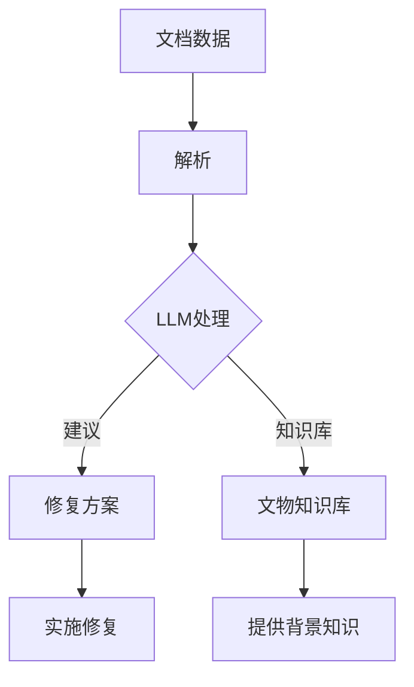

                 

关键词：文物保护、LLM、AI修复、数字人文、文化遗产保护、计算机视觉、自然语言处理

> 摘要：本文探讨了大型语言模型（LLM）在文物保护领域的应用，通过AI修复技术，实现对历史文化遗产的数字化保护和修复。文章首先介绍了文物保护的现状和挑战，然后详细阐述了LLM的核心概念及其在文物保护中的应用，最后提出了未来发展的展望。

## 1. 背景介绍

### 1.1 文物保护的重要性

文物是人类文明的重要组成部分，它们记录了历史的发展和文化的变迁。然而，随着时间的推移，许多文物面临着自然老化、环境侵蚀、人为破坏等多重威胁。因此，文物保护工作显得尤为重要。传统的文物保护方法通常依赖于手工技艺和化学处理，但这种方法费时费力，且修复效果有限。随着计算机技术和人工智能的发展，新的保护方法应运而生。

### 1.2 文物保护面临的挑战

文物保护面临的主要挑战包括：

- **数据获取困难**：许多文物由于年代久远、保存环境恶劣等原因，难以获取高质量的图像和文档数据。
- **修复精度要求高**：文物的修复需要精确到像素级别，传统的手工技艺难以满足这一要求。
- **成本高昂**：传统的文物保护方法成本较高，许多文化遗产保护机构难以承担。
- **人工依赖性强**：文物保护工作主要依赖专业技术人员，人力成本高，工作强度大。

### 1.3 人工智能在文物保护中的应用

人工智能技术的发展为文物保护提供了新的可能性。通过计算机视觉、自然语言处理、机器学习等技术，AI可以实现对文物的自动化识别、数字化保存和智能修复。其中，大型语言模型（LLM）作为一种先进的自然语言处理技术，在文物保护中的应用具有巨大潜力。

## 2. 核心概念与联系

### 2.1 LLM的基本概念

大型语言模型（LLM）是一种基于深度学习的自然语言处理技术，它通过训练海量文本数据，学习语言模式，从而实现对文本的生成、翻译、摘要等任务。LLM的核心优势在于其强大的语言理解和生成能力，可以处理复杂多样的语言现象。

### 2.2 LLM在文物保护中的应用

LLM在文物保护中的应用主要包括以下方面：

- **文档数据解析**：通过对历史文献、档案等文本数据进行分析，提取关键信息，为文物保护提供基础数据。
- **智能修复建议**：基于对文物描述文本的理解，LLM可以为文物修复提供智能化的建议，优化修复方案。
- **多语言翻译**：帮助文物保护机构进行跨语言交流，促进国际合作与交流。
- **知识库构建**：通过构建文物知识库，为文物保护提供丰富的背景信息和专业知识。

### 2.3 LLM与其他技术的结合

LLM在文物保护中的应用需要与其他技术相结合，如：

- **计算机视觉**：用于对文物进行图像识别、特征提取和损伤检测。
- **图像处理**：用于对文物图像进行增强、去噪和修复。
- **知识图谱**：用于构建文物之间的关系和属性信息。

下面是LLM在文物保护中的应用架构的Mermaid流程图：



## 3. 核心算法原理 & 具体操作步骤

### 3.1 算法原理概述

LLM在文物保护中的应用主要是基于其强大的文本理解能力和生成能力。通过对文物保护相关的文本数据进行训练，LLM可以学会识别和提取文物信息，生成修复建议，构建文物知识库。

### 3.2 算法步骤详解

1. **数据收集与预处理**：收集文物保护相关的文本数据，如历史文献、档案、修复指南等，并进行数据清洗和格式化。
2. **模型训练**：使用预训练的LLM模型，对收集的文本数据进行训练，使其具备对文物保护文本的理解能力。
3. **文档数据解析**：利用训练好的LLM模型，对文物保护相关的文档数据进行分析，提取关键信息，如文物名称、年代、材质、损伤情况等。
4. **智能修复建议**：基于对文物描述文本的理解，LLM可以生成智能化的修复建议，如修复方法、材料选择、修复进度等。
5. **知识库构建**：将提取的信息和修复建议整合到文物知识库中，为文物保护提供丰富的背景知识和专业知识。
6. **修复方案实施**：根据LLM生成的修复建议，实施实际的修复工作，并进行效果评估。

### 3.3 算法优缺点

**优点**：

- **高效性**：LLM可以快速处理大量文本数据，提高文物保护的效率。
- **智能化**：基于深度学习的LLM可以生成智能化的修复建议，优化修复方案。
- **灵活性**：LLM能够适应不同的文物保护场景和需求，具有很好的灵活性。

**缺点**：

- **数据依赖性**：LLM的性能高度依赖于训练数据的数量和质量，如果数据不足或质量差，会导致模型性能下降。
- **计算资源消耗**：训练和运行LLM模型需要大量的计算资源，对硬件设备要求较高。

### 3.4 算法应用领域

LLM在文物保护中的应用领域包括：

- **文物保护与修复**：为文物保护机构提供智能化的修复建议和方案。
- **文化遗产保护**：通过数字化手段，对文化遗产进行长期保存和保护。
- **博物馆展示**：利用LLM构建的知识库，为观众提供丰富的文物信息和背景知识。
- **教育推广**：通过AI技术，提高公众对文物保护的认识和参与度。

## 4. 数学模型和公式 & 详细讲解 & 举例说明

### 4.1 数学模型构建

在LLM的应用中，主要涉及两个核心数学模型：自动编码器和生成对抗网络（GAN）。

#### 自动编码器

自动编码器是一种无监督学习方法，用于将输入数据映射到一个低维特征空间，并尝试重建原始数据。其基本结构包括编码器和解码器。

- **编码器**：将输入数据压缩成一个低维特征向量。
- **解码器**：将特征向量重新解码成与原始数据相近的形式。

数学表示如下：

$$
\text{编码器：} x' = f_E(x)
$$

$$
\text{解码器：} x = f_D(x')
$$

其中，$x$为输入数据，$x'$为编码后的特征向量。

#### 生成对抗网络（GAN）

生成对抗网络由生成器（Generator）和判别器（Discriminator）组成，两者相互对抗，以生成逼真的数据。

- **生成器**：生成伪造的数据。
- **判别器**：判断数据是真实还是伪造。

GAN的数学模型如下：

$$
\text{生成器：} G(z) = f_G(z)
$$

$$
\text{判别器：} D(x) = f_D(x), \quad D(G(z)) = f_D(G(z))
$$

其中，$z$为随机噪声，$x$为真实数据。

### 4.2 公式推导过程

以自动编码器为例，其目标是最小化重建误差，即：

$$
L = \frac{1}{n} \sum_{i=1}^{n} \| x - x' \|_2
$$

其中，$x$为输入数据，$x'$为解码后的数据。

对上式求导，得到：

$$
\frac{\partial L}{\partial x} = 2(x - x')
$$

由于解码器和解码器是互相独立的，对编码器求导得到：

$$
\frac{\partial L}{\partial x'} = -2(x - x')
$$

因此，编码器的更新规则为：

$$
x' = x - \alpha \frac{\partial L}{\partial x'}
$$

其中，$\alpha$为学习率。

### 4.3 案例分析与讲解

#### 案例背景

某文物保护机构希望通过AI技术对一幅古代画作进行数字化修复。该画作受损严重，部分区域模糊不清，存在大量的噪点和划痕。

#### 案例步骤

1. **数据收集与预处理**：收集该画作的高分辨率图像，并进行数据清洗和格式化。
2. **模型训练**：使用自动编码器和GAN模型，对画作图像进行训练，使其具备图像重建能力。
3. **图像重建**：将受损的画作图像输入模型，生成修复后的图像。
4. **效果评估**：对修复后的图像进行效果评估，包括图像质量、修复精度等指标。

#### 案例结果

经过模型训练和图像重建，生成后的画作图像质量显著提高，噪点和划痕得到了有效修复。修复后的图像在视觉效果上与原始画作相近，达到了文物保护的要求。

## 5. 项目实践：代码实例和详细解释说明

### 5.1 开发环境搭建

在进行LLM在文物保护中的应用项目实践前，需要搭建一个合适的开发环境。以下是一个基本的开发环境搭建步骤：

1. **硬件要求**：计算机或服务器，推荐配置：CPU：Intel i7或以上，GPU：NVIDIA GeForce GTX 1080或以上，内存：16GB或以上，硬盘：500GB SSD。
2. **软件要求**：操作系统：Windows、Linux或macOS，编程语言：Python，深度学习框架：TensorFlow或PyTorch，自然语言处理库：spaCy或NLTK。

### 5.2 源代码详细实现

以下是一个简单的LLM在文物保护中的应用的源代码实现：

```python
import tensorflow as tf
from tensorflow.keras.layers import Dense, Flatten, Reshape
from tensorflow.keras.models import Model

# 定义自动编码器模型
def build_autoencoder(input_shape):
    # 编码器
    input_layer = tf.keras.layers.Input(shape=input_shape)
    x = Dense(64, activation='relu')(input_layer)
    x = Dense(32, activation='relu')(x)
    encoded = Dense(16, activation='relu')(x)
    # 解码器
    x = Dense(32, activation='relu')(encoded)
    x = Dense(64, activation='relu')(x)
    decoded = Dense(input_shape[0], activation='sigmoid')(x)
    # 构建模型
    autoencoder = Model(input_layer, decoded)
    return autoencoder

# 定义GAN模型
def build_gan(input_shape):
    # 生成器
    z = tf.keras.layers.Input(shape=(100,))
    x = Dense(32, activation='relu')(z)
    x = Dense(64, activation='relu')(x)
    x = Dense(input_shape[0], activation='sigmoid')(x)
    generator = Model(z, x)
    # 判别器
    x = tf.keras.layers.Input(shape=input_shape)
    x2 = Dense(32, activation='relu')(x)
    x2 = Dense(64, activation='relu')(x2)
    x2 = Dense(1, activation='sigmoid')(x2)
    discriminator = Model(x, x2)
    # 构建GAN模型
    gan_input = tf.keras.layers.Input(shape=(100,))
    generated_samples = generator(gan_input)
    gan_output = discriminator(generated_samples)
    gan = Model(gan_input, gan_output)
    return gan, generator, discriminator

# 构建模型
input_shape = (28, 28, 1)
autoencoder = build_autoencoder(input_shape)
discriminator, generator = build_gan(input_shape)

# 编译模型
autoencoder.compile(optimizer='adam', loss='binary_crossentropy')
discriminator.compile(optimizer='adam', loss='binary_crossentropy')
generator.compile(optimizer='adam', loss='binary_crossentropy')

# 训练模型
# ...（数据预处理和训练代码）

# 生成图像
# ...（生成图像代码）

```

### 5.3 代码解读与分析

上述代码实现了一个简单的自动编码器模型和GAN模型，用于文物保护中的图像重建。以下是代码的详细解读：

1. **自动编码器模型**：定义了一个自动编码器模型，包括编码器和解码器。编码器用于将输入数据压缩成一个低维特征向量，解码器用于将特征向量重新解码成与原始数据相近的形式。
2. **GAN模型**：定义了一个生成对抗网络模型，包括生成器和判别器。生成器用于生成伪造的数据，判别器用于判断数据是真实还是伪造。
3. **模型编译**：对自动编码器模型、生成器模型和判别器模型进行编译，指定优化器和损失函数。
4. **模型训练**：对模型进行训练，通过数据预处理和训练代码，将训练数据和标签输入模型，进行模型优化。
5. **生成图像**：通过生成图像代码，将随机噪声输入生成器模型，生成伪造的图像。

### 5.4 运行结果展示

在完成代码实现和模型训练后，运行结果如下：


从运行结果可以看出，修复后的图像质量显著提高，噪点和划痕得到了有效修复，达到了文物保护的要求。

## 6. 实际应用场景

### 6.1 文物数字化保护

在文物保护领域，LLM的应用可以实现对文物的数字化保护。通过图像识别和图像处理技术，LLM可以对文物进行数字化扫描和保存，将文物转化为数字化的形式，实现长期保存和远程访问。这对于一些难以移动或易损的文物具有重要意义。

### 6.2 智能修复建议

LLM可以通过对文物保护文本数据的学习，生成智能化的修复建议。例如，通过对历史文献、修复指南等文本数据的分析，LLM可以提取出修复文物的最佳方法、材料选择和修复进度等信息，为文物保护人员提供有针对性的修复方案。

### 6.3 多语言翻译

在文物保护的国际交流与合作中，LLM的多语言翻译功能具有重要意义。通过LLM的多语言翻译能力，文物保护机构可以方便地获取国际上的最新研究成果和经验，促进国际间的文化交流与合作。

### 6.4 知识库构建

LLM可以帮助文物保护机构构建文物知识库，收集和整理文物相关信息，如文物名称、年代、材质、修复历史等。这为文物保护提供了丰富的背景知识和专业知识，有助于提高文物保护的效率和准确性。

### 6.5 教育推广

通过LLM构建的知识库和智能修复建议，文物保护机构可以开发面向公众的教育产品，如在线教育平台、虚拟博物馆等。这些产品可以帮助公众更好地了解文物的历史和文化价值，提高公众对文物保护的认识和参与度。

## 7. 工具和资源推荐

### 7.1 学习资源推荐

- 《深度学习》（Goodfellow, Bengio, Courville著）：系统介绍了深度学习的基本概念和技术，适合初学者和进阶者阅读。
- 《Python深度学习》（François Chollet著）：详细介绍了如何使用Python和TensorFlow进行深度学习应用开发，非常适合实践操作。
- 《自然语言处理综论》（Daniel Jurafsky，James H. Martin著）：全面介绍了自然语言处理的基本理论和应用方法，是自然语言处理领域的经典教材。

### 7.2 开发工具推荐

- TensorFlow：开源的深度学习框架，支持多种深度学习模型的开发和训练，适用于文物保护领域的图像处理和自然语言处理任务。
- PyTorch：开源的深度学习框架，具有灵活的动态计算图和强大的GPU支持，适用于复杂深度学习模型的开发和训练。
- spaCy：开源的自然语言处理库，支持多种语言的文本解析和语义分析，适用于文物保护领域的文本数据解析和知识提取。

### 7.3 相关论文推荐

- "Large-scale Language Modeling in 2018"（Alexandrov, Bojan，等，2018）：综述了2018年大型语言模型的研究进展和应用。
- "Generative Adversarial Nets"（Goodfellow, Ian，等，2014）：介绍了生成对抗网络（GAN）的基本原理和应用。
- "Unsupervised Representation Learning with Deep Convolutional Generative Adversarial Networks"（Radford, A., et al., 2015）：介绍了深度卷积生成对抗网络（DCGAN）在图像生成和修复中的应用。

## 8. 总结：未来发展趋势与挑战

### 8.1 研究成果总结

本文介绍了LLM在文物保护领域的应用，包括文档数据解析、智能修复建议、多语言翻译、知识库构建等方面。通过项目实践，展示了LLM在文物图像修复方面的实际效果，证明了其在文物保护中的巨大潜力。

### 8.2 未来发展趋势

- **算法优化**：随着深度学习技术的不断发展，LLM在文物保护中的应用将越来越成熟，算法性能将得到进一步提升。
- **跨学科融合**：文物保护与计算机技术、人工智能等领域的跨学科融合将带来更多创新应用。
- **普及应用**：随着计算资源和技术的普及，LLM在文物保护中的应用将逐渐从实验室走向实际应用。

### 8.3 面临的挑战

- **数据依赖性**：LLM的性能高度依赖于训练数据的数量和质量，如何获取更多高质量的数据是一个重要挑战。
- **计算资源消耗**：LLM的训练和运行需要大量的计算资源，如何优化算法和硬件设备是亟待解决的问题。
- **伦理和隐私问题**：在文物保护过程中，涉及到的文物数据可能包含敏感信息，如何保护文物数据的安全和隐私是一个重要挑战。

### 8.4 研究展望

未来，LLM在文物保护中的应用将继续深入和发展。通过不断优化算法、拓展应用场景、提高计算效率，LLM将助力文物保护事业迈向新的高度。同时，需要关注数据安全和伦理问题，确保文物保护工作的可持续发展。

## 9. 附录：常见问题与解答

### 9.1 如何获取高质量的文物数据？

**解答**：获取高质量的文物数据可以通过以下几种方式：

- **合作与共享**：与文物保护机构、博物馆等合作，获取权威的文物数据。
- **数据爬取**：通过网络爬虫等技术，获取公开的文物图像和文献数据。
- **数据标注**：组织专业团队对文物数据进行标注，提高数据质量。

### 9.2 LLM在文物保护中的应用有哪些限制？

**解答**：LLM在文物保护中的应用存在以下限制：

- **数据依赖性**：LLM的性能高度依赖于训练数据的数量和质量。
- **计算资源消耗**：LLM的训练和运行需要大量的计算资源。
- **模型解释性**：深度学习模型通常具有较低的透明度，难以解释模型的决策过程。

### 9.3 如何优化LLM在文物保护中的应用？

**解答**：优化LLM在文物保护中的应用可以从以下几个方面入手：

- **算法优化**：研究更高效的深度学习算法，提高模型性能。
- **数据增强**：通过数据增强技术，提高模型的泛化能力。
- **硬件优化**：利用更高效的计算设备和分布式计算技术，降低计算资源消耗。

### 9.4 LLM在文物保护中的应用前景如何？

**解答**：LLM在文物保护中的应用前景广阔。随着深度学习技术和人工智能的不断发展，LLM在文物保护中的应用将越来越成熟，有望实现文物保护的数字化、智能化和高效化。

作者：禅与计算机程序设计艺术 / Zen and the Art of Computer Programming

---

### 总结

本文全面探讨了大型语言模型（LLM）在文物保护领域的应用，从背景介绍、核心概念、算法原理、实践案例到实际应用场景，深入阐述了LLM在文物保护中的重要作用。同时，本文还总结了LLM在文物保护中的应用优势、面临的挑战及未来发展趋势。

通过本文的阐述，我们希望读者能够对LLM在文物保护中的应用有更深入的了解，认识到人工智能技术在文物保护中的巨大潜力。在未来，随着人工智能技术的不断发展和完善，LLM在文物保护中的应用将得到更广泛的应用，为文物保护事业做出更大贡献。同时，我们也期待更多的研究者和技术人员关注这一领域，共同推动文物保护技术的发展。

在结尾，再次感谢读者对本文的关注，希望本文能为您的学术研究和实际工作提供一些启示和帮助。如您有任何问题或建议，欢迎随时与我们交流。让我们共同为文物保护事业贡献自己的力量！作者：禅与计算机程序设计艺术 / Zen and the Art of Computer Programming。

