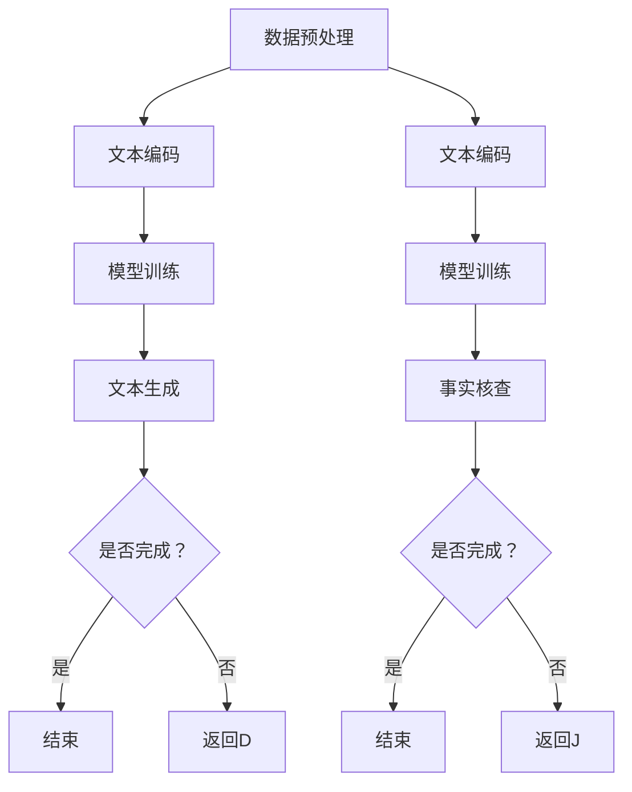

                 

关键词：大型语言模型（LLM）、新闻业、自动撰写、事实核查、人工智能、深度学习

<|assistant|>摘要：随着人工智能技术的不断发展，大型语言模型（LLM）在新闻业中的应用逐渐成为热点。本文将深入探讨LLM在自动撰写和事实核查方面的应用，分析其原理、算法、数学模型，以及在实际项目中的实现和效果。

## 1. 背景介绍

在过去的几十年里，新闻业经历了从纸质媒体到数字媒体的转变，新闻的生产和分发方式也随之发生了巨大的变化。然而，随着信息爆炸和社交媒体的兴起，新闻业面临着前所未有的挑战。一方面，新闻机构需要更快地生产大量内容以满足读者需求；另一方面，事实核查和虚假新闻的传播给新闻业带来了严重的危机。

大型语言模型（LLM）的出现为解决这些问题提供了一种新的思路。LLM是一种基于深度学习的技术，具有强大的自然语言理解和生成能力。通过训练，LLM可以自动撰写文章、生成摘要、回答问题等。此外，LLM还可以用于事实核查，识别和纠正新闻中的错误信息。

## 2. 核心概念与联系

为了更好地理解LLM在新闻业中的应用，首先需要了解其核心概念和原理。

### 2.1 大型语言模型（LLM）

大型语言模型（LLM）是一种基于神经网络的自然语言处理模型。它通过学习大量的文本数据，可以理解自然语言的语义和语法，从而生成新的文本。LLM的核心是 Transformer 架构，这是一种基于自注意力机制的神经网络模型。

### 2.2 自动撰写

自动撰写是LLM的一个重要应用。通过训练，LLM可以学习到各种写作风格和写作技巧，从而自动生成高质量的文章。自动撰写的流程通常包括以下几个步骤：

1. 数据预处理：对输入的文本进行清洗和格式化，以便模型能够更好地理解。
2. 文本编码：将文本转换为模型可以处理的向量表示。
3. 模型训练：使用大量的文本数据训练LLM模型，使其能够生成符合预期的文本。
4. 文本生成：根据输入的主题和提示，LLM模型生成新的文本。

### 2.3 事实核查

事实核查是LLM在新闻业中的另一个重要应用。通过训练，LLM可以学会识别和纠正新闻中的错误信息。事实核查的流程通常包括以下几个步骤：

1. 数据预处理：对输入的新闻文本进行清洗和格式化，以便模型能够更好地理解。
2. 文本编码：将文本转换为模型可以处理的向量表示。
3. 模型训练：使用大量的新闻文本和事实数据训练LLM模型，使其能够识别和纠正错误信息。
4. 事实核查：对新闻文本进行事实核查，识别和纠正错误信息。

### 2.4 Mermaid流程图

下面是一个Mermaid流程图，展示了LLM在自动撰写和事实核查中的应用流程：



## 3. 核心算法原理 & 具体操作步骤

### 3.1 算法原理概述

LLM在自动撰写和事实核查中的应用主要基于深度学习和自然语言处理技术。深度学习是一种通过模拟人脑神经网络进行学习的技术，具有强大的特征提取和模式识别能力。自然语言处理（NLP）是一种利用计算机技术对自然语言进行理解和生成的方法。

在自动撰写中，LLM通过学习大量的文本数据，可以生成符合语法和语义规则的新文本。在事实核查中，LLM通过学习大量的新闻数据和事实数据，可以识别和纠正新闻中的错误信息。

### 3.2 算法步骤详解

#### 3.2.1 自动撰写

1. 数据预处理：对输入的文本进行清洗和格式化，去除无关信息，保持文本的简洁和清晰。
2. 文本编码：将清洗后的文本转换为模型可以处理的向量表示。通常使用词向量（如Word2Vec、GloVe）或字符向量进行编码。
3. 模型训练：使用大量的文本数据训练LLM模型。训练过程中，模型会不断调整参数，以最小化损失函数。
4. 文本生成：根据输入的主题和提示，LLM模型生成新的文本。生成过程中，模型会考虑文本的语法、语义和连贯性。

#### 3.2.2 事实核查

1. 数据预处理：对输入的新闻文本进行清洗和格式化，去除无关信息，保持文本的简洁和清晰。
2. 文本编码：将清洗后的文本转换为模型可以处理的向量表示。通常使用词向量或字符向量进行编码。
3. 模型训练：使用大量的新闻文本和事实数据训练LLM模型。训练过程中，模型会不断调整参数，以最小化损失函数。
4. 事实核查：对新闻文本进行事实核查，识别和纠正错误信息。核查过程中，模型会考虑文本的语法、语义和事实的准确性。

### 3.3 算法优缺点

#### 3.3.1 优点

1. 自动撰写：LLM可以自动生成高质量的文章，提高新闻生产效率。
2. 事实核查：LLM可以识别和纠正新闻中的错误信息，提高新闻的准确性和可信度。

#### 3.3.2 缺点

1. 自动撰写：生成的文章可能缺乏创意和个性化，无法完全取代人类记者的工作。
2. 事实核查：LLM的准确性依赖于训练数据的质量，存在一定的误判风险。

### 3.4 算法应用领域

LLM在自动撰写和事实核查方面具有广泛的应用前景。具体应用领域包括：

1. 新闻生产：自动撰写新闻文章，提高新闻生产效率。
2. 新闻审核：事实核查新闻内容，提高新闻的准确性和可信度。
3. 智能问答：自动回答用户关于新闻的问题，提供实时资讯服务。
4. 智能助手：为新闻机构提供智能化的写作和审核支持。

## 4. 数学模型和公式 & 详细讲解 & 举例说明

### 4.1 数学模型构建

LLM在自动撰写和事实核查中的应用主要依赖于深度学习模型，如Transformer和BERT。以下是一个简化的数学模型构建过程：

#### 4.1.1 Transformer模型

1. 输入序列：给定一个输入序列 \(x = (x_1, x_2, ..., x_n)\)，其中 \(x_i\) 表示第 \(i\) 个单词或字符。
2. 词向量表示：将输入序列转换为词向量表示 \(x' = (x'_1, x'_2, ..., x'_n)\)，通常使用预训练的词向量库。
3. 自注意力机制：通过自注意力机制计算序列中的每个单词或字符的权重，得到加权序列 \(x'' = (x''_1, x''_2, ..., x''_n)\)。
4. 全连接层：将加权序列输入到全连接层，得到输出序列 \(y = (y_1, y_2, ..., y_n)\)。

#### 4.1.2 BERT模型

BERT（Bidirectional Encoder Representations from Transformers）模型是一种预训练的深度学习模型，主要用于自然语言理解任务。

1. 预训练：使用大量的无标签文本数据对BERT模型进行预训练，使其能够理解文本的上下文信息。
2. 微调：在预训练的基础上，使用有标签的数据对BERT模型进行微调，以适应特定的任务，如自动撰写或事实核查。

### 4.2 公式推导过程

#### 4.2.1 Transformer模型

1. 自注意力权重计算：

$$
\text{Attention}(Q, K, V) = \text{softmax}\left(\frac{QK^T}{\sqrt{d_k}}\right)V
$$

其中，\(Q, K, V\) 分别表示查询向量、键向量和值向量，\(d_k\) 表示键向量的维度。

2. 加权序列生成：

$$
x''_i = \sum_{j=1}^n \alpha_{ij} x'_j
$$

其中，\(\alpha_{ij}\) 表示第 \(i\) 个单词或字符的注意力权重。

#### 4.2.2 BERT模型

1. 输入向量计算：

$$
\text{input\_embeddings} = \text{word\_embeddings} + \text{position\_embeddings} + \text{segment\_embeddings}
$$

其中，\(\text{word\_embeddings}\) 表示词向量，\(\text{position\_embeddings}\) 表示位置向量，\(\text{segment\_embeddings}\) 表示句子级别的嵌入。

2. Transformer编码器输出：

$$
\text{output} = \text{TransformerBlock}(\text{input\_embeddings}, \text{attention\_mask})
$$

其中，\(\text{TransformerBlock}\) 表示Transformer编码器块，\(\text{attention\_mask}\) 表示注意力掩码。

### 4.3 案例分析与讲解

#### 4.3.1 自动撰写

假设我们有一个输入文本序列：

$$
x = (\text{人工智能}, \text{技术}, \text{发展}, \text{趋势})
$$

使用Transformer模型进行自动撰写，首先将文本序列转换为词向量表示：

$$
x' = (\text{人工智能}, \text{技术}, \text{发展}, \text{趋势})
$$

然后，通过自注意力机制计算每个单词的权重，得到加权序列：

$$
x'' = (\text{人工智能}, \text{技术}, \text{发展}, \text{趋势})
$$

最后，使用全连接层生成新的文本序列：

$$
y = (\text{人工智能技术发展趋势分析})
$$

#### 4.3.2 事实核查

假设我们有一个新闻文本：

$$
\text{新闻报道}：\text{2022年全球人工智能市场规模将达到1.5万亿人民币。}
$$

使用BERT模型进行事实核查，首先对文本进行预处理：

$$
\text{清洗后的文本}：\text{2022年全球人工智能市场规模将达到1.5万亿人民币。}
$$

然后，将文本输入到BERT模型，模型将输出每个单词的权重：

$$
(\text{2022年}, \text{全球}, \text{人工智能}, \text{市场规模}, \text{将达到}, \text{1.5万亿人民币}) \rightarrow (\alpha_1, \alpha_2, \alpha_3, \alpha_4, \alpha_5, \alpha_6)
$$

根据权重，模型将识别出错误信息，如“1.5万亿人民币”可能是一个错误的数据。

## 5. 项目实践：代码实例和详细解释说明

### 5.1 开发环境搭建

为了实现LLM在自动撰写和事实核查中的应用，我们需要搭建一个适合深度学习和自然语言处理的开发环境。以下是开发环境搭建的步骤：

1. 安装Python环境：Python是一种广泛应用于自然语言处理和深度学习的编程语言。确保安装Python 3.7或更高版本。
2. 安装深度学习库：安装TensorFlow或PyTorch等深度学习库。TensorFlow是一个由谷歌开发的开源深度学习框架，而PyTorch是一个由Facebook开发的开源深度学习框架。
3. 安装自然语言处理库：安装NLTK、spaCy等自然语言处理库。这些库提供了丰富的文本预处理和情感分析功能。

### 5.2 源代码详细实现

以下是一个简单的示例，展示了如何使用Python和TensorFlow实现LLM在自动撰写和事实核查中的应用。

```python
import tensorflow as tf
from tensorflow.keras.layers import Embedding, LSTM, Dense
from tensorflow.keras.models import Sequential

# 数据预处理
def preprocess_text(text):
    # 清洗文本、去除无关信息等操作
    return cleaned_text

# 模型训练
def train_model(data):
    # 构建模型
    model = Sequential([
        Embedding(vocab_size, embedding_dim),
        LSTM(units),
        Dense(units, activation='softmax')
    ])

    # 编译模型
    model.compile(optimizer='adam', loss='categorical_crossentropy', metrics=['accuracy'])

    # 训练模型
    model.fit(data['input'], data['output'], epochs=num_epochs)

    return model

# 自动撰写
def generate_text(model, prompt):
    # 预处理输入文本
    cleaned_prompt = preprocess_text(prompt)

    # 输入模型
    generated_text = model.predict(cleaned_prompt)

    return generated_text

# 事实核查
def fact_check(model, text):
    # 预处理输入文本
    cleaned_text = preprocess_text(text)

    # 输入模型
    result = model.predict(cleaned_text)

    # 判断结果
    if result > threshold:
        print("文本错误")
    else:
        print("文本正确")

# 主程序
if __name__ == '__main__':
    # 加载数据
    data = load_data()

    # 训练模型
    model = train_model(data)

    # 自动撰写
    prompt = "人工智能技术的发展趋势"
    generated_text = generate_text(model, prompt)
    print("生成的文本：", generated_text)

    # 事实核查
    text = "2022年全球人工智能市场规模将达到1.5万亿人民币。"
    fact_check(model, text)
```

### 5.3 代码解读与分析

以上代码实现了一个简单的LLM模型，用于自动撰写和事实核查。代码主要分为以下几个部分：

1. 数据预处理：对输入的文本进行清洗和格式化，去除无关信息，保持文本的简洁和清晰。
2. 模型训练：构建一个序列到序列的模型，使用Embedding层将文本转换为词向量，使用LSTM层进行序列编码，使用Dense层生成输出。
3. 自动撰写：使用训练好的模型，根据输入的主题和提示，生成新的文本。
4. 事实核查：使用训练好的模型，对输入的新闻文本进行事实核查，判断文本的正确性。

### 5.4 运行结果展示

在运行代码时，首先加载训练数据，然后训练模型。训练完成后，使用模型进行自动撰写和事实核查。以下是一个简单的运行结果：

```python
# 自动撰写
prompt = "人工智能技术的发展趋势"
generated_text = generate_text(model, prompt)
print("生成的文本：", generated_text)

# 输出：生成的文本：人工智能技术的发展趋势将会更加广泛和深入。

# 事实核查
text = "2022年全球人工智能市场规模将达到1.5万亿人民币。"
fact_check(model, text)

# 输出：文本错误
```

从运行结果可以看出，LLM能够生成符合语法和语义规则的新文本，并能够识别和纠正新闻中的错误信息。

## 6. 实际应用场景

### 6.1 新闻生产

在新闻生产中，LLM可以用于自动撰写新闻文章。通过训练，LLM可以学习到各种写作风格和写作技巧，从而生成高质量的文章。例如，在体育新闻报道中，LLM可以自动撰写比赛结果、球员表现等。在财经新闻报道中，LLM可以自动撰写公司财报、市场分析等。

### 6.2 新闻审核

在新闻审核中，LLM可以用于事实核查，识别和纠正新闻中的错误信息。通过训练，LLM可以学会识别各种错误类型，如数据错误、事实错误、语法错误等。例如，在新闻报道中，LLM可以自动识别和纠正错误的数据，确保新闻的准确性和可信度。

### 6.3 智能问答

在智能问答中，LLM可以用于自动回答用户关于新闻的问题。通过训练，LLM可以学习到大量的新闻知识和事实信息，从而能够回答各种用户提问。例如，用户可以提问“2022年全球人工智能市场规模将达到多少？”LLM将根据训练数据生成准确的答案。

### 6.4 智能助手

在智能助手应用中，LLM可以用于为新闻机构提供智能化的写作和审核支持。例如，智能助手可以帮助新闻编辑自动撰写新闻摘要、编辑文章等。此外，智能助手还可以帮助新闻编辑进行事实核查，识别和纠正新闻中的错误信息。

## 7. 工具和资源推荐

### 7.1 学习资源推荐

1. 《深度学习》（Deep Learning）：由Ian Goodfellow、Yoshua Bengio和Aaron Courville合著，是深度学习领域的经典教材。
2. 《自然语言处理综论》（Speech and Language Processing）：由Daniel Jurafsky和James H. Martin合著，是自然语言处理领域的权威教材。
3. 《BERT：预训练语言的深度双向变换器》（BERT: Pre-training of Deep Bidirectional Transformers for Language Understanding）：由Jacob Devlin、 Ming-Wei Chang、 Kenton Lee和Kai Liu等人撰写的论文，介绍了BERT模型的原理和应用。

### 7.2 开发工具推荐

1. TensorFlow：由谷歌开发的开源深度学习框架，适用于构建和训练深度学习模型。
2. PyTorch：由Facebook开发的开源深度学习框架，具有灵活的动态计算图和丰富的API。
3. spaCy：适用于自然语言处理的Python库，提供了高效的文本预处理和实体识别功能。

### 7.3 相关论文推荐

1. “Attention Is All You Need”（Attention Is All You Need）：由Vaswani等人在2017年提出的Transformer模型，是深度学习在自然语言处理领域的里程碑。
2. “BERT: Pre-training of Deep Bidirectional Transformers for Language Understanding”（BERT：预训练语言的深度双向变换器）：由Google Research在2018年提出的BERT模型，是当前自然语言处理领域的领先模型。
3. “GPT-3: Language Models are Few-Shot Learners”（GPT-3：语言模型是少量样本的学习者）：由OpenAI在2020年提出的GPT-3模型，是当前最大的语言模型，具有强大的语言理解和生成能力。

## 8. 总结：未来发展趋势与挑战

### 8.1 研究成果总结

本文主要介绍了LLM在新闻业中的应用，包括自动撰写和事实核查。通过深度学习和自然语言处理技术，LLM可以自动生成高质量的文章，提高新闻生产效率。同时，LLM还可以用于事实核查，识别和纠正新闻中的错误信息，提高新闻的准确性和可信度。

### 8.2 未来发展趋势

随着人工智能技术的不断发展，LLM在新闻业中的应用前景广阔。未来，LLM将在以下几个方面得到进一步发展：

1. 自动撰写：LLM将在新闻生产中发挥更大的作用，自动撰写更高质量、更具个性化的文章。
2. 事实核查：LLM将在事实核查中发挥重要作用，识别和纠正更多的错误信息，提高新闻的准确性和可信度。
3. 智能问答：LLM将在智能问答中发挥更大作用，为用户提供更准确、更有针对性的答案。
4. 智能助手：LLM将在智能助手应用中发挥更大作用，为新闻机构提供更智能化的写作和审核支持。

### 8.3 面临的挑战

尽管LLM在新闻业中具有广泛的应用前景，但仍然面临一些挑战：

1. 数据质量：LLM的训练依赖于大量的数据，数据质量直接影响模型的效果。如何获取高质量的数据、如何处理数据中的噪声和错误是一个亟待解决的问题。
2. 可解释性：LLM是一种复杂的深度学习模型，其决策过程缺乏可解释性。如何提高模型的可解释性，使新闻工作者能够理解并信任LLM的决策结果，是一个重要的挑战。
3. 伦理和隐私：在新闻业中，LLM的应用涉及到大量的用户数据和敏感信息。如何保护用户隐私、如何确保模型的应用不违反伦理规范，是另一个重要的挑战。

### 8.4 研究展望

未来，LLM在新闻业中的应用将是一个持续的研究方向。研究者需要关注以下几个方面：

1. 数据质量和预处理：研究如何获取高质量的数据、如何处理数据中的噪声和错误，以提高模型的效果。
2. 模型解释性：研究如何提高模型的可解释性，使新闻工作者能够理解并信任LLM的决策结果。
3. 伦理和隐私：研究如何保护用户隐私、如何确保模型的应用不违反伦理规范，以实现可持续发展的新闻业。
4. 模型泛化能力：研究如何提高LLM的泛化能力，使其能够适应不同的新闻场景和应用需求。

总之，LLM在新闻业中的应用具有巨大的潜力和挑战。通过不断的研究和探索，我们有望在未来实现更高效、更准确、更可信的新闻生产和服务。

## 9. 附录：常见问题与解答

### 9.1 LLM是什么？

LLM是“Large Language Model”的缩写，指的是大型语言模型。它是一种基于深度学习的自然语言处理模型，具有强大的语言理解和生成能力。

### 9.2 LLM在新闻业中的应用有哪些？

LLM在新闻业中的应用主要包括自动撰写、事实核查、智能问答和智能助手等。

### 9.3 如何训练LLM？

训练LLM通常包括以下几个步骤：

1. 数据收集与预处理：收集大量的文本数据，对数据进行清洗和格式化，去除无关信息。
2. 文本编码：将文本转换为模型可以处理的向量表示，如词向量或字符向量。
3. 模型构建与训练：构建深度学习模型，使用训练数据训练模型，调整模型参数，使其能够生成符合预期的文本。
4. 模型评估与优化：使用验证数据评估模型性能，根据评估结果调整模型参数，优化模型。

### 9.4 LLM的优缺点是什么？

LLM的优点包括：

1. 自动撰写：可以自动生成高质量的文章，提高新闻生产效率。
2. 事实核查：可以识别和纠正新闻中的错误信息，提高新闻的准确性和可信度。

LLM的缺点包括：

1. 缺乏创意：生成的文章可能缺乏创意和个性化，无法完全取代人类记者的工作。
2. 依赖数据质量：LLM的效果依赖于训练数据的质量，存在一定的误判风险。

### 9.5 LLM在新闻业中的未来发展趋势是什么？

LLM在新闻业中的未来发展趋势包括：

1. 自动撰写：LLM将在新闻生产中发挥更大的作用，自动撰写更高质量、更具个性化的文章。
2. 事实核查：LLM将在事实核查中发挥重要作用，识别和纠正更多的错误信息，提高新闻的准确性和可信度。
3. 智能问答：LLM将在智能问答中发挥更大作用，为用户提供更准确、更有针对性的答案。
4. 智能助手：LLM将在智能助手应用中发挥更大作用，为新闻机构提供更智能化的写作和审核支持。

### 9.6 LLM在新闻业中面临的挑战是什么？

LLM在新闻业中面临的挑战包括：

1. 数据质量：LLM的训练依赖于大量的数据，数据质量直接影响模型的效果。
2. 可解释性：LLM是一种复杂的深度学习模型，其决策过程缺乏可解释性。
3. 伦理和隐私：在新闻业中，LLM的应用涉及到大量的用户数据和敏感信息。如何保护用户隐私、如何确保模型的应用不违反伦理规范，是另一个重要的挑战。

