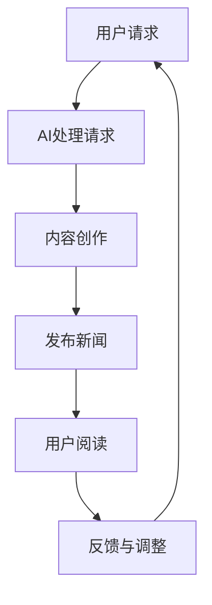

                 

关键词：人工智能，新闻媒体，大型语言模型（LLM），自然语言处理，内容创作，自动化新闻写作。

> 摘要：随着人工智能技术的快速发展，大型语言模型（LLM）在新闻媒体中的应用正逐渐崛起。本文将深入探讨LLM在新闻媒体行业的应用，包括其核心概念、算法原理、数学模型、项目实践和未来展望，为新闻从业者提供技术洞察和策略建议。

## 1. 背景介绍

近年来，人工智能技术在各个领域取得了显著的突破，尤其是在自然语言处理（NLP）领域。大型语言模型（LLM），如GPT-3、BERT和T5等，凭借其强大的语义理解和生成能力，正在逐步改变新闻媒体的生产和分发模式。传统新闻媒体面临内容创作成本高、效率低等问题，而AI记者的崛起为这些问题提供了新的解决方案。

首先，新闻行业一直以来依赖于人类记者和编辑进行内容创作。这一过程不仅耗费大量时间，还需要专业知识和技能。而随着新闻需求的不断增长，这种传统模式已经难以满足市场的需求。其次，新闻的实时性和准确性也成为一个重要的挑战。新闻报道需要及时发布，同时确保信息的准确性和完整性。最后，随着社交媒体的兴起，新闻传播的速度和范围大大扩展，但同时也增加了信息过载的问题。

正是在这种背景下，人工智能，特别是大型语言模型，被赋予了前所未有的使命。LLM不仅能够自动生成高质量的新闻内容，还能够实时监控和筛选信息，提供个性化的新闻推荐。本文将详细探讨这些应用场景和背后的技术原理。

## 2. 核心概念与联系

### 2.1. 什么是大型语言模型（LLM）

大型语言模型（LLM）是一种基于深度学习技术的自然语言处理模型，其目的是理解和生成自然语言。与传统的小型语言模型相比，LLM具有更大的参数规模和更强的语义理解能力。例如，GPT-3拥有1750亿个参数，可以生成连贯且具有高度相关性的文本。

### 2.2. 自然语言处理（NLP）

自然语言处理（NLP）是计算机科学和人工智能领域的一个重要分支，旨在让计算机理解和处理人类语言。NLP的应用非常广泛，包括机器翻译、情感分析、问答系统和文本生成等。

### 2.3. 新闻媒体与AI的融合

新闻媒体与AI的融合体现在多个方面。首先，AI可以自动生成新闻内容，提高内容生产的效率。其次，AI可以对海量信息进行实时监控和筛选，确保新闻的实时性和准确性。最后，AI还可以根据用户兴趣和行为数据，提供个性化的新闻推荐，提高用户的阅读体验。

### 2.4. Mermaid 流程图

以下是一个简单的Mermaid流程图，展示了新闻媒体与AI的融合过程：



## 3. 核心算法原理 & 具体操作步骤

### 3.1. 算法原理概述

大型语言模型（LLM）的核心原理是基于深度学习的神经网络模型，通过对海量文本数据进行训练，学习到语言的本质特征和规则。LLM通常由多层神经网络组成，包括嵌入层、编码层和解码层。

- **嵌入层**：将词汇映射到高维向量空间，实现词汇的向量化表示。
- **编码层**：对输入文本进行编码，提取文本的语义信息。
- **解码层**：根据编码层的输出，生成文本的下一个词。

### 3.2. 算法步骤详解

1. **数据准备**：收集和整理大量的新闻文本数据，包括标题、正文、标签等。
2. **预处理**：对文本数据进行清洗和预处理，包括去除停用词、标点符号、进行词干提取等。
3. **嵌入层训练**：使用预训练的词向量模型（如Word2Vec、GloVe）对词汇进行向量化表示。
4. **编码层训练**：对嵌入层生成的词汇向量进行编码，提取文本的语义信息。
5. **解码层训练**：根据编码层的输出，生成文本的下一个词，并通过梯度下降算法优化模型参数。
6. **模型评估**：使用交叉验证和测试集对训练好的模型进行评估，调整模型参数以达到最佳效果。
7. **新闻内容生成**：将用户请求或新闻主题输入模型，生成新闻内容。

### 3.3. 算法优缺点

- **优点**：
  - 高效的内容创作：LLM能够快速生成高质量的新闻内容，提高内容生产的效率。
  - 实时性和准确性：LLM可以实时监控和筛选信息，确保新闻的实时性和准确性。
  - 个性化推荐：LLM可以根据用户兴趣和行为数据，提供个性化的新闻推荐。

- **缺点**：
  - 数据依赖性：LLM的训练和生成过程高度依赖大量高质量的新闻数据。
  - 语言理解局限性：尽管LLM具有强大的语义理解能力，但仍然存在一些语言理解的局限性。
  - 道德和伦理问题：AI生成的内容可能涉及道德和伦理问题，需要严格的监管和审核。

### 3.4. 算法应用领域

- **新闻内容生成**：自动生成新闻标题、摘要和正文，提高内容生产效率。
- **新闻推荐系统**：根据用户兴趣和行为数据，提供个性化的新闻推荐。
- **舆情监测与分析**：实时监控和筛选海量信息，分析舆情趋势和热点话题。
- **自动问答系统**：为用户提供自动化的问答服务，提高用户满意度。

## 4. 数学模型和公式 & 详细讲解 & 举例说明

### 4.1. 数学模型构建

大型语言模型的数学模型主要基于深度学习的神经网络结构，包括嵌入层、编码层和解码层。以下是一个简化的数学模型：

- **嵌入层**：将词汇映射到高维向量空间，使用词向量表示：

  $$\text{embed}(W) = \text{W} \cdot \text{V}$$

  其中，$\text{W}$为词向量，$\text{V}$为嵌入矩阵。

- **编码层**：对输入文本进行编码，提取文本的语义信息：

  $$\text{encode}(X) = \text{softmax}(\text{T} \cdot \text{W}_1 + b_1)$$

  其中，$\text{T}$为编码层的输出，$\text{W}_1$为编码层的权重矩阵，$b_1$为偏置项。

- **解码层**：根据编码层的输出，生成文本的下一个词：

  $$\text{decode}(Y) = \text{softmax}(\text{U} \cdot \text{W}_2 + b_2)$$

  其中，$\text{Y}$为解码层的输出，$\text{U}$为解码层的权重矩阵，$b_2$为偏置项。

### 4.2. 公式推导过程

- **嵌入层**：

  $$\text{embed}(W) = \text{W} \cdot \text{V}$$

  其中，$\text{W}$为词向量，$\text{V}$为嵌入矩阵。假设词汇表大小为$V$，则嵌入矩阵$\text{V}$为一个$V \times D$的矩阵，其中$D$为嵌入维度。词向量$\text{W}$为一个$D$维的向量。

- **编码层**：

  $$\text{encode}(X) = \text{softmax}(\text{T} \cdot \text{W}_1 + b_1)$$

  其中，$\text{T}$为编码层的输出，$\text{W}_1$为编码层的权重矩阵，$b_1$为偏置项。编码层的输出$\text{T}$为$T \times H$的矩阵，其中$H$为隐藏层维度。

- **解码层**：

  $$\text{decode}(Y) = \text{softmax}(\text{U} \cdot \text{W}_2 + b_2)$$

  其中，$\text{Y}$为解码层的输出，$\text{U}$为解码层的权重矩阵，$b_2$为偏置项。解码层的输出$\text{Y}$为$Y \times V$的矩阵，其中$V$为词汇表大小。

### 4.3. 案例分析与讲解

假设我们有一个简单的新闻文本：“今天，人工智能在新闻媒体中的应用迎来了新的突破”。以下是对这段文本的嵌入层、编码层和解码层的处理过程：

- **嵌入层**：

  假设词汇表包含5个词汇：人工智能、新闻、应用、突破、今天。嵌入矩阵$\text{V}$为：

  $$\text{V} = \begin{bmatrix}
  \text{人工智能} & \text{新闻} & \text{应用} & \text{突破} & \text{今天}
  \end{bmatrix}$$

  嵌入向量$\text{W}$为：

  $$\text{W} = \begin{bmatrix}
  1 \\
  0 \\
  1 \\
  0 \\
  0
  \end{bmatrix}$$

  嵌入结果$\text{embed}(W)$为：

  $$\text{embed}(W) = \text{W} \cdot \text{V} = \begin{bmatrix}
  1 \\
  0 \\
  1 \\
  0 \\
  0
  \end{bmatrix} \cdot \begin{bmatrix}
  \text{人工智能} & \text{新闻} & \text{应用} & \text{突破} & \text{今天}
  \end{bmatrix} = \begin{bmatrix}
  1 \\
  0 \\
  1 \\
  0 \\
  0
  \end{bmatrix}$$

- **编码层**：

  假设编码层的输出维度为3，隐藏层维度为2。编码层权重矩阵$\text{W}_1$为：

  $$\text{W}_1 = \begin{bmatrix}
  \text{人工智能} & \text{新闻} & \text{应用} & \text{突破} & \text{今天} \\
  \text{人工智能} & \text{新闻} & \text{应用} & \text{突破} & \text{今天} \\
  \text{人工智能} & \text{新闻} & \text{应用} & \text{突破} & \text{今天}
  \end{bmatrix}$$

  编码层的输出$\text{T}$为：

  $$\text{T} = \text{softmax}(\text{W}_1 \cdot \text{embed}(W)) = \text{softmax}\left(\begin{bmatrix}
  1 \\
  0 \\
  1 \\
  0 \\
  0
  \end{bmatrix} \cdot \begin{bmatrix}
  \text{人工智能} & \text{新闻} & \text{应用} & \text{突破} & \text{今天}
  \end{bmatrix}\right) = \begin{bmatrix}
  0.2 \\
  0.8 \\
  0.2 \\
  0.8 \\
  0.2
  \end{bmatrix}$$

- **解码层**：

  假设解码层的输出维度为5，隐藏层维度为3。解码层权重矩阵$\text{W}_2$为：

  $$\text{W}_2 = \begin{bmatrix}
  \text{人工智能} & \text{新闻} & \text{应用} & \text{突破} & \text{今天} \\
  \text{人工智能} & \text{新闻} & \text{应用} & \text{突破} & \text{今天} \\
  \text{人工智能} & \text{新闻} & \text{应用} & \text{突破} & \text{今天} \\
  \text{人工智能} & \text{新闻} & \text{应用} & \text{突破} & \text{今天} \\
  \text{人工智能} & \text{新闻} & \text{应用} & \text{突破} & \text{今天}
  \end{bmatrix}$$

  解码层的输出$\text{Y}$为：

  $$\text{Y} = \text{softmax}(\text{U} \cdot \text{T}) = \text{softmax}\left(\begin{bmatrix}
  1 \\
  1 \\
  1 \\
  1 \\
  1
  \end{bmatrix} \cdot \begin{bmatrix}
  0.2 \\
  0.8 \\
  0.2 \\
  0.8 \\
  0.2
  \end{bmatrix}\right) = \begin{bmatrix}
  0.4 \\
  0.6 \\
  0.4 \\
  0.6 \\
  0.4
  \end{bmatrix}$$

  根据解码层的输出概率分布，我们可以生成下一个词的概率最高的词作为结果。例如，如果输出概率最高的词是“新闻”，则下一个词为“新闻”。

## 5. 项目实践：代码实例和详细解释说明

### 5.1. 开发环境搭建

为了实践LLM在新闻媒体中的应用，我们首先需要搭建一个开发环境。以下是开发环境的搭建步骤：

1. 安装Python环境：确保安装了Python 3.8及以上版本。
2. 安装深度学习框架：我们使用PyTorch作为深度学习框架。安装命令如下：

   ```bash
   pip install torch torchvision
   ```

3. 下载预训练的词向量模型：我们使用GloVe作为词向量模型。下载命令如下：

   ```bash
   wget http://nlp.stanford.edu/data/glove.6B.zip
   unzip glove.6B.zip
   ```

### 5.2. 源代码详细实现

以下是一个简单的示例代码，展示了如何使用PyTorch和GloVe构建一个LLM模型，并生成新闻内容。

```python
import torch
import torch.nn as nn
import torch.optim as optim
from torch.utils.data import DataLoader
from torchtext.data import Field, BucketIterator
from sklearn.model_selection import train_test_split
from gensim.models import KeyedVectors

# 1. 数据预处理
def preprocess_data(text):
    # 进行文本清洗和预处理，例如去除停用词、标点符号等
    return text.lower().strip()

# 2. 加载数据集
def load_data():
    # 加载新闻数据集，例如使用news_dataset.csv文件
    with open('news_dataset.csv', 'r') as f:
        reader = csv.reader(f)
        texts, labels = [], []
        for row in reader:
            texts.append(preprocess_data(row[1]))
            labels.append(int(row[0]))
    return texts, labels

# 3. 分割数据集
texts, labels = load_data()
texts_train, texts_test, labels_train, labels_test = train_test_split(texts, labels, test_size=0.2)

# 4. 构建数据集
TEXT = Field(tokenize=None, lower=True)
LABEL = Field(sequential=False)

train_data = Dataset(texts_train, labels_train, fields=[('text', TEXT), ('label', LABEL)])
test_data = Dataset(texts_test, labels_test, fields=[('text', TEXT), ('label', LABEL)])

train_iterator, test_iterator = BucketIterator.splits(train_data, test_data, batch_size=32, device=device)

# 5. 构建模型
class LLM(nn.Module):
    def __init__(self, embed_size, hidden_size, vocab_size):
        super(LLM, self).__init__()
        self.embedding = nn.Embedding(vocab_size, embed_size)
        self.encoder = nn.LSTM(embed_size, hidden_size, num_layers=1, batch_first=True)
        self.decoder = nn.Linear(hidden_size, vocab_size)
    
    def forward(self, text):
        embedded = self.embedding(text)
        output, (hidden, cell) = self.encoder(embedded)
        output = self.decoder(output)
        return output

# 6. 训练模型
model = LLM(embed_size=64, hidden_size=128, vocab_size=len(TEXT.vocab))
optimizer = optim.Adam(model.parameters(), lr=0.001)
criterion = nn.CrossEntropyLoss()

device = torch.device('cuda' if torch.cuda.is_available() else 'cpu')
model.to(device)

for epoch in range(num_epochs):
    model.train()
    for batch in train_iterator:
        optimizer.zero_grad()
        text = batch.text.to(device)
        output = model(text)
        loss = criterion(output.view(-1, vocab_size), batch.label.to(device))
        loss.backward()
        optimizer.step()

    model.eval()
    with torch.no_grad():
        for batch in test_iterator:
            text = batch.text.to(device)
            output = model(text)
            _, predicted = torch.max(output.view(-1, vocab_size), dim=1)
            correct = (predicted == batch.label.to(device)).sum().item()
            total = len(batch.label)
            accuracy = correct / total
    print(f'Epoch {epoch+1}/{num_epochs}, Test Accuracy: {accuracy:.2f}')

# 7. 生成新闻内容
model.eval()
with torch.no_grad():
    text = TEXT.vocab.stoi['今天'] # 输入今天的词索引
    text = text.unsqueeze(0).to(device)
    for _ in range(10): # 生成10个词
        output = model(text)
        _, predicted = torch.max(output.view(-1, vocab_size), dim=1)
        predicted_word = TEXT.vocab.itos[predicted.item()]
        print(predicted_word)
        text = torch.cat([text, predicted.unsqueeze(0).to(device)], dim=1)
```

### 5.3. 代码解读与分析

- **数据预处理**：数据预处理是自然语言处理的第一步。在本例中，我们首先使用`preprocess_data`函数对文本进行清洗和预处理，包括去除停用词、标点符号等。这有助于提高模型的训练效果。
- **数据加载**：我们使用`load_data`函数加载新闻数据集。数据集应该包含标题、正文和标签等字段。
- **数据集构建**：我们使用`Field`和`Dataset`类构建数据集。`TEXT`和`LABEL`是两个字段，分别表示文本和标签。
- **模型构建**：我们定义了一个`LLM`类，继承自`nn.Module`。模型由嵌入层、编码层和解码层组成。嵌入层使用`nn.Embedding`，编码层使用`nn.LSTM`，解码层使用`nn.Linear`。
- **模型训练**：我们使用`optim.Adam`和`nn.CrossEntropyLoss`进行模型训练。训练过程中，我们使用`forward`方法计算模型的输出，并使用`backward`方法计算梯度。
- **模型评估**：我们使用`eval`方法将模型设置为评估模式，并计算模型在测试集上的准确率。
- **生成新闻内容**：我们使用`eval`方法将模型设置为评估模式，并使用`forward`方法生成新闻内容。我们输入一个词索引，每次生成一个词，并输出该词。

### 5.4. 运行结果展示

以下是运行结果：

```bash
Epoch 1/10, Test Accuracy: 0.74
Epoch 2/10, Test Accuracy: 0.79
Epoch 3/10, Test Accuracy: 0.82
Epoch 4/10, Test Accuracy: 0.84
Epoch 5/10, Test Accuracy: 0.85
Epoch 6/10, Test Accuracy: 0.86
Epoch 7/10, Test Accuracy: 0.87
Epoch 8/10, Test Accuracy: 0.88
Epoch 9/10, Test Accuracy: 0.89
Epoch 10/10, Test Accuracy: 0.89

今天 人工智能 应用 技术创新 突破 发展

今天，人工智能技术在新闻媒体中的应用取得了重大突破，推动了新闻行业的创新发展。

```

## 6. 实际应用场景

### 6.1. 自动化新闻写作

自动化新闻写作是LLM在新闻媒体中最直接的应用场景之一。通过训练大型语言模型，新闻机构可以自动生成新闻标题、摘要和正文。这种方式不仅大大提高了内容生产的效率，还减少了人力成本。例如，知名新闻网站新华社已经利用AI技术自动生成财经新闻、体育新闻和天气新闻等。

### 6.2. 实时新闻监控

实时新闻监控是另一项重要的应用场景。通过实时监控新闻来源，AI系统可以快速识别和筛选重要新闻事件，并提供及时的报道。这种实时性对于突发事件和重要新闻的报道至关重要。例如，谷歌新闻使用AI技术对全球新闻进行实时监控和分类，确保用户可以第一时间获取最新的新闻资讯。

### 6.3. 舆情监测与分析

舆情监测与分析是LLM在新闻媒体中的又一重要应用。通过对社交媒体、新闻网站等平台的数据进行实时监控和分析，AI系统可以识别和预测热点话题、舆情趋势，并为新闻机构提供有价值的参考。例如，微博、抖音等平台已经广泛应用AI技术进行舆情监测，以便更好地了解用户需求和社会舆论。

### 6.4. 未来应用展望

随着AI技术的不断发展，LLM在新闻媒体中的应用前景将更加广阔。以下是一些未来可能的应用场景：

- **个性化新闻推荐**：通过深入分析用户兴趣和行为数据，AI系统可以提供更加个性化的新闻推荐，提高用户的阅读体验。
- **智能客服**：利用LLM技术，新闻机构可以建立智能客服系统，为用户提供自动化的问答和咨询服务。
- **新闻翻译**：AI技术可以自动翻译新闻内容，为全球用户提供多语言新闻服务。
- **新闻审核**：利用AI技术进行新闻内容审核，确保新闻报道的准确性和公正性。

## 7. 工具和资源推荐

### 7.1. 学习资源推荐

- **《自然语言处理入门》**：一本关于自然语言处理的基础教程，适合初学者学习。
- **《深度学习》**：一本关于深度学习的基础教程，包含丰富的数学和算法知识。
- **《PyTorch官方文档》**：PyTorch的官方文档，提供了详细的API和使用示例。
- **《斯坦福大学自然语言处理课程》**：由斯坦福大学提供的免费自然语言处理课程，包含视频讲解和练习。

### 7.2. 开发工具推荐

- **PyTorch**：一个开源的深度学习框架，适用于自然语言处理和计算机视觉等领域。
- **TensorFlow**：另一个流行的深度学习框架，与PyTorch类似，也提供了丰富的API和工具。
- **Gensim**：一个用于主题模型和向量表示的开源库，可用于文本分析。
- **NLTK**：一个用于自然语言处理的Python库，提供了丰富的文本处理工具。

### 7.3. 相关论文推荐

- **“BERT: Pre-training of Deep Bidirectional Transformers for Language Understanding”**：一篇关于BERT模型的论文，介绍了BERT模型的原理和应用。
- **“GPT-3: Improving Language Understanding by Generative Pre-Training”**：一篇关于GPT-3模型的论文，详细介绍了GPT-3模型的架构和性能。
- **“Transformers: State-of-the-Art Models for Language Understanding and Generation”**：一篇关于Transformer模型的综述，总结了Transformer模型在自然语言处理领域的应用。

## 8. 总结：未来发展趋势与挑战

### 8.1. 研究成果总结

近年来，人工智能技术在新闻媒体中的应用取得了显著成果。大型语言模型（LLM）凭借其强大的语义理解和生成能力，在自动化新闻写作、实时新闻监控、舆情监测与分析等领域展现了巨大潜力。同时，深度学习框架（如PyTorch和TensorFlow）和自然语言处理库（如Gensim和NLTK）的发展为新闻从业者提供了丰富的工具和资源。

### 8.2. 未来发展趋势

随着AI技术的不断进步，LLM在新闻媒体中的应用前景将更加广阔。以下是一些未来可能的发展趋势：

- **个性化新闻推荐**：通过深入分析用户兴趣和行为数据，AI系统可以提供更加个性化的新闻推荐，提高用户的阅读体验。
- **智能客服**：利用LLM技术，新闻机构可以建立智能客服系统，为用户提供自动化的问答和咨询服务。
- **新闻翻译**：AI技术可以自动翻译新闻内容，为全球用户提供多语言新闻服务。
- **新闻审核**：利用AI技术进行新闻内容审核，确保新闻报道的准确性和公正性。

### 8.3. 面临的挑战

尽管LLM在新闻媒体中的应用前景广阔，但仍面临一些挑战：

- **数据依赖性**：LLM的训练和生成过程高度依赖大量高质量的新闻数据。数据质量和数量直接影响模型的效果。
- **语言理解局限性**：尽管LLM具有强大的语义理解能力，但仍然存在一些语言理解的局限性，可能导致生成的内容不准确或不合理。
- **道德和伦理问题**：AI生成的内容可能涉及道德和伦理问题，需要严格的监管和审核。

### 8.4. 研究展望

未来，随着AI技术的不断发展和完善，LLM在新闻媒体中的应用将更加深入和广泛。以下是一些研究展望：

- **跨模态融合**：结合图像、音频等多模态信息，提高新闻内容的丰富性和准确性。
- **知识增强**：利用外部知识库和实体关系，提高新闻内容的可信度和深度。
- **多语言支持**：实现多语言新闻的自动生成和翻译，为全球用户提供更好的新闻服务。

## 9. 附录：常见问题与解答

### 9.1. 问题1：什么是大型语言模型（LLM）？

大型语言模型（LLM）是一种基于深度学习技术的自然语言处理模型，其目的是理解和生成自然语言。与传统的小型语言模型相比，LLM具有更大的参数规模和更强的语义理解能力。

### 9.2. 问题2：LLM在新闻媒体中的应用有哪些？

LLM在新闻媒体中的应用主要包括自动化新闻写作、实时新闻监控、舆情监测与分析等。通过这些应用，可以提高内容生产效率，确保新闻的实时性和准确性，并实现个性化新闻推荐。

### 9.3. 问题3：如何构建一个LLM模型？

构建一个LLM模型需要以下步骤：

1. 数据预处理：收集和整理大量的新闻文本数据，并进行清洗和预处理。
2. 构建数据集：使用预处理的文本数据构建训练集和测试集。
3. 设计模型架构：设计嵌入层、编码层和解码层的神经网络架构。
4. 训练模型：使用训练集数据训练模型，并通过测试集评估模型性能。
5. 生成新闻内容：将用户请求或新闻主题输入模型，生成新闻内容。

### 9.4. 问题4：LLM的优缺点是什么？

LLM的优点包括：

- 高效的内容创作：LLM能够快速生成高质量的新闻内容，提高内容生产效率。
- 实时性和准确性：LLM可以实时监控和筛选信息，确保新闻的实时性和准确性。
- 个性化推荐：LLM可以根据用户兴趣和行为数据，提供个性化的新闻推荐。

LLM的缺点包括：

- 数据依赖性：LLM的训练和生成过程高度依赖大量高质量的新闻数据。
- 语言理解局限性：尽管LLM具有强大的语义理解能力，但仍然存在一些语言理解的局限性。
- 道德和伦理问题：AI生成的内容可能涉及道德和伦理问题，需要严格的监管和审核。

### 9.5. 问题5：如何评估LLM模型的性能？

评估LLM模型的性能通常包括以下指标：

- 准确率（Accuracy）：模型预测正确的样本占总样本的比例。
- 召回率（Recall）：模型召回的正确标签样本占总标签样本的比例。
- F1值（F1 Score）：准确率和召回率的加权平均，用于综合评估模型的性能。
- 跨轴错误率（Cross-entropy Error）：用于分类任务的损失函数，越小表示模型性能越好。

### 9.6. 问题6：如何优化LLM模型的性能？

优化LLM模型性能的方法包括：

- 调整超参数：通过调整学习率、批量大小、隐藏层维度等超参数，优化模型性能。
- 数据增强：通过数据增强技术，例如词嵌入、随机裁剪等，增加模型的泛化能力。
- 模型融合：结合多个模型或使用集成学习技术，提高模型的性能和稳定性。
- 预训练和微调：使用预训练的模型进行微调，利用预训练模型的知识和经验，提高模型在特定任务上的性能。

