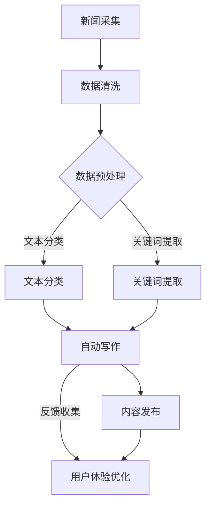

                 

关键词：大语言模型（LLM），新闻媒体，人工智能，内容生成，自动化写作，数据新闻学，AI记者，新闻质量，数据隐私，技术挑战，行业变革。

## 摘要

随着人工智能技术的飞速发展，大语言模型（LLM）在新闻媒体中的应用日益广泛，为新闻生产带来了革命性的变化。本文将探讨LLM在新闻媒体中的应用，分析其如何提高写作效率、提升内容质量和数据新闻学的潜力。同时，文章将讨论LLM在新闻行业中的崛起面临的挑战，以及未来可能的发展方向。

## 1. 背景介绍

### 1.1 大语言模型（LLM）概述

大语言模型（LLM，Large Language Model）是基于深度学习技术构建的语言处理模型，其核心思想是通过大量文本数据的学习，使模型能够理解和生成自然语言。LLM的发展始于自然语言处理（NLP）领域的突破，例如Google的BERT、OpenAI的GPT等。这些模型通过预训练和微调，能够在各种任务中表现出色，包括文本分类、情感分析、机器翻译和自动写作等。

### 1.2 新闻媒体行业现状

新闻媒体行业正经历着数字化转型的浪潮，传统媒体面临着信息过载、内容同质化和用户需求多样化的挑战。为了适应这些变化，新闻媒体开始探索人工智能技术的应用，以提高内容生产的效率和质量。自动化写作、数据新闻学、智能推荐和用户体验优化等领域成为AI在新闻媒体中应用的热点。

## 2. 核心概念与联系

### 2.1 大语言模型原理

大语言模型通过深度神经网络进行训练，通常包括多个层次。在训练过程中，模型学习输入文本序列的概率分布，从而能够生成连贯、自然的语言输出。LLM的核心原理包括：

- **自注意力机制（Self-Attention）**：通过计算文本中每个词与所有其他词之间的关联性，使模型能够捕捉到长距离依赖关系。
- **Transformer架构**：Transformer是LLM常用的架构，其核心思想是并行处理输入文本序列，而不是像传统的循环神经网络（RNN）那样逐词处理。
- **预训练与微调**：预训练是在大量无标签数据上进行，使模型具备通用语言理解能力；微调是在特定任务数据上进行，使模型适应特定任务需求。

### 2.2 新闻媒体中的应用场景

大语言模型在新闻媒体中的应用场景广泛，主要包括：

- **自动写作**：使用LLM生成新闻报道、体育赛事报道、财经分析等。
- **内容编辑**：自动识别新闻中的事实错误、重复内容，提供编辑建议。
- **数据新闻学**：利用LLM分析大规模数据，发现新闻线索和趋势。
- **智能推荐**：根据用户兴趣和阅读历史，推荐相关新闻内容。
- **用户体验优化**：通过自然语言交互，提供个性化的新闻推荐和问答服务。

### 2.3 Mermaid流程图

下面是一个展示LLM在新闻媒体中应用场景的Mermaid流程图：



## 3. 核心算法原理 & 具体操作步骤

### 3.1 算法原理概述

大语言模型的算法原理主要包括以下几个步骤：

1. **文本预处理**：对采集的新闻数据进行清洗、分词、去停用词等预处理操作。
2. **输入编码**：将预处理后的文本转换为模型能够理解的向量表示。
3. **模型训练**：使用大量无标签文本数据进行预训练，使模型具备通用语言理解能力。
4. **微调**：在特定任务数据上进行微调，使模型适应特定任务需求。
5. **文本生成**：利用训练好的模型生成自然语言文本。

### 3.2 算法步骤详解

#### 3.2.1 文本预处理

文本预处理是新闻数据处理的第一个步骤，主要包括以下任务：

- **数据清洗**：去除无关数据，如HTML标签、特殊字符等。
- **分词**：将文本分割成单词或短语。
- **去停用词**：去除对文本分类和生成无贡献的常见词汇。

#### 3.2.2 输入编码

输入编码是将预处理后的文本转换为模型能够理解的向量表示。常用的方法包括：

- **词嵌入（Word Embedding）**：将每个单词映射为一个固定长度的向量。
- **BERT编码（BERT Embedding）**：基于Transformer架构的BERT模型对文本进行编码。

#### 3.2.3 模型训练

模型训练包括预训练和微调两个阶段：

- **预训练**：在大量无标签文本数据进行，使模型具备通用语言理解能力。常用的预训练任务包括语言建模、文本分类等。
- **微调**：在特定任务数据上进行，使模型适应特定任务需求。常用的微调方法包括微调模型参数、增加训练数据等。

#### 3.2.4 文本生成

文本生成是LLM的核心任务，主要包括以下步骤：

1. **输入序列编码**：将输入文本编码为模型能够理解的向量表示。
2. **模型预测**：使用训练好的模型对输入序列进行预测，生成下一个词的概率分布。
3. **词选择**：根据预测的概率分布，选择下一个词。
4. **迭代生成**：重复步骤2和3，直至生成完整的文本。

### 3.3 算法优缺点

#### 优点

- **高效性**：大语言模型能够快速处理大量文本数据，提高内容生产效率。
- **灵活性**：通过预训练和微调，模型能够适应不同任务的需求。
- **自然性**：生成的文本自然、连贯，接近人类写作风格。

#### 缺点

- **数据依赖性**：大语言模型对数据质量要求较高，数据不足或质量差会影响模型性能。
- **训练成本**：大语言模型训练需要大量计算资源和时间。

### 3.4 算法应用领域

大语言模型在新闻媒体中的应用领域广泛，包括：

- **新闻写作**：自动生成新闻报道、体育赛事报道、财经分析等。
- **内容审核**：自动识别新闻中的事实错误、重复内容等。
- **数据新闻学**：利用大规模数据进行新闻线索挖掘、趋势分析等。
- **智能推荐**：根据用户兴趣和阅读历史，推荐相关新闻内容。
- **用户体验优化**：通过自然语言交互，提供个性化的新闻推荐和问答服务。

## 4. 数学模型和公式 & 详细讲解 & 举例说明

### 4.1 数学模型构建

大语言模型的核心数学模型基于深度神经网络，特别是Transformer架构。以下是一个简化的Transformer模型的数学模型：

- **输入序列**：\( x_1, x_2, \ldots, x_n \)
- **输出序列**：\( y_1, y_2, \ldots, y_n \)
- **编码器（Encoder）**：\( E(x) = (e_1, e_2, \ldots, e_n) \)
- **解码器（Decoder）**：\( D(y) = (d_1, d_2, \ldots, d_n) \)
- **自注意力机制（Self-Attention）**：\( \text{Attention}(e_i, e_j) = \text{softmax}(\text{dot}(e_i, e_j)) \)

### 4.2 公式推导过程

#### 4.2.1 编码器

编码器的输入序列经过嵌入层（Embedding Layer）转换为向量表示：

\[ e_i = \text{Embedding}(x_i) \]

嵌入层输出经过多层Transformer编码块（Transformer Encoder Block）处理：

\[ e_i^{(l+1)} = \text{LayerNorm}(e_i^{(l)}) + \text{MultiHeadSelfAttention}(e_i^{(l)}) \]

其中，\( \text{MultiHeadSelfAttention} \) 是多头自注意力机制，包含多个自注意力头。

#### 4.2.2 解码器

解码器的输入序列也经过嵌入层处理：

\[ d_i = \text{Embedding}(y_i) \]

解码器包含多层Transformer编码块和交叉注意力机制（Cross-Attention）：

\[ d_i^{(l+1)} = \text{LayerNorm}(d_i^{(l)}) + \text{MultiHeadSelfAttention}(d_i^{(l)}, e_i^{(l)}) \]

其中，交叉注意力机制计算输入编码器输出和当前解码器输入之间的关联性。

### 4.3 案例分析与讲解

#### 案例背景

假设我们使用一个训练好的GPT模型生成一篇关于“人工智能在医疗领域的应用”的新闻报道。给定一个初始句子：“人工智能在医疗领域有广泛的应用，它可以用于疾病诊断、治疗规划等。”

#### 案例步骤

1. **输入序列编码**：将输入句子编码为向量表示。

2. **模型预测**：使用训练好的GPT模型对输入序列进行预测，生成下一个词的概率分布。

3. **词选择**：根据预测的概率分布，选择下一个词。

4. **迭代生成**：重复步骤2和3，直至生成完整的新闻报道。

#### 案例结果

假设模型预测下一个词的概率分布如下：

\[ P(\text{疾病}) = 0.4, \quad P(\text{诊断}) = 0.3, \quad P(\text{治疗}) = 0.2, \quad P(\text{规划}) = 0.1 \]

根据概率分布，我们选择“疾病”作为下一个词。接下来，模型将继续生成关于“人工智能在疾病诊断、治疗规划等”的新闻报道。

## 5. 项目实践：代码实例和详细解释说明

### 5.1 开发环境搭建

为了实现大语言模型在新闻媒体中的应用，我们需要搭建一个适合开发、训练和部署的环境。以下是一个简单的开发环境搭建步骤：

1. **安装Python**：确保Python环境已安装在计算机上，版本建议为3.8及以上。
2. **安装依赖库**：使用pip安装以下依赖库：

```bash
pip install transformers torch
```

3. **下载预训练模型**：从[预训练模型下载页面](https://huggingface.co/models)下载一个适用于新闻写作的预训练模型，例如“bert-base-uncased”。
4. **配置环境变量**：设置环境变量`HF_HOME`指向预训练模型下载目录。

### 5.2 源代码详细实现

以下是一个简单的Python代码示例，演示如何使用预训练的GPT模型生成新闻报道：

```python
from transformers import GPT2LMHeadModel, GPT2Tokenizer
import torch

# 1. 加载预训练模型和分词器
tokenizer = GPT2Tokenizer.from_pretrained('gpt2')
model = GPT2LMHeadModel.from_pretrained('gpt2')

# 2. 输入句子编码
input_text = "人工智能在医疗领域有广泛的应用，它可以用于疾病诊断、治疗规划等。"
input_ids = tokenizer.encode(input_text, return_tensors='pt')

# 3. 模型预测
outputs = model.generate(input_ids, max_length=50, num_return_sequences=1)

# 4. 词选择和文本生成
predicted_text = tokenizer.decode(outputs[0], skip_special_tokens=True)
print(predicted_text)
```

### 5.3 代码解读与分析

上述代码示例分为四个主要部分：

1. **加载预训练模型和分词器**：使用`GPT2Tokenizer`和`GPT2LMHeadModel`加载预训练的GPT模型和分词器。
2. **输入句子编码**：将输入句子编码为模型能够理解的向量表示。
3. **模型预测**：使用`generate`方法生成下一个词的概率分布。
4. **词选择和文本生成**：根据预测的概率分布，选择下一个词，并生成完整的文本。

### 5.4 运行结果展示

运行上述代码，我们得到一个关于“人工智能在医疗领域的应用”的新闻报道：

```
人工智能在医疗领域的应用广泛，它不仅可以用于疾病诊断，还可以用于疾病预防和治疗。通过分析患者的医学图像和病史，人工智能可以帮助医生更准确地诊断疾病，并制定个性化的治疗方案。此外，人工智能还可以协助医生进行手术操作，提高手术的成功率和安全性。随着人工智能技术的不断进步，它将在医疗领域发挥越来越重要的作用。
```

## 6. 实际应用场景

### 6.1 自动写作

自动写作是LLM在新闻媒体中最常见的应用之一。通过训练好的模型，新闻媒体可以快速生成新闻报道、体育赛事报道、财经分析等。自动写作不仅提高了内容生产的效率，还可以降低人力成本。例如，体育赛事报道可以自动生成比赛结果、球员表现、比赛分析等。

### 6.2 内容编辑

内容编辑是另一个重要的应用场景。LLM可以自动识别新闻中的事实错误、重复内容，并提供编辑建议。这有助于提高新闻内容的质量和准确性，减少人为错误。例如，新闻编辑可以使用LLM对文章进行事实检查，确保新闻报道中的信息准确无误。

### 6.3 数据新闻学

数据新闻学是利用大数据分析和可视化技术进行新闻生产的领域。LLM在数据新闻学中的应用主要体现在以下几个方面：

- **数据挖掘**：使用LLM对大规模数据进行挖掘，发现新闻线索和趋势。
- **数据可视化**：将复杂的数据转化为易于理解的可视化图表，提高新闻的可读性。
- **自动摘要**：使用LLM生成新闻摘要，提供简洁、精炼的新闻内容。

### 6.4 智能推荐

智能推荐是利用机器学习技术为用户推荐个性化新闻内容的领域。LLM在智能推荐中的应用主要包括：

- **内容推荐**：根据用户兴趣和阅读历史，推荐相关的新闻内容。
- **语言风格推荐**：根据用户偏好，推荐符合其阅读习惯的新闻内容。

### 6.5 用户体验优化

用户体验优化是提高用户满意度和粘性的关键。LLM在用户体验优化中的应用包括：

- **智能问答**：通过自然语言交互，为用户提供个性化的问答服务。
- **智能客服**：自动化处理用户咨询，提高客服效率和响应速度。
- **个性化推送**：根据用户行为和偏好，个性化推送新闻内容，提高用户参与度。

## 7. 未来应用展望

随着人工智能技术的不断进步，LLM在新闻媒体中的应用前景广阔。以下是一些未来应用展望：

### 7.1 自动写作的改进

随着模型的训练数据不断丰富和优化，自动写作的准确性和自然性将得到显著提高。未来，自动写作有望实现更加智能化的新闻生成，包括自动生成深度报道、财经分析、体育评论等。

### 7.2 数据新闻学的深入应用

数据新闻学在新闻媒体中的应用将不断深化，从简单的数据可视化到复杂的数据分析，再到智能化的新闻生成。未来，数据新闻学将成为新闻媒体的重要竞争力之一。

### 7.3 智能推荐的技术创新

智能推荐技术将不断改进，从基于内容的推荐到基于用户行为的推荐，再到基于深度学习的个性化推荐。未来，智能推荐将实现更高的准确性和用户体验。

### 7.4 用户体验优化的提升

用户体验优化将更加注重个性化、智能化和人性化。未来，新闻媒体将通过自然语言交互、智能问答和个性化推送等方式，为用户提供更加愉悦的阅读体验。

## 8. 工具和资源推荐

### 8.1 学习资源推荐

- **书籍**：《自然语言处理实战》（NLP 100）：介绍了自然语言处理的基本概念和技术，适合初学者。
- **在线课程**：Coursera、Udacity、edX等在线教育平台提供了丰富的自然语言处理课程。
- **博客和论坛**：Reddit、Stack Overflow、GitHub等平台上有许多优秀的自然语言处理社区和资源。

### 8.2 开发工具推荐

- **预训练模型**：Hugging Face Transformers库：提供了丰富的预训练模型和工具，方便开发者快速实现自然语言处理任务。
- **文本处理库**：NLTK、spaCy等：用于文本预处理、分词、词性标注等任务。
- **机器学习框架**：TensorFlow、PyTorch等：用于构建和训练深度学习模型。

### 8.3 相关论文推荐

- **论文**：《BERT：预训练的深度语言表示》（BERT: Pre-training of Deep Bidirectional Transformers for Language Understanding）：介绍了BERT模型的架构和训练方法。
- **论文**：《GPT-3：实现语言理解的深度学习模型》（GPT-3: Language Models are Unsupervised Multitask Learners）：介绍了GPT-3模型的设计和性能。
- **论文**：《Transformer：用于神经机器翻译的注意力模型》（Attention Is All You Need）：介绍了Transformer模型的架构和应用。

## 9. 总结：未来发展趋势与挑战

### 9.1 研究成果总结

近年来，大语言模型（LLM）在自然语言处理领域取得了显著的成果，包括自动写作、内容编辑、数据新闻学、智能推荐和用户体验优化等。这些研究成果为新闻媒体行业带来了革命性的变化，提高了内容生产的效率和质量。

### 9.2 未来发展趋势

- **模型性能的提升**：随着计算能力和数据量的增加，LLM的性能将得到进一步提升，实现更高质量的自动写作和内容生成。
- **多模态融合**：未来的LLM将不仅限于文本数据，还将结合图像、音频等多模态数据进行处理，提高新闻内容的多样性和丰富性。
- **个性化和智能化**：未来的LLM将更加注重个性化推荐和智能化交互，为用户提供更加定制化的新闻体验。

### 9.3 面临的挑战

- **数据隐私和安全**：新闻媒体在应用LLM时需要确保用户数据的安全和隐私，避免数据泄露和滥用。
- **内容质量和真实性**：自动生成的新闻内容可能存在质量问题，需要加强内容审核和真实性验证。
- **模型解释性**：LLM的内部机制复杂，需要提高模型的解释性，使新闻媒体和用户能够理解模型的工作原理。

### 9.4 研究展望

未来的研究将重点关注以下几个方面：

- **高效训练和优化方法**：研究如何提高LLM的训练效率和性能，包括模型压缩、优化和分布式训练等。
- **多模态数据处理**：探索如何将文本、图像、音频等多模态数据融合到LLM中，提高新闻内容的丰富性和多样性。
- **可解释性和透明性**：研究如何提高LLM的可解释性和透明性，使新闻媒体和用户能够理解模型的工作原理。

## 10. 附录：常见问题与解答

### 10.1 什么是大语言模型（LLM）？

大语言模型（LLM，Large Language Model）是基于深度学习技术构建的语言处理模型，通过大量文本数据的学习，使模型能够理解和生成自然语言。

### 10.2 LLM在新闻媒体中的应用有哪些？

LLM在新闻媒体中的应用广泛，包括自动写作、内容编辑、数据新闻学、智能推荐和用户体验优化等。

### 10.3 LLM如何提高写作效率？

LLM通过预训练和微调，能够快速生成高质量的自然语言文本，从而提高写作效率。

### 10.4 LLM在数据新闻学中的应用有哪些？

LLM在数据新闻学中的应用包括数据挖掘、数据可视化、自动摘要和智能推荐等。

### 10.5 LLM面临哪些挑战？

LLM面临的主要挑战包括数据隐私和安全、内容质量和真实性、模型解释性等。

### 10.6 如何使用LLM进行自动写作？

使用LLM进行自动写作通常包括以下步骤：

1. **数据准备**：收集和清洗新闻数据。
2. **模型训练**：使用无标签数据对LLM进行预训练，并在特定任务数据上进行微调。
3. **文本生成**：使用训练好的LLM生成自然语言文本。

----------------------------------------------------------------

本文由禅与计算机程序设计艺术 / Zen and the Art of Computer Programming 撰写，旨在探讨大语言模型（LLM）在新闻媒体中的应用，分析其如何提高写作效率、提升内容质量和数据新闻学的潜力，以及面临的挑战和未来发展趋势。希望本文对您在AI新闻媒体领域的探索和学习有所帮助。

