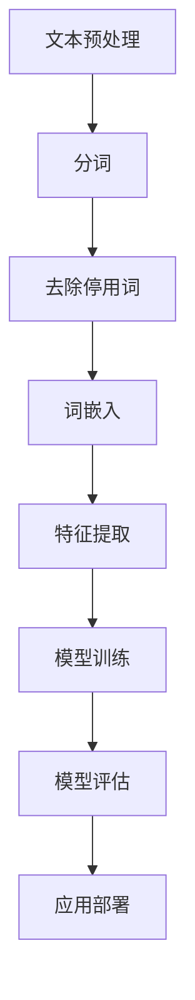

                 

关键词：大型语言模型（LLM），新闻媒体，人工智能，自然语言处理，自动化写作，新闻生成，数据新闻学，内容创作

> 摘要：本文探讨了大型语言模型（LLM）在新闻媒体领域的应用，分析了AI记者的崛起所带来的变革和影响。文章首先介绍了LLM的基本概念及其在自然语言处理中的重要性，随后详细阐述了LLM在新闻写作、内容生成和数据新闻学中的应用。通过案例分析，展示了AI记者在实际操作中的表现和优势。最后，文章展望了LLM在新闻媒体中的未来应用前景，并提出了相关挑战和解决方案。

## 1. 背景介绍

新闻媒体作为信息传播的重要载体，一直在社会发展中扮演着举足轻重的角色。然而，随着信息爆炸时代的到来，新闻生产面临的挑战日益严峻。一方面，传统的新闻采集、编辑和发布流程耗时耗力，难以满足高速传播的需求；另一方面，新闻内容的真实性和准确性受到公众的质疑，新闻公信力受到冲击。在这种背景下，人工智能（AI）技术的应用逐渐成为新闻媒体寻求变革和突破的重要手段。

近年来，大型语言模型（LLM）的发展为自然语言处理（NLP）领域带来了革命性的变化。LLM通过深度学习技术，能够理解并生成人类语言，从而在文本生成、机器翻译、对话系统等领域展现出强大的潜力。新闻媒体行业敏锐地捕捉到了这一趋势，开始积极探索和应用LLM技术，以期提高新闻生产效率和内容质量，降低成本，提升用户体验。

本文旨在探讨LLM在新闻媒体中的应用，分析AI记者的崛起所带来的变革和影响。文章结构如下：首先介绍LLM的基本概念及其在自然语言处理中的重要性；接着阐述LLM在新闻写作、内容生成和数据新闻学中的应用；然后通过案例分析，展示AI记者在实际操作中的表现和优势；最后，展望LLM在新闻媒体中的未来应用前景，并探讨相关挑战和解决方案。

## 2. 核心概念与联系

### 2.1 大型语言模型（LLM）

#### 2.1.1 定义

大型语言模型（LLM，Large Language Model）是一种基于深度学习的自然语言处理模型，旨在对大规模文本数据进行训练，以理解并生成人类语言。与传统的统计模型和规则方法相比，LLM能够通过学习大量文本数据，捕捉语言中的复杂模式和规律，从而实现更准确和自然的语言理解和生成。

#### 2.1.2 工作原理

LLM的工作原理主要包括两个关键步骤：预训练和微调。

1. **预训练**：在预训练阶段，LLM通过在大量文本数据上进行自我学习，逐步理解语言的统计规律和上下文信息。这一过程通常使用的是无监督学习，即模型在没有人工标注数据的情况下，自行学习文本中的信息。

2. **微调**：在预训练完成后，LLM可以通过微调（Fine-tuning）来适应特定的任务需求。微调过程通常使用有监督学习，即模型在标注数据集上进行训练，以调整模型参数，使其在特定任务上表现更优。

#### 2.1.3 特点与应用

LLM具有以下几个显著特点：

- **强通用性**：LLM可以处理多种语言和文本形式，适用于各种NLP任务。
- **高准确性**：通过深度学习，LLM能够捕捉复杂的语言模式，生成更自然、准确的文本。
- **高效率**：LLM可以快速处理大量文本数据，显著提高任务处理效率。

LLM的应用领域广泛，包括但不限于：

- **文本生成**：如文章撰写、对话生成、新闻报道等。
- **机器翻译**：如跨语言信息传播、多语言客服系统等。
- **对话系统**：如虚拟助手、智能客服等。

### 2.2 自然语言处理（NLP）

#### 2.2.1 定义

自然语言处理（NLP，Natural Language Processing）是计算机科学和人工智能的一个分支，旨在使计算机能够理解、解释和生成人类语言。NLP的核心目标是实现人与机器之间的自然语言交互，提高信息处理效率和准确性。

#### 2.2.2 工作原理

NLP的工作原理通常包括以下几个关键步骤：

- **文本预处理**：对原始文本进行清洗、分词、去除停用词等处理，使其适合模型训练。
- **词嵌入**：将文本中的单词或短语转化为向量表示，以便模型进行计算。
- **特征提取**：对词嵌入进行进一步处理，提取文本中的关键特征。
- **模型训练**：使用训练数据集，对模型进行训练，调整模型参数。
- **模型评估**：使用测试数据集对模型进行评估，确保其性能满足需求。

#### 2.2.3 应用场景

NLP在多个领域有着广泛应用，包括但不限于：

- **文本分类**：如情感分析、新闻分类、垃圾邮件过滤等。
- **命名实体识别**：如人名、地名、组织名等的识别。
- **机器翻译**：如跨语言信息传播、多语言客服系统等。
- **对话系统**：如虚拟助手、智能客服等。

### 2.3 Mermaid 流程图

以下是LLM在NLP任务中的流程图，展示了从文本预处理到模型训练和评估的整个过程：

通过该流程图，可以看出LLM在NLP任务中的关键环节及其相互关系。

## 3. 核心算法原理 & 具体操作步骤

### 3.1 算法原理概述

LLM的核心算法基于深度学习，特别是循环神经网络（RNN）和变换器（Transformer）等架构。以下将分别介绍这两种核心算法的基本原理。

#### 3.1.1 循环神经网络（RNN）

循环神经网络（RNN）是一种能够处理序列数据的神经网络。其基本原理是通过保存上一个时间步的隐藏状态，实现序列数据的记忆功能。RNN在处理自然语言任务时，能够利用历史信息来预测下一个单词或词组。

然而，传统的RNN存在“梯度消失”和“梯度爆炸”等问题，导致训练过程不稳定。为了解决这一问题，长短期记忆网络（LSTM）和门控循环单元（GRU）等改进的RNN模型被提出。

#### 3.1.2 变换器（Transformer）

变换器（Transformer）是一种基于自注意力机制的深度学习模型，首次在2017年由Vaswani等人提出。与RNN不同，变换器通过全局 attent

