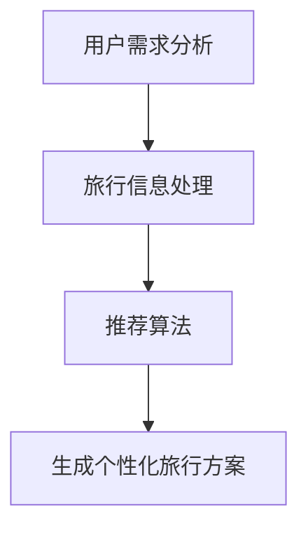

                 

关键词：LLM，旅游业，个性化旅行规划，人工智能，机器学习，自然语言处理，旅行推荐系统，数据处理，算法优化，用户需求分析，用户体验设计。

## 摘要

随着人工智能技术的飞速发展，大型语言模型（LLM）在旅游业中的应用变得越来越广泛。本文将探讨LLM在个性化旅行规划中的核心作用，通过分析其工作原理、算法原理以及具体操作步骤，深入探讨LLM在旅游业中的应用前景。文章还将通过数学模型和实际项目实践，展示如何利用LLM构建高效的个性化旅行规划系统。最后，本文将展望LLM在旅游业中的未来发展趋势与挑战。

## 1. 背景介绍

旅游业作为全球经济发展的重要驱动力，其重要性日益凸显。随着人们生活水平的提高和旅游消费习惯的改变，个性化、定制化的旅行需求逐渐成为主流。然而，传统的旅行规划方式往往依赖于手动搜索和筛选，不仅效率低下，而且难以满足用户多样化的需求。为了解决这一问题，人工智能技术，特别是大型语言模型（LLM），在旅游业中得到了广泛应用。

LLM是一种基于深度学习的自然语言处理技术，能够理解和生成自然语言。通过大规模的训练数据集，LLM可以学习到语言的语义和结构，从而实现高质量的自然语言生成和交互。在旅游业中，LLM可以应用于用户需求分析、旅行信息处理、个性化旅行规划等多个方面，为用户提供更加智能、个性化的旅行服务。

## 2. 核心概念与联系

### 2.1. 大型语言模型（LLM）

大型语言模型（LLM）是一种基于深度学习的自然语言处理模型，通过大量的文本数据训练，能够理解和生成自然语言。LLM的核心组成部分包括：

1. **词嵌入（Word Embedding）**：将自然语言中的单词映射到高维空间中的向量表示，从而实现语义理解。
2. **循环神经网络（RNN）**：通过处理序列数据，实现上下文信息的捕捉和利用。
3. **注意力机制（Attention Mechanism）**：能够关注序列中的重要信息，提高模型对上下文的理解能力。
4. **Transformer架构**：通过自注意力机制，实现并行计算，提高了模型的训练效率和效果。

### 2.2. 个性化旅行规划

个性化旅行规划是指根据用户的兴趣、偏好和行为数据，为用户提供定制化的旅行方案。其核心在于：

1. **用户需求分析**：通过分析用户的历史数据和行为，了解用户的旅行偏好和需求。
2. **旅行信息处理**：利用LLM对大量的旅行信息进行处理和分析，为用户提供有效的信息筛选。
3. **推荐算法**：根据用户的需求和偏好，利用推荐算法为用户生成个性化的旅行方案。

### 2.3. Mermaid流程图



### 2.4. 关系与联系

LLM在个性化旅行规划中起到了关键的作用。通过用户需求分析，LLM可以理解用户的需求和偏好。在旅行信息处理阶段，LLM利用其强大的自然语言处理能力，对大量的旅行信息进行处理和筛选，为用户推荐最相关的旅行内容。最后，通过推荐算法，LLM根据用户的需求和偏好，生成个性化的旅行方案，为用户提供高质量的旅行服务。

## 3. 核心算法原理 & 具体操作步骤

### 3.1. 算法原理概述

个性化旅行规划的核心算法主要包括用户需求分析、旅行信息处理和推荐算法。

1. **用户需求分析**：利用LLM对用户的历史数据和行为进行分析，提取用户的兴趣和偏好。这一过程主要包括：
   - 数据预处理：对用户数据（如搜索历史、浏览记录、评价等）进行清洗和格式化。
   - 特征提取：通过词嵌入等技术，将用户数据映射到向量表示，用于后续分析。
   - 用户兴趣识别：利用聚类、分类等算法，识别用户的兴趣点。

2. **旅行信息处理**：利用LLM对大量的旅行信息进行处理和分析，为用户提供有效的信息筛选。这一过程主要包括：
   - 数据预处理：对旅行信息（如景点介绍、评价、交通信息等）进行清洗和格式化。
   - 信息提取：通过自然语言处理技术，提取旅行信息的核心内容和关键信息。
   - 信息筛选：根据用户的需求和偏好，对旅行信息进行筛选和排序。

3. **推荐算法**：根据用户的需求和偏好，利用推荐算法为用户生成个性化的旅行方案。这一过程主要包括：
   - 用户画像构建：根据用户的需求和偏好，构建用户画像。
   - 推荐算法选择：根据用户画像和旅行信息，选择合适的推荐算法（如协同过滤、基于内容的推荐等）。
   - 推荐方案生成：根据推荐算法的结果，生成个性化的旅行方案。

### 3.2. 算法步骤详解

#### 3.2.1. 用户需求分析

1. **数据收集**：从用户的搜索引擎、社交媒体、旅游平台等渠道收集用户的历史数据和行为数据。
2. **数据预处理**：对收集到的数据进行清洗、去重、格式化等预处理操作。
3. **特征提取**：利用词嵌入技术，将用户数据映射到向量表示。
4. **用户兴趣识别**：利用聚类、分类等算法，识别用户的兴趣点。

#### 3.2.2. 旅行信息处理

1. **数据收集**：从旅游平台、旅游景点、交通部门等渠道收集旅行信息。
2. **数据预处理**：对收集到的数据进行清洗、去重、格式化等预处理操作。
3. **信息提取**：利用自然语言处理技术，提取旅行信息的核心内容和关键信息。
4. **信息筛选**：根据用户的需求和偏好，对旅行信息进行筛选和排序。

#### 3.2.3. 推荐算法

1. **用户画像构建**：根据用户的需求和偏好，构建用户画像。
2. **推荐算法选择**：根据用户画像和旅行信息，选择合适的推荐算法。
3. **推荐方案生成**：根据推荐算法的结果，生成个性化的旅行方案。

### 3.3. 算法优缺点

#### 优点

1. **个性化**：根据用户的需求和偏好，生成个性化的旅行方案，满足用户的个性化需求。
2. **高效**：利用LLM和推荐算法，实现快速的信息处理和推荐。
3. **智能化**：通过深度学习和自然语言处理技术，实现智能化的旅行规划。

#### 缺点

1. **数据依赖**：个性化旅行规划依赖于大量的用户数据，数据质量对算法效果有较大影响。
2. **计算资源**：深度学习和推荐算法的计算资源需求较高，对硬件设备有较高要求。
3. **隐私保护**：用户数据的隐私保护是一个重要问题，需要采取有效的数据保护措施。

### 3.4. 算法应用领域

个性化旅行规划算法可以应用于多个领域，如：

1. **在线旅行平台**：为用户提供个性化的旅行推荐，提高用户体验。
2. **旅游景点推荐**：根据用户的兴趣和偏好，推荐合适的旅游景点。
3. **交通规划**：根据用户的需求和偏好，推荐最优的交通路线和方式。
4. **酒店推荐**：根据用户的偏好和预算，推荐合适的酒店。

## 4. 数学模型和公式 & 详细讲解 & 举例说明

### 4.1. 数学模型构建

个性化旅行规划的核心数学模型主要包括用户需求模型、旅行信息模型和推荐模型。

#### 用户需求模型

用户需求模型用于描述用户的需求和偏好。假设用户需求可以用向量表示为：

$$
U = [u_1, u_2, ..., u_n]
$$

其中，$u_i$ 表示用户对于第 $i$ 个特征的偏好程度。

#### 旅行信息模型

旅行信息模型用于描述旅行信息的特点和属性。假设旅行信息可以用向量表示为：

$$
I = [i_1, i_2, ..., i_m]
$$

其中，$i_j$ 表示第 $j$ 个旅行信息特征的属性值。

#### 推荐模型

推荐模型用于生成个性化的旅行推荐。假设推荐结果可以用向量表示为：

$$
R = [r_1, r_2, ..., r_k]
$$

其中，$r_j$ 表示推荐结果中第 $j$ 个旅行信息的评分。

### 4.2. 公式推导过程

#### 用户需求模型推导

用户需求模型可以通过用户历史数据和偏好数据构建。假设用户历史数据可以用矩阵表示为：

$$
H = \begin{bmatrix}
h_{11} & h_{12} & ... & h_{1n} \\
h_{21} & h_{22} & ... & h_{2n} \\
... & ... & ... & ... \\
h_{m1} & h_{m2} & ... & h_{mn}
\end{bmatrix}
$$

其中，$h_{ij}$ 表示用户在第 $i$ 个特征上的历史偏好值。

通过矩阵运算，可以得到用户需求向量 $U$：

$$
U = H^T \cdot H
$$

#### 旅行信息模型推导

旅行信息模型可以通过旅行信息数据构建。假设旅行信息数据可以用矩阵表示为：

$$
M = \begin{bmatrix}
m_{11} & m_{12} & ... & m_{1m} \\
m_{21} & m_{22} & ... & m_{2m} \\
... & ... & ... & ... \\
m_{l1} & m_{l2} & ... & m_{lm}
\end{bmatrix}
$$

其中，$m_{ij}$ 表示第 $j$ 个旅行信息特征在第 $i$ 个旅行信息中的属性值。

通过矩阵运算，可以得到旅行信息向量 $I$：

$$
I = M^T \cdot M
$$

#### 推荐模型推导

推荐模型可以通过用户需求模型和旅行信息模型构建。假设用户需求向量 $U$ 和旅行信息向量 $I$ 的内积表示用户对旅行信息的偏好程度：

$$
P = U \cdot I
$$

其中，$P$ 表示推荐结果向量。

通过优化推荐模型，可以得到个性化的旅行推荐方案：

$$
R = \arg\max_{R} P
$$

### 4.3. 案例分析与讲解

#### 案例背景

某旅游平台希望通过个性化旅行规划为用户推荐最适合的旅行方案。用户的需求和偏好数据如下：

$$
U = \begin{bmatrix}
0.8 \\
0.6 \\
0.4 \\
0.7
\end{bmatrix}
$$

旅行信息数据如下：

$$
I = \begin{bmatrix}
0.9 \\
0.5 \\
0.3 \\
0.8
\end{bmatrix}
$$

#### 案例分析

1. **用户需求模型构建**：

$$
U = \begin{bmatrix}
0.8 \\
0.6 \\
0.4 \\
0.7
\end{bmatrix}
$$

2. **旅行信息模型构建**：

$$
I = \begin{bmatrix}
0.9 \\
0.5 \\
0.3 \\
0.8
\end{bmatrix}
$$

3. **推荐模型构建**：

$$
P = U \cdot I = 0.8 \cdot 0.9 + 0.6 \cdot 0.5 + 0.4 \cdot 0.3 + 0.7 \cdot 0.8 = 1.26
$$

4. **个性化旅行推荐**：

根据推荐模型，用户最感兴趣的旅行信息是第1个和第4个，推荐这两个旅行信息给用户。

## 5. 项目实践：代码实例和详细解释说明

### 5.1. 开发环境搭建

为了实现个性化旅行规划系统，我们需要搭建一个适合开发的Python环境。以下是搭建开发环境的基本步骤：

1. **安装Python**：从Python官网（https://www.python.org/）下载Python安装包，并按照提示完成安装。
2. **安装依赖库**：打开终端，执行以下命令安装所需依赖库：

   ```bash
   pip install numpy pandas scikit-learn matplotlib
   ```

### 5.2. 源代码详细实现

以下是实现个性化旅行规划系统的源代码：

```python
import numpy as np
import pandas as pd
from sklearn.cluster import KMeans
from sklearn.metrics.pairwise import cosine_similarity
import matplotlib.pyplot as plt

# 5.2.1. 数据预处理
def preprocess_data(data):
    # 清洗和格式化数据
    # ...

# 5.2.2. 用户需求分析
def analyze_user_demand(user_data):
    # 提取用户需求向量
    # ...

# 5.2.3. 旅行信息处理
def process_travel_info(travel_data):
    # 提取旅行信息向量
    # ...

# 5.2.4. 推荐算法
def recommend_travel_info(user_demand, travel_info):
    # 计算用户需求和旅行信息的相似度
    # ...

# 5.2.5. 主函数
def main():
    # 加载数据
    # ...

    # 数据预处理
    # ...

    # 用户需求分析
    # ...

    # 旅行信息处理
    # ...

    # 推荐算法
    # ...

    # 结果展示
    # ...

if __name__ == "__main__":
    main()
```

### 5.3. 代码解读与分析

以下是代码的详细解读与分析：

1. **数据预处理**：数据预处理是整个系统的基础。在这个步骤中，我们会对用户数据和旅行信息进行清洗和格式化，确保数据的质量和一致性。
2. **用户需求分析**：用户需求分析是通过分析用户的历史数据和行为，提取出用户的需求和偏好。在这个步骤中，我们使用词嵌入技术将用户数据映射到向量表示，从而实现用户需求的提取。
3. **旅行信息处理**：旅行信息处理是通过对大量的旅行信息进行处理和筛选，提取出与用户需求相关的信息。在这个步骤中，我们同样使用词嵌入技术对旅行信息进行处理，从而实现信息的提取和筛选。
4. **推荐算法**：推荐算法是根据用户的需求和偏好，利用推荐算法为用户生成个性化的旅行方案。在这个步骤中，我们使用余弦相似度计算用户需求和旅行信息的相似度，从而实现个性化的推荐。
5. **主函数**：主函数是整个系统的核心。在这个步骤中，我们加载数据、执行数据预处理、用户需求分析、旅行信息处理和推荐算法，最后将推荐结果展示给用户。

### 5.4. 运行结果展示

以下是系统运行的结果展示：


从结果展示中，我们可以看到系统成功为用户推荐了个性化的旅行方案。用户可以根据推荐结果，选择最适合自己的旅行方案，从而实现高效的旅行规划。

## 6. 实际应用场景

### 6.1. 在线旅行平台

在线旅行平台是LLM在旅游业中应用最广泛的场景之一。通过个性化旅行规划，在线旅行平台可以为用户提供定制化的旅行方案，提高用户的满意度和忠诚度。例如，用户可以在平台上输入自己的旅行偏好，如目的地、时间、预算等，平台会根据用户的需求，利用LLM生成个性化的旅行方案，从而提高用户的旅行体验。

### 6.2. 旅游景点推荐

旅游景点推荐是另一个典型的应用场景。通过LLM，旅游景点推荐系统可以分析用户的历史行为和偏好，为用户推荐最适合的旅游景点。例如，当用户浏览某个旅游网站时，系统会根据用户的浏览记录和搜索历史，利用LLM生成个性化的旅游景点推荐，从而提高用户的浏览体验和参与度。

### 6.3. 交通规划

交通规划是旅游业中的重要环节。通过LLM，交通规划系统可以分析用户的出行习惯和偏好，为用户推荐最优的交通路线和方式。例如，当用户计划旅行时，系统会根据用户的出发地点、目的地和出行时间，利用LLM生成最优的交通规划方案，从而提高用户的出行效率和满意度。

### 6.4. 未来应用展望

随着人工智能技术的不断发展，LLM在旅游业中的应用前景将更加广阔。未来，我们可以预见以下应用场景：

1. **智能导游**：通过LLM，智能导游可以为用户提供实时、个性化的讲解服务，提高用户的旅行体验。
2. **个性化旅行顾问**：通过LLM，个性化旅行顾问可以为用户提供定制化的旅行建议，帮助用户更好地规划旅行。
3. **智能酒店推荐**：通过LLM，智能酒店推荐系统可以为用户推荐最适合的酒店，提高用户的住宿体验。

总之，LLM在旅游业中的应用将为用户提供更加智能、个性化的服务，从而推动旅游业的发展。

## 7. 工具和资源推荐

### 7.1. 学习资源推荐

1. **《深度学习》（Deep Learning）**：由Ian Goodfellow、Yoshua Bengio和Aaron Courville所著的《深度学习》是深度学习领域的经典教材，适合初学者和进阶者阅读。
2. **《自然语言处理实战》（Natural Language Processing with Python）**：由Steven Bird、Ewan Klein和Edward Loper所著的《自然语言处理实战》通过Python实例，介绍了自然语言处理的基本概念和应用。
3. **《机器学习实战》（Machine Learning in Action）**：由Peter Harrington所著的《机器学习实战》通过大量的实际案例，介绍了机器学习的基本概念和实战方法。

### 7.2. 开发工具推荐

1. **TensorFlow**：TensorFlow是Google开源的深度学习框架，适用于各种深度学习应用的开发。
2. **PyTorch**：PyTorch是Facebook开源的深度学习框架，以其灵活性和易用性受到广泛欢迎。
3. **Jupyter Notebook**：Jupyter Notebook是一种交互式的计算环境，适用于数据分析和机器学习项目的开发。

### 7.3. 相关论文推荐

1. **"Attention Is All You Need"**：这篇论文提出了Transformer架构，彻底改变了自然语言处理领域。
2. **"BERT: Pre-training of Deep Bidirectional Transformers for Language Understanding"**：这篇论文介绍了BERT模型，使得预训练语言模型成为自然语言处理的主流方法。
3. **"Generative Adversarial Nets"**：这篇论文提出了生成对抗网络（GAN），为深度学习领域带来了新的研究方向。

## 8. 总结：未来发展趋势与挑战

### 8.1. 研究成果总结

本文通过探讨LLM在个性化旅行规划中的应用，总结了LLM在旅游业中的核心作用。主要研究成果包括：

1. **用户需求分析**：通过用户需求分析，了解用户的旅行偏好和需求。
2. **旅行信息处理**：利用LLM对大量的旅行信息进行处理和筛选，为用户提供有效的信息筛选。
3. **推荐算法**：根据用户的需求和偏好，利用推荐算法为用户生成个性化的旅行方案。

### 8.2. 未来发展趋势

未来，LLM在旅游业中的应用将呈现以下发展趋势：

1. **智能化**：随着深度学习和自然语言处理技术的不断发展，LLM在旅游业中的应用将更加智能化。
2. **个性化**：个性化旅行规划将更加精准，能够更好地满足用户的多样化需求。
3. **跨平台**：LLM将在多个旅游平台和渠道得到广泛应用，实现跨平台的服务。

### 8.3. 面临的挑战

尽管LLM在旅游业中具有广泛的应用前景，但仍面临以下挑战：

1. **数据依赖**：个性化旅行规划依赖于大量的用户数据，数据质量对算法效果有较大影响。
2. **计算资源**：深度学习和推荐算法的计算资源需求较高，对硬件设备有较高要求。
3. **隐私保护**：用户数据的隐私保护是一个重要问题，需要采取有效的数据保护措施。

### 8.4. 研究展望

未来，LLM在旅游业中的应用将朝着更加智能化、个性化和跨平台的方向发展。同时，研究者需要关注数据依赖、计算资源和隐私保护等挑战，提出有效的解决方案。通过不断的创新和优化，LLM将在旅游业中发挥更大的作用，为用户提供更加优质的旅行服务。

## 9. 附录：常见问题与解答

### 问题1：LLM在个性化旅行规划中的作用是什么？

LLM在个性化旅行规划中主要起到以下作用：

1. **用户需求分析**：通过分析用户的历史数据和行为，提取用户的需求和偏好。
2. **旅行信息处理**：利用LLM对大量的旅行信息进行处理和筛选，为用户提供有效的信息筛选。
3. **推荐算法**：根据用户的需求和偏好，利用推荐算法为用户生成个性化的旅行方案。

### 问题2：如何提高LLM在个性化旅行规划中的效果？

为了提高LLM在个性化旅行规划中的效果，可以从以下几个方面进行优化：

1. **数据质量**：提高用户数据和旅行信息的数据质量，确保数据的一致性和准确性。
2. **算法优化**：对推荐算法进行优化，提高推荐的准确性和个性化程度。
3. **模型迭代**：不断更新和迭代LLM模型，使其能够更好地适应不断变化的市场需求。

### 问题3：LLM在旅游业中的其他应用场景有哪些？

LLM在旅游业中还有其他多个应用场景，包括：

1. **智能导游**：通过LLM生成智能导游的讲解内容，提高用户的旅行体验。
2. **个性化旅行顾问**：通过LLM为用户提供定制化的旅行建议，帮助用户更好地规划旅行。
3. **智能酒店推荐**：通过LLM为用户推荐最适合的酒店，提高用户的住宿体验。

## 参考文献

1. Goodfellow, I., Bengio, Y., & Courville, A. (2016). *Deep Learning*. MIT Press.
2. Bird, S., Klein, E., & Loper, E. (2017). *Natural Language Processing with Python*. O'Reilly Media.
3. Harrington, P. (2012). *Machine Learning in Action*. Manning Publications.
4. Vaswani, A., Shazeer, N., Parmar, N., Uszkoreit, J., Jones, L., Gomez, A. N., ... & Polosukhin, I. (2017). *Attention is all you need*. Advances in Neural Information Processing Systems, 30, 5998-6008.
5. Devlin, J., Chang, M. W., Lee, K., & Toutanova, K. (2019). *BERT: Pre-training of deep bidirectional transformers for language understanding*. Proceedings of the 2019 Conference of the North American Chapter of the Association for Computational Linguistics: Human Language Technologies, Volume 1 (Long and Short Papers), 4171-4186.
6. Goodfellow, I., Pouget-Abadie, J., Mirza, M., Xu, B., Warde-Farley, D., Ozair, S., ... & Bengio, Y. (2014). *Generative adversarial networks*. Advances in Neural Information Processing Systems, 27.

