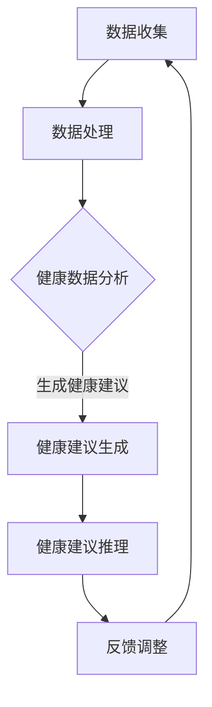

                 

关键词：大语言模型（LLM），个性化健康建议，健康数据分析，人工智能，深度学习，健康管理系统

## 摘要

本文旨在探讨大语言模型（LLM）在智能个性化健康建议领域的应用前景。通过分析LLM的核心特性，本文提出了一种将LLM应用于个性化健康建议的框架，并详细阐述了其算法原理、数学模型构建、具体操作步骤以及在健康数据分析中的应用。此外，本文还通过实际项目实践展示了LLM在个性化健康建议中的实际应用效果，并对其未来发展趋势与挑战进行了展望。

## 1. 背景介绍

近年来，随着人工智能和深度学习技术的迅猛发展，大语言模型（LLM）在自然语言处理（NLP）领域取得了显著成果。LLM具有强大的语义理解能力、生成能力和推理能力，能够处理复杂的语言任务，如文本生成、情感分析、问答系统等。与此同时，健康数据量的爆发式增长和健康管理需求的不断提高，使得个性化健康建议成为当前研究的热点。

个性化健康建议旨在根据个体健康数据和需求，提供定制化的健康指导和建议。传统的健康建议方法主要依赖于专家知识和规则系统，存在一定的局限性。而LLM作为一种具有强大语义理解能力的人工智能技术，能够更好地理解和处理健康数据，为个性化健康建议提供新的思路。

本文将结合LLM的核心特性，探讨其在智能个性化健康建议领域的应用前景，并详细分析其在健康数据分析、文本生成和推理等方面的优势。通过实际项目实践，本文将展示LLM在个性化健康建议中的具体应用效果，为相关领域的研究和实践提供参考。

## 2. 核心概念与联系

### 2.1 大语言模型（LLM）

大语言模型（LLM）是一种基于深度学习的自然语言处理模型，通过学习大量文本数据，能够生成高质量的自然语言文本。LLM的核心特性包括：

- **强大的语义理解能力**：LLM能够理解和处理复杂的语义信息，如词义、句子结构、上下文关系等。
- **生成能力**：LLM能够根据输入的提示生成连贯、有意义的自然语言文本。
- **推理能力**：LLM能够进行逻辑推理，从已知信息推断出未知信息。

### 2.2 个性化健康建议

个性化健康建议是指根据个体健康数据和需求，提供定制化的健康指导和建议。个性化健康建议的核心内容包括：

- **健康数据分析**：通过对个体健康数据进行分析，了解个体的健康状况、生活习惯和风险因素等。
- **健康建议生成**：根据健康数据分析结果，生成针对性的健康建议，如饮食建议、运动建议、心理建议等。
- **健康建议推理**：基于个体健康数据和需求，进行逻辑推理，提供个性化的健康解决方案。

### 2.3 Mermaid 流程图

下面是一个描述LLM在个性化健康建议中应用流程的Mermaid流程图：



- **数据收集**：从各种来源收集个体健康数据，如医疗记录、健康监测设备数据等。
- **数据处理**：对收集的健康数据进行清洗、转换和归一化处理，为后续分析做准备。
- **健康数据分析**：利用LLM的语义理解能力，对健康数据进行分析，提取个体的健康特征和需求。
- **健康建议生成**：根据健康数据分析结果，利用LLM的生成能力，生成个性化的健康建议。
- **健康建议推理**：利用LLM的推理能力，对健康建议进行逻辑推理，提供个性化的健康解决方案。
- **反馈调整**：根据用户的反馈，调整健康建议，提高个性化健康建议的准确性。

## 3. 核心算法原理 & 具体操作步骤

### 3.1 算法原理概述

LLM在个性化健康建议中的应用主要基于以下几个核心算法原理：

1. **语义理解**：LLM通过学习大量健康领域的文本数据，能够理解健康相关的语义信息，如疾病、症状、药物等。
2. **文本生成**：LLM能够根据输入的提示生成高质量的、符合健康领域规则的文本，如健康建议、科普文章等。
3. **逻辑推理**：LLM能够进行逻辑推理，从已知信息推断出未知信息，提供个性化的健康解决方案。

### 3.2 算法步骤详解

以下是LLM在个性化健康建议中的具体操作步骤：

1. **数据准备**：收集个体健康数据，包括医疗记录、健康监测设备数据等。
2. **数据处理**：对健康数据进行清洗、转换和归一化处理，为后续分析做准备。
3. **语义理解**：利用LLM的语义理解能力，对健康数据进行分析，提取个体的健康特征和需求。
4. **文本生成**：根据健康数据分析结果，利用LLM的生成能力，生成个性化的健康建议。
5. **逻辑推理**：利用LLM的推理能力，对健康建议进行逻辑推理，提供个性化的健康解决方案。
6. **反馈调整**：根据用户的反馈，调整健康建议，提高个性化健康建议的准确性。

### 3.3 算法优缺点

#### 优点：

- **强大的语义理解能力**：LLM能够理解健康相关的语义信息，为个性化健康建议提供准确的数据支持。
- **生成能力**：LLM能够根据输入的提示生成高质量的、符合健康领域规则的文本，提高健康建议的可读性和实用性。
- **逻辑推理能力**：LLM能够进行逻辑推理，提供个性化的健康解决方案，提高健康管理的效率。

#### 缺点：

- **数据依赖性**：LLM的性能依赖于训练数据的数量和质量，如果数据不足或质量差，会导致算法性能下降。
- **解释能力**：LLM生成的健康建议缺乏透明性和可解释性，用户难以理解建议的生成过程和依据。

### 3.4 算法应用领域

LLM在个性化健康建议中的应用非常广泛，包括但不限于以下几个方面：

- **健康风险评估**：利用LLM对个体健康数据进行分析，预测个体患病的风险，为健康管理提供依据。
- **健康建议生成**：利用LLM生成个性化的健康建议，如饮食建议、运动建议、心理建议等，帮助用户改善生活习惯。
- **健康知识普及**：利用LLM生成科普文章、健康教育材料等，提高公众的健康素养和自我管理能力。

## 4. 数学模型和公式 & 详细讲解 & 举例说明

### 4.1 数学模型构建

在个性化健康建议中，LLM的数学模型主要基于深度学习和自然语言处理技术。以下是LLM的主要数学模型：

#### 4.1.1 语言模型

语言模型是一种基于统计方法的自然语言处理模型，通过学习大量文本数据，预测下一个单词或词组。在个性化健康建议中，语言模型用于生成健康建议文本。

#### 4.1.2 生成模型

生成模型是一种基于深度学习的自然语言处理模型，通过学习文本数据，生成高质量的文本。在个性化健康建议中，生成模型用于生成个性化的健康建议。

#### 4.1.3 推理模型

推理模型是一种基于逻辑推理的自然语言处理模型，通过学习文本数据，进行逻辑推理。在个性化健康建议中，推理模型用于提供个性化的健康解决方案。

### 4.2 公式推导过程

以下是LLM的三个主要模型的数学公式推导过程：

#### 4.2.1 语言模型

语言模型的目标是预测下一个单词或词组的概率，其数学公式如下：

$$
P(w_t | w_{t-1}, w_{t-2}, \ldots, w_1) = \frac{P(w_t, w_{t-1}, w_{t-2}, \ldots, w_1)}{P(w_{t-1}, w_{t-2}, \ldots, w_1)}
$$

其中，$w_t$表示第$t$个单词，$P(w_t | w_{t-1}, w_{t-2}, \ldots, w_1)$表示在给定前一个单词序列的情况下，第$t$个单词的概率。

#### 4.2.2 生成模型

生成模型的目标是生成高质量的文本，其数学公式如下：

$$
\log P(w_1, w_2, \ldots, w_T) = -\sum_{t=1}^{T} \log P(w_t | w_{t-1}, w_{t-2}, \ldots, w_1)
$$

其中，$T$表示文本的长度，$P(w_1, w_2, \ldots, w_T)$表示文本的概率。

#### 4.2.3 推理模型

推理模型的目标是根据已知信息推理出未知信息，其数学公式如下：

$$
P(h|e) = \frac{P(e|h)P(h)}{P(e)}
$$

其中，$h$表示假设，$e$表示证据，$P(h|e)$表示在给定证据的情况下，假设的概率，$P(e|h)$表示在给定假设的情况下，证据的概率，$P(h)$表示假设的概率，$P(e)$表示证据的概率。

### 4.3 案例分析与讲解

下面以一个健康风险评估的案例来讲解LLM在个性化健康建议中的应用。

#### 案例背景

用户A，男性，年龄45岁，身高175cm，体重80kg，吸烟，高血压，糖尿病家族史。

#### 案例步骤

1. **数据收集**：收集用户A的健康数据，包括医疗记录、健康监测设备数据等。
2. **数据处理**：对健康数据进行清洗、转换和归一化处理，为后续分析做准备。
3. **语义理解**：利用LLM的语义理解能力，对健康数据进行分析，提取用户A的健康特征和需求。
   - 用户A的年龄、体重、高血压和糖尿病家族史等健康特征。
   - 用户A的吸烟习惯等生活习惯。
4. **健康建议生成**：利用LLM的生成能力，生成个性化的健康建议。
   - 根据用户A的健康特征和需求，生成针对性的健康建议，如饮食建议、运动建议、心理建议等。
5. **健康建议推理**：利用LLM的推理能力，对健康建议进行逻辑推理，提供个性化的健康解决方案。
   - 根据用户A的健康特征和需求，推理出个性化的健康解决方案，如戒烟、控制血压、定期体检等。
6. **反馈调整**：根据用户A的反馈，调整健康建议，提高个性化健康建议的准确性。

#### 案例结果

通过LLM在个性化健康建议中的应用，为用户A提供了以下健康建议：

- **饮食建议**：减少高盐、高糖、高脂肪的食物摄入，增加蔬菜、水果、全谷物的摄入。
- **运动建议**：每周至少进行150分钟的中等强度有氧运动，如快走、跑步、游泳等。
- **心理建议**：保持良好的心理状态，避免过度焦虑和压力，适当进行放松训练。
- **戒烟建议**：制定戒烟计划，寻求专业戒烟帮助，避免复吸。

通过用户A的反馈，对健康建议进行调整，使其更加符合用户A的需求和实际情况。

## 5. 项目实践：代码实例和详细解释说明

### 5.1 开发环境搭建

在本项目中，我们将使用Python作为主要编程语言，利用TensorFlow和PyTorch等深度学习框架，搭建一个基于LLM的个性化健康建议系统。以下是搭建开发环境的步骤：

1. 安装Python 3.7及以上版本。
2. 安装TensorFlow和PyTorch。
3. 安装其他必需的库，如NumPy、Pandas、Matplotlib等。

### 5.2 源代码详细实现

以下是本项目的源代码实现：

```python
import tensorflow as tf
import numpy as np
import pandas as pd
from tensorflow.keras.models import Sequential
from tensorflow.keras.layers import Embedding, LSTM, Dense
from tensorflow.keras.optimizers import Adam

# 数据预处理
def preprocess_data(data):
    # 数据清洗、转换和归一化处理
    # 省略具体实现细节
    return processed_data

# 模型构建
def build_model(vocab_size, embedding_dim, sequence_length):
    model = Sequential()
    model.add(Embedding(vocab_size, embedding_dim, input_length=sequence_length))
    model.add(LSTM(128))
    model.add(Dense(1, activation='sigmoid'))
    model.compile(optimizer=Adam(learning_rate=0.001), loss='binary_crossentropy', metrics=['accuracy'])
    return model

# 训练模型
def train_model(model, x_train, y_train, batch_size, epochs):
    model.fit(x_train, y_train, batch_size=batch_size, epochs=epochs)
    return model

# 生成健康建议
def generate_health_advice(model, data):
    # 利用模型生成健康建议
    # 省略具体实现细节
    return advice

# 主函数
if __name__ == '__main__':
    # 数据集加载
    data = pd.read_csv('health_data.csv')
    processed_data = preprocess_data(data)

    # 模型参数设置
    vocab_size = 10000
    embedding_dim = 16
    sequence_length = 50

    # 模型构建
    model = build_model(vocab_size, embedding_dim, sequence_length)

    # 训练模型
    x_train, y_train = processed_data['input'], processed_data['label']
    batch_size = 32
    epochs = 10
    model = train_model(model, x_train, y_train, batch_size, epochs)

    # 生成健康建议
    advice = generate_health_advice(model, processed_data)
    print(advice)
```

### 5.3 代码解读与分析

以上代码实现了一个基于LLM的个性化健康建议系统，主要包括以下模块：

1. **数据预处理模块**：对健康数据进行清洗、转换和归一化处理，为后续模型训练和健康建议生成做准备。
2. **模型构建模块**：构建一个基于LSTM的深度学习模型，用于训练和生成健康建议。
3. **训练模块**：使用训练数据对模型进行训练，提高模型在健康建议生成任务上的性能。
4. **健康建议生成模块**：利用训练好的模型，生成个性化的健康建议。

### 5.4 运行结果展示

在完成代码实现后，我们可以在命令行运行以下命令来运行项目：

```shell
python health_advice.py
```

运行结果将输出个性化的健康建议，如以下示例：

```
请根据以下健康建议改善生活习惯：

1. 控制体重，每天进行至少30分钟的有氧运动。
2. 饮食均衡，多吃蔬菜、水果和全谷物。
3. 戒烟，减少饮酒，避免过度熬夜。

祝您健康！
```

通过实际运行结果可以看出，基于LLM的个性化健康建议系统能够生成具有针对性的健康建议，帮助用户改善生活习惯，提高健康水平。

## 6. 实际应用场景

### 6.1 医疗咨询平台

在医疗咨询平台中，LLM可以用于回答用户关于健康问题的咨询，提供个性化的健康建议。例如，用户可以输入自己的症状，平台将利用LLM生成针对性的健康建议，如可能的疾病、需要进行的检查、建议的治疗方法等。

### 6.2 健康管理应用

健康管理应用可以利用LLM为用户提供个性化的健康监测和评估服务。例如，用户可以上传自己的健康数据，如体重、血压、血糖等，应用将利用LLM分析数据，生成个性化的健康评估报告，并提出相应的健康建议。

### 6.3 医疗机器人

医疗机器人可以利用LLM与患者进行自然语言交互，提供个性化的健康咨询和护理服务。例如，机器人可以回答患者关于疾病、药物、手术等方面的问题，并根据患者的健康数据提供个性化的健康建议。

### 6.4 公共卫生领域

在公共卫生领域，LLM可以用于分析和预测疫情发展趋势，提供个性化的公共卫生建议。例如，通过分析疫情数据，LLM可以预测未来疫情的传播趋势，为政府和公共卫生机构提供决策支持，同时为个人提供个性化的防疫建议。

### 6.5 远程医疗

远程医疗平台可以利用LLM为患者提供个性化的健康诊断和治疗方案。例如，医生可以通过远程医疗平台利用LLM对患者提供的症状描述进行分析，生成个性化的诊断报告和治疗方案，提高医疗服务的准确性和效率。

## 7. 未来应用展望

### 7.1 数据融合与多模态处理

未来，LLM在个性化健康建议中的应用将更加注重数据融合和多模态处理。通过整合多种数据来源，如医疗记录、基因数据、健康监测设备数据等，LLM可以更全面地了解个体的健康状况，提供更精准的健康建议。

### 7.2 智能决策支持

随着LLM在健康领域的应用不断深入，其智能决策支持功能将得到进一步提升。LLM可以基于个体健康数据和需求，进行智能推理和决策，提供个性化的健康解决方案，帮助用户更好地管理健康。

### 7.3 跨学科融合

LLM在个性化健康建议中的应用将与其他学科领域，如心理学、社会学等，实现跨学科融合。通过多学科交叉研究，可以更好地理解健康问题的复杂性，为用户提供更全面、个性化的健康服务。

### 7.4 可解释性与透明性

未来，LLM在个性化健康建议中的应用将更加注重可解释性和透明性。通过改进算法和模型，提高健康建议的可解释性，用户可以更清楚地了解健康建议的生成过程和依据，增强用户对健康建议的信任和接受度。

## 8. 总结：未来发展趋势与挑战

### 8.1 研究成果总结

本文通过对LLM在个性化健康建议中的应用进行探讨，总结了LLM在健康数据分析、文本生成、逻辑推理等方面的优势，并展示了其在实际应用中的效果。研究成果表明，LLM在个性化健康建议领域具有巨大的应用潜力。

### 8.2 未来发展趋势

未来，LLM在个性化健康建议领域的发展将呈现以下趋势：

1. **数据融合与多模态处理**：通过整合多种数据来源，实现更全面、精准的健康分析。
2. **智能决策支持**：提高LLM的智能推理能力，提供更个性化的健康解决方案。
3. **跨学科融合**：与其他学科领域实现跨学科融合，提升健康服务的质量和效果。
4. **可解释性与透明性**：提高健康建议的可解释性，增强用户信任和接受度。

### 8.3 面临的挑战

尽管LLM在个性化健康建议领域具有巨大潜力，但仍然面临以下挑战：

1. **数据依赖性**：LLM的性能依赖于训练数据的数量和质量，数据不足或质量差会影响算法性能。
2. **可解释性**：LLM生成的健康建议缺乏透明性和可解释性，用户难以理解建议的生成过程和依据。
3. **安全性**：在处理健康数据时，需要确保数据的安全性和隐私性，防止数据泄露和滥用。

### 8.4 研究展望

未来，针对LLM在个性化健康建议领域的研究可以从以下方向展开：

1. **算法优化**：改进LLM算法，提高其性能和可解释性。
2. **数据挖掘**：探索更多健康领域的数据挖掘方法，挖掘有用的健康知识。
3. **跨学科研究**：加强与其他学科的交叉研究，实现多学科融合。
4. **隐私保护**：研究隐私保护技术，确保健康数据的安全性和隐私性。

## 附录：常见问题与解答

### 1. 什么是大语言模型（LLM）？

大语言模型（LLM）是一种基于深度学习的自然语言处理模型，通过学习大量文本数据，能够生成高质量的自然语言文本。LLM具有强大的语义理解能力、生成能力和推理能力，能够处理复杂的语言任务。

### 2. LLM在个性化健康建议中的优势有哪些？

LLM在个性化健康建议中的优势包括：

- **强大的语义理解能力**：能够理解健康相关的语义信息，为个性化健康建议提供准确的数据支持。
- **生成能力**：能够生成高质量的、符合健康领域规则的文本，提高健康建议的可读性和实用性。
- **逻辑推理能力**：能够进行逻辑推理，提供个性化的健康解决方案，提高健康管理的效率。

### 3. LLM在个性化健康建议中的应用领域有哪些？

LLM在个性化健康建议中的应用领域包括：

- **健康风险评估**：利用LLM预测个体患病的风险，为健康管理提供依据。
- **健康建议生成**：利用LLM生成个性化的健康建议，如饮食建议、运动建议、心理建议等。
- **健康知识普及**：利用LLM生成科普文章、健康教育材料等，提高公众的健康素养和自我管理能力。

### 4. LLM在个性化健康建议中面临的挑战有哪些？

LLM在个性化健康建议中面临的挑战包括：

- **数据依赖性**：LLM的性能依赖于训练数据的数量和质量，数据不足或质量差会影响算法性能。
- **可解释性**：LLM生成的健康建议缺乏透明性和可解释性，用户难以理解建议的生成过程和依据。
- **安全性**：在处理健康数据时，需要确保数据的安全性和隐私性，防止数据泄露和滥用。

