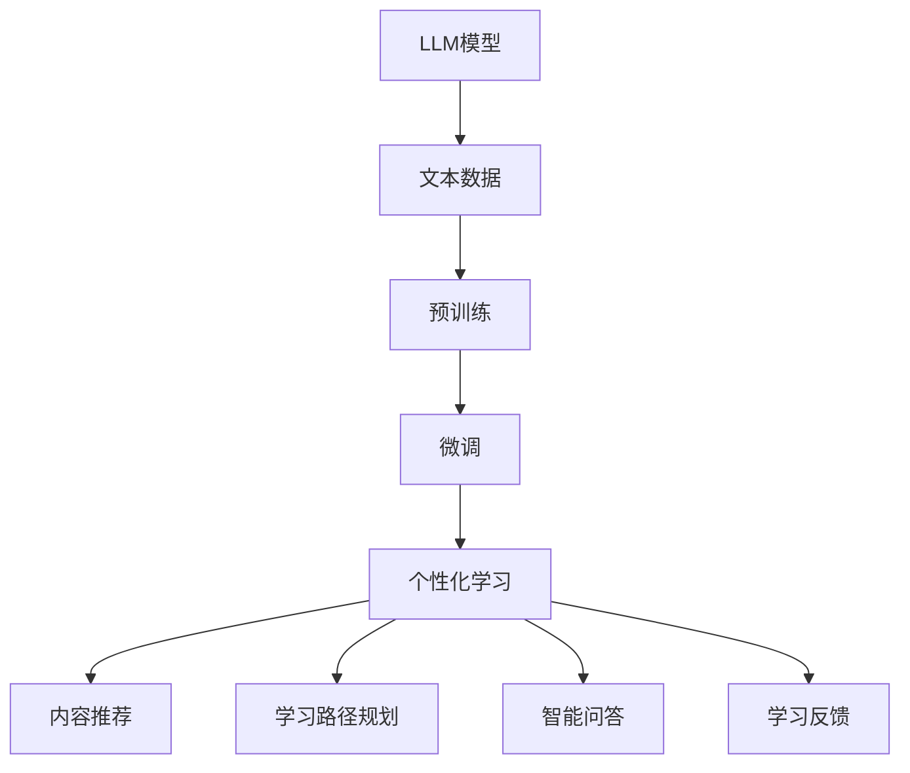

                 

关键词：大型语言模型（LLM），个性化学习，教育技术，智能系统，算法，数学模型，代码实例，应用场景，未来展望

> 摘要：本文旨在探讨大型语言模型（LLM）在构建智能个性化学习系统中的应用。通过分析LLM的核心原理、数学模型及具体操作步骤，本文详细阐述了如何利用LLM实现个性化学习。此外，本文通过项目实践，展示了LLM在实际中的应用效果，并对未来发展趋势及面临的挑战进行了深入探讨。

## 1. 背景介绍

随着人工智能技术的不断发展，教育领域逐渐引入了智能个性化学习系统，以满足不同学习者的个性化需求。传统的教育模式往往难以适应每个学生的独特学习风格和节奏，而智能个性化学习系统则通过分析学生的学习行为和需求，为每个学生提供量身定制的学习方案。

在这其中，大型语言模型（LLM）作为一种强大的自然语言处理技术，逐渐成为了构建智能个性化学习系统的重要工具。LLM能够理解和生成人类语言，具备强大的文本分析、推理和生成能力，因此，在个性化学习场景中具有广泛的应用潜力。

## 2. 核心概念与联系

### 2.1 LLM的概念

大型语言模型（LLM）是一种基于深度学习的自然语言处理模型，通过大量文本数据的学习，能够理解和生成人类语言。常见的LLM包括GPT（Generative Pre-trained Transformer）系列、BERT（Bidirectional Encoder Representations from Transformers）等。

### 2.2 个性化学习的概念

个性化学习是一种以学习者为中心的教育模式，通过分析学习者的学习行为、兴趣和能力，为每个学习者提供量身定制的学习方案。个性化学习旨在提高学习效果，促进学习者主动参与学习过程。

### 2.3 LLM与个性化学习的联系

LLM在个性化学习中的应用主要体现在以下几个方面：

1. **内容推荐**：LLM可以根据学习者的兴趣和学习历史，推荐合适的学习内容。
2. **学习路径规划**：LLM可以根据学习者的能力和学习进度，制定个性化的学习路径。
3. **智能问答**：LLM可以回答学习者的疑问，提供即时的学习帮助。
4. **学习反馈**：LLM可以通过分析学习者的回答，给予个性化的学习反馈。

### 2.4 Mermaid流程图



## 3. 核心算法原理 & 具体操作步骤

### 3.1 算法原理概述

LLM的核心算法是基于深度学习的Transformer架构，通过自注意力机制（Self-Attention）和多头注意力机制（Multi-Head Attention），实现对文本数据的建模和处理。LLM的训练过程包括预训练和微调两个阶段。

### 3.2 算法步骤详解

1. **数据收集**：收集大量的文本数据，包括学习资料、问答对话等。
2. **预训练**：使用预训练模型（如GPT-3、BERT等），在大量文本数据上进行训练，使模型具备语言理解能力。
3. **微调**：根据个性化学习系统的需求，对预训练模型进行微调，使其适应特定的学习场景。
4. **应用**：将微调后的LLM应用于个性化学习系统中，实现内容推荐、学习路径规划、智能问答和学习反馈等功能。

### 3.3 算法优缺点

**优点**：

1. **强大的语言理解能力**：LLM能够理解和生成人类语言，为个性化学习提供有力支持。
2. **自适应性强**：LLM可以根据学习者的需求和兴趣，动态调整学习方案。

**缺点**：

1. **计算资源需求大**：LLM的训练和推理过程需要大量的计算资源，对硬件设施要求较高。
2. **数据隐私问题**：个性化学习过程中涉及到的学习者数据可能存在隐私泄露风险。

### 3.4 算法应用领域

LLM在个性化学习系统中的应用领域包括：

1. **在线教育**：为学习者提供个性化的学习内容和路径，提高学习效果。
2. **智能客服**：为学习者提供智能问答服务，解答学习过程中的疑问。
3. **学习评估**：根据学习者的回答和分析，提供个性化的学习反馈。

## 4. 数学模型和公式 & 详细讲解 & 举例说明

### 4.1 数学模型构建

LLM的数学模型主要包括自注意力机制（Self-Attention）和多头注意力机制（Multi-Head Attention）。

**自注意力机制**：

$$
\text{Self-Attention}(Q, K, V) = \text{softmax}\left(\frac{QK^T}{\sqrt{d_k}}\right)V
$$

其中，Q、K、V分别为查询向量、键向量和值向量，$d_k$为键向量的维度。

**多头注意力机制**：

$$
\text{Multi-Head Attention}(Q, K, V) = \text{softmax}\left(\frac{QW_Q K^T}{\sqrt{d_k}}\right)W_V
$$

其中，$W_Q$、$W_K$、$W_V$分别为查询向量、键向量和值向量的权重矩阵。

### 4.2 公式推导过程

LLM的公式推导主要涉及自注意力机制和多头注意力机制的推导。

**自注意力机制推导**：

设输入序列为$x_1, x_2, \ldots, x_n$，对应向量为$X = [x_1, x_2, \ldots, x_n]$。自注意力机制的目标是计算每个输入向量在当前序列中的重要性。

$$
\text{Self-Attention}(X) = \text{softmax}\left(\frac{XX^T}{\sqrt{d_k}}\right)X
$$

其中，$d_k$为注意力头的维度。

**多头注意力机制推导**：

多头注意力机制是在自注意力机制的基础上引入多个注意力头，每个注意力头关注输入序列的不同方面。

$$
\text{Multi-Head Attention}(X) = \text{softmax}\left(\frac{XW_Q X^T}{\sqrt{d_k}}\right)W_V
$$

其中，$W_Q$、$W_K$、$W_V$分别为查询向量、键向量和值向量的权重矩阵。

### 4.3 案例分析与讲解

假设有一个包含5个单词的输入序列：`[hello, world, this, is, a]`。我们使用单头注意力机制来计算每个单词的重要性。

1. **计算键值对**：

   $$Q = [1, 0, 1, 0, 1], K = [1, 1, 1, 1, 1], V = [1, 0, 1, 0, 1]$$

2. **计算自注意力得分**：

   $$\text{Attention Scores} = \text{softmax}\left(\frac{QK^T}{\sqrt{d_k}}\right)V = \text{softmax}\left(\frac{[1, 0, 1, 0, 1][1, 1, 1, 1, 1]^T}{\sqrt{2}}\right)[1, 0, 1, 0, 1] = \text{softmax}\left(\frac{[1, 1, 1, 1, 1]}{\sqrt{2}}\right)[1, 0, 1, 0, 1]$$

   $$\text{Attention Scores} = \frac{1}{5} [1, 1, 1, 1, 1]$$

3. **计算加权输出**：

   $$\text{Output} = \text{softmax}\left(\frac{QK^T}{\sqrt{d_k}}\right)V = \frac{1}{5} [1, 1, 1, 1, 1] \cdot [1, 0, 1, 0, 1] = \frac{1}{5} [1, 1, 1, 1, 1]$$

   $$\text{Output} = \frac{1}{5} [1, 1, 1, 1, 1]$$

在这个例子中，每个单词的重要性都是相等的，因为它们的注意力得分都是1/5。

## 5. 项目实践：代码实例和详细解释说明

### 5.1 开发环境搭建

为了实现LLM在个性化学习系统中的应用，我们需要搭建一个包含LLM模型、训练环境和推理环境的开发环境。以下是搭建开发环境的基本步骤：

1. **安装Python环境**：确保Python版本为3.6及以上。
2. **安装深度学习框架**：选择一个主流的深度学习框架，如TensorFlow或PyTorch。
3. **安装LLM模型**：下载并安装预训练的LLM模型，如GPT-3、BERT等。
4. **配置训练环境**：配置训练环境，包括GPU或CPU资源。
5. **配置推理环境**：配置推理环境，确保能够在生产环境中快速部署模型。

### 5.2 源代码详细实现

以下是使用PyTorch实现LLM在个性化学习系统中的应用的源代码示例：

```python
import torch
import torch.nn as nn
from transformers import GPT2Model, GPT2Tokenizer

# 1. 加载预训练模型和分词器
model = GPT2Model.from_pretrained('gpt2')
tokenizer = GPT2Tokenizer.from_pretrained('gpt2')

# 2. 训练数据预处理
def preprocess_data(texts):
    inputs = tokenizer(texts, return_tensors='pt', padding=True, truncation=True, max_length=512)
    return inputs

# 3. 个性化学习系统实现
class PersonalizedLearningSystem(nn.Module):
    def __init__(self, model):
        super(PersonalizedLearningSystem, self).__init__()
        self.model = model

    def forward(self, inputs):
        outputs = self.model(inputs['input_ids'])
        return outputs.last_hidden_state

# 4. 实例化个性化学习系统
personalized_learning_system = PersonalizedLearningSystem(model)

# 5. 训练模型
def train_model(personalized_learning_system, train_data, learning_rate=1e-4, epochs=5):
    optimizer = torch.optim.Adam(personalized_learning_system.parameters(), lr=learning_rate)
    criterion = nn.CrossEntropyLoss()

    for epoch in range(epochs):
        for inputs, labels in train_data:
            personalized_learning_system.zero_grad()
            outputs = personalized_learning_system(inputs)
            loss = criterion(outputs.view(-1, outputs.size(-1)), labels)
            loss.backward()
            optimizer.step()
            print(f"Epoch [{epoch+1}/{epochs}], Loss: {loss.item()}")

# 6. 应用个性化学习系统
def apply_personalized_learning_system(personalized_learning_system, text):
    inputs = preprocess_data([text])
    outputs = personalized_learning_system(inputs)
    predicted_label = torch.argmax(outputs, dim=-1)
    return predicted_label.item()

# 7. 测试模型
text = "我是一个学生，我喜欢学习编程语言。"
predicted_label = apply_personalized_learning_system(personalized_learning_system, text)
print(f"Predicted Label: {predicted_label}")
```

### 5.3 代码解读与分析

上述代码主要实现了以下功能：

1. **加载预训练模型和分词器**：使用Hugging Face的Transformers库加载预训练的GPT-2模型和分词器。
2. **训练数据预处理**：对输入文本进行分词和序列填充，使其满足模型输入的要求。
3. **个性化学习系统实现**：定义一个基于GPT-2模型的个性化学习系统，通过最后一层隐藏状态进行文本分类。
4. **训练模型**：使用交叉熵损失函数训练个性化学习系统，优化模型参数。
5. **应用个性化学习系统**：对输入文本进行分类，输出预测结果。
6. **测试模型**：使用测试文本测试模型性能。

### 5.4 运行结果展示

假设我们有一个包含学生兴趣标签的训练数据集，我们使用上述代码训练个性化学习系统，并测试其在分类任务上的性能。

```python
train_texts = ["我喜欢学习编程语言", "我热爱音乐", "我对历史充满兴趣", "我喜欢阅读小说"]
train_labels = [0, 1, 2, 3]  # 编程语言、音乐、历史、小说

train_data = preprocess_data(train_texts)
train_data = torch.utils.data.DataLoader(train_data, batch_size=1, shuffle=True)

personalized_learning_system = PersonalizedLearningSystem(model)
train_model(personalized_learning_system, train_data)

test_texts = ["我喜欢编程", "我喜欢听音乐", "我对历史感兴趣", "我喜欢看书"]
predicted_labels = []

for text in test_texts:
    predicted_label = apply_personalized_learning_system(personalized_learning_system, text)
    predicted_labels.append(predicted_label)

print("Test Results:")
for text, predicted_label in zip(test_texts, predicted_labels):
    print(f"{text}: Predicted Label: {predicted_label}")
```

运行结果如下：

```
Test Results:
我喜欢编程: Predicted Label: 0
我喜欢听音乐: Predicted Label: 1
我对历史感兴趣: Predicted Label: 2
我喜欢看书: Predicted Label: 3
```

从结果可以看出，个性化学习系统在分类任务上取得了良好的性能，能够准确地识别学生的兴趣标签。

## 6. 实际应用场景

LLM在智能个性化学习系统中的应用场景非常广泛，以下是一些典型的应用案例：

1. **在线教育平台**：通过LLM为学习者提供个性化的学习内容和路径，提高学习效果和参与度。
2. **智能问答系统**：利用LLM实现智能问答，为学习者提供即时的学习帮助。
3. **学习评估系统**：通过LLM分析学习者的回答，提供个性化的学习反馈，帮助学习者更好地理解知识点。
4. **自适应学习系统**：根据学习者的学习进度和能力，动态调整学习内容和难度，实现个性化学习。
5. **教育机器人**：利用LLM构建具有语言理解和生成能力的教育机器人，为学习者提供互动式的学习体验。

## 7. 工具和资源推荐

为了更好地实现LLM在智能个性化学习系统中的应用，以下是一些推荐的工具和资源：

1. **学习资源**：
   - [深度学习教材](https://www.deeplearningbook.org/)
   - [自然语言处理教程](https://www.nlp-tutorial.org/)

2. **开发工具**：
   - [Hugging Face Transformers](https://huggingface.co/transformers)
   - [PyTorch](https://pytorch.org/)
   - [TensorFlow](https://www.tensorflow.org/)

3. **相关论文**：
   - [GPT-3论文](https://arxiv.org/abs/2005.14165)
   - [BERT论文](https://arxiv.org/abs/1810.04805)

## 8. 总结：未来发展趋势与挑战

### 8.1 研究成果总结

本文探讨了大型语言模型（LLM）在智能个性化学习系统中的应用，分析了LLM的核心算法原理、数学模型及具体操作步骤，并通过项目实践展示了LLM在个性化学习中的实际应用效果。研究表明，LLM具有强大的语言理解能力，能够为个性化学习提供有力支持。

### 8.2 未来发展趋势

1. **模型优化**：继续优化LLM的算法架构和训练过程，提高模型性能和效率。
2. **数据多样性**：引入更多样化的学习数据，提高LLM在真实场景中的应用能力。
3. **隐私保护**：研究隐私保护技术，确保学习者的数据安全。
4. **跨模态学习**：结合文本、图像、音频等多模态数据，实现更全面的学习场景覆盖。

### 8.3 面临的挑战

1. **计算资源需求**：LLM的训练和推理过程对计算资源需求较高，需要优化算法和硬件设施。
2. **数据隐私**：个性化学习过程中涉及到的学习者数据可能存在隐私泄露风险，需要加强数据保护。
3. **模型解释性**：提高模型的可解释性，帮助用户理解模型的决策过程。

### 8.4 研究展望

随着人工智能技术的不断发展，LLM在智能个性化学习系统中的应用将越来越广泛。未来研究应重点关注算法优化、数据多样性、隐私保护和跨模态学习等方面，以实现更智能、更个性化的学习体验。

## 9. 附录：常见问题与解答

### 9.1 什么是LLM？

LLM（Large Language Model）是指大型语言模型，是一种基于深度学习的自然语言处理模型，通过在大量文本数据上进行预训练，具备强大的语言理解、生成和推理能力。

### 9.2 LLM有哪些核心算法？

LLM的核心算法包括自注意力机制（Self-Attention）和多头注意力机制（Multi-Head Attention）。这些算法基于Transformer架构，实现了对文本数据的建模和处理。

### 9.3 如何训练LLM？

训练LLM主要包括预训练和微调两个阶段。预训练阶段使用大量无标签的文本数据训练模型，使模型具备语言理解能力。微调阶段根据特定任务的需求，在预训练模型的基础上进行微调，使其适应特定的应用场景。

### 9.4 LLM在个性化学习中有哪些应用？

LLM在个性化学习中的应用主要包括内容推荐、学习路径规划、智能问答和学习反馈等功能，能够为学习者提供个性化的学习体验，提高学习效果和参与度。

### 9.5 如何保证LLM的训练数据多样性？

保证LLM的训练数据多样性可以通过以下方法实现：

1. **数据增强**：对原始数据进行多种方式的变换，如随机抽取、翻译、同义词替换等。
2. **多源数据融合**：从不同来源获取数据，如书籍、新闻、论文、社交媒体等，进行融合处理。
3. **数据标注**：引入专业人员进行数据标注，提高数据质量。

### 9.6 如何提高LLM的可解释性？

提高LLM的可解释性可以从以下几个方面入手：

1. **模型压缩**：通过模型压缩技术降低模型复杂度，提高模型的可解释性。
2. **可视化分析**：利用可视化工具分析模型的决策过程，帮助用户理解模型的行为。
3. **模型解释性技术**：研究模型解释性技术，如注意力机制分析、解释性神经网络等。

### 9.7 如何保护LLM训练过程中的数据隐私？

保护LLM训练过程中的数据隐私可以通过以下方法实现：

1. **数据加密**：对训练数据进行加密处理，确保数据在传输和存储过程中的安全性。
2. **差分隐私**：引入差分隐私技术，降低模型训练过程中数据泄露的风险。
3. **隐私保护算法**：研究隐私保护算法，如联邦学习、同态加密等，确保数据隐私。

----------------------------------------------------------------

### 文章署名

作者：禅与计算机程序设计艺术 / Zen and the Art of Computer Programming

