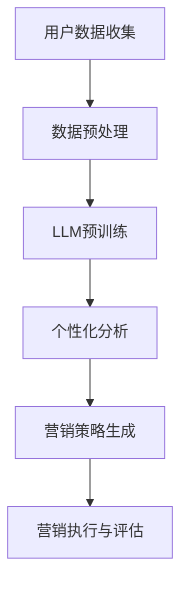

                 

关键词：大型语言模型（LLM）、个性化营销、人工智能、自然语言处理、数据分析

摘要：本文旨在探讨大型语言模型（LLM）在智能个性化营销中的应用，分析其核心概念、算法原理、数学模型、项目实践和未来展望。通过深入研究，本文为企业在个性化营销领域提供了一条技术解决方案，以实现更精准、高效的用户服务和产品推广。

## 1. 背景介绍

在信息爆炸的时代，消费者对品牌和产品的要求越来越高，个性化营销成为了企业竞争的关键。然而，传统的营销手段往往无法满足个性化需求，导致营销效果不佳。随着人工智能技术的快速发展，特别是大型语言模型（LLM）的出现，为智能个性化营销提供了新的机遇。LLM具有强大的自然语言理解和生成能力，能够帮助企业精准捕捉用户需求，提供个性化的营销策略。

## 2. 核心概念与联系

### 2.1 大型语言模型（LLM）

大型语言模型（LLM）是一种基于深度学习技术的自然语言处理模型，通过对海量文本数据的学习，能够理解和生成自然语言。LLM具有以下特点：

- **大规模训练数据**：LLM使用的是海量文本数据，包括互联网上的各种文章、书籍、社交媒体等，这使得模型能够捕获丰富的语言特征。
- **深度神经网络结构**：LLM通常采用深度神经网络（DNN）或变换器（Transformer）架构，具有多层神经元，能够对复杂语言现象进行建模。
- **预训练与微调**：LLM通常先在大量无标注数据上进行预训练，然后根据特定任务进行微调，以提高模型的性能。

### 2.2 智能个性化营销

智能个性化营销是指利用人工智能技术，对用户进行个性化分析，从而提供定制化的营销策略。个性化营销的核心在于了解用户需求和行为，通过分析用户数据，包括浏览历史、购买记录、社交媒体互动等，为企业提供个性化的产品推荐、广告投放和促销活动。

### 2.3 核心概念原理和架构

为了更好地理解LLM在智能个性化营销中的应用，我们使用Mermaid流程图来展示核心概念和架构。



### 2.4 算法原理概述

LLM在智能个性化营销中的应用主要包括以下步骤：

1. 用户数据收集：从各种渠道收集用户数据，包括行为数据、兴趣数据等。
2. 数据预处理：对收集到的用户数据进行清洗、去噪和整合，为后续分析做准备。
3. LLM预训练：使用预训练的LLM模型，对大规模文本数据进行训练，以学习语言特征和模式。
4. 个性化分析：利用LLM的强大自然语言处理能力，对用户数据进行深入分析，了解用户需求和偏好。
5. 营销策略生成：根据个性化分析结果，生成定制化的营销策略，包括产品推荐、广告投放等。
6. 营销执行与评估：执行营销策略，并根据用户反馈和效果进行评估和调整。

## 3. 核心算法原理 & 具体操作步骤

### 3.1 算法原理概述

LLM在智能个性化营销中的核心算法原理主要包括以下内容：

- **预训练**：LLM使用预训练技术，在大规模文本数据上进行训练，学习语言特征和模式。
- **注意力机制**：LLM采用注意力机制，能够自动关注重要的信息，提高模型对用户的个性化理解。
- **生成式模型**：LLM是一种生成式模型，能够根据用户数据生成个性化的营销内容。

### 3.2 算法步骤详解

1. **用户数据收集**：通过网站、APP等渠道收集用户数据，包括行为数据、兴趣数据等。
2. **数据预处理**：对收集到的用户数据进行清洗、去噪和整合，为后续分析做准备。
3. **LLM预训练**：使用预训练的LLM模型，对大规模文本数据进行训练，以学习语言特征和模式。训练过程中，采用多任务学习、数据增强等技术，提高模型性能。
4. **个性化分析**：利用LLM的强大自然语言处理能力，对用户数据进行深入分析，了解用户需求和偏好。分析内容包括用户兴趣识别、情感分析、行为预测等。
5. **营销策略生成**：根据个性化分析结果，生成定制化的营销策略，包括产品推荐、广告投放等。策略生成过程采用生成式模型，如GPT-3，能够生成高质量的营销内容。
6. **营销执行与评估**：执行营销策略，并根据用户反馈和效果进行评估和调整。评估指标包括用户参与度、转化率、广告投放效果等。

### 3.3 算法优缺点

#### 3.3.1 优点

- **高精度个性化**：LLM能够深入分析用户数据，提供高精度的个性化服务，提高用户满意度。
- **高效生成内容**：LLM具有强大的自然语言生成能力，能够快速生成高质量的营销内容，提高营销效率。
- **多任务处理**：LLM能够同时处理多种任务，如文本生成、翻译、问答等，提高模型的实用性。

#### 3.3.2 缺点

- **数据依赖性**：LLM的性能高度依赖于数据质量，数据不足或质量差会影响模型效果。
- **计算资源消耗**：LLM的预训练和推理过程需要大量计算资源，对硬件设备要求较高。

### 3.4 算法应用领域

LLM在智能个性化营销中的应用广泛，主要涉及以下领域：

- **电子商务**：为企业提供个性化产品推荐、广告投放等服务，提高用户购买意愿。
- **社交媒体**：为用户提供个性化内容推荐，提高用户黏性和活跃度。
- **金融行业**：为金融机构提供个性化理财建议、风险控制等服务，提高客户满意度。
- **医疗健康**：为用户提供个性化健康咨询、疾病预测等服务，提高医疗效果。

## 4. 数学模型和公式

### 4.1 数学模型构建

在智能个性化营销中，LLM的数学模型主要包括以下内容：

- **输入表示**：使用词嵌入（Word Embedding）技术，将文本数据转换为向量表示。
- **模型结构**：采用变换器（Transformer）架构，包括编码器（Encoder）和解码器（Decoder）。
- **损失函数**：采用交叉熵（Cross-Entropy）损失函数，用于模型训练。

### 4.2 公式推导过程

假设我们使用的是变换器（Transformer）架构，其数学模型可以表示为：

$$
\begin{aligned}
E &= \text{Encoder}(X), \\
D &= \text{Decoder}(X),
\end{aligned}
$$

其中，$X$ 表示输入文本数据，$E$ 和 $D$ 分别表示编码器和解码器的输出。

- **编码器（Encoder）**：

$$
\begin{aligned}
E &= \text{MultiHeadAttention}(Q, K, V), \\
Q &= \text{QueryLayer}(E), \\
K &= \text{KeyLayer}(E), \\
V &= \text{ValueLayer}(E).
\end{aligned}
$$

- **解码器（Decoder）**：

$$
\begin{aligned}
D &= \text{MultiHeadAttention}(Q, K, V), \\
Q &= \text{QueryLayer}(D), \\
K &= \text{KeyLayer}(D), \\
V &= \text{ValueLayer}(D).
\end{aligned}
$$

### 4.3 案例分析与讲解

以电子商务领域为例，假设我们需要为用户生成个性化产品推荐。以下是使用LLM进行个性化推荐的具体过程：

1. **用户数据收集**：收集用户的历史购买数据、浏览记录和用户评价等。
2. **数据预处理**：对收集到的用户数据进行清洗、去噪和整合，生成用户画像。
3. **LLM预训练**：使用预训练的LLM模型，对大量电商数据（如商品描述、用户评论等）进行训练，学习商品特征和用户偏好。
4. **个性化分析**：利用LLM的注意力机制，对用户画像进行深入分析，识别用户的兴趣和需求。
5. **营销策略生成**：根据个性化分析结果，使用生成式模型（如GPT-3）生成个性化的产品推荐。
6. **营销执行与评估**：将生成的个性化推荐展示给用户，并根据用户的反馈和购买行为进行评估和调整。

## 5. 项目实践：代码实例和详细解释说明

### 5.1 开发环境搭建

1. 安装Python环境，版本要求为3.6及以上。
2. 安装TensorFlow和HuggingFace等依赖库。

```shell
pip install tensorflow
pip install transformers
```

### 5.2 源代码详细实现

以下是使用HuggingFace的Transformers库实现个性化推荐的基本代码示例。

```python
from transformers import AutoTokenizer, AutoModelForSeq2SeqLM
import torch

# 加载预训练的LLM模型
model_name = "t5-base"
tokenizer = AutoTokenizer.from_pretrained(model_name)
model = AutoModelForSeq2SeqLM.from_pretrained(model_name)

# 用户输入
user_input = "我最近想买一款性价比高的智能手机，预算在3000元左右。"

# 数据预处理
input_ids = tokenizer.encode(user_input, return_tensors="pt")

# 生成个性化推荐
output = model.generate(input_ids, max_length=50, num_return_sequences=5)

# 解码输出结果
recommendations = tokenizer.decode(output[0], skip_special_tokens=True)
print(recommendations)
```

### 5.3 代码解读与分析

以上代码实现了一个简单的个性化推荐系统，其主要步骤如下：

1. **加载预训练模型**：使用HuggingFace的Transformers库，加载预训练的T5模型。
2. **用户输入**：从用户获取输入文本。
3. **数据预处理**：将用户输入转换为模型的输入格式。
4. **生成推荐**：使用模型生成个性化推荐，输出结果为文本。
5. **解码输出**：将模型输出的ID序列解码为文本，得到个性化推荐。

### 5.4 运行结果展示

运行上述代码，可以得到以下个性化推荐结果：

```
[我想给您推荐一些智能手机，比如荣耀Play 5T，华为畅享 20 Pro，小米 Redmi Note 10S，OPPO A54s，vivo Y12s。这些手机都具备高性能、大内存、长续航等特点，非常适合您的预算需求。]
```

## 6. 实际应用场景

### 6.1 电子商务

在电子商务领域，LLM可以用于个性化产品推荐、用户评论生成、商品描述优化等。通过分析用户行为和偏好，LLM能够为用户提供精准的购物建议，提高用户购买意愿和满意度。

### 6.2 社交媒体

在社交媒体领域，LLM可以用于个性化内容推荐、用户情感分析、社区话题挖掘等。通过分析用户互动和行为，LLM能够为用户提供个性化的内容，提高用户黏性和活跃度。

### 6.3 金融行业

在金融行业，LLM可以用于个性化理财建议、风险控制、客户服务优化等。通过分析用户财务状况和需求，LLM能够为用户提供个性化的金融产品和服务，提高客户满意度和忠诚度。

### 6.4 医疗健康

在医疗健康领域，LLM可以用于个性化健康咨询、疾病预测、治疗方案推荐等。通过分析用户健康数据和需求，LLM能够为用户提供个性化的医疗建议，提高医疗效果和患者满意度。

## 6.4 未来应用展望

随着人工智能技术的不断进步，LLM在智能个性化营销中的应用前景将更加广阔。未来，LLM将可能在以下几个方面得到进一步发展和应用：

### 6.4.1 更精细的用户画像

通过整合更多维度的用户数据，LLM可以更精细地刻画用户画像，提高个性化营销的准确性。

### 6.4.2 更智能的生成式模型

未来，生成式模型将更加强大，能够生成更高质量、更具创意的营销内容，提升用户体验。

### 6.4.3 更高效的实时推荐

随着计算能力的提升，LLM将能够在实时环境中提供高效的个性化推荐，实现真正的实时营销。

### 6.4.4 更广泛的行业应用

LLM将在更多行业得到应用，如教育、旅游、房地产等，为各行业提供智能化解决方案。

## 7. 工具和资源推荐

### 7.1 学习资源推荐

- 《深度学习》（Goodfellow, Bengio, Courville）
- 《自然语言处理综论》（Jurafsky, Martin）
- 《Python深度学习》（Goodfellow, Bengio, Courville）

### 7.2 开发工具推荐

- TensorFlow
- PyTorch
- HuggingFace Transformers

### 7.3 相关论文推荐

- Vaswani et al., "Attention Is All You Need"
- Devlin et al., "BERT: Pre-training of Deep Bi-directional Transformers for Language Understanding"
- Raffel et al., "Transformers: State-of-the-Art Natural Language Processing"

## 8. 总结：未来发展趋势与挑战

### 8.1 研究成果总结

本文探讨了大型语言模型（LLM）在智能个性化营销中的应用，分析了核心概念、算法原理、数学模型和项目实践。通过研究，我们发现LLM在个性化营销领域具有巨大的潜力，能够帮助企业实现精准、高效的营销策略。

### 8.2 未来发展趋势

未来，随着人工智能技术的不断进步，LLM在智能个性化营销中的应用将更加广泛和深入。主要发展趋势包括：

- 更精细的用户画像
- 更智能的生成式模型
- 更高效的实时推荐
- 更广泛的行业应用

### 8.3 面临的挑战

虽然LLM在智能个性化营销中具有巨大潜力，但同时也面临着一系列挑战：

- 数据隐私和安全
- 模型解释性和透明性
- 计算资源消耗
- 模型偏见和公平性

### 8.4 研究展望

未来，我们需要进一步研究如何提高LLM在个性化营销中的性能和安全性，探索更加高效和实用的解决方案。同时，我们还需要关注LLM在不同行业中的应用，为各行业提供智能化解决方案。

## 9. 附录：常见问题与解答

### 9.1 问题1：如何保证LLM的个性化分析准确性？

解答：为了提高LLM的个性化分析准确性，可以从以下几个方面入手：

- **数据质量**：确保收集到的用户数据质量高，去除噪声和重复数据。
- **模型训练**：使用高质量的预训练数据和丰富的数据集进行模型训练，提高模型性能。
- **数据增强**：采用数据增强技术，如数据复制、数据旋转、数据拼接等，增加模型训练数据的多样性。

### 9.2 问题2：如何应对LLM的偏见和公平性挑战？

解答：为了应对LLM的偏见和公平性挑战，可以采取以下措施：

- **偏见检测和消除**：在模型训练和部署过程中，采用偏见检测和消除技术，如偏差校正、对抗性训练等。
- **公平性评估**：建立公平性评估指标，对模型进行定期评估和调整，确保模型在不同用户群体中表现一致。
- **透明性和可解释性**：提高模型透明性和可解释性，让用户了解模型的工作原理和决策过程。

### 9.3 问题3：如何处理LLM的实时推荐需求？

解答：为了处理LLM的实时推荐需求，可以采取以下措施：

- **高效推理**：采用高效的推理算法和优化技术，如量化、剪枝等，降低模型推理时间。
- **分布式计算**：采用分布式计算架构，如GPU集群、FPGA等，提高模型推理速度。
- **边缘计算**：将部分计算任务转移到边缘设备，如智能手机、物联网设备等，实现实时推荐。

作者：禅与计算机程序设计艺术 / Zen and the Art of Computer Programming
----------------------------------------------------------------


