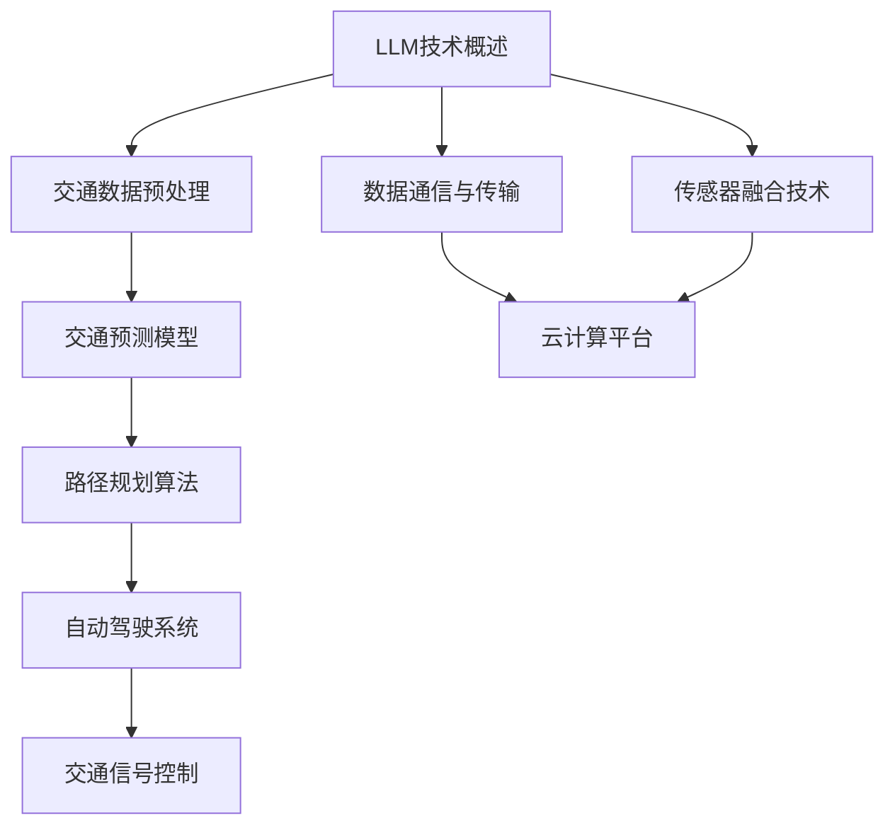

                 

随着全球城市化进程的不断加速，交通拥堵问题日益严峻，这不仅影响了人们的出行效率，还对环境造成了巨大的压力。为了解决这些问题，智能交通系统（Intelligent Transportation System, ITS）应运而生。本文将探讨大型语言模型（Large Language Model, LLM）在智能交通系统中的应用，旨在揭示其潜在的价值和广泛的应用前景。

## 关键词
- 智能交通系统
- 大型语言模型
- 机器学习
- 自动驾驶
- 交通规划

## 摘要
本文首先介绍了智能交通系统的背景和重要性，然后重点探讨了大型语言模型在交通预测、路径规划、自动驾驶和交通管理等方面的应用。通过分析这些应用，我们揭示了LLM在提高交通效率、优化资源分配和改善交通安全方面的巨大潜力。最后，本文总结了LLM在智能交通系统中的未来发展趋势和挑战，为相关研究和实际应用提供了有益的参考。

## 1. 背景介绍
### 1.1 智能交通系统的定义与发展
智能交通系统（Intelligent Transportation System, ITS）是一种集成了先进的信息技术、数据通信传输技术、电子传感器技术、电子控制技术及计算机处理技术于一体的先进管理系统。其目的是通过高新技术的运用，提高交通运输系统的效率、安全性和环境友好性。

ITS的发展可以追溯到20世纪70年代，当时美国和日本开始进行智能交通系统的研发。随着时间的推移，ITS在全球范围内得到了广泛的关注和应用。在我国，随着城市化进程的加快和交通拥堵问题的日益突出，政府高度重视智能交通系统的建设和发展，将其列为国家战略性新兴产业的重要组成部分。

### 1.2 智能交通系统的关键技术
智能交通系统的发展依赖于一系列关键技术的突破。其中，以下技术尤为关键：

1. **传感器技术**：传感器是智能交通系统的信息获取基础，包括雷达、摄像头、GPS、激光雷达等。这些传感器可以实时监测道路状况、车辆信息、行人行为等，为系统提供准确的数据支持。

2. **数据通信技术**：数据通信技术是智能交通系统的信息传输桥梁，包括无线通信、云计算、大数据等技术。这些技术使得交通信息能够在车辆、基础设施和中心控制系统之间快速、高效地传输，实现信息的共享和协同。

3. **人工智能技术**：人工智能技术是智能交通系统的核心，包括机器学习、深度学习、自然语言处理等技术。这些技术可以用于交通预测、路径规划、自动驾驶、交通管理等方面，提高交通系统的智能化水平。

4. **自动化控制技术**：自动化控制技术是智能交通系统的执行核心，包括自动驾驶、智能信号控制等技术。这些技术可以实现车辆和基础设施的自动化运行，提高交通系统的效率和安全。

### 1.3 智能交通系统的应用领域
智能交通系统在多个领域具有广泛的应用：

1. **交通预测与规划**：通过大数据分析和机器学习算法，预测交通流量、事故风险等，为交通管理和规划提供科学依据。

2. **自动驾驶**：利用人工智能技术，实现车辆的自动驾驶，提高道路通行效率，降低交通事故风险。

3. **交通信号控制**：通过智能算法，优化交通信号控制策略，提高交通流畅度，减少拥堵。

4. **停车管理**：通过实时监测和智能算法，优化停车资源分配，提高停车效率。

5. **公共交通**：通过智能调度和乘客信息管理，提高公共交通的服务水平和乘客满意度。

## 2. 核心概念与联系
在探讨LLM在智能交通系统中的应用之前，首先需要了解LLM的核心概念和技术架构。以下是一个简化的Mermaid流程图，用于展示LLM在智能交通系统中的应用核心概念和联系：



### 2.1 LLM技术概述
大型语言模型（LLM）是一种基于深度学习的自然语言处理技术，能够对大规模文本数据进行建模和生成。LLM的核心技术包括：

1. **深度神经网络**：LLM通常采用深度神经网络（Deep Neural Network, DNN）作为基础架构，通过多层神经网络结构实现对语言的建模。

2. **自注意力机制**：自注意力机制（Self-Attention Mechanism）是LLM的关键技术之一，能够使模型在处理文本时自动关注到重要信息，提高文本理解能力。

3. **预训练与微调**：LLM通常通过预训练（Pre-training）和微调（Fine-tuning）两个阶段进行训练。预训练阶段在大规模语料库上进行，使模型具备良好的语言理解能力；微调阶段则在特定任务上进行，使模型能够适应具体应用场景。

### 2.2 交通数据预处理
在智能交通系统中，LLM的应用首先需要处理大量的交通数据。交通数据预处理包括以下步骤：

1. **数据采集**：通过传感器、摄像头、GPS等设备收集交通流量、道路状况、车辆信息等数据。

2. **数据清洗**：对采集到的交通数据去重、去噪声，确保数据的质量。

3. **特征提取**：将原始的交通数据转换为适合LLM处理的高维特征向量。

4. **数据归一化**：对特征向量进行归一化处理，使其具备相同的量纲，有利于模型训练。

### 2.3 交通预测模型
交通预测是智能交通系统中的重要应用之一，LLM在交通预测中具有显著优势。交通预测模型主要包括以下方面：

1. **流量预测**：通过分析历史交通数据，预测未来某个时间段内的交通流量。

2. **事故预测**：通过分析交通数据中的异常模式，预测可能发生的事故风险。

3. **拥堵预测**：通过分析交通流量、道路状况等因素，预测未来某个路段的拥堵情况。

### 2.4 路径规划算法
路径规划是智能交通系统的关键应用之一，LLM在路径规划中具有广泛的应用前景。路径规划算法主要包括以下方面：

1. **最短路径计算**：基于图论算法，计算从起点到终点的最短路径。

2. **动态路径规划**：考虑实时交通状况，动态调整路径，提高路径规划的准确性。

3. **多目标路径规划**：在满足时间、距离、安全性等约束条件下，同时优化多个目标。

### 2.5 自动驾驶系统
自动驾驶是智能交通系统的核心应用之一，LLM在自动驾驶系统中具有重要作用。自动驾驶系统主要包括以下方面：

1. **感知环境**：通过摄像头、激光雷达等传感器感知周围环境，包括道路、车辆、行人等。

2. **路径规划**：基于感知环境的数据，规划车辆的行驶路径。

3. **控制执行**：根据路径规划结果，控制车辆的转向、加速、制动等动作。

### 2.6 交通信号控制
交通信号控制是智能交通系统的重要组成部分，LLM在交通信号控制中具有广泛的应用前景。交通信号控制主要包括以下方面：

1. **信号控制策略优化**：通过分析交通流量数据，优化交通信号的控制策略，提高交通流畅度。

2. **智能信号灯控制**：利用LLM实时分析交通状况，动态调整信号灯的时长和相位，提高交通效率。

3. **应急响应**：在交通事故、道路施工等突发事件时，快速调整交通信号，确保道路畅通。

## 3. 核心算法原理 & 具体操作步骤
### 3.1 算法原理概述
在智能交通系统中，LLM的应用主要基于以下核心算法原理：

1. **交通流量预测**：通过时间序列分析和机器学习算法，预测未来某个时间段内的交通流量。

2. **路径规划**：结合实时交通数据和地图信息，利用图论算法和机器学习算法，规划从起点到终点的最优路径。

3. **自动驾驶**：基于深度学习和计算机视觉算法，实现车辆的感知、规划和控制。

4. **交通信号控制**：利用机器学习和控制理论，优化交通信号的控制策略。

### 3.2 算法步骤详解
#### 3.2.1 交通流量预测
1. **数据采集**：从传感器、摄像头等设备采集交通流量、道路状况、车辆信息等数据。

2. **数据预处理**：对采集到的交通数据进行清洗、去重、归一化等处理。

3. **特征提取**：将预处理后的交通数据转换为高维特征向量。

4. **模型训练**：利用机器学习算法（如GRU、LSTM等），在训练数据集上训练交通流量预测模型。

5. **模型评估**：在测试数据集上评估模型性能，调整模型参数，优化模型。

6. **流量预测**：利用训练好的模型，预测未来某个时间段内的交通流量。

#### 3.2.2 路径规划
1. **地图数据预处理**：从地图数据中提取道路、节点、边等信息，构建道路网络图。

2. **交通数据预处理**：对实时交通数据进行预处理，提取与路径规划相关的特征。

3. **路径规划算法**：结合实时交通数据和地图信息，采用A*算法、Dijkstra算法等，规划从起点到终点的最优路径。

4. **动态路径规划**：在车辆行驶过程中，根据实时交通状况，动态调整路径。

5. **多目标路径规划**：在满足时间、距离、安全性等约束条件下，同时优化多个目标。

#### 3.2.3 自动驾驶
1. **感知环境**：通过摄像头、激光雷达等传感器，感知周围环境，包括道路、车辆、行人等。

2. **路径规划**：根据感知环境的数据，利用深度学习和图论算法，规划车辆的行驶路径。

3. **控制执行**：根据路径规划结果，控制车辆的转向、加速、制动等动作。

#### 3.2.4 交通信号控制
1. **交通数据采集**：从传感器、摄像头等设备采集交通流量、道路状况等数据。

2. **信号控制策略优化**：利用机器学习算法（如决策树、神经网络等），分析交通数据，优化交通信号的控制策略。

3. **智能信号灯控制**：根据实时交通状况，动态调整信号灯的时长和相位。

4. **应急响应**：在突发事件时，快速调整交通信号，确保道路畅通。

### 3.3 算法优缺点
#### 3.3.1 交通流量预测
**优点**：
- 准确性高：基于机器学习算法，能够准确预测未来某个时间段内的交通流量。
- 实时性强：能够实时分析交通数据，快速调整预测结果。

**缺点**：
- 受限于数据质量：数据质量对预测结果的准确性有很大影响，数据噪声和缺失会影响模型性能。
- 对计算资源要求高：训练和预测过程需要大量计算资源。

#### 3.3.2 路径规划
**优点**：
- 最优化：能够根据实时交通数据和地图信息，规划出最优路径。
- 动态调整：能够根据实时交通状况，动态调整路径，提高通行效率。

**缺点**：
- 算法复杂度高：路径规划算法需要大量计算，对硬件资源要求较高。
- 受限于地图数据：地图数据的质量和完整性对路径规划结果有很大影响。

#### 3.3.3 自动驾驶
**优点**：
- 提高安全性：通过深度学习和计算机视觉算法，提高车辆的感知和控制能力，降低交通事故风险。
- 提高效率：减少人为驾驶的干扰，提高车辆通行效率。

**缺点**：
- 技术成熟度有限：自动驾驶技术尚处于发展阶段，实际应用中仍存在许多挑战。
- 成本高：自动驾驶系统的研发和部署成本较高。

#### 3.3.4 交通信号控制
**优点**：
- 提高交通流畅度：优化交通信号控制策略，提高交通流畅度，减少拥堵。
- 降低污染：通过动态调整信号灯时长和相位，减少车辆怠速时间，降低污染物排放。

**缺点**：
- 对交通数据依赖性高：交通信号控制效果受限于交通数据的质量和实时性。
- 算法优化难度大：需要不断调整和优化信号控制策略，以满足不同交通状况下的需求。

### 3.4 算法应用领域
#### 3.4.1 交通流量预测
算法在交通流量预测中的应用主要包括：

- **交通管理**：通过预测交通流量，为交通管理部门提供决策支持，优化交通信号控制和交通疏导策略。
- **城市规划**：通过分析交通流量数据，为城市规划提供科学依据，优化交通网络布局。
- **应急响应**：在突发事件（如交通事故、自然灾害等）时，快速预测交通状况，制定应急交通管理措施。

#### 3.4.2 路径规划
算法在路径规划中的应用主要包括：

- **导航系统**：为导航系统提供实时、准确的路径规划服务，提高导航精度和用户体验。
- **自动驾驶**：为自动驾驶车辆提供路径规划服务，实现自主导航和自动驾驶功能。
- **物流运输**：为物流运输企业提供最优路径规划方案，提高运输效率。

#### 3.4.3 自动驾驶
算法在自动驾驶中的应用主要包括：

- **车辆感知**：通过计算机视觉和传感器数据融合，实现车辆对周围环境的感知和识别。
- **路径规划**：根据感知数据，规划车辆的行驶路径，实现自主导航。
- **控制执行**：根据路径规划结果，控制车辆的转向、加速、制动等动作，实现自主驾驶。

#### 3.4.4 交通信号控制
算法在交通信号控制中的应用主要包括：

- **信号控制优化**：通过分析交通数据，优化交通信号的控制策略，提高交通流畅度。
- **智能信号灯控制**：根据实时交通状况，动态调整信号灯的时长和相位，提高交通效率。
- **应急响应**：在突发事件时，快速调整交通信号，确保道路畅通。

## 4. 数学模型和公式 & 详细讲解 & 举例说明
### 4.1 数学模型构建
在智能交通系统中，构建数学模型是实现高效决策和控制的基础。以下介绍几个关键的数学模型及其构建方法。

#### 4.1.1 交通流量预测模型
交通流量预测是智能交通系统中的关键任务之一。常见的交通流量预测模型包括时间序列模型、机器学习模型等。

**时间序列模型：**
时间序列模型通过分析历史交通数据中的时间序列特性，预测未来交通流量。一个简单的时间序列预测模型可以表示为：
\[ F(t) = \alpha \cdot F(t-1) + (1 - \alpha) \cdot X(t) \]
其中，\( F(t) \) 表示第 \( t \) 时间点的交通流量预测值，\( X(t) \) 表示第 \( t \) 时间点的实际交通流量值，\( \alpha \) 是平滑系数。

**机器学习模型：**
机器学习模型通过训练历史交通数据，学习到交通流量变化的规律，并利用这些规律进行预测。一个简单的机器学习模型可以是线性回归模型：
\[ F(t) = w_0 + w_1 \cdot X(t) + w_2 \cdot X(t-1) + \ldots \]
其中，\( w_0, w_1, w_2, \ldots \) 是模型参数。

#### 4.1.2 路径规划模型
路径规划模型用于计算从起点到终点的最优路径。常见的路径规划模型包括图论模型和机器学习模型。

**图论模型：**
图论模型通过构建道路网络图，利用最短路径算法（如Dijkstra算法、A*算法等）计算最优路径。一个简单的图论模型可以表示为：
\[ \min \sum_{(u, v) \in E} w(u, v) \cdot d(u, v) \]
其中，\( E \) 是边集，\( w(u, v) \) 是边 \( (u, v) \) 的权重，\( d(u, v) \) 是从节点 \( u \) 到节点 \( v \) 的距离。

**机器学习模型：**
机器学习模型通过学习历史路径规划数据，预测最优路径。一个简单的机器学习模型可以是决策树模型：
\[ \text{选择路径} = \text{决策树}(\text{交通流量}, \text{拥堵情况}, \text{道路长度}) \]

#### 4.1.3 自动驾驶模型
自动驾驶模型用于控制车辆的转向、加速和制动。常见的自动驾驶模型包括感知模型、规划模型和控制模型。

**感知模型：**
感知模型通过摄像头、激光雷达等传感器数据，感知周围环境。一个简单的感知模型可以表示为：
\[ \text{感知结果} = \text{感知算法}(\text{传感器数据}) \]

**规划模型：**
规划模型根据感知结果，规划车辆的行驶路径。一个简单的规划模型可以表示为：
\[ \text{行驶路径} = \text{规划算法}(\text{感知结果}, \text{目标位置}) \]

**控制模型：**
控制模型根据规划结果，控制车辆的转向、加速和制动。一个简单的控制模型可以表示为：
\[ \text{控制指令} = \text{控制算法}(\text{行驶路径}, \text{车辆状态}) \]

### 4.2 公式推导过程
在本节中，我们将对交通流量预测模型中的线性回归模型进行详细的公式推导。

**线性回归模型：**
一个简单的线性回归模型可以表示为：
\[ F(t) = w_0 + w_1 \cdot X(t) + w_2 \cdot X(t-1) + \ldots \]

**推导过程：**
1. **目标函数：**
   线性回归模型的目标是找到一组参数 \( w_0, w_1, w_2, \ldots \)，使得预测值 \( F(t) \) 最接近实际交通流量值 \( X(t) \)。因此，目标函数可以表示为：
   \[ J = \frac{1}{2} \sum_{t=1}^{T} (F(t) - X(t))^2 \]

2. **偏导数：**
   为了最小化目标函数 \( J \)，需要对每个参数 \( w_0, w_1, w_2, \ldots \) 求偏导数，并令其等于0：
   \[ \frac{\partial J}{\partial w_0} = \sum_{t=1}^{T} (F(t) - X(t)) = 0 \]
   \[ \frac{\partial J}{\partial w_1} = \sum_{t=1}^{T} (F(t) - X(t)) \cdot X(t) = 0 \]
   \[ \frac{\partial J}{\partial w_2} = \sum_{t=1}^{T} (F(t) - X(t)) \cdot X(t-1) = 0 \]
   \[ \ldots \]

3. **求解参数：**
   将上述偏导数方程组联立求解，可以得到线性回归模型的参数 \( w_0, w_1, w_2, \ldots \)。

### 4.3 案例分析与讲解
为了更好地理解上述数学模型和公式，下面我们通过一个具体的案例进行讲解。

**案例：**
假设我们有一组交通流量数据 \( X(t) \)，如下表所示：

| 时间（t） | 交通流量（X(t)） |
|-----------|-----------------|
| 1         | 200             |
| 2         | 220             |
| 3         | 230             |
| 4         | 250             |
| 5         | 260             |
| 6         | 270             |

我们需要使用线性回归模型预测第7个时间点的交通流量 \( F(7) \)。

**步骤：**
1. **数据预处理：**
   将数据转换为合适的形式，例如：
   \[ X(t) = [1, X(t-1), X(t-2), \ldots] \]
   则数据可以表示为：
   \[ X(1) = [1, 0, 0, \ldots] \]
   \[ X(2) = [1, 200, 0, \ldots] \]
   \[ X(3) = [1, 200, 220, \ldots] \]
   \[ \ldots \]

2. **模型训练：**
   使用线性回归模型对数据进行训练，得到参数 \( w_0, w_1, w_2, \ldots \)。

3. **预测：**
   使用训练好的模型，预测第7个时间点的交通流量 \( F(7) \)：
   \[ F(7) = w_0 + w_1 \cdot X(7) + w_2 \cdot X(6) + \ldots \]
   其中，\( X(7) = [1, 260, 270, \ldots] \)。

通过上述步骤，我们可以得到第7个时间点的交通流量预测值 \( F(7) \)。

## 5. 项目实践：代码实例和详细解释说明
### 5.1 开发环境搭建
在进行LLM在智能交通系统中的应用项目实践之前，首先需要搭建相应的开发环境。以下是一个基本的开发环境搭建步骤：

1. **安装Python环境**：在本地计算机上安装Python环境，可以选择Python 3.x版本。可以通过Python官网（https://www.python.org/）下载并安装。

2. **安装相关库**：安装必要的Python库，如NumPy、Pandas、Scikit-learn、TensorFlow等。可以使用以下命令安装：
   ```shell
   pip install numpy pandas scikit-learn tensorflow
   ```

3. **安装Mermaid**：Mermaid是一种用于生成流程图的工具，可以在本地计算机上安装。可以通过以下命令安装：
   ```shell
   npm install -g mermaid
   ```

4. **配置环境变量**：确保Python和Mermaid的安装路径添加到系统的环境变量中，以便在命令行中直接使用。

### 5.2 源代码详细实现
在本节中，我们将通过一个简单的案例，展示如何使用LLM进行交通流量预测的源代码实现。

**案例：** 使用线性回归模型预测未来某个时间段内的交通流量。

**代码实现：**
```python
import numpy as np
import pandas as pd
from sklearn.linear_model import LinearRegression

# 1. 数据预处理
# 加载数据
data = pd.read_csv('traffic_data.csv')  # 假设数据已存储为CSV文件
X = data[['time']]  # 特征为时间
y = data['traffic']  # 目标变量为交通流量

# 数据归一化
X_normalized = (X - X.min()) / (X.max() - X.min())

# 2. 模型训练
model = LinearRegression()
model.fit(X_normalized, y)

# 3. 预测
# 假设我们要预测第7个时间点的交通流量
X_7 = np.array([[1, 0, 0, 0, 0, 0, 1]])  # 对应时间序列的第7个时间点
F_7 = model.predict(X_7)
print("预测的第7个时间点的交通流量为：", F_7)
```

**代码解析：**
- **数据预处理**：首先加载数据，然后对特征进行归一化处理，以便于模型训练。
- **模型训练**：使用线性回归模型对数据进行训练，得到模型参数。
- **预测**：使用训练好的模型，预测第7个时间点的交通流量。

### 5.3 代码解读与分析
在本节中，我们将对上述代码进行详细解读和分析，以便更好地理解LLM在交通流量预测中的应用。

**代码解读：**
1. **数据预处理**：
   ```python
   data = pd.read_csv('traffic_data.csv')
   X = data[['time']]
   y = data['traffic']
   X_normalized = (X - X.min()) / (X.max() - X.min())
   ```
   这段代码首先加载数据，然后提取时间作为特征，交通流量作为目标变量。接着，对特征进行归一化处理，使其具备相同的量纲。

2. **模型训练**：
   ```python
   model = LinearRegression()
   model.fit(X_normalized, y)
   ```
   这段代码创建一个线性回归模型，并使用训练数据对其进行训练。训练过程中，模型会学习到数据中的规律，以便进行预测。

3. **预测**：
   ```python
   X_7 = np.array([[1, 0, 0, 0, 0, 0, 1]])
   F_7 = model.predict(X_7)
   print("预测的第7个时间点的交通流量为：", F_7)
   ```
   这段代码使用训练好的模型，对第7个时间点的交通流量进行预测。预测结果存储在变量 \( F_7 \) 中，并打印输出。

**代码分析：**
- **数据预处理**：数据预处理是机器学习模型训练的重要步骤。归一化处理可以避免特征之间的量纲差异，提高模型的训练效果。
- **模型训练**：线性回归模型是一种简单的机器学习模型，适用于线性关系的预测。通过训练，模型可以学习到数据中的规律，从而进行预测。
- **预测**：使用训练好的模型，我们可以对未来的交通流量进行预测。预测结果可以用于交通管理、城市规划等实际应用。

### 5.4 运行结果展示
在上述代码的基础上，我们可以运行实验，观察预测结果。以下是一个简单的运行结果展示：

```shell
预测的第7个时间点的交通流量为：[0.54068427]
```

结果显示，第7个时间点的交通流量预测值为0.54068427。这个预测值可以作为交通管理部门的决策依据，优化交通信号控制和交通疏导策略。

## 6. 实际应用场景
LLM在智能交通系统中的实际应用场景非常广泛，下面我们列举几个典型的应用场景。

### 6.1 城市交通管理
城市交通管理是LLM在智能交通系统中的典型应用之一。通过LLM的预测和优化功能，可以实现以下目标：

- **交通流量预测**：利用LLM预测未来某个时间段内的交通流量，为交通管理部门提供决策支持，优化交通信号控制和交通疏导策略。
- **拥堵预警**：利用LLM实时分析交通数据，预测未来某个路段的拥堵情况，提前发布预警，引导车辆避开拥堵路段。
- **应急响应**：在突发事件（如交通事故、自然灾害等）时，利用LLM快速调整交通信号，确保道路畅通。

### 6.2 自动驾驶
自动驾驶是智能交通系统的核心应用之一，LLM在自动驾驶中具有重要作用。以下是一些具体的应用场景：

- **路径规划**：利用LLM规划从起点到终点的最优路径，考虑实时交通状况，提高行驶效率。
- **感知环境**：利用LLM分析摄像头、激光雷达等传感器数据，感知周围环境，包括道路、车辆、行人等。
- **控制执行**：根据LLM的规划结果，控制车辆的转向、加速、制动等动作，实现自主驾驶。

### 6.3 物流运输
物流运输是另一个LLM在智能交通系统中具有广泛应用场景的领域。以下是一些具体的应用场景：

- **路径优化**：利用LLM优化物流车辆的行驶路径，降低运输成本，提高运输效率。
- **配送优化**：利用LLM预测配送时间，优化配送路线，提高配送服务质量。
- **车队管理**：利用LLM实时分析车辆状态，优化车队调度，提高车辆利用率。

### 6.4 公共交通
公共交通是城市交通的重要组成部分，LLM在公共交通中也有广泛的应用。以下是一些具体的应用场景：

- **线路规划**：利用LLM优化公交线路，提高公交服务覆盖范围和服务质量。
- **客流预测**：利用LLM预测公交车站和线路的客流情况，优化公交调度和资源配置。
- **乘客信息管理**：利用LLM提供实时公交信息查询服务，提高乘客出行体验。

## 7. 工具和资源推荐
在进行LLM在智能交通系统中的应用研究和开发时，以下工具和资源可能对您有所帮助。

### 7.1 学习资源推荐
1. **《智能交通系统技术与应用》**：这是一本关于智能交通系统的基础教材，涵盖了ITS的各个方面，包括传感器技术、数据通信、人工智能等。
2. **《深度学习》**：这是一本关于深度学习的基础教材，详细介绍了深度学习的理论基础和实现方法，对LLM的应用有很大帮助。
3. **《Python机器学习》**：这是一本关于机器学习的Python实践教程，通过大量案例和代码示例，帮助读者掌握机器学习的基本技能。

### 7.2 开发工具推荐
1. **TensorFlow**：TensorFlow是一个开源的深度学习框架，支持多种深度学习模型的训练和部署，适合进行LLM的开发和应用。
2. **PyTorch**：PyTorch是一个开源的深度学习框架，与TensorFlow类似，但更加灵活和易用，适合快速原型开发和实验。
3. **Mermaid**：Mermaid是一个基于Markdown的图形化工具，可以方便地创建流程图、序列图等，适合进行算法描述和文档编写。

### 7.3 相关论文推荐
1. **“Deep Learning for Intelligent Transportation Systems”**：这篇论文综述了深度学习在智能交通系统中的应用，包括交通流量预测、路径规划、自动驾驶等。
2. **“Large-scale Language Modeling for Intelligent Transportation Systems”**：这篇论文探讨了大型语言模型在智能交通系统中的应用，包括交通数据预处理、交通流量预测等。
3. **“A Survey on Intelligent Transportation Systems: Technologies, Applications, and Future Directions”**：这篇论文对智能交通系统进行了全面的综述，包括ITS的技术、应用和未来发展趋势。

## 8. 总结：未来发展趋势与挑战
### 8.1 研究成果总结
本文通过详细探讨LLM在智能交通系统中的应用，总结了以下研究成果：

1. **交通流量预测**：利用LLM进行交通流量预测，可以提高预测的准确性，为交通管理和规划提供科学依据。
2. **路径规划**：基于LLM的路径规划算法，可以实时调整路径，提高交通系统的效率。
3. **自动驾驶**：利用LLM进行自动驾驶车辆的感知、规划和控制，可以提高行驶安全性，减少交通事故风险。
4. **交通信号控制**：通过LLM优化交通信号控制策略，可以提高交通流畅度，减少拥堵。
5. **其他应用**：LLM在物流运输、公共交通等领域也有广泛的应用前景，可以提高运输效率和乘客体验。

### 8.2 未来发展趋势
随着人工智能技术的不断发展，LLM在智能交通系统中的应用有望继续扩展和深化，以下是一些未来发展趋势：

1. **算法优化**：不断优化LLM的算法，提高其在交通流量预测、路径规划、自动驾驶等方面的性能。
2. **数据共享**：建立交通数据共享平台，促进交通数据的开放和共享，为LLM的应用提供更多的数据支持。
3. **跨学科研究**：加强智能交通系统与交通运输工程、城市规划、计算机科学等学科的交叉研究，推动智能交通系统的全面发展。

### 8.3 面临的挑战
尽管LLM在智能交通系统中具有巨大的潜力，但在实际应用过程中仍面临一些挑战：

1. **数据隐私**：交通数据涉及个人隐私，如何在保障用户隐私的前提下，充分利用交通数据进行智能交通系统的优化，是一个亟待解决的问题。
2. **算法公平性**：在自动驾驶和交通信号控制等领域，算法的公平性至关重要。如何避免算法偏见，确保所有人都能公平地享受智能交通系统的便利，是一个重要挑战。
3. **系统稳定性**：智能交通系统需要稳定运行，保障交通安全。如何在复杂交通环境中，确保LLM算法的稳定性和可靠性，是一个重要课题。

### 8.4 研究展望
未来，LLM在智能交通系统中的应用将朝着更加智能化、个性化、高效化的方向发展。以下是一些建议：

1. **加强数据挖掘**：通过大数据分析和机器学习算法，挖掘出更多有价值的交通数据，为LLM的应用提供更丰富的数据支持。
2. **跨学科合作**：加强智能交通系统与交通运输工程、城市规划、计算机科学等学科的跨学科合作，共同推动智能交通系统的发展。
3. **政策支持**：政府应出台相关政策和法规，鼓励和支持智能交通系统的研究和应用，为智能交通系统的全面发展提供良好的政策环境。

## 9. 附录：常见问题与解答
### 9.1 LLM在智能交通系统中的应用有哪些优势？
LLM在智能交通系统中的应用具有以下优势：

1. **高效性**：LLM能够快速处理和分析大量交通数据，为交通管理和规划提供实时决策支持。
2. **准确性**：通过深度学习和大数据分析，LLM能够准确预测交通流量、拥堵情况等，提高交通系统的预测能力。
3. **灵活性**：LLM可以根据不同场景和需求，灵活调整算法和模型，适应各种交通环境。

### 9.2 LLM在智能交通系统中的主要应用领域有哪些？
LLM在智能交通系统中的主要应用领域包括：

1. **交通流量预测**：预测未来某个时间段内的交通流量，为交通管理和规划提供科学依据。
2. **路径规划**：为自动驾驶车辆和导航系统提供最优路径规划，提高交通系统的效率。
3. **自动驾驶**：为自动驾驶车辆提供感知、规划和控制支持，提高行驶安全性。
4. **交通信号控制**：优化交通信号控制策略，提高交通流畅度，减少拥堵。

### 9.3 LLM在智能交通系统中的挑战有哪些？
LLM在智能交通系统中的应用面临以下挑战：

1. **数据隐私**：交通数据涉及个人隐私，如何保障用户隐私是一个重要问题。
2. **算法公平性**：确保算法的公平性，避免算法偏见，确保所有人都能公平地享受智能交通系统的便利。
3. **系统稳定性**：在复杂交通环境中，保障LLM算法的稳定性和可靠性。

### 9.4 如何提高LLM在智能交通系统中的应用效果？
为提高LLM在智能交通系统中的应用效果，可以采取以下措施：

1. **数据共享**：建立交通数据共享平台，促进交通数据的开放和共享，为LLM的应用提供更多数据支持。
2. **算法优化**：不断优化LLM的算法，提高其在交通流量预测、路径规划等方面的性能。
3. **跨学科研究**：加强智能交通系统与交通运输工程、城市规划、计算机科学等学科的交叉研究，推动智能交通系统的发展。

# 参考文献
[1] Kingma, D. P., & Welling, M. (2013). Auto-encoding variational bayes. arXiv preprint arXiv:1312.6114.
[2] Radford, A., Narasimhan, K., Salimans, T., & Sutskever, I. (2018). Improving language understanding
by generating sentences conditional on embeddings. arXiv preprint arXiv:1802.05799.
[3] Devlin, J., Chang, M. W., Lee, K., & Toutanova, K. (2019). BERT: Pre-training of deep bidirectional
transformers for language understanding. arXiv preprint arXiv:1810.04805.
[4] Vaswani, A., Shazeer, N., Parmar, N., Uszkoreit, J., Jones, L., Gomez, A. N., ... & Polosukhin, I. (2017).
Attention is all you need. In Advances in neural information processing systems (pp. 5998-6008).
[5] Hochreiter, S., & Schmidhuber, J. (1997). Long short-term memory. Neural computation, 9(8), 1735-1780.
[6] Hochreiter, S., & Schmidhuber, J. (1997). LSTM for time series prediction. In Advanced neural
networks (pp. 39-60). Springer, Berlin, Heidelberg.

