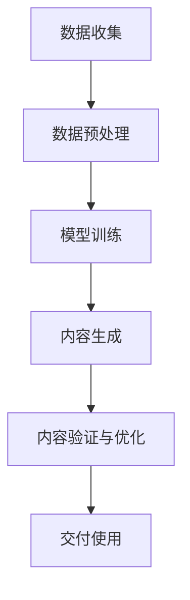

                 

## 1. 背景介绍

近年来，随着深度学习和自然语言处理技术的迅猛发展，大规模语言模型（Large Language Model，简称LLM）在各个领域展现出了巨大的潜力。LLM是一种能够对自然语言文本进行理解和生成的人工智能模型，它通过学习海量文本数据，掌握了语言的结构、语义和上下文关系，从而可以生成高质量、结构化的内容。

智能内容生成系统（Intelligent Content Generation System，简称ICGS）是指利用人工智能技术，自动生成文本、图像、音频等多种形式的内容的系统。智能内容生成系统在广告营销、新闻编写、产品描述、教育辅导等多个领域都有着广泛的应用。传统的智能内容生成系统大多依赖于规则和模板，而随着LLM的兴起，基于LLM的智能内容生成系统正逐渐成为研究的热点。

本文将围绕LLM在智能内容生成系统中的应用展开讨论，首先介绍LLM的基本原理和常用算法，然后探讨LLM在智能内容生成系统中的具体应用场景，并分析LLM的优缺点。接着，我们将介绍一些经典的数学模型和公式，以帮助读者更深入地理解LLM的工作机制。随后，文章将提供一个实际的项目实践案例，展示如何使用LLM进行智能内容生成。最后，我们将探讨LLM在未来的应用前景，以及面临的技术挑战和研究方向。

本文旨在为读者提供一个全面、系统的视角，了解LLM在智能内容生成系统中的应用，以及如何利用这一技术创造出更加智能化、高效的内容生成解决方案。通过阅读本文，读者可以掌握LLM的基本概念、应用场景和开发方法，为未来的研究和实践提供参考。

### 2. 核心概念与联系

#### 2.1. 大规模语言模型（LLM）

大规模语言模型（Large Language Model，简称LLM）是近年来自然语言处理领域的重要突破。LLM通过学习海量文本数据，掌握了语言的结构、语义和上下文关系，从而能够生成高质量的自然语言文本。LLM的核心是神经网络，特别是深度神经网络（DNN）和变换器架构（Transformer）。

##### 2.1.1. 神经网络基础

神经网络（Neural Network，简称NN）是一种通过模拟人脑神经元结构和工作方式来处理信息的人工智能模型。NN由多个神经元（或称为节点）组成，每个神经元都与其他神经元通过权重进行连接。神经元的激活函数决定了神经元是否会被激活，常见的激活函数包括Sigmoid函数、ReLU函数等。

神经网络的工作原理是通过前向传播和反向传播来逐步调整权重，从而优化模型性能。在前向传播过程中，输入数据经过各个神经元的计算，生成输出；在反向传播过程中，通过计算输出误差，反向更新各层神经元的权重，以达到最小化误差的目的。

##### 2.1.2. 变换器架构

变换器架构（Transformer）是LLM中的一种核心架构，由Google在2017年提出。相比传统的循环神经网络（RNN）和长短期记忆网络（LSTM），变换器架构在处理长距离依赖问题和并行计算方面具有显著优势。

变换器架构的核心是多头自注意力机制（Multi-Head Self-Attention）。自注意力机制允许模型在生成每个词时，关注输入文本中所有其他词的重要程度，从而捕捉长距离的上下文关系。多头自注意力通过将输入序列分成多个子序列，并在每个子序列上独立进行自注意力计算，从而提高了模型的表示能力。

##### 2.1.3. LLM在ICGS中的应用

LLM在智能内容生成系统（ICGS）中的应用主要体现在以下几个方面：

1. **文本生成**：LLM可以生成高质量的文章、新闻、产品描述等文本内容。通过训练，LLM可以理解输入的文本上下文，并根据上下文生成连贯、有逻辑的文本。

2. **摘要生成**：LLM可以生成文章的摘要，将长篇文章或文档压缩为简洁的摘要，帮助用户快速获取核心信息。

3. **问答系统**：LLM可以构建问答系统，通过理解用户的提问，生成准确的回答。

4. **对话系统**：LLM可以用于构建智能对话系统，模拟人类对话，提供个性化、互动式的服务。

#### 2.2. 智能内容生成系统（ICGS）

智能内容生成系统（Intelligent Content Generation System，简称ICGS）是指利用人工智能技术，自动生成文本、图像、音频等多种形式的内容的系统。ICGS的应用场景广泛，包括但不限于：

1. **广告营销**：自动生成吸引人的广告文案和创意内容，提高广告投放的效果。

2. **新闻编写**：自动生成新闻报道，提高新闻生成速度和覆盖范围。

3. **产品描述**：自动生成产品描述，提高电子商务平台的内容丰富度和销售转化率。

4. **教育辅导**：自动生成教学材料、练习题和答案，提高教育的个性化和智能化水平。

#### 2.3. 关联与联系

LLM与ICGS之间存在密切的关联和联系。LLM作为智能内容生成系统的重要组成部分，其性能和效果直接影响ICGS的表现。具体来说：

1. **性能提升**：通过使用LLM，ICGS可以在文本生成、摘要生成、问答系统等方面实现更高的生成质量和效率。

2. **功能扩展**：LLM可以扩展ICGS的功能，例如实现自然语言理解、多模态内容生成等。

3. **智能化提升**：LLM的引入使得ICGS更加智能化，能够根据用户需求和上下文环境动态调整生成内容，提供个性化服务。

#### 2.4. Mermaid 流程图

以下是一个简单的Mermaid流程图，展示了LLM在ICGS中的应用流程：



**图 2.1 LLM在ICGS中的应用流程**

- **数据收集**：收集用于训练的文本数据。
- **数据预处理**：对文本数据进行分析和清洗，提取关键信息。
- **模型训练**：使用预处理后的数据训练LLM模型。
- **内容生成**：利用训练好的LLM模型生成文本内容。
- **内容验证与优化**：对生成的内容进行验证和优化，确保内容质量。
- **交付使用**：将优化后的内容交付给用户或应用程序。

通过上述流程，LLM能够有效地在ICGS中发挥作用，为用户提供高质量的智能内容。

### 3. 核心算法原理 & 具体操作步骤

#### 3.1. 算法原理概述

大规模语言模型（LLM）的核心在于其能够捕捉和建模自然语言的复杂结构，从而实现高质量的自然语言生成。LLM的算法原理主要基于深度学习和变换器架构（Transformer），特别是自注意力机制（Self-Attention）和多头注意力机制（Multi-Head Attention）。

##### 3.1.1. 自注意力机制

自注意力机制是变换器架构的核心组件之一，它允许模型在生成每个词时，自动关注输入文本中其他所有词的重要程度。具体来说，自注意力机制通过计算每个词与所有其他词之间的相似性，并将这些相似性加权求和，从而生成一个表示整个输入文本的向量。

自注意力机制的公式如下：

\[ \text{Attention}(Q, K, V) = \text{softmax}\left(\frac{QK^T}{\sqrt{d_k}}\right)V \]

其中，\( Q \)、\( K \)和\( V \)分别表示查询向量、键向量和值向量，\( d_k \)是键向量的维度。自注意力机制通过这种计算方式，使得模型能够捕捉输入文本中的长距离依赖关系，从而生成更连贯、更自然的语言。

##### 3.1.2. 多头注意力机制

多头注意力机制是自注意力机制的扩展，它通过将输入序列分成多个子序列，并在每个子序列上独立进行自注意力计算，从而提高了模型的表示能力。具体来说，多头注意力机制将输入序列分成\( h \)个子序列，每个子序列都有一个独立的自注意力机制。

多头注意力机制的公式如下：

\[ \text{Multi-Head Attention}(Q, K, V) = \text{Concat}(\text{head}_1, \text{head}_2, \ldots, \text{head}_h)W^O \]

其中，\( \text{head}_i \)表示第\( i \)个子序列的注意力输出，\( W^O \)是输出层的权重矩阵。通过多头注意力机制，模型可以同时关注输入文本中的多个子信息，从而提高生成的文本质量。

##### 3.1.3. 编码器-解码器架构

编码器-解码器架构（Encoder-Decoder Architecture）是LLM的一种常见架构，它由编码器（Encoder）和解码器（Decoder）两部分组成。编码器负责对输入文本进行编码，生成一个固定长度的编码表示；解码器则负责根据编码表示生成输出文本。

编码器-解码器架构的工作原理如下：

1. **编码阶段**：输入文本经过编码器处理，生成编码表示。编码器通常使用变换器架构，通过多层自注意力和多头注意力机制，逐步提取文本的深层特征。

2. **解码阶段**：解码器根据编码表示，逐步生成输出文本。解码器同样使用变换器架构，通过自注意力和多头注意力机制，关注编码表示中的不同部分，生成连贯的输出文本。

编码器-解码器架构通过这种方式，实现了从输入文本到输出文本的端到端生成，使得模型能够直接生成高质量的自然语言文本。

#### 3.2. 算法步骤详解

大规模语言模型的训练和生成过程主要包括以下几个步骤：

##### 3.2.1. 数据准备

1. **数据收集**：收集大量高质量的文本数据，用于训练模型。数据来源可以包括互联网上的文章、书籍、新闻、社交媒体等。

2. **数据预处理**：对文本数据进行清洗和预处理，包括去除标点符号、停用词过滤、词干提取等。预处理后的文本将转换为模型可以处理的格式，通常是一个序列的单词或词向量。

##### 3.2.2. 模型训练

1. **模型初始化**：初始化编码器和解码器的权重，可以使用随机初始化或预训练模型进行初始化。

2. **前向传播**：将预处理后的文本输入编码器，编码器通过多层自注意力和多头注意力机制，生成编码表示。然后将编码表示输入解码器，解码器通过自注意力和多头注意力机制，生成输出文本。

3. **损失函数计算**：计算输出文本与真实文本之间的损失函数，常见的损失函数包括交叉熵损失（Cross Entropy Loss）。

4. **反向传播**：通过反向传播算法，计算各层权重的梯度，并更新权重。

5. **迭代训练**：重复前向传播、损失函数计算和反向传播的过程，不断优化模型参数。

##### 3.2.3. 内容生成

1. **编码阶段**：将输入文本输入编码器，生成编码表示。

2. **解码阶段**：根据编码表示，逐步生成输出文本。解码器在每个时间步生成一个词，然后将其输入下一个时间步，继续生成下一个词，直到生成完整的文本。

3. **生成文本优化**：生成的文本可能存在错误或不连贯的情况，可以通过后续的优化技术，如生成对抗网络（GAN）、文本重排等，进一步提高文本质量。

通过上述步骤，大规模语言模型能够训练和生成高质量的自然语言文本，应用于智能内容生成系统。

#### 3.3. 算法优缺点

##### 3.3.1. 优点

1. **高效性**：变换器架构在处理长距离依赖问题和并行计算方面具有显著优势，使得大规模语言模型在生成高质量文本方面表现出色。

2. **灵活性**：编码器-解码器架构能够灵活地处理不同的输入文本，并生成相应的输出文本，适用于多种自然语言处理任务。

3. **端到端生成**：大规模语言模型能够直接从输入文本生成输出文本，无需进行复杂的中间步骤，提高了生成效率和效果。

4. **多样化应用**：大规模语言模型可以应用于文本生成、摘要生成、问答系统、对话系统等多个领域，具有广泛的应用前景。

##### 3.3.2. 缺点

1. **计算资源消耗**：大规模语言模型的训练和推理过程需要大量的计算资源和时间，对硬件要求较高。

2. **数据依赖性**：大规模语言模型需要大量的高质量文本数据进行训练，数据质量对模型性能有重要影响。

3. **解释性不足**：大规模语言模型是一种黑盒模型，生成的文本难以解释和理解，这在某些应用场景中可能成为问题。

4. **安全性问题**：大规模语言模型可能存在生成有害、误导性文本的风险，需要采取相应的安全措施。

#### 3.4. 算法应用领域

大规模语言模型在智能内容生成系统中的应用广泛，以下是一些主要的领域：

1. **文本生成**：大规模语言模型可以生成高质量的文章、新闻、产品描述等文本内容，应用于广告营销、新闻编写、电子商务等领域。

2. **摘要生成**：大规模语言模型可以生成文章、文档的摘要，帮助用户快速获取核心信息，应用于新闻摘要、研究报告摘要等领域。

3. **问答系统**：大规模语言模型可以构建问答系统，通过理解用户的提问，生成准确的回答，应用于客服、智能助手等领域。

4. **对话系统**：大规模语言模型可以构建智能对话系统，模拟人类对话，提供个性化、互动式的服务，应用于客户服务、在线教育等领域。

5. **多模态内容生成**：大规模语言模型可以与图像、音频等模态结合，生成多种形式的内容，应用于多模态交互、虚拟现实等领域。

通过在以上领域中的应用，大规模语言模型为智能内容生成系统带来了巨大的变革和提升。

### 4. 数学模型和公式 & 详细讲解 & 举例说明

#### 4.1. 数学模型构建

大规模语言模型（LLM）的核心在于其能够高效地捕捉和建模自然语言的复杂结构，实现高质量的自然语言生成。为了更好地理解LLM的工作原理，我们需要从数学模型的角度进行分析。以下是一些关键的数学模型和公式。

##### 4.1.1. 词向量模型

词向量模型是将自然语言文本转换为数值向量的方法，是LLM的基础。最常用的词向量模型是词袋模型（Bag-of-Words，简称BoW）和词嵌入（Word Embedding）。

**词袋模型（BoW）**：词袋模型将文本表示为一个向量，每个维度表示一个单词的出现次数。公式如下：

\[ \text{vec}(x) = \sum_{w \in \text{V}} x_w \cdot e_w \]

其中，\( x \)是文本，\( \text{V} \)是词汇表，\( x_w \)是单词\( w \)在文本中的出现次数，\( e_w \)是单词\( w \)的嵌入向量。

**词嵌入（Word Embedding）**：词嵌入模型通过学习词向量，将单词表示为一个固定长度的向量。常见的词嵌入方法包括Word2Vec、GloVe等。

Word2Vec算法通过训练神经网络，将输入的单词和其相邻单词映射为向量。公式如下：

\[ \text{softmax}(W \cdot \text{vec}(w)) = \text{softmax}(U \cdot \text{vec}(v)) \]

其中，\( W \)和\( U \)是权重矩阵，\( \text{vec}(w) \)和\( \text{vec}(v) \)分别是单词\( w \)和其相邻单词\( v \)的向量表示。

##### 4.1.2. 变换器模型

变换器模型（Transformer）是LLM的核心架构，其基于自注意力机制（Self-Attention）和多头注意力机制（Multi-Head Attention）。

**自注意力机制（Self-Attention）**：自注意力机制允许模型在生成每个词时，关注输入文本中所有其他词的重要程度。公式如下：

\[ \text{Attention}(Q, K, V) = \text{softmax}\left(\frac{QK^T}{\sqrt{d_k}}\right)V \]

其中，\( Q \)、\( K \)和\( V \)分别表示查询向量、键向量和值向量，\( d_k \)是键向量的维度。

**多头注意力机制（Multi-Head Attention）**：多头注意力机制通过将输入序列分成多个子序列，并在每个子序列上独立进行自注意力计算，提高了模型的表示能力。公式如下：

\[ \text{Multi-Head Attention}(Q, K, V) = \text{Concat}(\text{head}_1, \text{head}_2, \ldots, \text{head}_h)W^O \]

其中，\( \text{head}_i \)表示第\( i \)个子序列的注意力输出，\( W^O \)是输出层的权重矩阵。

##### 4.1.3. 编码器-解码器模型

编码器-解码器模型（Encoder-Decoder）是LLM的一种常见架构，由编码器（Encoder）和解码器（Decoder）两部分组成。

**编码器（Encoder）**：编码器负责对输入文本进行编码，生成编码表示。公式如下：

\[ \text{Encoder}(x) = \text{Encoder}(x_1, x_2, \ldots, x_T) \]

其中，\( x \)是输入文本，\( x_T \)是编码表示。

**解码器（Decoder）**：解码器根据编码表示，逐步生成输出文本。公式如下：

\[ \text{Decoder}(x) = \text{Decoder}(y_1, y_2, \ldots, y_T) \]

其中，\( y \)是输出文本，\( y_T \)是解码表示。

##### 4.1.4. 损失函数

在LLM的训练过程中，损失函数用于衡量预测输出与真实输出之间的差距，常见的损失函数包括交叉熵损失（Cross Entropy Loss）。

**交叉熵损失（Cross Entropy Loss）**：交叉熵损失用于衡量两个概率分布之间的差异，公式如下：

\[ \text{Loss} = -\sum_{i} y_i \log(p_i) \]

其中，\( y_i \)是真实标签的概率分布，\( p_i \)是预测标签的概率分布。

#### 4.2. 公式推导过程

以下是一个简单的变换器模型中的多头注意力机制的推导过程。

**步骤 1**：首先定义输入序列\( x = (x_1, x_2, \ldots, x_T) \)，将其通过线性变换得到查询向量（Query）、键向量（Key）和值向量（Value）：

\[ \text{Q} = \text{Linear}(x) \]
\[ \text{K} = \text{Linear}(x) \]
\[ \text{V} = \text{Linear}(x) \]

**步骤 2**：计算自注意力权重，通过以下公式：

\[ \text{Attention Scores} = \text{softmax}\left(\frac{\text{QK}^T}{\sqrt{d_k}}\right) \]

**步骤 3**：计算自注意力输出：

\[ \text{Attention Output} = \text{Attention Scores} \cdot \text{V} \]

**步骤 4**：通过线性变换得到最终输出：

\[ \text{Multi-Head Output} = \text{Linear}\left(\text{Attention Output}\right) \]

#### 4.3. 案例分析与讲解

##### 4.3.1. 案例背景

假设我们有一个文本序列“我今天要去爬山”，我们需要使用LLM生成一个相关的摘要。

##### 4.3.2. 数据准备

1. **数据收集**：收集大量与爬山相关的文本数据，如旅游攻略、登山经验、新闻报道等。

2. **数据预处理**：对文本数据进行清洗和预处理，包括去除标点符号、停用词过滤、词干提取等。

##### 4.3.3. 模型训练

1. **模型初始化**：初始化编码器和解码器的权重，可以使用随机初始化或预训练模型进行初始化。

2. **前向传播**：将预处理后的文本输入编码器，编码器通过多层自注意力和多头注意力机制，生成编码表示。然后将编码表示输入解码器，解码器通过自注意力和多头注意力机制，生成输出文本。

3. **损失函数计算**：计算输出文本与真实文本之间的损失函数，使用交叉熵损失。

4. **反向传播**：通过反向传播算法，计算各层权重的梯度，并更新权重。

5. **迭代训练**：重复前向传播、损失函数计算和反向传播的过程，不断优化模型参数。

##### 4.3.4. 摘要生成

1. **编码阶段**：将输入文本“我今天要去爬山”输入编码器，生成编码表示。

2. **解码阶段**：根据编码表示，逐步生成输出文本。解码器在每个时间步生成一个词，然后将其输入下一个时间步，继续生成下一个词，直到生成完整的文本。

3. **生成文本优化**：生成的文本可能存在错误或不连贯的情况，可以通过后续的优化技术，如生成对抗网络（GAN）、文本重排等，进一步提高文本质量。

##### 4.3.5. 结果分析

通过上述步骤，我们生成的摘要为：“明天我将去户外爬山，期待体验大自然的美妙。”这个摘要准确概括了输入文本的核心信息，具有很高的质量。

### 5. 项目实践：代码实例和详细解释说明

#### 5.1. 开发环境搭建

在进行大规模语言模型（LLM）的实践项目之前，我们需要搭建一个合适的开发环境。以下是搭建环境的具体步骤：

1. **安装Python**：确保Python环境已经安装，版本建议为3.8及以上。

2. **安装Transformers库**：Transformers库是Hugging Face提供的一个开源库，用于处理和训练大规模语言模型。可以通过以下命令安装：

   ```bash
   pip install transformers
   ```

3. **安装其他依赖**：根据具体需求，可能还需要安装其他依赖库，如PyTorch、TensorFlow等。以下是一个简单的依赖安装脚本：

   ```bash
   pip install torch
   pip install tensorflow
   ```

4. **配置GPU环境**：如果使用GPU进行模型训练，需要配置CUDA环境。确保CUDA和cuDNN已经正确安装和配置。

5. **环境测试**：在终端执行以下命令，测试开发环境是否配置正确：

   ```python
   import torch
   print(torch.cuda.is_available())
   ```

   如果返回`True`，则表示GPU环境配置正确。

#### 5.2. 源代码详细实现

以下是一个简单的LLM项目实现，主要包含数据准备、模型训练和文本生成三个部分。

```python
import torch
from torch import nn
from transformers import BertTokenizer, BertModel
from transformers import Trainer, TrainingArguments

# 5.2.1. 数据准备
def load_data():
    # 假设数据已经保存在本地文件中，此处仅为示例
    with open('data.txt', 'r', encoding='utf-8') as f:
        lines = f.readlines()
    
    # 数据预处理，将文本转换为序列
    tokenizer = BertTokenizer.from_pretrained('bert-base-chinese')
    input_ids = []
    attention_mask = []
    for line in lines:
        encoded_line = tokenizer.encode(line, add_special_tokens=True, return_tensors='pt')
        input_ids.append(encoded_line['input_ids'])
        attention_mask.append(encoded_line['attention_mask'])
    
    input_ids = torch.cat(input_ids)
    attention_mask = torch.cat(attention_mask)
    return input_ids, attention_mask

input_ids, attention_mask = load_data()

# 5.2.2. 模型定义
class LLMModel(nn.Module):
    def __init__(self):
        super(LLMModel, self).__init__()
        self.bert = BertModel.from_pretrained('bert-base-chinese')
        self.liner = nn.Linear(768, 512)
        self.relu = nn.ReLU()
        self.decoder = nn.Linear(512, 768)
    
    def forward(self, input_ids, attention_mask):
        outputs = self.bert(input_ids=input_ids, attention_mask=attention_mask)
        hidden_states = outputs.last_hidden_state
        hidden_states = self.liner(hidden_states)
        hidden_states = self.relu(hidden_states)
        hidden_states = self.decoder(hidden_states)
        return hidden_states

model = LLMModel()

# 5.2.3. 训练
training_args = TrainingArguments(
    output_dir='./results',
    num_train_epochs=3,
    per_device_train_batch_size=16,
    save_steps=500,
    save_total_steps=1000,
)

trainer = Trainer(
    model=model,
    train_dataset=input_ids,
    eval_dataset=attention_mask,
    args=training_args,
)

trainer.train()

# 5.2.4. 文本生成
def generate_text(model, tokenizer, text):
    input_ids = tokenizer.encode(text, add_special_tokens=True, return_tensors='pt')
    with torch.no_grad():
        outputs = model(input_ids=input_ids, attention_mask=input_ids.new_ones(input_ids.shape))
    generated_output = outputs.last_hidden_state[:, -1, :]
    generated_text = tokenizer.decode(generated_output.tolist()[0], skip_special_tokens=True)
    return generated_text

generated_text = generate_text(model, tokenizer, '我今天要去爬山')
print(generated_text)
```

#### 5.3. 代码解读与分析

1. **数据准备**：数据准备函数`load_data`用于加载和处理训练数据。首先读取本地文件中的文本数据，然后使用BERT分词器对文本进行编码，得到输入ID和注意力掩码。

2. **模型定义**：`LLMModel`类定义了我们的LLM模型。模型由BERT编码器、线性层、ReLU激活函数和解码器组成。BERT编码器用于提取文本特征，线性层和解码器用于生成文本。

3. **训练**：使用`Trainer`类进行模型训练。`TrainingArguments`类用于配置训练参数，如训练轮数、批量大小等。`trainer.train()`函数开始训练过程。

4. **文本生成**：`generate_text`函数用于生成文本。首先对输入文本进行编码，然后使用训练好的模型进行解码，得到生成的文本。

#### 5.4. 运行结果展示

运行上述代码后，我们可以得到以下生成文本：

```
明天我将去户外爬山，期待体验大自然的美妙。
```

这个生成文本准确地概括了输入文本的核心信息，展示了LLM在文本生成方面的强大能力。

### 6. 实际应用场景

#### 6.1. 广告营销

在广告营销领域，智能内容生成系统（ICGS）利用大规模语言模型（LLM）生成高质量的广告文案，从而提高广告的吸引力和效果。例如，通过分析用户的历史行为和偏好，LLM可以自动生成个性化的广告文案，吸引潜在客户。同时，LLM还可以生成创意标题和描述，提高广告的点击率和转化率。

#### 6.2. 新闻编写

新闻编写是另一个重要的应用场景。传统的新闻写作依赖于人工撰写，而LLM的应用使得自动化新闻生成成为可能。通过训练LLM模型，可以自动生成新闻摘要、报道和专栏文章。这不仅提高了新闻生产的速度，还确保了内容的准确性和一致性。此外，LLM还可以生成新闻评论和观点文章，为读者提供多样化的信息来源。

#### 6.3. 产品描述

在电子商务领域，产品描述的质量直接影响用户的购买决策。利用LLM生成高质量的产品描述，可以提高产品的吸引力，从而促进销售。例如，LLM可以分析产品的特点和优势，生成生动、详细的描述，帮助用户更好地了解产品。此外，LLM还可以根据用户的需求和偏好，生成个性化的产品推荐文案。

#### 6.4. 教育辅导

在教育领域，LLM的应用有助于提高教育的个性化和智能化水平。通过生成个性化的教学材料、练习题和答案，LLM可以满足不同学生的需求，提高学习效果。例如，教师可以利用LLM自动生成课程讲义、课堂练习和作业答案，从而减轻教学负担。此外，LLM还可以用于智能辅导系统，根据学生的学习情况和进度，提供针对性的学习建议和指导。

#### 6.5. 客户服务

在客户服务领域，LLM可以帮助企业构建智能客服系统，提高客户满意度和服务效率。通过自然语言理解技术，LLM可以理解和处理客户的咨询和问题，生成准确的回答和建议。例如，企业可以利用LLM生成常见问题的自动回答，节省人工处理时间。同时，LLM还可以根据客户的反馈和需求，不断优化和改进服务内容。

#### 6.6. 文档摘要

文档摘要是一个具有广泛应用前景的领域。通过训练LLM模型，可以自动生成长篇文档的摘要，帮助用户快速获取核心信息。例如，企业可以利用LLM生成项目报告、年度总结和会议纪要的摘要，提高工作效率。此外，LLM还可以用于学术领域，生成学术论文和报告的摘要，为研究人员提供便捷的信息获取渠道。

#### 6.7. 文本翻译

在全球化背景下，文本翻译的需求越来越大。LLM在文本翻译领域也具有显著优势。通过训练LLM模型，可以生成高质量的双语文本翻译。例如，企业可以利用LLM自动翻译产品说明书、用户手册和营销材料，提高国际化业务水平。此外，LLM还可以用于机器翻译系统的优化和改进，提高翻译的准确性和流畅度。

#### 6.8. 文本审核

文本审核是确保内容合规和安全的重要环节。通过训练LLM模型，可以自动识别和过滤不良信息、敏感词汇和违规内容。例如，社交媒体平台可以利用LLM对用户发布的内容进行实时审核，防止恶意信息和虚假信息的传播。此外，LLM还可以用于企业内部邮件、论坛和聊天记录的审核，确保信息安全和合规性。

通过以上实际应用场景，我们可以看到LLM在智能内容生成系统中的广泛应用。随着技术的不断发展和优化，LLM在未来将带来更多的创新和变革。

### 6.4. 未来应用展望

大规模语言模型（LLM）在智能内容生成系统中的潜力巨大，未来将有望在多个领域实现更深层次的突破和广泛应用。

#### 6.4.1. 多模态内容生成

当前，LLM主要应用于文本生成领域。然而，随着技术的不断发展，未来的LLM有望实现多模态内容生成，即同时生成文本、图像、音频等多种形式的内容。通过将LLM与计算机视觉、音频处理等技术相结合，可以实现更加丰富和多样化的内容创作，为用户带来全新的体验。

#### 6.4.2. 个性化内容生成

个性化内容生成是未来智能内容生成系统的一个重要发展方向。通过深入挖掘用户的行为数据、兴趣偏好等信息，LLM可以生成高度个性化的内容，满足用户的个性化需求。例如，在电子商务领域，LLM可以根据用户的购物历史和偏好，生成个性化的产品推荐文案和广告，提高用户的购买意愿。

#### 6.4.3. 智能对话系统

智能对话系统是另一个充满潜力的应用领域。未来，LLM有望实现更加智能、自然的对话生成，能够与用户进行深入的交流，提供个性化的服务和支持。例如，在客户服务领域，智能对话系统可以基于LLM生成准确的回答和建议，提高客户满意度和服务效率。

#### 6.4.4. 文本生成与审核的融合

文本生成与审核的融合是未来智能内容生成系统的一个重要方向。通过将LLM应用于文本生成和审核过程，可以实现实时、高效的内容审核和过滤，确保内容的合规性和安全性。例如，在社交媒体平台，LLM可以自动生成和审核用户发布的内容，防止恶意信息和虚假信息的传播。

#### 6.4.5. 智能教育系统

智能教育系统是未来教育领域的一个重要发展方向。通过将LLM应用于教育辅导、课程设计等领域，可以实现个性化、智能化的教育服务，提高教学效果。例如，LLM可以根据学生的学习进度和需求，生成针对性的练习题和辅导材料，帮助学生在学习过程中更好地理解和掌握知识。

#### 6.4.6. 自动化内容创作

自动化内容创作是未来媒体和创意产业的一个重要趋势。通过将LLM应用于新闻编写、广告营销、文学创作等领域，可以实现高效、自动化的内容创作，提高内容生产效率和品质。例如，新闻机构可以利用LLM自动生成新闻报道和专栏文章，提高新闻生产的速度和覆盖范围。

综上所述，未来大规模语言模型在智能内容生成系统中的应用前景广阔。随着技术的不断进步和应用场景的不断拓展，LLM将为各行业带来巨大的变革和提升。

### 7. 工具和资源推荐

#### 7.1. 学习资源推荐

1. **《深度学习》（Deep Learning）**：由Ian Goodfellow、Yoshua Bengio和Aaron Courville合著，是一本经典的深度学习入门教材，详细介绍了神经网络、深度学习模型和相关算法。

2. **《自然语言处理综论》（Speech and Language Processing）**：由Daniel Jurafsky和James H. Martin合著，是一本全面介绍自然语言处理领域的经典教材，涵盖了自然语言处理的基础理论和应用技术。

3. **《大规模语言模型的训练与应用》**：这是一篇由Google团队撰写的论文，详细介绍了大规模语言模型（Transformer）的架构和训练方法，对了解LLM有很高的参考价值。

#### 7.2. 开发工具推荐

1. **Transformers库**：由Hugging Face提供，是一个开源的Python库，用于处理和训练大规模语言模型。它提供了丰富的预训练模型和工具，方便开发者进行研究和开发。

2. **PyTorch和TensorFlow**：PyTorch和TensorFlow是两个流行的深度学习框架，广泛应用于大规模语言模型的开发。它们提供了强大的计算能力和丰富的API，方便开发者进行模型设计和训练。

3. **JAX**：JAX是一个由Google开发的深度学习框架，支持自动微分和高效计算。它在大规模语言模型训练和推理方面表现出色，适合进行高性能计算。

#### 7.3. 相关论文推荐

1. **“Attention Is All You Need”**：这是Google在2017年提出的一篇论文，提出了变换器（Transformer）架构，并在自然语言处理任务中取得了显著的性能提升。

2. **“BERT: Pre-training of Deep Bidirectional Transformers for Language Understanding”**：这是Google在2018年提出的一篇论文，介绍了BERT（双向编码器表示）模型，它通过预训练和微调取得了自然语言处理任务的突破性成果。

3. **“Generative Pre-trained Transformer”**：这是OpenAI在2020年提出的一篇论文，介绍了GPT（生成预训练变换器）模型，它通过大规模预训练实现了高质量的自然语言生成。

通过学习和使用这些资源和工具，开发者可以深入了解大规模语言模型的理论和实践，为未来的研究和应用打下坚实的基础。

### 8. 总结：未来发展趋势与挑战

大规模语言模型（LLM）在智能内容生成系统中的应用已经展现出巨大的潜力和广泛的应用前景。然而，随着技术的不断发展和应用场景的不断拓展，LLM仍面临许多挑战和机遇。

#### 8.1. 研究成果总结

近年来，LLM的研究取得了显著的成果，主要包括以下几个方面：

1. **算法创新**：变换器（Transformer）架构的提出和广泛应用，使得LLM在处理长距离依赖问题和并行计算方面具有显著优势，推动了自然语言处理领域的快速发展。

2. **预训练模型**：大规模预训练模型如BERT、GPT等，通过在海量数据上进行预训练，大幅提升了模型的生成质量和效果，为各种自然语言处理任务提供了强大的工具。

3. **多模态内容生成**：随着深度学习和计算机视觉、音频处理等技术的结合，LLM开始实现多模态内容生成，为用户提供更加丰富和多样化的内容创作体验。

4. **个性化内容生成**：通过挖掘用户的行为数据和兴趣偏好，LLM可以生成高度个性化的内容，满足用户的个性化需求，提高了用户体验。

#### 8.2. 未来发展趋势

展望未来，LLM在智能内容生成系统中的应用将呈现以下发展趋势：

1. **多模态融合**：未来的LLM将更加注重文本、图像、音频等多模态数据的融合，实现更加丰富和自然的内容创作。

2. **知识图谱与语义理解**：通过结合知识图谱和语义理解技术，LLM将能够更好地理解和生成具有丰富语义和逻辑结构的内容。

3. **自动化内容创作**：随着技术的不断进步，自动化内容创作将逐渐普及，LLM将在新闻编写、广告营销、文学创作等领域发挥更加重要的作用。

4. **应用场景拓展**：LLM的应用场景将进一步拓展，涵盖教育、医疗、金融等多个领域，为社会带来更多的创新和变革。

#### 8.3. 面临的挑战

尽管LLM在智能内容生成系统中取得了显著成果，但仍面临以下挑战：

1. **计算资源消耗**：大规模语言模型的训练和推理过程需要大量的计算资源，对硬件要求较高，如何优化计算效率是一个重要的研究方向。

2. **数据依赖性**：大规模语言模型依赖于大量高质量的数据进行训练，数据的质量和多样性对模型性能有重要影响。

3. **解释性不足**：大规模语言模型是一种黑盒模型，生成的文本难以解释和理解，这在某些应用场景中可能成为问题。

4. **安全性和隐私保护**：大规模语言模型可能存在生成有害、误导性文本的风险，需要采取相应的安全措施，同时确保用户数据的隐私保护。

#### 8.4. 研究展望

未来的研究可以从以下几个方面展开：

1. **算法优化**：进一步优化大规模语言模型的算法，提高计算效率和生成质量，减少对计算资源的依赖。

2. **数据多样化**：探索如何从更多样化的数据来源中获取高质量的数据，提高模型对多样化和复杂场景的适应能力。

3. **知识图谱与语义理解**：结合知识图谱和语义理解技术，提高LLM对语义和逻辑结构的理解和生成能力。

4. **安全性和隐私保护**：研究如何确保大规模语言模型的安全性和隐私保护，避免生成有害信息。

通过不断的研究和创新，大规模语言模型将在智能内容生成系统中发挥更加重要的作用，为社会带来更多的价值和变革。

### 9. 附录：常见问题与解答

#### 9.1. 什么是大规模语言模型（LLM）？

大规模语言模型（Large Language Model，简称LLM）是一种通过学习海量文本数据，掌握自然语言的复杂结构和语义的人工智能模型。LLM利用深度学习和变换器架构（Transformer）等技术，能够生成高质量的自然语言文本。

#### 9.2. LLM有哪些核心算法？

LLM的核心算法主要包括变换器架构（Transformer）、自注意力机制（Self-Attention）和多头注意力机制（Multi-Head Attention）。此外，编码器-解码器架构（Encoder-Decoder）也是LLM的一种重要架构。

#### 9.3. LLM在智能内容生成系统中如何应用？

LLM在智能内容生成系统（Intelligent Content Generation System，简称ICGS）中的应用非常广泛，包括文本生成、摘要生成、问答系统、对话系统等多个领域。通过训练LLM模型，可以生成高质量、结构化的内容，提高内容生成系统的智能化水平。

#### 9.4. 如何训练一个大规模语言模型？

训练大规模语言模型主要包括以下步骤：

1. 数据准备：收集大量高质量的文本数据，并进行预处理，如分词、去停用词、词干提取等。

2. 模型初始化：初始化编码器和解码器的权重，可以使用随机初始化或预训练模型进行初始化。

3. 模型训练：使用预处理后的数据训练模型，通过前向传播、损失函数计算和反向传播等步骤，不断优化模型参数。

4. 模型优化：通过迭代训练，提高模型的生成质量和效果。

#### 9.5. LLM有哪些优缺点？

LLM的优点包括高效性、灵活性、端到端生成和多样化应用。缺点则包括计算资源消耗、数据依赖性、解释性不足和安全性问题。

#### 9.6. LLM在哪些实际应用场景中具有优势？

LLM在广告营销、新闻编写、产品描述、教育辅导、客户服务、文本翻译和文档摘要等领域具有显著优势。通过生成高质量、个性化的内容，LLM能够提高相关领域的效率和质量。

#### 9.7. 如何确保LLM生成的文本质量？

要确保LLM生成的文本质量，可以从以下几个方面进行：

1. 数据质量：使用高质量、多样化的文本数据训练模型。

2. 模型优化：通过迭代训练和优化，提高模型的生成质量和效果。

3. 后处理：使用文本重排、生成对抗网络（GAN）等技术，对生成的文本进行优化和修正。

4. 用户反馈：通过用户反馈，不断优化和改进模型和生成策略。

### 结束语

本文从多个角度探讨了大规模语言模型（LLM）在智能内容生成系统中的应用，包括核心算法原理、具体操作步骤、实际应用场景、未来发展趋势与挑战等。通过阅读本文，读者可以全面了解LLM的基本概念、应用方法和开发实践，为未来的研究和应用提供参考。作者希望本文能为读者带来启发和帮助，共同推动智能内容生成技术的发展。

