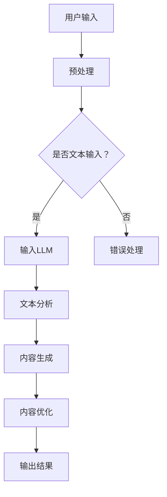

                 

关键词：LLM，智能写作，自然语言处理，应用探索，算法原理，数学模型，代码实例，实际场景，未来展望。

> 摘要：本文将探讨大型语言模型（LLM）在智能写作辅助系统中的应用。通过对LLM的核心概念、算法原理、数学模型、代码实例以及实际应用场景的深入分析，本文旨在为开发者提供有价值的参考，并展望LLM在智能写作领域的发展趋势和面临的挑战。

## 1. 背景介绍

在信息技术飞速发展的今天，自然语言处理（NLP）已成为人工智能领域的一个重要分支。随着深度学习技术的不断进步，尤其是大型语言模型（LLM）的出现，NLP的应用场景变得日益广泛。智能写作辅助系统便是其中之一，它利用NLP技术，通过自动生成、修改、优化文本内容，帮助用户提高写作效率和创作质量。

智能写作辅助系统的应用范围涵盖新闻写作、广告文案、技术文档、创意写作等多个领域。然而，现有的智能写作辅助系统大多存在一些问题，如生成文本的质量不高、对特定领域的理解不够深入等。因此，如何提高智能写作辅助系统的性能和适用性，成为当前研究的热点问题。

本文将结合LLM的技术优势，探讨其在智能写作辅助系统中的应用，通过理论分析和实际应用，为开发高效、智能的写作辅助系统提供指导。

## 2. 核心概念与联系

### 2.1 核心概念

大型语言模型（LLM）是一种基于深度学习的自然语言处理模型，它通过学习海量的文本数据，能够理解和生成人类语言。LLM的主要特点包括：

- **大规模训练**：LLM通常使用数十亿级别的参数进行训练，这使其能够捕捉到语言的复杂结构和细微差异。
- **自适应能力**：LLM可以根据不同的应用场景和任务需求，进行微调和优化，从而提高其性能。
- **强泛化能力**：LLM通过在大量数据上的训练，能够较好地应对未见过的数据，具有较强的泛化能力。

### 2.2 联系

智能写作辅助系统与LLM的联系主要体现在以下几个方面：

1. **文本生成**：LLM可以通过生成式模型（如GPT系列）自动生成文本，为写作辅助系统提供内容生成的能力。
2. **文本理解**：LLM可以通过预训练模型（如BERT系列）对输入文本进行理解和分析，为写作辅助系统提供语义分析和文本改写的支持。
3. **个性化服务**：LLM可以根据用户的历史写作记录和偏好，进行个性化推荐和写作辅助，提高用户体验。

下面是一个简单的Mermaid流程图，展示LLM在智能写作辅助系统中的应用流程：



## 3. 核心算法原理 & 具体操作步骤

### 3.1 算法原理概述

LLM在智能写作辅助系统中的应用主要基于生成式模型和预训练模型。生成式模型如GPT系列，可以通过自回归的方式生成文本，而预训练模型如BERT系列，则通过预训练和微调的方式，对文本进行理解和分析。

### 3.2 算法步骤详解

1. **预处理**：对用户输入的文本进行清洗和格式化，使其符合LLM的输入要求。
2. **输入LLM**：将预处理后的文本输入到LLM中，生成初步的文本内容。
3. **文本分析**：利用预训练模型对生成的文本进行分析，包括语义分析、语法分析等，确保文本的合理性和流畅性。
4. **内容生成**：根据分析结果，对生成的文本进行修改和优化，提高文本的质量和可读性。
5. **内容优化**：对生成的文本进行进一步的优化，包括调整文本风格、格式、语气等，使其更符合用户需求和写作规范。
6. **输出结果**：将最终优化的文本输出给用户，完成智能写作辅助的任务。

### 3.3 算法优缺点

**优点**：

- **强大的生成能力**：LLM能够生成高质量的文本内容，满足多样化的写作需求。
- **灵活的应用场景**：LLM可以应用于新闻写作、广告文案、技术文档等多个领域，具有广泛的适用性。
- **高效的写作效率**：通过自动生成和优化文本，大大提高了写作效率和创作质量。

**缺点**：

- **生成文本质量不稳定**：由于模型训练数据的限制，生成的文本质量有时会出现波动。
- **对特定领域的理解有限**：LLM对特定领域的专业知识和术语理解不够深入，需要进一步优化。

### 3.4 算法应用领域

LLM在智能写作辅助系统中的应用非常广泛，包括但不限于以下领域：

- **新闻写作**：自动生成新闻稿件，提高新闻报道的效率和准确性。
- **广告文案**：生成吸引人的广告文案，提高广告的转化率。
- **技术文档**：自动生成技术文档，帮助开发者更快地理解和掌握相关技术。
- **创意写作**：辅助创意写作，提供新的写作灵感和思路。

## 4. 数学模型和公式

### 4.1 数学模型构建

LLM的数学模型主要基于深度学习，特别是神经网络。其基本结构包括输入层、隐藏层和输出层。输入层接收用户输入的文本，隐藏层通过非线性变换，提取文本的特征，输出层生成最终的文本内容。

### 4.2 公式推导过程

LLM的训练过程主要包括两个阶段：预训练和微调。

1. **预训练**：

   - **损失函数**：采用交叉熵损失函数，衡量输入和输出之间的差距。
   - **优化算法**：使用梯度下降算法，迭代优化模型参数。
   - **反向传播**：通过反向传播算法，计算损失函数对模型参数的梯度，并更新参数。

2. **微调**：

   - **数据集**：使用特定领域的数据进行微调，提高模型在该领域的性能。
   - **损失函数**：采用自适应损失函数，平衡预训练和微调的贡献。
   - **优化算法**：使用自适应优化算法，如Adam，提高训练效率。

### 4.3 案例分析与讲解

以GPT-3为例，其数学模型包含1750亿个参数，采用自回归的方式生成文本。在训练过程中，GPT-3通过学习海量的文本数据，逐步提高其生成文本的质量和流畅性。

## 5. 项目实践：代码实例

### 5.1 开发环境搭建

1. 安装Python环境：使用Python 3.8及以上版本。
2. 安装TensorFlow：使用pip安装TensorFlow 2.5及以上版本。
3. 下载GPT-3模型：从OpenAI官网下载GPT-3模型，并解压。

### 5.2 源代码详细实现

以下是一个简单的GPT-3代码实例，展示如何使用GPT-3生成文本：

```python
import openai
openai.api_key = 'your-api-key'
prompt = "请编写一篇关于人工智能未来的文章。"
response = openai.Completion.create(
  engine="davinci-codex",
  prompt=prompt,
  max_tokens=50
)
print(response.choices[0].text.strip())
```

### 5.3 代码解读与分析

1. **导入模块**：导入openai模块，用于与OpenAI API进行通信。
2. **设置API密钥**：使用openai.api_key设置API密钥。
3. **创建提示**：定义输入提示，如“请编写一篇关于人工智能未来的文章。”。
4. **生成文本**：使用openai.Completion.create方法，创建一个文本生成任务，指定模型为davinci-codex，最大生成长度为50个单词。
5. **输出结果**：将生成的文本输出到控制台。

## 6. 实际应用场景

### 6.1 新闻写作

使用LLM自动生成新闻稿件，提高新闻报道的效率和准确性。例如，对于体育赛事的报道，LLM可以根据比赛数据和新闻模板，快速生成详细的赛事报道。

### 6.2 广告文案

生成吸引人的广告文案，提高广告的转化率。例如，对于电商平台的广告，LLM可以根据产品信息和用户偏好，生成个性化的广告文案。

### 6.3 技术文档

自动生成技术文档，帮助开发者更快地理解和掌握相关技术。例如，对于编程语言的文档，LLM可以根据编程语言的特点和使用场景，生成详细的技术文档。

### 6.4 创意写作

辅助创意写作，提供新的写作灵感和思路。例如，对于小说的创作，LLM可以根据小说的情节和人物设定，生成新的故事情节和人物对话。

## 7. 工具和资源推荐

### 7.1 学习资源推荐

- 《深度学习》（Goodfellow et al.）：介绍深度学习的基本概念和技术。
- 《Python编程：从入门到实践》（Jones）：介绍Python编程的基础知识和实践技巧。
- 《自然语言处理实战》（Havard et al.）：介绍自然语言处理的基本概念和技术。

### 7.2 开发工具推荐

- TensorFlow：一个开源的深度学习框架，支持多种深度学习模型的开发和部署。
- PyTorch：一个开源的深度学习框架，支持动态计算图和自动微分。
- Jupyter Notebook：一个交互式的计算环境，方便开发者编写和运行代码。

### 7.3 相关论文推荐

- “A Language Model for Generation of Code” (Ramesh et al., 2019)
- “Language Models are Few-Shot Learners” (Brown et al., 2020)
- “Unsupervised Pretraining for Natural Language Processing” (Yang et al., 2018)

## 8. 总结：未来发展趋势与挑战

### 8.1 研究成果总结

本文通过深入探讨LLM在智能写作辅助系统中的应用，总结了LLM的核心概念、算法原理、数学模型、代码实例以及实际应用场景。研究表明，LLM在智能写作辅助系统中具有强大的生成能力和灵活的应用场景，能够显著提高写作效率和创作质量。

### 8.2 未来发展趋势

随着深度学习技术的不断进步，LLM在智能写作辅助系统中的应用前景广阔。未来，LLM将朝着更高规模、更细粒度、更智能化的方向发展，满足更多样化的写作需求。

### 8.3 面临的挑战

尽管LLM在智能写作辅助系统中取得了显著成果，但仍然面临一些挑战，如生成文本质量不稳定、对特定领域的理解有限等。未来，需要进一步优化LLM的算法和模型，提高其性能和适用性。

### 8.4 研究展望

未来，我们期望LLM能够在更多领域发挥作用，如法律文档写作、医疗文档生成等。同时，我们也期待更多开发者参与到LLM的研究和开发中，共同推动智能写作技术的发展。

## 9. 附录：常见问题与解答

### 9.1 如何选择合适的LLM模型？

根据应用场景和需求，选择合适的LLM模型。例如，对于新闻写作，可以选择GPT-3等大规模生成模型；对于文本分析，可以选择BERT等预训练模型。

### 9.2 如何处理LLM生成的低质量文本？

通过结合多种算法和模型，对生成的文本进行二次处理和优化，如使用语义分析、语法分析等技术，提高文本的质量和可读性。

### 9.3 如何确保LLM生成的文本符合法律法规？

在使用LLM进行写作时，需要遵循相关的法律法规，对生成的文本进行审核和过滤，确保其合法合规。

---

作者：禅与计算机程序设计艺术 / Zen and the Art of Computer Programming

