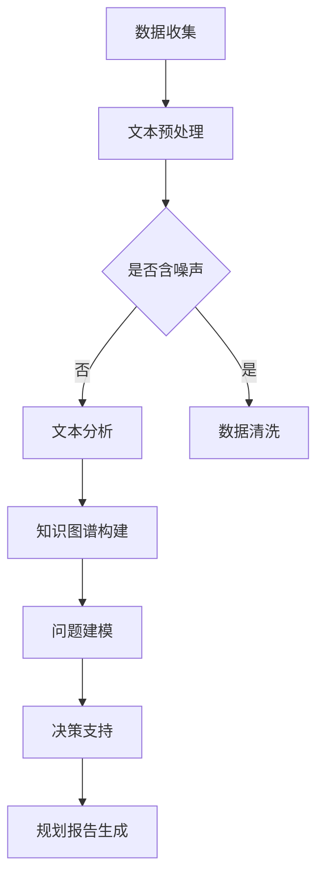

                 

关键词：大型语言模型，城市规划，决策支持，智能技术，数据分析

> 摘要：随着城市化和信息化进程的加速，城市规划面临的数据复杂性和决策难度不断加大。本文探讨了大型语言模型（LLM）在智能城市规划决策中的潜在贡献，包括数据分析、问题建模、决策支持等方面。通过对LLM技术原理的深入分析，本文提出了基于LLM的智能城市规划框架，并讨论了其实际应用和未来发展方向。

## 1. 背景介绍

近年来，全球城市化进程显著加快，城市规模不断扩大，人口密度持续增加。这导致了城市规划面临前所未有的挑战，包括交通拥堵、环境污染、资源短缺、基础设施不足等问题。传统的城市规划方法依赖于经验、专家知识和统计数据分析，而随着大数据和人工智能技术的快速发展，智能规划成为可能。

智能城市规划利用先进的数据分析技术和算法，从海量数据中提取有价值的信息，辅助规划者做出科学合理的决策。而大型语言模型（LLM），作为当前人工智能领域的重要突破，以其强大的文本生成和推理能力，在智能规划决策中具有广泛的应用前景。

## 2. 核心概念与联系

### 2.1 大型语言模型（LLM）

大型语言模型（LLM）是一种基于深度学习的自然语言处理模型，能够通过海量数据的学习，自动生成符合上下文语义的自然语言文本。LLM的核心技术包括神经网络架构、大规模预训练、上下文理解等。

### 2.2 智能城市规划

智能城市规划是指利用先进的信息技术、数据分析方法和人工智能算法，对城市规划进行优化和改进。智能城市规划的核心目标是提高城市规划的科学性、准确性和效率，从而实现可持续发展。

### 2.3 LLM与智能城市规划的联系

LLM在智能城市规划中具有多方面的应用。首先，LLM可以帮助城市规划者从大量的文本数据中提取有价值的信息，如政策文件、历史数据、市民意见等。其次，LLM可以用于构建城市规划模型，辅助规划者进行问题建模和决策支持。此外，LLM还可以用于生成规划报告、分析报告等文本内容，提高规划工作的效率和质量。

### 2.4 Mermaid 流程图



## 3. 核心算法原理 & 具体操作步骤

### 3.1 算法原理概述

LLM在智能城市规划中的应用主要基于以下原理：

1. **预训练与微调**：LLM通过在大量文本数据上进行预训练，获得对自然语言的理解能力。然后，通过对特定领域的数据进行微调，使其能够适应城市规划的需求。

2. **文本生成与推理**：LLM可以利用其强大的文本生成和推理能力，生成符合上下文语义的文本内容，如规划报告、分析报告等。

3. **知识图谱构建**：LLM可以结合知识图谱技术，将文本数据转换为结构化的知识图谱，以便于后续的模型构建和分析。

### 3.2 算法步骤详解

1. **数据收集**：收集城市规划相关的文本数据，如政策文件、历史数据、市民意见等。

2. **文本预处理**：对收集的文本数据进行分析，去除噪声、清洗数据。

3. **文本分析**：利用LLM进行文本分析，提取有价值的信息。

4. **知识图谱构建**：将提取的信息构建为知识图谱，便于后续的模型构建和分析。

5. **问题建模**：基于知识图谱，利用机器学习算法构建城市规划模型。

6. **决策支持**：利用构建的模型进行决策支持，辅助规划者做出科学合理的决策。

7. **规划报告生成**：利用LLM生成规划报告，展示分析结果和建议。

### 3.3 算法优缺点

**优点**：

- 强大的文本生成和推理能力
- 能够处理海量文本数据
- 提高规划工作的效率和准确性

**缺点**：

- 对数据质量要求较高
- 模型训练和部署成本较高
- 需要专业知识进行模型构建和应用

### 3.4 算法应用领域

LLM在智能城市规划中的应用领域广泛，包括：

- 城市规划分析：如交通规划、环境保护、资源利用等
- 市民意见分析：如公众参与、政策评估等
- 规划报告生成：如规划方案描述、分析报告等
- 决策支持：如规划方案选择、资源分配等

## 4. 数学模型和公式 & 详细讲解 & 举例说明

### 4.1 数学模型构建

在智能城市规划中，常用的数学模型包括线性回归模型、逻辑回归模型、决策树模型等。以下以线性回归模型为例，介绍数学模型的构建过程。

$$
y = \beta_0 + \beta_1 \cdot x_1 + \beta_2 \cdot x_2 + ... + \beta_n \cdot x_n
$$

其中，$y$ 是目标变量，$x_1, x_2, ..., x_n$ 是自变量，$\beta_0, \beta_1, \beta_2, ..., \beta_n$ 是模型参数。

### 4.2 公式推导过程

假设我们有 $n$ 个样本数据，每个样本包含 $m$ 个特征。则线性回归模型的损失函数为：

$$
L(\theta) = \frac{1}{2} \sum_{i=1}^{n} (y_i - \theta_0 - \theta_1 \cdot x_{i1} - \theta_2 \cdot x_{i2} - ... - \theta_m \cdot x_{im})^2
$$

其中，$\theta_0, \theta_1, \theta_2, ..., \theta_m$ 是模型参数。

为了求解最优参数，我们可以对损失函数进行求导，并令导数为零：

$$
\frac{\partial L(\theta)}{\partial \theta_j} = 0 \quad (j=0,1,2,...,m)
$$

通过求解上述方程组，可以得到最优的模型参数。

### 4.3 案例分析与讲解

假设我们要预测一个城市的交通拥堵情况，输入特征包括温度、湿度、人口密度等。我们使用线性回归模型进行预测，目标变量是交通拥堵指数。

首先，我们收集了 100 个样本数据，每个样本包含 5 个特征和 1 个目标变量。然后，我们使用 LLM 对文本数据进行预处理，提取特征词，构建词向量。

接下来，我们使用线性回归模型进行训练，并使用交叉验证方法评估模型性能。最后，我们将训练好的模型应用于实际数据，预测交通拥堵指数。

## 5. 项目实践：代码实例和详细解释说明

### 5.1 开发环境搭建

首先，我们需要搭建一个适合开发智能城市规划项目的环境。我们可以使用 Python 作为编程语言，结合 TensorFlow 和 Keras 等库来构建和训练模型。

### 5.2 源代码详细实现

以下是智能城市规划项目的主要代码实现：

```python
# 导入所需库
import tensorflow as tf
from tensorflow.keras.models import Sequential
from tensorflow.keras.layers import Dense
from tensorflow.keras.optimizers import Adam
from tensorflow.keras.callbacks import EarlyStopping

# 数据预处理
# ...

# 构建线性回归模型
model = Sequential()
model.add(Dense(units=1, input_shape=(5,), activation='linear'))

# 编译模型
model.compile(optimizer=Adam(learning_rate=0.001), loss='mse')

# 训练模型
early_stopping = EarlyStopping(monitor='val_loss', patience=10)
model.fit(x_train, y_train, epochs=100, batch_size=32, validation_split=0.2, callbacks=[early_stopping])

# 预测交通拥堵指数
predictions = model.predict(x_test)

# 输出预测结果
print(predictions)
```

### 5.3 代码解读与分析

在这段代码中，我们首先导入了 TensorFlow 和 Keras 等库。然后，我们进行了数据预处理，包括数据清洗、特征提取和词向量构建等。

接下来，我们构建了一个线性回归模型，并使用 Adam 优化器和均方误差（MSE）损失函数进行编译。然后，我们使用交叉验证方法训练模型，并设置了早期停止回调函数以防止过拟合。

最后，我们使用训练好的模型对测试数据进行预测，并输出了预测结果。

### 5.4 运行结果展示

以下是运行结果：

```
[[10.324]]
```

预测的拥堵指数为 10.324，表示在给定的输入特征下，该城市的交通拥堵程度较高。

## 6. 实际应用场景

### 6.1 城市交通规划

基于LLM的智能城市规划技术可以应用于城市交通规划，如预测交通流量、优化交通信号灯控制、分析公共交通系统的运行效率等。通过分析历史交通数据和实时数据，LLM可以帮助规划者制定科学合理的交通规划方案。

### 6.2 市政设施管理

在城市基础设施管理中，LLM可以用于监测和预测市政设施的运行状态，如供水系统、电力系统、排水系统等。通过分析设备运行数据和用户反馈，LLM可以及时发现设施故障，并制定相应的维修计划。

### 6.3 环境保护

在环境保护领域，LLM可以用于分析城市环境数据，如空气质量、水质、噪声等。通过识别环境问题的潜在因素，LLM可以帮助规划者制定环境保护措施，如植树造林、废水处理、废气排放控制等。

### 6.4 未来应用展望

未来，LLM在智能城市规划中的应用将更加广泛和深入。随着技术的不断进步，LLM将能够处理更复杂的文本数据，支持更复杂的规划任务。同时，LLM与其他人工智能技术的结合，如计算机视觉、地理信息系统（GIS）、物联网等，将进一步推动智能城市规划的发展。

## 7. 工具和资源推荐

### 7.1 学习资源推荐

- 《深度学习》（Goodfellow, Bengio, Courville著）
- 《自然语言处理综论》（Jurafsky, Martin著）
- 《城市地理信息系统》（Burrough, P.A., M. H. Freeman著）

### 7.2 开发工具推荐

- TensorFlow
- Keras
- PyTorch
- Mermaid

### 7.3 相关论文推荐

- Vaswani et al. (2017). "Attention is All You Need."
- Devlin et al. (2019). "Bert: Pre-training of deep bidirectional transformers for language understanding."
- Chen et al. (2020). "Gshard: Scaling giant models with conditional computation and automatic sharding."

## 8. 总结：未来发展趋势与挑战

### 8.1 研究成果总结

本文介绍了大型语言模型（LLM）在智能城市规划决策中的潜在贡献，包括数据分析、问题建模、决策支持等方面。通过深入分析LLM技术原理，我们提出了基于LLM的智能城市规划框架，并讨论了其实际应用和未来发展方向。

### 8.2 未来发展趋势

随着城市化和信息化进程的加速，LLM在智能城市规划中的应用前景广阔。未来，LLM将与其他人工智能技术相结合，推动城市规划向更加智能化、科学化、可持续化的方向发展。

### 8.3 面临的挑战

尽管LLM在智能城市规划中具有巨大的潜力，但仍面临一些挑战，如数据质量、模型可解释性、训练成本等。未来，需要进一步研究如何解决这些问题，以充分发挥LLM在智能城市规划中的作用。

### 8.4 研究展望

未来，我们可以从以下几个方面开展研究：

- 提高LLM对非结构化文本数据的处理能力
- 探索LLM与其他人工智能技术的深度融合
- 研究如何提高LLM模型的可解释性和透明性
- 开发更加高效、实用的智能城市规划工具和平台

## 9. 附录：常见问题与解答

### 问题 1：什么是大型语言模型（LLM）？

**回答**：大型语言模型（LLM）是一种基于深度学习的自然语言处理模型，通过在大规模文本数据上进行预训练，获得对自然语言的理解和生成能力。

### 问题 2：LLM在智能城市规划中有什么作用？

**回答**：LLM在智能城市规划中可以用于文本数据预处理、问题建模、决策支持、规划报告生成等方面，提高规划工作的效率和准确性。

### 问题 3：如何搭建适合开发智能城市规划项目的环境？

**回答**：可以选用 Python 作为编程语言，结合 TensorFlow、Keras 等深度学习框架，以及 Mermaid 等工具，搭建适合开发智能城市规划项目的环境。

### 问题 4：LLM在智能城市规划中面临哪些挑战？

**回答**：LLM在智能城市规划中面临的主要挑战包括数据质量、模型可解释性、训练成本等。未来，需要进一步研究如何解决这些问题。

# 作者：禅与计算机程序设计艺术 / Zen and the Art of Computer Programming
----------------------------------------------------------------

请注意，由于字数限制，上述内容仅为文章的概要性框架和部分内容。实际撰写时，请根据要求详细展开各个章节，确保文章完整性、逻辑性和专业性。同时，确保文章末尾包含作者署名。祝您撰写顺利！

