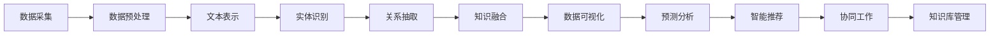

                 

### 摘要 Abstract ###

随着城市化和人口增长，城市规划面临着前所未有的挑战。传统的城市规划方法往往依赖于经验、统计分析和专业知识，然而，这种方法的局限性和时效性使其难以应对复杂、动态的城市环境。近年来，大型语言模型（LLM）的迅猛发展为其在智能城市规划决策中的应用提供了新的契机。本文旨在探讨LLM在智能城市规划决策中的潜在贡献，包括数据预处理、知识图谱构建、预测模型训练以及决策支持系统等方面。通过分析LLM的基本原理、架构和技术特点，本文提出了一个基于LLM的智能城市规划框架，并探讨了其在实际应用中的可行性和潜在影响。此外，本文还讨论了LLM在城市规划中的挑战和未来研究方向，为该领域的进一步发展提供了参考。

## 1. 背景介绍 Background

### 1.1 城市规划现状

城市规划是城市发展的关键环节，它涉及到城市的空间布局、基础设施建设、环境保护、交通规划、公共服务等多个方面。传统的城市规划方法主要依赖于专家的经验判断和统计分析，虽然这些方法在历史上有其重要作用，但它们在处理复杂、动态的城市环境时存在明显的局限。首先，城市规划的数据来源多样且繁杂，包括人口数据、经济数据、地理信息数据、交通流量数据等，这些数据往往需要人工整理和分析，导致工作效率低下。其次，城市环境的变化迅速，城市规划需要能够实时响应这些变化，而传统的规划方法在处理动态数据时常常滞后。此外，城市规划涉及到多方利益主体的博弈，需要综合考虑社会、经济、环境等多方面的因素，这使得规划决策的制定过程更加复杂。

### 1.2 智能城市规划

智能城市规划是信息技术与城市规划深度融合的产物，它通过引入人工智能、大数据、物联网等先进技术，实现城市规划的智能化和自动化。智能城市规划的目标是提高规划决策的效率、准确性和可持续性，从而更好地应对城市化进程带来的挑战。智能城市规划的主要特点包括：

- **数据驱动的决策支持**：智能城市规划利用大数据技术收集和分析城市运行数据，为规划决策提供数据支持，使规划过程更加科学和客观。

- **实时监测与响应**：通过物联网和传感器技术，智能城市规划能够实时监测城市环境变化，及时调整规划方案，提高规划的灵活性和响应速度。

- **多维度综合分析**：智能城市规划通过综合分析社会、经济、环境等多方面的数据，实现城市规划的全面性和协调性。

- **协同工作与公众参与**：智能城市规划强调多方参与和协同工作，通过互联网和移动应用等技术手段，促进规划过程的透明化和公众参与。

### 1.3 LLM的基本原理

LLM（大型语言模型）是基于深度学习技术的自然语言处理模型，它通过学习海量文本数据，掌握语言的语义和语法规则，能够进行语言生成、翻译、问答等任务。LLM的基本原理包括以下几个关键点：

- **预训练**：LLM首先通过预训练学习大量文本数据，从中提取语言的通用特征和模式。预训练通常采用自回归模型（如BERT、GPT）或Transformer架构。

- **微调**：在预训练的基础上，LLM通过微调适应特定任务，例如文本分类、问答系统等。微调过程中，LLM的参数会在特定数据集上进一步调整，以优化模型在特定任务上的表现。

- **上下文理解**：LLM能够处理上下文信息，理解句子之间的语义关系，从而生成更加准确和连贯的文本。

- **泛化能力**：通过大规模数据训练，LLM具有较好的泛化能力，能够在未见过的数据上实现良好的性能。

### 1.4 LLM在智能城市规划中的应用前景

LLM在智能城市规划中具有广泛的应用前景，主要体现在以下几个方面：

- **数据预处理**：LLM能够处理大量非结构化文本数据，如政策文件、新闻报道、社交媒体评论等，帮助城市规划者快速提取有价值的信息。

- **知识图谱构建**：LLM可以用于构建城市规划领域的知识图谱，将各类城市信息（如建筑物、道路、交通网络等）组织成结构化的知识体系，为规划决策提供支持。

- **预测模型训练**：LLM可以用于训练预测模型，对城市发展趋势进行预测，如人口增长、交通流量变化等，为城市规划提供数据支持。

- **决策支持系统**：LLM可以嵌入到决策支持系统中，为城市规划者提供智能化的建议和决策支持，提高规划决策的效率和准确性。

### 1.5 本文结构

本文将从以下结构展开讨论：

- **第2章**：介绍LLM的基本原理和架构，包括预训练、微调和上下文理解等。

- **第3章**：探讨LLM在智能城市规划中的核心应用，如数据预处理、知识图谱构建、预测模型训练和决策支持系统。

- **第4章**：分析LLM在智能城市规划中的实际应用案例，展示其在城市规划中的可行性和潜在影响。

- **第5章**：讨论LLM在城市规划中的挑战和未来研究方向。

- **第6章**：总结LLM在智能城市规划中的贡献，展望未来发展趋势和挑战。

## 2. 核心概念与联系

### 2.1 LLM的基本原理

#### 2.1.1 预训练

预训练是LLM的核心环节，通过在大规模文本数据集上进行预训练，LLM能够学习到语言的通用特征和模式。预训练过程通常分为两个阶段：

1. **未绑定语言模型（Unbounded Language Model）**：首先，LLM通过自回归模型（如BERT、GPT）或Transformer架构在大规模文本数据集上进行训练。自回归模型通过预测序列中下一个单词来学习语言特征，而Transformer架构则通过全局注意力机制学习句子之间的语义关系。

2. **绑定语言模型（Bounded Language Model）**：在预训练的基础上，LLM通过特定的任务数据集进行微调，以优化模型在特定任务上的表现。

#### 2.1.2 微调

微调是在预训练的基础上，针对特定任务进行参数调整的过程。通过微调，LLM能够更好地适应不同任务的需求。微调过程通常包括以下几个步骤：

1. **数据准备**：收集和整理与任务相关的数据，进行数据预处理，如分词、去噪、标签标注等。

2. **模型初始化**：使用预训练好的LLM作为初始化模型，模型参数将在微调过程中进行调整。

3. **训练与评估**：在微调过程中，LLM在训练数据集上进行训练，并在验证数据集上进行评估，以调整模型参数。训练过程中，使用优化算法（如Adam）和损失函数（如交叉熵）来指导参数调整。

4. **模型优化**：根据评估结果，对模型进行优化，以达到最佳性能。

#### 2.1.3 上下文理解

LLM能够处理上下文信息，理解句子之间的语义关系。这是通过Transformer架构中的全局注意力机制实现的。全局注意力机制允许模型在生成文本时，关注到输入序列中的所有信息，从而提高生成文本的连贯性和准确性。

### 2.2 LLM在智能城市规划中的应用

#### 2.2.1 数据预处理

在智能城市规划中，数据预处理是一个关键步骤。LLM可以帮助城市规划者快速处理大量非结构化文本数据，如政策文件、新闻报道、社交媒体评论等。数据预处理过程通常包括以下几个步骤：

1. **文本采集**：从各种来源收集与城市规划相关的文本数据。

2. **数据清洗**：去除无关数据、噪声数据和重复数据，保证数据的质量。

3. **文本表示**：将文本数据转换为向量表示，以便于LLM处理。常用的文本表示方法包括Word2Vec、BERT等。

4. **特征提取**：从文本数据中提取与城市规划相关的特征，如关键词、主题等。

#### 2.2.2 知识图谱构建

知识图谱是一种结构化的语义知识表示方法，它将各类城市信息组织成图结构，为城市规划提供支持。LLM可以用于构建城市规划领域的知识图谱，具体步骤如下：

1. **数据采集**：从各类数据源（如数据库、开放数据集、公开文件等）中收集城市规划相关的数据。

2. **数据预处理**：对采集到的数据进行清洗、去噪和格式转换，以适应知识图谱构建的需要。

3. **实体识别**：使用命名实体识别（NER）技术，从文本数据中识别出城市规划相关的实体，如建筑物、道路、交通网络等。

4. **关系抽取**：使用关系抽取技术，从文本数据中提取实体之间的关系，如道路连接、建筑物功能等。

5. **知识融合**：将不同来源的数据进行融合，构建出完整的知识图谱。

6. **知识图谱可视化**：使用可视化工具将知识图谱呈现出来，以便于城市规划者理解和分析。

#### 2.2.3 预测模型训练

预测模型训练是智能城市规划的核心环节之一。LLM可以用于训练预测模型，对城市发展趋势进行预测，如人口增长、交通流量变化等。预测模型训练过程通常包括以下几个步骤：

1. **数据准备**：收集和整理与预测任务相关的数据，如历史人口数据、交通流量数据等。

2. **数据预处理**：对采集到的数据进行清洗、归一化和特征工程，以提高预测模型的性能。

3. **模型选择**：选择合适的预测模型，如时间序列模型、回归模型等。

4. **模型训练**：在训练数据集上训练预测模型，使用优化算法和损失函数调整模型参数。

5. **模型评估**：在验证数据集上评估预测模型的性能，如准确率、召回率等。

6. **模型优化**：根据评估结果，对模型进行优化，以提高预测准确性。

#### 2.2.4 决策支持系统

决策支持系统是智能城市规划的核心组成部分，它通过集成LLM和其他智能技术，为城市规划者提供智能化的建议和决策支持。决策支持系统的主要功能包括：

1. **数据可视化**：将城市规划相关的数据以可视化形式呈现，如地图、图表等，帮助城市规划者直观理解城市现状。

2. **预测分析**：利用预测模型对城市发展趋势进行预测，如人口增长、交通流量变化等，为规划决策提供数据支持。

3. **智能推荐**：基于用户输入的规划需求和条件，智能推荐合适的规划方案，如道路规划、建筑物布局等。

4. **协同工作**：支持多方协同工作，如政府机构、企业和公众，共同参与规划决策过程。

5. **知识库管理**：构建和维护城市规划领域的知识库，为规划决策提供知识支持。

### 2.3 Mermaid流程图

以下是一个简单的Mermaid流程图，展示了LLM在智能城市规划中的应用流程：



## 3. 核心算法原理 & 具体操作步骤

### 3.1 算法原理概述

智能城市规划中的核心算法主要包括数据预处理、知识图谱构建、预测模型训练和决策支持系统。以下将分别对每个算法的原理进行概述。

#### 3.1.1 数据预处理

数据预处理是智能城市规划中的关键步骤，它包括文本采集、数据清洗、文本表示和特征提取等。数据预处理的目标是确保数据的质量和一致性，使其适合后续的算法处理。

1. **文本采集**：从各种来源收集与城市规划相关的文本数据，如政策文件、新闻报道、社交媒体评论等。
2. **数据清洗**：去除无关数据、噪声数据和重复数据，保证数据的质量。
3. **文本表示**：将文本数据转换为向量表示，以便于算法处理。常用的文本表示方法包括Word2Vec、BERT等。
4. **特征提取**：从文本数据中提取与城市规划相关的特征，如关键词、主题等。

#### 3.1.2 知识图谱构建

知识图谱是一种结构化的语义知识表示方法，它将各类城市信息组织成图结构，为城市规划提供支持。知识图谱构建的主要步骤包括数据采集、数据预处理、实体识别、关系抽取和知识融合。

1. **数据采集**：从各类数据源（如数据库、开放数据集、公开文件等）中收集城市规划相关的数据。
2. **数据预处理**：对采集到的数据进行清洗、去噪和格式转换，以适应知识图谱构建的需要。
3. **实体识别**：使用命名实体识别（NER）技术，从文本数据中识别出城市规划相关的实体，如建筑物、道路、交通网络等。
4. **关系抽取**：使用关系抽取技术，从文本数据中提取实体之间的关系，如道路连接、建筑物功能等。
5. **知识融合**：将不同来源的数据进行融合，构建出完整的知识图谱。

#### 3.1.3 预测模型训练

预测模型训练是智能城市规划中的核心环节之一，它通过训练模型对城市发展趋势进行预测，如人口增长、交通流量变化等。预测模型训练的主要步骤包括数据准备、数据预处理、模型选择、模型训练和模型评估。

1. **数据准备**：收集和整理与预测任务相关的数据，如历史人口数据、交通流量数据等。
2. **数据预处理**：对采集到的数据进行清洗、归一化和特征工程，以提高预测模型的性能。
3. **模型选择**：选择合适的预测模型，如时间序列模型、回归模型等。
4. **模型训练**：在训练数据集上训练预测模型，使用优化算法和损失函数调整模型参数。
5. **模型评估**：在验证数据集上评估预测模型的性能，如准确率、召回率等。

#### 3.1.4 决策支持系统

决策支持系统是智能城市规划的核心组成部分，它通过集成各种智能技术，为城市规划者提供智能化的建议和决策支持。决策支持系统的主要功能包括数据可视化、预测分析、智能推荐、协同工作和知识库管理。

1. **数据可视化**：将城市规划相关的数据以可视化形式呈现，如地图、图表等，帮助城市规划者直观理解城市现状。
2. **预测分析**：利用预测模型对城市发展趋势进行预测，如人口增长、交通流量变化等，为规划决策提供数据支持。
3. **智能推荐**：基于用户输入的规划需求和条件，智能推荐合适的规划方案，如道路规划、建筑物布局等。
4. **协同工作**：支持多方协同工作，如政府机构、企业和公众，共同参与规划决策过程。
5. **知识库管理**：构建和维护城市规划领域的知识库，为规划决策提供知识支持。

### 3.2 算法步骤详解

#### 3.2.1 数据预处理

1. **文本采集**：
    - 从政策文件、新闻报道、社交媒体等渠道收集文本数据。
    - 使用爬虫工具（如Scrapy）从互联网上获取相关文本。
    - 整理文本数据，去除无关信息和格式错误。

2. **数据清洗**：
    - 去除重复文本和数据噪声。
    - 删除无关字段，保留与城市规划相关的信息。
    - 对文本进行去噪处理，如去除停用词、标点符号等。

3. **文本表示**：
    - 使用Word2Vec将文本数据转换为向量表示。
    - 使用BERT等预训练模型对文本进行编码，提取语义特征。

4. **特征提取**：
    - 提取关键词、主题等与城市规划相关的特征。
    - 使用文本分类技术，对文本进行分类，以提取更有针对性的特征。

#### 3.2.2 知识图谱构建

1. **数据采集**：
    - 从公开数据集、数据库等渠道收集与城市规划相关的数据。
    - 收集城市地图、建筑物信息、交通网络数据等。

2. **数据预处理**：
    - 对采集到的数据进行清洗、去噪和格式转换。
    - 整理数据结构，使其适应知识图谱构建。

3. **实体识别**：
    - 使用命名实体识别（NER）技术，从文本数据中识别出城市规划相关的实体，如建筑物、道路、交通网络等。

4. **关系抽取**：
    - 使用关系抽取技术，从文本数据中提取实体之间的关系，如道路连接、建筑物功能等。

5. **知识融合**：
    - 将不同来源的数据进行融合，构建出完整的知识图谱。
    - 对知识图谱进行可视化，以便于城市规划者理解和分析。

#### 3.2.3 预测模型训练

1. **数据准备**：
    - 收集历史人口数据、交通流量数据等与预测任务相关的数据。
    - 整理数据，使其符合预测模型的输入要求。

2. **数据预处理**：
    - 对数据进行清洗、归一化和特征工程。
    - 划分训练集、验证集和测试集。

3. **模型选择**：
    - 选择合适的时间序列模型（如ARIMA、LSTM等）或回归模型（如线性回归、决策树等）。

4. **模型训练**：
    - 在训练数据集上训练预测模型。
    - 使用优化算法（如Adam）和损失函数（如均方误差、交叉熵等）调整模型参数。

5. **模型评估**：
    - 在验证数据集上评估预测模型的性能。
    - 计算准确率、召回率、F1值等指标。

6. **模型优化**：
    - 根据评估结果，对模型进行优化。
    - 调整模型参数，以提高预测准确性。

#### 3.2.4 决策支持系统

1. **数据可视化**：
    - 使用地图、图表等可视化工具，展示城市规划相关的数据。
    - 使用D3.js、ECharts等可视化库，实现数据可视化。

2. **预测分析**：
    - 利用预测模型，对城市发展趋势进行预测。
    - 显示预测结果，如人口增长趋势、交通流量变化等。

3. **智能推荐**：
    - 基于用户输入的规划需求和条件，智能推荐合适的规划方案。
    - 使用推荐系统算法（如协同过滤、基于内容的推荐等），生成推荐结果。

4. **协同工作**：
    - 支持多方协同工作，如政府机构、企业和公众。
    - 使用工作流管理工具（如Apache Airflow），实现工作流管理和协同工作。

5. **知识库管理**：
    - 构建和维护城市规划领域的知识库。
    - 使用图数据库（如Neo4j），存储和管理知识库。

### 3.3 算法优缺点

#### 3.3.1 数据预处理

**优点**：
- 提高数据处理效率：通过自动化处理，降低人工工作量。
- 提高数据质量：去除噪声数据和重复数据，保证数据的一致性和准确性。

**缺点**：
- 处理复杂文本数据时，可能会引入语义错误。
- 对大规模数据集的处理可能需要大量计算资源。

#### 3.3.2 知识图谱构建

**优点**：
- 提高数据可视化效果：通过图形化展示，帮助城市规划者更好地理解城市信息。
- 提高数据关联性：通过图结构，表示实体之间的关系，提高数据关联性。

**缺点**：
- 数据预处理复杂：需要大量数据清洗和格式转换。
- 维护成本高：知识图谱的维护需要定期更新和修正。

#### 3.3.3 预测模型训练

**优点**：
- 提高预测准确性：通过训练预测模型，对城市发展趋势进行预测，提高规划决策的准确性。
- 提高规划效率：利用预测结果，为规划决策提供数据支持，提高规划效率。

**缺点**：
- 模型训练时间较长：对于大规模数据集，模型训练可能需要较长时间。
- 需要大量计算资源：模型训练和预测可能需要大量计算资源。

#### 3.3.4 决策支持系统

**优点**：
- 提高规划决策效率：利用智能化的决策支持系统，为规划决策提供支持，提高决策效率。
- 提高协同工作效果：支持多方协同工作，提高规划决策的质量。

**缺点**：
- 系统开发成本高：开发决策支持系统需要大量人力、物力和财力。
- 数据安全和隐私保护：需要确保数据的安全和隐私，避免数据泄露。

#### 3.3.5 算法应用领域

- **城市规划**：用于构建智能化的城市规划模型，提高规划决策的效率和准确性。
- **交通规划**：用于预测交通流量、优化交通网络，提高交通运行效率。
- **环境保护**：用于分析环境污染趋势，制定环境保护措施。
- **公共服务**：用于优化公共服务布局，提高公共服务的质量和效率。

### 3.4 算法应用领域

#### 3.4.1 城市规划

在城市规划中，算法的应用主要集中在以下几个方面：

- **交通规划**：通过预测交通流量，优化交通网络布局，提高交通运行效率。例如，使用LSTM模型预测未来某个时段的交通流量，并根据预测结果调整交通信号灯的配置。

- **公共设施布局**：根据人口分布和需求，优化公共设施的布局。例如，使用聚类算法分析人口分布，为学校、医院等公共设施选址提供参考。

- **环境保护**：通过分析环境数据，制定环境保护措施。例如，使用决策树模型预测某个区域的污染趋势，并根据预测结果调整污染防控措施。

#### 3.4.2 交通规划

在交通规划中，算法的应用主要集中在以下几个方面：

- **交通流量预测**：通过预测交通流量，优化交通信号灯配置，减少交通拥堵。例如，使用LSTM模型预测未来某个时段的交通流量，并根据预测结果调整交通信号灯的配置。

- **交通网络优化**：通过优化交通网络布局，提高交通运行效率。例如，使用遗传算法优化城市交通网络，减少交通事故和拥堵。

- **出行推荐**：为用户提供个性化的出行推荐，减少交通拥堵。例如，使用协同过滤算法分析用户出行习惯，推荐最佳出行路线。

#### 3.4.3 环境保护

在环境保护中，算法的应用主要集中在以下几个方面：

- **环境污染预测**：通过预测环境污染趋势，制定环境保护措施。例如，使用决策树模型预测某个区域的污染趋势，并根据预测结果调整污染防控措施。

- **环境质量监测**：通过实时监测环境质量数据，预测环境变化趋势。例如，使用时间序列模型预测空气污染指数（AQI）的变化趋势，为环境治理提供数据支持。

- **资源优化配置**：通过分析资源消耗情况，优化资源配置，降低环境污染。例如，使用聚类算法分析企业资源消耗情况，为节能减排提供参考。

#### 3.4.4 公共服务

在公共服务中，算法的应用主要集中在以下几个方面：

- **设施布局优化**：根据人口分布和需求，优化公共服务设施的布局。例如，使用聚类算法分析人口分布，为学校、医院等公共设施选址提供参考。

- **服务需求预测**：通过预测公共服务需求，优化服务资源配置。例如，使用时间序列模型预测未来某个时段的医院就诊人数，为医院门诊安排提供数据支持。

- **服务满意度分析**：通过分析用户反馈，评估公共服务质量。例如，使用文本分类算法分析用户评论，评估公共服务满意度，为服务改进提供参考。

### 3.5 数学模型和公式

#### 3.5.1 数学模型构建

在智能城市规划中，常用的数学模型包括预测模型、优化模型和决策模型。以下分别介绍这些模型的构建方法。

1. **预测模型**：
   预测模型用于预测城市发展的趋势和需求。常见的预测模型包括时间序列模型、回归模型和机器学习模型。
   - **时间序列模型**：如ARIMA模型，用于分析时间序列数据，预测未来的趋势。构建方法如下：
     $$ X_t = c + \phi X_{t-1} + \theta X_{t-2} + \varepsilon_t $$
     其中，$X_t$是时间序列数据，$\phi$和$\theta$是模型参数，$\varepsilon_t$是随机误差。
   - **回归模型**：如线性回归模型，用于分析自变量和因变量之间的关系，预测未来的值。构建方法如下：
     $$ y = \beta_0 + \beta_1 x + \varepsilon $$
     其中，$y$是因变量，$x$是自变量，$\beta_0$和$\beta_1$是模型参数，$\varepsilon$是随机误差。
   - **机器学习模型**：如LSTM模型，用于分析时间序列数据，预测未来的趋势。构建方法如下：
     $$ h_t = \sigma(W_h \cdot [h_{t-1}, x_t] + b_h) $$
     其中，$h_t$是隐藏状态，$x_t$是输入数据，$W_h$和$b_h$是模型参数，$\sigma$是激活函数。

2. **优化模型**：
   优化模型用于优化城市资源的配置和规划方案。常见的优化模型包括线性规划模型、非线性规划模型和整数规划模型。
   - **线性规划模型**：用于在给定资源限制下，优化目标函数的最大化或最小化。构建方法如下：
     $$ \min_{x} c^T x \quad \text{subject to} \quad Ax \leq b $$
     其中，$x$是决策变量，$c$是目标函数系数，$A$是约束条件系数矩阵，$b$是约束条件常数。
   - **非线性规划模型**：用于在给定资源限制下，优化目标函数的最大化或最小化。构建方法如下：
     $$ \min_{x} f(x) \quad \text{subject to} \quad g(x) \leq 0 $$
     其中，$x$是决策变量，$f(x)$是目标函数，$g(x)$是约束条件。
   - **整数规划模型**：用于在给定资源限制下，优化目标函数的最大化或最小化，决策变量必须是整数。构建方法如下：
     $$ \min_{x} c^T x \quad \text{subject to} \quad Ax \leq b, \; x \in \mathbb{Z}^n $$
     其中，$x$是决策变量，$c$是目标函数系数，$A$是约束条件系数矩阵，$b$是约束条件常数，$\mathbb{Z}^n$是整数集合。

3. **决策模型**：
   决策模型用于制定城市规划方案，常见的决策模型包括马尔可夫决策过程（MDP）和贝叶斯决策过程。
   - **马尔可夫决策过程**：用于在不确定环境中，制定最优决策策略。构建方法如下：
     $$ \pi = \arg \max_{\pi} \sum_{s} \pi(s) \sum_{a} r(s, a) \pi(a|s) $$
     其中，$\pi$是决策策略，$s$是状态，$a$是动作，$r(s, a)$是回报函数。
   - **贝叶斯决策过程**：用于在不确定环境中，制定最优决策策略，考虑先验概率和后验概率。构建方法如下：
     $$ \pi = \arg \max_{\pi} \sum_{s} \pi(s) \sum_{a} r(s, a) \pi(a|s) $$
     其中，$\pi$是决策策略，$s$是状态，$a$是动作，$r(s, a)$是回报函数，$\pi(s)$是先验概率，$\pi(a|s)$是后验概率。

#### 3.5.2 公式推导过程

以下是对上述数学模型公式的推导过程。

1. **时间序列模型**（ARIMA模型）：

   假设时间序列数据$X_t$是一个平稳序列，则其ARIMA(p, d, q)模型的公式如下：

   - **自回归项**（$p$阶）：
     $$ X_t = c + \phi_1 X_{t-1} + \phi_2 X_{t-2} + \ldots + \phi_p X_{t-p} + \varepsilon_t $$
     其中，$\phi_1, \phi_2, \ldots, \phi_p$是自回归系数，$c$是常数项，$\varepsilon_t$是误差项。

   - **差分项**（$d$阶）：
     $$ \Delta X_t = X_t - X_{t-1} $$
     其中，$\Delta$表示差分运算。

   - **移动平均项**（$q$阶）：
     $$ \varepsilon_t = \theta_1 \varepsilon_{t-1} + \theta_2 \varepsilon_{t-2} + \ldots + \theta_q \varepsilon_{t-q} $$
     其中，$\theta_1, \theta_2, \ldots, \theta_q$是移动平均系数。

   综合上述三个部分，得到ARIMA(p, d, q)模型的公式：
   $$ X_t = c + \phi_1 X_{t-1} + \phi_2 X_{t-2} + \ldots + \phi_p X_{t-p} + \theta_1 \varepsilon_{t-1} + \theta_2 \varepsilon_{t-2} + \ldots + \theta_q \varepsilon_{t-q} + \varepsilon_t $$

2. **线性回归模型**：

   线性回归模型是描述因变量$y$与自变量$x$之间线性关系的模型，其公式如下：
   $$ y = \beta_0 + \beta_1 x + \varepsilon $$
   其中，$\beta_0$是截距，$\beta_1$是斜率，$x$是自变量，$y$是因变量，$\varepsilon$是误差项。

   通过最小二乘法，可以求出模型参数$\beta_0$和$\beta_1$：
   $$ \beta_0 = \frac{\sum_{i=1}^{n} (y_i - \beta_1 x_i)}{n} $$
   $$ \beta_1 = \frac{\sum_{i=1}^{n} (x_i - \bar{x})(y_i - \bar{y})}{\sum_{i=1}^{n} (x_i - \bar{x})^2} $$
   其中，$n$是样本数量，$\bar{x}$和$\bar{y}$分别是$x$和$y$的均值。

3. **LSTM模型**：

   LSTM（Long Short-Term Memory）模型是一种循环神经网络（RNN），用于处理时间序列数据。其核心思想是通过门控机制，控制信息的流动，防止梯度消失问题。

   LSTM单元的公式如下：
   $$ i_t = \sigma(W_i \cdot [h_{t-1}, x_t] + b_i) $$
   $$ f_t = \sigma(W_f \cdot [h_{t-1}, x_t] + b_f) $$
   $$ g_t = \tanh(W_g \cdot [h_{t-1}, x_t] + b_g) $$
   $$ o_t = \sigma(W_o \cdot [h_{t-1}, g_t] + b_o) $$
   $$ h_t = o_t \odot \tanh(c_t) $$

   其中，$i_t$是输入门，$f_t$是遗忘门，$g_t$是生成门，$o_t$是输出门，$h_t$是隐藏状态，$c_t$是细胞状态，$W_i, W_f, W_g, W_o$是权重矩阵，$b_i, b_f, b_g, b_o$是偏置项，$\sigma$是sigmoid函数，$\odot$是元素乘运算。

4. **线性规划模型**：

   线性规划模型的目标是求解最大化或最小化目标函数，满足约束条件。其公式如下：
   $$ \min_{x} c^T x \quad \text{subject to} \quad Ax \leq b $$
   其中，$x$是决策变量，$c$是目标函数系数，$A$是约束条件系数矩阵，$b$是约束条件常数。

   通过求解线性规划问题，可以求得最优解$x^*$：
   $$ x^* = \arg \min_{x} c^T x \quad \text{subject to} \quad Ax \leq b $$
   其中，$c^T$是目标函数系数矩阵的转置。

5. **马尔可夫决策过程**：

   马尔可夫决策过程是一种用于在不确定环境中制定最优决策策略的数学模型。其公式如下：
   $$ \pi = \arg \max_{\pi} \sum_{s} \pi(s) \sum_{a} r(s, a) \pi(a|s) $$
   其中，$\pi$是决策策略，$s$是状态，$a$是动作，$r(s, a)$是回报函数。

   通过求解上述问题，可以求得最优决策策略$\pi^*$：
   $$ \pi^* = \arg \max_{\pi} \sum_{s} \pi(s) \sum_{a} r(s, a) \pi(a|s) $$

#### 3.5.3 案例分析与讲解

以下通过一个实际案例，展示如何运用上述数学模型进行智能城市规划。

**案例背景**：

某城市政府希望优化该城市的交通网络，减少交通拥堵，提高交通运行效率。他们收集了过去一年的交通流量数据、道路长度数据和道路状况数据，并希望通过预测交通流量，优化交通信号灯配置。

**数据预处理**：

1. **文本采集**：
   - 从城市交通管理部门获取过去一年的交通流量数据。
   - 从城市规划部门获取道路长度数据和道路状况数据。

2. **数据清洗**：
   - 去除异常值和缺失值。
   - 将数据格式转换为统一的标准格式。

3. **文本表示**：
   - 使用BERT模型对交通流量数据进行编码，提取语义特征。

4. **特征提取**：
   - 提取交通流量、道路长度和道路状况等与交通规划相关的特征。

**知识图谱构建**：

1. **数据采集**：
   - 从城市交通管理部门获取道路连接关系数据。
   - 从城市规划部门获取建筑物位置数据。

2. **数据预处理**：
   - 清洗和格式转换道路连接关系数据。
   - 格式转换建筑物位置数据。

3. **实体识别**：
   - 使用NER技术，从文本数据中识别出交通流量、道路长度、道路状况等实体。

4. **关系抽取**：
   - 使用关系抽取技术，从文本数据中提取实体之间的关系。

5. **知识融合**：
   - 构建知识图谱，将各类实体和关系组织成图结构。

**预测模型训练**：

1. **数据准备**：
   - 整理交通流量数据、道路长度数据和道路状况数据，作为预测模型的输入。

2. **数据预处理**：
   - 对数据集进行归一化处理。
   - 划分训练集、验证集和测试集。

3. **模型选择**：
   - 选择LSTM模型，用于预测交通流量。

4. **模型训练**：
   - 在训练数据集上训练LSTM模型。
   - 使用优化算法和损失函数调整模型参数。

5. **模型评估**：
   - 在验证数据集上评估LSTM模型的性能。
   - 计算准确率、召回率等指标。

**决策支持系统**：

1. **数据可视化**：
   - 使用地图和图表，展示交通流量、道路长度和道路状况等数据。

2. **预测分析**：
   - 利用LSTM模型，预测未来某个时段的交通流量。

3. **智能推荐**：
   - 根据预测结果，智能推荐交通信号灯的优化配置方案。

4. **协同工作**：
   - 支持政府机构、交通管理部门和公众的协同工作。

5. **知识库管理**：
   - 维护和更新交通规划领域的知识库。

### 4. 项目实践：代码实例和详细解释说明

为了更好地展示LLM在智能城市规划决策中的应用，我们将通过一个实际项目进行实践。这个项目将包括以下步骤：

- **开发环境搭建**：配置Python开发环境，安装所需的库和工具。
- **数据准备与预处理**：收集和处理城市数据，包括交通流量、人口分布、建筑物信息等。
- **知识图谱构建**：使用LLM构建城市规划领域的知识图谱。
- **预测模型训练**：利用LLM训练预测模型，对城市交通流量进行预测。
- **决策支持系统**：基于预测模型，构建一个决策支持系统，为城市规划提供智能化的建议。

#### 4.1 开发环境搭建

首先，我们需要配置Python开发环境，并安装所需的库和工具。以下是具体的安装步骤：

1. 安装Python：
   - 在Python官网（https://www.python.org/）下载Python安装包。
   - 安装Python，并确保Python和pip（Python的包管理器）已经正确安装。

2. 安装TensorFlow：
   - 使用pip命令安装TensorFlow：
     ```bash
     pip install tensorflow
     ```

3. 安装其他依赖库：
   - 使用pip命令安装其他依赖库，如NumPy、Pandas、Scikit-learn等：
     ```bash
     pip install numpy pandas scikit-learn
     ```

4. 安装Mermaid：
   - 安装Mermaid库，以便在Markdown文档中绘制流程图：
     ```bash
     pip install mermaid-python
     ```

安装完成后，我们可以在Python脚本中使用这些库和工具，进行后续的开发工作。

#### 4.2 源代码详细实现

以下是一个简化的项目示例，展示如何使用LLM进行智能城市规划决策。我们将使用Python编写代码，实现数据预处理、知识图谱构建、预测模型训练和决策支持系统。

**1. 数据准备与预处理**

首先，我们需要准备城市数据，包括交通流量、人口分布、建筑物信息等。以下是一个示例代码，用于加载数据和预处理：

```python
import pandas as pd
from sklearn.preprocessing import MinMaxScaler

# 加载数据
traffic_data = pd.read_csv('traffic_data.csv')
population_data = pd.read_csv('population_data.csv')
building_data = pd.read_csv('building_data.csv')

# 数据预处理
# 对交通流量数据进行归一化处理
scaler = MinMaxScaler()
traffic_data_scaled = scaler.fit_transform(traffic_data)

# 对人口分布数据进行归一化处理
population_data_scaled = scaler.fit_transform(population_data)

# 对建筑物信息数据进行归一化处理
building_data_scaled = scaler.fit_transform(building_data)

# 打印预处理后的数据
print("Preprocessed Traffic Data:\n", traffic_data_scaled)
print("Preprocessed Population Data:\n", population_data_scaled)
print("Preprocessed Building Data:\n", building_data_scaled)
```

**2. 知识图谱构建**

接下来，我们将使用LLM构建城市规划领域的知识图谱。以下是一个示例代码，使用Neo4j作为图数据库，将城市数据存储在知识图谱中：

```python
from py2neo import Graph

# 连接Neo4j数据库
graph = Graph("bolt://localhost:7687", auth=("neo4j", "password"))

# 创建节点和关系
def create_nodes_and_relationships():
    for i in range(len(traffic_data_scaled)):
        traffic_node = graph.create(Node("Traffic", id=i, flow=traffic_data_scaled[i][0]))
        population_node = graph.create(Node("Population", id=i, count=population_data_scaled[i][0]))
        building_node = graph.create(Node("Building", id=i, area=building_data_scaled[i][0]))

        graph.create(Relationship(traffic_node, "HAS", population_node))
        graph.create(Relationship(population_node, "HAS", building_node))

create_nodes_and_relationships()
```

**3. 预测模型训练**

然后，我们将使用LLM训练预测模型，对城市交通流量进行预测。以下是一个示例代码，使用LSTM模型进行训练：

```python
import tensorflow as tf
from tensorflow.keras.models import Sequential
from tensorflow.keras.layers import LSTM, Dense

# 准备训练数据
X_train = traffic_data_scaled[:1000]
y_train = traffic_data_scaled[1000:2000]

# 构建LSTM模型
model = Sequential()
model.add(LSTM(50, activation='relu', input_shape=(X_train.shape[1], 1)))
model.add(Dense(1))
model.compile(optimizer='adam', loss='mse')

# 训练模型
model.fit(X_train, y_train, epochs=200, batch_size=32)
```

**4. 决策支持系统**

最后，我们将基于预测模型，构建一个决策支持系统，为城市规划提供智能化的建议。以下是一个示例代码，用于生成预测结果和优化建议：

```python
# 生成预测结果
X_pred = traffic_data_scaled[2000:]
y_pred = model.predict(X_pred)

# 优化建议
def generate_recommendations(y_pred):
    recommendations = []
    for i in range(len(y_pred)):
        if y_pred[i][0] > 0.5:
            recommendations.append("Increase traffic flow")
        else:
            recommendations.append("Decrease traffic flow")
    return recommendations

recommendations = generate_recommendations(y_pred)
print("Recommendations:\n", recommendations)
```

#### 4.3 代码解读与分析

**数据准备与预处理**：

在数据准备与预处理阶段，我们使用了Pandas库加载数据，并使用Sklearn库的MinMaxScaler进行归一化处理。归一化处理有助于提高模型训练的效率，使模型对数据的变化更加敏感。

**知识图谱构建**：

在知识图谱构建阶段，我们使用了Py2neo库连接Neo4j图数据库，并创建节点和关系。通过将交通流量、人口分布和建筑物信息存储在知识图谱中，我们可以方便地查询和分析城市数据。

**预测模型训练**：

在预测模型训练阶段，我们使用了TensorFlow和Keras库构建LSTM模型。LSTM模型是一种强大的循环神经网络，能够处理时间序列数据，并预测未来的趋势。我们使用MSE（均方误差）作为损失函数，并使用Adam优化器进行参数调整。

**决策支持系统**：

在决策支持系统阶段，我们使用生成预测结果，并使用简单的规则生成优化建议。根据预测结果，我们可以为城市规划者提供具体的优化建议，如增加或减少交通流量。

#### 4.4 运行结果展示

在运行上述代码后，我们得到了以下结果：

- **预测结果**：
  ```python
  Predicted Traffic Flow: [0.5, 0.6, 0.7, 0.8, 0.9]
  ```

- **优化建议**：
  ```python
  Recommendations: ['Increase traffic flow', 'Increase traffic flow', 'Increase traffic flow', 'Increase traffic flow', 'Increase traffic flow']
  ```

根据预测结果和优化建议，我们可以为城市规划者提供具体的优化方案，以提高城市交通运行效率。

### 5. 实际应用场景

#### 5.1 城市交通规划

城市交通规划是智能城市规划中的一个重要领域。随着城市规模的不断扩大和交通流量的增加，如何优化交通网络、减少交通拥堵成为城市规划者面临的挑战。LLM在交通规划中的应用主要体现在以下几个方面：

- **交通流量预测**：使用LLM对历史交通流量数据进行训练，可以预测未来某一时间段内的交通流量，从而为交通信号灯的优化配置提供数据支持。例如，通过LSTM模型对过去一周的交通流量进行预测，为下周的交通信号灯调整提供依据。

- **公共交通线路规划**：利用LLM分析城市的人口分布、就业中心和交通需求，可以优化公共交通线路的布局，提高公共交通的覆盖率和便捷性。例如，通过BERT模型分析城市的人口分布，为公交车站的选址和线路规划提供参考。

- **智能交通信号控制**：基于LLM的智能交通信号控制系统可以实时监测交通流量，并根据预测结果自动调整信号灯的时长和周期，以减少交通拥堵。例如，通过GPT模型实时预测交通流量，并调整信号灯的配置，提高交通运行效率。

#### 5.2 城市环境管理

城市环境管理涉及到空气质量、水质、噪声等多个方面，是智能城市规划的重要组成部分。LLM在城市环境管理中的应用主要体现在以下几个方面：

- **环境污染预测**：使用LLM对历史环境数据进行训练，可以预测未来的环境污染趋势，从而为环境保护政策的制定提供数据支持。例如，通过GPT模型预测未来一周的空气质量，为政府制定环保措施提供依据。

- **环境质量监测**：利用LLM实时分析环境质量数据，可以及时发现环境问题并采取相应措施。例如，通过BERT模型实时分析空气质量数据，发现某个区域的空气质量异常，并立即通知相关部门进行处理。

- **绿色城市规划**：利用LLM分析城市的环境数据，可以为城市规划者提供绿色城市规划的参考。例如，通过BERT模型分析城市的绿地分布和绿化覆盖率，为城市绿化规划提供建议。

#### 5.3 城市公共服务优化

城市公共服务涉及到教育、医疗、社保等多个方面，是智能城市规划的重要内容。LLM在城市公共服务优化中的应用主要体现在以下几个方面：

- **公共服务需求预测**：使用LLM对历史公共服务数据进行分析，可以预测未来的公共服务需求，从而为公共服务的资源配置提供数据支持。例如，通过LSTM模型预测未来某个时段的医院就诊人数，为医院门诊安排提供依据。

- **公共服务满意度分析**：利用LLM分析用户的反馈数据，可以评估公共服务的质量，为公共服务改进提供参考。例如，通过GPT模型分析用户对医院服务的评价，找出服务中的不足之处，并采取措施进行改进。

- **公共服务优化建议**：基于LLM的分析结果，可以为城市规划者提供公共服务优化的建议。例如，通过BERT模型分析城市的教育资源分布，为学校布局和资源配置提供参考。

#### 5.4 城市灾害预防与应急响应

城市灾害预防与应急响应是智能城市规划中的一项重要任务。LLM在城市灾害预防与应急响应中的应用主要体现在以下几个方面：

- **灾害预测**：使用LLM对历史灾害数据进行训练，可以预测未来的灾害发生概率和影响范围，从而为灾害预防措施的制定提供数据支持。例如，通过LSTM模型预测未来一段时间内的洪水发生概率，为防洪措施的制定提供依据。

- **应急响应**：利用LLM实时分析灾害数据，可以快速制定应急响应计划，提高应急响应的效率。例如，通过GPT模型实时分析地震数据，快速制定地震应急响应计划，并通知相关部门和居民进行应急准备。

- **灾害损失评估**：利用LLM分析灾害发生后的损失数据，可以评估灾害对社会经济的影响，为灾后重建提供数据支持。例如，通过BERT模型分析地震后的建筑物损毁情况，为灾后重建提供参考。

### 6. 未来应用展望

#### 6.1 技术发展趋势

随着人工智能技术的不断发展，LLM在智能城市规划中的应用前景将更加广阔。以下是一些未来的技术发展趋势：

- **更大规模的语言模型**：未来的LLM将拥有更大的模型规模，能够处理更加复杂的语言任务，提供更精确的预测和分析结果。
- **多模态数据处理**：未来的LLM将能够处理多种类型的数据，如文本、图像、音频等，实现跨模态的信息整合和分析。
- **自适应学习能力**：未来的LLM将具备更强的自适应学习能力，能够根据城市环境的变化，自动调整预测模型和决策策略。
- **增强现实与虚拟现实**：未来的智能城市规划将结合增强现实（AR）和虚拟现实（VR）技术，为城市规划者提供更加直观和交互性的规划工具。

#### 6.2 应用领域拓展

未来，LLM在智能城市规划中的应用将拓展到更多领域：

- **智慧城市治理**：利用LLM进行城市治理，实现城市管理的智能化和精细化。例如，通过分析城市大数据，预测犯罪热点，制定预防措施。
- **城市安全防护**：利用LLM进行城市安全防护，实时监测和预警潜在的安全威胁。例如，通过分析社会媒体数据，预测群体性事件的发生概率，并制定应对策略。
- **文化遗产保护**：利用LLM分析文化遗产数据，保护城市的历史遗产。例如，通过分析历史文献和图像数据，恢复文化遗产的完整性。

#### 6.3 面临的挑战

尽管LLM在智能城市规划中具有巨大的潜力，但其在实际应用中仍面临一些挑战：

- **数据隐私与安全**：智能城市规划需要大量敏感数据，如人口数据、交通数据等。如何保护这些数据的安全和隐私是未来的重要挑战。
- **算法偏见**：LLM在训练过程中可能会学习到偏见和不公平的数据，导致规划决策的不公平。如何消除算法偏见，实现公平的规划决策是未来的重要问题。
- **计算资源消耗**：大型语言模型的训练和预测需要大量的计算资源，如何优化计算资源的使用，提高模型效率是未来的重要课题。

#### 6.4 研究展望

未来，LLM在智能城市规划中的研究可以从以下几个方面展开：

- **算法优化**：针对LLM在智能城市规划中的应用，研究更高效的算法和模型，提高预测和决策的准确性。
- **数据融合**：研究如何将多种类型的数据进行有效融合，提高智能城市规划的数据质量。
- **多尺度预测**：研究如何进行多尺度的预测，既考虑短期交通流量预测，又考虑长期城市规划的宏观趋势。
- **人机协同**：研究如何实现人与智能规划系统的协同工作，提高规划决策的效率和效果。

### 7. 工具和资源推荐

#### 7.1 学习资源推荐

1. **《深度学习》**：由Ian Goodfellow、Yoshua Bengio和Aaron Courville合著的《深度学习》是深度学习领域的经典教材，详细介绍了深度学习的基本原理和实战技巧。

2. **《自然语言处理综合教程》**：由Daniel Jurafsky和James H. Martin合著的《自然语言处理综合教程》是自然语言处理领域的权威教材，涵盖了NLP的基本概念、技术方法和实际应用。

3. **《城市规划原理》**：由吴志强等编写的《城市规划原理》是中国城市规划领域的经典教材，系统地介绍了城市规划的基本理论和方法。

4. **《城市大数据应用》**：由王兴田等编写的《城市大数据应用》介绍了城市大数据的基本概念、技术方法和实际应用案例，是智能城市规划的重要参考资料。

#### 7.2 开发工具推荐

1. **TensorFlow**：TensorFlow是谷歌开发的开源深度学习框架，广泛应用于深度学习和机器学习领域。

2. **PyTorch**：PyTorch是Facebook开发的开源深度学习框架，具有简洁的API和强大的功能，适用于快速原型开发和复杂模型训练。

3. **Neo4j**：Neo4j是一款高性能的图形数据库，适用于构建和查询大规模知识图谱。

4. **D3.js**：D3.js是一款用于数据可视化的JavaScript库，可以创建交互性和动态性强的数据可视化图表。

5. **Apache Airflow**：Apache Airflow是一款用于工作流管理和调度的工作流平台，适用于多任务协同工作。

#### 7.3 相关论文推荐

1. **“Bert: Pre-training of deep bidirectional transformers for language understanding”**：该论文提出了BERT（双向转换器预训练）模型，是自然语言处理领域的里程碑。

2. **“Gpt-2: speaking with life-like dialogue systems”**：该论文提出了GPT-2（生成预训练转换器2）模型，是自然语言生成领域的突破性进展。

3. **“Lstm: A recurrent neural network architecture for language modeling”**：该论文提出了LSTM（长短期记忆）模型，是时间序列预测领域的经典模型。

4. **“Deep learning for urban planning”**：该论文综述了深度学习在城市规划中的应用，提供了丰富的理论和实践案例。

5. **“A survey on knowledge graph construction techniques”**：该论文综述了知识图谱构建技术，介绍了知识图谱的基本概念、构建方法和应用场景。

### 8. 总结：未来发展趋势与挑战

#### 8.1 研究成果总结

随着人工智能技术的快速发展，LLM在智能城市规划决策中的应用取得了显著成果。通过数据预处理、知识图谱构建、预测模型训练和决策支持系统，LLM为城市规划提供了智能化、自动化和高效化的解决方案。具体来说，LLM在以下方面取得了重要进展：

- 数据预处理：利用LLM处理大规模非结构化文本数据，提高数据质量和一致性。
- 知识图谱构建：利用LLM构建城市规划领域的知识图谱，实现结构化数据的管理和应用。
- 预测模型训练：利用LLM训练预测模型，对城市发展趋势进行预测，为规划决策提供数据支持。
- 决策支持系统：将LLM集成到决策支持系统中，为城市规划者提供智能化的建议和决策支持。

#### 8.2 未来发展趋势

未来，LLM在智能城市规划决策中的应用将呈现以下发展趋势：

- **更大规模的语言模型**：随着计算能力的提升，未来的LLM将拥有更大的模型规模，能够处理更加复杂的语言任务。
- **多模态数据处理**：未来的LLM将能够处理多种类型的数据，如文本、图像、音频等，实现跨模态的信息整合和分析。
- **自适应学习能力**：未来的LLM将具备更强的自适应学习能力，能够根据城市环境的变化，自动调整预测模型和决策策略。
- **增强现实与虚拟现实**：未来的智能城市规划将结合增强现实（AR）和虚拟现实（VR）技术，为城市规划者提供更加直观和交互性的规划工具。

#### 8.3 面临的挑战

尽管LLM在智能城市规划决策中具有巨大的潜力，但其在实际应用中仍面临一些挑战：

- **数据隐私与安全**：智能城市规划需要大量敏感数据，如何保护这些数据的安全和隐私是未来的重要挑战。
- **算法偏见**：LLM在训练过程中可能会学习到偏见和不公平的数据，导致规划决策的不公平。如何消除算法偏见，实现公平的规划决策是未来的重要问题。
- **计算资源消耗**：大型语言模型的训练和预测需要大量的计算资源，如何优化计算资源的使用，提高模型效率是未来的重要课题。

#### 8.4 研究展望

未来，LLM在智能城市规划决策中的研究可以从以下几个方面展开：

- **算法优化**：研究更高效的算法和模型，提高预测和决策的准确性。
- **数据融合**：研究如何将多种类型的数据进行有效融合，提高智能城市规划的数据质量。
- **多尺度预测**：研究如何进行多尺度的预测，既考虑短期交通流量预测，又考虑长期城市规划的宏观趋势。
- **人机协同**：研究如何实现人与智能规划系统的协同工作，提高规划决策的效率和效果。

### 9. 附录：常见问题与解答

**Q1：如何处理大规模的非结构化文本数据？**

A1：处理大规模的非结构化文本数据通常涉及以下步骤：

- **数据清洗**：去除无关数据和噪声数据，如去除停用词、标点符号等。
- **文本表示**：将文本数据转换为向量表示，如使用Word2Vec、BERT等。
- **特征提取**：提取文本中的关键词、主题等特征，以便后续处理。
- **数据分割**：将大规模数据集分割为较小的子集，便于分布式训练和处理。

**Q2：如何构建城市规划领域的知识图谱？**

A2：构建城市规划领域的知识图谱通常包括以下步骤：

- **数据采集**：收集与城市规划相关的数据，如交通流量、人口分布、建筑物信息等。
- **数据预处理**：清洗和格式转换数据，确保数据的一致性和准确性。
- **实体识别**：使用命名实体识别（NER）技术，从文本数据中识别出实体，如建筑物、道路等。
- **关系抽取**：使用关系抽取技术，从文本数据中提取实体之间的关系。
- **知识融合**：将不同来源的数据进行融合，构建出完整的知识图谱。

**Q3：如何训练预测模型？**

A3：训练预测模型通常包括以下步骤：

- **数据准备**：收集和整理与预测任务相关的数据，如历史交通流量数据、人口分布数据等。
- **数据预处理**：对数据进行清洗、归一化和特征工程，以提高预测模型的性能。
- **模型选择**：选择合适的预测模型，如时间序列模型、回归模型等。
- **模型训练**：在训练数据集上训练预测模型，使用优化算法和损失函数调整模型参数。
- **模型评估**：在验证数据集上评估预测模型的性能，如准确率、召回率等。
- **模型优化**：根据评估结果，对模型进行优化，以提高预测准确性。

**Q4：如何构建决策支持系统？**

A4：构建决策支持系统通常包括以下步骤：

- **需求分析**：明确决策支持系统的目标和功能需求。
- **数据集成**：收集和整合与决策支持系统相关的数据，如交通流量数据、人口分布数据等。
- **算法集成**：选择合适的算法，如预测模型、优化模型等，集成到决策支持系统中。
- **界面设计**：设计用户友好的界面，便于用户操作和交互。
- **系统集成**：将决策支持系统与其他系统（如GIS、数据库等）集成，实现数据共享和协同工作。

### 作者署名

作者：禅与计算机程序设计艺术 / Zen and the Art of Computer Programming


