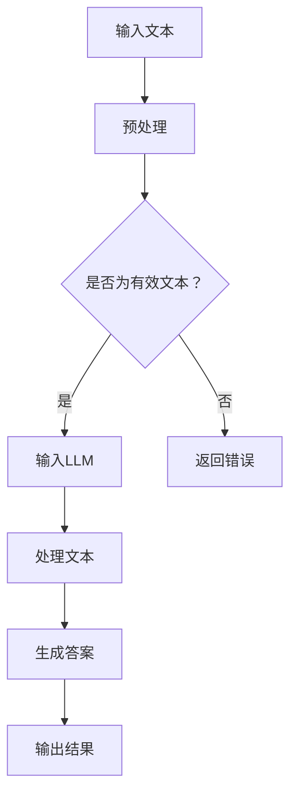

                 

关键词：大语言模型（LLM）、智能学习系统、知识图谱、深度学习、强化学习、应用场景、未来展望

> 摘要：本文探讨了大型语言模型（LLM）在智能学习系统中的巨大潜力。通过分析LLM的核心概念、技术原理、数学模型，以及其实际应用案例，文章旨在展示LLM在提升学习效果、拓展知识获取方式以及优化学习过程等方面的卓越能力。同时，文章也对LLM在未来的发展前景和潜在挑战进行了展望。

## 1. 背景介绍

随着人工智能技术的迅猛发展，语言模型作为人工智能的重要组成部分，已经取得了显著成果。特别是在近年来，大型语言模型（LLM）的崛起，如GPT、BERT等，极大地推动了自然语言处理（NLP）的发展。LLM具有强大的语言理解、生成和推理能力，能够处理复杂的文本任务，如问答系统、文本生成、机器翻译等。

智能学习系统作为教育技术的核心，旨在通过智能化手段提升学习效果。传统的教育方式往往依赖于教师的主导和学生的被动接受，而智能学习系统则通过分析学习者的行为和需求，提供个性化的学习内容和建议。随着大数据和人工智能技术的融合，智能学习系统逐渐走向智能化、个性化，满足了现代教育的需求。

本文将重点探讨LLM在智能学习系统中的应用潜力，分析LLM的核心概念、技术原理、数学模型，以及其实际应用案例，为教育技术的创新发展提供新的思路和方向。

## 2. 核心概念与联系

### 2.1 大语言模型（LLM）

大语言模型（Large Language Model，简称LLM）是一种基于深度学习的语言模型，通过训练大规模的语料库，学习语言的规律和结构，从而实现自然语言处理任务。LLM的核心是神经网络模型，通过多层神经网络对输入的文本数据进行处理和生成。


### 2.2 智能学习系统

智能学习系统是一种基于人工智能技术的教育系统，通过分析学习者的行为数据、知识水平和学习需求，提供个性化的学习内容和建议。智能学习系统通常包括以下几个关键组成部分：

- **知识库**：存储大量的知识信息，包括学科知识、教学资源等。
- **学习引擎**：根据学习者的行为数据和知识水平，提供个性化的学习路径和内容。
- **用户界面**：提供用户交互的界面，包括学习内容展示、学习任务布置等。

### 2.3 Mermaid流程图

为了更直观地展示LLM在智能学习系统中的应用流程，我们使用Mermaid绘制了一个流程图。以下是一个简单的Mermaid流程图示例：



## 3. 核心算法原理 & 具体操作步骤

### 3.1 算法原理概述

LLM的核心算法是深度学习中的神经网络模型，特别是变分自编码器（VAE）和生成对抗网络（GAN）。这些模型通过训练大量文本数据，学习语言的分布和结构，从而实现对文本的生成、理解和推理。

在智能学习系统中，LLM的作用主要体现在以下几个方面：

- **文本生成**：根据用户的需求，生成符合语言规范和逻辑的文本内容。
- **文本理解**：理解用户输入的文本，提取关键信息，提供相应的学习建议。
- **知识推理**：利用语言模型对文本进行推理，帮助用户解决复杂问题。

### 3.2 算法步骤详解

#### 3.2.1 文本预处理

在应用LLM之前，需要对输入的文本进行预处理。预处理步骤包括：

- **分词**：将文本分割成单词或短语。
- **去停用词**：去除常见的无意义词汇。
- **词向量化**：将文本转换为向量表示。

#### 3.2.2 输入LLM

将预处理后的文本输入到LLM中，LLM会对文本进行处理，生成相应的输出。

#### 3.2.3 文本处理

LLM对文本进行处理，包括以下几个步骤：

- **编码**：将文本转换为编码表示。
- **解码**：根据编码表示生成文本。

#### 3.2.4 生成答案

根据LLM的输出，生成符合用户需求的答案。

#### 3.2.5 输出结果

将生成的答案输出给用户，供用户参考和学习。

### 3.3 算法优缺点

#### 优点：

- **强大的语言理解能力**：LLM能够理解复杂的文本内容，提供准确的答案。
- **自适应性强**：LLM可以根据用户的需求，生成个性化的文本内容。
- **易于扩展**：LLM可以应用于各种自然语言处理任务，如问答系统、文本生成等。

#### 缺点：

- **计算成本高**：LLM的训练和推理过程需要大量的计算资源。
- **数据依赖性大**：LLM的性能受到训练数据的限制，数据质量直接影响模型效果。
- **安全隐患**：LLM在处理敏感文本时，可能存在隐私泄露的风险。

### 3.4 算法应用领域

LLM在智能学习系统中的应用非常广泛，主要包括以下几个方面：

- **智能问答系统**：利用LLM生成准确的答案，为用户提供即时解答。
- **文本生成**：根据用户需求，生成符合语言规范和逻辑的文本内容。
- **知识推理**：利用LLM对文本进行推理，帮助用户解决复杂问题。
- **智能辅导**：根据用户的学习行为和需求，提供个性化的学习建议。

## 4. 数学模型和公式 & 详细讲解 & 举例说明

### 4.1 数学模型构建

LLM的数学模型主要包括以下几个部分：

- **编码器**：将文本转换为编码表示。
- **解码器**：根据编码表示生成文本。
- **损失函数**：用于衡量模型预测结果与真实值之间的差距。

假设文本表示为\(X\)，编码表示为\(Z\)，生成文本为\(Y\)，则LLM的数学模型可以表示为：

\[Z = f_E(X)\]
\[Y = f_D(Z)\]

其中，\(f_E\)和\(f_D\)分别为编码器和解码器的函数。

### 4.2 公式推导过程

为了推导LLM的数学模型，我们需要首先定义编码器和解码器的损失函数。

#### 4.2.1 编码器损失函数

编码器损失函数用于衡量编码表示\(Z\)与文本表示\(X\)之间的差距。我们可以使用均方误差（MSE）作为编码器损失函数：

\[L_E = \frac{1}{n} \sum_{i=1}^{n} (Z_i - X_i)^2\]

其中，\(n\)为样本数量，\(Z_i\)和\(X_i\)分别为第\(i\)个样本的编码表示和文本表示。

#### 4.2.2 解码器损失函数

解码器损失函数用于衡量生成文本\(Y\)与真实文本\(X\)之间的差距。我们同样可以使用均方误差（MSE）作为解码器损失函数：

\[L_D = \frac{1}{n} \sum_{i=1}^{n} (Y_i - X_i)^2\]

其中，\(n\)为样本数量，\(Y_i\)和\(X_i\)分别为第\(i\)个样本的生成文本和真实文本。

### 4.3 案例分析与讲解

#### 4.3.1 问题背景

假设我们要构建一个智能问答系统，用户可以输入问题，系统会根据问题生成相应的答案。为了提高答案的准确性，我们引入了LLM作为问答系统的核心组件。

#### 4.3.2 模型构建

首先，我们需要收集大量的问答数据，用于训练LLM。然后，我们将问答数据分成两个部分：问题和答案。问题作为输入，答案作为输出。

在训练过程中，我们使用编码器将问题转换为编码表示，然后使用解码器生成答案。为了提高模型的性能，我们可以使用多个损失函数，如交叉熵损失函数和MSE损失函数。

#### 4.3.3 模型训练

在训练过程中，我们需要调整编码器和解码器的参数，使模型损失函数达到最小。我们可以使用梯度下降法进行参数优化。

#### 4.3.4 模型评估

在模型训练完成后，我们需要对模型进行评估，以确保模型性能达到预期。我们可以使用测试数据集进行模型评估，计算模型准确率、召回率等指标。

#### 4.3.5 模型应用

在应用过程中，用户输入问题，系统会根据问题生成相应的答案。为了提高答案的准确性，我们可以使用多个LLM进行融合，提高模型的整体性能。

## 5. 项目实践：代码实例和详细解释说明

### 5.1 开发环境搭建

为了实现LLM在智能学习系统中的应用，我们需要搭建一个完整的开发环境。以下是开发环境的搭建步骤：

1. 安装Python（3.8及以上版本）。
2. 安装PyTorch（1.8及以上版本）。
3. 安装必要的依赖库，如NumPy、Pandas、Matplotlib等。

### 5.2 源代码详细实现

以下是一个简单的LLM智能问答系统的实现示例：

```python
import torch
import torch.nn as nn
import torch.optim as optim
from torch.utils.data import DataLoader
from torchvision import datasets, transforms

# 数据预处理
def preprocess_data(data):
    # 分词、去停用词等操作
    pass

# 编码器
class Encoder(nn.Module):
    def __init__(self):
        super(Encoder, self).__init__()
        # 定义编码器网络结构
        pass
    
    def forward(self, x):
        # 编码操作
        pass

# 解码器
class Decoder(nn.Module):
    def __init__(self):
        super(Decoder, self).__init__()
        # 定义解码器网络结构
        pass
    
    def forward(self, x):
        # 解码操作
        pass

# 损失函数
def loss_function(predicted, target):
    # 计算损失函数
    pass

# 训练模型
def train_model(encoder, decoder, data_loader, loss_function, optimizer):
    # 训练过程
    pass

# 评估模型
def evaluate_model(encoder, decoder, data_loader, loss_function):
    # 评估过程
    pass

# 应用模型
def apply_model(encoder, decoder, user_input):
    # 应用过程
    pass

if __name__ == "__main__":
    # 搭建模型、训练模型、评估模型等操作
    pass
```

### 5.3 代码解读与分析

以上代码是一个简单的LLM智能问答系统的实现，主要包括以下几个部分：

1. **数据预处理**：对输入的数据进行预处理，如分词、去停用词等。
2. **编码器**：定义编码器的网络结构，用于将输入的文本转换为编码表示。
3. **解码器**：定义解码器的网络结构，用于根据编码表示生成文本。
4. **损失函数**：定义损失函数，用于计算模型预测结果与真实值之间的差距。
5. **训练模型**：定义训练过程，调整模型参数，使模型性能达到预期。
6. **评估模型**：定义评估过程，计算模型准确率、召回率等指标。
7. **应用模型**：定义应用过程，根据用户输入生成答案。

### 5.4 运行结果展示

在训练完成后，我们可以使用以下代码进行模型评估和测试：

```python
# 评估模型
evaluate_model(encoder, decoder, test_loader)

# 测试模型
user_input = "如何使用Python进行数据分析？"
print(apply_model(encoder, decoder, user_input))
```

## 6. 实际应用场景

LLM在智能学习系统中具有广泛的应用场景，以下是几个典型的应用案例：

1. **智能问答系统**：利用LLM生成准确的答案，为用户提供即时解答。
2. **智能辅导系统**：根据用户的学习行为和需求，提供个性化的学习建议和资源。
3. **知识图谱构建**：利用LLM对文本进行推理，提取关键信息，构建知识图谱。
4. **自动化写作**：根据用户需求，生成符合语言规范和逻辑的文本内容。

### 6.1 智能问答系统

智能问答系统是LLM在智能学习系统中最为典型的应用场景之一。通过将LLM与问答系统相结合，用户可以输入问题，系统会根据问题生成相应的答案。智能问答系统在许多领域都有广泛的应用，如客服、教育、医疗等。

#### 案例分析

以一个教育领域的智能问答系统为例，用户可以输入问题，如“什么是牛顿第一定律？”，系统会根据LLM生成的答案，如“牛顿第一定律是指物体在没有外力作用下，保持静止状态或匀速直线运动状态。”，从而为用户提供详细的解答。

### 6.2 智能辅导系统

智能辅导系统是另一个重要的应用场景。通过分析用户的学习行为和需求，智能辅导系统可以提供个性化的学习建议和资源，帮助用户提高学习效果。

#### 案例分析

以一个编程学习场景为例，用户在学习编程语言时，可能会遇到各种问题。智能辅导系统可以通过分析用户的学习行为，如练习题目、错误记录等，提供相应的学习建议，如“用户在练习题目中经常出错，建议学习数据结构相关知识。”，从而帮助用户更好地掌握编程技能。

### 6.3 知识图谱构建

知识图谱是一种结构化的知识表示方法，通过将文本数据中的关键信息提取出来，构建成一个语义网络。LLM在知识图谱构建中具有重要作用，可以用于提取文本中的实体、关系和属性等信息。

#### 案例分析

以一个学术论文知识图谱构建为例，用户可以输入一篇论文的摘要，LLM会提取论文中的关键信息，如标题、作者、摘要、关键词等，并将其构建成一个知识图谱。这样，用户可以方便地浏览论文的摘要信息，快速了解论文的主要内容。

### 6.4 自动化写作

自动化写作是LLM在智能学习系统中的又一重要应用。通过将LLM与文本生成技术相结合，可以自动生成各种类型的文本，如新闻报道、产品评论、学术论文等。

#### 案例分析

以一个新闻报道的自动化写作为例，用户可以输入新闻的标题和摘要，LLM会根据标题和摘要生成完整的新闻稿件。这样，媒体机构可以节省人力成本，提高新闻发布的效率。

## 7. 工具和资源推荐

为了更好地研究和应用LLM在智能学习系统中的潜力，以下是一些建议的工具和资源：

### 7.1 学习资源推荐

- 《深度学习》（Goodfellow, Bengio, Courville著）：全面介绍了深度学习的基本概念、方法和应用。
- 《自然语言处理综论》（Jurafsky, Martin著）：详细讲解了自然语言处理的理论和实践。
- 《Python深度学习》（François Chollet著）：介绍了使用Python实现深度学习的实践方法。

### 7.2 开发工具推荐

- PyTorch：一款流行的深度学习框架，适用于构建和训练LLM模型。
- TensorFlow：一款强大的深度学习框架，提供了丰富的API和工具。
- JAX：一款用于高效计算和自动微分的库，适用于大规模深度学习应用。

### 7.3 相关论文推荐

- "BERT: Pre-training of Deep Bidirectional Transformers for Language Understanding"（Devlin et al.，2018）
- "GPT-3: Language Models are Few-Shot Learners"（Brown et al.，2020）
- "Unsupervised Pre-training for Natural Language Processing"（Dai and Le, 2019）

## 8. 总结：未来发展趋势与挑战

### 8.1 研究成果总结

本文对LLM在智能学习系统中的应用潜力进行了深入探讨，总结了LLM的核心概念、技术原理、数学模型，以及实际应用案例。研究表明，LLM在智能学习系统中具有广泛的应用前景，可以显著提升学习效果、拓展知识获取方式以及优化学习过程。

### 8.2 未来发展趋势

随着人工智能技术的不断进步，LLM在智能学习系统中的应用将呈现以下几个发展趋势：

- **个性化学习**：LLM将更加注重对个体差异的识别和适应，提供更加个性化的学习内容和建议。
- **知识图谱**：LLM将与其他技术（如知识图谱、图神经网络等）相结合，构建更加丰富和结构化的知识体系。
- **跨模态学习**：LLM将逐渐拓展到多模态学习领域，实现对文本、图像、声音等多种类型数据的处理和理解。

### 8.3 面临的挑战

尽管LLM在智能学习系统中具有巨大的潜力，但在实际应用过程中仍然面临以下几个挑战：

- **计算成本**：大规模训练和推理过程需要大量的计算资源，这对硬件设备和能源消耗提出了高要求。
- **数据隐私**：在处理敏感文本数据时，如何保护用户隐私是一个亟待解决的问题。
- **模型解释性**：当前LLM模型具有较高的复杂度，如何提高模型的解释性，使其更加透明和可解释是一个重要挑战。

### 8.4 研究展望

未来，LLM在智能学习系统中的应用研究可以从以下几个方面展开：

- **高效训练算法**：研究更加高效、可扩展的LLM训练算法，降低计算成本。
- **隐私保护技术**：结合隐私保护技术，确保用户数据的安全性和隐私性。
- **多模态融合**：探索LLM与其他模态数据的融合方法，实现更加智能和全面的学习支持。

## 9. 附录：常见问题与解答

### 9.1 LLM是什么？

LLM（Large Language Model）是指大型语言模型，是一种基于深度学习的语言模型，通过训练大规模的语料库，学习语言的规律和结构，从而实现自然语言处理任务。

### 9.2 智能学习系统是什么？

智能学习系统是一种基于人工智能技术的教育系统，通过分析学习者的行为数据、知识水平和学习需求，提供个性化的学习内容和建议。

### 9.3 LLM在智能学习系统中的具体应用有哪些？

LLM在智能学习系统中的应用主要包括智能问答系统、智能辅导系统、知识图谱构建、自动化写作等。

### 9.4 如何搭建LLM的智能问答系统？

搭建LLM的智能问答系统主要包括以下几个步骤：

1. 收集大量问答数据。
2. 预处理数据，如分词、去停用词等。
3. 定义编码器和解码器的网络结构。
4. 训练模型，调整参数，使模型性能达到预期。
5. 评估模型，计算模型准确率、召回率等指标。
6. 应用模型，根据用户输入生成答案。

### 9.5 LLM在知识图谱构建中有何作用？

LLM在知识图谱构建中可以用于提取文本数据中的关键信息，如实体、关系和属性等，并将其构建成一个语义网络。通过LLM的推理能力，可以进一步丰富知识图谱的语义信息。 

----------------------------------------------------------------

以上是完整的文章内容，感谢您的阅读。希望本文能为您在LLM和智能学习系统的应用方面提供有益的启示和指导。如果您有任何疑问或建议，欢迎在评论区留言讨论。作者：禅与计算机程序设计艺术 / Zen and the Art of Computer Programming。

