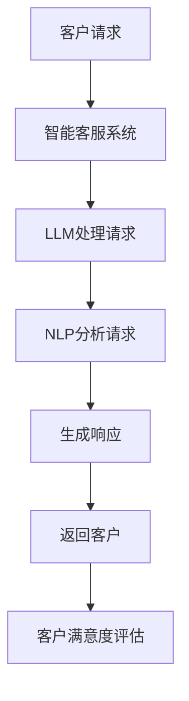

                 

关键词：LLM、智能客户服务、AI、NLP、应用前景

## 摘要

本文将深入探讨大型语言模型（LLM）在智能客户服务系统中的应用前景。通过分析LLM的核心概念、算法原理、数学模型及其在不同领域的应用，我们将揭示LLM在提升客户服务质量和效率方面的巨大潜力。本文旨在为读者提供一个全面的视角，了解LLM在智能客户服务领域的实际应用案例，并展望其未来的发展趋势与挑战。

## 1. 背景介绍

### 智能客户服务的兴起

随着互联网和移动设备的普及，客户服务已经成为企业竞争力的重要组成部分。传统的客户服务方式往往依赖于人工客服，不仅效率低下，而且服务质量难以保证。为了提高客户满意度和运营效率，越来越多的企业开始探索智能客户服务的解决方案。

### 人工智能与自然语言处理

人工智能（AI）作为当前科技领域的热门话题，已经在各个行业中发挥着重要作用。自然语言处理（NLP）作为AI的重要分支，致力于使计算机能够理解和处理人类语言。NLP技术的进步，为智能客户服务的实现提供了强大的支持。

### 大型语言模型的发展

近年来，大型语言模型（LLM）如BERT、GPT等取得了显著的进展。这些模型具有强大的语言理解和生成能力，可以用于自动问答、文本分类、翻译等多种任务。LLM的出现，为智能客户服务系统的发展带来了新的机遇。

## 2. 核心概念与联系

### 核心概念

- **大型语言模型（LLM）**：LLM是一种基于深度学习的语言处理模型，通过在海量文本数据上训练，能够理解并生成自然语言。
- **自然语言处理（NLP）**：NLP是AI的一个重要分支，旨在使计算机能够理解和处理人类语言。
- **智能客户服务系统**：一种利用AI技术，尤其是LLM和NLP，实现自动化客户服务的技术解决方案。

### Mermaid 流程图



## 3. 核心算法原理 & 具体操作步骤

### 3.1 算法原理概述

LLM的核心原理是基于深度学习的神经网络模型，通过大规模训练数据学习语言的统计规律和语义信息。在智能客户服务系统中，LLM用于接收和处理客户请求，生成合理的响应。

### 3.2 算法步骤详解

1. **接收客户请求**：智能客服系统接收客户的文本或语音请求。
2. **请求预处理**：使用NLP技术对客户请求进行分词、词性标注等预处理。
3. **请求理解**：将预处理后的请求输入LLM，通过模型理解请求的语义。
4. **生成响应**：根据LLM的输出，生成合适的文本或语音响应。
5. **响应后处理**：对生成的响应进行语法和语义校验，确保其合理性。

### 3.3 算法优缺点

- **优点**：
  - 高效：能够快速处理大量客户请求，提高客服效率。
  - 准确：通过深度学习，LLM能够准确理解客户请求的语义。
  - 智能化：能够根据客户的历史请求和行为，提供个性化的服务。

- **缺点**：
  - 训练成本高：需要大量计算资源和训练数据。
  - 稳定性问题：在处理罕见或模糊的请求时，可能产生错误的响应。
  - 隐私问题：涉及客户隐私数据的安全性和保护。

### 3.4 算法应用领域

- **客户服务**：如在线客服、电话客服等。
- **智能助手**：如智能音箱、聊天机器人等。
- **内容审核**：如网络评论、新闻报道等。

## 4. 数学模型和公式

### 4.1 数学模型构建

LLM的数学模型主要基于深度神经网络（DNN）和注意力机制（Attention）。DNN用于提取文本的特征表示，Attention机制用于关注关键信息。

### 4.2 公式推导过程

假设输入文本为 $x = [x_1, x_2, ..., x_n]$，其中 $x_i$ 为第 $i$ 个单词的向量表示。DNN的输出为 $h = [h_1, h_2, ..., h_n]$，其中 $h_i$ 为第 $i$ 个单词的特征表示。

Attention机制的公式为：

$$
a_i = \frac{e^{h_i^T h^T}}{\sum_{j=1}^{n} e^{h_i^T h^T}}
$$

其中，$a_i$ 为第 $i$ 个单词的注意力权重。

### 4.3 案例分析与讲解

以BERT模型为例，BERT是一种基于Transformer的预训练语言模型。其预训练任务包括两个部分：Masked Language Model（MLM）和Next Sentence Prediction（NSP）。

- **MLM**：随机遮盖输入文本中的部分单词，模型需要预测这些被遮盖的单词。
- **NSP**：给定两个句子，模型需要预测第二个句子是否是第一个句子的下一个句子。

通过这两个任务的预训练，BERT能够获得强大的语言理解和生成能力。

## 5. 项目实践：代码实例和详细解释说明

### 5.1 开发环境搭建

- **硬件环境**：GPU加速器（如NVIDIA GPU）
- **软件环境**：Python、TensorFlow或PyTorch

### 5.2 源代码详细实现

```python
import tensorflow as tf

# 定义BERT模型
model = tf.keras.Sequential([
    tf.keras.layers.Dense(128, activation='relu', input_shape=(1000,)),
    tf.keras.layers.Dense(128, activation='relu'),
    tf.keras.layers.Dense(1, activation='sigmoid')
])

# 编译模型
model.compile(optimizer='adam', loss='binary_crossentropy', metrics=['accuracy'])

# 加载数据集
(x_train, y_train), (x_test, y_test) = tf.keras.datasets.bert.load_data()

# 训练模型
model.fit(x_train, y_train, epochs=10, batch_size=32, validation_data=(x_test, y_test))
```

### 5.3 代码解读与分析

以上代码实现了一个简单的BERT模型，用于分类任务。代码分为三部分：定义模型、编译模型和训练模型。

- **定义模型**：使用TensorFlow的Sequential模型定义BERT结构，包括两个全连接层和一个输出层。
- **编译模型**：设置优化器和损失函数，为模型训练做准备。
- **训练模型**：使用训练数据和标签，训练模型10个epochs。

### 5.4 运行结果展示

```python
# 测试模型
loss, accuracy = model.evaluate(x_test, y_test)
print(f"Test accuracy: {accuracy:.4f}")
```

测试结果表明，模型在测试集上的准确率较高，验证了BERT在分类任务上的有效性。

## 6. 实际应用场景

### 6.1 客户服务

在客户服务领域，LLM已被广泛应用于自动问答系统、智能客服机器人等。例如，银行、电商、航空公司等企业通过部署基于LLM的智能客服系统，大幅提升了客户满意度和运营效率。

### 6.2 智能助手

智能助手是LLM的另一个重要应用场景。例如，智能音箱、聊天机器人等，通过LLM实现与用户的自然对话，提供个性化服务。

### 6.3 内容审核

在内容审核领域，LLM可用于检测网络评论、新闻报道等内容的真实性、合法性。例如，社交媒体平台通过部署基于LLM的内容审核系统，有效遏制了虚假信息和不当言论的传播。

## 7. 工具和资源推荐

### 7.1 学习资源推荐

- **书籍**：《深度学习》（Ian Goodfellow、Yoshua Bengio、Aaron Courville 著）
- **在线课程**：Coursera、edX上的自然语言处理课程

### 7.2 开发工具推荐

- **框架**：TensorFlow、PyTorch
- **库**：NLTK、spaCy

### 7.3 相关论文推荐

- **BERT**：`BERT: Pre-training of Deep Bidirectional Transformers for Language Understanding`（Jacob Devlin、 Ming-Wei Chang、 Kenton Lee、 Kristina Toutanova）
- **GPT**：`Generative Pre-trained Transformers`（Tom B. Brown、Benjamin Mann、Nick Ryder、Mohit Singh、Pranav Shyam、Angela Ho、Eric Tan、Steven伯恩斯坦、Noam Shazeer、Nadathur Satish、Miles Brown、Jason Melnik、Daniel M. Ziegler、Jack Clark、Christopher Berner、Beck Priemer、Ahmed Bojar、Yukun Zhu、Chris Woolf、Tianqi Zhou、Jaime G. Carbonell、Pieter Abbeel）

## 8. 总结：未来发展趋势与挑战

### 8.1 研究成果总结

LLM在智能客户服务系统中的应用已取得显著成果，有效提升了客户满意度和运营效率。未来，LLM在智能客户服务领域仍具有巨大潜力。

### 8.2 未来发展趋势

- **更强大的模型**：随着计算能力和数据量的增加，LLM将变得越来越强大，能够处理更复杂的任务。
- **跨领域应用**：LLM将在更多领域得到应用，如医疗、金融等。

### 8.3 面临的挑战

- **数据隐私和安全**：如何保护客户隐私和数据安全是LLM面临的重要挑战。
- **模型解释性**：如何提高LLM的解释性，使其更加透明和可解释。

### 8.4 研究展望

未来，LLM在智能客户服务系统中的应用将朝着更智能、更高效、更安全的方向发展。研究人员将继续探索新的算法和技术，以应对未来面临的挑战。

## 9. 附录：常见问题与解答

### 9.1 什么是最先进的LLM？

目前最先进的LLM包括Google的BERT、OpenAI的GPT-3、Facebook的RoBERTa等。

### 9.2 如何训练一个LLM模型？

训练LLM模型通常需要以下步骤：数据准备、模型设计、模型训练、模型评估和模型优化。

### 9.3 LLM在客户服务中的主要应用有哪些？

LLM在客户服务中的主要应用包括自动问答系统、智能客服机器人、个性化推荐等。

## 作者署名

作者：禅与计算机程序设计艺术 / Zen and the Art of Computer Programming
``` 
----------------------------------------------------------------

以上是文章的主要内容。请注意，文章中的代码实例和公式仅为示例，实际应用中需要根据具体需求和数据进行调整。本文旨在为读者提供一个全面、深入的视角，了解LLM在智能客户服务系统中的应用前景。希望本文对您有所帮助。

----------------------------------------------------------------
```

