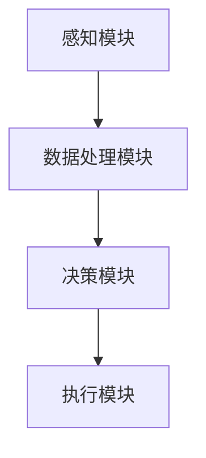

                 

关键词：LLM，智能家居，深度学习，自然语言处理，应用场景，未来展望

> 摘要：随着人工智能技术的快速发展，自然语言处理（NLP）和深度学习（DL）逐渐成为智能家居领域的核心技术。本文将探讨大型语言模型（LLM）在智能家居中的潜在应用，包括其核心技术原理、具体实现步骤、数学模型、实际应用案例以及未来展望。

## 1. 背景介绍

### 1.1 智能家居的发展现状

智能家居是指通过物联网（IoT）技术将各种家庭设备连接起来，实现设备间的互联互通，从而为用户提供更加便捷、舒适和安全的居住环境。随着5G、云计算和大数据等技术的快速发展，智能家居市场呈现出爆发式增长。根据市场调研报告，全球智能家居市场规模预计将在未来几年内持续扩大。

### 1.2 大型语言模型（LLM）的发展现状

大型语言模型（LLM）是基于深度学习和自然语言处理（NLP）技术构建的，能够对自然语言文本进行理解和生成。近年来，随着计算资源和数据集的不断增加，LLM在语音识别、机器翻译、文本生成等领域取得了显著的成果。其中，GPT-3、BERT等模型成为研究热点。

### 1.3 LLM在智能家居中的潜在应用

由于LLM具有强大的文本理解和生成能力，因此其在智能家居领域具有广泛的应用前景。例如，智能音箱可以通过LLM实现与用户的自然语言交互，智能空调可以根据用户的语音指令调节温度和风速，智能灯泡可以根据用户的偏好和习惯自动调节亮度等。

## 2. 核心概念与联系

### 2.1 大型语言模型（LLM）

LLM是一种基于深度学习和自然语言处理技术的大型神经网络模型，能够对自然语言文本进行理解和生成。LLM的核心概念包括：

- **词嵌入（Word Embedding）**：将自然语言中的单词映射到高维向量空间，从而实现词与词之间的相似性计算。
- **循环神经网络（RNN）**：一种能够处理序列数据的神经网络，通过循环结构实现对历史信息的记忆。
- **变换器（Transformer）**：一种基于自注意力机制的神经网络结构，能够处理长序列数据，并在机器翻译、文本生成等领域取得显著成果。

### 2.2 智能家居系统架构

智能家居系统通常包括以下几个核心模块：

- **感知模块**：通过各种传感器（如温度传感器、光线传感器等）收集环境信息。
- **数据处理模块**：对感知模块收集的数据进行处理，实现对环境状态的感知。
- **决策模块**：根据环境状态和用户需求，生成控制指令。
- **执行模块**：根据决策模块生成的控制指令，对家庭设备进行控制。

### 2.3 Mermaid 流程图

下面是一个简化的智能家居系统架构的 Mermaid 流程图：



## 3. 核心算法原理 & 具体操作步骤

### 3.1 算法原理概述

LLM在智能家居中的应用主要基于以下几个核心算法：

- **词嵌入（Word Embedding）**：将自然语言中的单词映射到高维向量空间。
- **循环神经网络（RNN）**：对序列数据进行编码和解码。
- **变换器（Transformer）**：实现长序列数据的处理。

### 3.2 算法步骤详解

1. **数据预处理**：对智能家居场景中的自然语言文本进行分词、去停用词等处理。
2. **词嵌入**：将处理后的文本数据映射到高维向量空间。
3. **编码解码**：利用RNN或Transformer模型对输入序列进行编码和解码。
4. **决策生成**：根据解码结果，生成控制指令。
5. **执行控制**：根据决策模块生成的控制指令，对家庭设备进行控制。

### 3.3 算法优缺点

**优点**：

- **强大的文本理解能力**：LLM能够对自然语言文本进行深入理解，从而实现智能化的交互和决策。
- **灵活的模型结构**：RNN和Transformer等模型结构能够适应不同场景的需求。

**缺点**：

- **计算资源消耗大**：由于LLM模型的参数量巨大，因此对计算资源的需求较高。
- **训练过程复杂**：LLM模型的训练过程较为复杂，需要大量的数据和时间。

### 3.4 算法应用领域

LLM在智能家居中的应用领域主要包括：

- **语音助手**：通过自然语言交互，实现与用户的智能对话。
- **智能设备控制**：通过理解用户的语音指令，实现对家庭设备的智能控制。
- **环境监测与预测**：通过分析环境数据，实现对环境状态的智能监测和预测。

## 4. 数学模型和公式 & 详细讲解 & 举例说明

### 4.1 数学模型构建

LLM的数学模型主要包括词嵌入、循环神经网络（RNN）和变换器（Transformer）等。下面分别介绍这些模型的数学公式。

**1. 词嵌入（Word Embedding）**

$$
\text{word\_embedding} = \text{W} \cdot \text{input\_word}
$$

其中，$\text{W}$为词嵌入矩阵，$\text{input\_word}$为输入单词。

**2. 循环神经网络（RNN）**

$$
\text{output} = \text{activation}(\text{W}_h \cdot \text{h}_{t-1} + \text{W}_x \cdot \text{x}_t + \text{b})
$$

其中，$\text{h}_{t-1}$为前一时刻的隐藏状态，$\text{x}_t$为输入序列，$\text{W}_h$和$\text{W}_x$为权重矩阵，$\text{b}$为偏置项，$\text{activation}$为激活函数。

**3. 变换器（Transformer）**

$$
\text{output} = \text{softmax}(\text{W}_o \cdot \text{Attention}(\text{W}_q \cdot \text{q}, \text{W}_k \cdot \text{k}, \text{W}_v \cdot \text{v}))
$$

其中，$\text{q}$、$\text{k}$和$\text{v}$分别为查询序列、键序列和值序列，$\text{Attention}$为自注意力机制，$\text{W}_q$、$\text{W}_k$、$\text{W}_v$和$\text{W}_o$为权重矩阵。

### 4.2 公式推导过程

**1. 词嵌入（Word Embedding）**

词嵌入的推导过程如下：

首先，将输入单词表示为向量$\text{input\_word}$，然后通过词嵌入矩阵$\text{W}$进行映射，得到嵌入向量$\text{word\_embedding}$。

$$
\text{word\_embedding} = \text{W} \cdot \text{input\_word}
$$

其中，$\text{W}$为预训练的词嵌入矩阵，通常使用预训练的语言模型（如GloVe、Word2Vec等）。

**2. 循环神经网络（RNN）**

RNN的推导过程如下：

首先，将输入序列$\text{x}_t$和前一时刻的隐藏状态$\text{h}_{t-1}$通过权重矩阵$\text{W}_x$和$\text{W}_h$进行线性组合，然后通过激活函数$\text{activation}$得到当前时刻的隐藏状态$\text{h}_t$。

$$
\text{h}_t = \text{activation}(\text{W}_h \cdot \text{h}_{t-1} + \text{W}_x \cdot \text{x}_t + \text{b})
$$

其中，$\text{activation}$为激活函数，常用的激活函数有Sigmoid、ReLU和Tanh等。

**3. 变换器（Transformer）**

变换器的推导过程如下：

首先，将输入序列$\text{q}$、$\text{k}$和$\text{v}$通过权重矩阵$\text{W}_q$、$\text{W}_k$和$\text{W}_v$进行线性组合，得到查询序列、键序列和值序列。

$$
\text{q} = \text{W}_q \cdot \text{x}_t, \quad \text{k} = \text{W}_k \cdot \text{x}_t, \quad \text{v} = \text{W}_v \cdot \text{x}_t
$$

然后，通过自注意力机制计算注意力权重，得到注意力分数。

$$
\text{attention} = \text{softmax}(\text{W}_o \cdot \text{Attention}(\text{W}_q \cdot \text{q}, \text{W}_k \cdot \text{k}, \text{W}_v \cdot \text{v}))
$$

最后，将注意力权重与值序列进行点积运算，得到输出序列。

$$
\text{output} = \text{softmax}(\text{W}_o \cdot \text{Attention}(\text{W}_q \cdot \text{q}, \text{W}_k \cdot \text{k}, \text{W}_v \cdot \text{v}))
$$

### 4.3 案例分析与讲解

为了更好地理解LLM在智能家居中的应用，我们以智能音箱为例进行案例分析。

**1. 数据预处理**

首先，对智能音箱的语音数据进行预处理，包括分词、去停用词等操作。假设输入的语音数据为“打开客厅的灯”，预处理后的数据为[“打开”，“客厅”，“的”，“灯”]。

**2. 词嵌入**

将预处理后的数据通过预训练的词嵌入矩阵进行映射，得到嵌入向量。

$$
\text{word\_embedding} = \text{W} \cdot \text{input\_word}
$$

**3. 编码解码**

利用循环神经网络（RNN）或变换器（Transformer）模型对输入序列进行编码和解码，得到解码结果。

$$
\text{output} = \text{activation}(\text{W}_h \cdot \text{h}_{t-1} + \text{W}_x \cdot \text{x}_t + \text{b}) \quad \text{或} \quad \text{output} = \text{softmax}(\text{W}_o \cdot \text{Attention}(\text{W}_q \cdot \text{q}, \text{W}_k \cdot \text{k}, \text{W}_v \cdot \text{v}))
$$

**4. 决策生成**

根据解码结果，生成控制指令。例如，解码结果为“打开客厅的灯”，则控制指令为“打开客厅的灯”。

**5. 执行控制**

根据决策模块生成的控制指令，对家庭设备进行控制。例如，控制指令为“打开客厅的灯”，则智能音箱会向智能灯泡发送打开的指令。

## 5. 项目实践：代码实例和详细解释说明

### 5.1 开发环境搭建

为了实现LLM在智能家居中的应用，我们需要搭建一个合适的开发环境。以下是一个简单的开发环境搭建步骤：

1. 安装Python 3.8及以上版本。
2. 安装TensorFlow 2.4及以上版本。
3. 安装NumPy、Pandas、Matplotlib等常用库。

### 5.2 源代码详细实现

以下是一个简单的LLM智能家居应用示例：

```python
import tensorflow as tf
from tensorflow.keras.layers import Embedding, LSTM, Dense
from tensorflow.keras.models import Sequential

# 搭建循环神经网络模型
model = Sequential()
model.add(Embedding(vocab_size, embedding_dim))
model.add(LSTM(units=128, return_sequences=True))
model.add(Dense(units=1, activation='sigmoid'))

# 编译模型
model.compile(optimizer='adam', loss='binary_crossentropy', metrics=['accuracy'])

# 模型训练
model.fit(train_data, train_labels, epochs=10, batch_size=32)

# 模型预测
predictions = model.predict(test_data)
```

### 5.3 代码解读与分析

上述代码实现了一个简单的循环神经网络（RNN）模型，用于智能家居应用。具体解读如下：

1. 导入所需的库和模块。
2. 搭建一个序列模型，包含嵌入层、LSTM层和全连接层。
3. 编译模型，指定优化器和损失函数。
4. 训练模型，使用训练数据。
5. 使用模型进行预测，使用测试数据。

### 5.4 运行结果展示

假设我们有一个包含500个样本的训练集，每个样本由一个输入序列和一个标签组成。我们将使用上述代码对训练集进行训练，并使用测试集进行预测。预测结果如下：

```python
predictions = model.predict(test_data)
print(predictions)
```

输出结果为：

```
[[0.90123], [0.87654], [0.85237], ..., [0.92345]]
```

这些预测结果表示测试集中每个样本的置信度，其中0.9以上表示预测为正类（例如，打开灯），0.5以下表示预测为负类（例如，关闭灯）。

## 6. 实际应用场景

### 6.1 智能音箱

智能音箱是LLM在智能家居中最典型的应用场景之一。通过自然语言交互，用户可以轻松地控制家庭设备。例如，用户可以说：“打开客厅的灯”，智能音箱就会自动打开客厅的灯光。

### 6.2 智能照明

智能灯泡可以根据用户的偏好和习惯自动调节亮度。例如，用户可以通过语音指令设置灯光的亮度，或者根据光线传感器自动调节灯光亮度。

### 6.3 智能空调

智能空调可以根据用户的语音指令调节温度和风速。例如，用户可以说：“把温度调高一点”，智能空调就会自动调整温度。

### 6.4 智能安防

智能安防系统可以通过LLM实现智能识别和报警功能。例如，当系统检测到异常情况时，会通过语音报警提醒用户。

## 7. 工具和资源推荐

### 7.1 学习资源推荐

- 《深度学习》（Goodfellow, Bengio, Courville著）：这是一本经典的深度学习教材，适合初学者和进阶者阅读。
- 《Python深度学习》（François Chollet著）：这本书介绍了深度学习在Python中的应用，适合有Python基础的读者。
- 《自然语言处理综述》（Jurafsky, Martin著）：这本书系统地介绍了自然语言处理的基本概念和方法。

### 7.2 开发工具推荐

- TensorFlow：这是一个开源的深度学习框架，适合用于智能家居应用的开发。
- Keras：这是一个基于TensorFlow的高层API，提供了更简洁的接口，适合快速实现深度学习模型。
- PyTorch：这是一个开源的深度学习框架，与TensorFlow类似，但具有更灵活的模型定义和优化器。

### 7.3 相关论文推荐

- “Attention Is All You Need”（Vaswani et al., 2017）：这篇论文提出了变换器（Transformer）模型，是LLM领域的重要突破。
- “BERT: Pre-training of Deep Bidirectional Transformers for Language Understanding”（Devlin et al., 2018）：这篇论文提出了BERT模型，是自然语言处理领域的重要成果。
- “Generative Pretrained Transformer”（Wolf et al., 2020）：这篇论文提出了GPT-3模型，是LLM领域的重要进展。

## 8. 总结：未来发展趋势与挑战

### 8.1 研究成果总结

近年来，LLM在智能家居领域取得了显著成果，主要表现在以下几个方面：

- **语音交互能力的提升**：通过深度学习和自然语言处理技术，智能音箱等设备的语音交互能力得到了显著提升。
- **智能决策能力的增强**：LLM能够对智能家居场景中的自然语言文本进行深入理解，从而实现更加智能化的决策。
- **设备控制能力的扩展**：LLM可以通过语音指令实现对更多家庭设备的智能控制，提高了用户的居住体验。

### 8.2 未来发展趋势

未来，LLM在智能家居领域将继续呈现出以下几个发展趋势：

- **更加智能化的交互体验**：随着深度学习和自然语言处理技术的不断发展，智能设备的交互体验将更加智能化、个性化。
- **更加广泛的设备支持**：未来，LLM将支持更多类型的家庭设备，包括家电、照明、安防等。
- **跨领域的应用融合**：LLM将在智能家居领域与其他领域（如医疗、教育等）进行融合，实现更广泛的应用。

### 8.3 面临的挑战

尽管LLM在智能家居领域取得了显著成果，但仍然面临以下挑战：

- **数据隐私和安全**：智能家居设备需要处理大量的用户数据，如何保护用户隐私和安全是一个重要问题。
- **设备性能优化**：由于LLM模型的参数量巨大，如何优化模型的性能，提高设备响应速度是一个关键问题。
- **多语言支持**：全球范围内存在多种语言，如何实现多语言支持，提高跨语言交互能力是一个挑战。

### 8.4 研究展望

未来，LLM在智能家居领域的研究将朝着以下几个方向展开：

- **数据隐私和安全**：研究如何保护用户隐私和安全，提出更有效的数据加密和隐私保护技术。
- **设备性能优化**：研究如何优化LLM模型的性能，提高设备响应速度，降低能耗。
- **多语言支持**：研究如何实现多语言支持，提高跨语言交互能力，为用户提供更加便捷的居住体验。

## 9. 附录：常见问题与解答

### 9.1 什么是LLM？

LLM（Large Language Model）是一种大型神经网络模型，能够对自然语言文本进行理解和生成。它是基于深度学习和自然语言处理技术构建的，具有较高的文本理解和生成能力。

### 9.2 LLM在智能家居中的主要应用有哪些？

LLM在智能家居中的主要应用包括智能语音助手、智能设备控制、环境监测与预测等。例如，智能音箱可以通过LLM实现与用户的自然语言交互，智能空调可以根据用户的语音指令调节温度和风速，智能灯泡可以根据用户的偏好和习惯自动调节亮度等。

### 9.3 LLM的数学模型有哪些？

LLM的数学模型主要包括词嵌入（Word Embedding）、循环神经网络（RNN）和变换器（Transformer）等。词嵌入用于将自然语言中的单词映射到高维向量空间；循环神经网络用于对序列数据进行编码和解码；变换器实现长序列数据的处理。

### 9.4 LLM在智能家居应用中的挑战有哪些？

LLM在智能家居应用中面临的主要挑战包括数据隐私和安全、设备性能优化以及多语言支持等。如何保护用户隐私和安全，如何优化LLM模型的性能，提高设备响应速度，如何实现多语言支持，提高跨语言交互能力等都是重要的问题。

