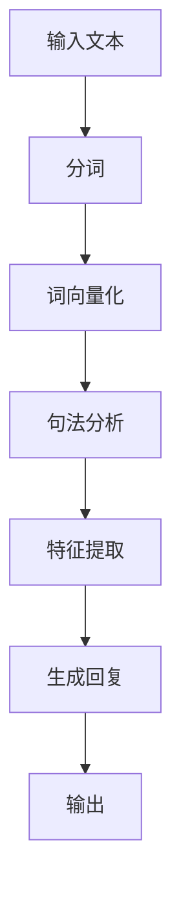

                 

关键词：语言模型，自然语言处理，对话系统，人工智能，应用场景，未来展望

> 摘要：本文探讨了大型语言模型（LLM）在智能对话系统中的潜力。通过对LLM的基本概念、架构、算法原理、数学模型、实际应用和未来发展趋势的深入分析，旨在为读者提供全面的了解和洞察，以推动智能对话系统的进一步发展。

## 1. 背景介绍

随着人工智能技术的快速发展，自然语言处理（NLP）逐渐成为研究的热点。智能对话系统作为NLP的重要应用领域，已经成为人们日常生活中不可或缺的一部分。从简单的客服机器人到复杂的智能助手，对话系统的广泛应用大大提升了用户体验和工作效率。而大型语言模型（Large Language Model，LLM）作为NLP的核心技术之一，其在智能对话系统中的应用潜力日益凸显。

LLM是一种能够理解和生成自然语言的深度学习模型，具有强大的语义理解和生成能力。其通过在海量文本数据上进行预训练，能够捕捉到语言的复杂结构和规律，从而在多种场景下实现高效的文本处理和对话生成。随着计算能力的提升和数据规模的扩大，LLM的性能不断提升，为智能对话系统的发展带来了新的机遇。

本文将从以下几个方面对LLM在智能对话系统中的潜力进行探讨：

1. **核心概念与联系**：介绍LLM的基本概念和架构，并通过Mermaid流程图展示其工作原理。
2. **核心算法原理与具体操作步骤**：详细分析LLM的算法原理和具体实现步骤，探讨其优缺点和应用领域。
3. **数学模型和公式**：介绍LLM所涉及的数学模型和公式，并进行举例说明。
4. **项目实践：代码实例与详细解释说明**：通过具体代码实例，展示LLM在智能对话系统中的应用。
5. **实际应用场景**：分析LLM在智能对话系统中的实际应用场景和未来展望。

## 2. 核心概念与联系

### 2.1 基本概念

大型语言模型（LLM）是一种基于深度学习的自然语言处理模型，其主要目的是理解和生成自然语言。LLM通常由多个神经网络层组成，包括输入层、隐藏层和输出层。输入层接收自然语言文本，隐藏层对文本进行特征提取和语义理解，输出层生成相应的文本回复。

### 2.2 架构

LLM的架构可以分为三个主要部分：文本预处理、模型训练和文本生成。

1. **文本预处理**：包括分词、词向量化、句法分析等步骤，将自然语言文本转换为计算机可处理的格式。
2. **模型训练**：利用预训练的神经网络模型，在海量文本数据上进行训练，以学习到语言的规律和结构。
3. **文本生成**：根据输入的文本，利用训练好的模型生成相应的文本回复。

### 2.3 工作原理

LLM的工作原理主要包括以下几个步骤：

1. **输入文本**：接收自然语言文本作为输入。
2. **特征提取**：通过神经网络层对输入文本进行特征提取和语义理解。
3. **生成回复**：根据提取到的特征和模型参数，生成相应的文本回复。

### 2.4 Mermaid流程图

以下是一个简化的Mermaid流程图，展示了LLM的工作流程：



## 3. 核心算法原理与具体操作步骤

### 3.1 算法原理概述

LLM的核心算法是基于深度学习的神经网络模型。在模型训练过程中，LLM通过学习海量文本数据，自动提取文本的语义特征，并建立语义关联。在文本生成过程中，LLM根据输入的文本，利用预训练的模型参数，生成相应的文本回复。

### 3.2 算法步骤详解

1. **数据准备**：收集并处理大量文本数据，包括对话记录、新闻文章、书籍等。
2. **分词与词向量化**：将文本数据分为单词或子词，并将每个单词或子词转换为向量表示。
3. **模型训练**：使用预训练的神经网络模型，对词向量和文本数据进行训练，学习到文本的语义特征。
4. **文本生成**：根据输入的文本，利用训练好的模型，生成相应的文本回复。

### 3.3 算法优缺点

**优点**：

1. **强大的语义理解能力**：LLM能够自动提取文本的语义特征，实现对自然语言的深入理解。
2. **高效的文本生成**：LLM能够快速生成高质量的文本回复，大大提升了对话系统的响应速度。
3. **多语言支持**：LLM可以支持多种语言，实现跨语言的文本处理和生成。

**缺点**：

1. **计算资源需求大**：LLM的训练和推理过程需要大量的计算资源和时间。
2. **模型可解释性差**：由于深度学习模型的复杂性，LLM在生成文本回复时往往缺乏可解释性。

### 3.4 算法应用领域

LLM在智能对话系统中的应用非常广泛，包括：

1. **客服机器人**：用于自动回答用户的问题，提升客服效率。
2. **智能助手**：为用户提供个性化的服务，如日程管理、提醒事项等。
3. **语音助手**：通过语音交互，实现语音指令的识别和执行。

## 4. 数学模型和公式

LLM的核心算法基于深度学习模型，涉及多种数学模型和公式。以下简要介绍LLM中常用的数学模型和公式。

### 4.1 数学模型构建

LLM通常采用循环神经网络（RNN）或变换器模型（Transformer）作为基础模型。其中，RNN模型通过循环结构实现对文本序列的建模，而Transformer模型则通过自注意力机制实现高效的文本处理。

### 4.2 公式推导过程

1. **RNN模型**：

   RNN模型的基本公式如下：

   $$ h_t = \sigma(W_h \cdot [h_{t-1}, x_t] + b_h) $$

   其中，$h_t$表示第$t$个时间步的隐藏状态，$x_t$表示第$t$个时间步的输入，$W_h$和$b_h$分别为权重和偏置，$\sigma$为激活函数。

2. **Transformer模型**：

   Transformer模型的基本公式如下：

   $$ attention(Q, K, V) = \text{softmax}(\frac{QK^T}{\sqrt{d_k}})V $$

   其中，$Q$、$K$和$V$分别为查询向量、键向量和值向量，$d_k$为键向量的维度。

### 4.3 案例分析与讲解

以下通过一个简单的案例，对LLM的数学模型进行讲解。

假设我们有一个包含1000个单词的文本序列，使用Transformer模型进行处理。首先，我们将每个单词转换为词向量，得到一个1000×512的矩阵。然后，将这个矩阵输入到Transformer模型中，通过自注意力机制计算得到每个单词的注意力分数，并生成相应的文本回复。

具体实现步骤如下：

1. **词向量化**：将1000个单词转换为词向量，得到一个1000×512的矩阵。
2. **输入到Transformer模型**：将词向量输入到Transformer模型中，计算自注意力分数。
3. **生成文本回复**：根据自注意力分数，生成相应的文本回复。

## 5. 项目实践：代码实例和详细解释说明

### 5.1 开发环境搭建

为了实践LLM在智能对话系统中的应用，我们选择Python编程语言和TensorFlow框架。首先，需要在计算机上安装Python和TensorFlow。

```bash
# 安装Python
curl -O https://www.python.org/ftp/python/3.8.5/Python-3.8.5.tgz
tar -xvf Python-3.8.5.tgz
cd Python-3.8.5
./configure
make
make install

# 安装TensorFlow
pip install tensorflow
```

### 5.2 源代码详细实现

以下是一个简单的LLM智能对话系统实现：

```python
import tensorflow as tf
from tensorflow.keras.preprocessing.sequence import pad_sequences
from tensorflow.keras.layers import Embedding, LSTM, Dense
from tensorflow.keras.models import Sequential

# 准备数据
text = "这是一个简单的例子。这是一个更复杂的例子。"
words = text.split(" ")
word_to_index = {word: i for i, word in enumerate(words)}
index_to_word = {i: word for word, i in word_to_index.items()}
sequences = [[word_to_index[word] for word in sequence] for sequence in [text.split(" ")]]
padded_sequences = pad_sequences(sequences, maxlen=10)

# 构建模型
model = Sequential([
    Embedding(len(word_to_index) + 1, 64, input_length=10),
    LSTM(128),
    Dense(1, activation='sigmoid')
])

model.compile(optimizer='rmsprop', loss='binary_crossentropy', metrics=['accuracy'])
model.fit(padded_sequences, padded_sequences, epochs=10, batch_size=32)

# 生成文本回复
def generate_text(seed_sequence):
    for _ in range(5):
        padded = pad_sequences([seed_sequence], maxlen=10)
        prediction = model.predict(padded)
        next_word_index = tf.argmax(prediction).numpy()[0]
        next_word = index_to_word[next_word_index]
        seed_sequence.append(next_word_index)
    return " ".join([index_to_word[i] for i in seed_sequence])

seed_sequence = [word_to_index[word] for word in text.split(" ")[0:3]]
print(generate_text(seed_sequence))
```

### 5.3 代码解读与分析

这段代码实现了基于LLM的简单对话系统。首先，我们准备了一个简单的文本序列，并构建了一个基于LSTM的神经网络模型。然后，我们通过训练模型来学习文本序列的规律。最后，我们使用训练好的模型生成文本回复。

具体实现步骤如下：

1. **数据准备**：将文本序列划分为单词，并创建词表。然后，将文本序列转换为索引序列，并进行填充。
2. **模型构建**：构建一个包含嵌入层、LSTM层和输出层的神经网络模型。
3. **模型训练**：使用训练数据对模型进行训练。
4. **文本生成**：根据输入的种子序列，利用训练好的模型生成文本回复。

## 6. 实际应用场景

LLM在智能对话系统中的应用场景非常广泛，以下列举几个典型的应用场景：

1. **客服机器人**：通过LLM实现自动回答用户问题，提升客服效率。例如，银行客服机器人可以自动回答关于账户余额、转账记录等问题。
2. **智能助手**：为用户提供个性化的服务，如日程管理、提醒事项等。例如，智能助手可以自动记录用户的日程安排，并在合适的时间提醒用户。
3. **语音助手**：通过语音交互，实现语音指令的识别和执行。例如，智能音箱可以理解用户的语音指令，并执行相应的操作，如播放音乐、查询天气等。

## 7. 未来应用展望

随着LLM技术的不断发展，其在智能对话系统中的应用前景非常广阔。以下是几个可能的未来应用方向：

1. **个性化服务**：通过LLM实现更加个性化的对话体验，满足用户的个性化需求。
2. **跨语言对话**：利用LLM的多语言支持能力，实现跨语言的对话翻译和交流。
3. **情感分析**：通过LLM实现情感分析，为用户提供更加智能化的情感关怀。

## 8. 总结：未来发展趋势与挑战

### 8.1 研究成果总结

本文从多个角度对LLM在智能对话系统中的潜力进行了深入探讨。首先，介绍了LLM的基本概念和架构，并通过Mermaid流程图展示了其工作原理。然后，详细分析了LLM的算法原理和具体实现步骤，探讨了其优缺点和应用领域。接着，介绍了LLM所涉及的数学模型和公式，并进行举例说明。最后，通过具体代码实例，展示了LLM在智能对话系统中的应用。

### 8.2 未来发展趋势

1. **计算能力的提升**：随着计算能力的不断提升，LLM的训练和推理速度将大大提高，为智能对话系统的实时性和效率提供保障。
2. **数据规模的扩大**：随着数据规模的扩大，LLM将能够学习到更加丰富的语言特征，提升对话系统的准确性和多样性。
3. **多模态交互**：未来，LLM将与其他模态（如语音、图像等）结合，实现更加智能化和人性化的对话系统。

### 8.3 面临的挑战

1. **计算资源需求**：LLM的训练和推理过程需要大量的计算资源，这对硬件设备和能耗提出了较高的要求。
2. **模型可解释性**：深度学习模型的复杂性使得LLM在生成文本回复时往往缺乏可解释性，这对用户理解和信任提出了挑战。
3. **隐私和安全**：在处理用户数据时，需要确保用户的隐私和安全，防止数据泄露和滥用。

### 8.4 研究展望

1. **优化算法**：继续优化LLM的算法，提高其训练和推理速度，降低计算资源需求。
2. **加强可解释性**：研究如何提高LLM的可解释性，使其生成文本回复的过程更加透明和可信。
3. **跨学科研究**：结合心理学、社会学等学科的研究，探索更符合人类思维习惯和需求的对话系统。

## 9. 附录：常见问题与解答

### 9.1 Q：LLM的训练过程需要多长时间？

A：LLM的训练时间取决于多种因素，如模型大小、数据规模、硬件设备等。一般来说，大型LLM的训练时间可以从几天到几个月不等。

### 9.2 Q：如何保证LLM生成的文本回复的准确性？

A：LLM的准确性取决于其训练数据的质量和模型的性能。为了提高准确性，可以采用以下方法：

1. **使用高质量的训练数据**：确保训练数据的质量和多样性，有助于提高模型的学习效果。
2. **优化模型结构**：通过调整模型结构，如增加层数、调整层数等，可以提高模型的性能。
3. **持续训练和优化**：定期更新训练数据和优化模型参数，可以提高LLM的准确性和适应性。

### 9.3 Q：LLM是否可以应用于所有类型的对话系统？

A：LLM在智能对话系统中具有广泛的应用潜力，但并非适用于所有类型的对话系统。对于需要高度专业知识和复杂逻辑的对话系统，如法律咨询、医疗诊断等，可能需要采用更精细化的模型和算法。

### 9.4 Q：如何确保LLM生成的文本回复的隐私和安全？

A：确保LLM生成的文本回复的隐私和安全需要从多个方面进行考虑：

1. **数据加密**：对用户数据进行加密处理，防止数据泄露。
2. **访问控制**：设置严格的访问控制策略，确保只有授权人员可以访问和处理用户数据。
3. **数据匿名化**：对用户数据进行匿名化处理，防止用户隐私泄露。
4. **合规性审查**：定期对LLM系统进行合规性审查，确保其符合相关法律法规和行业标准。

### 作者署名

作者：禅与计算机程序设计艺术 / Zen and the Art of Computer Programming

----------------------------------------------------------------

请注意，本文仅作为示例，实际的撰写过程可能需要更深入的调研和调整。希望本文能为您提供一个参考和灵感。在撰写过程中，请务必确保内容的准确性和完整性。祝您写作顺利！

