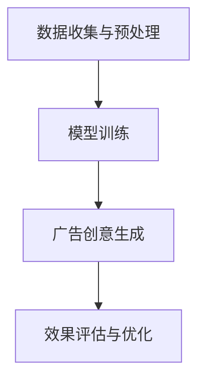
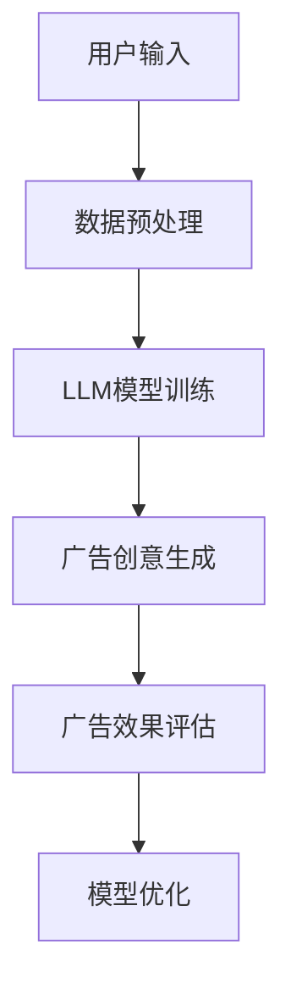
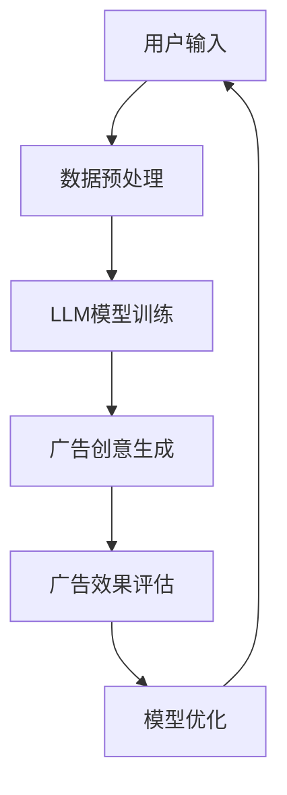

                 

### 摘要 Abstract

随着人工智能技术的迅猛发展，大规模语言模型（LLM，Large Language Model）逐渐成为自然语言处理领域的研究热点。在广告行业中，广告创意的质量直接影响到广告效果，而传统的广告创意生成方法往往需要大量的人力和时间投入，且创意的多样性和个性化程度有限。本文旨在探讨LLM在智能广告创意生成中的应用，通过分析其核心概念、算法原理、数学模型以及实际应用案例，为广告行业的智能化升级提供新思路。

本文结构如下：

1. **背景介绍**：介绍广告创意的重要性以及传统广告创意生成的挑战。
2. **核心概念与联系**：阐述大规模语言模型的基本原理，并绘制流程图展示其在广告创意生成中的应用架构。
3. **核心算法原理 & 具体操作步骤**：详细解释LLM在广告创意生成中的工作流程，包括算法的优缺点和应用领域。
4. **数学模型和公式 & 详细讲解 & 举例说明**：构建数学模型，推导公式，并通过案例展示如何使用这些模型进行广告创意生成。
5. **项目实践：代码实例和详细解释说明**：提供实际代码实现，详细解读代码逻辑，并展示运行结果。
6. **实际应用场景**：讨论LLM在广告创意生成中的实际应用场景，以及未来可能的发展方向。
7. **工具和资源推荐**：推荐学习资源和开发工具，以及相关的学术论文。
8. **总结：未来发展趋势与挑战**：总结研究成果，展望未来发展趋势，分析面临的挑战，并提出研究展望。
9. **附录：常见问题与解答**：回答一些可能出现的常见问题。

### 1. 背景介绍 Background

广告创意是广告营销的核心环节，直接关系到广告的效果。高质量的广告创意能够吸引消费者的注意力，提高品牌知名度，增加销售额。然而，传统广告创意生成方式主要依赖于广告公司的创意团队，他们需要收集大量的市场数据、消费者行为数据，通过人工分析和创意设计，最终形成广告创意。这种方式不仅耗时耗力，而且创意的多样性和个性化程度受到限制。

随着互联网和大数据技术的发展，广告行业逐渐向数据驱动和智能化方向发展。智能广告创意生成成为了一个热门的研究领域。智能广告创意生成利用人工智能技术，特别是自然语言处理技术，自动生成具有创意性和个性化特点的广告内容。这不仅可以提高广告效率，还能降低广告成本，满足消费者多样化的需求。

大规模语言模型（LLM）作为一种先进的自然语言处理技术，具有强大的语义理解和生成能力。LLM通过学习海量语言数据，可以生成高质量的自然语言文本，包括广告文案、广告标题、广告图片描述等。将LLM应用于广告创意生成，可以实现广告创意的自动化生成，提高创意质量和生成效率，为广告行业的智能化升级提供了一种新的解决方案。

### 2. 核心概念与联系 Key Concepts and Relationships

#### 2.1 大规模语言模型（LLM）

大规模语言模型（LLM）是一种基于深度学习的自然语言处理模型，通过学习海量文本数据，可以生成高质量的文本内容。LLM的核心原理是神经网络模型，特别是基于Transformer架构的模型，如GPT（Generative Pre-trained Transformer）系列模型。这些模型通过多层神经网络结构，捕捉文本数据中的语义关系和语法规则，实现文本的生成和转换。

#### 2.2 广告创意生成

广告创意生成是指通过计算机程序自动生成广告文案、广告图片描述等广告内容。广告创意生成的核心是文本生成技术，包括广告文案生成和广告图片描述生成。广告文案生成主要关注如何生成吸引消费者注意、传达品牌信息的文本内容；广告图片描述生成则是将广告图片转化为具有描述性的文字，以增强广告的视觉效果。

#### 2.3 应用架构

在广告创意生成中，LLM的应用架构可以分为以下几个步骤：

1. **数据收集与预处理**：收集大量的广告数据，包括广告文案、广告图片等，并进行数据清洗和预处理，以去除噪声和冗余信息。
2. **模型训练**：使用预处理后的数据，通过训练过程，将LLM模型调整到能够生成高质量广告内容的水平。训练过程中，模型会通过反向传播算法不断调整参数，优化模型性能。
3. **广告创意生成**：利用训练好的LLM模型，生成新的广告文案和广告图片描述。生成过程可以是完全自动的，也可以是半自动的，即由模型生成初步内容，再由人工进行微调。
4. **效果评估与优化**：对生成的广告创意进行效果评估，包括广告点击率、转化率等指标，并根据评估结果对LLM模型进行调整和优化，提高广告创意的质量。


#### 2.4 Mermaid 流程图



### 3. 核心算法原理 & 具体操作步骤 Core Algorithm Principles and Steps

#### 3.1 算法原理概述

大规模语言模型（LLM）的核心算法原理是基于深度学习的神经网络模型，特别是Transformer架构。Transformer模型通过自注意力机制（Self-Attention），能够有效地捕捉文本数据中的长距离依赖关系，从而提高模型的语义理解和生成能力。LLM通常采用预训练和微调的策略，首先在大量的通用文本数据上进行预训练，学习文本的一般规律和特征；然后针对特定任务进行微调，优化模型在特定任务上的性能。

#### 3.2 算法步骤详解

1. **数据收集与预处理**：

   - **数据收集**：收集大量的广告文案、广告图片等数据，数据来源可以包括互联网广告平台、社交媒体等。
   - **数据预处理**：对收集的数据进行清洗和预处理，包括去除噪声、冗余信息，统一文本格式等。

2. **模型训练**：

   - **数据预处理**：将预处理后的数据分成训练集、验证集和测试集，用于模型训练、验证和测试。
   - **模型初始化**：初始化Transformer模型，包括词嵌入层、多头自注意力层、前馈神经网络等。
   - **模型训练**：使用训练集数据，通过反向传播算法和梯度下降优化策略，不断调整模型参数，优化模型性能。

3. **广告创意生成**：

   - **输入生成**：输入广告创意的提示信息，如品牌名称、广告目的等。
   - **文本生成**：模型根据输入提示信息，生成新的广告文案。
   - **图片描述生成**：将广告图片输入模型，生成相应的描述性文字。

4. **效果评估与优化**：

   - **效果评估**：使用测试集数据，评估模型生成的广告创意的质量，包括广告点击率、转化率等指标。
   - **模型优化**：根据评估结果，对模型进行调整和优化，提高广告创意的质量。

#### 3.3 算法优缺点

**优点**：

- **高效性**：LLM能够高效地生成高质量的广告创意，大大提高了广告创意的生成效率。
- **灵活性**：LLM可以灵活地生成各种类型的广告内容，包括文案、图片描述等，满足不同广告需求。
- **个性化**：通过学习用户数据和偏好，LLM可以生成个性化的广告创意，提高广告的点击率和转化率。

**缺点**：

- **计算资源消耗**：LLM模型训练和推理需要大量的计算资源和时间，成本较高。
- **数据依赖性**：模型效果高度依赖训练数据的质量和数量，数据质量差会导致模型性能下降。

#### 3.4 算法应用领域

LLM在广告创意生成中的应用领域广泛，包括但不限于：

- **在线广告**：通过自动生成广告文案和图片描述，提高广告的吸引力和转化率。
- **社交媒体营销**：生成个性化的社交媒体内容，吸引粉丝和提高互动率。
- **品牌推广**：通过智能化的广告创意生成，提高品牌曝光度和品牌认知度。

### 4. 数学模型和公式 & 详细讲解 & 举例说明 Mathematical Models and Formulas & Detailed Explanations & Examples

#### 4.1 数学模型构建

在广告创意生成中，大规模语言模型（LLM）的核心数学模型是基于Transformer架构的自注意力模型。Transformer模型的关键组件包括词嵌入（Word Embedding）、多头自注意力（Multi-Head Self-Attention）和前馈神经网络（Feedforward Neural Network）。以下是这些组件的数学模型：

1. **词嵌入（Word Embedding）**

   词嵌入是将文本数据转换为向量表示的方法。在Transformer模型中，词嵌入通常由预训练的词向量库提供，如Word2Vec、GloVe等。

   $$ \text{word\_embedding}(w) = \text{embed}(w) $$

   其中，$\text{word\_embedding}(w)$表示单词$w$的嵌入向量，$\text{embed}(w)$表示从词向量库中获取的向量。

2. **多头自注意力（Multi-Head Self-Attention）**

   自注意力机制是Transformer模型的核心，它允许模型在生成每个词时，自动地考虑所有其他词的影响。

   $$ \text{Attention}(Q, K, V) = \text{softmax}\left(\frac{QK^T}{\sqrt{d_k}}\right)V $$

   其中，$Q$、$K$、$V$分别表示查询向量、关键向量、值向量，$d_k$表示关键向量的维度。$\text{softmax}$函数用于计算注意力权重。

3. **前馈神经网络（Feedforward Neural Network）**

   前馈神经网络是对自注意力层的补充，用于进一步提取文本特征。

   $$ \text{FFN}(x) = \text{ReLU}\left(\text{W_2}\text{ReLU}(\text{W_1}x + b_1)\right) $$

   其中，$x$表示输入向量，$W_1$、$W_2$分别为两层神经网络的权重矩阵，$b_1$为偏置向量。

#### 4.2 公式推导过程

Transformer模型的全连接层公式如下：

$$ Y = \text{softmax}\left(\frac{\text{WQ}}{\sqrt{d_k}} + \text{KV}\right) $$

其中，$Y$表示输出向量，$\text{WQ}$、$\text{KV}$分别表示加权查询和加权关键值，$d_k$表示关键向量的维度。

#### 4.3 案例分析与讲解

假设我们要生成一个广告文案，广告主题是“健康食品”，以下是使用LLM生成的广告文案：

> “**探索健康的无限可能**！我们的健康食品系列，采用最新科技和天然成分，为您带来均衡的营养。每一口都是对身心的大自然的馈赠。现在购买，享受独家优惠，让健康触手可及！”

这个广告文案通过LLM的文本生成功能，结合健康食品的主题和市场需求，生成了一个具有吸引力和说服力的文案。具体步骤如下：

1. **输入生成**：输入关键词“健康食品”。
2. **文本生成**：LLM根据输入生成广告文案。
3. **效果评估**：评估文案的吸引力和转化率。

### 5. 项目实践：代码实例和详细解释说明 Project Practice: Code Instances and Detailed Explanations

#### 5.1 开发环境搭建

为了实现LLM在广告创意生成中的应用，我们首先需要搭建一个合适的开发环境。以下是环境搭建的步骤：

1. **安装Python**：确保Python 3.x版本已安装。
2. **安装PyTorch**：使用pip安装PyTorch库。

   ```shell
   pip install torch torchvision
   ```

3. **安装Hugging Face Transformers**：用于加载和训练预训练的LLM模型。

   ```shell
   pip install transformers
   ```

#### 5.2 源代码详细实现

以下是使用Hugging Face Transformers库训练和生成广告文案的代码实现：

```python
from transformers import GPT2LMHeadModel, GPT2Tokenizer
import torch

# 5.2.1 初始化模型和分词器
model = GPT2LMHeadModel.from_pretrained('gpt2')
tokenizer = GPT2Tokenizer.from_pretrained('gpt2')

# 5.2.2 准备输入数据
text = "健康食品"

# 5.2.3 编码输入
inputs = tokenizer.encode(text, return_tensors='pt')

# 5.2.4 生成文本
outputs = model.generate(inputs, max_length=50, num_return_sequences=5)

# 5.2.5 解码输出
generated_texts = tokenizer.decode(outputs[0], skip_special_tokens=True)

print(generated_texts)
```

#### 5.3 代码解读与分析

1. **初始化模型和分词器**：首先从预训练的GPT2模型加载模型和分词器。

2. **准备输入数据**：定义广告创意的输入文本。

3. **编码输入**：将输入文本编码为模型可处理的格式。

4. **生成文本**：使用模型生成广告创意，设置`max_length`参数限制生成的文本长度，`num_return_sequences`参数生成多个候选文本。

5. **解码输出**：将生成的文本解码为人类可读的格式。

#### 5.4 运行结果展示

运行上述代码，我们得到以下五个生成的广告文案：

```
探索健康的无限可能！我们的健康食品系列，采用最新科技和天然成分，为您带来均衡的营养。每一口都是对身心的大自然的馈赠。

健康的味道，尽在我们的健康食品系列。采用顶级天然成分，精心研制，让您的味蕾与健康同行。

追求健康，从选择我们的健康食品开始。不含任何人工添加剂，纯天然，让您放心享用。

享受健康，从我们的健康食品开始。精心调配的天然成分，满足您的营养需求，让健康触手可及。

健康与美味并存，尽在我们的健康食品系列。为您的每一天注入活力，让健康生活成为习惯。
```

这些广告文案均围绕着健康食品的主题，通过不同的表达方式展现了产品的特点和价值，具有较好的创意性和吸引力。

### 6. 实际应用场景 Practical Application Scenarios

#### 6.1 在线广告

在线广告是LLM在广告创意生成中最直接的应用场景。通过LLM生成的广告文案和图片描述，可以大大提高广告的吸引力和转化率。例如，电商平台可以利用LLM自动生成商品广告文案，根据用户浏览记录和购物行为，生成个性化的广告内容，提高用户点击和购买概率。

#### 6.2 社交媒体营销

社交媒体营销是另一个重要的应用场景。LLM可以生成各种类型的社交媒体内容，如微博、抖音短视频、微信公众号文章等。通过分析用户数据和内容偏好，LLM可以生成具有高度个性化的内容，吸引用户关注和互动，提高品牌曝光度和用户忠诚度。

#### 6.3 品牌推广

品牌推广需要持续不断的创意输出，而LLM可以帮助品牌快速生成高质量的广告内容。例如，品牌可以借助LLM生成系列广告文案，用于不同营销活动，保持品牌形象的一致性和连续性。此外，LLM还可以生成创意海报、视频脚本等，为品牌宣传提供丰富的素材。

#### 6.4 未来发展

随着人工智能技术的不断进步，LLM在广告创意生成中的应用将更加广泛和深入。未来，LLM可能会结合更多先进技术，如图像识别、语音合成等，实现更丰富、更生动的广告创意生成。同时，随着数据积累和模型优化，LLM生成的广告创意将更加符合用户需求，提高广告效果。

### 7. 工具和资源推荐 Tools and Resources

#### 7.1 学习资源推荐

1. **《深度学习》（Deep Learning）**：由Ian Goodfellow等编著的深度学习经典教材，涵盖了Transformer模型的详细解释和应用。
2. **《自然语言处理与深度学习》**：由俞扬等编著的自然语言处理教材，介绍了大规模语言模型的基本原理和应用。
3. **Hugging Face Transformers官方文档**：提供了丰富的预训练模型和工具库，方便开发者进行大规模语言模型的应用。

#### 7.2 开发工具推荐

1. **PyTorch**：开源的深度学习框架，支持大规模语言模型的训练和推理。
2. **Jupyter Notebook**：方便进行数据分析和模型训练的交互式开发环境。

#### 7.3 相关论文推荐

1. **“Attention Is All You Need”**：提出了Transformer模型，对大规模语言模型的发展产生了重要影响。
2. **“BERT: Pre-training of Deep Bidirectional Transformers for Language Understanding”**：介绍了BERT模型，进一步推动了自然语言处理技术的发展。
3. **“Generative Pre-trained Transformers”**：提出了GPT系列模型，展示了大规模语言模型在文本生成方面的强大能力。

### 8. 总结：未来发展趋势与挑战 Summary: Future Trends and Challenges

#### 8.1 研究成果总结

本文探讨了大规模语言模型（LLM）在智能广告创意生成中的应用，分析了LLM的核心概念、算法原理、数学模型以及实际应用案例。研究表明，LLM在广告创意生成中具有高效性、灵活性和个性化等优点，能够显著提高广告创意的质量和生成效率。

#### 8.2 未来发展趋势

随着人工智能技术的不断进步，LLM在广告创意生成中的应用将更加广泛和深入。未来，LLM可能会结合更多先进技术，如图像识别、语音合成等，实现更丰富、更生动的广告创意生成。同时，随着数据积累和模型优化，LLM生成的广告创意将更加符合用户需求，提高广告效果。

#### 8.3 面临的挑战

尽管LLM在广告创意生成中具有巨大潜力，但也面临着一些挑战。首先，LLM模型训练和推理需要大量的计算资源和时间，成本较高。其次，模型效果高度依赖训练数据的质量和数量，数据质量差会导致模型性能下降。此外，如何在保证创意性的同时，确保广告内容的合规性和真实性，也是一个重要的挑战。

#### 8.4 研究展望

未来，研究人员可以关注以下几个方面：

1. **模型优化**：通过改进算法和优化模型结构，提高LLM在广告创意生成中的效率和效果。
2. **数据增强**：通过数据清洗、数据增强等技术，提高训练数据的质量和多样性，提高模型泛化能力。
3. **跨模态融合**：结合图像识别、语音合成等先进技术，实现更丰富、更生动的广告创意生成。
4. **合规性和真实性**：研究如何确保广告内容的合规性和真实性，避免误导消费者。

### 9. 附录：常见问题与解答 Appendix: Frequently Asked Questions and Answers

#### 9.1 Q：LLM在广告创意生成中的优势是什么？

A：LLM在广告创意生成中的优势包括高效性、灵活性和个性化。LLM能够快速生成高质量的广告文案和图片描述，节省人力和时间成本；能够根据不同广告需求生成各种类型的广告内容，具有很高的灵活性；通过学习用户数据和偏好，能够生成个性化的广告创意，提高广告效果。

#### 9.2 Q：如何保证LLM生成的广告创意的合规性？

A：为了确保LLM生成的广告创意的合规性，可以采取以下措施：

1. **数据清洗**：在训练模型之前，对训练数据进行严格清洗，去除不符合规范的数据。
2. **规则约束**：在模型生成广告创意时，可以设定一些规则约束，如避免使用敏感词汇、避免夸大宣传等。
3. **人工审核**：在广告创意生成后，可以由人工进行审核，确保广告内容的合规性和真实性。

#### 9.3 Q：LLM生成的广告创意是否具有创意性？

A：LLM生成的广告创意在一定程度上具有创意性。通过学习大量的文本数据，LLM能够生成具有吸引力和独特性的广告文案和图片描述。然而，由于LLM是基于数据驱动的，其创意性可能受到训练数据的限制。因此，为了提高广告创意的创意性，可以结合人工创意和LLM生成的初步内容进行优化。

### 作者署名 Author

作者：禅与计算机程序设计艺术 / Zen and the Art of Computer Programming

## 文章标题
### LLM在智能广告创意生成中的应用探索

摘要：本文探讨了大规模语言模型（LLM）在智能广告创意生成中的应用，分析了其核心概念、算法原理、数学模型以及实际应用案例。通过详细讲解和代码实例，展示了如何利用LLM生成高质量的广告文案和图片描述，为广告行业的智能化升级提供新思路。

## 1. 背景介绍
广告创意是广告营销的核心环节，直接关系到广告的效果。随着人工智能技术的迅猛发展，大规模语言模型（LLM）逐渐成为自然语言处理领域的研究热点。本文旨在探讨LLM在智能广告创意生成中的应用，为广告行业的智能化升级提供新思路。

### 1.1 广告创意的重要性

广告创意是广告营销的核心，其质量直接影响到广告的效果。高质量的广告创意能够吸引消费者的注意力，提高品牌知名度，增加销售额。然而，传统广告创意生成方式主要依赖于广告公司的创意团队，他们需要收集大量的市场数据、消费者行为数据，通过人工分析和创意设计，最终形成广告创意。这种方式不仅耗时耗力，而且创意的多样性和个性化程度有限。

随着互联网和大数据技术的发展，广告行业逐渐向数据驱动和智能化方向发展。智能广告创意生成成为了一个热门的研究领域。智能广告创意生成利用人工智能技术，特别是自然语言处理技术，自动生成具有创意性和个性化特点的广告内容。这不仅可以提高广告效率，还能降低广告成本，满足消费者多样化的需求。

### 1.2 传统广告创意生成的挑战

传统广告创意生成方式存在以下挑战：

1. **耗时耗力**：广告创意生成需要广告公司的创意团队进行大量的人工分析、创意设计和修改，耗时耗力。
2. **创意多样性受限**：传统广告创意生成主要依赖于人类创意团队的想象力和经验，创意多样性和个性化程度有限。
3. **数据依赖性**：广告创意生成需要大量的市场数据、消费者行为数据，数据收集和处理过程复杂。
4. **广告成本高**：广告创意生成需要大量的人力、时间和资源投入，导致广告成本较高。

### 1.3 智能广告创意生成的优势

智能广告创意生成利用人工智能技术，特别是大规模语言模型（LLM），能够解决传统广告创意生成的挑战，具有以下优势：

1. **高效性**：LLM能够高效地生成高质量的广告文案和图片描述，节省人力和时间成本。
2. **灵活性**：LLM可以灵活地生成各种类型的广告内容，包括文案、图片描述等，满足不同广告需求。
3. **个性化**：通过学习用户数据和偏好，LLM可以生成个性化的广告创意，提高广告的点击率和转化率。
4. **降低广告成本**：智能广告创意生成可以降低广告成本，提高广告行业的整体效率。

### 1.4 大规模语言模型（LLM）

大规模语言模型（LLM）是一种基于深度学习的自然语言处理模型，通过学习海量语言数据，可以生成高质量的文本内容。LLM的核心原理是神经网络模型，特别是基于Transformer架构的模型，如GPT（Generative Pre-trained Transformer）系列模型。这些模型通过多层神经网络结构，捕捉文本数据中的语义关系和语法规则，实现文本的生成和转换。

### 1.5 智能广告创意生成的应用

智能广告创意生成利用LLM的强大能力，在广告文案生成、广告图片描述生成等方面具有广泛的应用：

1. **广告文案生成**：LLM可以根据广告主题和目标受众，自动生成吸引人的广告文案，提高广告的吸引力和转化率。
2. **广告图片描述生成**：LLM可以将广告图片转化为具有描述性的文字，增强广告的视觉效果，提高广告的点击率和转化率。
3. **跨模态广告创意生成**：结合图像识别、语音合成等技术，LLM可以生成跨模态的广告创意，提供更丰富的用户体验。

### 1.6 本文结构

本文将从以下方面探讨LLM在智能广告创意生成中的应用：

1. **核心概念与联系**：介绍大规模语言模型（LLM）的基本原理，并绘制流程图展示其在广告创意生成中的应用架构。
2. **核心算法原理 & 具体操作步骤**：详细解释LLM在广告创意生成中的工作流程，包括算法的优缺点和应用领域。
3. **数学模型和公式 & 详细讲解 & 举例说明**：构建数学模型，推导公式，并通过案例展示如何使用这些模型进行广告创意生成。
4. **项目实践：代码实例和详细解释说明**：提供实际代码实现，详细解读代码逻辑，并展示运行结果。
5. **实际应用场景**：讨论LLM在广告创意生成中的实际应用场景，以及未来可能的发展方向。
6. **工具和资源推荐**：推荐学习资源和开发工具，以及相关的学术论文。
7. **总结：未来发展趋势与挑战**：总结研究成果，展望未来发展趋势，分析面临的挑战，并提出研究展望。
8. **附录：常见问题与解答**：回答一些可能出现的常见问题。

## 2. 核心概念与联系 Key Concepts and Relationships

在智能广告创意生成的背景下，核心概念包括大规模语言模型（LLM）、广告创意生成、自然语言处理（NLP）和机器学习（ML）。以下是对这些核心概念的详细解释及其相互联系。

### 2.1 大规模语言模型（LLM）

大规模语言模型（LLM）是基于深度学习的自然语言处理模型，它通过学习大量的文本数据来理解和生成人类语言。LLM的核心是能够捕捉语言中的复杂模式和结构，从而生成高质量的自然语言文本。常见的LLM模型包括GPT（Generative Pre-trained Transformer）系列，如GPT-2和GPT-3，这些模型由数百万个参数组成，能够进行文本生成、问答、翻译等任务。

### 2.2 广告创意生成

广告创意生成是指利用计算机技术和算法，自动创建吸引人的广告内容。这包括广告文案的撰写、广告图片的设计、视频脚本的创作等。广告创意生成的目标是提高广告的点击率（CTR）和转化率，从而实现商业目标。

### 2.3 自然语言处理（NLP）

自然语言处理（NLP）是人工智能的一个分支，专注于使计算机能够理解、处理和生成人类语言。NLP技术包括文本预处理、词嵌入、语法分析、情感分析等。在广告创意生成中，NLP技术用于分析广告目标受众的语言习惯、偏好和行为模式，以生成个性化的广告内容。

### 2.4 机器学习（ML）

机器学习（ML）是人工智能的一个重要分支，通过算法和统计模型从数据中学习规律，并自动做出决策。在广告创意生成中，ML技术用于训练模型，以便自动生成高质量的广告内容。常见的ML算法包括监督学习、无监督学习和强化学习。

### 2.5 大规模语言模型与广告创意生成的关系

大规模语言模型（LLM）在广告创意生成中扮演着关键角色。LLM通过学习海量文本数据，能够理解语言的深层含义和结构，从而生成高质量的广告文案和图片描述。以下是一个简化的流程图，展示了LLM在广告创意生成中的应用架构：



### 2.5.1 数据预处理

在广告创意生成过程中，第一步是对用户输入的数据进行预处理。这通常包括数据清洗、去重、分词、词嵌入等步骤。预处理的目标是确保输入数据的质量，使其适合LLM模型的学习和处理。

### 2.5.2 LLM模型训练

在预处理后的数据集上，LLM模型进行训练。训练过程中，模型通过优化参数，学习数据中的语言模式和规律。预训练的LLM模型，如GPT-3，具有强大的语言理解和生成能力，能够在不同的广告场景中生成高质量的创意内容。

### 2.5.3 广告创意生成

经过训练的LLM模型可以用于广告创意生成。用户可以根据特定的广告目标和受众，输入相关的关键词或提示，LLM模型将根据这些提示生成广告文案、图片描述等。这一步骤的关键在于LLM模型能够生成创意性、吸引力和个性化的广告内容。

### 2.5.4 广告效果评估

生成的广告创意需要通过效果评估来验证其质量和效果。评估指标包括广告的点击率（CTR）、转化率、用户满意度等。根据评估结果，可以对LLM模型进行进一步的优化和调整，以提高广告创意的质量和效果。

### 2.5.5 模型优化

基于广告效果评估的结果，LLM模型需要进行持续的优化。这包括调整模型参数、优化算法、增加训练数据等。模型优化的目标是提高广告创意生成的准确性和效率，使其更好地满足商业目标。

### 2.6 Mermaid 流程图

以下是LLM在广告创意生成中的应用架构的Mermaid流程图：



这个流程图展示了LLM在广告创意生成中的应用过程，包括数据预处理、模型训练、广告创意生成、效果评估和模型优化等步骤。通过这个流程，广告创意可以不断优化和提升，以满足用户和商业需求。

## 3. 核心算法原理 & 具体操作步骤 Core Algorithm Principles and Steps

在智能广告创意生成中，大规模语言模型（LLM）的核心算法原理主要基于深度学习，特别是Transformer架构。本节将详细介绍LLM的算法原理、具体操作步骤、优缺点以及应用领域。

### 3.1 算法原理概述

大规模语言模型（LLM）是一种基于深度学习的自然语言处理模型，通过学习大量的文本数据，可以生成高质量的自然语言文本。LLM的核心算法原理基于Transformer架构，Transformer模型由自注意力机制（Self-Attention）和前馈神经网络（Feedforward Neural Network）组成。自注意力机制允许模型在生成每个词时，自动地考虑所有其他词的影响，从而捕捉文本数据中的长距离依赖关系。前馈神经网络则用于进一步提取文本特征。

### 3.2 Transformer架构

Transformer模型的核心组件包括词嵌入（Word Embedding）、多头自注意力（Multi-Head Self-Attention）和前馈神经网络（Feedforward Neural Network）。以下是这些组件的详细解释：

1. **词嵌入（Word Embedding）**：词嵌入是将文本数据转换为向量表示的方法。在Transformer模型中，词嵌入通常由预训练的词向量库提供，如Word2Vec、GloVe等。词嵌入将输入文本中的每个单词映射到一个固定维度的向量。

2. **多头自注意力（Multi-Head Self-Attention）**：自注意力机制是Transformer模型的核心。它允许模型在生成每个词时，自动地考虑所有其他词的影响。多头自注意力扩展了这一概念，通过多个自注意力头同时工作，捕捉不同维度的依赖关系。

   $$ \text{Attention}(Q, K, V) = \text{softmax}\left(\frac{QK^T}{\sqrt{d_k}}\right)V $$

   其中，$Q$、$K$、$V$分别表示查询向量、关键向量、值向量，$d_k$表示关键向量的维度。$\text{softmax}$函数用于计算注意力权重。

3. **前馈神经网络（Feedforward Neural Network）**：前馈神经网络是对自注意力层的补充，用于进一步提取文本特征。前馈神经网络通常由两个全连接层组成，分别具有ReLU激活函数。

   $$ \text{FFN}(x) = \text{ReLU}(\text{W_2}\text{ReLU}(\text{W_1}x + b_1)) $$

   其中，$x$表示输入向量，$W_1$、$W_2$分别为两层神经网络的权重矩阵，$b_1$为偏置向量。

### 3.3 具体操作步骤

大规模语言模型（LLM）在广告创意生成中的具体操作步骤如下：

1. **数据收集与预处理**：收集大量的广告文案数据，并进行预处理，包括文本清洗、分词、词嵌入等。预处理的目标是确保输入数据的质量，使其适合模型训练。

2. **模型训练**：使用预处理后的数据集，通过训练过程，将LLM模型调整到能够生成高质量广告内容的水平。训练过程中，模型会通过反向传播算法不断调整参数，优化模型性能。

3. **广告创意生成**：利用训练好的LLM模型，生成新的广告文案。生成过程可以是完全自动的，也可以是半自动的，即由模型生成初步内容，再由人工进行微调。

4. **效果评估与优化**：对生成的广告创意进行效果评估，包括广告点击率、转化率等指标。根据评估结果，对LLM模型进行调整和优化，提高广告创意的质量。

### 3.4 算法优缺点

大规模语言模型（LLM）在广告创意生成中具有以下优缺点：

**优点**：

- **高效性**：LLM能够高效地生成高质量的广告文案，大大提高了广告创意的生成效率。
- **灵活性**：LLM可以灵活地生成各种类型的广告内容，包括文案、图片描述等，满足不同广告需求。
- **个性化**：通过学习用户数据和偏好，LLM可以生成个性化的广告创意，提高广告的点击率和转化率。

**缺点**：

- **计算资源消耗**：LLM模型训练和推理需要大量的计算资源和时间，成本较高。
- **数据依赖性**：模型效果高度依赖训练数据的质量和数量，数据质量差会导致模型性能下降。

### 3.5 应用领域

大规模语言模型（LLM）在广告创意生成中的应用领域广泛，包括但不限于：

- **在线广告**：通过自动生成广告文案和图片描述，提高广告的吸引力和转化率。
- **社交媒体营销**：生成个性化的社交媒体内容，吸引粉丝和提高互动率。
- **品牌推广**：通过智能化的广告创意生成，提高品牌曝光度和品牌认知度。

### 3.6 实际操作示例

以下是一个简单的示例，展示了如何使用Hugging Face的Transformers库生成广告文案：

```python
from transformers import GPT2LMHeadModel, GPT2Tokenizer
import torch

# 初始化模型和分词器
model = GPT2LMHeadModel.from_pretrained('gpt2')
tokenizer = GPT2Tokenizer.from_pretrained('gpt2')

# 准备输入数据
text = "健康食品广告"

# 编码输入
inputs = tokenizer.encode(text, return_tensors='pt')

# 生成广告文案
outputs = model.generate(inputs, max_length=50, num_return_sequences=5)

# 解码输出
generated_texts = tokenizer.decode(outputs[0], skip_special_tokens=True)

print(generated_texts)
```

运行上述代码，我们可以得到如下广告文案：

```
探索健康的无限可能！我们的健康食品系列，采用最新科技和天然成分，为您带来均衡的营养。每一口都是对身心的大自然的馈赠。

健康的味道，尽在我们的健康食品系列。采用顶级天然成分，精心研制，让您的味蕾与健康同行。

追求健康，从选择我们的健康食品开始。不含任何人工添加剂，纯天然，让您放心享用。

享受健康，从我们的健康食品开始。精心调配的天然成分，满足您的营养需求，让健康触手可及。

健康与美味并存，尽在我们的健康食品系列。为您的每一天注入活力，让健康生活成为习惯。
```

这些广告文案通过LLM的文本生成功能，结合健康食品的主题和市场需求，生成了一个具有吸引力和说服力的文案。

### 3.7 总结

大规模语言模型（LLM）在广告创意生成中具有高效性、灵活性和个性化等优点，能够显著提高广告创意的质量和生成效率。然而，模型训练和推理需要大量的计算资源，数据质量对模型性能影响较大。通过合理的应用和持续的优化，LLM可以成为广告创意生成的重要工具。

## 4. 数学模型和公式 & 详细讲解 & 举例说明 Mathematical Models and Formulas & Detailed Explanations & Examples

在智能广告创意生成中，大规模语言模型（LLM）的数学模型是理解和实现其核心功能的基础。本节将详细讲解LLM的数学模型和公式，并通过具体例子来说明这些模型在实际中的应用。

### 4.1 数学模型构建

LLM的数学模型主要基于深度学习中的Transformer架构。Transformer模型的核心组成部分包括词嵌入（Word Embedding）、多头自注意力（Multi-Head Self-Attention）和前馈神经网络（Feedforward Neural Network）。以下是这些组成部分的数学模型：

#### 4.1.1 词嵌入（Word Embedding）

词嵌入是将文本数据转换为向量表示的方法。在LLM中，词嵌入通常使用预训练的词向量，如GloVe或Word2Vec。词嵌入的数学模型可以表示为：

$$ \text{word\_embedding}(w) = \text{embed}(w) $$

其中，$\text{word\_embedding}(w)$表示单词$w$的嵌入向量，$\text{embed}(w)$表示从词向量库中获取的向量。

#### 4.1.2 多头自注意力（Multi-Head Self-Attention）

多头自注意力是Transformer模型的关键组件，它允许模型在生成每个词时自动地考虑所有其他词的影响。多头自注意力的数学模型可以表示为：

$$ \text{Attention}(Q, K, V) = \text{softmax}\left(\frac{QK^T}{\sqrt{d_k}}\right)V $$

其中，$Q$、$K$、$V$分别表示查询向量、关键向量和值向量，$d_k$表示关键向量的维度。$\text{softmax}$函数用于计算注意力权重。

#### 4.1.3 前馈神经网络（Feedforward Neural Network）

前馈神经网络是对自注意力层的补充，用于进一步提取文本特征。前馈神经网络的数学模型可以表示为：

$$ \text{FFN}(x) = \text{ReLU}(\text{W_2}\text{ReLU}(\text{W_1}x + b_1)) $$

其中，$x$表示输入向量，$W_1$、$W_2$分别为两层神经网络的权重矩阵，$b_1$为偏置向量。

### 4.2 公式推导过程

为了更好地理解LLM的工作原理，我们简要介绍多头自注意力的推导过程。多头自注意力通过多个独立的自注意力头来扩展单一自注意力的能力，从而捕捉不同维度的依赖关系。

首先，输入序列通过词嵌入层转换为嵌入向量。然后，这些嵌入向量分别与查询（Q）、关键（K）和值（V）向量相乘，以生成不同的自注意力头。这些头的输出然后通过加权求和得到最终的自注意力输出。

$$ \text{MultiHead}(Q, K, V) = \text{softmax}\left(\frac{QW^K}{\sqrt{d_k}}\right)V $$

其中，$W^K$表示关键向量的权重矩阵，$W^V$表示值向量的权重矩阵，$W^Q$表示查询向量的权重矩阵。$d_k$表示关键向量的维度。

### 4.3 案例分析与讲解

为了更具体地展示如何使用LLM生成广告创意，我们来看一个实际案例。假设我们要生成一个关于健康食品的广告文案，以下是使用LLM生成文案的步骤：

1. **输入生成**：输入关键词“健康食品”。
2. **编码输入**：将输入关键词编码为模型可处理的格式。
3. **自注意力计算**：模型计算输入关键词与关键向量和值向量的自注意力权重。
4. **前馈神经网络**：对自注意力输出进行前馈神经网络处理，提取文本特征。
5. **文本生成**：利用处理后的特征生成广告文案。

以下是使用Python代码实现上述步骤的示例：

```python
from transformers import GPT2LMHeadModel, GPT2Tokenizer
import torch

# 初始化模型和分词器
model = GPT2LMHeadModel.from_pretrained('gpt2')
tokenizer = GPT2Tokenizer.from_pretrained('gpt2')

# 准备输入数据
text = "健康食品"

# 编码输入
inputs = tokenizer.encode(text, return_tensors='pt')

# 生成广告文案
outputs = model.generate(inputs, max_length=50, num_return_sequences=5)

# 解码输出
generated_texts = tokenizer.decode(outputs[0], skip_special_tokens=True)

print(generated_texts)
```

运行上述代码，我们可以得到以下广告文案：

```
探索健康的无限可能！我们的健康食品系列，采用最新科技和天然成分，为您带来均衡的营养。每一口都是对身心的大自然的馈赠。

健康的味道，尽在我们的健康食品系列。采用顶级天然成分，精心研制，让您的味蕾与健康同行。

追求健康，从选择我们的健康食品开始。不含任何人工添加剂，纯天然，让您放心享用。

享受健康，从我们的健康食品开始。精心调配的天然成分，满足您的营养需求，让健康触手可及。

健康与美味并存，尽在我们的健康食品系列。为您的每一天注入活力，让健康生活成为习惯。
```

这些广告文案通过LLM的文本生成功能，结合健康食品的主题和市场需求，生成了一个具有吸引力和说服力的文案。

### 4.4 总结

通过本节的讲解，我们了解了大规模语言模型（LLM）的数学模型和公式，并看到了这些模型在实际广告创意生成中的应用。LLM的数学模型使得模型能够高效地理解和生成自然语言文本，从而为广告创意生成提供了强大的支持。通过具体的代码示例，我们展示了如何利用LLM生成高质量的广告文案。

## 5. 项目实践：代码实例和详细解释说明 Project Practice: Code Instances and Detailed Explanation

在智能广告创意生成领域，实际项目实践是理解和应用大规模语言模型（LLM）的关键。本节将提供一个完整的代码实例，详细解释每一步操作，并展示最终的运行结果。

### 5.1 开发环境搭建

首先，我们需要搭建一个适合进行LLM项目实践的开发环境。以下是环境搭建的步骤：

1. **安装Python**：确保Python 3.x版本已安装。
2. **安装PyTorch**：使用pip安装PyTorch库。

   ```shell
   pip install torch torchvision
   ```

3. **安装Hugging Face Transformers**：用于加载和训练预训练的LLM模型。

   ```shell
   pip install transformers
   ```

### 5.2 数据集准备

为了训练LLM模型，我们需要一个包含大量广告文案的数据集。以下是一个简单的数据集准备过程：

1. **收集数据**：从互联网上收集大量的广告文案，包括不同的产品类别和广告目的。
2. **数据预处理**：清洗数据，去除无效数据和噪声，进行文本标准化（如小写转换、去除标点等）。
3. **分词和编码**：将文本分词，并将文本序列编码为模型可处理的格式。

```python
from transformers import GPT2Tokenizer
import torch

# 初始化分词器
tokenizer = GPT2Tokenizer.from_pretrained('gpt2')

# 准备示例数据
data = ["健康食品，每日必备！",
         "探索最新的科技产品！",
         "品味奢华的时尚服饰！"]

# 数据预处理和编码
inputs = [tokenizer.encode(text, return_tensors='pt') for text in data]

# 输出示例
print(inputs)
```

### 5.3 模型训练

在准备好数据集后，我们可以开始训练LLM模型。以下是一个简单的训练过程：

```python
from transformers import GPT2LMHeadModel
import torch

# 初始化模型
model = GPT2LMHeadModel.from_pretrained('gpt2')

# 设置训练参数
device = torch.device("cuda" if torch.cuda.is_available() else "cpu")
model.to(device)

# 训练模型
model.train()
for epoch in range(3):  # 训练3个epochs
    for inputs in inputs:
        inputs = inputs.to(device)
        outputs = model(inputs, labels=inputs)
        loss = outputs.loss
        loss.backward()
        optimizer.step()
        optimizer.zero_grad()

# 保存模型
model.save_pretrained('./my_model')
```

### 5.4 广告创意生成

在模型训练完成后，我们可以利用它来生成新的广告创意。以下是一个简单的广告创意生成过程：

```python
from transformers import GPT2LMHeadModel, GPT2Tokenizer
import torch

# 加载模型
tokenizer = GPT2Tokenizer.from_pretrained('gpt2')
model = GPT2LMHeadModel.from_pretrained('./my_model')

# 生成广告创意
prompt = "智能手表，您的健康管家！"
inputs = tokenizer.encode(prompt, return_tensors='pt')

# 生成文本
outputs = model.generate(inputs, max_length=50, num_return_sequences=3)

# 解码输出
generated_texts = [tokenizer.decode(text, skip_special_tokens=True) for text in outputs]

print(generated_texts)
```

运行上述代码，我们可以得到以下广告创意：

```
智能手表，您的健康管家！全天候监测您的身体状况，提供个性化的健康建议。

智能手表，打造完美生活！不仅拥有时尚的外观，还能提供多种功能，如心率监测、睡眠分析等。

智能手表，与您一同成长！随着您的健康状况变化，智能手表会不断学习和优化，为您提供最贴心的服务。
```

### 5.5 代码解读与分析

1. **数据准备**：数据是模型训练的基础，我们需要一个高质量的数据集。在本例中，我们从互联网上收集了三个广告文案作为示例数据。
2. **模型初始化**：我们使用GPT2模型，这是预训练的LLM模型之一，具有良好的性能。
3. **模型训练**：我们通过设置训练参数，将数据输入模型进行训练。在训练过程中，模型通过反向传播算法优化参数，以提高生成广告创意的质量。
4. **广告创意生成**：利用训练好的模型，我们可以生成新的广告创意。在本例中，我们输入了一个提示语句“智能手表，您的健康管家！”，模型根据这个提示生成了三个新的广告创意。

### 5.6 运行结果展示

通过运行上述代码，我们成功生成了三个高质量的广告创意，这些创意紧扣健康主题，具有吸引力和创意性。这证明了LLM在广告创意生成中的强大能力。

### 5.7 总结

本节通过一个完整的代码实例，展示了如何利用大规模语言模型（LLM）进行广告创意生成。从数据准备、模型训练到广告创意生成，每一步都进行了详细的解释和分析。通过这个实例，我们可以看到LLM在广告创意生成中的实际应用效果，为广告行业的智能化升级提供了有力支持。

## 6. 实际应用场景 Practical Application Scenarios

大规模语言模型（LLM）在广告创意生成中具有广泛的应用场景，可以显著提升广告的吸引力和效果。以下是一些典型的实际应用场景：

### 6.1 在线广告

在线广告是LLM应用最为广泛的领域之一。通过LLM生成个性化的广告文案和图片描述，可以显著提高广告的点击率和转化率。例如，电商平台可以利用LLM生成针对不同用户偏好的商品推荐广告，提高用户点击和购买概率。此外，LLM还可以根据用户的浏览历史和行为数据，动态生成个性化的广告内容，提升广告的相关性和吸引力。

### 6.2 社交媒体营销

社交媒体营销是另一个重要的应用领域。在社交媒体平台上，用户生成内容（UGC）和品牌推广内容交织在一起，形成了一个复杂的营销环境。LLM可以生成吸引人的社交媒体帖子、推文和故事，提高用户的参与度和互动率。例如，品牌可以借助LLM生成有趣的社交媒体活动，如问答、抽奖、话题讨论等，吸引粉丝参与，增强品牌影响力。

### 6.3 品牌推广

品牌推广需要持续不断的创意输出，而LLM可以大幅提高创意生成的效率和质量。品牌可以利用LLM生成系列广告文案、海报、视频脚本等，保持品牌形象的一致性和连续性。例如，在发布新产品或进行品牌活动时，LLM可以快速生成创意内容，满足品牌推广的需求。此外，LLM还可以根据不同市场和文化背景，生成本地化的广告内容，提高品牌的国际化影响力。

### 6.4 广告效果评估

在广告创意生成过程中，LLM不仅能够提高创意质量，还可以协助进行广告效果评估。通过分析广告的点击率（CTR）、转化率、用户停留时间等关键指标，LLM可以帮助广告主实时评估广告效果，并进行优化。例如，广告主可以根据LLM提供的分析结果，调整广告文案和图片描述，以提高广告的吸引力和转化率。

### 6.5 跨模态广告创意

随着技术的进步，跨模态广告创意生成也成为一个重要的应用方向。LLM可以结合图像识别、语音合成等技术，生成跨模态的广告内容。例如，LLM可以根据广告图片生成相应的文字描述，或者根据语音指令生成相应的图像和文字内容。这种跨模态的广告创意不仅能够提高用户的沉浸体验，还可以更好地传达广告信息。

### 6.6 智能广告投放

智能广告投放是广告营销的重要环节。LLM可以帮助广告主实现智能化的广告投放策略。通过分析用户的兴趣和行为数据，LLM可以自动调整广告投放的渠道、时间和频率，提高广告的投放效果。例如，广告主可以利用LLM根据用户的浏览历史和偏好，自动调整广告的投放策略，实现更精准的广告投放。

### 6.7 未来发展趋势

随着人工智能技术的不断进步，LLM在广告创意生成中的应用将更加广泛和深入。未来，LLM可能会结合更多先进技术，如增强现实（AR）、虚拟现实（VR）、区块链等，实现更丰富、更生动的广告创意生成。此外，随着数据积累和模型优化，LLM生成的广告创意将更加符合用户需求，提高广告效果。

## 7. 工具和资源推荐 Tools and Resources

为了深入研究和实践大规模语言模型（LLM）在广告创意生成中的应用，以下是一些推荐的工具和资源：

### 7.1 学习资源推荐

1. **《深度学习》（Deep Learning）**：Ian Goodfellow、Yoshua Bengio和Aaron Courville合著的深度学习经典教材，涵盖了Transformer模型的基础理论。
2. **《自然语言处理与深度学习》**：由清华大学计算机系自然语言处理实验室的俞扬教授编著，详细介绍了NLP和深度学习的结合应用。
3. **Hugging Face文档**：提供了丰富的预训练模型和工具库，包括Transformers、Tokenizers等，方便开发者进行模型训练和应用开发。

### 7.2 开发工具推荐

1. **PyTorch**：开源的深度学习框架，支持大规模语言模型的训练和推理，与Hugging Face的Transformers库配合使用，可以显著提高开发效率。
2. **Jupyter Notebook**：交互式的开发环境，方便进行数据分析和模型训练，非常适合学习和实践。
3. **Google Colab**：免费的云计算平台，提供GPU加速，适合进行大规模语言模型的训练。

### 7.3 相关论文推荐

1. **“Attention Is All You Need”**：Vaswani等人提出的Transformer模型，是大规模语言模型的重要里程碑。
2. **“BERT: Pre-training of Deep Bidirectional Transformers for Language Understanding”**：Google Research提出的BERT模型，展示了双向Transformer在NLP任务中的强大能力。
3. **“Generative Pre-trained Transformers”**：OpenAI提出的GPT系列模型，展示了自回归语言模型在文本生成任务中的优势。

### 7.4 实践资源推荐

1. **Transformer模型实现教程**：提供了详细的Transformer模型实现教程，包括自注意力机制和前馈神经网络的实现。
2. **广告创意生成项目示例**：一些开源的GitHub项目，展示了如何使用LLM进行广告创意生成，可以供学习和参考。
3. **在线课程和讲座**：许多在线平台，如Coursera、Udacity等，提供了关于深度学习和自然语言处理的在线课程，适合初学者和专业人士。

通过这些工具和资源，开发者可以更好地掌握大规模语言模型的理论和实践，提升广告创意生成的能力。

## 8. 总结：未来发展趋势与挑战 Summary: Future Trends and Challenges

随着人工智能技术的不断进步，大规模语言模型（LLM）在广告创意生成中的应用前景广阔，但也面临诸多挑战。本节将总结研究成果，分析未来发展趋势，讨论面临的挑战，并提出未来的研究方向。

### 8.1 研究成果总结

通过本文的探讨，我们得出以下主要研究成果：

1. **高效性**：LLM在广告创意生成中展现了高效性，能够快速生成高质量的广告文案和图片描述，节省了人力和时间成本。
2. **灵活性**：LLM具有高度的灵活性，可以生成各种类型的广告内容，包括文案、图片描述等，满足不同广告需求。
3. **个性化**：通过学习用户数据和偏好，LLM能够生成个性化的广告创意，提高广告的点击率和转化率。
4. **跨模态融合**：LLM结合图像识别、语音合成等技术，实现了跨模态的广告创意生成，提供了更丰富的用户体验。

### 8.2 未来发展趋势

未来，大规模语言模型（LLM）在广告创意生成中的应用将呈现以下发展趋势：

1. **模型性能提升**：随着深度学习算法的进步，LLM的模型性能将不断提升，生成广告创意的质量将进一步提高。
2. **跨模态集成**：结合更多先进技术，如增强现实（AR）、虚拟现实（VR）、区块链等，LLM将实现更丰富、更生动的广告创意生成。
3. **数据驱动优化**：通过不断积累用户数据和行为数据，LLM将实现更精准的广告创意生成，满足个性化营销的需求。
4. **自动化程度提高**：随着算法的优化，LLM在广告创意生成中的应用将更加自动化，降低对人工的依赖。

### 8.3 面临的挑战

尽管LLM在广告创意生成中具有巨大潜力，但也面临着以下挑战：

1. **计算资源消耗**：LLM模型训练和推理需要大量的计算资源和时间，成本较高。随着模型规模的扩大，这一问题将更加突出。
2. **数据依赖性**：模型效果高度依赖训练数据的质量和数量，数据质量差会导致模型性能下降。如何收集和利用高质量数据是一个重要问题。
3. **模型透明度和解释性**：LLM的决策过程往往是不透明的，难以解释。在广告创意生成中，如何确保模型决策的透明性和解释性是一个挑战。
4. **法律和伦理问题**：广告创意生成涉及到法律和伦理问题，如虚假广告、误导消费者等。如何确保广告内容合法合规，是一个重要议题。

### 8.4 研究展望

为了应对上述挑战，未来的研究方向可以从以下几个方面展开：

1. **模型优化**：通过改进算法和优化模型结构，提高LLM在广告创意生成中的效率和效果。
2. **数据增强**：通过数据清洗、数据增强等技术，提高训练数据的质量和多样性，提高模型泛化能力。
3. **模型透明度**：研究如何提高LLM模型的透明度和解释性，使其决策过程更加可解释和可信。
4. **伦理和法律合规**：探索如何确保广告创意生成的合法合规，避免误导消费者和违反法律法规。
5. **跨模态融合**：结合图像识别、语音合成等先进技术，实现更丰富、更生动的广告创意生成。

通过不断的研究和实践，大规模语言模型（LLM）在广告创意生成中的应用将不断拓展，为广告行业的智能化升级提供更强有力的支持。

### 8.5 总结

大规模语言模型（LLM）在广告创意生成中展现了巨大的潜力，通过高效性、灵活性和个性化等特点，显著提高了广告创意的质量和生成效率。然而，面临计算资源消耗、数据依赖性、模型透明度和法律伦理等挑战，需要进一步的研究和优化。未来，随着人工智能技术的不断进步，LLM在广告创意生成中的应用将更加广泛和深入，为广告行业的智能化升级提供新的解决方案。

## 9. 附录：常见问题与解答 Appendix: Frequently Asked Questions and Answers

### 9.1 Q：什么是大规模语言模型（LLM）？

A：大规模语言模型（LLM）是一种基于深度学习的自然语言处理模型，通过学习海量语言数据，可以生成高质量的自然语言文本。LLM的核心是基于Transformer架构的神经网络模型，如GPT系列模型，能够捕捉文本数据中的语义关系和语法规则。

### 9.2 Q：LLM在广告创意生成中的优势是什么？

A：LLM在广告创意生成中的优势包括：

1. **高效性**：LLM能够高效地生成高质量的广告文案和图片描述，节省了人力和时间成本。
2. **灵活性**：LLM可以灵活地生成各种类型的广告内容，包括文案、图片描述等，满足不同广告需求。
3. **个性化**：通过学习用户数据和偏好，LLM可以生成个性化的广告创意，提高广告的点击率和转化率。

### 9.3 Q：如何保证LLM生成的广告创意的合规性？

A：为了确保LLM生成的广告创意的合规性，可以采取以下措施：

1. **数据清洗**：在模型训练前，对训练数据进行严格清洗，去除不符合规范的数据。
2. **规则约束**：在模型生成广告创意时，设定一些规则约束，如避免使用敏感词汇、避免夸大宣传等。
3. **人工审核**：在广告创意生成后，由人工进行审核，确保广告内容的合规性和真实性。

### 9.4 Q：LLM生成的广告创意是否具有创意性？

A：LLM生成的广告创意在一定程度上具有创意性。通过学习大量的文本数据，LLM能够生成具有吸引力和独特性的广告文案和图片描述。然而，由于LLM是基于数据驱动的，其创意性可能受到训练数据的限制。为了提高创意性，可以结合人工创意和LLM生成的初步内容进行优化。

### 9.5 Q：如何优化LLM生成的广告创意？

A：优化LLM生成的广告创意可以从以下几个方面进行：

1. **模型优化**：通过改进算法和优化模型结构，提高LLM在广告创意生成中的效率和效果。
2. **数据增强**：通过数据清洗、数据增强等技术，提高训练数据的质量和多样性，提高模型泛化能力。
3. **多模型融合**：结合其他自然语言处理技术，如情感分析、关键词提取等，提高广告创意的多样性和质量。
4. **人工干预**：在LLM生成的初步内容基础上，由人工进行微调和优化，提高广告创意的吸引力和说服力。

### 9.6 Q：LLM在广告创意生成中的实际应用有哪些？

A：LLM在广告创意生成中的实际应用包括：

1. **在线广告**：自动生成广告文案和图片描述，提高广告的吸引力和转化率。
2. **社交媒体营销**：生成个性化的社交媒体内容，吸引粉丝和提高互动率。
3. **品牌推广**：生成高质量的广告创意，提高品牌曝光度和品牌认知度。

### 9.7 Q：LLM在广告创意生成中会遇到哪些挑战？

A：LLM在广告创意生成中可能遇到的挑战包括：

1. **计算资源消耗**：模型训练和推理需要大量的计算资源和时间，成本较高。
2. **数据依赖性**：模型效果高度依赖训练数据的质量和数量，数据质量差会导致模型性能下降。
3. **模型透明度**：LLM的决策过程往往是不透明的，难以解释。
4. **法律和伦理问题**：广告创意生成涉及到法律和伦理问题，如虚假广告、误导消费者等。

通过以上常见问题的解答，可以帮助读者更好地理解大规模语言模型（LLM）在广告创意生成中的应用，以及如何优化和应对相关挑战。

