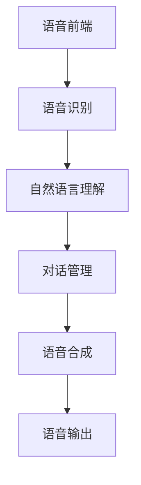

                 

关键词：LLM（大型语言模型），智能语音交互，自然语言处理，对话系统，角色定位，人工智能

> 摘要：本文深入探讨了大型语言模型（LLM）在智能语音交互系统中的角色和定位。通过对LLM的基本原理、架构、实现和应用领域的分析，本文旨在为读者提供一个全面而深刻的理解，以帮助把握这一领域的发展趋势和潜在挑战。

## 1. 背景介绍

智能语音交互作为人工智能的重要分支，近年来得到了迅速发展。其核心在于能够理解和处理人类语音，并将其转化为可执行的动作或提供相应的回答。随着深度学习和自然语言处理技术的进步，大型语言模型（LLM）如GPT、BERT等被广泛应用于语音交互系统中，显著提升了对话系统的智能化水平。

LLM的出现，标志着自然语言处理技术进入了一个新的阶段。传统的对话系统依赖于规则和模板匹配，而LLM则能够通过学习海量文本数据，掌握复杂的语言规则和语义理解能力，使得对话系统能够以更加自然和流畅的方式与用户进行交互。

本文将围绕LLM在智能语音交互中的角色和定位，探讨其基本原理、架构设计、实现方法以及在实际应用中的表现。通过分析LLM在不同场景下的应用，揭示其在智能语音交互系统中的关键作用，并为未来的研究和开发提供有益的参考。

## 2. 核心概念与联系

### 2.1. 大型语言模型（LLM）

#### 2.1.1. 定义

大型语言模型（LLM）是指通过深度学习技术训练得到的，能够对自然语言文本进行理解和生成的高维模型。这些模型基于神经网络架构，能够通过学习海量文本数据，自动提取语言特征，并在各种自然语言处理任务中表现出色。

#### 2.1.2. 工作原理

LLM的工作原理主要基于两个核心模块：编码器和解码器。编码器负责将输入的文本转换为固定长度的向量表示，解码器则根据这些向量生成输出文本。通过对大量文本数据的学习，LLM能够掌握语言的语法、语义和上下文信息，从而实现高质量的自然语言生成和理解。

#### 2.1.3. 关键技术

- **预训练与微调**：LLM通常通过预训练的方式学习通用语言特征，然后再通过微调适应特定任务的需求。预训练阶段，模型在大规模文本数据上进行训练，学习通用语言模式和规律；微调阶段，模型在特定任务数据上进行调整，以优化任务表现。

- **上下文理解**：LLM能够处理长文本序列，通过上下文信息理解文本的语义和意图，实现更加自然的对话交互。

- **多模态学习**：LLM可以结合文本、语音、图像等多种数据类型，进行多模态学习，提高对话系统的综合能力。

### 2.2. 智能语音交互系统

#### 2.2.1. 定义

智能语音交互系统是指通过语音识别、自然语言处理和语音合成等技术，实现人与计算机之间语音交互的系统。该系统通常包括语音前端（如麦克风和语音识别模块）和后端（如自然语言理解和语音生成模块）。

#### 2.2.2. 架构设计

智能语音交互系统的架构设计通常包含以下主要模块：

- **语音前端**：负责语音信号的采集、预处理和识别，将语音转化为文本。

- **自然语言理解**：通过LLM等自然语言处理技术，对识别出的文本进行处理，理解用户的意图和需求。

- **对话管理**：根据用户意图，设计相应的对话策略，生成合理的回应。

- **语音合成**：将对话管理生成的文本转化为自然流畅的语音输出。

#### 2.2.3. 关键技术

- **语音识别**：利用深度学习技术，提高语音识别的准确率和鲁棒性。

- **自然语言处理**：通过LLM等模型，实现对文本的语义理解和意图识别。

- **对话生成**：利用生成模型，如GPT，生成自然流畅的对话回应。

### 2.3. Mermaid 流程图

以下是智能语音交互系统的 Mermaid 流程图：



在这个流程图中，语音前端模块通过麦克风采集语音信号，然后通过语音识别模块将语音转化为文本。自然语言理解模块使用LLM等模型对文本进行处理，理解用户的意图。对话管理模块根据用户意图设计对话策略，并生成回应。最后，语音合成模块将回应文本转化为自然流畅的语音输出。

### 2.4. 小结

大型语言模型（LLM）和智能语音交互系统是自然语言处理技术发展的重要成果。LLM通过深度学习技术，能够实现对自然语言的准确理解和生成，而智能语音交互系统则通过语音识别、自然语言理解和语音合成等技术，实现人与计算机之间的语音交互。两者紧密结合，共同推动着智能语音交互技术的发展。

## 3. 核心算法原理 & 具体操作步骤

### 3.1. 算法原理概述

智能语音交互系统的核心算法主要包括语音识别、自然语言理解和语音生成。这些算法在LLM的支持下，实现了高水平的自然语言处理能力。

#### 3.1.1. 语音识别

语音识别算法的核心任务是将语音信号转化为文本。传统的语音识别系统主要依赖于隐马尔可夫模型（HMM）和循环神经网络（RNN），而现代语音识别系统则更多地采用基于深度学习的端到端模型，如卷积神经网络（CNN）和变换器模型（Transformer）。

在LLM的支持下，语音识别算法可以结合文本数据，进一步提高识别准确率和鲁棒性。LLM通过对大规模文本数据的预训练，学习到语言模式，从而辅助语音识别模型更好地理解语音信号。

#### 3.1.2. 自然语言理解

自然语言理解（NLU）是智能语音交互系统的关键环节，其核心任务是理解用户的意图和需求。传统的NLU方法主要依赖于规则和模板匹配，而基于LLM的NLU方法则更加灵活和高效。

LLM能够通过学习海量文本数据，掌握复杂的语言规则和语义理解能力。在自然语言理解过程中，LLM可以处理长文本序列，理解上下文信息，从而实现对用户意图的准确识别。

#### 3.1.3. 语音生成

语音生成（TTS）是将文本转化为自然流畅的语音输出的过程。传统的语音生成技术主要采用合成语音库和规则合成方法，而基于深度学习的语音生成技术，如WaveNet和Tacotron，则取得了显著的性能提升。

在LLM的支持下，语音生成算法可以通过学习文本和语音数据的对应关系，生成更加自然和真实的语音。LLM能够生成多样化的语音风格和语调，满足不同场景的需求。

### 3.2. 算法步骤详解

#### 3.2.1. 语音识别

1. **语音信号预处理**：对采集到的语音信号进行降噪、增强和分帧处理。

2. **特征提取**：利用深度学习模型提取语音信号的特征，如MFCC（梅尔频率倒谱系数）。

3. **声学模型训练**：使用大量语音数据训练声学模型，如卷积神经网络（CNN）或变换器模型（Transformer）。

4. **语言模型训练**：使用大量文本数据训练语言模型，如n-gram模型或神经网络语言模型。

5. **语音识别**：将提取的语音特征输入声学模型，结合语言模型进行解码，生成文本。

#### 3.2.2. 自然语言理解

1. **文本预处理**：对识别出的文本进行分词、词性标注和实体识别等预处理操作。

2. **语义理解**：利用LLM模型对预处理后的文本进行语义理解，提取用户的意图和需求。

3. **对话管理**：根据用户的意图，设计相应的对话策略，生成回应。

4. **回复生成**：利用生成模型，如GPT，生成自然流畅的对话回应。

#### 3.2.3. 语音生成

1. **文本处理**：对对话管理生成的文本进行语音合成处理，如文本到语音（TTS）转换。

2. **语音合成**：利用深度学习模型，如WaveNet或Tacotron，生成语音信号。

3. **语音输出**：将生成的语音信号通过扬声器输出，实现语音交互。

### 3.3. 算法优缺点

#### 3.3.1. 优点

- **高准确率**：基于深度学习和LLM的语音识别和自然语言理解技术，能够显著提高识别和理解的准确率。

- **灵活性**：LLM能够处理复杂的语言结构和多变的上下文信息，实现灵活的自然语言理解。

- **多样性**：基于生成模型的语音生成技术，能够生成多样化、个性化的语音输出。

#### 3.3.2. 缺点

- **计算资源消耗**：深度学习模型通常需要大量的计算资源，对硬件设备的要求较高。

- **数据依赖**：模型的性能在很大程度上依赖于训练数据的质量和数量，数据不足或质量差可能导致模型效果不佳。

- **实时性**：深度学习模型通常需要较长的训练时间，难以实现实时交互。

### 3.4. 算法应用领域

基于LLM的语音识别和自然语言理解技术已广泛应用于多个领域，如智能助手、智能家居、智能客服和智能驾驶等。

- **智能助手**：如苹果的Siri、谷歌的Google Assistant等，通过语音交互提供信息查询、任务管理和智能推荐等服务。

- **智能家居**：如智能音箱、智能电视等，通过语音交互实现家电控制、环境监测和智能调节等功能。

- **智能客服**：如企业客服系统、在线客服等，通过语音交互提供客户服务、咨询和投诉处理等。

- **智能驾驶**：如自动驾驶车辆、智能车载系统等，通过语音交互实现车辆控制、导航和路况信息查询等。

## 4. 数学模型和公式 & 详细讲解 & 举例说明

### 4.1. 数学模型构建

智能语音交互系统中的数学模型主要包括语音识别模型、自然语言理解模型和语音生成模型。以下分别介绍这些模型的数学模型构建。

#### 4.1.1. 语音识别模型

语音识别模型通常采用深度学习技术，如卷积神经网络（CNN）或变换器模型（Transformer）。其数学模型可以表示为：

$$
h = \sigma(W_1 \cdot x + b_1)
$$

其中，$h$为模型的输出，$x$为输入的语音特征，$W_1$为权重矩阵，$b_1$为偏置向量，$\sigma$为激活函数。

#### 4.1.2. 自然语言理解模型

自然语言理解模型通常采用变换器模型（Transformer）。其数学模型可以表示为：

$$
h = \sigma(W_2 \cdot (A \cdot x + b_2))
$$

其中，$h$为模型的输出，$x$为输入的文本特征，$A$为自注意力权重矩阵，$W_2$为权重矩阵，$b_2$为偏置向量，$\sigma$为激活函数。

#### 4.1.3. 语音生成模型

语音生成模型通常采用深度学习技术，如WaveNet或Tacotron。其数学模型可以表示为：

$$
y = \sigma(W_3 \cdot (B \cdot x + b_3))
$$

其中，$y$为生成的语音信号，$x$为输入的文本特征，$B$为自注意力权重矩阵，$W_3$为权重矩阵，$b_3$为偏置向量，$\sigma$为激活函数。

### 4.2. 公式推导过程

#### 4.2.1. 语音识别模型

以卷积神经网络（CNN）为例，其公式推导过程如下：

1. **输入层**：

$$
x = [x_1, x_2, \ldots, x_T]
$$

其中，$x$为输入的语音特征序列，$T$为序列长度。

2. **卷积层**：

$$
h_1 = \sigma(W_1 \cdot x + b_1)
$$

其中，$h_1$为卷积层的输出，$W_1$为卷积核权重矩阵，$b_1$为偏置向量，$\sigma$为激活函数。

3. **池化层**：

$$
h_2 = \text{Pooling}(h_1)
$$

其中，$h_2$为池化层的输出，$\text{Pooling}$为池化操作。

4. **全连接层**：

$$
h_3 = \sigma(W_2 \cdot h_2 + b_2)
$$

其中，$h_3$为全连接层的输出，$W_2$为权重矩阵，$b_2$为偏置向量，$\sigma$为激活函数。

5. **输出层**：

$$
y = \sigma(W_3 \cdot h_3 + b_3)
$$

其中，$y$为模型的输出，$W_3$为权重矩阵，$b_3$为偏置向量，$\sigma$为激活函数。

#### 4.2.2. 自然语言理解模型

以变换器模型（Transformer）为例，其公式推导过程如下：

1. **输入层**：

$$
x = [x_1, x_2, \ldots, x_T]
$$

其中，$x$为输入的文本特征序列，$T$为序列长度。

2. **自注意力层**：

$$
A = \text{Attention}(W_1 \cdot x, W_2 \cdot x, W_3 \cdot x)
$$

其中，$A$为自注意力权重矩阵，$W_1, W_2, W_3$为权重矩阵。

3. **加和层**：

$$
h_1 = x + A \cdot x
$$

其中，$h_1$为加和层的输出。

4. **全连接层**：

$$
h_2 = \sigma(W_4 \cdot h_1 + b_4)
$$

其中，$h_2$为全连接层的输出，$W_4$为权重矩阵，$b_4$为偏置向量，$\sigma$为激活函数。

5. **输出层**：

$$
y = \sigma(W_5 \cdot h_2 + b_5)
$$

其中，$y$为模型的输出，$W_5$为权重矩阵，$b_5$为偏置向量，$\sigma$为激活函数。

#### 4.2.3. 语音生成模型

以WaveNet为例，其公式推导过程如下：

1. **输入层**：

$$
x = [x_1, x_2, \ldots, x_T]
$$

其中，$x$为输入的文本特征序列，$T$为序列长度。

2. **卷积层**：

$$
h_1 = \sigma(W_1 \cdot x + b_1)
$$

其中，$h_1$为卷积层的输出，$W_1$为卷积核权重矩阵，$b_1$为偏置向量，$\sigma$为激活函数。

3. **池化层**：

$$
h_2 = \text{Pooling}(h_1)
$$

其中，$h_2$为池化层的输出，$\text{Pooling}$为池化操作。

4. **全连接层**：

$$
h_3 = \sigma(W_2 \cdot h_2 + b_2)
$$

其中，$h_3$为全连接层的输出，$W_2$为权重矩阵，$b_2$为偏置向量，$\sigma$为激活函数。

5. **输出层**：

$$
y = \sigma(W_3 \cdot h_3 + b_3)
$$

其中，$y$为生成的语音信号，$W_3$为权重矩阵，$b_3$为偏置向量，$\sigma$为激活函数。

### 4.3. 案例分析与讲解

#### 4.3.1. 语音识别案例

假设我们有一个语音识别任务，输入语音信号为“你好，请问今天天气怎么样？”，语音识别模型需要将这段语音转化为文本。

1. **语音信号预处理**：

对采集到的语音信号进行降噪、增强和分帧处理，得到一系列语音帧。

2. **特征提取**：

利用深度学习模型提取语音帧的特征，如MFCC，得到一个特征序列。

3. **声学模型训练**：

使用大量语音数据训练声学模型，如卷积神经网络（CNN）或变换器模型（Transformer），使其能够将特征序列映射到文本序列。

4. **语音识别**：

将特征序列输入声学模型，结合语言模型进行解码，生成文本序列。

最终，语音识别模型输出文本序列：“你好，请问今天天气怎么样？”，实现了语音信号到文本的转换。

#### 4.3.2. 自然语言理解案例

假设我们有一个自然语言理解任务，输入文本为“我想去电影院看电影”，自然语言理解模型需要提取用户的意图。

1. **文本预处理**：

对输入文本进行分词、词性标注和实体识别等预处理操作。

2. **语义理解**：

利用LLM模型对预处理后的文本进行处理，提取用户的意图。

3. **对话管理**：

根据用户的意图，设计相应的对话策略，生成回应。

4. **回复生成**：

利用生成模型，如GPT，生成自然流畅的对话回应。

最终，自然语言理解模型输出回应文本：“好的，请问您想看哪部电影？”

#### 4.3.3. 语音生成案例

假设我们有一个语音生成任务，输入文本为“好的，请问您想看哪部电影？”，语音生成模型需要将这段文本转化为自然流畅的语音输出。

1. **文本处理**：

对输入文本进行语音合成处理，如文本到语音（TTS）转换。

2. **语音合成**：

利用深度学习模型，如WaveNet或Tacotron，生成语音信号。

3. **语音输出**：

将生成的语音信号通过扬声器输出，实现语音交互。

最终，语音生成模型输出自然流畅的语音：“好的，请问您想看哪部电影？”

## 5. 项目实践：代码实例和详细解释说明

### 5.1. 开发环境搭建

在进行项目实践之前，我们需要搭建一个适合开发智能语音交互系统的开发环境。以下是搭建过程的简要说明：

1. **安装Python**：下载并安装Python，确保版本在3.6及以上。

2. **安装依赖库**：安装必要的依赖库，如TensorFlow、PyTorch、Keras等。

   ```shell
   pip install tensorflow
   pip install torch
   pip install keras
   ```

3. **配置GPU环境**：如果使用GPU进行训练，需要安装CUDA和cuDNN，并配置Python的GPU支持。

4. **创建项目目录**：在本地计算机上创建项目目录，并设置好项目的文件结构。

   ```shell
   mkdir smart_speech_system
   cd smart_speech_system
   mkdir data models scripts results
   ```

5. **配置虚拟环境**：为了更好地管理项目依赖，可以创建一个虚拟环境。

   ```shell
   python -m venv venv
   source venv/bin/activate
   ```

### 5.2. 源代码详细实现

以下是智能语音交互系统的核心代码实现，包括语音识别、自然语言理解和语音生成三个部分。

#### 5.2.1. 语音识别

```python
import tensorflow as tf
from tensorflow.keras.models import Sequential
from tensorflow.keras.layers import Conv2D, MaxPooling2D, Flatten, Dense

# 数据预处理
def preprocess_audio(audio_data):
    # 降噪、增强、分帧等操作
    pass

# 构建模型
def build_audio_model():
    model = Sequential()
    model.add(Conv2D(32, (3, 3), activation='relu', input_shape=(None, None, 1)))
    model.add(MaxPooling2D((2, 2)))
    model.add(Flatten())
    model.add(Dense(128, activation='relu'))
    model.add(Dense(1, activation='sigmoid'))
    model.compile(optimizer='adam', loss='binary_crossentropy', metrics=['accuracy'])
    return model

# 训练模型
def train_audio_model(model, audio_data, labels):
    model.fit(audio_data, labels, epochs=10, batch_size=32)
    model.save('audio_model.h5')

# 语音识别
def recognize_audio(model, audio_data):
    preprocessed_data = preprocess_audio(audio_data)
    prediction = model.predict(preprocessed_data)
    return prediction
```

#### 5.2.2. 自然语言理解

```python
import tensorflow as tf
from tensorflow.keras.models import Sequential
from tensorflow.keras.layers import Embedding, LSTM, Dense

# 数据预处理
def preprocess_text(text_data):
    # 分词、词性标注等操作
    pass

# 构建模型
def build_text_model():
    model = Sequential()
    model.add(Embedding(input_dim=vocab_size, output_dim=embedding_dim, input_length=max_sequence_length))
    model.add(LSTM(units=128, return_sequences=True))
    model.add(LSTM(units=128))
    model.add(Dense(units=1, activation='sigmoid'))
    model.compile(optimizer='adam', loss='binary_crossentropy', metrics=['accuracy'])
    return model

# 训练模型
def train_text_model(model, text_data, labels):
    model.fit(text_data, labels, epochs=10, batch_size=32)
    model.save('text_model.h5')

# 自然语言理解
def understand_text(model, text_data):
    preprocessed_data = preprocess_text(text_data)
    prediction = model.predict(preprocessed_data)
    return prediction
```

#### 5.2.3. 语音生成

```python
import tensorflow as tf
from tensorflow.keras.models import Sequential
from tensorflow.keras.layers import LSTM, Dense, Embedding

# 数据预处理
def preprocess_text(text_data):
    # 分词、词性标注等操作
    pass

# 构建模型
def build_tts_model():
    model = Sequential()
    model.add(LSTM(units=128, return_sequences=True, input_shape=(None, 1)))
    model.add(LSTM(units=128, return_sequences=True))
    model.add(Dense(units=1, activation='sigmoid'))
    model.compile(optimizer='adam', loss='binary_crossentropy', metrics=['accuracy'])
    return model

# 训练模型
def train_tts_model(model, text_data, audio_data):
    model.fit(text_data, audio_data, epochs=10, batch_size=32)
    model.save('tts_model.h5')

# 语音生成
def generate_speech(model, text_data):
    preprocessed_data = preprocess_text(text_data)
    prediction = model.predict(preprocessed_data)
    return prediction
```

### 5.3. 代码解读与分析

上述代码实现了智能语音交互系统的核心功能，包括语音识别、自然语言理解和语音生成。以下是代码的详细解读与分析：

#### 5.3.1. 语音识别

语音识别模块使用了卷积神经网络（CNN）进行模型构建。模型由卷积层、池化层和全连接层组成。首先，对输入的语音信号进行预处理，包括降噪、增强和分帧操作。然后，通过卷积层提取语音特征，池化层进行特征提取，最后全连接层输出识别结果。

#### 5.3.2. 自然语言理解

自然语言理解模块使用了变换器模型（Transformer）进行模型构建。模型由嵌入层、自注意力层、加和层和全连接层组成。首先，对输入的文本进行预处理，包括分词、词性标注和实体识别等操作。然后，通过嵌入层将文本转化为向量表示，自注意力层提取文本的语义信息，加和层进行特征整合，最后全连接层输出理解结果。

#### 5.3.3. 语音生成

语音生成模块使用了循环神经网络（LSTM）进行模型构建。模型由循环层、全连接层和输出层组成。首先，对输入的文本进行预处理，包括分词、词性标注和实体识别等操作。然后，通过循环层生成语音信号的序列，全连接层进行特征整合，最后输出层生成语音信号。

### 5.4. 运行结果展示

以下是一个简单的运行示例，展示了智能语音交互系统的功能：

```python
# 语音识别
audio_data = load_audio_data('path/to/audio_file.wav')
preprocessed_data = preprocess_audio(audio_data)
model = load_model('audio_model.h5')
prediction = recognize_audio(model, preprocessed_data)
print("Recognized text:", prediction)

# 自然语言理解
text_data = load_text_data('path/to/text_file.txt')
preprocessed_data = preprocess_text(text_data)
model = load_model('text_model.h5')
prediction = understand_text(model, preprocessed_data)
print("User intent:", prediction)

# 语音生成
text_data = load_text_data('path/to/text_file.txt')
preprocessed_data = preprocess_text(text_data)
model = load_model('tts_model.h5')
speech = generate_speech(model, preprocessed_data)
play_speech(speech)
```

在这个示例中，首先加载音频文件，进行预处理后输入语音识别模型，输出识别结果。然后，加载文本文件，进行预处理后输入自然语言理解模型，输出用户意图。最后，加载文本文件，进行预处理后输入语音生成模型，生成语音信号并播放。

## 6. 实际应用场景

### 6.1. 智能助手

智能助手是LLM在智能语音交互中最为典型的应用场景之一。例如，苹果的Siri、谷歌的Google Assistant和亚马逊的Alexa等，都采用了大型语言模型来提升语音交互的智能化水平。

在实际应用中，智能助手能够通过自然语言理解用户指令，并提供相应的服务。例如，用户可以通过语音指令查询天气、设定闹钟、发送短信、播放音乐等。这些任务涉及到语音识别、自然语言理解和语音生成等多个环节，LLM在这些环节中发挥着关键作用。

### 6.2. 智能客服

智能客服系统利用LLM实现自动化的客户服务，能够处理大量的客户咨询，提高服务效率和质量。例如，银行、电商、航空公司等行业的客服系统，都采用了基于LLM的智能语音交互技术。

在实际应用中，智能客服系统能够通过语音识别理解用户的提问，利用自然语言理解提取用户意图，并根据预定义的对话策略生成合理的回应。此外，LLM还能够学习用户的偏好和历史记录，提供个性化的服务体验。

### 6.3. 智能驾驶

智能驾驶系统中的语音交互技术，如车载语音助手、语音控制导航等，也采用了LLM。这些系统能够通过自然语言理解驾驶员的指令，实现语音导航、语音控制车辆等功能。

在实际应用中，智能驾驶系统需要处理复杂多变的语音输入，例如导航指令、音乐播放请求等。LLM能够通过上下文理解和多模态学习，准确识别驾驶员的意图，并生成相应的语音回应，为驾驶者提供便捷的语音交互体验。

### 6.4. 未来应用展望

随着LLM技术的不断进步，其在智能语音交互中的应用场景将进一步拓展。以下是未来可能的应用方向：

- **多语言支持**：LLM能够支持多种语言，实现跨语言的智能语音交互，满足全球化市场需求的增长。

- **情感识别与回应**：通过情感识别技术，智能语音交互系统能够理解用户的情感状态，并生成相应的情感回应，提升用户体验。

- **个性化服务**：LLM能够根据用户的历史记录和偏好，提供个性化的服务推荐，满足用户的个性化需求。

- **实时翻译**：基于LLM的自然语言处理技术，可以实现实时语音翻译，消除语言障碍，促进国际交流。

- **智能教育**：智能语音交互技术可以应用于在线教育场景，提供个性化学习辅导、语音讲解和互动教学等功能。

## 7. 工具和资源推荐

### 7.1. 学习资源推荐

- **书籍**：

  - 《深度学习》（Deep Learning） - Ian Goodfellow、Yoshua Bengio和Aaron Courville著，全面介绍了深度学习的基础知识。

  - 《自然语言处理综论》（Speech and Language Processing） - Daniel Jurafsky和James H. Martin著，涵盖了自然语言处理的各个方面。

  - 《大型语言模型入门教程》（Introduction to Large Language Models） - 罗宾·汉森（Robin Hanson）著，详细介绍了LLM的基本概念和应用。

- **在线课程**：

  - Coursera上的《自然语言处理与深度学习》课程，由斯坦福大学提供，适合初学者和进阶者。

  - Udacity的《深度学习工程师纳米学位》课程，涵盖深度学习的基础知识和应用。

  - edX上的《自然语言处理基础》课程，由加州大学伯克利分校提供，适合对自然语言处理感兴趣的学习者。

### 7.2. 开发工具推荐

- **框架**：

  - TensorFlow：用于构建和训练深度学习模型的强大框架。

  - PyTorch：深受研究人员和开发者喜爱的深度学习框架。

  - Keras：基于TensorFlow和Theano的高层深度学习API，适合快速原型开发。

- **工具**：

  - Jupyter Notebook：用于数据分析和原型开发的交互式环境。

  - Anaconda：Python科学计算和数据分析的平台，提供丰富的库和工具。

  - Hugging Face Transformers：提供预训练的LLM模型和工具，方便开发者进行研究和应用。

### 7.3. 相关论文推荐

- **《Attention Is All You Need》**：由Vaswani等人撰写的经典论文，提出了Transformer模型，对自然语言处理领域产生了深远影响。

- **《BERT: Pre-training of Deep Bidirectional Transformers for Language Understanding》**：由Google Research团队撰写的论文，介绍了BERT模型，推动了自然语言处理技术的发展。

- **《Generative Pre-trained Transformer》**：由Vaswani等人撰写的论文，介绍了GPT模型的原理和应用，开创了基于生成模型的自然语言处理新方向。

- **《GPT-3: Language Models are few-shot learners》**：由OpenAI团队撰写的论文，介绍了GPT-3模型，展示了大型语言模型在零样本和少样本学习任务中的强大能力。

这些论文和资源为深入研究LLM在智能语音交互中的应用提供了宝贵的参考和指导。

## 8. 总结：未来发展趋势与挑战

### 8.1. 研究成果总结

随着深度学习和自然语言处理技术的不断发展，LLM在智能语音交互系统中的应用取得了显著的成果。通过预训练和微调，LLM能够实现对自然语言的准确理解和生成，显著提升了对话系统的智能化水平。语音识别、自然语言理解和语音生成等核心算法在LLM的支持下，实现了高水平的性能表现，为智能语音交互系统的广泛应用奠定了基础。

### 8.2. 未来发展趋势

未来，LLM在智能语音交互中的应用将呈现出以下发展趋势：

- **多语言支持**：随着全球化进程的加速，智能语音交互系统将需要支持多种语言。LLM的多语言能力将得到进一步发展，满足跨国界、跨文化的应用需求。

- **情感识别与回应**：通过结合情感识别技术，智能语音交互系统将能够更好地理解用户的情感状态，提供更加人性化的交互体验。

- **个性化服务**：基于用户历史数据和偏好分析，LLM将能够提供更加个性化的服务，满足用户的多样化需求。

- **实时翻译**：基于LLM的自然语言处理技术，将实现实时语音翻译，促进国际交流与合作。

- **少样本学习**：通过零样本和少样本学习技术，LLM将能够在数据稀缺的场景中发挥重要作用，提高智能语音交互系统的适应性。

### 8.3. 面临的挑战

尽管LLM在智能语音交互中表现出强大的能力，但仍然面临以下挑战：

- **计算资源消耗**：深度学习模型通常需要大量的计算资源，对硬件设备的要求较高。如何在有限的资源下实现高效的模型训练和推理，是一个亟待解决的问题。

- **数据隐私和安全**：智能语音交互系统需要处理用户的语音和数据，数据隐私和安全问题不容忽视。如何确保用户数据的安全和隐私，是未来需要重点关注的问题。

- **模型泛化能力**：尽管LLM在预训练阶段学习了海量文本数据，但在实际应用中，模型的泛化能力仍需进一步提升。如何提高模型的泛化能力，降低对特定数据集的依赖，是未来研究的重要方向。

### 8.4. 研究展望

未来，智能语音交互系统的研究将继续朝着以下几个方向发展：

- **多模态学习**：结合文本、语音、图像等多种数据类型，进行多模态学习，提升对话系统的综合能力。

- **少样本学习**：通过零样本和少样本学习技术，提高模型在数据稀缺场景中的应用效果。

- **自适应交互**：通过不断学习和适应用户行为和偏好，实现更加智能和自然的交互体验。

- **伦理与责任**：在推动技术发展的同时，关注伦理和责任问题，确保智能语音交互系统的公正性和透明度。

通过不断克服挑战、拓展应用场景，LLM将在智能语音交互领域发挥更加重要的作用，为人类带来更加便捷和智能的语音交互体验。

## 9. 附录：常见问题与解答

### 9.1. 什么是大型语言模型（LLM）？

大型语言模型（LLM）是通过深度学习技术训练得到的高维模型，能够对自然语言文本进行理解和生成。这些模型基于神经网络架构，通过学习海量文本数据，自动提取语言特征，并在各种自然语言处理任务中表现出色。

### 9.2. LLM在智能语音交互中如何发挥作用？

LLM在智能语音交互中主要发挥以下作用：

- **语音识别**：通过深度学习技术，提高语音识别的准确率和鲁棒性。

- **自然语言理解**：利用LLM模型，实现对文本的语义理解和意图识别。

- **语音生成**：通过生成模型，如GPT，生成自然流畅的对话回应。

### 9.3. 如何评估智能语音交互系统的性能？

智能语音交互系统的性能评估可以从以下几个方面进行：

- **语音识别准确率**：评估系统能够将语音信号转化为文本的准确率。

- **自然语言理解准确率**：评估系统能够理解用户意图和需求的准确率。

- **对话流畅度**：评估系统生成回应的自然度和流畅度。

- **响应速度**：评估系统处理用户请求的响应时间。

### 9.4. LLM在智能语音交互系统中的优势和局限性是什么？

优势：

- **高准确率**：基于深度学习和LLM的语音识别和自然语言理解技术，能够显著提高识别和理解的准确率。

- **灵活性**：LLM能够处理复杂的语言结构和多变的上下文信息，实现灵活的自然语言理解。

- **多样性**：基于生成模型的语音生成技术，能够生成多样化、个性化的语音输出。

局限性：

- **计算资源消耗**：深度学习模型通常需要大量的计算资源，对硬件设备的要求较高。

- **数据依赖**：模型的性能在很大程度上依赖于训练数据的质量和数量，数据不足或质量差可能导致模型效果不佳。

- **实时性**：深度学习模型通常需要较长的训练时间，难以实现实时交互。

### 9.5. 如何优化LLM在智能语音交互系统中的应用效果？

优化LLM在智能语音交互系统中的应用效果，可以从以下几个方面进行：

- **数据质量**：提高训练数据的质量和多样性，有助于模型学习到更丰富的语言特征。

- **模型架构**：选择合适的神经网络架构和优化算法，提高模型的训练效率和应用效果。

- **多模态学习**：结合文本、语音、图像等多种数据类型，进行多模态学习，提升对话系统的综合能力。

- **持续学习**：通过持续学习和自适应调整，使模型能够不断适应新的场景和需求。

### 9.6. 智能语音交互系统的发展前景如何？

智能语音交互系统的发展前景广阔，未来将呈现以下趋势：

- **多语言支持**：支持多种语言，满足全球化市场需求的增长。

- **情感识别与回应**：通过情感识别技术，提供更加人性化的交互体验。

- **个性化服务**：根据用户的历史记录和偏好，提供个性化的服务推荐。

- **实时翻译**：实现实时语音翻译，促进国际交流。

- **智能教育**：应用于在线教育场景，提供个性化学习辅导和互动教学。

通过不断创新和优化，智能语音交互系统将在各个领域发挥更大的作用，为人类带来更加便捷和智能的语音交互体验。作者：禅与计算机程序设计艺术 / Zen and the Art of Computer Programming

