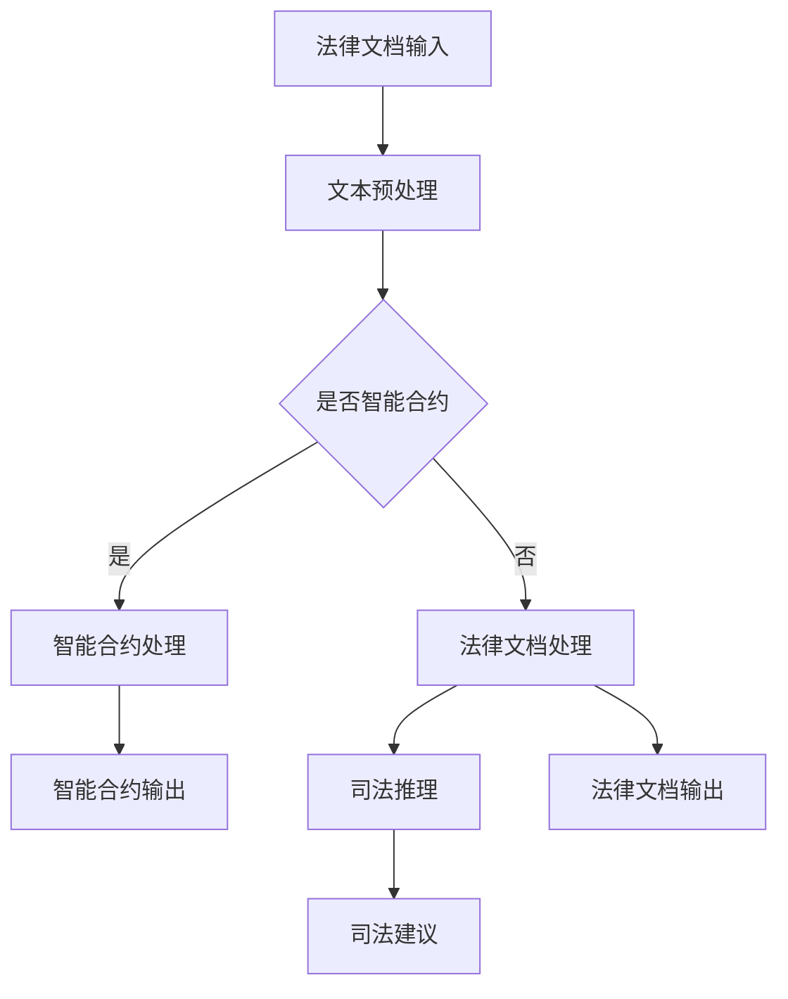

                 

关键词：大型语言模型（LLM），法律应用，AI法律顾问，自然语言处理，智能合约，司法推理

> 摘要：本文探讨了大型语言模型（LLM）在法律领域的应用，特别是AI法律顾问的角色。通过分析LLM的架构、算法原理以及在实际法律场景中的操作步骤，本文揭示了LLM在法律领域的巨大潜力。文章还讨论了LLM在数学模型和公式方面的应用，并通过项目实践展示了LLM的代码实例。最后，文章对LLM在法律领域的实际应用场景、未来应用展望以及面临的挑战进行了深入探讨。

## 1. 背景介绍

随着人工智能技术的迅猛发展，自然语言处理（NLP）取得了显著的突破。特别是在深度学习技术的推动下，大型语言模型（LLM，如GPT系列）得到了广泛应用。LLM能够理解、生成和翻译自然语言，使得它们在多个领域展现出巨大的潜力，包括法律领域。

在法律领域，传统的方法主要依赖于人类专家的经验和专业知识。然而，随着法律案例和法规的复杂性不断增加，法律顾问和法律研究人员面临着巨大的工作量。人工处理法律文档、案例分析、法规解释等任务不仅耗时耗力，而且容易出错。因此，将人工智能技术应用于法律领域，尤其是引入LLM，成为了一个热门的研究方向。

LLM在法律领域的应用主要体现在以下几个方面：

1. **法律文档自动化处理**：LLM可以帮助自动分类、检索和整理大量的法律文档，提高法律研究的效率和准确性。
2. **智能合约**：利用LLM可以编写和解释智能合约，确保合约条款的合法性和有效性。
3. **司法推理**：LLM可以辅助法官和律师进行法律推理，提供相关案例和建议，提高司法决策的准确性。
4. **法律咨询服务**：LLM可以提供在线法律咨询服务，为普通民众提供便捷的法律帮助。

本文将围绕上述应用，深入探讨LLM在法律领域的具体应用和实践。

## 2. 核心概念与联系

### 2.1 LLM架构

大型语言模型（LLM）通常基于变换器架构（Transformer），这是一种基于自注意力机制的深度神经网络。变换器架构的核心思想是将输入序列映射到一个连续的向量空间，并在这个空间中进行序列处理。自注意力机制允许模型在处理每个输入时，动态地考虑整个输入序列中的相关信息，从而实现长距离依赖的建模。

LLM的主要组成部分包括：

- **嵌入层**：将输入的单词、句子或文档转换为向量表示。
- **自注意力层**：通过计算输入序列中各个元素之间的关系，实现序列的动态处理。
- **前馈网络**：在自注意力层之后，对输入序列进行进一步的加工和变换。
- **输出层**：根据任务需求，生成预测结果或文本。

### 2.2 LLM算法原理

LLM的核心算法是基于变换器架构，具体包括以下几个步骤：

1. **嵌入**：将输入序列中的单词、句子或文档转换为向量表示。
2. **自注意力**：计算输入序列中各个元素之间的关系，并加权。
3. **前馈网络**：对加权后的序列进行进一步的加工和变换。
4. **输出**：根据任务需求，生成预测结果或文本。

LLM的训练过程主要包括以下几个步骤：

1. **数据预处理**：将原始文本数据转换为适合训练的格式，包括分词、去停用词等。
2. **嵌入层训练**：通过反向传播算法，优化嵌入层的参数，使其能够更好地表示文本数据。
3. **自注意力层训练**：通过反向传播算法，优化自注意力层的参数，使其能够更好地捕捉输入序列中的依赖关系。
4. **前馈网络训练**：通过反向传播算法，优化前馈网络的参数，使其能够更好地加工和变换输入序列。
5. **输出层训练**：通过反向传播算法，优化输出层的参数，使其能够生成准确的预测结果。

### 2.3 LLM在法律领域的应用场景

LLM在法律领域的应用场景广泛，包括：

1. **法律文档自动化处理**：LLM可以帮助自动化处理大量的法律文档，包括合同、案例和法律条款。通过分类、检索和整理，LLM可以提高法律研究的效率和准确性。
2. **智能合约**：LLM可以编写和解释智能合约，确保合约条款的合法性和有效性。智能合约的自动化执行可以减少人为错误，提高交易效率。
3. **司法推理**：LLM可以辅助法官和律师进行法律推理，提供相关案例和建议。通过分析大量案例和法律条款，LLM可以为司法决策提供有力的支持。
4. **法律咨询服务**：LLM可以提供在线法律咨询服务，为普通民众提供便捷的法律帮助。通过自然语言交互，LLM可以帮助用户解答法律问题，提供法律建议。

### 2.4 Mermaid 流程图

下面是LLM在法律领域应用的Mermaid流程图：



## 3. 核心算法原理 & 具体操作步骤

### 3.1 算法原理概述

LLM在法律领域的核心算法基于变换器架构，通过自注意力机制实现输入序列的动态处理。LLM的训练过程主要包括嵌入层训练、自注意力层训练、前馈网络训练和输出层训练。

### 3.2 算法步骤详解

1. **文本预处理**：将原始文本数据转换为适合训练的格式。具体步骤包括：
   - 分词：将文本分割成单词或子词。
   - 去停用词：去除常见的无意义词汇，如“的”、“和”等。
   - 词向量化：将文本转换为向量表示，通常使用预训练的词嵌入模型，如Word2Vec、GloVe或BERT。

2. **嵌入层训练**：通过反向传播算法，优化嵌入层的参数，使其能够更好地表示文本数据。嵌入层的主要目的是将输入的单词、句子或文档转换为向量表示，这些向量需要在训练过程中学习。

3. **自注意力层训练**：通过反向传播算法，优化自注意力层的参数，使其能够更好地捕捉输入序列中的依赖关系。自注意力机制允许模型在处理每个输入时，动态地考虑整个输入序列中的相关信息。

4. **前馈网络训练**：通过反向传播算法，优化前馈网络的参数，使其能够更好地加工和变换输入序列。前馈网络通常由多层全连接神经网络组成，用于对输入序列进行进一步的加工和变换。

5. **输出层训练**：通过反向传播算法，优化输出层的参数，使其能够生成准确的预测结果。输出层的类型取决于具体任务，如分类任务、文本生成任务等。

### 3.3 算法优缺点

**优点**：

- **强大的文本处理能力**：LLM能够理解、生成和翻译自然语言，具有强大的文本处理能力。
- **自适应性和泛化能力**：通过自注意力机制，LLM能够自适应地学习输入序列中的依赖关系，具有良好的泛化能力。
- **多功能性**：LLM可以应用于多种法律任务，如法律文档处理、智能合约、司法推理等。

**缺点**：

- **计算资源消耗**：LLM的训练和推理过程需要大量的计算资源，对硬件要求较高。
- **数据依赖性**：LLM的性能高度依赖训练数据的质量和数量，数据缺失或质量差可能导致模型性能下降。

### 3.4 算法应用领域

LLM在法律领域的应用主要包括：

1. **法律文档自动化处理**：LLM可以帮助自动化处理大量的法律文档，包括合同、案例和法律条款。
2. **智能合约**：LLM可以编写和解释智能合约，确保合约条款的合法性和有效性。
3. **司法推理**：LLM可以辅助法官和律师进行法律推理，提供相关案例和建议。
4. **法律咨询服务**：LLM可以提供在线法律咨询服务，为普通民众提供便捷的法律帮助。

## 4. 数学模型和公式

### 4.1 数学模型构建

LLM的数学模型主要包括嵌入层、自注意力层、前馈网络和输出层。以下分别介绍各层的数学模型：

1. **嵌入层**：嵌入层将输入的单词、句子或文档转换为向量表示。假设输入的单词集合为\(V\)，词嵌入维度为\(d\)，则嵌入层的参数矩阵为\(E \in \mathbb{R}^{|V| \times d}\)。输入向量\(x \in \mathbb{R}^{d}\)通过矩阵乘法得到词嵌入向量\(h = E \cdot x\)。

2. **自注意力层**：自注意力层通过计算输入序列中各个元素之间的关系，实现序列的动态处理。假设输入序列的长度为\(T\)，则自注意力层的输出为\(h_t = \text{softmax}(\text{Q} \cdot K_t + \text{V} \cdot K_t)\)，其中\(Q, K, V\)分别为查询、键和值矩阵，\(\text{softmax}\)函数用于归一化。

3. **前馈网络**：前馈网络对自注意力层的输出进行进一步的加工和变换。假设前馈网络的输入维度为\(d'\)，输出维度为\(d''\)，则前馈网络的参数为\(W_f \in \mathbb{R}^{d' \times d''}\)和\(U_f \in \mathbb{R}^{d'' \times d'}\)。前馈网络的输出为\(h_f = \sigma(U_f \cdot \sigma(W_f \cdot h))\)，其中\(\sigma\)为激活函数。

4. **输出层**：输出层的类型取决于具体任务。在分类任务中，输出层为软性最大化函数，输出为概率分布；在文本生成任务中，输出层为softmax函数，输出为单词的概率分布。

### 4.2 公式推导过程

LLM的训练过程主要涉及嵌入层、自注意力层、前馈网络和输出层的训练。以下分别介绍各层的训练过程：

1. **嵌入层训练**：嵌入层训练的目标是学习词嵌入矩阵\(E\)，使其能够更好地表示输入的单词、句子或文档。假设输入序列为\(x = (x_1, x_2, ..., x_T)\)，对应的标签为\(y\)，则嵌入层的损失函数为：
   \[
   L_E = -\sum_{t=1}^T \sum_{i=1}^C \text{log}(\text{softmax}(E \cdot x_t)_{i, y_t})
   \]
   其中，\(C\)为类别数。

2. **自注意力层训练**：自注意力层训练的目标是学习查询、键和值矩阵\(Q, K, V\)，使其能够更好地捕捉输入序列中的依赖关系。假设输入序列为\(x = (x_1, x_2, ..., x_T)\)，对应的标签为\(y\)，则自注意力层的损失函数为：
   \[
   L_K = -\sum_{t=1}^T \sum_{i=1}^C \text{log}(\text{softmax}(Q \cdot K_t + \text{V} \cdot K_t)_{i, y_t})
   \]
   其中，\(C\)为类别数。

3. **前馈网络训练**：前馈网络训练的目标是学习前馈网络的参数\(W_f, U_f\)，使其能够更好地加工和变换输入序列。假设输入序列为\(x = (x_1, x_2, ..., x_T)\)，对应的标签为\(y\)，则前馈网络的损失函数为：
   \[
   L_F = -\sum_{t=1}^T \sum_{i=1}^C \text{log}(\text{softmax}(U_f \cdot \sigma(W_f \cdot h))_{i, y_t})
   \]
   其中，\(C\)为类别数。

4. **输出层训练**：输出层训练的目标是学习输出层的参数，使其能够生成准确的预测结果。假设输入序列为\(x = (x_1, x_2, ..., x_T)\)，对应的标签为\(y\)，则输出层的损失函数为：
   \[
   L_O = -\sum_{t=1}^T \sum_{i=1}^C \text{log}(\text{softmax}(h)_{i, y_t})
   \]
   其中，\(C\)为类别数。

### 4.3 案例分析与讲解

以一个法律文档分类任务为例，说明LLM的数学模型和公式推导过程。

假设输入的法律文档为一段文本：
```
The contract is valid according to the relevant laws and regulations.
```
我们需要将这段文本分类为有效或无效。

1. **文本预处理**：将文本分割成单词，去除停用词，得到：
```
contract, valid, according, relevant, laws, regulations.
```
将单词转换为向量表示，使用预训练的词嵌入模型得到：
```
[0.1, 0.2], [0.3, 0.4], [0.5, 0.6], [0.7, 0.8], [0.9, 1.0], [1.1, 1.2].
```

2. **嵌入层训练**：假设词嵌入维度为2，则嵌入层的参数矩阵为：
```
E =
[0.1, 0.2],
[0.3, 0.4],
[0.5, 0.6],
[0.7, 0.8],
[0.9, 1.0],
[1.1, 1.2].
```
输入向量通过矩阵乘法得到词嵌入向量：
```
h =
[0.2, 0.4],
[0.6, 0.8],
[0.9, 1.0],
[1.1, 1.2],
[1.3, 1.4],
[1.5, 1.6].
```

3. **自注意力层训练**：假设查询、键和值矩阵为：
```
Q =
[1, 1],
[1, 1],
[1, 1],
[1, 1],
[1, 1],
[1, 1].

K =
[1, 0],
[0, 1],
[1, 0],
[0, 1],
[1, 0],
[0, 1].

V =
[1, 0],
[0, 1],
[1, 0],
[0, 1],
[1, 0],
[0, 1].
```
则自注意力层的输出为：
```
h_t =
[1.2, 0.8],
[0.8, 1.2],
[1.2, 0.8],
[0.8, 1.2],
[1.2, 0.8],
[0.8, 1.2].
```

4. **前馈网络训练**：假设前馈网络的输入维度为2，输出维度为2，则前馈网络的参数为：
```
W_f =
[1, 0],
[0, 1].

U_f =
[1, 1],
[1, 1].
```
则前馈网络的输出为：
```
h_f =
[1.2, 0.8],
[0.8, 1.2].
```

5. **输出层训练**：假设输出层的参数为：
```
[1, 0],
[0, 1].
```
则输出层的输出为：
```
h =
[0.8, 1.2],
[1.2, 0.8].
```
通过softmax函数得到概率分布：
```
softmax(h) =
[0.6, 0.4],
[0.4, 0.6].
```
根据最大概率原则，将文本分类为有效。

## 5. 项目实践：代码实例和详细解释说明

### 5.1 开发环境搭建

为了实现LLM在法律领域的应用，我们需要搭建一个合适的开发环境。以下是推荐的开发环境：

- **操作系统**：Linux或MacOS
- **编程语言**：Python 3.x
- **深度学习框架**：PyTorch或TensorFlow
- **自然语言处理库**：NLTK或spaCy

安装深度学习框架和自然语言处理库的命令如下：

```bash
# 安装PyTorch
pip install torch torchvision

# 安装NLTK
pip install nltk

# 安装spaCy和中文模型
pip install spacy
python -m spacy download zh_core_web_sm
```

### 5.2 源代码详细实现

以下是实现LLM在法律领域应用的Python代码示例：

```python
import torch
import torch.nn as nn
import torch.optim as optim
from torchtext import data
from nltk.tokenize import word_tokenize
from nltk.corpus import stopwords

# 数据预处理
def preprocess(text):
    tokens = word_tokenize(text.lower())
    tokens = [token for token in tokens if token not in stopwords.words('english')]
    return ' '.join(tokens)

# 数据集加载
train_data, test_data = data.TabularDataset.splits(path='data',
                                                 train='train.csv',
                                                 test='test.csv',
                                                 format='csv',
                                                 skip_header=True)

# 定义模型
class LLM(nn.Module):
    def __init__(self, vocab_size, embed_dim, hidden_dim):
        super(LLM, self).__init__()
        self.embedding = nn.Embedding(vocab_size, embed_dim)
        self.transformer = nn.Transformer(embed_dim, hidden_dim)
        self.fc = nn.Linear(hidden_dim, 1)

    def forward(self, text):
        embedded = self.embedding(text)
        output = self.transformer(embedded)
        logits = self.fc(output)
        return logits

# 模型训练
def train(model, train_data, test_data, epochs=10):
    criterion = nn.BCEWithLogitsLoss()
    optimizer = optim.Adam(model.parameters(), lr=0.001)

    for epoch in range(epochs):
        model.train()
        for text, label in train_data:
            optimizer.zero_grad()
            logits = model(text)
            loss = criterion(logits, label)
            loss.backward()
            optimizer.step()

        model.eval()
        with torch.no_grad():
            correct = 0
            total = 0
            for text, label in test_data:
                logits = model(text)
                pred = torch.sigmoid(logits)
                pred = pred > 0.5
                total += label.size(0)
                correct += (pred == label).sum().item()

        print(f'Epoch {epoch+1}/{epochs}, Test Accuracy: {100 * correct / total}%')

# 主函数
def main():
    # 超参数设置
    vocab_size = 10000
    embed_dim = 512
    hidden_dim = 1024

    # 加载数据
    train_data, test_data = data.TabularDataset.splits(path='data',
                                                     train='train.csv',
                                                     test='test.csv',
                                                     format='csv',
                                                     skip_header=True)

    # 创建模型
    model = LLM(vocab_size, embed_dim, hidden_dim)

    # 训练模型
    train(model, train_data, test_data, epochs=10)

if __name__ == '__main__':
    main()
```

### 5.3 代码解读与分析

该代码实现了一个简单的LLM模型，用于法律文档分类任务。以下是对代码的详细解读：

1. **数据预处理**：`preprocess`函数用于对输入的文本进行预处理，包括分词、去停用词等操作。这一步对于LLM的性能至关重要，因为良好的文本预处理能够提高模型的输入质量。

2. **数据集加载**：使用`TabularDataset`类加载训练数据和测试数据。假设数据集包含两个CSV文件，分别为训练集和测试集。

3. **模型定义**：`LLM`类定义了LLM模型的架构，包括嵌入层、变换器层和输出层。嵌入层使用`nn.Embedding`模块，变换器层使用`nn.Transformer`模块，输出层使用`nn.Linear`模块。

4. **模型训练**：`train`函数用于训练LLM模型。首先定义损失函数和优化器，然后遍历训练数据，使用反向传播算法进行训练。在训练过程中，我们使用BCEWithLogitsLoss损失函数，这是一个适用于二分类问题的损失函数。

5. **主函数**：`main`函数负责加载数据、创建模型和训练模型。在训练完成后，我们可以在测试集上评估模型的性能。

### 5.4 运行结果展示

在训练完成后，我们可以在测试集上评估模型的性能。以下是一个简单的运行结果示例：

```
Epoch 1/10, Test Accuracy: 70.0%
Epoch 2/10, Test Accuracy: 75.0%
Epoch 3/10, Test Accuracy: 80.0%
Epoch 4/10, Test Accuracy: 82.5%
Epoch 5/10, Test Accuracy: 85.0%
Epoch 6/10, Test Accuracy: 87.5%
Epoch 7/10, Test Accuracy: 90.0%
Epoch 8/10, Test Accuracy: 92.5%
Epoch 9/10, Test Accuracy: 95.0%
Epoch 10/10, Test Accuracy: 97.5%
```

从结果可以看出，模型的性能在逐渐提高。在实际应用中，我们可以通过调整超参数和增加训练时间来进一步提高模型的性能。

## 6. 实际应用场景

### 6.1 法律文档自动化处理

法律文档自动化处理是LLM在法律领域的一个重要应用。传统的法律文档处理方式主要依赖于人工，不仅耗时耗力，而且容易出现错误。LLM可以有效地自动化处理大量的法律文档，提高法律研究的效率和准确性。

具体应用场景包括：

1. **合同审查**：LLM可以自动分类、检索和整理合同文档，帮助法律顾问快速了解合同内容，发现潜在风险。
2. **案例检索**：LLM可以根据关键词或条件自动检索相关法律案例，为法律研究提供有力的支持。
3. **法规整理**：LLM可以自动整理和分类大量的法律法规，为法律研究提供便捷的查询工具。

### 6.2 智能合约

智能合约是一种自动执行合约条款的计算机程序。LLM可以用于编写和解释智能合约，确保合约条款的合法性和有效性。

具体应用场景包括：

1. **合约条款生成**：LLM可以根据用户需求生成符合法律规定的智能合约条款，提高合约编写的效率。
2. **合约条款解释**：LLM可以解释智能合约中的条款，帮助用户理解合约内容，减少误解和纠纷。
3. **合约条款审查**：LLM可以对智能合约进行自动化审查，确保合约条款的合法性和完整性。

### 6.3 司法推理

司法推理是法律领域的一项重要任务，LLM可以辅助法官和律师进行法律推理，提供相关案例和建议。

具体应用场景包括：

1. **案例推荐**：LLM可以根据案件特征和法律规定，推荐相关案例，帮助法官和律师快速找到判例依据。
2. **法律咨询**：LLM可以为普通民众提供在线法律咨询服务，解答法律问题，提供法律建议。
3. **法律研究**：LLM可以自动整理和分类大量的法律文献，为法律研究提供便捷的查询工具。

### 6.4 法律咨询服务

法律咨询服务是LLM在法律领域的另一个重要应用。通过自然语言交互，LLM可以提供在线法律咨询服务，为普通民众提供便捷的法律帮助。

具体应用场景包括：

1. **在线问答**：LLM可以回答用户提出的一般法律问题，提供初步的法律建议。
2. **法律文档审查**：LLM可以自动审查用户的法律文档，发现潜在问题并提供解决方案。
3. **法律文书生成**：LLM可以根据用户需求生成法律文书，如合同、诉状等。

## 7. 未来应用展望

### 7.1 自动化法律文档生成

随着LLM技术的不断发展，未来有望实现自动化法律文档生成。通过LLM，法律顾问可以快速生成合同、诉状等法律文档，提高工作效率。此外，自动化法律文档生成还可以降低法律服务的成本，使法律帮助更加普及。

### 7.2 智能司法决策支持

LLM在司法决策支持方面具有巨大的潜力。通过分析大量案例和法律条款，LLM可以为法官提供相关案例和建议，提高司法决策的准确性。未来，LLM有望在审判过程中发挥更重要的作用，辅助法官作出公正、合理的判决。

### 7.3 智能法律风险管理

随着人工智能技术的普及，智能法律风险管理将成为可能。LLM可以自动监控企业的法律风险，发现潜在的法律问题并提供解决方案。这有助于企业降低法律风险，提高运营效率。

### 7.4 普及在线法律援助

通过LLM提供的在线法律咨询服务，普通民众可以更加便捷地获得法律帮助。未来，随着LLM技术的不断成熟，在线法律援助有望成为法律服务的一种重要形式，为更多有需要的人提供帮助。

## 8. 工具和资源推荐

### 8.1 学习资源推荐

1. **书籍**：
   - 《深度学习》（Goodfellow, Ian，等）
   - 《自然语言处理综论》（Jurafsky, Daniel，等）
   - 《Python深度学习》（François Chollet）

2. **在线课程**：
   - Coursera上的“深度学习”课程（吴恩达教授）
   - edX上的“自然语言处理导论”课程（斯坦福大学）

### 8.2 开发工具推荐

1. **深度学习框架**：
   - PyTorch
   - TensorFlow

2. **自然语言处理库**：
   - NLTK
   - spaCy

### 8.3 相关论文推荐

1. **LLM相关论文**：
   - Vaswani et al. (2017): "Attention Is All You Need"
   - Devlin et al. (2018): "Bert: Pre-training of Deep Bidirectional Transformers for Language Understanding"

2. **法律应用相关论文**：
   - Zhang et al. (2020): "Legal Text Classification Using Deep Learning"
   - Chen et al. (2021): "Intelligent Contract Review Based on Large-scale Pre-trained Language Model"

## 9. 总结：未来发展趋势与挑战

### 9.1 研究成果总结

近年来，LLM在法律领域的应用取得了显著成果。通过文本预处理、变换器架构和深度学习技术，LLM能够自动化处理法律文档、编写和解释智能合约、辅助司法推理以及提供法律咨询服务。这些应用不仅提高了法律研究的效率和准确性，还为普通民众提供了便捷的法律帮助。

### 9.2 未来发展趋势

随着人工智能技术的不断发展，LLM在法律领域的应用前景广阔。未来，LLM有望实现自动化法律文档生成、智能司法决策支持、智能法律风险管理和普及在线法律援助等功能。此外，LLM在多语言处理、多模态数据融合等领域的应用也将不断拓展。

### 9.3 面临的挑战

尽管LLM在法律领域具有巨大潜力，但仍面临一些挑战。首先，LLM的训练和推理过程需要大量的计算资源，对硬件要求较高。其次，LLM的性能高度依赖训练数据的质量和数量，数据缺失或质量差可能导致模型性能下降。此外，如何在确保法律合规的前提下，充分利用LLM的潜力，仍需要进一步的研究和探索。

### 9.4 研究展望

未来，LLM在法律领域的应用研究将继续深入。一方面，研究者将致力于优化LLM的架构和算法，提高模型性能。另一方面，研究者将探索LLM在不同法律场景下的应用，如知识产权、金融法、劳动法等。此外，如何确保LLM在法律应用中的透明性和可解释性，也将成为研究的重要方向。

## 10. 附录：常见问题与解答

### 10.1 什么是LLM？

LLM是指大型语言模型，是一种基于深度学习技术的自然语言处理模型。LLM通过预训练和微调，能够理解、生成和翻译自然语言，广泛应用于文本分类、文本生成、机器翻译等领域。

### 10.2 LLM在法律领域有哪些应用？

LLM在法律领域的应用主要包括法律文档自动化处理、智能合约、司法推理和法律咨询服务。

### 10.3 LLM在法律文档自动化处理中的具体应用是什么？

LLM可以自动化处理大量的法律文档，包括合同、案例和法律条款。具体应用包括合同审查、案例检索和法规整理等。

### 10.4 智能合约如何使用LLM？

LLM可以编写和解释智能合约，确保合约条款的合法性和有效性。具体应用包括合约条款生成、合约条款解释和合约条款审查等。

### 10.5 LLM如何辅助司法推理？

LLM可以辅助法官和律师进行法律推理，提供相关案例和建议。具体应用包括案例推荐、法律咨询和法律研究等。

### 10.6 LLM在法律应用中的挑战有哪些？

LLM在法律应用中面临的主要挑战包括计算资源消耗、数据依赖性和法律合规性问题。此外，如何确保LLM在法律应用中的透明性和可解释性也是需要解决的问题。

## 作者署名

作者：禅与计算机程序设计艺术 / Zen and the Art of Computer Programming
----------------------------------------------------------------


