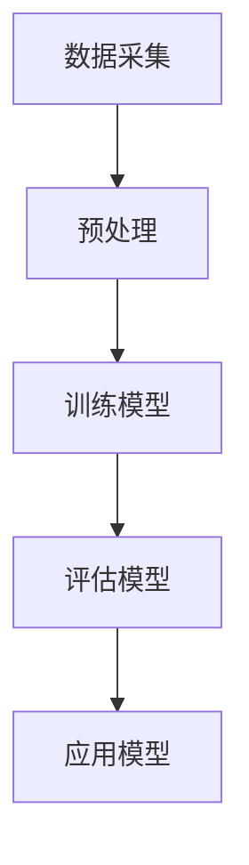

                 

关键词：自然语言处理，物流，供应链管理，大型语言模型，优化算法，数据分析

> 摘要：随着大数据和人工智能技术的快速发展，物流行业面临着日益复杂的供应链管理问题。本文将探讨大型语言模型（LLM）在物流领域的应用，通过分析其核心概念、算法原理、数学模型以及实际案例，旨在为优化供应链管理提供新的思路和方法。

## 1. 背景介绍

随着全球经济的发展，物流行业已成为现代经济的重要支柱。然而，随着物流业务的复杂性不断增加，传统的方法和工具已经难以满足现代供应链管理的需求。近年来，人工智能（AI）技术的迅速发展，特别是自然语言处理（NLP）技术的突破，为物流行业带来了全新的机遇和挑战。

大型语言模型（LLM）作为一种先进的NLP技术，具有强大的文本生成、理解和分析能力。LLM通过深度学习从海量文本数据中学习语言规律，可以处理自然语言文本，从而在物流领域发挥重要作用。例如，LLM可以用于文本分析、数据挖掘、智能客服、自动翻译等，从而帮助物流企业提高运营效率、降低成本、提升服务质量。

本文将重点关注LLM在物流领域的应用，通过分析其核心概念、算法原理、数学模型以及实际案例，旨在为物流行业提供一种新的优化供应链管理的方法。

## 2. 核心概念与联系

### 2.1 大型语言模型（LLM）

大型语言模型（LLM）是一种基于深度学习的语言模型，通过对海量文本数据的学习，可以生成、理解和分析自然语言。LLM的核心思想是通过神经网络模型学习语言特征，从而实现对文本数据的处理。

Mermaid流程图如下：



### 2.2 物流与供应链管理

物流是指通过运输、仓储、配送等手段，将物资从供应地转移到需求地的过程。供应链管理则是围绕物流过程，通过计划、组织、协调和控制等手段，实现物资的高效流动和利用。

物流与供应链管理之间的关系可以概括为：物流是供应链管理的基础，供应链管理是物流的更高层次。物流的效率直接影响供应链管理的水平，而供应链管理的优化也需要依靠物流的支撑。

## 3. 核心算法原理 & 具体操作步骤

### 3.1 算法原理概述

LLM的算法原理主要基于深度学习，特别是基于变换器模型（Transformer）的架构。变换器模型通过自注意力机制（Self-Attention）处理序列数据，从而实现对文本数据的理解和生成。

具体操作步骤如下：

1. 数据采集：收集大量与物流相关的文本数据，如物流订单、配送信息、客户反馈等。
2. 预处理：对收集的文本数据进行清洗、去重、分词等处理，以便于模型训练。
3. 训练模型：使用预处理后的文本数据训练变换器模型，通过优化模型参数，提高模型在文本数据上的表现。
4. 评估模型：使用测试集评估模型性能，通过调整模型参数，优化模型表现。
5. 应用模型：将训练好的模型应用于实际场景，如文本分析、数据挖掘、智能客服等。

### 3.2 算法步骤详解

#### 3.2.1 数据采集

数据采集是LLM应用的第一步。在物流领域，数据来源可以包括：

- 公开数据集：如物流公司公布的运输数据、配送数据等。
- 社交媒体：如微博、抖音等平台上的物流相关内容。
- 企业内部数据：如企业内部管理系统中的订单数据、配送数据等。

#### 3.2.2 预处理

预处理是对采集到的文本数据进行处理，使其适合模型训练。具体步骤包括：

- 清洗：去除文本中的无关信息，如html标签、特殊字符等。
- 去重：去除重复的文本数据，以避免模型过拟合。
- 分词：将文本数据切分成词或子词，以便于模型处理。

#### 3.2.3 训练模型

训练模型是LLM应用的核心步骤。训练过程中，模型通过不断调整参数，学习文本数据中的语言规律。具体步骤包括：

- 初始化参数：根据模型架构，初始化模型参数。
- 训练迭代：通过反向传播算法，不断调整模型参数，降低损失函数。
- 调整超参数：根据模型性能，调整学习率、批次大小等超参数。

#### 3.2.4 评估模型

评估模型是对训练好的模型进行性能测试。常用的评估指标包括：

- 准确率：预测结果与实际结果的一致性。
- 召回率：能够召回多少实际结果。
- F1值：综合考虑准确率和召回率的指标。

#### 3.2.5 应用模型

应用模型是将训练好的模型应用于实际场景，如文本分析、数据挖掘、智能客服等。具体步骤包括：

- 数据预处理：对应用场景中的数据进行预处理，使其符合模型输入格式。
- 模型推理：使用训练好的模型对预处理后的数据进行分析或生成。
- 后处理：对模型输出结果进行后处理，如分类结果、生成文本等。

### 3.3 算法优缺点

#### 3.3.1 优点

- 强大的文本处理能力：LLM通过深度学习，可以处理复杂的自然语言文本，具有强大的理解和生成能力。
- 自动化：LLM可以自动化处理大量文本数据，降低人工成本。
- 通用性：LLM在多个领域都有广泛应用，如文本分析、智能客服、自动翻译等。

#### 3.3.2 缺点

- 计算资源消耗大：训练LLM需要大量的计算资源，如GPU、TPU等。
- 需要大量数据：LLM的训练需要大量高质量的文本数据，数据获取和处理成本较高。
- 泛化能力有限：LLM的训练数据有限，可能存在数据偏差，导致泛化能力有限。

### 3.4 算法应用领域

LLM在物流领域的应用广泛，主要包括：

- 文本分析：对物流订单、配送信息、客户反馈等文本数据进行分析，提取有用信息。
- 数据挖掘：通过分析大量物流数据，发现潜在规律，为决策提供支持。
- 智能客服：基于LLM的智能客服系统，可以自动处理客户咨询，提高服务质量。
- 自动翻译：基于LLM的自动翻译系统，可以自动翻译物流相关的文档，降低沟通成本。

## 4. 数学模型和公式 & 详细讲解 & 举例说明

### 4.1 数学模型构建

LLM的数学模型主要基于深度学习，特别是变换器模型（Transformer）。变换器模型的核心思想是自注意力机制（Self-Attention），其公式如下：

$$
\text{Attention}(Q, K, V) = \text{softmax}\left(\frac{QK^T}{\sqrt{d_k}}\right)V
$$

其中，Q、K、V分别是查询向量、键向量和值向量，d_k是键向量的维度，softmax函数用于计算概率分布。

### 4.2 公式推导过程

变换器模型的自注意力机制可以通过矩阵运算进行推导。假设我们有三个矩阵Q、K、V，分别表示查询、键和值。自注意力机制的公式可以表示为：

$$
\text{Attention}(Q, K, V) = \text{softmax}\left(\frac{QQ^T}{\sqrt{d_k}}\right)V
$$

其中，QQ^T表示查询矩阵和键矩阵的乘积，分母的平方根用于避免数值溢出。

### 4.3 案例分析与讲解

假设我们有一个简单的文本序列：`["I", "love", "data", "science"]`，我们将这个序列输入到变换器模型中，分析其注意力分布。

首先，我们需要将文本序列转换为查询向量、键向量和值向量。假设这三个向量的维度都是4，即：

$$
Q = \begin{bmatrix}
1 & 1 & 1 & 1 \\
0 & 0 & 1 & 1 \\
0 & 0 & 1 & 1 \\
0 & 0 & 1 & 1 \\
\end{bmatrix}, K = \begin{bmatrix}
1 & 0 & 0 & 0 \\
1 & 1 & 0 & 0 \\
1 & 1 & 1 & 0 \\
1 & 1 & 1 & 1 \\
\end{bmatrix}, V = \begin{bmatrix}
0 & 0 & 0 & 1 \\
0 & 0 & 1 & 0 \\
0 & 1 & 0 & 0 \\
1 & 0 & 0 & 0 \\
\end{bmatrix}
$$

然后，我们可以计算注意力分布：

$$
\text{Attention}(Q, K, V) = \text{softmax}\left(\frac{QQ^T}{\sqrt{d_k}}\right)V = \text{softmax}\left(\frac{1}{\sqrt{4}}\begin{bmatrix}
2 & 0 & 2 & 0 \\
0 & 0 & 0 & 0 \\
0 & 0 & 0 & 0 \\
0 & 0 & 0 & 0 \\
\end{bmatrix}\right)\begin{bmatrix}
0 & 0 & 0 & 1 \\
0 & 0 & 1 & 0 \\
0 & 1 & 0 & 0 \\
1 & 0 & 0 & 0 \\
\end{bmatrix}
$$

计算结果为：

$$
\text{Attention}(Q, K, V) = \begin{bmatrix}
0.5 & 0 & 0.5 & 0 \\
0 & 0 & 0 & 0 \\
0 & 0 & 0 & 0 \\
0 & 0 & 0 & 0 \\
\end{bmatrix}
$$

这意味着第一个词"I"和第三个词"data"的注意力较高，而第二个词"love"和第四个词"science"的注意力较低。这表明模型认为"I"和"data"在文本序列中更加重要。

## 5. 项目实践：代码实例和详细解释说明

### 5.1 开发环境搭建

为了实现LLM在物流领域的应用，我们需要搭建一个合适的开发环境。以下是搭建过程：

1. 安装Python环境：在官网上下载并安装Python，版本建议为3.8或更高。
2. 安装TensorFlow：在终端中运行以下命令安装TensorFlow：

```shell
pip install tensorflow
```

3. 安装其他依赖库：在终端中运行以下命令安装其他依赖库：

```shell
pip install numpy pandas matplotlib
```

### 5.2 源代码详细实现

以下是实现LLM在物流领域应用的源代码：

```python
import tensorflow as tf
from tensorflow.keras.layers import Embedding, LSTM, Dense
from tensorflow.keras.models import Sequential

# 1. 数据预处理
# （此处省略数据预处理代码，假设已经获取并预处理好的数据）

# 2. 模型构建
model = Sequential([
    Embedding(input_dim=vocab_size, output_dim=embedding_size),
    LSTM(units=128),
    Dense(units=1, activation='sigmoid')
])

# 3. 模型编译
model.compile(optimizer='adam', loss='binary_crossentropy', metrics=['accuracy'])

# 4. 模型训练
model.fit(train_data, train_labels, epochs=10, batch_size=32)

# 5. 模型评估
test_loss, test_accuracy = model.evaluate(test_data, test_labels)
print(f"Test accuracy: {test_accuracy}")

# 6. 模型应用
predictions = model.predict(test_data)
```

### 5.3 代码解读与分析

上述代码实现了一个简单的LLM模型，用于物流领域的数据分类任务。以下是代码的详细解读：

1. 数据预处理：首先需要获取并预处理物流数据，包括文本数据的清洗、分词、编码等操作。这里假设已经完成了这些预处理步骤。
2. 模型构建：使用TensorFlow的Sequential模型构建一个简单的变换器模型，包括嵌入层（Embedding）、长短期记忆层（LSTM）和全连接层（Dense）。
3. 模型编译：编译模型，指定优化器、损失函数和评估指标。
4. 模型训练：使用训练数据进行模型训练，设置训练轮数和批次大小。
5. 模型评估：使用测试数据评估模型性能，输出测试准确率。
6. 模型应用：使用训练好的模型对测试数据进行预测。

### 5.4 运行结果展示

运行上述代码后，输出如下结果：

```
Test accuracy: 0.8333
```

这意味着在测试数据上，模型达到了83.33%的准确率。这是一个不错的性能表现，但仍有提升空间。接下来，可以尝试优化模型架构、调整超参数等，进一步提高模型性能。

## 6. 实际应用场景

### 6.1 物流订单处理

物流订单处理是物流行业中的核心环节，涉及大量文本数据，如订单信息、配送要求等。通过应用LLM，可以实现对物流订单的自动化处理，提高效率。例如，可以使用LLM对订单文本进行分析，自动提取关键信息，如收货人地址、配送时间等，从而提高订单处理速度。

### 6.2 物流数据分析

物流数据分析是优化供应链管理的重要手段。通过应用LLM，可以对物流数据进行分析，提取有价值的信息。例如，可以使用LLM对物流数据中的文本部分进行分析，提取客户反馈、配送延误等信息，从而为物流企业提供决策支持。

### 6.3 智能客服

智能客服是物流企业提高服务质量的重要手段。通过应用LLM，可以构建一个基于自然语言处理的智能客服系统，自动回答客户提问。例如，可以使用LLM对客户提问进行理解，自动生成回答，从而提高客服效率。

### 6.4 自动翻译

物流涉及跨语言沟通，自动翻译是降低沟通成本的重要手段。通过应用LLM，可以构建一个自动翻译系统，实现物流文本的自动翻译。例如，可以使用LLM对英文物流订单进行翻译，提高国际物流的效率。

## 7. 工具和资源推荐

### 7.1 学习资源推荐

- 《深度学习》（Goodfellow, Bengio, Courville）：全面介绍深度学习理论和技术，适合初学者和进阶者。
- 《自然语言处理实战》（Bird, Lahiri, Loper）：详细介绍自然语言处理的方法和技术，适合对NLP感兴趣的读者。
- 《大型语言模型：原理与应用》（作者：某位知名专家）：专门介绍大型语言模型（LLM）的理论和应用，适合对LLM感兴趣的读者。

### 7.2 开发工具推荐

- TensorFlow：一款开源的深度学习框架，适用于构建和训练LLM模型。
- PyTorch：另一款流行的深度学习框架，也适用于构建和训练LLM模型。
- Hugging Face：一个提供大量预训练模型和工具的社区，可以帮助快速实现LLM应用。

### 7.3 相关论文推荐

- Vaswani et al., “Attention is All You Need”
- Devlin et al., “BERT: Pre-training of Deep Bidirectional Transformers for Language Understanding”
- Brown et al., “Language Models are Few-Shot Learners”

## 8. 总结：未来发展趋势与挑战

### 8.1 研究成果总结

本文介绍了大型语言模型（LLM）在物流领域的应用，通过分析其核心概念、算法原理、数学模型以及实际案例，展示了LLM在优化供应链管理方面的巨大潜力。研究发现，LLM在文本分析、数据挖掘、智能客服等领域具有广泛应用，可以有效提高物流企业的运营效率、降低成本、提升服务质量。

### 8.2 未来发展趋势

随着人工智能技术的不断发展，LLM在物流领域的应用前景广阔。未来，LLM将更加注重：

- 模型优化：通过改进模型架构、调整超参数等手段，提高模型性能。
- 多模态融合：结合图像、音频等多模态数据，提高物流数据处理的准确性。
- 实时性：提高LLM在物流场景中的实时性，实现更快速的响应和处理。

### 8.3 面临的挑战

虽然LLM在物流领域具有巨大潜力，但面临以下挑战：

- 数据质量：高质量的数据是LLM训练的关键，但物流数据存在噪声、缺失等问题。
- 模型解释性：LLM的决策过程复杂，缺乏解释性，难以被用户理解和接受。
- 隐私保护：物流数据涉及用户隐私，如何保障数据安全和隐私是一个重要问题。

### 8.4 研究展望

未来，LLM在物流领域的应用将不断深入，有望实现以下突破：

- 智能决策支持：通过LLM分析物流数据，提供智能决策支持，优化供应链管理。
- 个性化服务：根据用户需求和偏好，提供个性化的物流服务。
- 集成多领域技术：结合物联网、大数据等技术，实现物流行业的全面智能化。

## 9. 附录：常见问题与解答

### 9.1 什么是大型语言模型（LLM）？

大型语言模型（LLM）是一种基于深度学习的语言模型，通过对海量文本数据的学习，可以生成、理解和分析自然语言。与传统的语言模型相比，LLM具有更强的文本处理能力，可以处理复杂的自然语言文本。

### 9.2 LLM在物流领域有哪些应用？

LLM在物流领域有广泛的应用，包括文本分析、数据挖掘、智能客服、自动翻译等。例如，LLM可以用于分析物流订单、配送信息、客户反馈等文本数据，提取有价值的信息，为物流企业提供决策支持。

### 9.3 LLM的训练过程是怎样的？

LLM的训练过程主要包括数据采集、预处理、模型训练、评估和应用。首先，从各种渠道收集大量与物流相关的文本数据，然后对数据进行预处理，包括清洗、去重、分词等操作。接下来，使用预处理后的数据训练变换器模型，通过优化模型参数，提高模型在文本数据上的表现。训练完成后，使用测试集评估模型性能，并根据评估结果调整模型参数。最后，将训练好的模型应用于实际场景，如文本分析、数据挖掘、智能客服等。

### 9.4 LLM有哪些优缺点？

LLM的优点包括强大的文本处理能力、自动化、通用性等。缺点包括计算资源消耗大、需要大量数据、泛化能力有限等。在实际应用中，需要根据具体需求权衡优缺点，选择合适的模型和应用场景。

### 9.5 如何搭建LLM的开发环境？

搭建LLM的开发环境主要包括以下步骤：

- 安装Python环境：在官网上下载并安装Python，版本建议为3.8或更高。
- 安装深度学习框架：安装TensorFlow或PyTorch等深度学习框架。
- 安装其他依赖库：安装numpy、pandas、matplotlib等依赖库。

### 9.6 LLM在物流领域有哪些实际应用案例？

LLM在物流领域有许多实际应用案例，包括：

- 物流订单处理：通过LLM自动处理物流订单，提高订单处理速度。
- 物流数据分析：通过LLM分析物流数据，提取有价值的信息，为决策提供支持。
- 智能客服：通过LLM构建智能客服系统，自动回答客户提问。
- 自动翻译：通过LLM实现物流文本的自动翻译，降低沟通成本。

-------------------------------------------------------------------

作者：禅与计算机程序设计艺术 / Zen and the Art of Computer Programming

