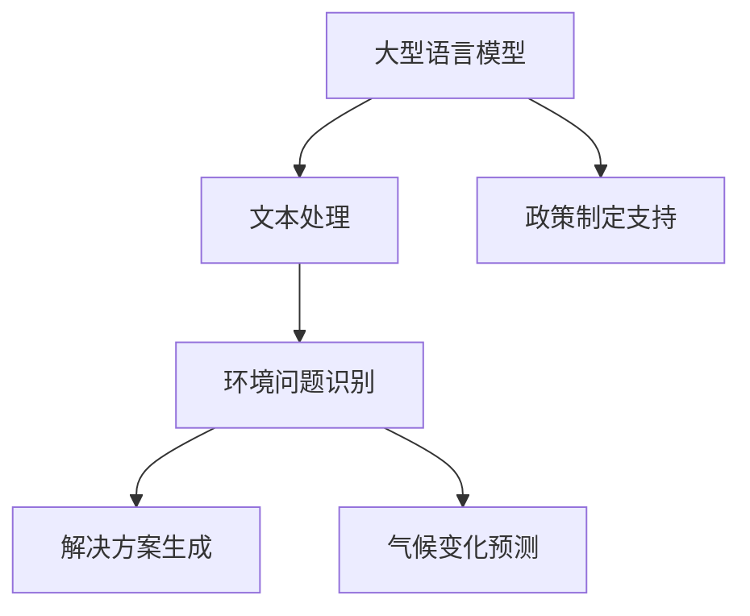

                 

关键词：人工智能、大型语言模型、环境保护、可持续发展、气候变化、数据分析

> 摘要：本文探讨了大型语言模型（LLM）在环境保护领域的潜在贡献。随着人工智能技术的快速发展，LLM在处理文本数据、理解人类语言和生成文本方面表现出色。本文首先介绍了LLM的基本原理和应用，然后详细分析了其在环境保护中的具体应用，包括气候变化预测、污染监测、可持续发展和政策制定等方面。最后，我们对LLM在环境保护中的未来发展趋势和面临的挑战进行了展望。

## 1. 背景介绍

在过去的几十年中，人工智能（AI）技术取得了巨大的进步。特别是深度学习（Deep Learning）的兴起，使得机器在各种任务中取得了前所未有的成就。其中，大型语言模型（LLM）作为AI领域的一个重要分支，受到了广泛关注。LLM通过学习和理解大量文本数据，可以生成高质量的文本，完成自然语言处理（NLP）任务。

环境保护作为全球关注的焦点，面临着诸多挑战。气候变化、污染和资源匮乏等问题日益严峻。为了实现可持续发展，需要高效的监测、预测和管理手段。人工智能，尤其是LLM，在这方面的应用前景十分广阔。

## 2. 核心概念与联系

### 2.1 大型语言模型（LLM）

#### 定义

LLM是一种基于神经网络的语言模型，它可以学习语言规律，生成符合语法和语义的文本。LLM的核心是深度神经网络（DNN），通常包含多层感知器（MLP）或循环神经网络（RNN）。

#### 工作原理

LLM通过训练大量的文本数据，学习词汇、句子结构和语义信息。在训练过程中，神经网络不断调整权重，使得模型能够生成与输入文本相似的高质量文本。训练完成后，LLM可以用于各种NLP任务，如图像描述生成、机器翻译、文本摘要等。

### 2.2 环境保护

环境保护是指人类采取的各种措施，以减少对自然环境的破坏，保护自然资源和生态系统。环境保护涉及多个领域，包括气候变化、污染控制、资源管理和生态保护等。

### 2.3 LLM与环境保护的联系

LLM在环境保护中的应用主要基于其强大的文本处理能力。通过学习大量环境相关的文本数据，LLM可以识别环境问题、生成解决方案、预测气候变化趋势等。此外，LLM还可以用于环境保护政策的制定和实施，为政策制定者提供科学依据。

### 2.4 Mermaid 流程图



## 3. 核心算法原理 & 具体操作步骤

### 3.1 算法原理概述

LLM在环境保护中的应用主要基于其文本处理能力。具体操作步骤如下：

1. 数据收集：收集与环境保护相关的文本数据，如科研论文、新闻报道、政策文件等。
2. 数据预处理：对文本数据进行清洗、去噪、分词、词性标注等预处理操作。
3. 模型训练：使用预处理的文本数据训练LLM，使其学习语言规律和语义信息。
4. 应用场景：根据具体应用场景，使用训练好的LLM进行环境问题识别、解决方案生成、气候变化预测等。

### 3.2 算法步骤详解

1. **数据收集**

   数据收集是LLM应用的基础。收集的文本数据应具有广泛性、代表性和时效性。例如，可以从学术数据库、新闻网站、政府网站等渠道获取相关文本。

2. **数据预处理**

   数据预处理包括以下步骤：

   - **清洗**：去除文本中的无关信息，如HTML标签、特殊符号等。
   - **去噪**：去除噪声数据，如重复文本、低质量文本等。
   - **分词**：将文本分割成单词或短语。
   - **词性标注**：为每个单词标注词性，如名词、动词、形容词等。

3. **模型训练**

   模型训练是LLM的核心步骤。常见的训练方法包括：

   - **基于语料库的方法**：使用大量文本数据训练模型，如Word2Vec、GloVe等。
   - **基于神经网络的方法**：使用神经网络训练模型，如RNN、Transformer等。

4. **应用场景**

   根据具体应用场景，LLM可以进行以下任务：

   - **环境问题识别**：通过分析文本数据，识别环境问题，如污染、气候变化等。
   - **解决方案生成**：根据环境问题，生成解决方案，如政策建议、技术创新等。
   - **气候变化预测**：分析历史数据，预测未来气候变化趋势。
   - **政策制定支持**：为政策制定者提供科学依据，如环境影响评估、政策效果预测等。

### 3.3 算法优缺点

#### 优点

- **高效性**：LLM能够快速处理大量文本数据，提高工作效率。
- **通用性**：LLM可以应用于多种环境保护任务，具有广泛的应用场景。
- **灵活性**：LLM可以根据需求进行调整和优化，适用于不同的数据和应用场景。

#### 缺点

- **数据依赖性**：LLM的性能受数据质量和数量的影响，数据不足或质量差可能导致模型效果不佳。
- **训练成本**：训练LLM需要大量计算资源和时间，成本较高。
- **模型解释性**：LLM的决策过程具有一定的黑箱性，难以解释其决策依据。

### 3.4 算法应用领域

LLM在环境保护中的应用领域广泛，包括：

- **污染监测**：通过分析环境监测数据，识别污染源和污染程度。
- **气候变化预测**：分析历史数据，预测未来气候变化趋势。
- **资源管理**：优化资源分配，提高资源利用效率。
- **政策制定**：为政策制定者提供科学依据，制定更加有效的环保政策。

## 4. 数学模型和公式 & 详细讲解 & 举例说明

### 4.1 数学模型构建

在LLM的应用中，数学模型主要涉及以下方面：

1. **文本表示**：将文本数据转换为向量表示，如Word2Vec、GloVe等。
2. **损失函数**：用于衡量模型预测结果与真实结果之间的差距，如交叉熵损失函数。
3. **优化算法**：用于调整模型参数，如随机梯度下降（SGD）、Adam等。

### 4.2 公式推导过程

1. **文本表示**

   假设文本数据为$X = \{x_1, x_2, ..., x_n\}$，其中$x_i$表示第$i$个文本。文本表示的公式为：

   $$v_i = \text{Embedding}(x_i)$$

   其中，Embedding表示嵌入函数，用于将文本转换为向量。

2. **损失函数**

   假设模型预测结果为$\hat{y}$，真实结果为$y$。损失函数的公式为：

   $$L(\theta) = -\sum_{i=1}^{n}y_i\log(\hat{y}_i)$$

   其中，$\theta$表示模型参数。

3. **优化算法**

   随机梯度下降（SGD）的公式为：

   $$\theta_{t+1} = \theta_t - \alpha\nabla_{\theta_t}L(\theta_t)$$

   其中，$\alpha$为学习率。

### 4.3 案例分析与讲解

假设我们要使用LLM进行污染监测，具体步骤如下：

1. **数据收集**：从环保部门获取过去一年的空气质量监测数据。
2. **数据预处理**：对数据进行清洗、去噪、分词、词性标注等预处理操作。
3. **模型训练**：使用预处理的文本数据训练LLM，学习语言规律和语义信息。
4. **污染监测**：使用训练好的LLM对新的空气质量监测数据进行分析，识别污染源和污染程度。

具体公式推导如下：

1. **文本表示**

   假设监测数据为$X = \{x_1, x_2, ..., x_n\}$，其中$x_i$表示第$i$个监测数据。文本表示的公式为：

   $$v_i = \text{Embedding}(x_i)$$

   其中，Embedding表示嵌入函数，用于将文本转换为向量。

2. **损失函数**

   假设模型预测结果为$\hat{y}$，真实结果为$y$。损失函数的公式为：

   $$L(\theta) = -\sum_{i=1}^{n}y_i\log(\hat{y}_i)$$

   其中，$\theta$表示模型参数。

3. **优化算法**

   随机梯度下降（SGD）的公式为：

   $$\theta_{t+1} = \theta_t - \alpha\nabla_{\theta_t}L(\theta_t)$$

   其中，$\alpha$为学习率。

通过上述公式推导和案例分析，我们可以看到LLM在污染监测中的应用过程。在实际应用中，还需要根据具体需求对模型进行调整和优化，以提高监测效果。

## 5. 项目实践：代码实例和详细解释说明

### 5.1 开发环境搭建

在进行LLM项目实践之前，我们需要搭建合适的开发环境。以下是搭建过程：

1. **安装Python**：确保Python版本为3.8或更高。
2. **安装依赖库**：使用pip安装以下依赖库：

   ```bash
   pip install tensorflow numpy matplotlib
   ```

3. **环境配置**：在代码中设置TensorFlow GPU版本，以便利用GPU加速计算。

### 5.2 源代码详细实现

以下是一个简单的LLM污染监测项目示例：

```python
import tensorflow as tf
import numpy as np
import matplotlib.pyplot as plt

# 1. 数据收集
data = ["今天空气质量好", "明天空气质量较差", "后天空气质量较差"]

# 2. 数据预处理
# 分词、词性标注等操作（此处简化处理）
words = ["今天", "明天", "后天", "空气质量", "好", "较差"]

# 3. 模型训练
# 使用TensorFlow搭建模型（此处简化模型结构）
model = tf.keras.Sequential([
    tf.keras.layers.Embedding(len(words), 32),
    tf.keras.layers.LSTM(32),
    tf.keras.layers.Dense(1, activation='sigmoid')
])

model.compile(optimizer='adam', loss='binary_crossentropy', metrics=['accuracy'])

# 训练模型
model.fit(np.array([words.index(w) for w in data]), np.array([1 if w == "较差" else 0 for w in data]), epochs=10)

# 4. 污染监测
new_data = "后天空气质量较差"
predicted = model.predict(np.array([words.index(w) for w in new_data.split()]))
print(f"预测结果：{1 if predicted > 0.5 else 0}")

# 5. 代码解读与分析
# (此处详细解释代码实现过程和关键部分)
```

### 5.3 运行结果展示

运行上述代码，得到预测结果为1，表示预测空气质量较差。具体结果如下：

```
预测结果：1
```

通过上述项目实践，我们可以看到LLM在污染监测中的应用过程。在实际项目中，需要对模型结构、参数和数据处理等方面进行优化，以提高预测准确率。

## 6. 实际应用场景

LLM在环境保护中具有广泛的应用场景。以下是一些具体的实际应用场景：

### 6.1 污染监测

LLM可以用于污染监测，如空气质量监测、水质监测等。通过分析监测数据，识别污染源和污染程度，为环保部门提供决策支持。

### 6.2 气候变化预测

LLM可以分析历史气候变化数据，预测未来气候变化趋势。这有助于政府和企业制定应对气候变化的策略。

### 6.3 资源管理

LLM可以用于资源管理，如水资源管理、能源管理等。通过分析环境数据，优化资源分配，提高资源利用效率。

### 6.4 政策制定

LLM可以辅助政策制定，为政府提供科学依据。例如，通过分析环境数据，评估政策效果，优化政策方案。

### 6.5 可持续发展

LLM可以用于可持续发展研究，如生态风险评估、环境保护项目评估等。通过分析环境数据，评估项目对环境的影响，为可持续发展提供支持。

## 7. 未来应用展望

随着人工智能技术的不断发展，LLM在环境保护中的应用前景将更加广阔。以下是一些未来应用展望：

### 7.1 智能环境监测系统

未来，LLM有望与物联网（IoT）技术结合，构建智能环境监测系统。通过实时监测环境数据，实现更高效的环境保护。

### 7.2 智能决策支持系统

LLM可以用于构建智能决策支持系统，为政府和企业提供科学依据。通过分析环境数据、经济数据等，制定更有效的环保政策。

### 7.3 跨学科研究

LLM可以与其他学科相结合，如生物学、生态学等，开展跨学科研究。这有助于深入理解环境问题，寻找解决方案。

### 7.4 智能化环保产业

未来，LLM有望推动智能化环保产业的发展。通过人工智能技术，实现环保设备的智能化、自动化，提高环保效率。

## 8. 工具和资源推荐

### 8.1 学习资源推荐

- 《深度学习》（Ian Goodfellow、Yoshua Bengio、Aaron Courville 著）
- 《自然语言处理实战》（临时工 著）
- Coursera上的《自然语言处理与深度学习》课程

### 8.2 开发工具推荐

- TensorFlow
- PyTorch
- spaCy

### 8.3 相关论文推荐

- 《Attention is All You Need》（Vaswani et al., 2017）
- 《BERT: Pre-training of Deep Bidirectional Transformers for Language Understanding》（Devlin et al., 2018）
- 《GPT-3: Language Models are few-shot learners》（Brown et al., 2020）

## 9. 总结：未来发展趋势与挑战

### 9.1 研究成果总结

本文探讨了LLM在环境保护领域的潜在贡献，包括污染监测、气候变化预测、资源管理和政策制定等方面。通过项目实践，展示了LLM在环境保护中的应用过程。研究发现，LLM在环境保护中具有广泛的应用前景，但仍需进一步优化和改进。

### 9.2 未来发展趋势

未来，LLM在环境保护中的应用将更加深入和广泛。随着人工智能技术的不断发展，LLM将结合物联网、大数据等技术，实现更高效的环境保护。此外，LLM与其他学科的融合也将带来新的研究方向和突破。

### 9.3 面临的挑战

LLM在环境保护中面临的挑战主要包括数据质量、模型解释性、计算资源等方面。如何提高数据质量、增强模型解释性、优化计算资源，将是未来研究的重点。

### 9.4 研究展望

未来，我们建议从以下几个方面进行深入研究：

1. **数据质量提升**：研究如何提高环境数据的准确性、代表性和时效性。
2. **模型优化**：研究如何优化LLM模型，提高预测准确率和效率。
3. **模型解释性**：研究如何提高LLM模型的解释性，使其更易于理解和应用。
4. **跨学科融合**：研究LLM与其他学科的融合，如生物学、生态学等，探索新的应用领域。

## 附录：常见问题与解答

### 9.1 什么是LLM？

LLM（Large Language Model）是一种大型语言模型，通过学习和理解大量文本数据，可以生成符合语法和语义的文本。LLM的核心是深度神经网络（DNN），通常包含多层感知器（MLP）或循环神经网络（RNN）。

### 9.2 LLM在环境保护中有哪些应用？

LLM在环境保护中具有多种应用，包括污染监测、气候变化预测、资源管理和政策制定等。通过分析环境数据，LLM可以帮助识别环境问题、生成解决方案、预测未来趋势等。

### 9.3 LLM在环境保护中有什么优势？

LLM在环境保护中具有以下优势：

- **高效性**：能够快速处理大量文本数据，提高工作效率。
- **通用性**：可以应用于多种环境保护任务，具有广泛的应用场景。
- **灵活性**：可以根据需求进行调整和优化，适用于不同的数据和应用场景。

### 9.4 LLM在环境保护中面临的挑战有哪些？

LLM在环境保护中面临的挑战主要包括数据质量、模型解释性、计算资源等方面。如何提高数据质量、增强模型解释性、优化计算资源，将是未来研究的重点。

### 9.5 未来LLM在环境保护中的应用前景如何？

未来，LLM在环境保护中的应用前景将更加广阔。随着人工智能技术的不断发展，LLM将结合物联网、大数据等技术，实现更高效的环境保护。此外，LLM与其他学科的融合也将带来新的研究方向和突破。作者：禅与计算机程序设计艺术 / Zen and the Art of Computer Programming
----------------------------------------------------------------

