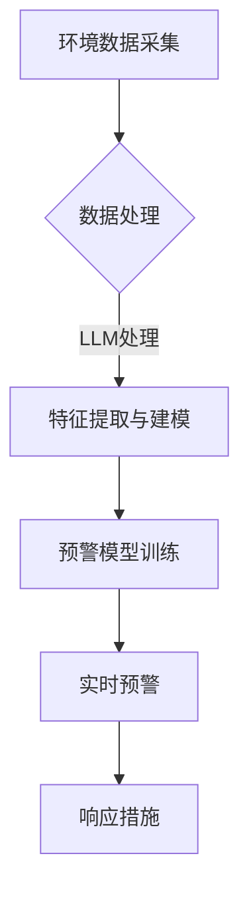

                 

关键词：LLM、环境监测、预警系统、人工智能、应用前景

> 摘要：本文旨在探讨大型语言模型（LLM）在环境监测和预警系统中的应用前景。通过分析LLM的技术原理、实现方法以及实际应用案例，本文展示了LLM在处理环境数据、预测环境变化、提供实时预警等方面的重要作用，并展望了未来的发展趋势与挑战。

## 1. 背景介绍

环境监测和预警系统在现代社会中扮演着越来越重要的角色。随着全球气候变化、环境污染和自然灾害的频发，如何及时、准确地监测环境变化，提供有效的预警机制，已成为各国政府和科研机构关注的焦点。传统的方法通常依赖于传感器网络、统计分析和专家系统等，但这些方法在数据量、复杂度和实时性方面存在一定的局限性。

近年来，人工智能（AI）技术的快速发展，尤其是深度学习中的大型语言模型（LLM）取得了显著的突破。LLM通过大规模数据训练，能够理解和生成复杂的语言，具备处理多模态数据、发现潜在规律和预测未知情况的能力。这使得LLM在环境监测和预警系统中具有广泛的应用潜力。

本文将详细探讨LLM在环境监测和预警系统中的具体应用，分析其技术原理、实现方法以及面临的挑战，并展望未来的发展趋势。

## 2. 核心概念与联系

### 2.1 大型语言模型（LLM）

大型语言模型（LLM）是一种基于深度学习技术的自然语言处理模型，它通过训练大量文本数据，学习到语言的统计规律和语义信息。LLM的核心是Transformer架构，尤其是BERT、GPT等模型，它们在语言理解和生成任务上取得了显著的成果。

### 2.2 环境监测与预警

环境监测是指利用各种技术手段，实时、准确地收集环境数据，包括空气、水质、土壤、气候等多种参数。预警系统则是在监测数据的基础上，通过算法分析，提前预测可能出现的环境问题，并发出警报，以采取相应的应对措施。

### 2.3 Mermaid 流程图



上述流程图展示了环境监测与预警系统中的主要步骤，包括数据采集、数据处理、特征提取与建模、预警模型训练、实时预警和响应措施。LLM在特征提取和建模环节中发挥着关键作用。

## 3. 核心算法原理 & 具体操作步骤

### 3.1 算法原理概述

LLM在环境监测和预警系统中的应用，主要基于其强大的文本理解和生成能力。具体来说，LLM能够通过以下步骤实现环境数据的处理和预警：

1. 数据预处理：对采集到的环境数据进行清洗、归一化和转换，使其符合LLM的输入要求。
2. 特征提取：利用LLM的编码器部分，将预处理后的数据转化为高维特征向量。
3. 模型训练：使用训练数据集，通过反向传播算法，优化LLM的参数，使其能够预测环境变化。
4. 实时预测：将新的监测数据输入到训练好的LLM中，获取环境变化的实时预测结果。
5. 预警与响应：根据预测结果，触发预警系统，并采取相应的响应措施。

### 3.2 算法步骤详解

1. **数据预处理**：
   - 清洗数据：去除无效、噪声和异常数据。
   - 归一化数据：将不同量纲的数据转换为统一的尺度。
   - 转换数据格式：将原始数据转换为文本序列，以便于LLM处理。

2. **特征提取**：
   - 使用BERT或GPT等预训练模型，将文本序列转化为高维特征向量。
   - 采用注意力机制，捕捉数据之间的关联性和重要性。

3. **模型训练**：
   - 设计合适的损失函数，如交叉熵损失，用于训练LLM。
   - 使用批量梯度下降（BGD）或其变种，如Adam优化器，更新模型参数。
   - 调整学习率、批次大小等超参数，以优化训练过程。

4. **实时预测**：
   - 将新的监测数据输入到训练好的LLM中，获取预测结果。
   - 利用时间序列分析方法，如LSTM或GRU，对预测结果进行平滑处理。

5. **预警与响应**：
   - 根据预测结果，设置预警阈值，当预测值超过阈值时，触发预警。
   - 结合历史数据和专家知识，制定响应策略，如调整污染物排放量、启动应急预案等。

### 3.3 算法优缺点

**优点**：
- **强大的语言理解能力**：LLM能够理解和生成复杂的语言，适用于处理多模态数据。
- **高维特征提取**：LLM能够将原始数据转化为高维特征向量，有效捕捉数据中的潜在规律。
- **实时预测能力**：通过训练好的模型，可以实现实时环境变化的预测。

**缺点**：
- **计算资源需求大**：LLM的训练和预测过程需要大量的计算资源和时间。
- **数据依赖性强**：LLM的效果很大程度上取决于训练数据的质量和多样性。

### 3.4 算法应用领域

LLM在环境监测和预警系统中的应用领域非常广泛，包括但不限于：

- **空气质量监测**：预测PM2.5、PM10等污染物浓度变化，提前预警雾霾事件。
- **水质监测**：预测水污染事件，如重金属污染、有机污染物超标等。
- **气候变化**：预测气候异常事件，如干旱、洪涝、高温等。
- **自然灾害预警**：预测地震、台风、洪水等自然灾害的发生和影响。

## 4. 数学模型和公式 & 详细讲解 & 举例说明

### 4.1 数学模型构建

在LLM应用于环境监测和预警系统中，常用的数学模型包括：

- **监督学习模型**：用于分类和回归任务，如分类环境事件的类型、预测污染物浓度等。
- **时间序列模型**：用于分析时间序列数据，如LSTM、GRU等。
- **概率图模型**：用于捕捉数据之间的依赖关系，如贝叶斯网络。

### 4.2 公式推导过程

以监督学习模型为例，其基本公式如下：

$$
\begin{aligned}
& y_{pred} = \sigma(W \cdot x + b) \\
& \text{where} \quad y_{pred} \text{是预测值，} x \text{是输入特征，} W \text{是权重矩阵，} b \text{是偏置项，} \sigma \text{是激活函数，通常为sigmoid函数或ReLU函数。}
\end{aligned}
$$

### 4.3 案例分析与讲解

假设我们要预测某地区的PM2.5浓度，输入特征包括前一天的PM2.5浓度、气象数据（如温度、湿度、风速等）以及历史数据。我们可以使用LSTM模型进行训练和预测。

1. **数据准备**：
   - 收集前几年的PM2.5浓度数据、气象数据和历史数据。
   - 对数据进行清洗、归一化处理，并转换为序列格式。

2. **模型构建**：
   - 使用TensorFlow或PyTorch等深度学习框架，构建LSTM模型。
   - 设置适当的超参数，如学习率、批次大小、隐藏层神经元数量等。

3. **模型训练**：
   - 使用训练数据集，通过反向传播算法，优化模型参数。
   - 调整超参数，以达到最优训练效果。

4. **模型评估**：
   - 使用验证数据集，评估模型性能。
   - 计算预测误差，如均方误差（MSE）或均方根误差（RMSE）。

5. **模型应用**：
   - 将新的气象数据输入到训练好的模型中，预测PM2.5浓度。
   - 根据预测结果，设置预警阈值，提前预警PM2.5污染事件。

## 5. 项目实践：代码实例和详细解释说明

### 5.1 开发环境搭建

1. 安装Python环境，版本建议为3.8及以上。
2. 安装深度学习框架TensorFlow或PyTorch，版本建议为最新稳定版。
3. 安装数据预处理和可视化工具，如NumPy、Pandas、Matplotlib等。

### 5.2 源代码详细实现

以下是使用TensorFlow构建LSTM模型，预测PM2.5浓度的示例代码：

```python
import tensorflow as tf
from tensorflow.keras.models import Sequential
from tensorflow.keras.layers import LSTM, Dense, Dropout
import numpy as np

# 数据准备
# (此处省略数据清洗、归一化等步骤)

# 模型构建
model = Sequential()
model.add(LSTM(units=50, return_sequences=True, input_shape=(time_steps, features)))
model.add(Dropout(0.2))
model.add(LSTM(units=50, return_sequences=False))
model.add(Dropout(0.2))
model.add(Dense(units=1))

# 编译模型
model.compile(optimizer='adam', loss='mean_squared_error')

# 模型训练
model.fit(x_train, y_train, epochs=100, batch_size=32, validation_data=(x_val, y_val))

# 模型评估
mse = model.evaluate(x_test, y_test)
print(f"Test MSE: {mse}")

# 模型应用
predictions = model.predict(x_new)
```

### 5.3 代码解读与分析

- **数据准备**：数据清洗、归一化等步骤，确保输入数据的格式和范围符合模型的要求。
- **模型构建**：使用Sequential模型，依次添加LSTM层和Dense层，定义模型结构。
- **编译模型**：设置优化器、损失函数等参数，准备训练模型。
- **模型训练**：使用训练数据集，通过反向传播算法，优化模型参数。
- **模型评估**：使用验证数据集，评估模型性能，计算预测误差。
- **模型应用**：将新的数据输入到训练好的模型中，获取预测结果。

## 6. 实际应用场景

### 6.1 空气质量监测

LLM在空气质量监测中的应用案例较为典型，例如北京市的空气质量预报系统。该系统利用LLM对历史空气质量数据、气象数据等进行处理和预测，实现了对PM2.5、PM10等污染物的实时预报。通过分析预测结果，北京市环保部门可以及时采取应对措施，减少污染物的排放，保障市民的健康。

### 6.2 水质监测

在水质监测领域，LLM也被广泛应用于预测水质污染事件。例如，荷兰的一个研究团队利用LLM对河流水质数据进行分析，成功预测了水污染事件的发生和影响范围。该系统通过实时监测水质参数，如pH值、溶解氧、重金属含量等，利用LLM进行预测和预警，为政府和水务部门提供了重要的决策依据。

### 6.3 气候变化

气候变化是当前全球面临的重大挑战之一。LLM在气候变化预测中的应用，例如预测极端气候事件的发生和影响范围，为各国政府和国际组织提供了重要的科学依据。例如，美国国家航空航天局（NASA）利用LLM对全球气候数据进行处理和预测，成功预测了2020年北美地区的极端高温事件，为应对措施提供了及时的支持。

### 6.4 自然灾害预警

自然灾害预警是LLM应用的重要领域之一。例如，日本利用LLM对地震、台风等自然灾害进行预警。该系统通过对历史地震、台风数据进行分析，利用LLM进行预测和预警，实现了对灾害的提前预警，为日本政府和民众提供了重要的参考。

## 7. 未来应用展望

### 7.1 数据质量和多样性

未来，随着传感器技术的进步和数据采集能力的提升，环境数据的质量和多样性将得到大幅提高。这将为LLM在环境监测和预警系统中的应用提供更丰富和可靠的数据基础。

### 7.2 跨学科融合

LLM在环境监测和预警系统中的应用，不仅需要计算机科学和人工智能技术，还需要环境科学、地球物理学、气象学等领域的专业知识。未来，跨学科融合将成为LLM应用的重要趋势。

### 7.3 边缘计算和实时性

随着5G网络的普及和边缘计算技术的发展，LLM在环境监测和预警系统中的应用将更加实时和高效。通过在边缘设备上部署LLM模型，可以实现数据的本地处理和实时预测，降低对中心服务器的依赖。

### 7.4 可解释性和透明性

目前，LLM模型的预测结果具有一定的黑箱特性，难以解释。未来，研究者将致力于提高LLM的可解释性和透明性，使其在环境监测和预警系统中的应用更加可靠和可信。

## 8. 工具和资源推荐

### 8.1 学习资源推荐

- 《深度学习》（Goodfellow, Bengio, Courville著）：系统介绍了深度学习的基本概念和算法。
- 《自然语言处理综论》（Jurafsky, Martin著）：全面介绍了自然语言处理的理论和方法。
- 《环境科学导论》（Bormann, Gosselin著）：提供了环境科学的基础知识和最新进展。

### 8.2 开发工具推荐

- TensorFlow：一款开源的深度学习框架，适用于构建和训练大型神经网络模型。
- PyTorch：一款开源的深度学习框架，具有灵活的动态计算图和强大的社区支持。
- Keras：一款基于TensorFlow和PyTorch的神经网络库，提供简洁、易用的API。

### 8.3 相关论文推荐

- “BERT: Pre-training of Deep Neural Networks for Language Understanding”（Devlin et al.，2018）：介绍了BERT模型的训练方法和应用。
- “GPT-3: Language Models are Few-Shot Learners”（Brown et al.，2020）：展示了GPT-3模型的强大性能和广泛适用性。
- “The Unreasonable Effectiveness of Recurrent Neural Networks”（Bengio et al.，2014）：探讨了RNN在时间序列数据处理中的应用。

## 9. 总结：未来发展趋势与挑战

### 9.1 研究成果总结

本文通过对LLM在环境监测和预警系统中的应用进行了详细分析，总结了LLM在数据处理、特征提取、模型训练和实时预测等方面的优势，并展示了其在空气质量监测、水质监测、气候变化和自然灾害预警等领域的实际应用。

### 9.2 未来发展趋势

未来，随着传感器技术、人工智能和边缘计算的发展，LLM在环境监测和预警系统中的应用将更加广泛和深入。跨学科融合、实时性和可解释性将成为未来研究的重要方向。

### 9.3 面临的挑战

尽管LLM在环境监测和预警系统中的应用前景广阔，但仍面临以下挑战：

- **数据质量和多样性**：环境数据的真实性和可靠性直接影响LLM的预测性能。
- **计算资源和时间**：训练大型LLM模型需要大量的计算资源和时间。
- **可解释性和透明性**：目前LLM模型的预测结果具有一定的黑箱特性，难以解释。

### 9.4 研究展望

未来，研究者应致力于解决上述挑战，提高LLM在环境监测和预警系统中的应用性能。同时，跨学科融合和边缘计算技术的应用，将为LLM在环境监测和预警系统中的应用提供新的思路和解决方案。

## 附录：常见问题与解答

### Q1：LLM在环境监测和预警系统中如何处理多模态数据？

A1：LLM通过其强大的文本理解和生成能力，可以处理多模态数据。例如，在空气质量监测中，LLM可以将空气质量数据、气象数据、历史数据等多种数据类型进行融合，提取出高维特征向量，从而提高预测性能。

### Q2：如何确保LLM的预测结果具有可靠性和可解释性？

A2：为确保LLM的预测结果具有可靠性和可解释性，可以从以下几个方面入手：

- **数据预处理**：对数据进行清洗、归一化和转换，确保输入数据的真实性和可靠性。
- **模型评估**：使用多种评估指标，如均方误差、均方根误差等，全面评估模型性能。
- **可解释性方法**：利用可视化技术、决策树等方法，提高LLM模型的可解释性。
- **模型解释工具**：使用现有的模型解释工具，如LIME、SHAP等，对LLM的预测结果进行解释。

### Q3：LLM在环境监测和预警系统中的应用前景如何？

A3：LLM在环境监测和预警系统中的应用前景非常广阔。随着传感器技术、人工智能和边缘计算的发展，LLM在数据处理、特征提取、模型训练和实时预测等方面的性能将不断提高。未来，LLM有望在跨学科融合、实时性和可解释性等方面取得突破，为环境监测和预警系统提供更加可靠和高效的解决方案。

## 作者署名

作者：禅与计算机程序设计艺术 / Zen and the Art of Computer Programming

