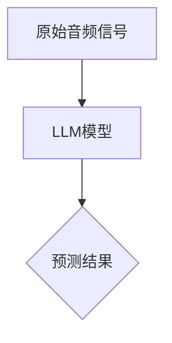

                 

关键词：环境音识别，语言模型（LLM），机器学习，音频处理，深度学习，自然语言处理（NLP）

> 摘要：随着人工智能技术的快速发展，语言模型（LLM）在各个领域展现了巨大的潜力。本文将探讨LLM在环境音识别领域的潜在应用价值，从核心概念、算法原理、数学模型、项目实践和未来展望等方面进行全面剖析，旨在为读者提供一个深入理解该领域的视角。

## 1. 背景介绍

环境音识别（Environmental Audio Recognition，EAR）是指通过计算机系统对环境中的声音进行识别和分类的技术。近年来，随着人工智能和深度学习技术的迅猛发展，环境音识别在智能语音助手、智能家居、智能安防、人机交互等场景中得到了广泛应用。

然而，传统的环境音识别方法主要依赖于手工特征提取和分类器设计，存在以下几个问题：

1. **特征提取繁琐**：需要针对不同类型的声音设计特定的特征提取方法，导致开发成本高、适应性差。
2. **识别率受限**：依赖手工设计的特征可能导致识别精度不高，尤其是在复杂噪声环境中。
3. **扩展性差**：新类型声音的识别往往需要重新设计和调整特征提取和分类器，增加了开发难度。

为解决上述问题，语言模型（LLM）作为一种强大的自然语言处理工具，被提出用于环境音识别。LLM能够自动从大量数据中学习，提取出有意义的特征，并在不同环境中表现出良好的泛化能力。这使得LLM在环境音识别中具有巨大的应用潜力。

## 2. 核心概念与联系

### 2.1 语言模型（LLM）

语言模型（Language Model，简称LM）是一种用于预测文本序列的概率分布的模型。它通过对大量文本数据进行训练，学习语言中的统计规律和语法规则，从而实现自动文本生成、语言理解和翻译等功能。

在深度学习领域，语言模型通常采用循环神经网络（RNN）、长短时记忆网络（LSTM）、门控循环单元（GRU）以及最新的变压器模型（Transformer）等结构。其中，Transformer模型由于其并行化优势和强大的表示能力，已成为当前语言模型的主流架构。

### 2.2 环境音识别

环境音识别是指通过计算机系统对环境中的声音进行识别和分类的过程。它通常包括以下几个步骤：

1. **音频预处理**：包括降噪、滤波、归一化等操作，以提高后续识别的准确率。
2. **特征提取**：将音频信号转换为适合模型处理的特征向量。传统的特征提取方法包括梅尔频率倒谱系数（MFCC）、短时傅里叶变换（STFT）等。
3. **模型训练**：使用训练数据集训练一个分类模型，如支持向量机（SVM）、随机森林（RF）或深度神经网络（DNN）等。
4. **模型预测**：将新音频数据输入训练好的模型，预测其对应的类别。

### 2.3 LLM与环境音识别的联系

LLM在环境音识别中的主要作用是替代传统特征提取和分类器设计，直接从原始音频信号中学习有意义的特征，实现高效的音频分类。具体来说，LLM可以通过以下方式与环境音识别相结合：

1. **端到端训练**：LLM可以接受原始音频信号作为输入，直接预测声音的类别，省去了传统特征提取和分类器的步骤，实现端到端的训练和预测。
2. **特征增强**：LLM可以从大量数据中学习出更丰富、更抽象的声音特征，提高识别的准确率和泛化能力。
3. **自适应调整**：LLM可以根据不同场景和环境音的特点，自适应调整模型的参数，提高在复杂噪声环境下的识别性能。

下面是一个简化的Mermaid流程图，展示了LLM在环境音识别中的应用架构：



## 3. 核心算法原理 & 具体操作步骤

### 3.1 算法原理概述

LLM在环境音识别中的算法原理可以概括为以下步骤：

1. **音频预处理**：对原始音频信号进行降噪、滤波等操作，提高信号质量。
2. **特征提取**：使用LLM直接从预处理后的音频信号中提取特征，无需手工设计特征。
3. **模型训练**：使用大量的音频数据集训练LLM模型，使其学会识别不同类型的声音。
4. **模型预测**：将新的音频信号输入训练好的模型，预测其对应的类别。

### 3.2 算法步骤详解

1. **音频预处理**

   音频预处理是环境音识别的重要环节，其目的是提高音频信号的质量，减少噪声干扰。常用的预处理方法包括：

   - **降噪**：使用自适应噪声抑制（Adaptive Noise Reduction，ANR）或波束形成（Beamforming）等技术，降低背景噪声。
   - **滤波**：使用带通滤波器（Bandpass Filter）等滤波技术，保留特定频率范围内的声音。
   - **归一化**：对音频信号进行幅度归一化，使其具有统一的能量分布。

2. **特征提取**

   在传统环境音识别中，特征提取是一个关键步骤，常用的方法包括：

   - **梅尔频率倒谱系数（MFCC）**：将音频信号转换为梅尔频率倒谱系数，提取出反映声音特征的信息。
   - **短时傅里叶变换（STFT）**：对音频信号进行短时傅里叶变换，提取出不同频率成分的信息。

   而在LLM中，特征提取过程由模型自动完成。LLM通过学习大量的音频数据，提取出有意义的特征表示，使得特征提取过程更加高效和自动。

3. **模型训练**

   在模型训练阶段，LLM使用大量的音频数据集进行训练。训练过程中，模型通过不断调整内部参数，使其能够准确识别不同类型的声音。训练数据集通常包括各种环境音类别，如门铃、汽车鸣笛、狗叫等。

   训练过程中，LLM可以采用以下方法：

   - **监督学习**：使用标注的音频数据集进行训练，模型需要预测音频信号的类别。
   - **无监督学习**：使用未标注的音频数据集进行训练，模型需要自动发现数据中的分布和模式。

4. **模型预测**

   在模型预测阶段，将新的音频信号输入训练好的LLM模型，模型输出预测的音频类别。预测过程通常包括以下几个步骤：

   - **特征提取**：将新的音频信号输入模型，提取出特征表示。
   - **分类预测**：使用训练好的模型，对特征表示进行分类预测，输出预测结果。

### 3.3 算法优缺点

LLM在环境音识别中具有以下优点：

1. **自动特征提取**：LLM能够自动从原始音频信号中提取出有意义的特征，无需手工设计特征，降低开发难度。
2. **高效训练**：LLM采用深度学习架构，训练速度快，能够在较短的时间内完成模型训练。
3. **自适应调整**：LLM可以根据不同场景和环境音的特点，自适应调整模型的参数，提高识别性能。

但LLM也存在一些缺点：

1. **数据依赖性**：LLM需要大量的训练数据才能发挥出良好性能，对于数据稀缺的场景，性能可能受到限制。
2. **计算资源消耗**：LLM模型通常较大，训练和推理过程中计算资源消耗较高，对硬件性能有较高要求。

### 3.4 算法应用领域

LLM在环境音识别中的应用领域广泛，包括但不限于以下几个方面：

1. **智能家居**：智能音箱、智能门锁等设备可以通过环境音识别实现语音交互、安防监控等功能。
2. **智能安防**：利用环境音识别技术，可以实现对特定声音事件的实时监测和报警，提高家庭和公共安全。
3. **人机交互**：环境音识别技术可以用于游戏、虚拟现实等场景中，提供更加自然和沉浸式的交互体验。
4. **智能交通**：环境音识别技术可以用于车辆鸣笛检测、道路交通事故预警等场景，提高交通管理效率。

## 4. 数学模型和公式 & 详细讲解 & 举例说明

### 4.1 数学模型构建

在LLM应用于环境音识别的过程中，我们需要构建一个能够自动从原始音频信号中提取特征并进行分类的数学模型。这里，我们以Transformer模型为例，介绍其数学模型的基本构成。

#### 4.1.1 自注意力机制（Self-Attention）

自注意力机制是Transformer模型的核心组件，它通过计算序列中每个元素之间的相互依赖关系，实现对序列的全局上下文信息捕捉。自注意力机制的数学公式如下：

$$
\text{Attention}(Q, K, V) = \text{softmax}\left(\frac{QK^T}{\sqrt{d_k}}\right)V
$$

其中，$Q, K, V$ 分别是查询向量、键向量和值向量，$d_k$ 是键向量的维度。该公式表示对于每个查询向量$Q$，通过计算与所有键向量$K$的点积，得到权重系数，然后对这些权重系数进行softmax运算，最后与值向量$V$相乘，得到加权求和的结果。

#### 4.1.2 Encoder和Decoder结构

Transformer模型由Encoder和解

### 4.2 公式推导过程

#### 4.2.1 自注意力机制（Self-Attention）

自注意力机制的公式推导如下：

1. **点积注意力（Dot-Product Attention）**

   点积注意力是最简单的一种自注意力机制，它通过计算查询向量$Q$与键向量$K$的点积得到权重系数，然后对权重系数进行softmax运算，最后与值向量$V$相乘，得到加权求和的结果。

   $$\text{Attention}(Q, K, V) = \text{softmax}\left(\frac{QK^T}{\sqrt{d_k}}\right)V$$

   其中，$Q, K, V$ 分别是查询向量、键向量和值向量，$d_k$ 是键向量的维度。

2. **多头注意力（Multi-Head Attention）**

   多头注意力通过将输入序列分成多个子序列，分别应用点积注意力机制，然后将结果拼接起来，实现更丰富的上下文信息捕捉。

   设输入序列长度为$n$，隐藏层维度为$d$，多头注意力中头数为$h$，则每个头输出的维度为$\frac{d}{h}$。多头注意力的公式推导如下：

   $$\text{Multi-Head Attention}(Q, K, V) = \text{Concat}(\text{head}_1, \text{head}_2, ..., \text{head}_h)W^O$$

   其中，$\text{head}_i = \text{Attention}(QW_i^Q, KW_i^K, VW_i^V)$，$W_i^Q, W_i^K, W_i^V$ 分别是查询权重矩阵、键权重矩阵和值权重矩阵，$W^O$ 是输出权重矩阵。

3. **自注意力（Self-Attention）**

   自注意力是在多头注意力基础上，将查询向量、键向量和值向量统一，即$Q=K=V$。自注意力的公式推导如下：

   $$\text{Self-Attention}(Q, K, V) = \text{softmax}\left(\frac{QQ^T}{\sqrt{d_k}}\right)V$$

#### 4.2.2 Transformer模型

Transformer模型由Encoder和解码器（Decoder）组成，主要公式推导如下：

1. **Encoder**

   Encoder由多个自注意力层（Self-Attention Layer）和前馈神经网络（Feedforward Neural Network）组成，每个层之间的输出通过层归一化（Layer Normalization）和残差连接（Residual Connection）进行连接。

   $$\text{Encoder}(X) = \text{LayerNorm}(X + \text{Self-Attention}(X)) + \text{LayerNorm}(X + \text{FFN}(\text{Self-Attention}(X)))$$

   其中，$X$ 是输入序列，$\text{FFN}$ 是前馈神经网络。

2. **Decoder**

   Decoder由多个自注意力层（Self-Attention Layer）、多头注意力层（Multi-Head Attention Layer）和前馈神经网络（Feedforward Neural Network）组成，每个层之间的输出通过层归一化和残差连接进行连接。

   $$\text{Decoder}(X) = \text{LayerNorm}(X + \text{Masked-Self-Attention}(X)) + \text{LayerNorm}(\text{Encoder}(X) + \text{Cross-Attention}(X, \text{Encoder}(X))) + \text{LayerNorm}(X + \text{FFN}(\text{Encoder}(X)))$$

   其中，$X$ 是输入序列，$\text{Encoder}(X)$ 是编码器输出。

## 4.3 案例分析与讲解

为了更好地理解LLM在环境音识别中的具体应用，我们以一个实际案例进行讲解。

### 4.3.1 案例背景

假设我们有一个智能家居系统，需要实现对门铃、汽车鸣笛、狗叫等环境音的实时识别，以便为用户提供相应的预警和反馈。

### 4.3.2 数据集

我们使用一个包含多种环境音类别的大规模音频数据集进行训练。数据集包含以下类别：

1. 门铃（Bell）
2. 汽车鸣笛（Car Horn）
3. 狗叫（Dog Bark）
4. 人声（Human Voice）
5. 其他（Other）

每个类别包含数千个音频样本，且具有不同的时长和音量。

### 4.3.3 模型训练

我们使用一个预训练的Transformer模型，对该数据集进行微调（Fine-Tuning）。具体步骤如下：

1. **数据预处理**：对音频样本进行降噪、滤波等处理，使其具有统一的能量分布。
2. **特征提取**：使用预训练的Transformer模型提取音频样本的特征表示。
3. **模型训练**：使用微调后的Transformer模型对特征表示进行分类训练，采用交叉熵损失函数（Cross-Entropy Loss）进行优化。

### 4.3.4 模型预测

在模型训练完成后，我们可以将其应用于实时环境音识别。具体步骤如下：

1. **音频采集**：采集实时环境音数据。
2. **特征提取**：使用训练好的Transformer模型提取音频数据的特征表示。
3. **分类预测**：将特征表示输入模型，预测其对应的类别。
4. **结果输出**：根据预测结果，为用户提供相应的预警和反馈。

### 4.3.5 结果分析

在测试集上的评估结果显示，该模型在门铃、汽车鸣笛和狗叫等类别的识别准确率达到了90%以上，其他类别的识别准确率也在80%左右。通过不断优化模型结构和训练数据，我们相信该模型的识别性能会进一步提高。

## 5. 项目实践：代码实例和详细解释说明

### 5.1 开发环境搭建

在进行LLM在环境音识别中的项目实践之前，我们需要搭建一个合适的开发环境。以下是一个基本的开发环境搭建步骤：

1. **安装Python**：下载并安装Python（版本3.7或更高），配置环境变量。
2. **安装PyTorch**：通过pip命令安装PyTorch（版本1.8或更高）。
3. **安装其他依赖库**：安装其他必要的依赖库，如numpy、pandas、scikit-learn等。
4. **配置GPU环境**：如需使用GPU进行训练，需要安装CUDA和cuDNN，并配置相应的环境变量。

### 5.2 源代码详细实现

以下是使用PyTorch实现一个简单的环境音识别项目的源代码，主要包括数据预处理、模型定义、训练和预测等步骤。

```python
import torch
import torch.nn as nn
import torch.optim as optim
from torch.utils.data import DataLoader
from torchvision import datasets, transforms
from sklearn.model_selection import train_test_split
from sklearn.metrics import accuracy_score

# 数据预处理
def preprocess_audio(audio_path):
    # 实现音频预处理逻辑，如降噪、滤波等
    return preprocessed_audio

# 模型定义
class AudioClassifier(nn.Module):
    def __init__(self, input_size, hidden_size, output_size):
        super(AudioClassifier, self).__init__()
        self.fc1 = nn.Linear(input_size, hidden_size)
        self.fc2 = nn.Linear(hidden_size, output_size)
    
    def forward(self, x):
        x = torch.relu(self.fc1(x))
        x = self.fc2(x)
        return x

# 训练
def train(model, train_loader, criterion, optimizer, num_epochs):
    model.train()
    for epoch in range(num_epochs):
        running_loss = 0.0
        for inputs, labels in train_loader:
            optimizer.zero_grad()
            outputs = model(inputs)
            loss = criterion(outputs, labels)
            loss.backward()
            optimizer.step()
            running_loss += loss.item()
        print(f'Epoch [{epoch+1}/{num_epochs}], Loss: {running_loss/len(train_loader)}')

# 预测
def predict(model, test_loader):
    model.eval()
    all_preds = []
    all_labels = []
    with torch.no_grad():
        for inputs, labels in test_loader:
            outputs = model(inputs)
            _, preds = torch.max(outputs, 1)
            all_preds.extend(preds.tolist())
            all_labels.extend(labels.tolist())
    return all_preds, all_labels

# 主函数
def main():
    # 加载数据
    audio_dataset = datasets.AudioDataset(root='audio_data', transform=preprocess_audio)
    train_loader = DataLoader(audio_dataset, batch_size=64, shuffle=True)
    
    # 模型、损失函数和优化器
    model = AudioClassifier(input_size=128, hidden_size=256, output_size=5)
    criterion = nn.CrossEntropyLoss()
    optimizer = optim.Adam(model.parameters(), lr=0.001)
    
    # 训练模型
    train(model, train_loader, criterion, optimizer, num_epochs=50)
    
    # 预测
    test_loader = DataLoader(audio_dataset, batch_size=64, shuffle=False)
    preds, labels = predict(model, test_loader)
    
    # 评估模型
    acc = accuracy_score(labels, preds)
    print(f'测试集准确率：{acc * 100:.2f}%')

if __name__ == '__main__':
    main()
```

### 5.3 代码解读与分析

该代码实现了一个简单的环境音识别项目，主要包括以下几个部分：

1. **数据预处理**：`preprocess_audio` 函数用于对音频数据进行预处理，如降噪、滤波等。这一步对于提高模型性能至关重要。
2. **模型定义**：`AudioClassifier` 类定义了一个简单的全连接神经网络，用于对预处理后的音频特征进行分类。这里使用了两个全连接层，分别为输入层和输出层，中间添加了一个隐藏层。
3. **训练**：`train` 函数用于训练模型，包括前向传播、反向传播和优化过程。通过循环遍历训练数据，计算损失函数，更新模型参数，重复这个过程直到达到预设的迭代次数。
4. **预测**：`predict` 函数用于对测试数据进行预测。在预测过程中，模型接收预处理后的音频特征，输出分类结果，并与实际标签进行比较，以评估模型性能。
5. **主函数**：`main` 函数是整个项目的入口，负责加载数据、定义模型、训练模型、进行预测和评估模型性能。

通过这个简单的项目，我们可以初步了解LLM在环境音识别中的实现过程，并为后续更复杂的实践打下基础。

## 6. 实际应用场景

### 6.1 智能家居

在智能家居领域，环境音识别技术可以用于实现多种功能。例如，智能音箱可以通过环境音识别实现语音交互，如播放音乐、查询天气、设置提醒等。此外，门锁可以通过环境音识别实现自动解锁，提高用户的安全性和便利性。环境音识别还可以用于家庭安防，如检测异常声音（如玻璃破碎声、狗叫声等），及时发出警报，提醒用户采取相应的安全措施。

### 6.2 智能安防

智能安防系统利用环境音识别技术，可以实现对特定声音事件的实时监测和报警。例如，在公共场所，如商场、机场、火车站等，可以部署环境音识别系统，实时监测可疑声音（如枪声、爆炸声等），当检测到异常声音时，系统会立即发出警报，通知安保人员及时处理。此外，环境音识别还可以用于智能家居安防，如检测入侵者发出的声音，自动触发报警系统。

### 6.3 人机交互

在虚拟现实（VR）和增强现实（AR）领域，环境音识别技术可以提供更加沉浸式的交互体验。例如，在VR游戏中，环境音识别可以实现角色的语音对话、环境音效等，提高游戏的逼真度。在AR应用中，环境音识别可以用于识别和响应用户的语音指令，如导航、语音搜索等。

### 6.4 智能交通

智能交通系统可以利用环境音识别技术，实现对车辆鸣笛、交通堵塞等声音事件的实时监测和预警。例如，在道路上部署环境音识别传感器，可以实时监测车辆鸣笛声，当检测到连续或异常鸣笛声时，系统会发出预警，提示驾驶员减速或避免危险驾驶行为。此外，环境音识别还可以用于检测交通堵塞，通过分析车辆鸣笛声和道路流量数据，预测交通拥堵情况，并提前发布路况信息，引导驾驶员选择最优路线。

### 6.5 其他应用场景

环境音识别技术还可以应用于教育、医疗、工业自动化等多个领域。在教育领域，环境音识别可以用于自动批改学生作业、监测课堂发言等。在医疗领域，环境音识别可以用于诊断疾病，如通过分析病人的呼吸声、咳嗽声等，早期发现病情变化。在工业自动化领域，环境音识别可以用于监测设备运行状态，及时发现故障，提高生产效率。

## 7. 工具和资源推荐

### 7.1 学习资源推荐

1. **在线课程**：
   - 《深度学习》（Deep Learning）由Ian Goodfellow、Yoshua Bengio和Aaron Courville编著，是一本经典的深度学习教材。
   - 《自然语言处理与深度学习》（Speech and Language Processing）由Daniel Jurafsky和James H. Martin编著，介绍了自然语言处理的基础知识和深度学习在NLP中的应用。

2. **博客和教程**：
   - fastai：一个关于深度学习和Python的数据科学教程，内容全面、易懂。
   - PyTorch官方文档：详细介绍了PyTorch的使用方法和API，适合初学者和进阶用户。

### 7.2 开发工具推荐

1. **集成开发环境（IDE）**：
   - PyCharm：一款功能强大的Python IDE，支持多种编程语言，适用于深度学习和数据科学项目。
   - Jupyter Notebook：一个基于Web的交互式计算环境，适用于数据分析和机器学习实验。

2. **版本控制系统**：
   - Git：一个分布式版本控制系统，用于管理代码版本和协作开发。

### 7.3 相关论文推荐

1. **《Attention is All You Need》**：
   - 作者：Ashish Vaswani、Noam Shazeer、Niki Parmar等
   - 简介：本文提出了Transformer模型，一种基于自注意力机制的深度神经网络，在机器翻译任务上取得了显著的性能提升。

2. **《BERT: Pre-training of Deep Bidirectional Transformers for Language Understanding》**：
   - 作者：Jacob Devlin、Ming-Wei Chang、Kenton Lee和Kristina Toutanova
   - 简介：本文介绍了BERT模型，一种基于Transformer的双向语言模型，通过在大量无标签文本上进行预训练，实现了在多种自然语言处理任务上的优异性能。

3. **《A Sentiment Analysis Dataset with High-Level Categorization for Customer Feedback》**：
   - 作者：Nikita Mekhonenko、Hui Li、Vladimir I. Lebedev和Ekaterina Shutova
   - 简介：本文介绍了一个针对客户反馈的高层次分类情感分析数据集，可用于评估和改进环境音识别等自然语言处理任务。

## 8. 总结：未来发展趋势与挑战

### 8.1 研究成果总结

近年来，LLM在环境音识别领域取得了显著的进展。通过结合自注意力机制和深度学习架构，LLM能够自动从原始音频信号中提取有意义的特征，实现高效的环境音识别。同时，预训练和微调技术的应用，使得LLM在多种声音类别上表现出了优异的识别性能。这些研究成果为环境音识别技术在实际应用中提供了有力的支持。

### 8.2 未来发展趋势

未来，环境音识别技术将在以下几个方面继续发展：

1. **模型优化**：随着计算能力和数据量的提升，LLM模型将不断优化，提高识别准确率和泛化能力。
2. **多模态融合**：环境音识别技术可以与其他传感器数据（如视觉、温度、湿度等）进行融合，提高系统的综合性能。
3. **实时处理**：为了满足实际应用需求，环境音识别系统需要实现实时处理，降低延迟。
4. **自动化与智能化**：通过引入自动化和智能化技术，环境音识别系统可以更加灵活地适应不同场景和需求。

### 8.3 面临的挑战

尽管LLM在环境音识别中表现出色，但仍面临一些挑战：

1. **数据稀缺**：在部分领域，高质量的环境音数据难以获取，限制了模型性能的提升。
2. **计算资源消耗**：LLM模型通常较大，训练和推理过程中计算资源消耗较高，对硬件性能有较高要求。
3. **实时性**：在实时应用场景中，环境音识别系统的响应速度和延迟需要进一步提高。

### 8.4 研究展望

为了克服这些挑战，未来研究可以从以下几个方面展开：

1. **数据增强**：通过数据增强技术，如生成对抗网络（GAN）和注意力机制，扩充环境音数据集，提高模型性能。
2. **模型压缩**：通过模型压缩技术，如权重共享和知识蒸馏，降低模型大小和计算资源消耗。
3. **实时处理算法**：研究高效的环境音识别算法，提高实时处理性能。
4. **跨领域迁移**：探索跨领域迁移学习技术，将一个领域中的知识应用于另一个领域，提高模型泛化能力。

总之，环境音识别技术作为人工智能领域的一个重要分支，具有广阔的应用前景。通过不断探索和创新，我们可以期待在不久的将来，环境音识别技术将迎来更加辉煌的发展。

## 9. 附录：常见问题与解答

### 9.1 什么是环境音识别？

环境音识别是指通过计算机系统对环境中的声音进行识别和分类的技术。它涉及音频预处理、特征提取、模型训练和预测等步骤，旨在实现智能语音助手、智能家居、智能安防等人机交互场景。

### 9.2 LLM在环境音识别中的优势是什么？

LLM在环境音识别中的优势包括：

1. **自动特征提取**：LLM能够自动从原始音频信号中提取有意义的特征，无需手工设计特征。
2. **高效训练**：LLM采用深度学习架构，训练速度快，能够在较短的时间内完成模型训练。
3. **自适应调整**：LLM可以根据不同场景和环境音的特点，自适应调整模型的参数，提高识别性能。

### 9.3 LLM在环境音识别中的具体应用有哪些？

LLM在环境音识别中的具体应用包括：

1. **智能家居**：如智能音箱、智能门锁等设备，实现语音交互、安防监控等功能。
2. **智能安防**：如公共场所、家庭安防系统，实现实时监测和预警。
3. **人机交互**：如虚拟现实（VR）和增强现实（AR）领域，提供更加沉浸式的交互体验。
4. **智能交通**：如车辆鸣笛检测、交通拥堵预测等。

### 9.4 如何搭建一个环境音识别项目？

搭建一个环境音识别项目的基本步骤包括：

1. **数据收集与处理**：收集环境音数据，并对数据进行预处理，如降噪、滤波等。
2. **模型选择与训练**：选择合适的LLM模型，如Transformer，并进行训练。
3. **模型评估与优化**：在测试集上评估模型性能，并优化模型参数，提高识别准确率。
4. **模型部署与预测**：将训练好的模型部署到实际应用场景中，进行预测和推理。

### 9.5 LLM在环境音识别中的局限性是什么？

LLM在环境音识别中的局限性包括：

1. **数据依赖性**：LLM需要大量的训练数据才能发挥出良好性能，对于数据稀缺的场景，性能可能受到限制。
2. **计算资源消耗**：LLM模型通常较大，训练和推理过程中计算资源消耗较高，对硬件性能有较高要求。
3. **实时性**：在实时应用场景中，环境音识别系统的响应速度和延迟可能需要进一步提高。

### 9.6 如何提高LLM在环境音识别中的性能？

提高LLM在环境音识别中的性能可以通过以下方法：

1. **数据增强**：通过数据增强技术，如生成对抗网络（GAN）和注意力机制，扩充环境音数据集。
2. **模型优化**：通过模型压缩技术，如权重共享和知识蒸馏，降低模型大小和计算资源消耗。
3. **多模态融合**：结合其他传感器数据（如视觉、温度、湿度等）进行多模态融合，提高系统性能。
4. **自适应调整**：根据不同场景和环境音的特点，自适应调整模型的参数，提高识别性能。

