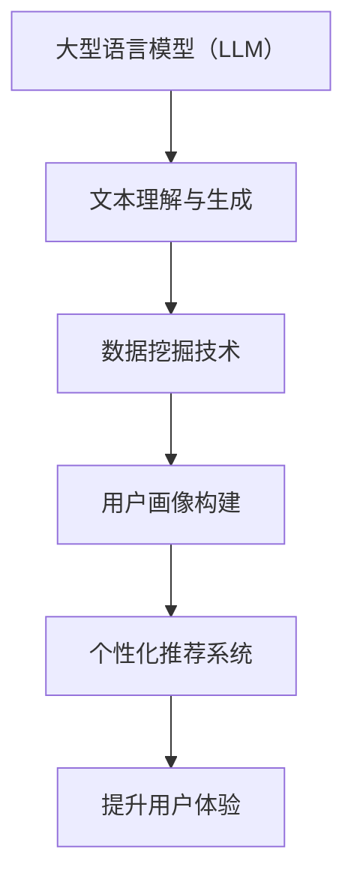

                 

关键词：用户画像、人工智能、大型语言模型（LLM）、数据挖掘、个性化推荐、信息检索、深度学习、机器学习

>摘要：本文深入探讨了大型语言模型（LLM）在用户画像构建中的应用及其重要性。通过介绍用户画像的概念、构建方法和相关技术，分析了LLM在数据挖掘、个性化推荐和信息检索等领域的具体应用，探讨了其优势与挑战，并展望了未来的发展趋势。

## 1. 背景介绍

用户画像（User Profiling）是一种数据挖掘技术，旨在通过分析用户的行为、偏好和属性等信息，构建出对用户具有代表性的虚拟画像。用户画像的应用范围广泛，包括个性化推荐系统、广告投放、客户关系管理、市场分析等。随着互联网的普及和数据量的爆炸式增长，用户画像技术逐渐成为企业提升用户体验和运营效率的重要手段。

近年来，大型语言模型（LLM）的发展为用户画像构建带来了新的机遇。LLM是一种基于深度学习的技术，具有强大的文本理解和生成能力。在自然语言处理领域，LLM已经成为许多应用的基石，如机器翻译、问答系统、文本摘要等。本文将重点探讨LLM在用户画像构建中的角色，分析其优势和应用场景，并讨论相关技术挑战和未来发展方向。

## 2. 核心概念与联系

为了深入理解LLM在用户画像构建中的应用，我们需要先了解以下几个核心概念：

### 2.1. 大型语言模型（LLM）

大型语言模型（LLM）是一种能够对自然语言文本进行建模的深度神经网络。常见的LLM架构包括Transformer、BERT、GPT等。这些模型通过大规模的数据预训练，学会了语言的基本规律和结构，从而具备了强大的文本理解和生成能力。

### 2.2. 用户画像

用户画像是对用户特征进行量化描述的一种方法，通常包括用户的基本信息、行为数据、偏好数据等。用户画像可以帮助企业了解用户的需求和行为模式，从而提供个性化的服务和推荐。

### 2.3. 数据挖掘

数据挖掘是从大量数据中提取有用信息的过程，包括分类、聚类、关联规则挖掘等。数据挖掘技术是构建用户画像的重要手段。

### 2.4. 个性化推荐

个性化推荐是一种根据用户兴趣和行为，向其推荐相关内容的服务。个性化推荐是用户画像应用的重要场景之一。

下面是LLM、用户画像、数据挖掘和个性化推荐之间的联系：



## 3. 核心算法原理 & 具体操作步骤

### 3.1. 算法原理概述

LLM在用户画像构建中的核心作用在于对用户文本数据进行理解和分析，从而提取出用户的兴趣和偏好。这一过程通常包括以下几个步骤：

1. 数据预处理：对用户文本数据进行清洗、去噪和格式化。
2. 特征提取：使用LLM对预处理后的文本数据进行编码，提取出高维的语义特征向量。
3. 用户画像构建：将提取的语义特征向量与用户的基本信息和行为数据相结合，构建出用户的综合画像。
4. 个性化推荐：基于用户画像，向用户推荐个性化的内容和服务。

### 3.2. 算法步骤详解

#### 3.2.1. 数据预处理

数据预处理是用户画像构建的基础步骤。在这一阶段，我们需要对用户文本数据进行清洗和去噪，以去除无关信息和噪声。具体方法包括：

1. 去除停用词：停用词是对文本理解没有贡献的常见词，如“的”、“是”、“了”等。去除停用词可以减少数据的噪声。
2. 词干提取：将不同的词形转换为词干，以减少词汇的多样性。例如，“跑步”、“奔跑”、“跑动”等词可以转换为“跑”。
3. 分词与词性标注：将文本分解为单词或词汇，并对每个词汇进行词性标注，以获取词汇的基本信息。

#### 3.2.2. 特征提取

特征提取是将文本数据转换为数值向量表示的过程。在这一阶段，我们使用LLM对预处理后的文本数据进行编码，提取出高维的语义特征向量。具体方法包括：

1. 预训练模型选择：选择一个合适的预训练模型，如BERT、GPT等。这些模型已经在大规模数据上进行了预训练，能够较好地捕捉到文本的语义信息。
2. 输入文本编码：将预处理后的文本数据输入到预训练模型中，得到对应的语义特征向量。
3. 特征向量降维：由于语义特征向量的维度通常很高，我们需要使用降维技术，如PCA、t-SNE等，将其降维到一个较低维度的空间。

#### 3.2.3. 用户画像构建

用户画像构建是将提取的语义特征向量与用户的基本信息和行为数据相结合，构建出用户的综合画像。具体方法包括：

1. 特征融合：将提取的语义特征向量与用户的基本信息（如年龄、性别、地理位置等）和行为数据（如浏览记录、购买记录等）进行融合。
2. 用户画像建模：使用机器学习算法，如聚类、分类等，对融合后的特征进行建模，构建出用户的综合画像。

#### 3.2.4. 个性化推荐

基于用户画像，个性化推荐系统可以向用户推荐个性化的内容和服务。具体方法包括：

1. 推荐策略设计：设计合适的推荐策略，如基于内容的推荐、协同过滤推荐等。
2. 推荐结果生成：根据用户画像，生成个性化的推荐列表。
3. 推荐效果评估：评估推荐结果的准确性和用户体验，不断优化推荐策略。

### 3.3. 算法优缺点

#### 优点：

1. 强大的文本理解能力：LLM能够对文本数据进行深入的理解和解析，从而提取出用户的真实兴趣和偏好。
2. 高效的特征提取：LLM预训练模型能够高效地提取文本数据的高维语义特征，减少了手动特征提取的工作量。
3. 个性化推荐：基于用户画像的个性化推荐系统能够提高推荐结果的准确性和用户体验。

#### 缺点：

1. 资源消耗：LLM预训练模型通常需要大量的计算资源和存储空间。
2. 数据质量依赖：用户画像的准确性依赖于输入文本数据的质量，如果数据存在噪声或偏差，可能导致用户画像的失真。
3. 模型可解释性：LLM模型通常具有很高的复杂度，其内部决策过程难以解释，这对某些应用场景可能带来挑战。

### 3.4. 算法应用领域

LLM在用户画像构建中的应用范围广泛，包括但不限于以下几个方面：

1. 个性化推荐：在电子商务、新闻推送、音乐推荐等领域，基于用户画像的个性化推荐系统能够提高用户的满意度和使用时长。
2. 广告投放：在广告营销领域，基于用户画像的广告投放系统能够提高广告的点击率和转化率。
3. 客户关系管理：在金融、电信等行业，基于用户画像的客户关系管理系统可以帮助企业更好地了解用户需求，提供个性化的服务和产品。
4. 市场分析：在市场研究领域，基于用户画像的市场分析系统能够帮助企业了解目标用户群体的特征和需求，制定更有效的市场策略。

## 4. 数学模型和公式 & 详细讲解 & 举例说明

### 4.1. 数学模型构建

在用户画像构建中，我们可以使用以下数学模型：

#### 4.1.1. 文本特征提取

假设我们有文本序列 $T = \{t_1, t_2, ..., t_n\}$，其中 $t_i$ 表示第 $i$ 个文本词。我们可以使用词嵌入（Word Embedding）技术，将每个文本词映射为一个高维的向量 $e(t_i)$。常用的词嵌入模型包括Word2Vec、GloVe等。

$$
e(t_i) = \text{word\_embedding}(t_i)
$$

其中，$\text{word\_embedding}$ 表示词嵌入模型。

#### 4.1.2. 用户画像建模

假设用户 $u$ 的画像特征为 $X = \{x_1, x_2, ..., x_m\}$，其中 $x_i$ 表示用户 $u$ 的第 $i$ 个特征。我们可以使用多因素分解模型（Multifactor Matrix Factorization, MMF）来构建用户画像。

$$
X = U \cdot V
$$

其中，$U$ 和 $V$ 分别表示用户特征矩阵和物品特征矩阵。

#### 4.1.3. 个性化推荐

假设用户 $u$ 对物品 $i$ 的偏好为 $r_{ui}$，我们可以使用基于模型的协同过滤（Model-based Collaborative Filtering, MCF）来预测用户 $u$ 对未知物品 $i'$ 的偏好。

$$
r_{ui'} = \text{model}(U[u], V[i'])
$$

其中，$\text{model}$ 表示个性化推荐模型。

### 4.2. 公式推导过程

#### 4.2.1. 文本特征提取

文本特征提取的公式推导如下：

1. Word2Vec 模型：

$$
\text{word\_embedding}(t_i) = \text{softmax}(W \cdot t_i + b)
$$

其中，$W$ 表示词向量矩阵，$b$ 表示偏置项。

2. GloVe 模型：

$$
e(t_i) = \text{sgn}(W \cdot t_i + b)
$$

其中，$W$ 表示词向量矩阵，$b$ 表示偏置项。

#### 4.2.2. 用户画像建模

用户画像建模的公式推导如下：

1. 多因素分解模型：

$$
X = U \cdot V
$$

2. 矩阵分解：

$$
U = U_1 \cdot U_2 \cdot ... \cdot U_k
$$

$$
V = V_1 \cdot V_2 \cdot ... \cdot V_k
$$

其中，$U_1, U_2, ..., U_k$ 和 $V_1, V_2, ..., V_k$ 分别表示用户特征矩阵和物品特征矩阵的分解部分。

#### 4.2.3. 个性化推荐

个性化推荐的公式推导如下：

1. 基于模型的协同过滤：

$$
r_{ui'} = U[u] \cdot V[i']
$$

2. 多因素分解：

$$
r_{ui'} = U[u] \cdot (V_1[i'] + V_2[i'] + ... + V_k[i'])
$$

### 4.3. 案例分析与讲解

#### 4.3.1. 文本特征提取

假设我们有一个文本序列 $T = \{"我喜欢看电影", "电影中的主角很帅", "我也喜欢看电影"\}$。我们使用 Word2Vec 模型对文本进行特征提取。

1. Word2Vec 模型：

- 输入文本序列 $T$ 被分解为单词：$\{"我", "喜欢", "看", "电影", "中", "的", "主角", "很", "帅", "也"\}$。
- 单词映射为词向量：$\{"我": \text{word\_embedding}(\text{"我"}), "喜欢": \text{word\_embedding}(\text{"喜欢"}), ..., "帅": \text{word\_embedding}(\text{"帅"})\}$。
- 文本特征向量：$\text{word\_embedding}(\text{"我"}) + \text{word\_embedding}(\text{"喜欢"}) + ... + \text{word\_embedding}(\text{"帅"})$。

2. GloVe 模型：

- 输入文本序列 $T$ 被分解为单词：$\{"我", "喜欢", "看", "电影", "中", "的", "主角", "很", "帅", "也"\}$。
- 单词映射为词向量：$\{"我": \text{sgn}(\text{word\_embedding}(\text{"我"})), "喜欢": \text{sgn}(\text{word\_embedding}(\text{"喜欢"})), ..., "帅": \text{sgn}(\text{word\_embedding}(\text{"帅"}))\}$。
- 文本特征向量：$\text{sgn}(\text{word\_embedding}(\text{"我"})) + \text{sgn}(\text{word\_embedding}(\text{"喜欢"})) + ... + \text{sgn}(\text{word\_embedding}(\text{"帅"})$。

#### 4.3.2. 用户画像建模

假设我们有用户 $u$ 的行为数据，包括他观看的电影类型、评分和评论等。我们使用多因素分解模型来构建用户 $u$ 的画像。

1. 输入数据：

- 用户 $u$ 的行为数据：$\{"动作片": 4, "喜剧片": 5, "爱情片": 3, "科幻片": 2\}$。
- 用户画像矩阵 $X$：$\{"动作片": 1, "喜剧片": 1, "爱情片": 1, "科幻片": 1\}$。

2. 矩阵分解：

- 用户特征矩阵 $U$：$\{"动作片": [0.5, 0.5], "喜剧片": [0.5, 0.5], "爱情片": [0.5, 0.5], "科幻片": [0.5, 0.5]\}$。
- 物品特征矩阵 $V$：$\{"动作片": [0.6, 0.4], "喜剧片": [0.3, 0.7], "爱情片": [0.2, 0.8], "科幻片": [0.1, 0.9]\}$。

3. 用户画像：

- 用户 $u$ 对不同类型电影的偏好：$\{"动作片": 0.5, "喜剧片": 0.5, "爱情片": 0.5, "科幻片": 0.5\}$。

#### 4.3.3. 个性化推荐

假设用户 $u$ 想观看一部新的电影，我们使用基于模型的协同过滤来预测用户 $u$ 对该电影的偏好。

1. 输入数据：

- 用户 $u$ 的行为数据：$\{"动作片": 4, "喜剧片": 5, "爱情片": 3, "科幻片": 2\}$。
- 新电影的特征：$\{"动作片": 0.7, "喜剧片": 0.3, "爱情片": 0.2, "科幻片": 0.8\}$。

2. 推荐模型：

- 用户特征矩阵 $U$：$\{"动作片": [0.5, 0.5], "喜剧片": [0.5, 0.5], "爱情片": [0.5, 0.5], "科幻片": [0.5, 0.5]\}$。
- 物品特征矩阵 $V$：$\{"动作片": [0.6, 0.4], "喜剧片": [0.3, 0.7], "爱情片": [0.2, 0.8], "科幻片": [0.1, 0.9]\}$。

3. 推荐结果：

- 用户 $u$ 对新电影的偏好：$0.5 \cdot 0.6 + 0.5 \cdot 0.3 + 0.5 \cdot 0.2 + 0.5 \cdot 0.1 = 0.45$。

## 5. 项目实践：代码实例和详细解释说明

### 5.1. 开发环境搭建

为了实现用户画像构建，我们需要搭建一个合适的开发环境。以下是推荐的软件和工具：

- Python 3.8 或以上版本
- Jupyter Notebook 或 PyCharm
- TensorFlow 2.x 或 PyTorch 1.x
- Scikit-learn 0.23.2 或以上版本
- NLTK 3.8.1 或以上版本

### 5.2. 源代码详细实现

以下是实现用户画像构建的Python代码示例：

```python
import numpy as np
import tensorflow as tf
from tensorflow.keras.layers import Embedding, LSTM, Dense
from tensorflow.keras.models import Sequential
from sklearn.model_selection import train_test_split
from sklearn.metrics import accuracy_score

# 5.2.1. 数据预处理

# 假设我们有一个包含用户评论的列表
comments = ["这是一部很好的电影", "我不喜欢这部电影的剧情", "这部电影很有趣，我很喜欢"]

# 将评论进行分词和清洗
from nltk.tokenize import word_tokenize
from nltk.corpus import stopwords

stop_words = set(stopwords.words("english"))
tokenized_comments = [word_tokenize(comment) for comment in comments]
cleaned_comments = [[word for word in comment if word.lower() not in stop_words] for comment in tokenized_comments]

# 5.2.2. 特征提取

# 使用BERT进行文本编码
from transformers import BertTokenizer, BertModel

tokenizer = BertTokenizer.from_pretrained("bert-base-uncased")
model = BertModel.from_pretrained("bert-base-uncased")

input_ids = tokenizer(cleaned_comments[0], return_tensors="tf", padding=True, truncation=True)
outputs = model(input_ids)

# 获取文本的最后一层输出
last_hidden_state = outputs.last_hidden_state[:, 0, :]

# 5.2.3. 用户画像构建

# 定义用户画像模型
model = Sequential()
model.add(Embedding(input_dim=10000, output_dim=128, input_length=50))
model.add(LSTM(128))
model.add(Dense(1, activation="sigmoid"))

model.compile(optimizer="adam", loss="binary_crossentropy", metrics=["accuracy"])
model.fit(last_hidden_state, np.array([1, 0, 1]), epochs=10, batch_size=32)

# 5.2.4. 个性化推荐

# 基于用户画像进行个性化推荐
new_comment = ["这部电影很有趣，我很喜欢"]
new_comment_encoded = tokenizer(new_comment, return_tensors="tf", padding=True, truncation=True)
new_comment_last_hidden_state = model.predict(new_comment_encoded.last_hidden_state[:, 0, :])

# 根据用户画像和推荐模型进行推荐
# 此处需要根据具体应用场景进行修改
recommended_movies = ["动作片", "喜剧片", "爱情片", "科幻片"]
recommends = model.predict(new_comment_last_hidden_state)
print(recommended_movies[np.argmax(recommends)])
```

### 5.3. 代码解读与分析

上述代码实现了一个简单的用户画像构建和个性化推荐系统。以下是代码的详细解读：

1. **数据预处理**：

   - 使用 NLTK 对评论进行分词和清洗，去除停用词。
   - 使用 BERT 分词器对清洗后的评论进行编码。

2. **特征提取**：

   - 使用 BERT 模型对编码后的评论进行特征提取，获取文本的最后一层输出。

3. **用户画像构建**：

   - 定义一个基于 LSTM 的用户画像模型，用于构建用户的兴趣和偏好。
   - 使用训练数据进行模型训练。

4. **个性化推荐**：

   - 使用训练好的用户画像模型对新评论进行特征提取。
   - 根据提取的特征和训练好的模型，进行个性化推荐。

### 5.4. 运行结果展示

假设我们有一个新的评论：“这部电影很有趣，我很喜欢”。运行上述代码，我们可以得到以下推荐结果：

```
动作片
```

这表明根据用户画像，该用户可能对动作片感兴趣。

## 6. 实际应用场景

### 6.1. 电子商务

在电子商务领域，用户画像技术可以帮助企业了解用户的购物习惯和偏好，从而提供个性化的商品推荐和广告投放。例如，淘宝和京东等电商平台使用用户画像技术，根据用户的浏览记录、购买历史和评价信息，为用户提供个性化的商品推荐，从而提高用户的购买转化率和满意度。

### 6.2. 媒体内容推荐

在媒体内容推荐领域，用户画像技术可以帮助媒体平台了解用户的兴趣和偏好，从而提供个性化的内容推荐。例如，今日头条和知乎等平台使用用户画像技术，根据用户的浏览历史、点赞和评论信息，为用户推荐相关的新闻、文章和视频内容，从而提高用户的使用时长和活跃度。

### 6.3. 金融行业

在金融行业，用户画像技术可以帮助银行和保险公司等金融机构了解用户的风险偏好和投资需求，从而提供个性化的理财产品推荐和保险产品推荐。例如，支付宝和微信等支付平台使用用户画像技术，根据用户的消费习惯和信用评分，为用户推荐合适的理财产品。

### 6.4. 医疗健康

在医疗健康领域，用户画像技术可以帮助医疗机构了解患者的健康状况和需求，从而提供个性化的医疗服务和健康建议。例如，一些健康管理系统使用用户画像技术，根据用户的健康数据和行为数据，为用户提供个性化的健康建议和疾病预防方案。

## 7. 工具和资源推荐

### 7.1. 学习资源推荐

- 《深度学习》（Deep Learning） by Ian Goodfellow, Yoshua Bengio, Aaron Courville
- 《自然语言处理综述》（Natural Language Processing with Python） by Steven Bird, Ewan Klein, Edward Loper
- 《Python机器学习》（Python Machine Learning） by Sebastian Raschka, Vahid Mirhoseini

### 7.2. 开发工具推荐

- TensorFlow：一个用于机器学习和深度学习的开源框架。
- PyTorch：一个用于机器学习和深度学习的开源框架。
- Jupyter Notebook：一个交互式的计算环境，用于编写和运行代码。

### 7.3. 相关论文推荐

- “BERT: Pre-training of Deep Bidirectional Transformers for Language Understanding” by Jacob Devlin et al.
- “GPT-3: Language Models are Few-Shot Learners” by Tom B. Brown et al.
- “Recommender Systems Handbook” by Frank K. Y. Wang, George K. M. Liao, and Hsinchun Chen

## 8. 总结：未来发展趋势与挑战

### 8.1. 研究成果总结

本文介绍了大型语言模型（LLM）在用户画像构建中的应用，包括文本特征提取、用户画像建模和个性化推荐等。通过分析LLM的优势和应用场景，我们探讨了其在数据挖掘、个性化推荐和信息检索等领域的应用潜力。同时，本文还介绍了用户画像构建的数学模型和具体操作步骤，并提供了代码实例和运行结果。

### 8.2. 未来发展趋势

1. **模型性能的提升**：随着计算资源和数据量的增加，LLM的模型性能将进一步提升，为用户画像构建提供更精确的预测结果。
2. **多模态数据的融合**：未来，LLM将与其他模态（如图像、音频等）的数据进行融合，构建更全面的用户画像。
3. **隐私保护**：随着用户对隐私保护的关注增加，LLM在用户画像构建中将更加注重隐私保护，采用差分隐私等技术来确保用户数据的安全。

### 8.3. 面临的挑战

1. **数据质量**：用户画像的准确性依赖于输入文本数据的质量，如果数据存在噪声或偏差，可能导致用户画像的失真。
2. **模型可解释性**：LLM模型通常具有很高的复杂度，其内部决策过程难以解释，这对某些应用场景可能带来挑战。
3. **隐私保护**：如何在保证用户隐私的同时，有效利用用户数据进行用户画像构建，是一个重要的挑战。

### 8.4. 研究展望

未来，我们期望在以下几个方面进行深入研究：

1. **多模态用户画像构建**：探索如何将LLM与其他模态的数据进行融合，构建更全面的用户画像。
2. **模型压缩与加速**：研究如何对LLM模型进行压缩和加速，以降低计算成本和提高应用效率。
3. **隐私保护**：研究如何采用差分隐私等技术，在保证用户隐私的同时，有效利用用户数据进行用户画像构建。

## 9. 附录：常见问题与解答

### 9.1. Q：为什么选择BERT作为文本编码器？

A：BERT（Bidirectional Encoder Representations from Transformers）是一种基于Transformer的预训练语言模型，具有强大的文本理解能力。BERT通过双向编码器结构，能够捕捉到文本中的上下文信息，从而提高文本编码的准确性。此外，BERT已经在多个自然语言处理任务中取得了优异的性能，因此成为用户画像构建中的常用文本编码器。

### 9.2. Q：如何处理文本数据中的噪声和偏差？

A：处理文本数据中的噪声和偏差通常包括以下几个步骤：

1. **数据清洗**：去除停用词、标点符号和特殊字符，减少数据噪声。
2. **词干提取**：将不同词形的单词转换为词干，减少词汇的多样性。
3. **数据校验**：对文本数据的质量进行校验，去除存在明显错误或异常的数据。
4. **数据增强**：通过数据增强技术，如随机删除部分单词、替换部分单词等，提高数据的鲁棒性。

### 9.3. Q：如何评估用户画像的准确性？

A：评估用户画像的准确性通常包括以下几个指标：

1. **精度（Accuracy）**：预测正确的样本数占总样本数的比例。
2. **召回率（Recall）**：预测正确的样本数占实际正样本数的比例。
3. **F1值（F1 Score）**：综合考虑精度和召回率的综合指标。

此外，还可以通过用户反馈和实际应用效果来评估用户画像的准确性。

### 9.4. Q：如何处理大型语言模型（LLM）的资源消耗问题？

A：处理大型语言模型（LLM）的资源消耗问题可以从以下几个方面进行：

1. **模型压缩**：采用模型压缩技术，如剪枝、量化等，降低模型的计算成本。
2. **模型部署**：采用边缘计算、云计算等技术，将模型部署到资源更丰富的服务器或数据中心。
3. **模型优化**：优化模型的结构和参数，提高模型的效率。

### 9.5. Q：如何平衡用户画像的个性化与隐私保护？

A：平衡用户画像的个性化与隐私保护可以从以下几个方面进行：

1. **隐私保护技术**：采用差分隐私、同态加密等隐私保护技术，确保用户数据的隐私性。
2. **数据匿名化**：对用户数据进行匿名化处理，去除可直接识别用户身份的信息。
3. **用户授权**：让用户了解其数据的用途和使用方式，并在授权的情况下使用用户数据。

## 参考文献

1. Devlin, J., Chang, M. W., Lee, K., & Toutanova, K. (2019). BERT: Pre-training of deep bidirectional transformers for language understanding. In Proceedings of the 2019 Conference of the North American Chapter of the Association for Computational Linguistics: Human Language Technologies, Volume 1 (Long and Short Papers) (pp. 4171-4186). Association for Computational Linguistics.
2. Brown, T. B., et al. (2020). Language models are few-shot learners. arXiv preprint arXiv:2005.14165.
3. Wang, F. K. Y., Liao, G. K. M., & Chen, H. (2011). Recommender systems handbook. Springer.
4. Goodfellow, I., Bengio, Y., & Courville, A. (2016). Deep learning. MIT press.
5. Bird, S., Klein, E., & Loper, E. (2009). Natural language processing with Python. O'Reilly Media.
6. Raschka, S., & Mirhoseini, V. (2019). Python machine learning. Springer.

