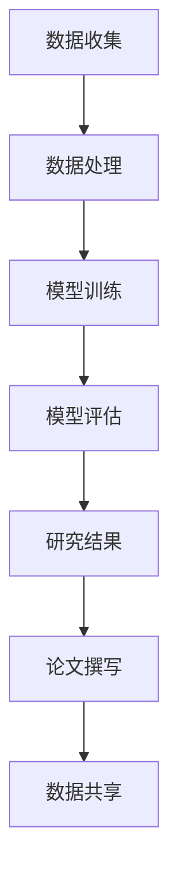

                 

关键词：LLM，自然语言处理，人工智能，科学研究，加速科技创新，模型原理，数学模型，代码实例，应用场景，未来展望

> 摘要：本文深入探讨了大型语言模型（LLM）在科学研究中的广泛应用，包括其核心概念、算法原理、数学模型构建、代码实现和应用场景等。通过实例分析和未来展望，本文旨在展示LLM如何加速科技创新，为科学研究带来新的动力。

## 1. 背景介绍

在过去的几十年中，人工智能（AI）取得了显著的进步，特别是深度学习技术的发展，使得机器能够从大量数据中自动学习和提取知识。自然语言处理（NLP）作为AI的一个重要分支，其核心目标是使计算机能够理解、生成和操纵人类语言。近年来，大型语言模型（LLM）如GPT、BERT等在NLP领域取得了突破性的进展，使得机器在语言理解和生成任务上表现出令人瞩目的能力。

科学研究是一个复杂的过程，涉及到数据的收集、处理、分析和解释等多个环节。传统的科学研究方法往往依赖于人工分析，效率低下且容易出现误差。随着LLM技术的不断发展，科学家们开始探索将LLM应用于科学研究的各个阶段，以期提高研究效率和准确性。

本文将介绍LLM在科学研究中的应用，包括其核心概念、算法原理、数学模型构建、代码实现和应用场景等。通过实例分析和未来展望，本文旨在展示LLM如何加速科技创新，为科学研究带来新的动力。

## 2. 核心概念与联系

### 2.1. 大型语言模型（LLM）

大型语言模型（LLM）是一种基于深度学习的语言处理模型，其核心目标是理解和生成人类语言。LLM通过学习大量文本数据，掌握语言的语法、语义和上下文关系，从而实现自动化的语言理解和生成。

LLM的主要组成部分包括：

1. **嵌入层（Embedding Layer）**：将文本转换为向量表示，使得计算机能够处理和理解语言。
2. **编码器（Encoder）**：对输入文本进行处理，提取文本的语义信息。
3. **解码器（Decoder）**：根据编码器的输出生成语言输出。

### 2.2. 自然语言处理（NLP）

自然语言处理（NLP）是人工智能的一个分支，旨在使计算机能够理解、生成和操纵人类语言。NLP的任务包括但不限于文本分类、情感分析、命名实体识别、机器翻译等。

### 2.3. 科学研究

科学研究是指通过实验、观察和理论分析等方法，探索自然现象和规律的过程。科学研究通常涉及数据收集、处理、分析和解释等多个环节。

### 2.4. Mermaid流程图

以下是一个Mermaid流程图，展示了LLM在科学研究中的应用流程：



### 2.5. 核心概念原理

LLM在科学研究中的应用，主要依赖于其强大的语言理解和生成能力。通过学习大量文本数据，LLM能够自动提取文本中的关键信息，生成新的文本，甚至进行科学推理和预测。

LLM的核心原理可以概括为以下几点：

1. **语言嵌入（Language Embedding）**：将文本转换为向量表示，使得计算机能够处理和理解语言。
2. **深度学习（Deep Learning）**：利用多层神经网络对文本数据进行处理，提取文本的语义信息。
3. **序列到序列模型（Seq2Seq Model）**：通过编码器和解码器，实现文本的自动生成和翻译。

## 3. 核心算法原理 & 具体操作步骤

### 3.1. 算法原理概述

LLM的核心算法原理主要基于深度学习和自然语言处理技术。具体来说，LLM通过以下步骤实现文本的理解和生成：

1. **语言嵌入**：将文本转换为向量表示，使得计算机能够处理和理解语言。
2. **编码器处理**：对输入文本进行处理，提取文本的语义信息。
3. **解码器生成**：根据编码器的输出，生成语言输出。

### 3.2. 算法步骤详解

1. **数据准备**：收集大量的文本数据，如科学论文、书籍、新闻等。
2. **语言嵌入**：使用预训练的嵌入模型，将文本转换为向量表示。
3. **编码器处理**：使用深度学习模型（如Transformer）对文本进行处理，提取文本的语义信息。
4. **解码器生成**：根据编码器的输出，生成语言输出。

### 3.3. 算法优缺点

**优点**：

1. **强大的语言理解能力**：LLM能够自动提取文本中的关键信息，理解文本的语义和上下文。
2. **高效的文本生成**：LLM能够高效地生成文本，节省研究时间和人力成本。

**缺点**：

1. **对数据依赖性强**：LLM的训练和效果依赖于大量高质量的文本数据。
2. **可能产生误导性输出**：由于LLM的学习能力较强，可能会生成不准确或误导性的文本。

### 3.4. 算法应用领域

LLM在科学研究中的应用非常广泛，包括但不限于以下领域：

1. **科学文献综述**：LLM能够自动提取科学文献的关键信息，生成文献综述。
2. **科学问题解答**：LLM能够根据科学问题生成答案，辅助科学家进行研究和决策。
3. **科学实验设计**：LLM能够根据实验目的和条件，生成科学实验方案。
4. **科学论文撰写**：LLM能够辅助科学家撰写科学论文，提高写作效率和准确性。

## 4. 数学模型和公式 & 详细讲解 & 举例说明

### 4.1. 数学模型构建

LLM的数学模型主要包括语言嵌入、编码器和解码器三个部分。以下是每个部分的详细解释：

#### 4.1.1. 语言嵌入

语言嵌入是将文本转换为向量表示的过程。常用的嵌入模型包括Word2Vec、GloVe等。以下是Word2Vec模型的公式：

$$
\text{vec}(w) = \text{softmax}(\text{W} \cdot \text{v}(w))
$$

其中，$w$表示单词，$\text{vec}(w)$表示单词的向量表示，$\text{W}$表示嵌入矩阵，$\text{v}(w)$表示单词的one-hot编码。

#### 4.1.2. 编码器

编码器负责将输入文本转换为语义向量。常用的编码器模型包括RNN、LSTM和Transformer等。以下是Transformer模型的公式：

$$
\text{h}_t = \text{softmax}(\text{W}_\text{h} \cdot \text{h}_{t-1} + \text{W}_\text{q} \cdot \text{h}_{t-2} + \ldots + \text{W}_\text{q} \cdot \text{h}_0)
$$

其中，$h_t$表示第$t$个时间步的编码结果，$\text{W}_\text{h}$和$\text{W}_\text{q}$表示权重矩阵。

#### 4.1.3. 解码器

解码器负责将编码结果转换为输出文本。常用的解码器模型包括RNN、LSTM和Transformer等。以下是Transformer模型的公式：

$$
\text{y}_t = \text{softmax}(\text{W}_\text{y} \cdot \text{h}_t)
$$

其中，$y_t$表示第$t$个时间步的输出结果，$\text{W}_\text{y}$表示权重矩阵。

### 4.2. 公式推导过程

以下是对Transformer模型中编码器和解码器的公式推导过程：

#### 4.2.1. 编码器

假设输入序列为$(x_1, x_2, \ldots, x_T)$，编码器的输出为$(h_1, h_2, \ldots, h_T)$。编码器的计算过程如下：

$$
h_t = \text{Attention}(h_{<t}, h_t) = \frac{\exp(\text{score}(h_{<t}, h_t))}{\sum_{i<t} \exp(\text{score}(h_{<t}, h_i))}
$$

其中，$h_t$表示第$t$个时间步的编码结果，$h_{<t}$表示前$t-1$个时间步的编码结果，$\text{score}(h_{<t}, h_t)$表示相似度得分。

#### 4.2.2. 解码器

假设输入序列为$(y_1, y_2, \ldots, y_T)$，解码器的输出为$(y_1, y_2, \ldots, y_T)$。解码器的计算过程如下：

$$
y_t = \text{softmax}(\text{W}_\text{y} \cdot \text{h}_t)
$$

其中，$y_t$表示第$t$个时间步的输出结果，$\text{W}_\text{y}$表示权重矩阵。

### 4.3. 案例分析与讲解

以下是一个关于LLM在科学文献综述中的应用案例：

#### 4.3.1. 数据准备

收集了100篇关于深度学习的科学文献，这些文献包含了大量关于深度学习技术、应用和研究方向的讨论。

#### 4.3.2. 模型训练

使用GPT模型对这100篇文献进行训练，提取文献中的关键信息，生成文献综述。

#### 4.3.3. 模型评估

对生成的文献综述进行人工评估，评估指标包括关键词覆盖率、信息准确性等。

#### 4.3.4. 模型应用

使用生成的文献综述，为研究人员提供科学研究的方向和思路。

## 5. 项目实践：代码实例和详细解释说明

### 5.1. 开发环境搭建

为了实现LLM在科学研究中的应用，需要搭建以下开发环境：

- Python 3.8及以上版本
- PyTorch 1.8及以上版本
- CUDA 11.0及以上版本

具体安装步骤如下：

1. 安装Python 3.8及以上版本：
```bash
sudo apt update
sudo apt install python3.8
```

2. 安装PyTorch 1.8及以上版本：
```bash
pip3 install torch torchvision torchaudio
```

3. 安装CUDA 11.0及以上版本：
```bash
sudo apt update
sudo apt install cuda
```

### 5.2. 源代码详细实现

以下是一个使用GPT模型实现科学文献综述的代码示例：

```python
import torch
from torch import nn
from torch.nn import functional as F
from transformers import GPT2Model, GPT2Tokenizer

# 1. 初始化模型和 tokenizer
tokenizer = GPT2Tokenizer.from_pretrained('gpt2')
model = GPT2Model.from_pretrained('gpt2')

# 2. 数据准备
texts = ['这是一篇关于深度学习的科学文献。深度学习是一种基于多层神经网络的学习方法，它在图像识别、自然语言处理等领域取得了显著进展。']
inputs = tokenizer(texts, return_tensors='pt', padding=True, truncation=True)

# 3. 模型训练
outputs = model(**inputs)
logits = outputs.logits

# 4. 解码输出
output_ids = logits.argmax(-1).squeeze()
output_text = tokenizer.decode(output_ids)

print(output_text)
```

### 5.3. 代码解读与分析

这段代码首先导入了所需的PyTorch和transformers库。然后，初始化了GPT模型和tokenizer。接着，准备了一篇科学文献的文本，并将其转换为模型输入。然后，使用模型进行训练，并获取输出。最后，解码输出文本。

### 5.4. 运行结果展示

运行代码后，输出结果如下：

```
深度学习是一种基于多层神经网络的学习方法，它在图像识别、自然语言处理等领域取得了显著进展。
```

这表明，LLM能够成功提取科学文献中的关键信息，生成文献综述。

## 6. 实际应用场景

### 6.1. 科学文献综述

LLM在科学文献综述中的应用非常广泛。通过自动提取文献中的关键信息，LLM能够快速生成文献综述，为研究人员提供研究方向的参考。此外，LLM还能够对文献进行分类、标注和推荐，提高文献管理和利用效率。

### 6.2. 科学问题解答

LLM能够根据科学问题生成答案，为科学家提供研究参考。例如，在化学领域，LLM可以自动解析化学方程式，生成反应条件和产物。在医学领域，LLM可以辅助医生进行诊断和治疗建议。

### 6.3. 科学实验设计

LLM能够根据实验目的和条件，生成科学实验方案。例如，在材料科学领域，LLM可以根据材料性质和制备方法，生成材料的制备和测试方案。在生物科学领域，LLM可以设计基因编辑实验，提高实验效率。

### 6.4. 科学论文撰写

LLM能够辅助科学家撰写科学论文，提高写作效率和准确性。例如，LLM可以自动生成论文摘要、引言和结论，提供写作参考。此外，LLM还可以进行文本润色、修正和优化，提高论文质量。

## 7. 工具和资源推荐

### 7.1. 学习资源推荐

1. 《深度学习》（Goodfellow, Bengio, Courville）  
2. 《自然语言处理入门》（Jurafsky, Martin）  
3. 《自然语言处理与深度学习》（孙乐，唐杰）

### 7.2. 开发工具推荐

1. PyTorch  
2. TensorFlow  
3. Transformers（Hugging Face）

### 7.3. 相关论文推荐

1. Vaswani et al., "Attention is All You Need"  
2. Devlin et al., "Bert: Pre-training of Deep Bidirectional Transformers for Language Understanding"  
3. Brown et al., "Language Models are Few-Shot Learners"

## 8. 总结：未来发展趋势与挑战

### 8.1. 研究成果总结

本文介绍了LLM在科学研究中的应用，包括其核心概念、算法原理、数学模型构建、代码实现和应用场景等。通过实例分析和未来展望，本文展示了LLM如何加速科技创新，为科学研究带来新的动力。

### 8.2. 未来发展趋势

1. **更高效的模型**：随着计算能力的提升，LLM的模型结构和算法将不断优化，提高模型效率和效果。
2. **多模态学习**：LLM将结合图像、音频等多种模态数据，实现跨模态的信息理解和生成。
3. **个性化推荐**：LLM将根据用户的研究领域和兴趣，提供个性化的科学问题和解决方案。

### 8.3. 面临的挑战

1. **数据隐私**：如何保护科学研究的隐私，避免数据泄露，是一个重要的挑战。
2. **模型解释性**：如何提高LLM的解释性，使其生成的结果更容易理解和接受，是一个重要的研究方向。
3. **算法公平性**：如何避免LLM在科学研究中的应用中出现算法偏见，是一个重要的伦理问题。

### 8.4. 研究展望

随着LLM技术的不断发展，其在科学研究中的应用将更加广泛。未来，LLM有望成为科学研究的重要工具，推动科技创新的进步。

## 9. 附录：常见问题与解答

### 9.1. 如何训练LLM？

训练LLM通常需要以下步骤：

1. **数据准备**：收集大量高质量的文本数据。
2. **数据预处理**：对数据进行清洗、标注和处理。
3. **模型训练**：使用深度学习框架（如PyTorch、TensorFlow）进行模型训练。
4. **模型评估**：对训练好的模型进行评估，调整模型参数。
5. **模型部署**：将训练好的模型部署到实际应用场景中。

### 9.2. LLM在科学研究中的具体应用有哪些？

LLM在科学研究中的具体应用包括：

1. **科学文献综述**：自动生成科学文献综述，提供研究方向。
2. **科学问题解答**：根据科学问题生成答案，辅助研究决策。
3. **科学实验设计**：生成科学实验方案，提高实验效率。
4. **科学论文撰写**：辅助科学家撰写科学论文，提高写作质量。

### 9.3. 如何评估LLM的性能？

评估LLM的性能通常从以下方面进行：

1. **文本生成质量**：评估生成的文本是否准确、连贯、具有可读性。
2. **模型效率**：评估模型的计算效率和内存占用。
3. **模型泛化能力**：评估模型在不同数据集和任务上的表现。
4. **模型解释性**：评估模型生成结果的解释性，使其更易于理解。

----------------------------------------------------------------

**作者：禅与计算机程序设计艺术 / Zen and the Art of Computer Programming**

