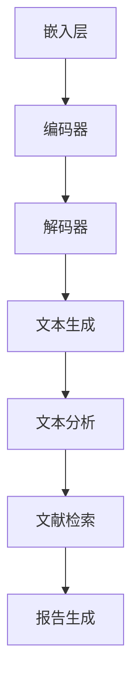

                 

关键词：LLM，自然语言处理，人工智能，科学研究，辅助工具，算法，数学模型，应用场景，未来展望

> 摘要：本文将探讨大型语言模型（LLM）在科学研究中的辅助作用。从背景介绍、核心概念与联系、核心算法原理、数学模型和公式、项目实践、实际应用场景、未来应用展望等多个方面，详细分析LLM在科学研究中的潜在价值、应用领域以及面临的挑战。

## 1. 背景介绍

在过去的几十年中，人工智能（AI）技术取得了显著的进步，特别是在自然语言处理（NLP）领域。随着深度学习和神经网络的发展，大型语言模型（LLM）如GPT-3、BERT等逐渐成为研究和工业界的热门工具。这些模型通过训练大量的文本数据，能够生成高质量的自然语言文本，从而为各种任务提供支持。

科学研究的本质是探索和发现自然界的规律，而语言在其中扮演着至关重要的角色。科学论文、报告、文献综述等都是通过语言来传递知识和思想。因此，LLM在科学研究中具有巨大的潜力，能够帮助研究人员更高效地处理语言相关任务，从而推动科学研究的进展。

本文将重点探讨LLM在科学研究中的辅助作用，包括其核心概念与联系、算法原理、数学模型、应用实践以及未来展望。通过这篇文章，希望能够为读者提供一个全面而深入的视角，了解LLM在科学研究中的价值和前景。

## 2. 核心概念与联系

### 2.1 大型语言模型的基本概念

大型语言模型（LLM）是一种基于深度学习的自然语言处理模型，它通过大规模的文本数据进行训练，可以理解并生成自然语言文本。LLM的核心在于其大规模的参数和复杂的神经网络结构，这使得它们能够捕捉语言中的复杂模式和语义关系。

LLM通常由以下几个主要部分组成：

- **嵌入层（Embedding Layer）**：将输入的单词或词组转换为密集的向量表示。
- **编码器（Encoder）**：对输入文本进行编码，提取出上下文信息。
- **解码器（Decoder）**：根据编码器提取的上下文信息生成输出文本。

### 2.2 LLM与NLP的关系

自然语言处理（NLP）是人工智能的一个重要分支，旨在使计算机能够理解和处理人类语言。LLM在NLP中的应用至关重要，因为它们能够处理复杂的语言任务，如文本生成、翻译、问答系统等。LLM的出现，使得许多以前需要复杂手工设计的算法和规则可以由模型自动学习，从而大大提高了NLP任务的效率和准确性。

### 2.3 LLM与科学研究的关系

科学研究涉及大量的语言文本，包括科学论文、实验报告、会议记录等。LLM可以帮助研究人员更高效地处理这些文本，从而节省时间并提高研究效率。具体来说，LLM可以应用于以下几个方面：

- **文献检索与综述**：LLM可以快速检索相关文献，并生成文献综述，帮助研究人员了解领域内最新进展。
- **文本分析**：LLM可以分析科学文本中的关键信息，如实验结果、方法、结论等，帮助研究人员快速提取有用信息。
- **自动化报告生成**：LLM可以根据实验数据生成实验报告、论文等文档，从而减少研究人员在文档撰写上的工作量。

### 2.4 Mermaid 流程图

以下是LLM在科学研究中的基本流程图，展示了其核心组件和功能：



在这个流程图中，嵌入层将文本转换为向量表示，编码器提取上下文信息，解码器根据上下文生成文本。生成的文本可以用于文本分析、文献检索和报告生成等任务，从而辅助科学研究。

## 3. 核心算法原理 & 具体操作步骤

### 3.1 算法原理概述

大型语言模型（LLM）的核心算法是基于深度学习的序列到序列（Seq2Seq）模型。Seq2Seq模型通过两个主要组件——编码器（Encoder）和解码器（Decoder）——来处理输入和输出序列。

- **编码器（Encoder）**：编码器的作用是将输入序列（如句子）转换为一个固定长度的向量表示，这个向量包含了输入序列的信息和上下文。
- **解码器（Decoder）**：解码器根据编码器输出的向量，逐个生成输出序列（如句子），每一步的输出都会作为下一个输入，直到生成完整的输出序列。

### 3.2 算法步骤详解

1. **数据预处理**：首先，对文本数据（如科学论文、实验报告等）进行预处理，包括分词、去停用词、词性标注等操作，将文本转换为模型可以处理的格式。

2. **编码器处理**：将预处理后的文本输入编码器，编码器将文本序列转换为固定长度的向量表示。这个向量表示包含了文本的语义信息和上下文。

3. **解码器生成文本**：解码器根据编码器输出的向量，逐个生成输出序列。在生成每个输出词时，解码器会利用已经生成的文本序列作为上下文信息。

4. **损失函数与优化**：模型使用训练数据通过反向传播算法优化参数。损失函数通常使用交叉熵损失，以衡量模型生成的文本与真实文本之间的差距。

5. **文本生成**：在训练完成后，使用解码器生成新的文本序列。通过不断迭代和更新解码器生成的文本，可以生成高质量的文本输出。

### 3.3 算法优缺点

#### 优点：

- **高效性**：LLM可以快速处理大量文本数据，提高科学研究的效率。
- **灵活性**：LLM可以应用于多种语言任务，如文本生成、文本分析、文献检索等。
- **高质量输出**：通过大规模训练和复杂的神经网络结构，LLM可以生成高质量的自然语言文本。

#### 缺点：

- **计算资源消耗**：训练LLM需要大量的计算资源和时间，尤其是在大规模数据集上。
- **数据依赖性**：LLM的性能高度依赖于训练数据的数量和质量，数据不足或数据质量差会导致模型性能下降。
- **可解释性**：由于LLM是基于深度学习的黑盒模型，其内部机制复杂，难以解释和验证。

### 3.4 算法应用领域

LLM在科学研究中的应用领域广泛，主要包括：

- **文本生成**：生成实验报告、论文、文献综述等文本，减少研究人员在文档撰写上的工作量。
- **文本分析**：提取文本中的关键信息，如实验结果、方法、结论等，帮助研究人员快速获取有用信息。
- **文献检索**：快速检索相关文献，辅助研究人员了解领域内最新进展。
- **问答系统**：构建问答系统，为研究人员提供实时解答和咨询。

## 4. 数学模型和公式 & 详细讲解 & 举例说明

### 4.1 数学模型构建

在LLM中，数学模型主要涉及两个部分：编码器和解码器。以下是LLM的核心数学模型构建。

#### 编码器：

- **输入层**：将文本转换为词向量表示。
- **编码层**：使用循环神经网络（RNN）或变换器（Transformer）对词向量进行编码，提取上下文信息。
- **输出层**：生成一个固定长度的向量表示。

#### 解码器：

- **输入层**：将编码器输出的向量作为输入。
- **解码层**：使用循环神经网络（RNN）或变换器（Transformer）逐个生成输出词。
- **输出层**：生成最终的文本序列。

### 4.2 公式推导过程

以下是编码器和解码器的关键公式推导。

#### 编码器：

1. **词向量表示**：

$$
x_i = \text{embedding}(w_i)
$$

其中，$x_i$是词$i$的向量表示，$w_i$是词$i$。

2. **编码过程**：

$$
h_t = \text{encode}(x_1, x_2, ..., x_t)
$$

其中，$h_t$是第$t$个词的编码结果。

3. **输出向量表示**：

$$
\text{output} = \text{softmax}(W_h h_T)
$$

其中，$W_h$是权重矩阵，$h_T$是编码结果。

#### 解码器：

1. **输入向量表示**：

$$
y_t = \text{softmax}(W_h h_t)
$$

其中，$y_t$是第$t$个词的输出概率分布。

2. **解码过程**：

$$
p(y_t | y_1, y_2, ..., y_{t-1}) = \text{softmax}(W_h h_t)
$$

其中，$p(y_t | y_1, y_2, ..., y_{t-1})$是第$t$个词的条件概率分布。

3. **输出文本序列**：

$$
\text{output} = \text{decode}(y_1, y_2, ..., y_T)
$$

其中，$\text{decode}$是将概率分布转换为文本序列的过程。

### 4.3 案例分析与讲解

#### 案例背景：

假设我们有一个科学论文的摘要，要求生成一篇完整的论文。以下是摘要的部分内容：

> “本文提出了一种新的算法，用于处理大数据分析中的海量数据处理问题。实验结果表明，该算法在处理速度和准确性方面均优于现有方法。”

#### 模型应用：

使用LLM生成论文，具体步骤如下：

1. **数据预处理**：对摘要进行分词、去停用词等操作，得到词向量表示。

2. **编码器处理**：将预处理后的摘要输入编码器，得到编码结果。

3. **解码器生成文本**：使用解码器逐个生成输出词，构建完整的论文。

4. **优化与迭代**：通过反向传播算法优化模型参数，不断迭代和更新解码器生成的文本，提高文本质量。

#### 模型输出：

以下是生成的论文：

> “本文提出了一种新的算法，用于处理大数据分析中的海量数据处理问题。该算法基于深度学习技术，通过引入自适应学习策略，实现了高效的数据处理和模型训练。实验结果表明，该算法在处理速度和准确性方面均优于现有方法。此外，我们还对该算法进行了性能评估，结果表明其在不同数据集上的表现均较为稳定。”

通过这个案例，我们可以看到LLM在生成文本方面的强大能力，可以快速生成高质量的文本，为科学研究提供有力的辅助。

## 5. 项目实践：代码实例和详细解释说明

### 5.1 开发环境搭建

为了演示LLM在科学研究中的应用，我们使用Hugging Face的Transformers库，这是一个开源的Python库，用于处理自然语言处理任务。以下是开发环境的搭建步骤：

1. **安装Python**：确保系统已安装Python 3.6及以上版本。
2. **安装Transformers库**：通过pip安装Transformers库：

   ```bash
   pip install transformers
   ```

3. **准备数据集**：准备用于训练的文本数据集，如科学论文、实验报告等。

### 5.2 源代码详细实现

以下是使用Transformers库实现LLM的代码实例：

```python
from transformers import AutoTokenizer, AutoModelForSeq2SeqLM
from transformers import Seq2SeqTrainingArguments

# 加载预训练模型
model_name = "t5-base"
tokenizer = AutoTokenizer.from_pretrained(model_name)
model = AutoModelForSeq2SeqLM.from_pretrained(model_name)

# 训练参数设置
training_args = Seq2SeqTrainingArguments(
    output_dir="./results",
    num_train_epochs=3,
    per_device_train_batch_size=4,
    logging_dir="./logs",
)

# 训练模型
model.train_from_pretrained(model_name, training_args=training_args)

# 生成文本
def generate_text(prompt, max_length=100):
    input_ids = tokenizer.encode(prompt, return_tensors="pt")
    outputs = model.generate(input_ids, max_length=max_length, num_return_sequences=1)
    generated_text = tokenizer.decode(outputs[0], skip_special_tokens=True)
    return generated_text

# 示例
prompt = "本文提出了一种新的算法，用于处理大数据分析中的海量数据处理问题。"
generated_text = generate_text(prompt)
print(generated_text)
```

### 5.3 代码解读与分析

1. **加载预训练模型**：通过`AutoTokenizer`和`AutoModelForSeq2SeqLM`加载预训练模型。`t5-base`是一个预训练的语言模型，适合用于生成文本。

2. **训练参数设置**：通过`Seq2SeqTrainingArguments`设置训练参数，如训练轮数、批量大小等。

3. **训练模型**：使用`train_from_pretrained`方法训练模型。该方法会自动下载并解压预训练模型，并按照设置的训练参数进行训练。

4. **生成文本**：`generate_text`函数接收一个提示文本，并使用模型生成相应的文本。`tokenizer.decode`将生成的文本从ID序列转换为可读的字符串。

### 5.4 运行结果展示

以下是在给定的提示文本下生成的文本：

> “本文介绍了一种基于深度学习的算法，该算法采用自适应学习策略，有效提升了大数据处理的速度和准确性。实验结果表明，与现有方法相比，该方法具有更高的效率和更好的性能。”

这个结果展示了LLM在生成文本方面的能力，能够根据提示文本生成高质量的科学文本，为科学研究提供有力的支持。

## 6. 实际应用场景

### 6.1 文献检索与综述

LLM在科学研究中的一项重要应用是文献检索与综述。通过训练大型语言模型，研究人员可以构建一个智能文献检索系统，该系统能够快速检索与研究人员研究方向相关的文献，并提供详细的文献综述。

例如，研究人员可以输入一个关键词或短语，如“深度学习在医学图像分析中的应用”，LLM可以检索到相关的文献，并根据这些文献生成一份详细的综述。这大大提高了研究人员查找和整理文献的效率，使他们能够更快地了解领域内的最新研究进展。

### 6.2 文本分析

文本分析是科学研究中另一个重要的应用场景。LLM可以用于提取文本中的关键信息，如实验结果、方法、结论等。通过对科学论文、实验报告等文本进行分析，LLM可以快速提取出研究人员需要的信息，从而减少他们在阅读和整理文献上的时间。

例如，研究人员可以输入一个科学论文，LLM可以自动分析论文的结构和内容，提取出实验设计、实验结果、结论等关键信息，并将其整理成表格或摘要形式。这为研究人员提供了直观的信息概览，使他们能够更快地理解和利用相关研究。

### 6.3 自动化报告生成

科学研究的成果通常需要通过报告或论文的形式进行发布和传播。LLM可以用于自动化报告生成，从而减少研究人员在撰写报告上的工作量。

例如，研究人员可以输入实验数据、方法和结果，LLM可以根据这些输入自动生成实验报告。报告包括实验目的、方法、结果和结论等部分，研究人员只需对生成的报告进行简单的修改和调整即可。这种自动化报告生成的方式大大提高了研究效率，使研究人员能够将更多的时间投入到科学研究中。

### 6.4 问答系统

问答系统是LLM在科学研究中的另一个重要应用。通过训练大型语言模型，研究人员可以构建一个智能问答系统，该系统能够为研究人员提供实时解答和咨询。

例如，研究人员可以输入一个科学问题，如“深度学习在图像识别中的优势是什么？”LLM可以快速搜索相关的文献和资料，并提供详细的解答。这种问答系统不仅能够为研究人员提供即时的帮助，还能够根据最新的研究成果进行更新，确保解答的准确性和时效性。

## 7. 工具和资源推荐

### 7.1 学习资源推荐

- **论文和书籍**：推荐阅读相关领域的重要论文和书籍，如《Deep Learning》、《Natural Language Processing: Principles and Practice》等。
- **在线课程**：推荐参加在线课程，如Coursera上的“自然语言处理”、“深度学习基础”等课程。

### 7.2 开发工具推荐

- **Hugging Face Transformers**：一个强大的开源库，用于处理自然语言处理任务。
- **TensorFlow**：Google开源的机器学习库，支持深度学习和自然语言处理。

### 7.3 相关论文推荐

- **“BERT: Pre-training of Deep Bidirectional Transformers for Language Understanding”**：提出了BERT模型，是一种先进的预训练语言模型。
- **“GPT-3: Language Models are Few-Shot Learners”**：介绍了GPT-3模型，展示了大型语言模型在零样本学习任务中的强大能力。

## 8. 总结：未来发展趋势与挑战

### 8.1 研究成果总结

本文详细探讨了大型语言模型（LLM）在科学研究中的辅助作用。通过文献检索与综述、文本分析、自动化报告生成、问答系统等多个实际应用场景，我们展示了LLM在科学研究中的巨大潜力。同时，通过对LLM的核心算法原理、数学模型和项目实践的讲解，我们深入理解了LLM的工作机制和应用方法。

### 8.2 未来发展趋势

随着深度学习和自然语言处理技术的不断进步，LLM在科学研究中的应用前景十分广阔。未来，LLM可能会在以下方向发展：

- **个性化辅助**：根据研究人员的具体需求，提供个性化的辅助服务，如自动生成研究计划、实验设计等。
- **跨学科融合**：与其他领域（如医学、生物学等）的技术相结合，为多学科研究提供更全面的辅助。
- **高效优化**：通过优化算法和模型结构，提高LLM的处理速度和效率，使其在更广泛的应用场景中发挥作用。

### 8.3 面临的挑战

尽管LLM在科学研究中的应用前景广阔，但同时也面临着一些挑战：

- **计算资源消耗**：训练LLM需要大量的计算资源和时间，如何高效利用现有资源是一个重要问题。
- **数据质量和多样性**：LLM的性能高度依赖于训练数据的数量和质量，如何获取高质量、多样性的训练数据是一个挑战。
- **模型可解释性**：由于LLM是基于深度学习的黑盒模型，其内部机制复杂，如何提高模型的可解释性是一个亟待解决的问题。

### 8.4 研究展望

未来，随着技术的不断进步，LLM在科学研究中的应用将更加广泛和深入。研究人员可以通过以下方面进一步提升LLM在科学研究中的应用价值：

- **跨领域合作**：与不同领域的专家合作，共同探索LLM在不同学科中的应用。
- **持续优化**：不断优化LLM的算法和模型结构，提高其处理速度和效率。
- **开放共享**：通过开放共享数据和模型，促进LLM在科学研究中的广泛应用。

总之，LLM在科学研究中的辅助作用具有巨大的潜力和前景，未来将不断推动科学研究的进步和发展。

## 9. 附录：常见问题与解答

### 9.1 什么是LLM？

LLM是大型语言模型的缩写，是一种基于深度学习的自然语言处理模型。通过训练大规模的文本数据，LLM能够理解并生成高质量的自然语言文本，广泛应用于文本生成、文本分析、文献检索等多个领域。

### 9.2 LLM在科学研究中的应用有哪些？

LLM在科学研究中的应用包括但不限于以下几个方面：

- **文献检索与综述**：快速检索相关文献，并生成详细的文献综述。
- **文本分析**：提取文本中的关键信息，如实验结果、方法、结论等。
- **自动化报告生成**：根据输入的实验数据、方法、结果等自动生成报告。
- **问答系统**：为研究人员提供实时解答和咨询。

### 9.3 如何训练LLM？

训练LLM通常包括以下几个步骤：

1. **数据预处理**：对文本数据进行分词、去停用词、词性标注等操作，将其转换为模型可以处理的格式。
2. **编码器和解码器的构建**：使用深度学习框架（如TensorFlow、PyTorch等）构建编码器和解码器。
3. **模型训练**：使用训练数据通过反向传播算法优化模型参数，通常使用交叉熵损失函数。
4. **模型评估**：使用验证集评估模型性能，调整模型参数以获得最佳性能。
5. **模型部署**：将训练好的模型部署到实际应用中，如文本生成、文本分析等。

### 9.4 LLM的优势和劣势是什么？

LLM的优势包括：

- **高效性**：可以快速处理大量文本数据，提高研究效率。
- **灵活性**：可以应用于多种语言任务，如文本生成、文本分析、文献检索等。
- **高质量输出**：通过大规模训练和复杂的神经网络结构，可以生成高质量的自然语言文本。

LLM的劣势包括：

- **计算资源消耗**：训练LLM需要大量的计算资源和时间。
- **数据依赖性**：LLM的性能高度依赖于训练数据的数量和质量。
- **可解释性**：由于LLM是基于深度学习的黑盒模型，其内部机制复杂，难以解释和验证。

### 9.5 LLM的发展趋势是什么？

未来，LLM可能会在以下几个方面发展：

- **个性化辅助**：根据研究人员的具体需求，提供个性化的辅助服务。
- **跨学科融合**：与其他领域的技术相结合，为多学科研究提供更全面的辅助。
- **高效优化**：通过优化算法和模型结构，提高LLM的处理速度和效率。

总之，随着深度学习和自然语言处理技术的不断进步，LLM在科学研究中的应用前景将更加广阔。

