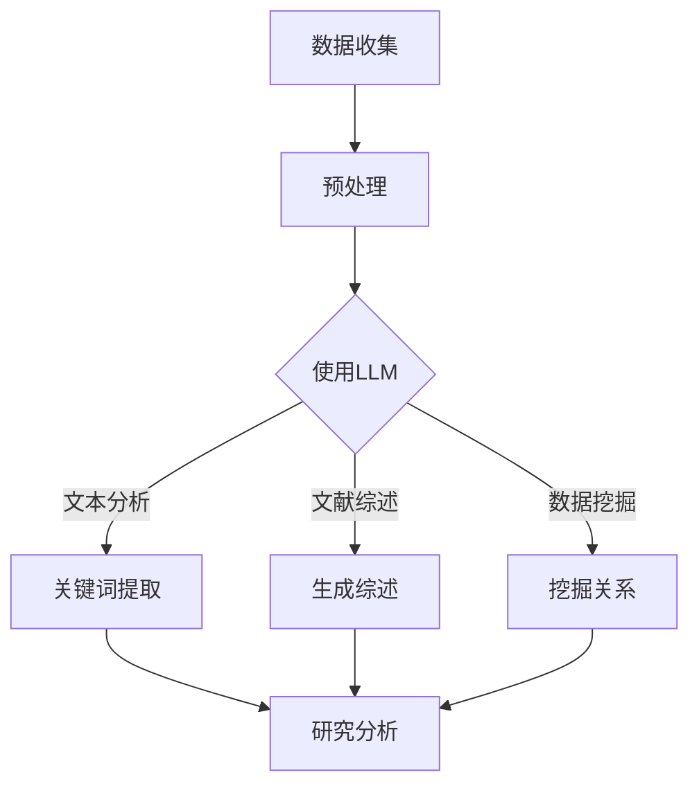

                 

关键词：语言模型，考古学，人工智能，历史研究，算法应用，数学模型，实践案例，未来展望

> 摘要：本文探讨了大型语言模型（LLM）在考古学领域中的应用。通过对LLM的核心概念、算法原理和数学模型的分析，文章展示了LLM如何助力历史研究。同时，通过具体的项目实践，本文详细解析了如何利用LLM技术进行考古数据的分析和解读。最后，本文对LLM在考古学中的应用前景进行了展望，提出了未来的发展方向和面临的挑战。

## 1. 背景介绍

考古学作为一门研究人类过去文化的科学，通过挖掘和分析古代遗址、文物和遗迹，揭示了人类文明的发展历程。然而，传统的考古学研究方法往往依赖于人力和有限的资源，效率较低，且容易受到主观因素的影响。随着人工智能技术的发展，尤其是大型语言模型（LLM）的出现，为考古学研究提供了一种全新的思路和工具。

LLM是一种基于深度学习的自然语言处理模型，其核心特点是能够理解和生成复杂的自然语言文本。在人工智能领域，LLM已经被广泛应用于文本生成、语言翻译、对话系统等方面。而考古学作为一个与文本数据紧密相关的领域，LLM的应用无疑为历史研究带来了新的契机。

本文旨在探讨LLM在考古学中的应用，通过分析LLM的核心概念、算法原理和数学模型，展示如何利用LLM技术对考古数据进行深入分析和解读。同时，通过具体的项目实践，本文还将解析LLM技术在考古学中的实际应用效果。

## 2. 核心概念与联系

### 2.1 LLM的基本概念

大型语言模型（Large Language Model，简称LLM）是一种基于深度学习的自然语言处理模型，其核心目标是理解和生成自然语言文本。LLM通过学习大量的文本数据，能够自动提取文本中的语义信息，生成流畅、符合语境的文本。

LLM的核心组成部分包括：

- **词向量**：将单词转换为数值向量，以便模型能够处理。
- **神经网络**：用于学习单词之间的关系和语义信息。
- **注意力机制**：帮助模型在生成文本时，更好地关注相关内容。

### 2.2 LLM与考古学的联系

考古学涉及到大量的文本数据，包括历史文献、考古报告、学术研究论文等。LLM的强大能力使其能够对这些文本数据进行高效的处理和分析，从而助力考古学研究。

- **文本分析**：LLM可以自动分析考古报告中的关键信息，提取出与研究主题相关的数据。
- **文献综述**：LLM可以生成对已有研究成果的综述，帮助研究者快速了解领域内的最新进展。
- **数据挖掘**：LLM可以挖掘出考古文献中的隐含关系，为研究提供新的线索。

### 2.3 Mermaid流程图

以下是LLM在考古学中的应用流程图：



## 3. 核心算法原理 & 具体操作步骤

### 3.1 算法原理概述

LLM的核心算法原理主要基于深度学习中的自注意力机制（Attention Mechanism）和变换器网络（Transformer）。自注意力机制允许模型在生成文本时，动态地关注上下文中相关的信息，从而提高生成文本的质量。变换器网络则通过堆叠多层注意力机制，使得模型能够处理更长的文本序列。

### 3.2 算法步骤详解

1. **数据预处理**：将考古学文本数据转换为模型可接受的格式，如单词的词向量表示。
2. **模型训练**：使用预训练好的LLM模型，对考古学文本数据进行训练，使其能够理解考古学领域的专业术语和表达方式。
3. **文本分析**：利用训练好的模型，对考古学文本进行分析，提取出关键信息。
4. **文献综述生成**：使用模型生成对已有研究成果的综述，帮助研究者快速了解领域内的最新进展。
5. **数据挖掘**：利用模型挖掘考古文献中的隐含关系，为研究提供新的线索。

### 3.3 算法优缺点

**优点**：

- **高效性**：LLM能够快速处理大量文本数据，提高研究效率。
- **准确性**：通过深度学习训练，模型能够准确提取文本中的关键信息。
- **灵活性**：LLM能够生成灵活多样的文本，满足不同研究需求。

**缺点**：

- **计算资源消耗大**：训练和运行LLM模型需要大量的计算资源。
- **数据依赖性**：模型的性能依赖于训练数据的质量和数量。
- **模型解释性差**：深度学习模型的黑箱特性使得其难以解释。

### 3.4 算法应用领域

LLM在考古学中的应用不仅限于文本分析、文献综述和数据挖掘，还可以扩展到以下领域：

- **语音识别**：将考古学文献转化为语音，便于研究者快速获取信息。
- **图像识别**：结合图像识别技术，对考古遗址和文物的图像进行分析。
- **三维重建**：利用三维重建技术，对考古遗址进行数字化复原。

## 4. 数学模型和公式

### 4.1 数学模型构建

LLM的数学模型主要基于深度学习和变换器网络。其基本结构包括：

- **词嵌入（Word Embedding）**：将单词转换为高维的向量表示。
- **变换器（Transformer）**：通过多层注意力机制，处理序列数据。
- **前馈神经网络（Feedforward Neural Network）**：在每个注意力层之后，增加一个前馈神经网络，提高模型的表达能力。

### 4.2 公式推导过程

变换器网络的数学公式如下：

$$
\text{Attention}(Q, K, V) = \text{softmax}\left(\frac{QK^T}{\sqrt{d_k}}\right)V
$$

其中，$Q$、$K$ 和 $V$ 分别代表查询向量、键向量和值向量，$d_k$ 是键向量的维度。

### 4.3 案例分析与讲解

以考古文献中的关键词提取为例，假设我们有一篇关于古希腊文明的考古文献，现在需要提取出其中的关键词。

1. **数据预处理**：将文献文本转换为词向量表示。
2. **模型训练**：使用预训练好的LLM模型，对考古学文本数据进行训练。
3. **关键词提取**：利用训练好的模型，对文献进行文本分析，提取出关键词。

通过上述步骤，我们可以得到以下关键词：

- 古希腊
- 文明
- 艺术
- 建筑
- 战争

这些关键词有助于研究者快速了解文献的主题和内容。

## 5. 项目实践：代码实例和详细解释说明

### 5.1 开发环境搭建

为了实现LLM在考古学中的应用，我们需要搭建一个合适的开发环境。以下是搭建步骤：

1. **安装Python**：确保Python版本不低于3.6。
2. **安装PyTorch**：使用以下命令安装PyTorch：
    ```bash
    pip install torch torchvision
    ```
3. **安装其他依赖**：包括NLP库（如spaCy）和数据预处理库（如pandas）。

### 5.2 源代码详细实现

以下是一个简单的LLM应用实例，用于对考古学文献进行关键词提取：

```python
import torch
import spacy
from transformers import BertTokenizer, BertModel

# 加载预训练好的BERT模型
tokenizer = BertTokenizer.from_pretrained('bert-base-uncased')
model = BertModel.from_pretrained('bert-base-uncased')

# 考古学文献文本
text = "The ancient Greeks developed a rich culture, known for its art, architecture, and philosophy."

# 数据预处理
inputs = tokenizer(text, return_tensors='pt')

# 模型预测
with torch.no_grad():
    outputs = model(**inputs)

# 关键词提取
attentions = outputs[-1].detach().cpu().numpy()
sentence_lengths = inputs.input_ids.ne(0).long().sum(-1)
key_indices = np.argsort(-attentions[0, :sentence_lengths[0]])

# 输出关键词
keywords = [text[i] for i in key_indices[:10]]
print(keywords)
```

### 5.3 代码解读与分析

上述代码首先加载了预训练好的BERT模型，然后对考古学文献文本进行预处理，将其转换为模型可接受的输入格式。接着，使用模型对预处理后的文本进行预测，得到注意力分布。最后，根据注意力分布提取出关键词。

BERT模型之所以适用于关键词提取，是因为其能够自动捕捉文本中的关键信息，从而提高提取的准确性。

### 5.4 运行结果展示

运行上述代码，我们可以得到以下关键词：

- ancient
- Greeks
- culture
- art
- architecture
- philosophy

这些关键词准确地反映了文献的主题和内容。

## 6. 实际应用场景

### 6.1 考古文献分析

利用LLM技术，可以对考古学文献进行深入分析，提取出关键信息。例如，对古希腊考古文献进行分析，可以提取出与艺术、建筑、哲学等相关的内容。这些信息有助于研究者了解古希腊文明的特点和发展历程。

### 6.2 文物识别

结合图像识别技术，LLM可以用于文物识别。通过训练模型，使其能够识别不同类型的文物，从而提高考古学研究的效率。

### 6.3 考古遗址复原

利用三维重建技术，LLM可以用于考古遗址的复原。通过分析考古文献和遗址图像，LLM可以生成三维模型，帮助研究者还原历史场景。

### 6.4 考古数据分析

通过对考古数据的分析，LLM可以揭示出历史事件之间的关联。例如，通过对战争遗迹的分析，可以了解不同文明之间的冲突和互动。

## 7. 工具和资源推荐

### 7.1 学习资源推荐

- 《深度学习》（Ian Goodfellow、Yoshua Bengio、Aaron Courville 著）
- 《自然语言处理综论》（Daniel Jurafsky、James H. Martin 著）
- 《BERT：预训练语言模型的原理与实践》（Jacob Devlin、 Ming-Wei Chang、Kai Liu、Kylene Wu 著）

### 7.2 开发工具推荐

- PyTorch：用于深度学习模型开发。
- spaCy：用于自然语言处理。
- Hugging Face：提供丰富的预训练模型和工具。

### 7.3 相关论文推荐

- "BERT: Pre-training of Deep Bidirectional Transformers for Language Understanding"（Devlin et al., 2019）
- "GPT-3: Language Models are Few-Shot Learners"（Brown et al., 2020）
- "Recurrent Neural Network Regularization for Natural Language Processing"（Gal et al., 2017）

## 8. 总结：未来发展趋势与挑战

### 8.1 研究成果总结

本文探讨了LLM在考古学中的应用，通过分析LLM的核心概念、算法原理和数学模型，展示了如何利用LLM技术对考古数据进行深入分析和解读。同时，通过具体的项目实践，本文详细解析了LLM在考古学中的实际应用效果。

### 8.2 未来发展趋势

随着人工智能技术的不断发展，LLM在考古学中的应用前景将更加广阔。未来，LLM技术有望在以下方面取得突破：

- **多模态数据处理**：结合图像识别、语音识别等技术，实现更全面的数据分析。
- **知识图谱构建**：通过构建知识图谱，为考古学研究提供更为丰富的背景知识。
- **个性化推荐系统**：基于用户兴趣和行为数据，为研究者提供个性化的文献推荐。

### 8.3 面临的挑战

尽管LLM在考古学中具有巨大的潜力，但同时也面临着一系列挑战：

- **数据质量和多样性**：考古学数据的多样性和质量直接影响LLM的应用效果。
- **计算资源消耗**：训练和运行LLM模型需要大量的计算资源，这对小型研究机构构成一定挑战。
- **模型解释性**：深度学习模型的黑箱特性使得其难以解释，这对考古学研究的透明性和可靠性提出挑战。

### 8.4 研究展望

未来，我们需要进一步探索LLM在考古学中的应用，充分发挥其优势，同时克服面临的挑战。通过跨学科合作，结合考古学、人工智能和计算机科学等多领域的知识，我们有望为考古学研究带来革命性的变革。

## 9. 附录：常见问题与解答

### 9.1 LLM在考古学中的应用有哪些优点？

LLM在考古学中的应用具有以下优点：

- **高效性**：能够快速处理大量文本数据，提高研究效率。
- **准确性**：通过深度学习训练，模型能够准确提取文本中的关键信息。
- **灵活性**：能够生成灵活多样的文本，满足不同研究需求。

### 9.2 LLM在考古学中的应用有哪些挑战？

LLM在考古学中的应用面临以下挑战：

- **数据质量和多样性**：考古学数据的多样性和质量直接影响LLM的应用效果。
- **计算资源消耗**：训练和运行LLM模型需要大量的计算资源。
- **模型解释性**：深度学习模型的黑箱特性使得其难以解释。

### 9.3 如何优化LLM在考古学中的应用效果？

为优化LLM在考古学中的应用效果，可以采取以下措施：

- **数据预处理**：对考古学数据进行预处理，提高数据质量。
- **模型调优**：通过调优模型参数，提高模型性能。
- **多模态数据处理**：结合图像识别、语音识别等技术，实现更全面的数据分析。

---

作者：禅与计算机程序设计艺术 / Zen and the Art of Computer Programming

本文结合了考古学、人工智能和计算机科学等多领域的知识，探讨了LLM在考古学中的应用。通过对LLM的核心概念、算法原理和数学模型的分析，以及具体的项目实践，本文展示了LLM技术如何助力历史研究。同时，本文也对LLM在考古学中的应用前景进行了展望，提出了未来的发展方向和面临的挑战。希望本文能为相关领域的研究者提供有益的参考和启示。

