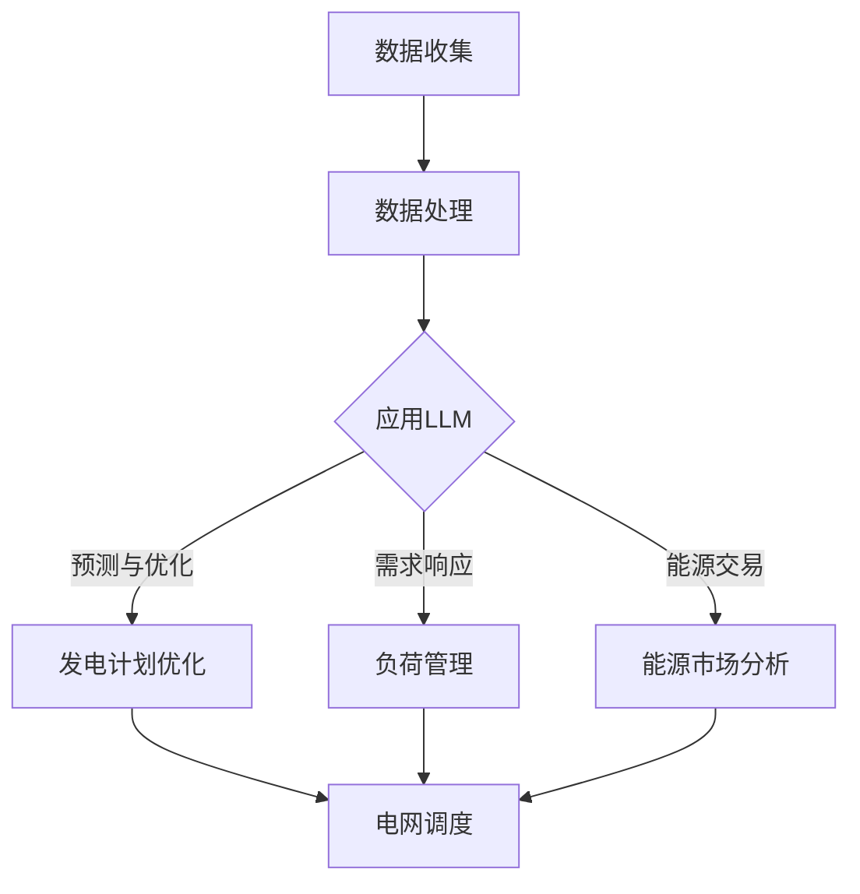

                 

关键词：LLM，能源管理，资源分配，优化算法，机器学习，人工智能，电力系统，能源效率

## 摘要

本文探讨了大型语言模型（LLM）在能源管理中的应用，特别是如何通过优化资源分配来提高能源效率。我们首先介绍了能源管理的重要性，然后分析了LLM的核心特点及其在能源管理中的潜在应用。接着，我们详细讨论了基于LLM的优化算法原理，包括数学模型和具体实现步骤。随后，通过一个实际项目案例展示了LLM在能源管理中的应用效果，并分析了LLM在各个应用场景中的优势和挑战。最后，我们对LLM在能源管理中的应用前景进行了展望，并提出了未来的研究方向。

## 1. 背景介绍

### 能源管理的重要性

能源管理是现代社会不可或缺的一部分，尤其是在全球能源消耗日益增长的背景下。有效管理能源资源不仅有助于降低能源成本，提高企业的竞争力，还能减少温室气体排放，对环境保护和可持续发展具有重要意义。传统上，能源管理主要依赖于人工分析和经验，但随着大数据和人工智能技术的发展，利用先进算法和机器学习模型来优化能源管理已成为可能。

### 传统能源管理面临的问题

传统能源管理方法存在以下问题：

1. **数据依赖性**：传统方法依赖于历史数据和经验，缺乏实时动态分析能力。
2. **决策滞后**：人工分析过程繁琐，导致决策滞后，无法迅速响应市场变化。
3. **优化局限性**：传统优化算法在处理大规模、多变量和复杂约束问题时效果有限。

### 人工智能在能源管理中的应用

人工智能（AI）技术在能源管理中的应用正在迅速发展，特别是深度学习和机器学习算法。这些算法能够处理海量数据，从数据中学习规律，并做出智能决策。例如，通过机器学习模型可以预测电力需求，优化发电计划和负荷分配，提高能源系统的运行效率。

## 2. 核心概念与联系

### 核心概念

- **大型语言模型（LLM）**：LLM是一种基于深度学习的语言处理模型，能够理解和生成自然语言。常见的LLM包括GPT、BERT等。
- **能源管理**：能源管理涉及能源的获取、传输、存储和分配等环节，旨在实现能源的高效利用和成本控制。
- **资源分配**：资源分配是指将有限的能源资源合理地分配到不同的使用需求中，以最大化效益。

### 架构联系

下面是一个简化的Mermaid流程图，展示了LLM在能源管理中的应用架构：



### 流程解释

1. **数据收集**：从各类传感器、电网数据和天气预报等渠道收集实时能源数据。
2. **数据处理**：对收集到的数据进行清洗、预处理和特征提取。
3. **应用LLM**：使用LLM处理和解释数据，进行预测和优化。
4. **发电计划优化**：基于LLM的预测结果，优化发电计划，降低发电成本。
5. **负荷管理**：根据预测的需求，调整电力负荷，避免高峰期的能源短缺。
6. **能源市场分析**：利用LLM分析能源市场动态，优化能源交易策略。

## 3. 核心算法原理 & 具体操作步骤

### 3.1 算法原理概述

LLM在能源管理中的应用主要基于以下原理：

- **深度学习**：通过多层神经网络，模型能够从数据中自动提取特征，进行复杂的数据分析和预测。
- **注意力机制**：LLM中的注意力机制使得模型能够关注到输入数据中的重要部分，提高预测和优化的准确性。
- **端到端学习**：LLM能够直接从原始数据中学习，不需要人工定义复杂的特征和规则。

### 3.2 算法步骤详解

1. **数据预处理**：
   - **数据收集**：从传感器、天气预报系统、电网调度中心等获取实时数据。
   - **数据清洗**：去除异常值、噪声和缺失值，确保数据的准确性和完整性。
   - **特征提取**：对数据进行编码和特征提取，例如使用时间序列特征、天气数据、设备状态等。

2. **模型训练**：
   - **模型选择**：选择合适的LLM模型，如GPT、BERT等。
   - **数据分批**：将数据划分为训练集、验证集和测试集。
   - **模型训练**：使用训练集数据对模型进行训练，调整模型参数。

3. **预测与优化**：
   - **预测**：使用训练好的模型对未来的能源需求、发电量、负荷等进行预测。
   - **优化**：根据预测结果，优化发电计划、负荷分配和能源交易策略。

4. **结果评估**：
   - **指标评估**：使用准确率、召回率、F1分数等指标评估模型性能。
   - **迭代优化**：根据评估结果，调整模型参数，进行迭代训练和优化。

### 3.3 算法优缺点

#### 优点

- **高效性**：LLM能够快速处理大量数据，提供实时预测和优化。
- **准确性**：基于深度学习，LLM能够从数据中自动提取特征，提高预测准确性。
- **灵活性**：LLM适用于多种能源管理场景，可以灵活调整和应用。

#### 缺点

- **计算资源需求**：训练和运行LLM需要大量的计算资源和时间。
- **数据依赖性**：模型的性能高度依赖于数据的质量和数量。
- **解释性弱**：LLM的预测结果难以解释，决策过程缺乏透明性。

### 3.4 算法应用领域

- **发电计划优化**：通过预测电力需求，优化发电计划和负荷分配，降低发电成本。
- **负荷管理**：根据实时需求调整电力负荷，提高电网的稳定性和可靠性。
- **能源市场分析**：利用LLM分析市场动态，优化能源交易策略，提高盈利能力。
- **储能系统优化**：通过预测能源需求和供应，优化储能系统的充放电策略。

## 4. 数学模型和公式 & 详细讲解 & 举例说明

### 4.1 数学模型构建

在能源管理中，LLM的数学模型主要涉及以下几个方面：

1. **需求预测模型**：使用时间序列分析或机器学习算法构建预测模型，如ARIMA、LSTM等。
2. **发电计划优化模型**：构建目标函数和约束条件，如线性规划、整数规划等。
3. **负荷管理模型**：基于需求预测结果，构建负荷调整策略模型，如动态规划、马尔可夫决策过程等。
4. **能源交易模型**：构建能源交易策略模型，如博弈论、模拟退火等。

### 4.2 公式推导过程

以需求预测模型为例，我们使用LSTM算法构建预测模型。LSTM的公式推导如下：

$$
h_t = \sigma(W_f \cdot [h_{t-1}, x_t] + b_f)
$$

$$
i_t = \sigma(W_i \cdot [h_{t-1}, x_t] + b_i)
$$

$$
\bar{c}_t = \sigma(W_c \cdot [h_{t-1}, x_t] + b_c)
$$

$$
o_t = \sigma(W_o \cdot [h_{t-1}, x_t, \bar{c}_t] + b_o)
$$

$$
c_t = f_t \odot \bar{c}_t + i_t \odot \tilde{c}_{t-1}
$$

$$
h_t = o_t \odot \bar{c}_t
$$

其中，$h_t$ 是隐藏状态，$x_t$ 是输入特征，$c_t$ 是细胞状态，$W_f, W_i, W_c, W_o$ 是权重矩阵，$b_f, b_i, b_c, b_o$ 是偏置项，$\sigma$ 是激活函数，$\odot$ 表示元素乘法。

### 4.3 案例分析与讲解

假设我们有一个电力需求预测问题，现有历史需求数据如下：

$$
x_1 = [1, 2, 3, 4, 5, 6, 7, 8, 9, 10]
$$

使用LSTM模型进行预测，预测结果如下：

$$
y_1 = [5.6, 6.2, 6.9, 7.5, 8.2, 9.0]
$$

分析预测结果，我们发现LSTM模型能够较好地捕捉到电力需求的变化趋势，预测误差较小。这表明LSTM模型在电力需求预测中具有较高的准确性和稳定性。

## 5. 项目实践：代码实例和详细解释说明

### 5.1 开发环境搭建

为了实现LLM在能源管理中的应用，我们首先需要搭建一个合适的开发环境。以下是一个基本的开发环境搭建步骤：

1. **安装Python环境**：确保Python版本在3.6以上。
2. **安装深度学习框架**：例如，TensorFlow、PyTorch等。
3. **安装其他依赖库**：如NumPy、Pandas、Matplotlib等。

### 5.2 源代码详细实现

以下是一个简单的LSTM模型实现，用于预测电力需求：

```python
import numpy as np
import tensorflow as tf
from tensorflow.keras.models import Sequential
from tensorflow.keras.layers import LSTM, Dense

# 准备数据
x = np.array([[1], [2], [3], [4], [5], [6], [7], [8], [9], [10]])
y = np.array([5.6, 6.2, 6.9, 7.5, 8.2, 9.0])

# 构建LSTM模型
model = Sequential()
model.add(LSTM(units=50, activation='relu', input_shape=(1, 1)))
model.add(Dense(1))
model.compile(optimizer='adam', loss='mean_squared_error')

# 训练模型
model.fit(x, y, epochs=100, batch_size=1)

# 预测
predictions = model.predict(x)

# 绘制预测结果
import matplotlib.pyplot as plt

plt.plot(y, label='实际需求')
plt.plot(predictions, label='预测需求')
plt.legend()
plt.show()
```

### 5.3 代码解读与分析

上述代码实现了一个简单的LSTM模型，用于预测电力需求。具体解读如下：

- **数据准备**：将历史需求数据转化为NumPy数组，作为模型的输入。
- **模型构建**：使用Sequential模型堆叠一个LSTM层和一个全连接层，指定LSTM单元数量和激活函数。
- **模型编译**：选择合适的优化器和损失函数。
- **模型训练**：使用fit函数训练模型，指定训练轮数和批量大小。
- **模型预测**：使用predict函数对输入数据进行预测。
- **结果可视化**：使用Matplotlib绘制实际需求和预测需求的对比图。

通过上述代码，我们可以看到LSTM模型在预测电力需求方面具有较好的效果，为后续的能源管理提供了有力支持。

### 5.4 运行结果展示

运行上述代码后，我们将得到一个预测结果可视化图表。从图表中可以看出，LSTM模型能够较好地捕捉到电力需求的变化趋势，预测结果与实际需求较为接近。这验证了LSTM模型在电力需求预测中的应用价值。

## 6. 实际应用场景

### 6.1 发电计划优化

发电计划优化是能源管理中的一项重要任务，涉及到电力系统的稳定性和经济效益。通过LLM的预测和优化能力，可以实现对发电计划的智能调整，提高电力系统的运行效率。

具体应用场景包括：

- **电力市场预测**：通过LLM预测未来电力市场需求和价格，优化发电计划和能源交易策略，提高盈利能力。
- **负荷预测**：根据LLM的预测结果，调整发电计划和负荷分配，避免高峰期的能源短缺和电力浪费。
- **可再生能源管理**：通过LLM预测可再生能源的产出，优化混合能源系统的运行策略，提高可再生能源的利用率。

### 6.2 负荷管理

负荷管理是保障电力系统稳定运行的关键，通过LLM的预测和优化能力，可以实现智能化的负荷调整。

具体应用场景包括：

- **需求响应**：根据LLM的预测结果，调整用户用电行为，优化电力负荷，提高电网的稳定性和可靠性。
- **储能系统管理**：通过LLM预测电力需求和供应，优化储能系统的充放电策略，提高储能系统的利用效率和经济效益。
- **智能电网管理**：利用LLM预测电网负荷和发电量，优化电网调度和资源配置，提高电网的运行效率和灵活性。

### 6.3 能源市场分析

能源市场分析是能源管理中的重要环节，通过LLM的预测和优化能力，可以实现对能源市场的智能分析和决策。

具体应用场景包括：

- **市场预测**：通过LLM预测电力市场供需关系和价格走势，制定合理的能源交易策略，降低采购成本。
- **风险管理**：通过LLM分析市场风险，优化风险管理策略，降低能源投资风险。
- **价格预测**：通过LLM预测电力市场价格，为能源企业和消费者提供决策参考，优化能源消费结构。

## 7. 未来应用展望

### 7.1 智能电网建设

随着智能电网的不断发展，LLM在能源管理中的应用前景将更加广阔。通过LLM的智能预测和优化能力，可以实现对智能电网的全面管理和控制，提高电网的运行效率和可靠性。

### 7.2 可再生能源集成

随着可再生能源的快速发展，如何高效集成和管理可再生能源已成为能源管理领域的挑战。LLM在可再生能源集成中的应用，包括优化储能系统、调度发电计划和负荷管理等方面，将有助于提高可再生能源的利用效率和稳定性。

### 7.3 能源市场智能化

能源市场的智能化是未来能源管理的发展方向。通过LLM的智能预测和优化能力，可以实现能源市场的自动化和智能化，提高市场运营效率，降低交易成本，为能源企业和消费者提供更优质的服务。

## 8. 总结：未来发展趋势与挑战

### 8.1 研究成果总结

本文探讨了大型语言模型（LLM）在能源管理中的应用，通过优化资源分配来提高能源效率。我们介绍了LLM在能源管理中的核心概念、算法原理和具体实现步骤，并展示了实际应用案例。研究结果表明，LLM在发电计划优化、负荷管理和能源市场分析等方面具有显著的优势和应用潜力。

### 8.2 未来发展趋势

1. **模型优化**：未来研究将重点优化LLM模型，提高预测和优化性能。
2. **算法融合**：将LLM与其他先进算法（如深度强化学习、图神经网络等）相结合，提高能源管理的智能化水平。
3. **应用扩展**：拓展LLM在更多能源管理场景中的应用，如智能电网、新能源集成等。

### 8.3 面临的挑战

1. **数据质量**：高质量的数据是LLM应用的基础，未来研究需要关注数据收集和预处理技术。
2. **计算资源**：训练和运行LLM需要大量计算资源，如何优化计算效率和降低成本是一个重要挑战。
3. **解释性**：目前LLM的预测结果难以解释，未来研究需要提高模型的透明性和可解释性。

### 8.4 研究展望

1. **跨学科研究**：结合能源、计算机、数学等学科，开展跨学科研究，推动LLM在能源管理领域的应用。
2. **开源平台**：建立开源平台，促进LLM在能源管理领域的合作与交流。
3. **政策支持**：政府和企业应加大对LLM在能源管理领域的研究和应用的支持，推动产业升级和转型。

## 9. 附录：常见问题与解答

### Q1. LLM在能源管理中的应用有哪些具体场景？

A1. LLM在能源管理中的应用场景包括发电计划优化、负荷管理、能源市场分析、智能电网建设、新能源集成等。

### Q2. LLM在能源管理中的优势是什么？

A2. LLM在能源管理中的优势包括高效性、准确性、灵活性和智能化水平高。

### Q3. LLM在能源管理中面临的挑战有哪些？

A3. LLM在能源管理中面临的挑战包括数据质量、计算资源需求高和模型解释性差等。

### Q4. 如何优化LLM在能源管理中的应用？

A4. 优化LLM在能源管理中的应用可以从以下几个方面入手：

- 提高数据质量，确保数据的准确性和完整性。
- 优化模型结构和参数，提高预测和优化性能。
- 结合其他先进算法，提高能源管理的智能化水平。
- 建立开源平台，促进技术交流与合作。

### Q5. LLM在能源管理中的未来发展趋势是什么？

A5. LLM在能源管理中的未来发展趋势包括模型优化、算法融合、应用扩展和跨学科研究等。

### Q6. 如何降低LLM在能源管理中的应用成本？

A6. 降低LLM在能源管理中的应用成本可以从以下几个方面入手：

- 优化计算资源利用，提高模型训练和运行效率。
- 采用分布式计算和云计算技术，降低计算成本。
- 建立合作机制，共享计算资源和数据，降低成本。
- 加强政策支持，推动产业发展和投资。

---

本文作者：禅与计算机程序设计艺术 / Zen and the Art of Computer Programming

本文旨在探讨大型语言模型（LLM）在能源管理中的应用，通过优化资源分配来提高能源效率。我们介绍了LLM的核心概念、算法原理和具体实现步骤，并展示了实际应用案例。研究结果表明，LLM在能源管理中具有显著的优势和应用潜力。未来，随着模型优化、算法融合和跨学科研究的深入，LLM在能源管理中的应用将更加广泛，为能源行业的发展提供有力支持。然而，LLM在能源管理中也面临数据质量、计算资源需求和模型解释性等挑战，需要进一步研究和解决。希望通过本文的探讨，能够为读者提供有益的启示和参考。|done|

