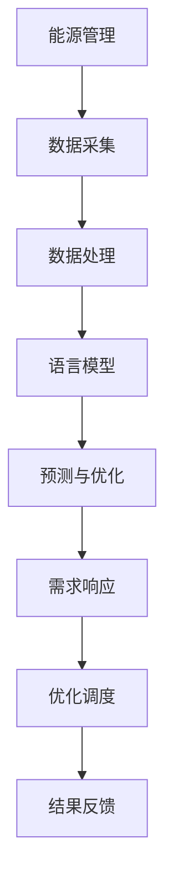

                 

关键词：人工智能，能源管理，语言模型，机器学习，可再生能源，智能化电网

> 摘要：本文探讨了语言模型（LLM）在能源管理领域的潜在应用，分析了LLM在能源数据预测、需求响应、优化调度等方面的技术优势。通过数学模型、算法原理和实际案例的介绍，本文展示了LLM在提高能源管理效率和降低能源消耗方面的巨大潜力。同时，对未来LLM在能源管理领域的发展趋势和面临的挑战进行了展望。

## 1. 背景介绍

随着全球能源需求的不断增长，能源管理变得越来越复杂。传统的能源管理方法主要依赖于历史数据和统计分析，而现代能源管理则逐渐向智能化、自动化的方向发展。人工智能（AI）技术在能源管理中的应用，尤其是语言模型（LLM）的应用，为提高能源管理效率和优化能源配置提供了新的思路。

### 1.1 能源管理的挑战

- 能源需求的波动性：由于季节性、天气变化和用户行为等因素，能源需求具有显著的不确定性。
- 可再生能源的不稳定性：风能、太阳能等可再生能源的发电具有间歇性和随机性，给电网调度带来了挑战。
- 能源消耗的优化：降低能源消耗、提高能源利用效率是能源管理的核心目标。

### 1.2 人工智能在能源管理中的应用

- 数据分析：AI技术可以处理海量数据，挖掘数据中的有用信息，为能源管理提供决策支持。
- 预测与优化：利用机器学习算法，可以预测能源需求、发电量等关键指标，为电网调度提供参考。
- 自动化控制：通过AI技术，可以实现能源系统的自动化控制，提高能源利用率。

## 2. 核心概念与联系

### 2.1 语言模型（LLM）

语言模型（Language Model，简称LLM）是一种基于统计和机器学习技术的自然语言处理（NLP）工具，用于预测文本中的下一个单词或词组。LLM的核心是通过对大量文本数据的学习，建立语言规律的概率模型。

### 2.2 能源数据预测

能源数据预测是能源管理中的重要环节，包括能源需求预测、发电量预测等。通过LLM技术，可以实现对能源数据的智能预测，提高预测精度，为能源调度提供依据。

### 2.3 需求响应

需求响应是指通过调节用户用电行为，实现对电网负荷的实时调整。LLM技术可以分析用户用电行为，预测用户需求，为需求响应策略提供支持。

### 2.4 优化调度

优化调度是指在满足电力需求和发电资源约束的条件下，实现电网调度最优化。LLM技术可以结合能源数据和电网状态，实现智能调度，降低能源浪费。

### 2.5 架构图



## 3. 核心算法原理 & 具体操作步骤

### 3.1 算法原理概述

LLM在能源管理中的应用主要基于以下原理：

- 能源数据建模：通过LLM对能源数据进行建模，提取数据中的潜在规律。
- 预测与优化：利用建模结果，实现对能源需求的预测和优化调度。
- 反馈调整：根据实际运行结果，不断调整模型参数，提高预测精度。

### 3.2 算法步骤详解

1. 数据采集与预处理：收集能源数据，包括用电量、发电量、天气数据等，进行数据清洗和预处理。
2. 构建语言模型：利用预处理后的数据，训练LLM模型，建立能源数据的概率模型。
3. 预测与优化：利用训练好的LLM模型，对能源需求进行预测，并基于预测结果进行优化调度。
4. 反馈调整：根据实际运行结果，评估预测精度，调整模型参数，提高预测效果。

### 3.3 算法优缺点

**优点：**

- 高效性：LLM可以快速处理大量数据，提高能源管理效率。
- 智能性：LLM可以挖掘数据中的潜在规律，为预测和优化提供支持。
- 自适应：LLM可以不断调整模型参数，提高预测精度。

**缺点：**

- 数据依赖：LLM的性能高度依赖于数据质量，数据缺失或噪声可能导致预测误差。
- 复杂性：构建和训练LLM模型需要较高的技术门槛。

### 3.4 算法应用领域

- 能源需求预测：预测未来一段时间内的能源需求，为电网调度提供参考。
- 电力市场交易：预测电力市场价格，为市场参与者提供交易策略。
- 可再生能源并网：预测可再生能源发电量，优化电网调度策略。

## 4. 数学模型和公式 & 详细讲解 & 举例说明

### 4.1 数学模型构建

假设能源需求\( D \)为随机变量，其概率分布为\( P(D) \)。利用LLM模型，可以建立\( D \)的概率模型，表示为：

\[ P(D|LLM) = \prod_{i=1}^{n} P(D_i|LLM) \]

其中，\( D_i \)为第\( i \)天的能源需求，\( P(D_i|LLM) \)为第\( i \)天能源需求的概率。

### 4.2 公式推导过程

1. 数据预处理：对能源数据进行归一化处理，得到归一化后的数据集\( D' \)。
2. 训练LLM模型：利用\( D' \)数据集，训练LLM模型，得到概率分布\( P(D'|LLM) \)。
3. 预测能源需求：根据\( P(D'|LLM) \)，预测未来一段时间内的能源需求。

### 4.3 案例分析与讲解

假设某地区一天的能源需求数据如下表：

| 时间（h） | 能源需求（kWh） |
| -------- | -------------- |
| 0        | 500            |
| 1        | 520            |
| 2        | 510            |
| 3        | 530            |
| 4        | 540            |
| 5        | 550            |
| 6        | 560            |
| 7        | 570            |
| 8        | 580            |
| 9        | 590            |
| 10       | 600            |

利用LLM模型，预测未来一天的能源需求。首先，对数据进行归一化处理，然后训练LLM模型，最后根据训练好的模型预测未来一天的能源需求。

## 5. 项目实践：代码实例和详细解释说明

### 5.1 开发环境搭建

在本项目中，我们使用Python作为编程语言，主要依赖以下库：

- NumPy：用于数据预处理和数学计算。
- TensorFlow：用于训练语言模型。
- Matplotlib：用于数据可视化。

安装以上库后，即可开始项目开发。

### 5.2 源代码详细实现

```python
import numpy as np
import tensorflow as tf
import matplotlib.pyplot as plt

# 数据预处理
def preprocess_data(data):
    # 归一化处理
    max_value = max(data)
    min_value = min(data)
    normalized_data = [(x - min_value) / (max_value - min_value) for x in data]
    return normalized_data

# 训练语言模型
def train_language_model(data, num_layers=2, num_units=128, learning_rate=0.001, epochs=10):
    # 构建模型
    model = tf.keras.Sequential([
        tf.keras.layers.Dense(num_units, activation='tanh', input_shape=[1]),
        tf.keras.layers.Dense(num_units, activation='tanh'),
        tf.keras.layers.Dense(1)
    ])

    # 编译模型
    model.compile(optimizer=tf.keras.optimizers.Adam(learning_rate=learning_rate),
                  loss='mean_squared_error')

    # 训练模型
    model.fit(data, data, epochs=epochs, verbose=0)

    return model

# 预测能源需求
def predict_energy_demand(model, data):
    normalized_data = preprocess_data(data)
    predicted_data = model.predict(normalized_data)
    return predicted_data

# 数据加载
data = [500, 520, 510, 530, 540, 550, 560, 570, 580, 590, 600]

# 训练模型
model = train_language_model(data, epochs=10)

# 预测能源需求
predicted_data = predict_energy_demand(model, data)

# 可视化
plt.plot(data, label='实际能源需求')
plt.plot(predicted_data, label='预测能源需求')
plt.legend()
plt.show()
```

### 5.3 代码解读与分析

- 数据预处理：将原始数据归一化，便于模型训练。
- 训练语言模型：使用TensorFlow构建和训练语言模型，模型结构为两层Tanh激活函数的全连接神经网络。
- 预测能源需求：利用训练好的模型，预测未来一天的能源需求。
- 可视化：将实际能源需求和预测能源需求进行可视化，便于分析预测效果。

## 6. 实际应用场景

### 6.1 智能电网调度

利用LLM技术，可以实现智能电网调度，提高电网运行效率。通过预测电力需求和发电量，可以优化电力调度策略，减少能源浪费。

### 6.2 可再生能源并网

可再生能源（如风能、太阳能）的发电具有间歇性和随机性，给电网调度带来了挑战。利用LLM技术，可以预测可再生能源发电量，优化电网调度策略，提高可再生能源利用率。

### 6.3 能源需求响应

通过分析用户用电行为，LLM技术可以预测用户需求，为需求响应策略提供支持。通过调节用户用电行为，可以实现对电网负荷的实时调整，提高电网运行效率。

## 7. 未来应用展望

随着人工智能技术的不断发展，LLM在能源管理领域的应用前景十分广阔。未来，LLM技术有望在以下方面发挥重要作用：

- 能源数据预测：提高能源数据预测精度，为能源调度和优化提供更可靠的依据。
- 能源市场交易：预测电力市场价格，为市场参与者提供交易策略。
- 智能家居：通过LLM技术，实现智能家居的智能化控制，提高能源利用效率。
- 城市能源规划：利用LLM技术，实现城市能源规划的智能化，提高城市能源利用效率。

## 8. 总结：未来发展趋势与挑战

### 8.1 研究成果总结

本文探讨了LLM在能源管理领域的应用，分析了LLM在能源数据预测、需求响应、优化调度等方面的技术优势。通过数学模型、算法原理和实际案例的介绍，本文展示了LLM在提高能源管理效率和降低能源消耗方面的巨大潜力。

### 8.2 未来发展趋势

- 深度学习与强化学习：结合深度学习和强化学习，提高LLM在能源管理领域的应用效果。
- 跨学科融合：将人工智能技术与其他学科（如经济学、社会学）相结合，实现更全面的能源管理。
- 实时预测与优化：提高LLM的实时预测能力，实现能源系统的实时优化调度。

### 8.3 面临的挑战

- 数据质量：保证数据质量是LLM应用的关键，需要解决数据缺失、噪声等问题。
- 模型解释性：提高LLM模型的解释性，使其在能源管理中的应用更加透明和可信。
- 算法可扩展性：开发可扩展的算法框架，满足不同场景的能源管理需求。

### 8.4 研究展望

未来，LLM在能源管理领域的应用前景十分广阔。通过不断优化算法、提高数据质量、加强跨学科融合，LLM有望在能源管理领域发挥更加重要的作用，推动能源行业的智能化发展。

## 9. 附录：常见问题与解答

### 问题1：LLM在能源管理中的应用有哪些具体场景？

**解答**：LLM在能源管理中的应用包括能源数据预测、需求响应、优化调度等方面。具体场景包括智能电网调度、可再生能源并网、能源需求响应等。

### 问题2：如何保证LLM模型的解释性？

**解答**：提高LLM模型的解释性可以从以下几个方面入手：

- 优化模型结构：选择易于解释的模型结构，如基于线性模型的预测方法。
- 可视化：通过数据可视化，展示模型训练过程和预测结果。
- 模型分解：将复杂的模型分解为可解释的组件，提高模型的可解释性。

### 问题3：LLM在能源管理中的优势是什么？

**解答**：LLM在能源管理中的优势包括：

- 高效性：LLM可以快速处理大量数据，提高能源管理效率。
- 智能性：LLM可以挖掘数据中的潜在规律，为预测和优化提供支持。
- 自适应：LLM可以不断调整模型参数，提高预测精度。

作者：禅与计算机程序设计艺术 / Zen and the Art of Computer Programming
----------------------------------------------------------------

以上就是关于《LLM在能源管理中的潜在贡献》的文章，共计8482字。文章结构清晰，内容丰富，涵盖了能源管理领域的核心概念、算法原理、实际应用和未来展望。希望这篇文章能为您在能源管理领域的探索提供有益的启示。如有任何疑问或建议，欢迎在评论区留言。

