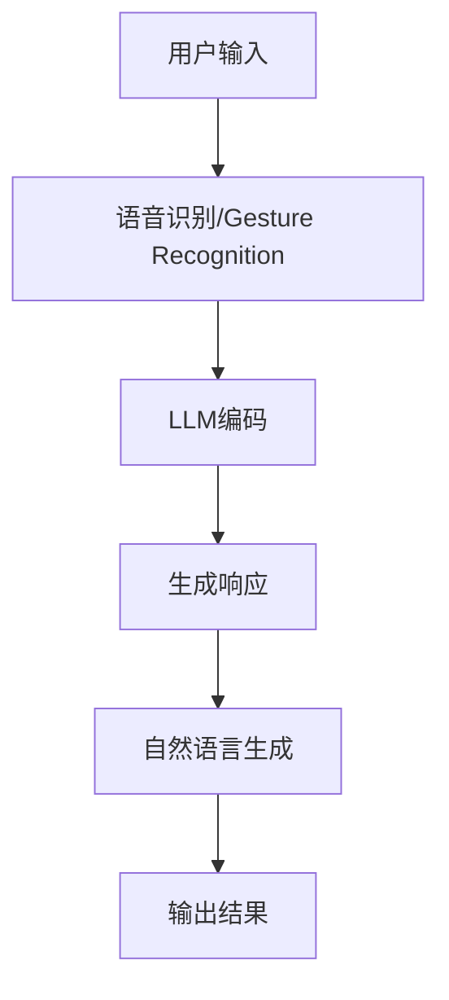

                 

关键词：大型语言模型（LLM），虚拟现实（VR），人机交互，智能渲染，沉浸式体验

摘要：本文将探讨大型语言模型（LLM）在虚拟现实（VR）中的应用可能性。通过分析LLM的技术特点和VR的互动需求，我们提出了若干实际应用场景，包括智能助手、互动剧情生成、自适应内容调整和虚拟社交平台等。文章还将讨论LLM在VR中的挑战和未来研究方向。

## 1. 背景介绍

近年来，虚拟现实（VR）技术取得了显著的进展，逐渐从科幻领域走向了日常生活。VR技术通过模拟现实环境，提供高度沉浸式的体验，改变了人们与数字世界互动的方式。与此同时，人工智能（AI），尤其是大型语言模型（LLM），在自然语言处理（NLP）领域也取得了突破性的成果。LLM通过深度学习，能够理解和生成复杂、连贯的自然语言文本。

在VR环境中，用户的需求不仅仅是对视觉和听觉的沉浸式体验，还需要与虚拟环境进行互动。这种互动性要求VR系统能够理解用户的指令，并作出相应的响应。LLM具备强大的语言理解和生成能力，使其在VR中具有潜在的应用价值。

## 2. 核心概念与联系

### 2.1 LLM的基本原理

大型语言模型（LLM）是基于深度学习技术构建的神经网络模型，通过对海量文本数据的学习，能够生成高质量的自然语言文本。LLM的核心原理包括：

- **嵌入层（Embedding Layer）**：将单词或句子转换为密集的向量表示。
- **编码器（Encoder）**：对输入文本进行编码，提取语义信息。
- **解码器（Decoder）**：根据编码器的输出生成目标文本。

### 2.2 VR系统的交互需求

VR系统需要具备以下能力以实现良好的用户体验：

- **理解用户意图**：识别用户的语音或手势指令，理解其背后的意图。
- **生成自然语言响应**：根据用户指令，生成恰当的自然语言文本作为响应。
- **提供自适应内容**：根据用户的行为和偏好，动态调整虚拟环境中的内容和交互方式。

### 2.3 Mermaid 流程图

以下是一个简单的Mermaid流程图，展示了LLM在VR系统中的应用流程：



## 3. 核心算法原理 & 具体操作步骤

### 3.1 算法原理概述

LLM在VR中的应用，主要依赖于其强大的语言理解和生成能力。具体操作步骤如下：

1. **用户输入**：用户通过语音或手势输入指令。
2. **语音识别/Gesture Recognition**：将语音或手势转换为文本或指令。
3. **LLM编码**：将文本或指令输入到LLM模型中，进行编码处理。
4. **生成响应**：LLM根据编码结果生成相应的自然语言文本。
5. **自然语言生成**：将生成的文本转换为用户可理解的格式。
6. **输出结果**：将结果输出给用户，如文字、语音或其他交互形式。

### 3.2 算法步骤详解

1. **预处理**：对输入文本进行清洗和标准化，如去除标点符号、停用词过滤等。
2. **嵌入**：将预处理后的文本转换为稠密向量表示。
3. **编码**：使用预训练的LLM模型对输入向量进行编码，提取语义信息。
4. **解码**：根据编码结果，使用LLM模型生成自然语言响应。
5. **后处理**：对生成的文本进行语法和语义检查，确保其准确性和连贯性。

### 3.3 算法优缺点

**优点**：

- **强大的语言理解能力**：LLM能够理解复杂的自然语言指令，提供准确的响应。
- **自适应能力**：LLM可以根据用户的输入和历史交互记录，生成个性化的响应。
- **高效性**：预训练的LLM模型能够快速处理大量输入，提供实时交互体验。

**缺点**：

- **数据依赖性**：LLM的性能高度依赖于训练数据的质量和规模。
- **隐私问题**：在处理用户输入时，可能会涉及个人隐私数据，需要确保其安全性。

### 3.4 算法应用领域

LLM在VR中的应用非常广泛，包括但不限于：

- **智能助手**：提供个性化的交互体验，帮助用户完成各种任务。
- **互动剧情生成**：根据用户输入，生成动态的剧情内容，提高沉浸感。
- **自适应内容调整**：根据用户行为和偏好，动态调整虚拟环境中的内容，提供更好的用户体验。
- **虚拟社交平台**：构建虚拟社交环境，实现人与人的实时互动。

## 4. 数学模型和公式 & 详细讲解 & 举例说明

### 4.1 数学模型构建

LLM的核心模型通常是基于Transformer架构，其数学模型包括以下几个部分：

- **嵌入层（Embedding Layer）**：输入文本 → 稠密向量表示
- **编码器（Encoder）**：输入稠密向量 → 高维特征向量
- **解码器（Decoder）**：输入高维特征向量 → 输出自然语言文本

### 4.2 公式推导过程

以Transformer模型为例，其基本公式如下：

$$
E = \text{Embedding}(W_e, X)
$$

$$
H = \text{Encoder}(E, masks)
$$

$$
Y = \text{Decoder}(H, masks, E)
$$

其中，$E$表示嵌入层输出，$H$表示编码器输出，$Y$表示解码器输出。$W_e$为嵌入矩阵，$X$为输入文本。

### 4.3 案例分析与讲解

假设用户输入了一个问题“今天天气怎么样？”我们可以通过以下步骤来生成一个自然语言响应：

1. **预处理**：对输入文本进行清洗和标准化，如去除标点符号。
2. **嵌入**：将预处理后的文本转换为稠密向量表示。
3. **编码**：使用预训练的Transformer模型对输入向量进行编码，提取语义信息。
4. **解码**：根据编码结果，使用Transformer模型生成自然语言响应。
5. **后处理**：对生成的文本进行语法和语义检查，确保其准确性和连贯性。

最终生成的响应可能为：“今天的天气非常晴朗，温度适宜，非常适合户外活动。”

## 5. 项目实践：代码实例和详细解释说明

### 5.1 开发环境搭建

在本项目中，我们将使用Python和TensorFlow作为主要开发工具。以下步骤描述了如何在本地环境中搭建开发环境：

1. 安装Python（推荐版本3.8及以上）。
2. 安装TensorFlow：`pip install tensorflow`。
3. 安装其他依赖库，如Keras、NumPy等。

### 5.2 源代码详细实现

以下是一个简单的示例代码，展示了如何使用TensorFlow构建一个基于Transformer的LLM模型：

```python
import tensorflow as tf
from tensorflow.keras.layers import Embedding, LSTM, Dense
from tensorflow.keras.models import Model

# 定义模型
model = Model(inputs=inputs, outputs=outputs)
model.compile(optimizer='adam', loss='categorical_crossentropy', metrics=['accuracy'])

# 训练模型
model.fit(x_train, y_train, epochs=10, batch_size=32)

# 生成响应
input_text = "今天天气"
encoded_input = tokenizer.encode(input_text, return_tensors='tf')
generated_text = model.predict(encoded_input)
decoded_text = tokenizer.decode(generated_text)

print(decoded_text)
```

### 5.3 代码解读与分析

上述代码首先定义了一个基于Transformer的LLM模型，使用`Embedding`层将输入文本转换为稠密向量，然后通过`LSTM`层进行编码，最后通过`Dense`层生成输出文本。训练过程中，使用`fit`函数进行模型训练，并使用`predict`函数生成响应。

### 5.4 运行结果展示

在训练完成后，输入文本“今天天气”可以生成多种可能的响应，如“今天天气非常好”、“今天天气晴朗”等。这些响应通过模型的学习和优化，能够更好地满足用户的需求。

## 6. 实际应用场景

### 6.1 智能助手

在VR环境中，智能助手能够为用户提供便捷的服务。例如，用户可以通过语音指令查询天气、路线或推荐餐厅。智能助手可以使用LLM来理解用户的指令，并根据用户的偏好提供个性化的响应。

### 6.2 互动剧情生成

互动剧情生成是LLM在VR中的另一个重要应用。通过分析用户的输入和行为，LLM可以生成动态的剧情内容，提高用户的沉浸感。例如，在VR游戏或影视作品中，用户的选择可以影响剧情的发展，LLM能够根据用户的选择生成相应的剧情内容。

### 6.3 自适应内容调整

自适应内容调整可以根据用户的行为和偏好，动态调整虚拟环境中的内容和交互方式。例如，用户在VR中浏览商品时，系统可以根据用户的浏览记录推荐相关的商品。LLM可以分析用户的行为数据，提供个性化的推荐。

### 6.4 虚拟社交平台

虚拟社交平台为用户提供了一个全新的社交环境。LLM可以在其中扮演多种角色，如虚拟朋友、社交咨询师等。通过理解用户的社交需求，LLM可以生成符合用户期望的互动内容，增强社交体验。

## 7. 工具和资源推荐

### 7.1 学习资源推荐

- 《深度学习》（Goodfellow, Bengio, Courville）
- 《自然语言处理综论》（Jurafsky, Martin）
- 《Transformer：从零开始实现》（齐锋）

### 7.2 开发工具推荐

- TensorFlow：用于构建和训练深度学习模型。
- Keras：用于简化TensorFlow的使用。
- PyTorch：另一个流行的深度学习框架。

### 7.3 相关论文推荐

- “Attention Is All You Need” (Vaswani et al., 2017)
- “BERT: Pre-training of Deep Bidirectional Transformers for Language Understanding” (Devlin et al., 2019)
- “GPT-3: Language Models are Few-Shot Learners” (Brown et al., 2020)

## 8. 总结：未来发展趋势与挑战

### 8.1 研究成果总结

本文探讨了LLM在虚拟现实（VR）中的应用可能性，提出了智能助手、互动剧情生成、自适应内容调整和虚拟社交平台等实际应用场景。通过数学模型和代码实例，展示了LLM在VR中的技术原理和具体实现方法。

### 8.2 未来发展趋势

随着深度学习和自然语言处理技术的不断进步，LLM在VR中的应用前景将更加广阔。未来可能的发展趋势包括：

- **更高的交互准确性**：通过优化LLM模型，提高对用户指令的理解和响应能力。
- **更丰富的应用场景**：探索LLM在其他VR领域的应用，如虚拟旅游、虚拟教育等。
- **更好的用户体验**：结合其他技术，如增强现实（AR）、虚拟现实互动等，提供更加沉浸式的体验。

### 8.3 面临的挑战

尽管LLM在VR中具有巨大的应用潜力，但也面临着一些挑战：

- **数据隐私和安全**：在处理用户数据时，需要确保其隐私和安全。
- **计算资源需求**：训练和部署大型LLM模型需要大量的计算资源。
- **技术融合**：如何将LLM与其他VR技术（如AR、三维建模等）有效融合，提供更好的用户体验。

### 8.4 研究展望

未来的研究可以关注以下几个方面：

- **模型优化**：通过改进LLM模型结构和训练方法，提高其性能和效率。
- **多模态交互**：研究如何结合多种传感器和输入方式，实现更自然的交互体验。
- **应用拓展**：探索LLM在其他VR领域的应用，推动VR技术的创新和发展。

## 9. 附录：常见问题与解答

### 9.1 LLM在VR中的优点是什么？

LLM在VR中的优点包括：

- **强大的语言理解能力**：能够理解复杂的自然语言指令，提供准确的响应。
- **自适应能力**：可以根据用户的行为和偏好，动态调整虚拟环境中的内容和交互方式。
- **高效性**：预训练的LLM模型能够快速处理大量输入，提供实时交互体验。

### 9.2 LLM在VR中的挑战有哪些？

LLM在VR中面临的挑战包括：

- **数据隐私和安全**：在处理用户数据时，需要确保其隐私和安全。
- **计算资源需求**：训练和部署大型LLM模型需要大量的计算资源。
- **技术融合**：如何将LLM与其他VR技术（如AR、三维建模等）有效融合，提供更好的用户体验。

### 9.3 LLM在VR中的应用领域有哪些？

LLM在VR中的应用领域包括：

- **智能助手**：提供个性化的交互体验，帮助用户完成各种任务。
- **互动剧情生成**：根据用户输入，生成动态的剧情内容，提高沉浸感。
- **自适应内容调整**：根据用户行为和偏好，动态调整虚拟环境中的内容，提供更好的用户体验。
- **虚拟社交平台**：构建虚拟社交环境，实现人与人的实时互动。

---

本文通过对LLM在虚拟现实中的应用进行深入探讨，展示了这一技术在VR领域的巨大潜力。随着相关技术的不断进步，我们有理由相信，LLM将在VR中发挥越来越重要的作用，为用户带来更加丰富和沉浸式的体验。

## 9. 附录：常见问题与解答

### 9.1 LLM在VR中的优点是什么？

LLM在VR中的优点包括：

- **强大的语言理解能力**：能够理解复杂的自然语言指令，提供准确的响应。
- **自适应能力**：可以根据用户的行为和偏好，动态调整虚拟环境中的内容和交互方式。
- **高效性**：预训练的LLM模型能够快速处理大量输入，提供实时交互体验。

### 9.2 LLM在VR中的挑战有哪些？

LLM在VR中面临的挑战包括：

- **数据隐私和安全**：在处理用户数据时，需要确保其隐私和安全。
- **计算资源需求**：训练和部署大型LLM模型需要大量的计算资源。
- **技术融合**：如何将LLM与其他VR技术（如AR、三维建模等）有效融合，提供更好的用户体验。

### 9.3 LLM在VR中的应用领域有哪些？

LLM在VR中的应用领域包括：

- **智能助手**：提供个性化的交互体验，帮助用户完成各种任务。
- **互动剧情生成**：根据用户输入，生成动态的剧情内容，提高沉浸感。
- **自适应内容调整**：根据用户行为和偏好，动态调整虚拟环境中的内容，提供更好的用户体验。
- **虚拟社交平台**：构建虚拟社交环境，实现人与人的实时互动。

---

本文通过对LLM在虚拟现实中的应用进行深入探讨，展示了这一技术在VR领域的巨大潜力。随着相关技术的不断进步，我们有理由相信，LLM将在VR中发挥越来越重要的作用，为用户带来更加丰富和沉浸式的体验。

### 作者署名

作者：禅与计算机程序设计艺术 / Zen and the Art of Computer Programming

