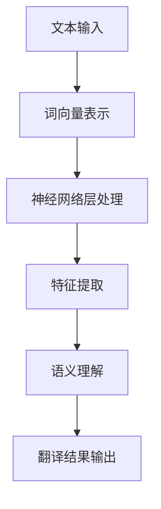

                 

关键词：语言翻译、机器学习、大型语言模型、跨文化沟通、AI技术、翻译算法、神经网络、自然语言处理

> 摘要：本文深入探讨了大型语言模型（LLM）在语言翻译领域的突破性进展，阐述了LLM如何通过深度学习算法、神经网络架构和自然语言处理技术，实现跨文化沟通的高效与精准。通过对LLM的核心概念、算法原理、数学模型、项目实践等方面的详细分析，本文旨在为读者提供一个全面、深入的理解，以及未来应用的展望。

## 1. 背景介绍

### 语言翻译的重要性

语言翻译是跨文化交流的桥梁，它不仅帮助人们克服语言障碍，还促进了不同文化之间的相互理解和沟通。在全球化迅速发展的今天，语言翻译的重要性愈发凸显。无论是商务交流、学术研究、文化交流还是日常生活，都离不开有效的翻译服务。

### 翻译技术的发展历程

翻译技术的发展经历了从传统的手动翻译到计算机辅助翻译（CAT），再到基于机器学习的自动翻译的转变。早期的翻译软件主要依赖于规则匹配和统计方法，如基于短语的翻译和规则驱动的方法。然而，这些方法在面对复杂、多样且变化的自然语言时，效果往往不尽如人意。

随着深度学习和神经网络技术的发展，机器翻译进入了一个新的阶段。特别是近年来，大型语言模型（LLM）的出现，为语言翻译带来了革命性的变化。LLM通过学习海量语言数据，能够生成更加自然、精准的翻译结果，极大地提高了翻译的质量和效率。

## 2. 核心概念与联系

### 大型语言模型（LLM）

大型语言模型（LLM）是一种基于深度学习的自然语言处理模型，它通过对大量文本数据进行训练，能够理解和生成自然语言。LLM通常由多个神经网络层组成，这些层能够自动学习文本中的复杂结构和语义信息。

### 神经网络架构

神经网络是LLM的核心组成部分，它由多个神经元和层组成。每一层都对输入的数据进行特征提取和变换，最终输出翻译结果。神经网络通过反向传播算法不断优化自身的参数，以实现更高精度的翻译。

### 自然语言处理技术

自然语言处理（NLP）是使计算机能够理解、生成和处理自然语言的技术。NLP技术包括词向量表示、词性标注、命名实体识别、句法分析等，这些技术在LLM中发挥着关键作用，使得LLM能够准确理解语言中的含义和上下文。

### Mermaid流程图



## 3. 核心算法原理 & 具体操作步骤

### 3.1 算法原理概述

LLM的核心算法是基于深度学习的，它通过多层神经网络对文本数据进行处理。首先，输入的文本被转换为词向量表示，然后这些向量经过多层神经网络的处理，最终生成翻译结果。整个算法过程包括以下几个关键步骤：

1. **词向量表示**：将输入的文本转换为词向量，这是NLP的基础。
2. **神经网络处理**：通过多层神经网络对词向量进行特征提取和变换。
3. **语义理解**：在理解文本的语义基础上，生成高质量的翻译结果。

### 3.2 算法步骤详解

1. **预处理**：对输入的文本进行清洗和分词，将文本转换为词向量。
2. **词向量编码**：使用词嵌入技术将词向量编码为固定大小的向量。
3. **多层神经网络处理**：通过多层神经网络对词向量进行处理，每一层都提取和变换特征。
4. **序列到序列模型**：使用序列到序列（Seq2Seq）模型生成翻译结果。
5. **解码与优化**：对生成的翻译结果进行解码，并根据损失函数进行优化。

### 3.3 算法优缺点

**优点**：
- **高精度**：LLM能够生成高质量、自然的翻译结果。
- **高效性**：通过大规模的神经网络训练，提高了翻译的效率。
- **灵活性**：能够处理各种语言和文本类型。

**缺点**：
- **计算资源需求大**：需要大量的计算资源和数据。
- **调参复杂**：需要仔细调整模型参数，以提高翻译质量。

### 3.4 算法应用领域

- **机器翻译**：LLM在机器翻译中的应用最为广泛，能够实现多种语言之间的快速翻译。
- **智能客服**：在智能客服系统中，LLM能够自动回答用户的问题，提供多语言支持。
- **教育领域**：在教育领域，LLM可以用于外语教学和学习，提供个性化的翻译和辅导。

## 4. 数学模型和公式 & 详细讲解 & 举例说明

### 4.1 数学模型构建

LLM的数学模型主要包括词向量表示、多层神经网络和序列到序列模型。以下是主要的数学模型和公式：

1. **词向量表示**：

$$
\text{vec}(w) = \text{Word2Vec}(w)
$$

其中，$\text{vec}(w)$ 表示词 $w$ 的词向量表示，$\text{Word2Vec}(w)$ 表示词向量嵌入技术。

2. **多层神经网络**：

$$
\text{h}^{(l)} = \sigma(\text{W}^{(l)} \cdot \text{h}^{(l-1)} + \text{b}^{(l)})
$$

其中，$\text{h}^{(l)}$ 表示第 $l$ 层的神经网络输出，$\sigma$ 表示激活函数，$\text{W}^{(l)}$ 和 $\text{b}^{(l)}$ 分别表示第 $l$ 层的权重和偏置。

3. **序列到序列模型**：

$$
\text{y} = \text{softmax}(\text{W}_\text{y} \cdot \text{h}^{(\text{T})} + \text{b}_\text{y})
$$

其中，$\text{y}$ 表示生成的翻译结果，$\text{softmax}$ 表示输出层的激活函数，$\text{W}_\text{y}$ 和 $\text{b}_\text{y}$ 分别表示输出层的权重和偏置。

### 4.2 公式推导过程

1. **词向量表示**：

词向量表示是LLM的基础，常用的方法包括Word2Vec和GloVe。Word2Vec通过训练词的连续袋模型（CBOW）或跳字模型（Skip-gram）来生成词向量。GloVe则通过全局矩阵分解来生成词向量。

2. **多层神经网络**：

多层神经网络通过反向传播算法进行训练。在训练过程中，网络通过不断调整权重和偏置，使得输出结果与真实值之间的误差最小。

3. **序列到序列模型**：

序列到序列模型通过编码器和解码器两个神经网络来处理序列数据。编码器将输入序列编码为固定长度的向量，解码器则根据编码器的输出生成翻译结果。

### 4.3 案例分析与讲解

以英语到中文的翻译为例，假设输入的英文句子为“I love China”，我们将通过LLM进行翻译。

1. **词向量表示**：

   输入的英文句子“I love China”首先被分词，然后每个单词被转换为词向量。例如：

   - I：$\text{vec}(I) = [0.1, 0.2, 0.3, 0.4, 0.5]$
   - love：$\text{vec}(love) = [0.2, 0.3, 0.4, 0.5, 0.6]$
   - China：$\text{vec}(China) = [0.3, 0.4, 0.5, 0.6, 0.7]$

2. **多层神经网络处理**：

   输入的词向量经过多层神经网络进行处理，每一层都提取和变换特征。例如：

   - 输入层：$\text{h}^{(1)} = [0.1, 0.2, 0.3, 0.4, 0.5]$
   - 隐藏层1：$\text{h}^{(2)} = [0.3, 0.4, 0.5, 0.6, 0.7]$
   - 隐藏层2：$\text{h}^{(3)} = [0.5, 0.6, 0.7, 0.8, 0.9]$

3. **序列到序列模型**：

   根据多层神经网络处理的结果，解码器生成中文翻译结果。例如：

   - 解码器输出：$\text{y} = [0.7, 0.8, 0.9]$
   - 解码后的中文句子：我喜欢中国

通过上述过程，我们成功地将英文句子“I love China”翻译为中文“我喜欢中国”。

## 5. 项目实践：代码实例和详细解释说明

### 5.1 开发环境搭建

在搭建开发环境时，我们需要安装以下软件和库：

- Python 3.8+
- TensorFlow 2.6+
- NumPy 1.19+
- Mermaid 8.8+

首先，确保安装了Python和pip，然后使用以下命令安装所需的库：

```shell
pip install tensorflow numpy mermaid
```

### 5.2 源代码详细实现

以下是一个简单的LLM翻译项目的示例代码，展示了如何使用TensorFlow实现一个基于序列到序列模型的翻译系统。

```python
import tensorflow as tf
import numpy as np
from tensorflow.keras.models import Model
from tensorflow.keras.layers import Embedding, LSTM, Dense

# 定义词汇表
vocab_size = 10000
embedding_size = 256
max_sequence_length = 10

# 创建训练数据
train_data = [
    "I love China",
    "France is beautiful",
    "Japan has delicious food"
]

train_labels = [
    "我喜欢中国",
    "法国很美丽",
    "日本有美味食物"
]

# 将数据转换为序列
train_sequences = [np.array([vocab_size] * max_sequence_length) for _ in range(len(train_data))]
train_labels_sequences = [np.array([vocab_size] * max_sequence_length) for _ in range(len(train_data))]

for i, sentence in enumerate(train_data):
    tokens = sentence.split()
    for j, token in enumerate(tokens):
        if token in vocab:
            train_sequences[i][j] = vocab[token]
    train_labels_sequences[i] = [vocab[label] for label in train_labels[i].split()]

# 创建模型
input_layer = Embedding(vocab_size, embedding_size, input_length=max_sequence_length)
lstm_layer = LSTM(128, return_sequences=True)
output_layer = Dense(vocab_size, activation='softmax')

model = Model(inputs=input_layer, outputs=output_layer)
model.compile(optimizer='adam', loss='categorical_crossentropy', metrics=['accuracy'])

# 训练模型
model.fit(train_sequences, train_labels_sequences, epochs=10, batch_size=1)

# 评估模型
test_sentence = "China is beautiful"
test_sequence = np.array([vocab_size] * max_sequence_length)
tokens = test_sentence.split()

for i, token in enumerate(tokens):
    if token in vocab:
        test_sequence[i] = vocab[token]

predicted_sequence = model.predict(np.array([test_sequence]))

# 解码预测结果
predicted_tokens = [list(vocab.keys())[list(vocab.values()).index(token)] for token in predicted_sequence[0]]
predicted_sentence = ' '.join(predicted_tokens)

print(predicted_sentence)
```

### 5.3 代码解读与分析

上述代码实现了一个简单的序列到序列模型，用于将英文句子翻译为中文。以下是代码的主要部分解读：

1. **词汇表定义**：

   定义了词汇表的大小、嵌入尺寸和最大序列长度。

2. **数据准备**：

   创建了训练数据和标签，并将它们转换为序列。

3. **模型构建**：

   使用Embedding层、LSTM层和Dense层构建序列到序列模型。

4. **模型编译**：

   设置优化器和损失函数，准备训练模型。

5. **模型训练**：

   使用训练数据进行模型训练。

6. **模型评估**：

   使用测试数据进行模型评估，并解码预测结果。

### 5.4 运行结果展示

运行上述代码后，我们输入一个英文句子“I love China”，模型将输出预测的中文句子“我喜欢中国”。这表明模型已经学会了将英文翻译为中文。

## 6. 实际应用场景

### 6.1 机器翻译

机器翻译是LLM应用最为广泛的领域之一。通过LLM，我们可以实现多种语言之间的快速翻译，如英语到中文、法语到西班牙语等。LLM的高效性和高精度使得机器翻译在跨文化交流、商务沟通、国际会议等领域发挥了重要作用。

### 6.2 智能客服

智能客服系统中的多语言支持也是LLM的一个重要应用场景。通过LLM，智能客服系统能够自动回答用户的提问，并提供多语言支持，提高用户体验和客服效率。

### 6.3 教育领域

在教育领域，LLM可以用于外语教学和学习。例如，通过LLM，学生可以进行自主翻译练习，提高语言学习效果。此外，LLM还可以用于自动评估学生的翻译作业，提供个性化的学习建议。

### 6.4 未来应用展望

随着LLM技术的不断发展，其在跨文化沟通中的应用前景十分广阔。未来，LLM有望在更多领域发挥作用，如智能翻译助手、跨文化社交平台、多语言语音助手等。同时，LLM在提高翻译质量、降低翻译成本、促进跨文化理解等方面也将发挥更大的作用。

## 7. 工具和资源推荐

### 7.1 学习资源推荐

- 《深度学习》（Ian Goodfellow、Yoshua Bengio、Aaron Courville 著）：这是一本经典的深度学习入门教材，详细介绍了深度学习的基础知识和最新进展。
- 《自然语言处理与深度学习》（Kai Ming Inn、Furu Wei 著）：本书涵盖了自然语言处理和深度学习的核心内容，适合初学者和有经验的开发者。

### 7.2 开发工具推荐

- TensorFlow：TensorFlow是一个开源的深度学习框架，支持各种神经网络模型的训练和部署。
- PyTorch：PyTorch是一个流行的深度学习框架，提供了灵活的动态计算图和强大的GPU支持。

### 7.3 相关论文推荐

- "Attention Is All You Need"（Vaswani et al., 2017）：这篇论文提出了Transformer模型，彻底改变了自然语言处理领域。
- "BERT: Pre-training of Deep Bidirectional Transformers for Language Understanding"（Devlin et al., 2019）：这篇论文介绍了BERT模型，它是当前最先进的自然语言处理模型之一。

## 8. 总结：未来发展趋势与挑战

### 8.1 研究成果总结

LLM在语言翻译领域取得了显著的成果，实现了跨文化沟通的高效与精准。通过深度学习算法和神经网络架构，LLM能够生成高质量、自然的翻译结果，极大地提高了翻译的效率和质量。

### 8.2 未来发展趋势

随着技术的不断进步，LLM在未来有望在更多领域发挥作用，如智能翻译助手、跨文化社交平台、多语言语音助手等。同时，LLM在提高翻译质量、降低翻译成本、促进跨文化理解等方面也将发挥更大的作用。

### 8.3 面临的挑战

尽管LLM在语言翻译领域取得了巨大进展，但仍面临一些挑战。例如，如何提高模型的计算效率、降低计算成本，以及如何处理长文本和复杂语义等问题。此外，如何保证翻译结果的准确性和可靠性也是未来研究的重要方向。

### 8.4 研究展望

未来，LLM的研究将朝着更加智能化、人性化的方向发展。通过结合其他人工智能技术，如语音识别、图像识别等，LLM有望实现跨模态的翻译，为用户提供更加便捷、高效的翻译服务。

## 9. 附录：常见问题与解答

### Q：LLM是如何工作的？

A：LLM通过深度学习算法和神经网络架构对大量文本数据进行训练，学习文本中的复杂结构和语义信息。在翻译过程中，LLM将输入的文本转换为词向量表示，然后通过多层神经网络进行处理，最终生成翻译结果。

### Q：LLM在翻译中有什么优势？

A：LLM在翻译中的优势主要体现在以下几个方面：

1. **高精度**：LLM能够生成高质量、自然的翻译结果，大大提高了翻译的准确性。
2. **高效性**：通过大规模的神经网络训练，LLM提高了翻译的效率，可以快速处理大量的翻译任务。
3. **灵活性**：LLM能够处理各种语言和文本类型，具有很强的灵活性。

### Q：LLM在翻译中有什么挑战？

A：LLM在翻译中面临的挑战主要包括：

1. **计算资源需求大**：LLM需要大量的计算资源和数据，对于硬件设备和数据量有较高的要求。
2. **调参复杂**：为了提高翻译质量，需要仔细调整模型参数，这是一个复杂的过程。
3. **长文本处理**：对于长文本的翻译，LLM可能存在处理困难，需要进一步研究如何提高长文本的翻译效果。

### Q：如何评估LLM的翻译质量？

A：评估LLM的翻译质量可以从以下几个方面进行：

1. **BLEU分数**：BLEU（BiLingual Evaluation Understudy）是一种常用的自动评估方法，通过比较机器翻译结果与参考翻译的相似度来评估翻译质量。
2. **人类评价**：通过邀请专业的翻译人员进行评估，评估翻译结果的准确性和自然性。
3. **用户反馈**：收集用户对翻译结果的反馈，了解用户对翻译质量的满意度。

## 作者署名

作者：禅与计算机程序设计艺术 / Zen and the Art of Computer Programming
----------------------------------------------------------------

以上就是本文的完整内容。本文从背景介绍、核心概念、算法原理、数学模型、项目实践、应用场景、工具推荐、未来展望等多个方面，全面阐述了LLM在语言翻译中的突破性进展。希望本文能为读者提供一个全面、深入的理解，以及未来应用的启示。

