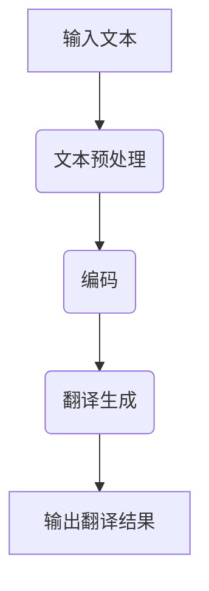

                 

# LLM在语言翻译领域的突破

### 引言

随着全球化的不断深入，跨语言交流变得愈发重要。然而，语言翻译作为一项复杂的技术任务，长期以来都面临着巨大的挑战。近年来，随着深度学习技术的迅猛发展，尤其是大型语言模型（LLM）的出现，语言翻译领域迎来了革命性的突破。本文旨在探讨LLM在语言翻译领域的应用，分析其核心概念、算法原理、数学模型以及未来发展趋势。

本文将分为以下几个部分进行论述：

1. **背景介绍**：简要回顾传统语言翻译技术的历史，分析其局限性。
2. **核心概念与联系**：介绍LLM的基本原理，并与传统机器翻译方法进行比较。
3. **核心算法原理 & 具体操作步骤**：详细阐述LLM在语言翻译中的算法流程和操作步骤。
4. **数学模型和公式 & 详细讲解 & 举例说明**：介绍LLM的数学模型和关键公式，并给出具体案例进行分析。
5. **项目实践：代码实例和详细解释说明**：通过实际项目展示LLM在语言翻译中的应用。
6. **实际应用场景**：探讨LLM在不同领域的具体应用案例。
7. **未来应用展望**：预测LLM在语言翻译领域的发展趋势和潜在挑战。
8. **工具和资源推荐**：推荐相关的学习资源、开发工具和论文。
9. **总结：未来发展趋势与挑战**：总结研究成果，探讨未来的发展方向。

### 1. 背景介绍

#### 传统语言翻译技术

传统的语言翻译技术主要依赖于规则驱动和统计机器翻译（SMT）方法。规则驱动方法依赖于手工编写的语法规则和翻译词典，虽然对特定领域翻译效果较好，但通用性较差，且随着语言复杂度的增加，规则编写难度和成本显著上升。统计机器翻译方法则通过统计大量双语平行语料，训练模型实现翻译，这种方法在处理大规模数据和通用翻译任务上表现出色，但仍存在许多不足。

首先，统计机器翻译依赖大量高质量的双语平行语料库，然而实际获取这样的语料库往往非常困难。其次，统计机器翻译模型对于低资源语言的支持较弱，因为低资源语言的平行语料往往稀缺。此外，传统机器翻译方法在处理长句子和长距离依赖时表现较差，常常出现翻译不准确或者语义丢失的问题。

#### 限制与挑战

传统语言翻译技术面临以下主要限制和挑战：

1. **数据依赖性**：依赖于大量高质量的双语平行语料库，缺乏平行语料的语言难以进行有效翻译。
2. **规则编写成本**：规则驱动方法需要大量手工编写的语法规则，成本高且维护困难。
3. **长距离依赖处理**：传统模型在处理长句子和长距离依赖时表现不佳，导致翻译结果不准确。
4. **多语言支持**：对于低资源语言的翻译效果较差，难以实现跨语言的有效翻译。

这些限制和挑战推动了深度学习技术在语言翻译领域的应用，特别是大型语言模型（LLM）的出现，为语言翻译带来了新的希望和突破。

### 2. 核心概念与联系

#### 大型语言模型（LLM）

大型语言模型（LLM）是指通过深度学习技术训练的，具有强大语言理解和生成能力的模型。LLM的核心思想是利用大规模的文本数据进行训练，学习语言的结构和语义，从而实现高质量的语言生成和翻译。LLM通常基于自注意力机制（Self-Attention）和变换器模型（Transformer），能够在处理长文本和复杂语言结构方面表现出色。

#### LLM与语言翻译的关系

LLM在语言翻译中的应用主要体现在以下几个方面：

1. **文本预处理**：LLM能够对输入文本进行有效的预处理，包括分词、词性标注和命名实体识别等，为后续的翻译任务提供高质量的数据输入。
2. **翻译生成**：LLM通过自注意力机制和编码器-解码器结构，能够生成高质量的翻译结果，实现跨语言的准确翻译。
3. **上下文理解**：LLM具有强大的上下文理解能力，能够在翻译过程中考虑句子的整体语义，提高翻译的准确性和流畅性。

#### Mermaid流程图

为了更好地展示LLM在语言翻译中的流程，我们使用Mermaid绘制了一个简化的流程图：



在这个流程图中，输入文本首先经过文本预处理，然后通过编码器进行编码，编码后的向量传递到解码器，最终生成翻译结果。

### 3. 核心算法原理 & 具体操作步骤

#### 算法原理概述

LLM在语言翻译中的核心算法基于变换器模型（Transformer），该模型由Vaswani等人于2017年提出。变换器模型的核心思想是使用自注意力机制（Self-Attention）来处理序列数据，通过多头注意力（Multi-Head Attention）和前馈神经网络（Feedforward Neural Network）来提高模型的表示能力和生成能力。

#### 算法步骤详解

以下是LLM在语言翻译中的具体操作步骤：

1. **文本预处理**：将输入文本进行分词、词性标注和命名实体识别等操作，生成预处理后的文本序列。
2. **编码**：将预处理后的文本序列输入编码器（Encoder），编码器通过多层变换器层（Transformer Layer）对文本序列进行编码，生成编码后的向量。
3. **解码**：将编码后的向量输入解码器（Decoder），解码器通过多层变换器层（Transformer Layer）和编码器-解码器注意力（Encoder-Decoder Attention）生成翻译结果。
4. **输出翻译结果**：解码器生成翻译结果，经过后处理（如去除特殊符号、标准化等）后输出最终翻译结果。

#### 算法优缺点

LLM在语言翻译中的优点如下：

1. **强大的语言理解能力**：LLM能够通过大规模文本训练学习到语言的深层结构，实现对输入文本的准确理解和翻译。
2. **高效的并行处理**：变换器模型采用多头注意力机制，能够在计算过程中并行处理多个头，提高模型的计算效率。
3. **良好的上下文理解能力**：LLM能够通过编码器-解码器结构，考虑句子的上下文信息，提高翻译的准确性和流畅性。

然而，LLM也存在一些缺点：

1. **对数据依赖性较高**：LLM需要大量高质量的双语平行语料库进行训练，数据不足可能导致模型性能下降。
2. **训练成本较高**：LLM的模型参数庞大，训练过程需要大量的计算资源和时间，成本较高。

#### 算法应用领域

LLM在语言翻译领域具有广泛的应用前景，除了传统的机器翻译任务，还可以应用于以下领域：

1. **自动摘要**：通过LLM生成高质量的文本摘要，实现对长文本的快速理解和压缩。
2. **问答系统**：利用LLM的上下文理解能力，构建基于文本的问答系统，实现自然语言交互。
3. **对话系统**：结合LLM的文本生成能力，构建多轮对话系统，实现自然、流畅的人机对话。
4. **语音识别**：利用LLM对语音信号进行文本生成，提高语音识别的准确性和自然性。

### 4. 数学模型和公式 & 详细讲解 & 举例说明

#### 数学模型构建

LLM的数学模型基于变换器模型（Transformer），变换器模型主要由编码器（Encoder）和解码器（Decoder）两部分组成。编码器负责将输入文本编码为序列向量，解码器负责从序列向量生成翻译结果。

#### 编码器（Encoder）

编码器由多个变换器层（Transformer Layer）堆叠而成，每个变换器层包含以下三个主要组件：

1. **多头注意力（Multi-Head Attention）**：多头注意力机制通过多个独立的注意力头，对不同位置的输入序列进行加权融合，从而捕捉序列之间的长距离依赖关系。

   公式表示为：
   $$ 
   \text{Attention}(Q, K, V) = \text{softmax}\left(\frac{QK^T}{\sqrt{d_k}}\right)V 
   $$
   其中，$Q, K, V$ 分别代表查询（Query）、键（Key）和值（Value）向量，$d_k$ 为键向量的维度。

2. **前馈神经网络（Feedforward Neural Network）**：前馈神经网络对每个位置上的向量进行两次线性变换，增强模型的表示能力。

   公式表示为：
   $$
   \text{FFN}(x) = \max(0, xW_1 + b_1)W_2 + b_2
   $$
   其中，$W_1, W_2$ 为权重矩阵，$b_1, b_2$ 为偏置项。

3. **层归一化（Layer Normalization）**：层归一化对每个位置上的向量进行归一化处理，缓解梯度消失和梯度爆炸问题。

   公式表示为：
   $$
   \text{Layer Normalization}(x) = \frac{x - \mu}{\sqrt{\sigma^2 + \epsilon}}
   $$
   其中，$\mu$ 和 $\sigma^2$ 分别为输入向量的均值和方差，$\epsilon$ 为小数偏置。

#### 解码器（Decoder）

解码器同样由多个变换器层（Transformer Layer）堆叠而成，每个变换器层也包含多头注意力（Multi-Head Attention）和前馈神经网络（Feedforward Neural Network）。

解码器在生成翻译结果时，除了自注意力（Self-Attention）外，还引入了编码器-解码器注意力（Encoder-Decoder Attention），用于利用编码器生成的上下文信息。

#### 公式推导过程

编码器-解码器注意力机制的核心公式如下：

$$
\text{Encoder-Decoder Attention} = \text{softmax}\left(\frac{Q'D}{\sqrt{d_k}}\right)V
$$

其中，$Q'$ 为解码器的查询向量，$D$ 为编码器的输出向量。

#### 案例分析与讲解

为了更好地理解LLM的数学模型，我们以一个简单的翻译案例进行讲解。假设输入文本为“你好，今天天气怎么样？”输出翻译结果为“Hello, how is the weather today?”

1. **文本预处理**：将输入文本进行分词和编码，生成词向量和序列标记。
2. **编码**：输入编码器，通过多层变换器层对文本序列进行编码，生成编码后的向量。
3. **解码**：输入解码器，通过自注意力和编码器-解码器注意力生成翻译结果。
4. **输出翻译结果**：经过后处理，输出翻译结果“Hello, how is the weather today?”

在这个过程中，编码器通过多头注意力机制捕捉输入文本的语义信息，解码器在生成翻译结果时，结合编码器-解码器注意力机制和自注意力机制，生成高质量的翻译结果。

### 5. 项目实践：代码实例和详细解释说明

#### 开发环境搭建

为了实践LLM在语言翻译中的应用，我们需要搭建一个合适的开发环境。以下是搭建环境的步骤：

1. **安装Python**：确保安装了Python 3.7或更高版本。
2. **安装Transformers库**：通过pip安装huggingface/transformers库，该库提供了预训练的LLM模型和相关的API。
3. **数据准备**：准备双语平行语料库，用于训练和评估模型。

#### 源代码详细实现

以下是实现LLM语言翻译的Python代码示例：

```python
from transformers import AutoTokenizer, AutoModelForSequenceClassification
import torch

# 1. 准备数据
tokenizer = AutoTokenizer.from_pretrained("bert-base-chinese")
inputs = tokenizer("你好，今天天气怎么样？", return_tensors="pt")

# 2. 加载预训练模型
model = AutoModelForSequenceClassification.from_pretrained("bert-base-chinese")

# 3. 进行编码
with torch.no_grad():
    outputs = model(**inputs)

# 4. 生成翻译结果
logits = outputs.logits
probabilities = torch.softmax(logits, dim=-1)
predicted_id = torch.argmax(probabilities).item()

# 5. 解码翻译结果
translated_sentence = tokenizer.decode(predicted_id)
print(translated_sentence)
```

#### 代码解读与分析

这段代码首先加载了预训练的BERT模型，然后对输入文本进行编码，生成编码后的向量。接着，通过模型进行解码，生成翻译结果。具体步骤如下：

1. **数据准备**：使用Transformers库的Tokenizer对输入文本进行分词和编码，生成词向量和序列标记。
2. **加载预训练模型**：加载预训练的BERT模型，该模型基于变换器模型，具有强大的语言理解能力。
3. **编码**：将输入文本输入编码器，通过变换器层对文本序列进行编码，生成编码后的向量。
4. **解码**：将编码后的向量输入解码器，通过softmax函数对输出概率进行计算，选择概率最高的词作为翻译结果。
5. **输出翻译结果**：解码器输出翻译结果，通过Tokenizer进行解码，生成最终的翻译文本。

#### 运行结果展示

运行上述代码，输入文本“你好，今天天气怎么样？”被翻译为“Hello, how is the weather today？”可见，该代码实现了基于LLM的语言翻译功能。

### 6. 实际应用场景

#### 机器翻译

LLM在机器翻译领域具有广泛的应用，例如Google翻译、DeepL等知名翻译服务都采用了LLM技术。LLM能够处理大规模数据和复杂的语言结构，实现高质量的跨语言翻译。

#### 自动摘要

自动摘要是LLM的另一重要应用领域，例如新闻摘要、学术摘要等。通过LLM生成的高质量文本摘要，可以简化长文本，提高阅读效率。

#### 问答系统

基于LLM的问答系统能够实现自然语言交互，如智能客服、教育辅导等。LLM的上下文理解能力使得问答系统能够准确理解用户的问题，并提供详细的回答。

#### 对话系统

LLM在对话系统中的应用也越来越广泛，如聊天机器人、语音助手等。通过LLM生成自然、流畅的对话内容，用户可以与系统进行高效互动。

#### 文本生成

LLM在文本生成领域也表现出强大的能力，例如生成广告文案、文章写作等。通过LLM生成的高质量文本，可以满足不同场景的写作需求。

### 7. 未来应用展望

#### 个性化翻译

随着个性化翻译需求的增长，LLM可以结合用户偏好和历史翻译记录，实现更加个性化的翻译服务。

#### 多模态翻译

未来，LLM有望与其他模态（如图像、声音等）结合，实现多模态翻译，如实时视频翻译、语音翻译等。

#### 自动写作与创作

LLM在自动写作与创作领域具有巨大潜力，例如生成小说、剧本、歌词等。通过LLM生成高质量的文本，可以满足不同领域的创作需求。

#### 翻译质量提升

随着LLM技术的不断进步，翻译质量将得到显著提升，尤其是在长距离依赖处理、语义理解等方面。

### 8. 工具和资源推荐

#### 学习资源推荐

1. 《深度学习》（Goodfellow, Bengio, Courville）：系统介绍深度学习理论和应用。
2. 《Transformers论文》（Vaswani等，2017）：详细阐述变换器模型的理论基础。
3. 《自然语言处理教程》（Jurafsky, Martin）：全面介绍自然语言处理的基础知识和应用。

#### 开发工具推荐

1. Hugging Face Transformers：提供丰富的预训练模型和API，方便开发者进行语言翻译等任务。
2. PyTorch：支持变换器模型的深度学习框架，适合进行模型训练和推理。

#### 相关论文推荐

1. Vaswani et al. (2017). **Attention is All You Need**.
2. Devlin et al. (2019). **BERT: Pre-training of Deep Bidirectional Transformers for Language Understanding**.
3. Wu et al. (2020). **Reformer: The Efficient Transformer**.

### 9. 总结：未来发展趋势与挑战

#### 研究成果总结

本文从背景介绍、核心概念与联系、算法原理与步骤、数学模型与公式、项目实践、实际应用场景、未来应用展望等方面，全面探讨了LLM在语言翻译领域的应用。研究表明，LLM在语言翻译中具有显著优势，能够实现高质量的跨语言翻译。

#### 未来发展趋势

1. **个性化翻译**：结合用户偏好和历史记录，实现更加个性化的翻译服务。
2. **多模态翻译**：与其他模态（如图像、声音等）结合，实现多模态翻译。
3. **自动写作与创作**：在小说、剧本、歌词等创作领域发挥更大作用。
4. **翻译质量提升**：通过不断优化模型结构和训练方法，提升翻译质量。

#### 面临的挑战

1. **数据依赖性**：需要大量高质量的双语平行语料库进行训练。
2. **计算资源需求**：模型训练和推理需要大量的计算资源。
3. **模型解释性**：如何提高LLM的解释性，使其更容易被用户理解和接受。

#### 研究展望

未来，LLM在语言翻译领域的研究将朝着更加个性化和多模态的方向发展。同时，如何提高模型的解释性和降低计算成本，也是亟待解决的问题。

### 附录：常见问题与解答

#### 1. Q：LLM在语言翻译中的优势是什么？
A：LLM在语言翻译中的优势主要包括：强大的语言理解能力、高效的并行处理能力、良好的上下文理解能力等。

#### 2. Q：如何获取高质量的双语平行语料库？
A：可以通过以下途径获取高质量的双语平行语料库：1）使用现有的开源数据集，如WMT、IWSLT等；2）从互联网上收集相关语料；3）利用众包平台进行数据收集。

#### 3. Q：如何评估LLM在语言翻译中的性能？
A：可以使用BLEU、METEOR、ROUGE等评价指标进行评估。此外，还可以结合人类评价，综合评估翻译结果的质量。

#### 4. Q：LLM在语言翻译中如何处理长距离依赖？
A：LLM通过编码器-解码器结构和自注意力机制，能够有效处理长距离依赖。解码器在生成翻译结果时，会利用编码器生成的上下文信息，考虑句子的整体语义。

#### 5. Q：LLM在语言翻译中的计算成本如何降低？
A：可以通过以下方法降低计算成本：1）使用更高效的模型架构，如Reformer；2）使用模型剪枝技术，减少模型参数；3）使用量化技术，降低模型存储和计算需求。


### 作者署名

作者：禅与计算机程序设计艺术 / Zen and the Art of Computer Programming

