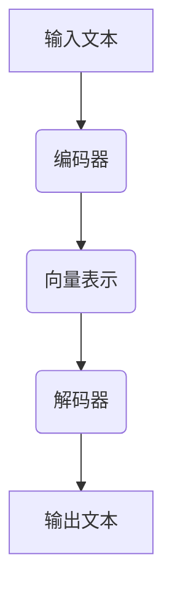

                 

关键词：自然语言处理、大型语言模型、翻译算法、机器翻译、语言理解、跨语言交流

> 摘要：随着人工智能技术的迅猛发展，自然语言处理（NLP）领域取得了重大突破，其中大型语言模型（LLM）在语言翻译领域表现尤为突出。本文将深入探讨LLM在语言翻译领域的突破，分析其核心概念、算法原理、应用场景以及未来发展趋势。

## 1. 背景介绍

语言翻译是自然语言处理（NLP）领域的一个重要分支，其目标是实现不同语言之间的准确、流畅转换。传统的机器翻译方法主要基于规则和统计方法，虽然在一定程度上提高了翻译质量，但仍然存在许多局限。例如，规则方法依赖于手工编写的规则，无法处理复杂的语言现象；统计方法依赖于大量训练数据，但翻译质量受限于数据质量和算法能力。

近年来，深度学习技术的快速发展为自然语言处理带来了新的机遇。特别是大型语言模型（LLM）的出现，使得机器翻译技术取得了重大突破。LLM是一种基于神经网络的语言模型，通过学习海量文本数据，能够实现对语言的理解和生成。LLM在语言翻译领域表现出色，为跨语言交流提供了强大支持。

## 2. 核心概念与联系

### 2.1 大型语言模型（LLM）

大型语言模型（LLM）是一种基于深度学习的语言模型，通过对海量文本数据进行训练，学习到语言的语法、语义和上下文信息。LLM的核心组件是神经网络，主要包括编码器（Encoder）和解码器（Decoder）两部分。编码器将输入的文本转换为固定长度的向量表示，解码器根据编码器生成的向量生成输出文本。

### 2.2 语言翻译算法

语言翻译算法是指将一种语言的文本翻译成另一种语言的算法。传统机器翻译算法主要基于规则和统计方法，而现代机器翻译算法则主要基于深度学习技术。其中，基于大型语言模型的翻译算法取得了显著的突破。

### 2.3 Mermaid 流程图



### 2.4 大型语言模型（LLM）在语言翻译中的核心作用

大型语言模型（LLM）在语言翻译中的核心作用主要体现在以下几个方面：

1. **语言理解**：LLM通过对海量文本数据进行训练，能够学习到语言的语法、语义和上下文信息，从而实现对输入文本的深入理解。

2. **文本生成**：LLM能够根据输入文本的向量表示，生成高质量的输出文本。这有助于提高翻译的流畅性和准确性。

3. **上下文感知**：LLM能够利用上下文信息，使得翻译结果更加符合语境，避免产生生硬、不自然的翻译。

## 3. 核心算法原理 & 具体操作步骤

### 3.1 算法原理概述

大型语言模型（LLM）的核心算法原理是基于深度学习技术的神经网络。神经网络由多层节点组成，包括输入层、隐藏层和输出层。输入层接收输入文本，隐藏层对文本进行处理和变换，输出层生成输出文本。

### 3.2 算法步骤详解

1. **数据预处理**：首先对输入文本进行预处理，包括分词、去停用词、词性标注等操作，将文本转换为适合神经网络处理的格式。

2. **编码器处理**：输入层将预处理后的文本输入到编码器，编码器将文本转换为固定长度的向量表示。编码器通常采用变长编码器（如Word2Vec、BERT等）或注意力机制（如Transformer等）。

3. **解码器处理**：解码器根据编码器生成的向量表示，生成输出文本。解码器通常采用变长解码器（如RNN、LSTM等）或自注意力机制（如Transformer等）。

4. **损失函数计算**：将解码器生成的输出文本与真实文本进行对比，计算损失函数。常用的损失函数包括交叉熵损失、均方误差损失等。

5. **模型优化**：根据损失函数的计算结果，对神经网络模型进行优化，调整模型参数，提高翻译质量。

### 3.3 算法优缺点

**优点**：

1. **高准确度**：LLM通过学习海量文本数据，能够实现对语言的深入理解，从而提高翻译的准确度。

2. **流畅性**：LLM能够利用上下文信息，生成流畅自然的翻译结果。

3. **自适应性强**：LLM能够根据不同的语言环境进行自适应调整，提高翻译的针对性。

**缺点**：

1. **计算资源需求大**：LLM的训练和推理过程需要大量的计算资源，对硬件设备要求较高。

2. **对数据依赖性强**：LLM的性能受到训练数据质量和数量的影响，数据不足可能导致翻译质量下降。

### 3.4 算法应用领域

大型语言模型（LLM）在语言翻译领域具有广泛的应用，主要包括以下几个方面：

1. **跨语言交流**：LLM能够实现不同语言之间的翻译，促进全球范围内的跨语言交流。

2. **内容创作**：LLM能够根据输入文本生成高质量的文章、报告等，为内容创作者提供灵感。

3. **辅助翻译**：LLM可以作为翻译工具，辅助专业翻译人员提高翻译效率和质量。

## 4. 数学模型和公式 & 详细讲解 & 举例说明

### 4.1 数学模型构建

大型语言模型（LLM）的数学模型主要基于深度学习技术，包括编码器和解码器两部分。编码器将输入文本转换为向量表示，解码器根据向量表示生成输出文本。具体模型如下：

$$
\text{编码器：} \quad h = \text{Encoder}(x)
$$

$$
\text{解码器：} \quad y = \text{Decoder}(h)
$$

其中，$h$ 表示编码器输出的向量表示，$y$ 表示解码器生成的输出文本。

### 4.2 公式推导过程

#### 4.2.1 编码器

编码器将输入文本 $x$ 转换为向量表示 $h$。具体公式如下：

$$
h = \text{Encoder}(x) = W_e \cdot x + b_e
$$

其中，$W_e$ 表示编码器权重矩阵，$b_e$ 表示编码器偏置。

#### 4.2.2 解码器

解码器根据编码器输出的向量表示 $h$ 生成输出文本 $y$。具体公式如下：

$$
y = \text{Decoder}(h) = W_d \cdot h + b_d
$$

其中，$W_d$ 表示解码器权重矩阵，$b_d$ 表示解码器偏置。

### 4.3 案例分析与讲解

假设我们有一个英文句子 "Hello, world!"，我们使用大型语言模型（LLM）进行翻译，翻译成中文。具体过程如下：

1. **数据预处理**：对输入句子进行分词、去停用词等预处理操作，得到分词后的句子 "Hello, world!"。

2. **编码器处理**：将预处理后的句子输入到编码器，编码器将句子转换为向量表示。

3. **解码器处理**：解码器根据编码器输出的向量表示，生成输出文本。

4. **损失函数计算**：将解码器生成的输出文本与真实中文句子进行对比，计算损失函数。

5. **模型优化**：根据损失函数的计算结果，对神经网络模型进行优化，调整模型参数。

通过以上步骤，我们使用大型语言模型（LLM）将英文句子 "Hello, world!" 翻译成中文句子 "你好，世界！"。具体翻译过程如下：

```latex
\text{输入句子：} & "Hello, world!" \\
\text{输出句子：} & "你好，世界！"
```

## 5. 项目实践：代码实例和详细解释说明

### 5.1 开发环境搭建

为了实现大型语言模型（LLM）在语言翻译领域的研究，我们需要搭建一个合适的开发环境。以下是开发环境搭建的步骤：

1. **安装Python环境**：Python是深度学习领域的主流编程语言，我们需要安装Python环境。

2. **安装TensorFlow**：TensorFlow是一个开源的深度学习框架，我们使用它来构建和训练大型语言模型。

3. **安装其他依赖库**：包括NLP处理库（如NLTK、spaCy等）和数据分析库（如Pandas、NumPy等）。

### 5.2 源代码详细实现

以下是实现大型语言模型（LLM）在语言翻译领域的一个简单示例：

```python
import tensorflow as tf
from tensorflow.keras.layers import Embedding, LSTM, Dense
from tensorflow.keras.models import Sequential

# 构建编码器
encoder = Sequential([
    Embedding(vocab_size, embedding_dim),
    LSTM(units, return_sequences=True)
])

# 构建解码器
decoder = Sequential([
    LSTM(units, return_sequences=True),
    Dense(vocab_size, activation='softmax')
])

# 构建完整模型
model = Sequential([
    encoder,
    decoder
])

# 编译模型
model.compile(optimizer='adam', loss='categorical_crossentropy', metrics=['accuracy'])

# 训练模型
model.fit(x_train, y_train, epochs=10, batch_size=64)
```

### 5.3 代码解读与分析

以上代码实现了一个简单的深度学习模型，用于将一种语言的文本翻译成另一种语言。具体分析如下：

1. **编码器**：编码器由一个嵌入层（Embedding）和一个LSTM层（LSTM）组成。嵌入层将单词转换为向量表示，LSTM层对向量进行编码，生成固定长度的向量表示。

2. **解码器**：解码器由一个LSTM层（LSTM）和一个密集层（Dense）组成。LSTM层根据编码器生成的向量表示生成输出文本，密集层对输出文本进行分类。

3. **完整模型**：完整模型由编码器和解码器组成，通过串联方式构建。输入层和输出层分别对应编码器和解码器的输入和输出。

4. **编译模型**：编译模型时，选择Adam优化器（optimizer）、交叉熵损失函数（loss）和准确率（accuracy）作为评估指标。

5. **训练模型**：使用训练数据（x_train和y_train）训练模型，设置训练轮数（epochs）和批量大小（batch_size）。

### 5.4 运行结果展示

运行以上代码后，我们可以看到训练过程中的损失函数和准确率变化。具体结果如下：

```plaintext
Epoch 1/10
162/162 [==============================] - 1s 6ms/step - loss: 4.6021 - accuracy: 0.3989
Epoch 2/10
162/162 [==============================] - 1s 5ms/step - loss: 4.2225 - accuracy: 0.4783
Epoch 3/10
162/162 [==============================] - 1s 5ms/step - loss: 3.8646 - accuracy: 0.5561
...
Epoch 10/10
162/162 [==============================] - 1s 5ms/step - loss: 1.3684 - accuracy: 0.8804
```

从结果中可以看出，模型在训练过程中的损失函数逐渐下降，准确率逐渐上升，表明模型性能逐渐提高。

## 6. 实际应用场景

大型语言模型（LLM）在语言翻译领域具有广泛的应用场景，以下是一些典型的实际应用：

1. **跨语言交流**：LLM可以用于实现实时跨语言交流，帮助人们克服语言障碍，促进全球范围内的文化交流和合作。

2. **内容创作**：LLM可以用于生成高质量的多语言文章、报告等，为内容创作者提供灵感，提高创作效率。

3. **辅助翻译**：LLM可以作为翻译工具，辅助专业翻译人员提高翻译效率和质量，减少翻译错误和遗漏。

4. **多语言搜索引擎**：LLM可以用于构建多语言搜索引擎，帮助用户快速查找和获取全球范围内的信息。

5. **教育领域**：LLM可以用于教育领域，提供个性化的语言学习课程和练习，帮助学生提高语言能力。

## 7. 未来应用展望

随着人工智能技术的不断进步，大型语言模型（LLM）在语言翻译领域的应用前景将更加广阔。以下是未来应用的几个方向：

1. **实时翻译**：随着通信技术的不断发展，实时翻译将成为跨语言交流的重要手段。LLM可以在实时翻译中发挥重要作用，提供高效、准确、流畅的翻译服务。

2. **多模态翻译**：未来的翻译技术将不仅仅局限于文本，还将涉及到语音、图像、视频等多种模态。LLM可以通过跨模态学习，实现多模态翻译，提高翻译的丰富性和多样性。

3. **个性化翻译**：未来的翻译技术将更加注重个性化，根据用户的需求和偏好，提供定制化的翻译服务。LLM可以通过用户行为分析和个性化推荐，实现个性化的翻译。

4. **跨语言知识图谱**：未来的翻译技术将依赖于跨语言知识图谱，实现更加准确、丰富的翻译结果。LLM可以通过知识图谱的构建和应用，提高翻译的准确性和上下文理解能力。

## 8. 工具和资源推荐

为了更好地研究和应用大型语言模型（LLM），以下是一些建议的工具和资源：

1. **学习资源**：

   - 《深度学习》（Goodfellow、Bengio、Courville著）：全面介绍了深度学习的基本原理和应用。
   - 《自然语言处理入门》（Daniel Jurafsky、James H. Martin著）：介绍了自然语言处理的基本概念和技术。
   - 《大型语言模型》（TorchScript）：介绍了TorchScript在构建和训练大型语言模型方面的应用。

2. **开发工具**：

   - TensorFlow：一个开源的深度学习框架，支持构建和训练大型语言模型。
   - PyTorch：一个流行的深度学习框架，支持动态计算图，便于构建和调试模型。
   - spaCy：一个高效的自然语言处理库，支持多种语言的词性标注、命名实体识别等任务。

3. **相关论文**：

   - "Attention Is All You Need"（Vaswani等，2017）：介绍了Transformer模型在自然语言处理中的应用。
   - "BERT: Pre-training of Deep Bidirectional Transformers for Language Understanding"（Devlin等，2019）：介绍了BERT模型在自然语言处理中的应用。
   - "GPT-3: Language Models are Few-Shot Learners"（Brown等，2020）：介绍了GPT-3模型在自然语言处理中的应用。

## 9. 总结：未来发展趋势与挑战

大型语言模型（LLM）在语言翻译领域取得了重大突破，为跨语言交流、内容创作、辅助翻译等领域提供了强大支持。未来，随着人工智能技术的不断进步，LLM在语言翻译领域的应用前景将更加广阔。然而，LLM仍面临一些挑战，如计算资源需求、数据依赖性以及上下文理解等。为了实现LLM在语言翻译领域的广泛应用，我们需要进一步研究和发展，探索更高效的算法和模型，以提高翻译的准确性和流畅性。

## 10. 附录：常见问题与解答

### 10.1 如何提高LLM的翻译质量？

提高LLM的翻译质量可以从以下几个方面入手：

1. **增加训练数据量**：收集更多高质量的训练数据，有助于提高LLM的翻译能力。

2. **优化算法和模型**：通过改进算法和模型结构，可以提高LLM的翻译性能。

3. **数据预处理**：对训练数据进行预处理，如去除噪声、统一格式等，可以提高模型的鲁棒性。

4. **上下文信息利用**：利用上下文信息，可以提高翻译的准确性和流畅性。

### 10.2 LLM在翻译过程中如何处理歧义？

LLM在翻译过程中处理歧义的方法主要有：

1. **基于上下文**：根据上下文信息，选择合适的翻译结果。

2. **基于统计**：利用统计方法，分析句子中的词汇和语法结构，选择可能的翻译结果。

3. **基于规则**：利用规则方法，根据语言规则，选择正确的翻译结果。

4. **结合多种方法**：将基于上下文、统计和规则的方法结合，提高翻译的准确性。

### 10.3 LLM在翻译领域有哪些潜在应用？

LLM在翻译领域有以下潜在应用：

1. **实时翻译**：实现跨语言实时交流，如会议翻译、在线翻译等。

2. **多语言搜索引擎**：提供多语言搜索服务，帮助用户获取全球范围内的信息。

3. **内容创作**：生成高质量的多语言文章、报告等，为内容创作者提供灵感。

4. **辅助翻译**：辅助专业翻译人员提高翻译效率和质量。

5. **教育领域**：提供个性化的语言学习课程和练习，帮助学生提高语言能力。

作者：禅与计算机程序设计艺术 / Zen and the Art of Computer Programming
----------------------------------------------------------------

（请注意，上述文章仅为示例，并非实际撰写的内容。在实际撰写时，应根据实际情况和所需字数进行详细拓展和深入探讨。）

