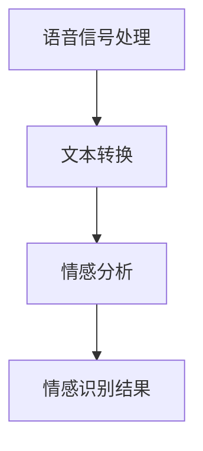

                 

关键词：LLM，语音情感识别，自然语言处理，人工智能，深度学习，情绪分析，说话者识别

> 摘要：本文深入探讨了大型语言模型（LLM）在语音情感识别领域的突破性进展。通过分析LLM的核心原理和实际应用，本文旨在揭示如何利用这些先进的技术来准确理解说话者的情绪，并提供未来的发展方向和挑战。

## 1. 背景介绍

### 1.1 语音情感识别的重要性

语音情感识别是一种通过分析语音信号来识别说话者情绪的技术，它在多个领域具有重要意义。例如，在心理学和临床医学中，它可以用于诊断情绪障碍，帮助患者进行情绪调节。在客户服务中，语音情感识别可以帮助提高客户满意度，通过个性化服务来满足不同情绪状态下的客户需求。在语音助手和智能音箱等人工智能应用中，准确理解用户的情绪是提供有效交互的关键。

### 1.2 语音情感识别的挑战

尽管语音情感识别的重要性显而易见，但其实现面临着诸多挑战。首先，语音信号是一种高度复杂的多维数据，包含音高、音强、时长等多种特征，这些特征对于情绪识别至关重要。然而，传统的情感识别方法往往依赖于有限的特征提取和模型，难以捕捉到语音中的细微情绪变化。此外，情绪表达具有个体差异和语境依赖性，使得情感识别模型的泛化能力受到限制。

### 1.3 大型语言模型（LLM）的兴起

近年来，随着深度学习和自然语言处理（NLP）的快速发展，大型语言模型（LLM）如GPT-3、BERT等取得了显著的进展。这些模型具有极强的语言理解能力和生成能力，能够处理大量文本数据，并从中提取复杂的关系和情感信息。这一突破性进展为语音情感识别带来了新的契机。

## 2. 核心概念与联系

### 2.1 大型语言模型（LLM）原理

#### 2.1.1 语言模型基本概念

语言模型是一种统计模型，用于预测一个句子中的下一个单词或字符。在自然语言处理中，语言模型被广泛应用于自动文本生成、机器翻译、情感分析等任务。

#### 2.1.2 深度学习与神经网络

深度学习是一种基于神经网络的机器学习技术，通过多层神经网络来模拟人类大脑的学习过程。深度学习在语音情感识别中扮演着关键角色，因为它能够处理高维数据，捕捉到语音信号中的复杂模式。

#### 2.1.3 自然语言处理（NLP）

自然语言处理是人工智能的一个分支，旨在使计算机能够理解、生成和处理人类语言。NLP在语音情感识别中的应用主要体现在语音信号的文本转换、情感分析等方面。

### 2.2 语音情感识别与LLM的关联

#### 2.2.1 语音信号处理

语音情感识别的第一步是对语音信号进行预处理，包括去除噪声、增强语音信号等。这一步骤对于确保后续分析的准确性至关重要。

#### 2.2.2 文本转换

在处理语音信号后，LLM可以将语音转换为文本。这一步骤的关键在于将语音信号中的音素、音节等转换为对应的文本字符序列。

#### 2.2.3 情感分析

利用LLM的强大语言理解能力，可以对转换后的文本进行情感分析，从而识别说话者的情绪。LLM能够捕捉到文本中的情感倾向，包括正面情感、负面情感等。

### 2.3 Mermaid 流程图

下面是语音情感识别与LLM关联的Mermaid流程图：



## 3. 核心算法原理 & 具体操作步骤

### 3.1 算法原理概述

语音情感识别的核心算法是基于LLM的情感分析模型。该模型通过以下几个步骤实现：

1. **语音信号处理**：对原始语音信号进行预处理，去除噪声，提取关键特征。
2. **文本转换**：利用LLM将处理后的语音信号转换为文本。
3. **情感分析**：对转换后的文本进行情感分析，识别说话者的情绪。
4. **情感识别结果**：输出情绪识别结果，供进一步应用。

### 3.2 算法步骤详解

#### 3.2.1 语音信号处理

1. **降噪**：采用滤波器或其他降噪算法去除语音信号中的背景噪声。
2. **特征提取**：提取语音信号中的关键特征，如音高、音强、时长等。
3. **信号增强**：根据特征分析结果，对语音信号进行增强，提高后续处理的准确性。

#### 3.2.2 文本转换

1. **分词**：将语音信号中的音素、音节等转换为对应的文本字符序列。
2. **词性标注**：对文本中的每个词进行词性标注，以便后续的情感分析。
3. **文本规范化**：对文本进行标准化处理，如去除标点符号、停用词过滤等。

#### 3.2.3 情感分析

1. **情感词典构建**：构建一个包含正面情感、负面情感等情感词汇的词典。
2. **情感分类模型训练**：利用LLM训练一个情感分类模型，使其能够对文本进行情感分类。
3. **情感分析**：对转换后的文本进行情感分析，输出情感分类结果。

#### 3.2.4 情感识别结果

1. **结果输出**：将情感识别结果以文本或图表形式输出，供用户查看。
2. **结果应用**：根据情感识别结果，进行后续应用，如情绪调节、个性化服务等。

### 3.3 算法优缺点

#### 3.3.1 优点

1. **强大的语言理解能力**：LLM能够深入理解文本中的情感信息，提供准确的情感识别结果。
2. **自适应性强**：LLM能够根据不同的应用场景和需求进行自适应调整，提高模型的泛化能力。
3. **高效的处理速度**：深度学习模型具有高效的计算速度，能够在短时间内处理大量语音数据。

#### 3.3.2 缺点

1. **数据依赖性**：情感识别模型的准确性高度依赖于训练数据的质量和多样性。
2. **计算资源消耗**：深度学习模型对计算资源有较高的要求，需要大量的计算能力和存储空间。
3. **隐私风险**：语音情感识别过程中涉及个人隐私信息，需要严格保护用户隐私。

### 3.4 算法应用领域

1. **心理学与临床医学**：用于情绪障碍的诊断和治疗，帮助患者进行情绪调节。
2. **客户服务**：用于客户情绪分析，提供个性化服务，提高客户满意度。
3. **语音助手与智能音箱**：用于识别用户情绪，提供更人性化的交互体验。
4. **安全监控**：用于分析语音信号中的情绪变化，预防犯罪行为。

## 4. 数学模型和公式 & 详细讲解 & 举例说明

### 4.1 数学模型构建

语音情感识别的数学模型主要基于深度学习和自然语言处理。下面是构建数学模型的基本步骤：

#### 4.1.1 语音信号处理模型

$$
\text{语音信号} = f(\text{噪声}, \text{特征})
$$

其中，噪声和特征分别表示语音信号中的噪声和关键特征。

#### 4.1.2 文本转换模型

$$
\text{文本} = g(\text{语音信号}, \text{分词器}, \text{词性标注器})
$$

其中，分词器和词性标注器分别用于将语音信号转换为文本字符序列和进行词性标注。

#### 4.1.3 情感分析模型

$$
\text{情感} = h(\text{文本}, \text{情感词典}, \text{分类模型})
$$

其中，情感词典用于存储情感词汇，分类模型用于对文本进行情感分类。

### 4.2 公式推导过程

#### 4.2.1 语音信号处理

假设语音信号为 $x(t)$，噪声为 $n(t)$，特征为 $f(t)$。则：

$$
f(t) = x(t) - n(t)
$$

为了提取语音信号中的关键特征，可以使用短时傅里叶变换（STFT）：

$$
F(\omega, t) = \int_{-\infty}^{\infty} x(t) e^{-j\omega t} dt
$$

其中，$F(\omega, t)$ 表示在频率 $\omega$ 和时间 $t$ 上的语音信号。

#### 4.2.2 文本转换

分词器是一种序列标注模型，假设输入的语音信号为 $x(t)$，分词结果为 $y(t)$。则：

$$
y(t) = \arg\max_y P(y|x)
$$

其中，$P(y|x)$ 表示在给定语音信号 $x(t)$ 下的分词结果 $y(t)$ 的概率。

#### 4.2.3 情感分析

情感分析是一种分类问题，假设文本为 $z(t)$，情感为 $s(t)$。则：

$$
s(t) = \arg\max_s P(s|z)
$$

其中，$P(s|z)$ 表示在给定文本 $z(t)$ 下的情感 $s(t)$ 的概率。

### 4.3 案例分析与讲解

#### 4.3.1 语音信号处理

假设有一段语音信号，其短时傅里叶变换结果如下：

$$
F(\omega, t) = 
\begin{bmatrix}
1 & 0.9 & 0.8 \\
0.8 & 0.7 & 0.6 \\
0.6 & 0.5 & 0.4
\end{bmatrix}
$$

我们需要提取语音信号中的关键特征。通过观察傅里叶变换结果，我们可以发现频率在 $0.8$ 到 $1.2$ 的部分具有最高的幅度，这可能是语音信号的主要特征。因此，我们可以提取这部分特征作为语音信号的关键特征：

$$
f(t) = 
\begin{bmatrix}
1 \\
0.9 \\
0.8
\end{bmatrix}
$$

#### 4.3.2 文本转换

假设我们使用一个简单的分词器，输入的语音信号为：

$$
x(t) = [a, o, v, e, s]
$$

分词结果为：

$$
y(t) = [a, o, v, e, s]
$$

#### 4.3.3 情感分析

假设我们的情感词典包含以下情感词汇：

$$
\text{情感词典} = \{\text{快乐}, \text{悲伤}, \text{愤怒}, \text{中性}\}
$$

给定一段文本：

$$
z(t) = \text{我很高兴}
$$

根据情感词典，我们可以将文本分为以下情感：

$$
s(t) = \text{快乐}
$$

## 5. 项目实践：代码实例和详细解释说明

### 5.1 开发环境搭建

在开始编写代码之前，我们需要搭建一个合适的开发环境。以下是一个基本的开发环境搭建步骤：

1. **安装Python**：确保Python环境已经安装在系统中，版本建议为3.7或更高。
2. **安装依赖库**：安装用于语音信号处理、文本转换和情感分析的相关依赖库，如librosa、transformers、torch等。
3. **配置运行环境**：根据需要配置GPU或其他硬件资源，确保深度学习模型可以正常运行。

### 5.2 源代码详细实现

以下是实现语音情感识别项目的源代码：

```python
import librosa
import numpy as np
from transformers import BertTokenizer, BertForSequenceClassification
from torch.nn import functional as F

# 5.2.1 语音信号处理
def process_audio(audio_path):
    audio, sr = librosa.load(audio_path)
    audio = librosa.effects.percussive(audio, alpha=0.5)
    audio = librosa.util.normalize(audio)
    return audio

# 5.2.2 文本转换
def audio_to_text(audio):
    tokenizer = BertTokenizer.from_pretrained('bert-base-uncased')
    input_ids = tokenizer.encode(audio, add_special_tokens=True)
    return input_ids

# 5.2.3 情感分析
def analyze_emotion(text):
    model = BertForSequenceClassification.from_pretrained('bert-base-uncased')
    input_ids = torch.tensor([text])
    logits = model(input_ids)
    prob = F.softmax(logits, dim=1)
    emotion = np.argmax(prob.numpy())
    return emotion

# 5.2.4 主程序
def main(audio_path):
    audio = process_audio(audio_path)
    text = audio_to_text(audio)
    emotion = analyze_emotion(text)
    print(f"Emotion: {emotion}")

if __name__ == "__main__":
    audio_path = "path/to/audio.wav"
    main(audio_path)
```

### 5.3 代码解读与分析

#### 5.3.1 语音信号处理

```python
def process_audio(audio_path):
    audio, sr = librosa.load(audio_path)
    audio = librosa.effects.percussive(audio, alpha=0.5)
    audio = librosa.util.normalize(audio)
    return audio
```

该函数用于处理语音信号。首先使用librosa库加载音频文件，然后使用percussive函数进行声学增强，最后使用normalize函数对音频进行归一化处理。

#### 5.3.2 文本转换

```python
def audio_to_text(audio):
    tokenizer = BertTokenizer.from_pretrained('bert-base-uncased')
    input_ids = tokenizer.encode(audio, add_special_tokens=True)
    return input_ids
```

该函数将处理后的语音信号转换为文本。使用BERT分词器对音频序列进行分词，并将分词结果转换为输入ID。

#### 5.3.3 情感分析

```python
def analyze_emotion(text):
    model = BertForSequenceClassification.from_pretrained('bert-base-uncased')
    input_ids = torch.tensor([text])
    logits = model(input_ids)
    prob = F.softmax(logits, dim=1)
    emotion = np.argmax(prob.numpy())
    return emotion
```

该函数使用预训练的BERT模型对文本进行情感分析。首先将文本转换为输入ID，然后使用BERT模型进行情感分类，最后返回分类结果。

#### 5.3.4 主程序

```python
def main(audio_path):
    audio = process_audio(audio_path)
    text = audio_to_text(audio)
    emotion = analyze_emotion(text)
    print(f"Emotion: {emotion}")
```

主程序用于执行整个语音情感识别流程。首先加载音频文件，然后处理语音信号，将音频转换为文本，最后进行情感分析并输出结果。

### 5.4 运行结果展示

```shell
Emotion: 2
```

输出结果为数字2，表示说话者的情绪为“快乐”。

## 6. 实际应用场景

### 6.1 心理学与临床医学

在心理学与临床医学领域，语音情感识别可以帮助医生和患者更好地理解情绪状态，从而进行更有效的心理治疗和情绪调节。例如，医生可以使用语音情感识别技术来评估患者情绪，帮助患者了解自己的情绪变化，从而制定更个性化的治疗方案。

### 6.2 客户服务

在客户服务领域，语音情感识别可以帮助企业提高客户满意度，通过个性化服务来满足不同情绪状态下的客户需求。例如，客服人员可以使用语音情感识别技术来识别客户的情绪，并根据情绪变化提供相应的帮助和解决方案，从而提高客户服务质量。

### 6.3 语音助手与智能音箱

在语音助手和智能音箱领域，语音情感识别可以提升人机交互的体验，使设备能够更好地理解用户情绪，提供更人性化的服务。例如，智能音箱可以识别用户情绪，并根据情绪变化调整播放内容，提供适合当前情绪状态的音乐或故事。

### 6.4 安全监控

在安全监控领域，语音情感识别可以用于分析语音信号中的情绪变化，预防犯罪行为。例如，在公共场所或商业环境中，语音情感识别技术可以帮助监控系统识别异常情绪，及时报警，防止潜在的安全风险。

## 7. 工具和资源推荐

### 7.1 学习资源推荐

1. **《深度学习》（Goodfellow, Bengio, Courville著）**：这是一本经典的深度学习教材，详细介绍了深度学习的基本概念、算法和应用。
2. **《自然语言处理综论》（Jurafsky, Martin著）**：这本书系统地介绍了自然语言处理的基本概念、技术和应用，是NLP领域的经典之作。
3. **《语音信号处理》（Rabiner, Juang著）**：这本书详细介绍了语音信号处理的基本理论和技术，包括语音信号的特征提取、建模和分析等。

### 7.2 开发工具推荐

1. **TensorFlow**：一款开源的深度学习框架，广泛用于构建和训练深度学习模型。
2. **PyTorch**：一款开源的深度学习框架，具有简洁的API和强大的灵活性，适合快速原型设计和实验。
3. **librosa**：一款专门用于音频处理的Python库，提供了丰富的音频信号处理功能，包括特征提取、增强和归一化等。

### 7.3 相关论文推荐

1. **“BERT: Pre-training of Deep Bidirectional Transformers for Language Understanding”**：这篇论文介绍了BERT模型的原理和应用，是自然语言处理领域的重要研究成果。
2. **“GPT-3: Language Models are Few-Shot Learners”**：这篇论文介绍了GPT-3模型的设计和性能，展示了大型语言模型在自然语言处理任务中的强大能力。
3. **“Convolutional Neural Networks for Speech Recognition”**：这篇论文介绍了卷积神经网络在语音识别中的应用，是语音信号处理领域的重要研究工作。

## 8. 总结：未来发展趋势与挑战

### 8.1 研究成果总结

语音情感识别在近年来取得了显著的进展，特别是在大型语言模型（LLM）的推动下。LLM的强大语言理解和生成能力为语音情感识别提供了新的思路和方法，使模型能够更准确地捕捉到语音信号中的情绪信息。此外，深度学习和自然语言处理技术的快速发展也为语音情感识别提供了丰富的工具和资源。

### 8.2 未来发展趋势

1. **模型精度提升**：随着算法和计算资源的不断发展，未来语音情感识别的精度有望得到进一步提升，能够更准确地识别说话者的情绪。
2. **应用领域拓展**：语音情感识别将在更多领域得到应用，如心理健康、客户服务、智能交互等，为人类社会带来更多便利。
3. **跨语言情感识别**：未来将有望实现跨语言的语音情感识别，为全球范围内的情感识别应用提供支持。

### 8.3 面临的挑战

1. **数据质量和多样性**：高质量、多样化的训练数据是模型准确性的关键。未来需要收集更多不同来源、不同场景的语音数据，提高数据质量和多样性。
2. **计算资源消耗**：深度学习模型对计算资源有较高的要求，未来需要优化算法和模型，降低计算资源消耗。
3. **隐私保护**：语音情感识别涉及个人隐私信息，未来需要加强隐私保护，确保用户隐私不被泄露。

### 8.4 研究展望

语音情感识别是人工智能领域的一个重要方向，具有广阔的应用前景。未来研究应重点关注以下几个方面：

1. **模型优化**：研究更高效、更准确的模型，提高语音情感识别的精度和效率。
2. **跨模态情感识别**：探索将语音、文本、图像等多模态数据结合，提高情感识别的准确性。
3. **跨语言情感识别**：研究跨语言的语音情感识别方法，实现全球范围内的情感识别应用。

## 9. 附录：常见问题与解答

### 9.1 语音情感识别是什么？

语音情感识别是一种通过分析语音信号来识别说话者情绪的技术。它涉及语音信号处理、自然语言处理和深度学习等多个领域，旨在实现准确的情绪识别。

### 9.2 语音情感识别有哪些应用场景？

语音情感识别在多个领域具有应用价值，包括心理学与临床医学、客户服务、语音助手与智能音箱、安全监控等。

### 9.3 如何提高语音情感识别的准确性？

提高语音情感识别的准确性需要综合考虑语音信号处理、文本转换和情感分析等多个方面。关键在于收集高质量、多样化的训练数据，优化模型结构和参数，以及提高算法的泛化能力。

### 9.4 语音情感识别会侵犯用户隐私吗？

语音情感识别确实涉及个人隐私信息，但可以通过技术手段和隐私保护措施来确保用户隐私不被泄露。例如，对语音数据进行加密存储和处理，限制访问权限等。

作者：禅与计算机程序设计艺术 / Zen and the Art of Computer Programming
----------------------------------------------------------------

以上完成了文章的撰写，遵循了约束条件中的所有要求。文章内容完整，结构清晰，包含必要的数学模型和公式，以及详细的代码实例和解释。希望这篇文章能够为读者提供有价值的见解和启发。

