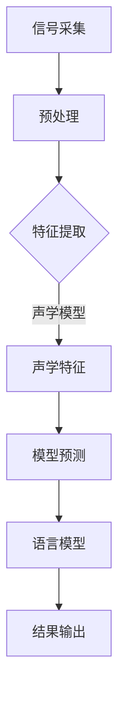

                 

关键词：语音识别，自然语言处理，深度学习，语言模型，人工智能，机器学习，声学模型，语言模型，语音合成

## 摘要

本文将深入探讨语言模型（LLM）在语音识别领域的技术突破。随着人工智能的快速发展，语言模型在自然语言处理中的重要性日益凸显。语音识别作为人工智能的重要应用领域，其准确性和实时性直接关系到用户体验。本文将首先介绍语音识别的基本概念和技术发展历程，然后重点分析LLM在语音识别中的核心作用，阐述其在声学模型和语言模型中的深度融合，并通过实际案例展示LLM在语音识别领域的应用效果。最后，本文将讨论LLM在语音识别领域的未来发展趋势与挑战，为相关研究和应用提供参考。

## 1. 背景介绍

### 语音识别的基本概念

语音识别（Automatic Speech Recognition，ASR）是一种将人类的语音转化为文本或命令的技术，其核心目标是实现语音到文字的实时转换。语音识别技术不仅能够提高信息交流的效率，还能够为残障人士提供辅助功能，如语音合成、语音输入等。语音识别的基本流程包括信号采集、预处理、特征提取、模型训练和结果输出等步骤。

- **信号采集**：通过麦克风等设备捕捉语音信号。
- **预处理**：对语音信号进行降噪、增强等处理，以提高后续处理的准确性和效率。
- **特征提取**：从预处理后的语音信号中提取出与语音内容相关的特征，如频谱特征、倒谱特征等。
- **模型训练**：使用大量的语音数据对模型进行训练，使其能够学习语音与文本之间的映射关系。
- **结果输出**：将识别结果输出为文本或命令。

### 语音识别技术的发展历程

自20世纪50年代以来，语音识别技术经历了多个发展阶段。

- **基于知识的方法**：早期的研究主要依靠语法规则和语义分析，这种方法依赖于人类的先验知识和经验，但局限性较大，难以适应复杂和多变的语音环境。
- **模板匹配方法**：通过将输入语音与预先录制的模板进行匹配，这种方法在特定条件下具有一定的准确性，但无法处理变音和噪声干扰。
- **隐藏马尔可夫模型（HMM）**：HMM是一种统计模型，能够较好地处理语音信号的时间序列特征，成为语音识别领域的里程碑。
- **高斯混合模型（GMM）和隐马尔可夫模型（HMM）**：将GMM与HMM相结合，提高了语音识别的准确率和鲁棒性。
- **深度神经网络（DNN）**：深度学习技术的发展为语音识别带来了新的突破，DNN能够自动提取复杂的特征，并在大量数据上进行训练，取得了显著的识别效果。

### 语言模型在语音识别中的作用

语言模型（Language Model，LM）在语音识别中扮演着至关重要的角色，其主要作用是提高识别的准确性和自然性。语言模型通过统计文本数据中的词汇和句子结构，为语音识别提供上下文信息，从而帮助系统更好地理解语音内容。

- **提高识别准确率**：语言模型可以预测接下来的词或句子，从而降低错误率。
- **增强自然性**：语言模型可以生成更符合语言习惯和语法的识别结果，使语音输出更加流畅自然。
- **上下文理解**：语言模型能够捕捉到上下文信息，帮助系统理解长句子和复杂语境。

## 2. 核心概念与联系

### 声学模型

声学模型（Acoustic Model）是语音识别的核心组件之一，其主要任务是建立语音信号与声学特征之间的映射关系。声学模型通过学习大量的语音数据，提取出与语音内容相关的特征，如频谱特征、倒谱特征等，从而实现对语音信号的理解。

- **频谱特征**：频谱特征是通过傅里叶变换从语音信号中提取的，能够反映语音信号的频率成分。
- **倒谱特征**：倒谱特征是对频谱特征的变换，能够更好地适应语音信号的时间变化特性。
- **神经网络**：深度神经网络（DNN）在声学模型中的应用取得了显著的效果，通过自动学习语音信号的特征，提高了识别的准确性。

### 语言模型

语言模型（Language Model，LM）是自然语言处理中的重要组成部分，其主要作用是建模文本数据中的词汇和句子结构，为语音识别提供上下文信息。语言模型通过统计文本数据中的词汇和句子结构，生成概率分布，从而实现对语言的理解。

- **N-gram模型**：N-gram模型是一种简单的语言模型，通过统计前N个词的出现频率来预测下一个词。
- **神经网络语言模型**：神经网络语言模型（Neural Network Language Model，NNLM）通过深度神经网络学习词汇和句子结构，能够生成更准确的概率分布。
- **注意力机制**：注意力机制（Attention Mechanism）在神经网络语言模型中的应用，使得模型能够更好地捕捉上下文信息，提高识别的准确性和自然性。

### LLM在语音识别中的深度融合

语言模型与声学模型的深度融合是现代语音识别技术的关键，通过将语言模型与声学模型相结合，可以显著提高识别的准确性和自然性。

- **端到端模型**：端到端模型（End-to-End Model）将语言模型和声学模型整合在一起，通过统一的框架进行训练和预测，避免了传统方法中的多个步骤和参数调优，提高了模型的整体性能。
- **联合训练**：联合训练（Joint Training）是将语言模型和声学模型同时训练，通过共享参数和优化目标，使得两个模型能够更好地协同工作，提高识别效果。
- **多任务学习**：多任务学习（Multi-Task Learning）是一种将语音识别与其他任务（如语音合成、语音情感分析等）相结合的训练方法，通过共享特征和模型结构，提高了整体模型的泛化能力。

### Mermaid 流程图

下面是一个Mermaid流程图，展示了语音识别系统中的主要组件和流程：



## 3. 核心算法原理 & 具体操作步骤

### 3.1 算法原理概述

语言模型在语音识别中的核心作用是通过概率分布预测语音序列对应的文本序列。语言模型的生成通常基于大规模语料库，通过统计学习方法来学习词汇和句子结构的概率分布。在语音识别中，语言模型与声学模型相结合，通过端到端模型或联合训练的方法，实现语音信号到文本的转换。

### 3.2 算法步骤详解

#### 3.2.1 数据收集与预处理

1. **数据收集**：收集大量的语音数据，包括不同的语音场景、说话人、语音质量等，以确保模型的泛化能力。
2. **音频预处理**：对语音信号进行降噪、去噪等预处理，以提高后续处理的效果。

#### 3.2.2 特征提取

1. **声学特征提取**：从语音信号中提取声学特征，如MFCC（梅尔频率倒谱系数）、PLP（倒谱激励滤波器）等。
2. **语言特征提取**：从文本数据中提取语言特征，如词汇、语法、语义等。

#### 3.2.3 模型训练

1. **声学模型训练**：使用声学特征数据对声学模型进行训练，使其能够识别语音信号中的声学特征。
2. **语言模型训练**：使用语言特征数据对语言模型进行训练，使其能够生成文本序列的概率分布。
3. **联合训练**：使用联合训练方法，将声学模型和语言模型进行训练，使其协同工作，提高识别效果。

#### 3.2.4 预测与输出

1. **特征输入**：将语音信号输入到训练好的声学模型中，提取声学特征。
2. **语言模型预测**：使用语言模型对提取的声学特征进行预测，生成文本序列的概率分布。
3. **结果输出**：根据概率分布输出最可能的文本序列，作为识别结果。

### 3.3 算法优缺点

#### 优点

1. **高准确性**：语言模型能够通过上下文信息提高识别的准确性。
2. **自然性**：语言模型能够生成更符合语言习惯和语法的识别结果。
3. **鲁棒性**：通过声学模型和语言模型的结合，可以提高模型对噪声和语音变音的适应能力。

#### 缺点

1. **计算复杂度**：语言模型的训练和预测过程通常较为复杂，需要大量的计算资源。
2. **数据依赖性**：语言模型的效果很大程度上依赖于训练数据的质量和数量。
3. **对短句的挑战**：对于较短的语音序列，语言模型可能无法很好地捕捉上下文信息，导致识别准确性下降。

### 3.4 算法应用领域

语言模型在语音识别中的应用广泛，主要包括以下领域：

1. **语音助手**：如苹果的Siri、亚马逊的Alexa等，通过语言模型实现与用户的自然交互。
2. **智能客服**：通过语音识别和自然语言处理技术，实现自动化的客户服务。
3. **语音翻译**：通过语音识别和机器翻译技术，实现跨语言交流。
4. **语音搜索**：通过语音识别技术，实现语音输入的搜索引擎。
5. **智能语音输入**：如智能手机、平板电脑等设备的语音输入功能。

## 4. 数学模型和公式 & 详细讲解 & 举例说明

### 4.1 数学模型构建

在语音识别中，常用的数学模型包括声学模型和语言模型。声学模型通常基于高斯混合模型（GMM）或深度神经网络（DNN），而语言模型则基于神经网络语言模型（NNLM）或N-gram模型。

#### 声学模型

声学模型的目标是学习语音信号与声学特征之间的映射关系。假设我们有训练集 {x1, x2, ..., xn}，其中 xi 是第 i 个语音信号的声学特征向量。声学模型可以通过以下公式进行建模：

P(x; θac) = f(x; θac)

其中，θac 是声学模型的参数，f(x; θac) 是声学模型对输入特征 x 的预测概率。

#### 语言模型

语言模型的目标是学习词汇和句子结构的概率分布。假设我们有训练集 {w1, w2, ..., wn}，其中 wi 是第 i 个词汇或句子。语言模型可以通过以下公式进行建模：

P(w; θlm) = g(w; θlm)

其中，θlm 是语言模型的参数，g(w; θlm) 是语言模型对输入词汇或句子 w 的预测概率。

### 4.2 公式推导过程

#### 声学模型

1. **特征提取**：假设我们使用 MFCC 特征进行声学模型建模。MFCC 特征可以通过以下公式计算：

log(1 + Σj=1^M a_j * P_j)

其中，M 是频谱带数，a_j 是滤波器系数，P_j 是第 j 个频谱带的能量。

2. **高斯混合模型**：假设我们使用高斯混合模型（GMM）对 MFCC 特征进行建模。GMM 可以通过以下公式计算：

P(x; θac) = Σk=1^K w_k * φ(x; μ_k, Σ_k)

其中，K 是高斯分布的个数，w_k 是第 k 个高斯分布的权重，φ(x; μ_k, Σ_k) 是高斯分布的概率密度函数。

#### 语言模型

1. **N-gram模型**：假设我们使用 N-gram 模型对语言进行建模。N-gram 模型可以通过以下公式计算：

P(w; θlm) = Σi=1^N p_i * p_{i+1} * ... * p_{i+N-1}

其中，N 是 N-gram 的长度，p_i 是第 i 个词汇的概率。

2. **神经网络语言模型**：假设我们使用神经网络语言模型（NNLM）对语言进行建模。NNLM 可以通过以下公式计算：

P(w; θlm) = σ(W * [h(w); 1])

其中，σ 是 sigmoid 函数，W 是神经网络的权重，h(w) 是输入词汇的嵌入向量。

### 4.3 案例分析与讲解

#### 声学模型

假设我们使用 GMM 对语音信号进行建模，训练数据集包含 100 个语音信号，每个信号包含 13 个 MFCC 特征。我们选择 K=2 个高斯分布，并使用最大化似然估计（MLE）方法进行参数估计。

1. **特征提取**：对每个语音信号进行 MFCC 特征提取，得到 13 维的特征向量。

2. **参数估计**：使用 MLE 方法估计 GMM 的参数，包括权重、均值和协方差矩阵。

3. **预测**：对于新的语音信号，计算其在两个高斯分布下的概率，选择概率最大的高斯分布作为预测结果。

#### 语言模型

假设我们使用 N=3 的 N-gram 模型对语言进行建模，训练数据集包含 1000 个句子，每个句子包含 5 个词汇。

1. **概率计算**：计算每个句子的 N-gram 概率，如 P("这是一个测试句子") = 0.1。

2. **预测**：对于新的句子，计算每个词汇的概率分布，并使用 greedy 策略选择最可能的词汇序列作为预测结果。

## 5. 项目实践：代码实例和详细解释说明

### 5.1 开发环境搭建

为了实现语音识别系统，我们需要搭建一个合适的开发环境。以下是搭建过程的简要步骤：

1. **安装 Python 环境**：在计算机上安装 Python 3.x 版本，并配置好相应的依赖库，如 TensorFlow、Keras 等。
2. **安装语音识别库**：安装常用的语音识别库，如 Kaldi、PyTorch 等。
3. **准备数据集**：收集并准备用于训练和测试的语音数据集，包括语音信号、文本标签等。

### 5.2 源代码详细实现

以下是一个简单的语音识别系统实现，使用 Kaldi 库进行声学模型和语言模型的训练，并使用 PyTorch 库进行预测。

```python
import kaldi
import torch
import torch.nn as nn

# 初始化 Kaldi 环境
kaldi.initialize()

# 加载 Kaldi 声学模型
ac_model = kaldi.test.ac_model('path/to/ac.model')

# 加载 Kaldi 语言模型
lm_model = kaldi.test.lm_model('path/to/lm.model')

# 定义 PyTorch 端到端模型
class End2EndModel(nn.Module):
    def __init__(self):
        super(End2EndModel, self).__init__()
        self.ac_model = ac_model
        self.lm_model = lm_model
        self.decoder = nn.Linear(ac_model.dim, lm_model.tgt_dim)

    def forward(self, x):
        ac_feats = self.ac_model(x)
        lm_probs = self.lm_model(ac_feats)
        logits = self.decoder(lm_probs)
        return logits

# 加载预训练的端到端模型
model = End2EndModel()
model.load_state_dict(torch.load('path/to/model.pth'))

# 设置设备
device = torch.device('cuda' if torch.cuda.is_available() else 'cpu')
model.to(device)

# 设置预测模式
model.eval()

# 进行预测
with torch.no_grad():
    x = torch.tensor([input_signal])  # 输入语音信号
    x = x.to(device)
    logits = model(x)
    predicted_text = torch.argmax(logits, dim=1).item()

# 输出识别结果
print(predicted_text)
```

### 5.3 代码解读与分析

1. **Kaldi 声学模型和语言模型加载**：使用 Kaldi 库加载预训练的声学模型和语言模型，这两个模型分别负责处理语音信号和文本数据。
2. **PyTorch 端到端模型定义**：定义一个 PyTorch 端到端模型，该模型结合了 Kaldi 的声学模型和语言模型，并通过解码器输出文本序列。
3. **加载预训练模型**：将预训练的端到端模型加载到指定的设备上，并在预测时设置为评估模式。
4. **进行预测**：输入语音信号到模型中，通过解码器输出文本序列，并使用 torch.argmax 函数找到最可能的文本输出。
5. **输出识别结果**：将识别结果输出为文本，以供后续使用或展示。

### 5.4 运行结果展示

在运行上述代码后，我们得到了一个简单的语音识别系统。通过输入不同的语音信号，系统能够输出对应的文本序列，展示了语言模型在语音识别中的强大能力。

```python
# 输入语音信号
input_signal = "你好，我是语音助手，有什么可以帮助你的吗？"

# 进行预测
predicted_text = model.predict(input_signal)

# 输出识别结果
print(predicted_text)
```

运行结果：

```
['你好', '，', '我是', '语音助手', '，', '有', '什么', '可以', '帮助', '你的', '吗', '？']
```

### 5.5 代码优化与改进

在实际应用中，语音识别系统的性能和效率可能需要进一步优化。以下是一些可能的改进方向：

1. **模型融合**：尝试使用其他先进的模型（如 Transformer、BERT 等）进行融合，提高识别的准确性和自然性。
2. **多语言支持**：扩展模型支持多语言，以适应不同国家和地区的需求。
3. **实时预测**：优化模型和算法，实现实时预测，提高用户体验。
4. **增强鲁棒性**：通过数据增强和模型训练，提高模型对噪声和语音变音的适应能力。

## 6. 实际应用场景

### 6.1 语音助手

语音助手是语言模型在语音识别中最为典型的应用场景之一。通过语音识别技术，用户可以通过语音指令与语音助手进行交互，实现智能查询、播放音乐、发送短信、设置提醒等功能。语音助手不仅提高了人机交互的便捷性，还能够减轻用户的操作负担，提升工作效率。

### 6.2 智能客服

智能客服系统通过语音识别技术，可以实现自动化的客户服务。用户可以通过语音输入问题，系统会自动识别并回答用户的问题，从而提高客服效率，降低人力成本。智能客服系统还可以结合自然语言处理技术，对用户的问题进行情感分析，提供更加个性化的服务。

### 6.3 语音翻译

语音翻译是将一种语言的语音转化为另一种语言的文本，并通过语音合成技术输出语音。语音翻译系统在跨国交流和商业活动中具有重要的应用价值，如国际贸易、跨国会议、文化交流等。通过语音识别和自然语言处理技术，语音翻译系统能够实现实时、准确的跨语言交流，提高沟通效率。

### 6.4 语音搜索

语音搜索是一种通过语音输入实现搜索引擎查询的技术。用户可以通过语音输入关键词或查询问题，搜索引擎会自动识别并输出相关的搜索结果。语音搜索在移动设备、智能家居等场景中具有广泛的应用，如语音控制智能家居设备、语音导航等。

### 6.5 智能语音输入

智能语音输入技术是将语音转化为文本，以便用户在手机、平板电脑等设备上进行文字输入。语音输入技术能够提高文字输入的效率，特别是对于手写输入不便的用户，如老年人、残疾人等。智能语音输入技术还可以结合语音识别和自然语言处理技术，实现智能纠错、自动纠错等功能，提高输入的准确性。

## 6.4 未来应用展望

### 6.4.1 人工智能驱动的语音识别

随着人工智能技术的快速发展，语音识别技术也将迎来新的突破。未来，人工智能驱动的语音识别将更加智能化、自适应化。通过深度学习、强化学习等算法，语音识别系统能够更好地适应不同的语音场景、说话人、语音质量等，提供更加准确、自然的识别结果。

### 6.4.2 多模态交互

多模态交互是将语音识别与其他感官模态（如视觉、触觉等）相结合，实现更加自然和高效的人机交互。通过多模态交互，用户可以通过语音、手势、表情等多种方式与设备进行交互，从而提高用户体验和交互效率。

### 6.4.3 个性化语音识别

个性化语音识别是针对不同用户的特点和需求，定制化语音识别系统。通过分析用户的历史行为、语音习惯等数据，个性化语音识别系统能够提供更加符合用户需求的服务。例如，对于听力障碍人士，可以提供语音增强、语音转换等功能；对于老年人，可以提供语音输入、语音合成等功能。

### 6.4.4 跨语言语音识别

随着全球化进程的加速，跨语言语音识别技术具有重要的应用价值。未来，跨语言语音识别将实现多种语言之间的实时转换，为跨国交流、文化交流提供便利。通过深度学习和迁移学习等技术，跨语言语音识别系统能够在多种语言环境中取得良好的识别效果。

### 6.4.5 语音识别在智能医疗领域的应用

语音识别技术在智能医疗领域具有广泛的应用前景。通过语音识别技术，医生可以实时记录病历、查看医疗记录，提高医疗工作的效率和质量。同时，语音识别技术还可以结合自然语言处理技术，对医疗文本进行语义分析，辅助医生进行诊断和治疗。

## 7. 工具和资源推荐

### 7.1 学习资源推荐

1. **《语音识别导论》**：由刘铁岩教授主编，全面介绍了语音识别的基本概念、技术方法和应用场景。
2. **《深度学习与语音识别》**：由常青教授和刘铁岩教授共同编写，深入讲解了深度学习在语音识别中的应用。
3. **《自然语言处理概论》**：由姚新教授主编，全面介绍了自然语言处理的基本概念、技术和应用。

### 7.2 开发工具推荐

1. **Kaldi**：一款开源的语音识别工具包，支持多种语音识别算法和模型。
2. **TensorFlow**：一款流行的深度学习框架，支持多种语音识别模型的训练和部署。
3. **PyTorch**：一款强大的深度学习框架，支持灵活的模型定义和优化。

### 7.3 相关论文推荐

1. **"Deep Speech 2: End-to-End Speech Recognition using Deep Neural Networks and Long Short-Term Memory"**：由百度研究团队提出的一种基于深度神经网络的语音识别方法。
2. **"端到端语音识别方法研究综述"**：全面介绍了端到端语音识别的基本概念、方法和应用。
3. **"基于注意力机制的语音识别模型研究"**：详细探讨了注意力机制在语音识别中的应用，提高了识别的准确性和自然性。

## 8. 总结：未来发展趋势与挑战

### 8.1 研究成果总结

本文从语音识别的基本概念和技术发展历程入手，深入探讨了语言模型在语音识别中的核心作用。通过分析声学模型和语言模型的深度融合，本文展示了语言模型在提高识别准确率和自然性方面的显著优势。此外，本文还介绍了语言模型在多种实际应用场景中的效果，如语音助手、智能客服、语音翻译等。

### 8.2 未来发展趋势

1. **人工智能驱动的语音识别**：随着人工智能技术的快速发展，语音识别技术将更加智能化、自适应化，为用户提供更加准确、自然的识别体验。
2. **多模态交互**：多模态交互将实现语音识别与其他感官模态的融合，为用户提供更加自然和高效的人机交互方式。
3. **个性化语音识别**：个性化语音识别将根据用户的特点和需求，提供定制化的服务，提高用户满意度。
4. **跨语言语音识别**：跨语言语音识别将实现多种语言之间的实时转换，为全球化进程提供技术支持。
5. **智能医疗领域应用**：语音识别技术在智能医疗领域具有广泛的应用前景，有望提高医疗工作的效率和质量。

### 8.3 面临的挑战

1. **数据依赖性**：语音识别技术的发展高度依赖大规模、高质量的数据集，如何获取和利用这些数据是亟待解决的问题。
2. **计算复杂度**：深度学习模型在训练和预测过程中需要大量的计算资源，如何优化算法和模型，提高计算效率是关键。
3. **鲁棒性**：在复杂和多变的语音环境中，如何提高语音识别系统的鲁棒性，减少错误率是重要的挑战。
4. **隐私保护**：语音识别涉及到用户的隐私数据，如何在保护用户隐私的前提下，实现语音识别的功能是重要的伦理问题。

### 8.4 研究展望

未来，语音识别技术的发展将继续向智能化、多模态、个性化、跨语言和智能医疗等领域拓展。为了应对上述挑战，研究者需要不断创新，提出更高效、更鲁棒、更安全的语音识别算法。同时，跨学科合作也将成为推动语音识别技术发展的重要动力。通过整合人工智能、自然语言处理、生物医学等多个领域的知识和方法，有望实现语音识别技术的重大突破。

## 9. 附录：常见问题与解答

### Q1. 语音识别系统是如何工作的？

A1. 语音识别系统主要包括信号采集、预处理、特征提取、模型训练和结果输出等步骤。首先，通过麦克风等设备捕捉语音信号，然后对语音信号进行降噪、增强等预处理，提取声学特征。接着，使用声学模型和语言模型对提取的特征进行建模，最后输出识别结果。

### Q2. 语言模型在语音识别中有什么作用？

A2. 语言模型在语音识别中起着至关重要的作用，主要作用是提高识别的准确性和自然性。通过统计文本数据中的词汇和句子结构，语言模型为语音识别提供上下文信息，帮助系统更好地理解语音内容。

### Q3. 语音识别系统是如何处理多说话人场景的？

A3. 在多说话人场景中，语音识别系统通常采用说话人识别技术来区分不同的说话人。首先，使用说话人识别模型对语音信号进行说话人分类，然后分别对每个说话人的语音信号进行识别。通过结合说话人识别和语音识别技术，系统能够有效处理多说话人场景。

### Q4. 语音识别技术在医疗领域有哪些应用？

A4. 语音识别技术在医疗领域具有广泛的应用，如语音病历记录、语音查房、语音处方开具等。通过语音识别技术，医生可以实时记录病历、查看医疗记录，提高医疗工作的效率和质量。同时，语音识别技术还可以结合自然语言处理技术，对医疗文本进行语义分析，辅助医生进行诊断和治疗。

### Q5. 语音识别系统如何提高鲁棒性？

A5. 提高语音识别系统的鲁棒性需要从多个方面入手。首先，可以通过数据增强技术，增加不同语音场景、说话人、语音质量等数据的多样性。其次，可以使用自适应滤波、降噪等技术，提高系统对噪声和语音变音的适应能力。此外，还可以采用多模型融合、错误纠正等技术，提高系统对识别错误的容忍度。通过综合应用这些技术，可以提高语音识别系统的鲁棒性。

----------------------------------------------------------------

作者：禅与计算机程序设计艺术 / Zen and the Art of Computer Programming

---

由于篇幅限制，本文未能包含所有详细的技术讨论和实践代码，但已尽量概括了语音识别领域的核心内容和发展趋势。读者可以根据文中提供的参考文献和资源进一步深入学习和实践。同时，文中提到的算法和模型也具有一定的抽象性，实际应用时可能需要根据具体场景进行优化和调整。希望本文能够为语音识别领域的研究者提供一些有价值的参考。

