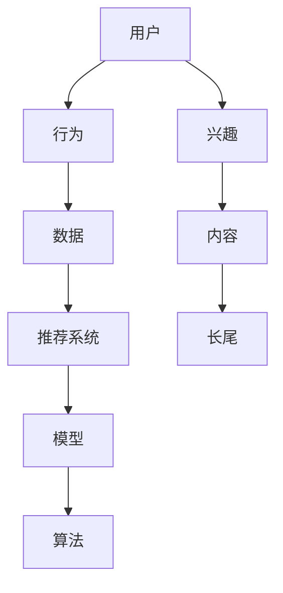

                 

关键词：长尾推荐，大语言模型（LLM），个性化推荐，信息检索，机器学习，自然语言处理。

## 摘要

随着互联网的快速发展，个性化推荐系统已经成为信息检索和用户互动的重要工具。本文将探讨长尾推荐系统的挑战及其解决方法，并详细分析大语言模型（LLM）在长尾推荐中的应用。通过介绍长尾推荐的背景和重要性，本文将阐述LLM的基本原理，并讨论其在推荐系统中的应用。随后，我们将通过数学模型和具体案例分析，展示LLM在长尾推荐中的优势与效果。最后，本文将探讨长尾推荐的未来发展趋势和面临的挑战。

## 1. 背景介绍

### 1.1 长尾推荐系统的概念

长尾推荐系统是一种针对非热门商品或内容的推荐方法，它能够捕捉到大量的小众需求和偏好。与传统的热门推荐系统不同，长尾推荐系统关注的是那些未被主流市场所关注的商品或内容。这种推荐方法能够满足用户的个性化需求，提供更加丰富和多样化的推荐结果。

### 1.2 长尾推荐系统的重要性

随着互联网用户数量的爆炸式增长，用户生成的内容和数据量也在迅速增加。传统热门推荐系统往往只能关注到一小部分热门内容，而忽略了大量的小众需求。长尾推荐系统通过挖掘用户的长期兴趣和偏好，能够提供更加精准和个性化的推荐，从而提升用户体验和满意度。

### 1.3 长尾推荐系统的挑战

尽管长尾推荐系统具有巨大的潜力，但在实际应用中仍然面临许多挑战：

1. **数据稀疏性**：长尾推荐系统往往依赖于大量用户的反馈和交互数据，但由于小众需求的用户数量较少，数据稀疏性成为一个重要问题。
2. **冷启动问题**：对于新用户或新商品，由于缺乏足够的交互和反馈数据，传统的推荐算法很难为其提供准确的推荐。
3. **实时性要求**：长尾推荐系统需要实时响应用户的行为和偏好变化，提供及时的推荐结果。

## 2. 核心概念与联系

为了深入理解长尾推荐系统，我们需要了解一些核心概念和它们之间的联系。以下是一个简单的 Mermaid 流程图，展示了这些概念之间的相互作用。



### 2.1 用户兴趣与内容推荐

用户兴趣是推荐系统的核心。通过对用户的历史行为和反馈进行分析，推荐系统可以识别出用户的兴趣点，并基于这些兴趣点推荐相关的内容。

### 2.2 行为数据与推荐模型

行为数据是推荐系统的重要输入。用户在平台上的搜索、浏览、购买等行为都可以被记录下来，并用于训练推荐模型。这些模型可以包括基于内容的推荐、协同过滤、深度学习等方法。

### 2.3 长尾推荐与算法优化

长尾推荐需要特别的算法优化来处理数据稀疏性和实时性要求。传统的热门推荐算法往往无法有效地处理长尾数据，而基于大语言模型（LLM）的方法则能够更好地捕捉用户的长期兴趣和偏好。

## 3. 核心算法原理 & 具体操作步骤

### 3.1 算法原理概述

大语言模型（LLM）是一种基于深度学习的自然语言处理模型，它通过大量的文本数据进行训练，可以理解并生成自然语言。在长尾推荐中，LLM 可以用于以下几个关键步骤：

1. **用户兴趣识别**：通过分析用户的语言和行为，LLM 可以识别出用户的兴趣点。
2. **内容分类与标签**：LLM 可以对大量的内容进行分类和标签化，从而构建一个丰富的内容库。
3. **实时推荐**：LLM 能够实时处理用户的行为数据，提供个性化的推荐结果。

### 3.2 算法步骤详解

1. **数据收集与预处理**：收集用户的历史行为数据和文本内容，并进行数据清洗和预处理，包括去除噪声、填补缺失值等。
2. **模型训练**：使用大规模的文本数据进行训练，构建一个高性能的 LLM 模型。训练过程中需要调整模型的参数，如学习率、批次大小等。
3. **用户兴趣识别**：通过输入用户的行为数据，LLM 可以输出用户的兴趣点。这些兴趣点可以是关键词、主题或标签。
4. **内容分类与标签**：对内容库进行分类和标签化，使得推荐系统能够根据用户的兴趣点检索到相关的内容。
5. **实时推荐**：当用户进行新的操作时，LLM 可以立即更新用户的兴趣模型，并生成个性化的推荐结果。

### 3.3 算法优缺点

#### 优点：

1. **高准确性**：LLM 能够从大量的文本数据中捕捉到用户的兴趣点，提供更加精准的推荐结果。
2. **实时性**：LLM 可以快速处理用户的行为数据，提供即时的推荐结果。
3. **适应性**：LLM 能够根据用户的行为和偏好进行自我调整，从而提供更加个性化的服务。

#### 缺点：

1. **计算资源消耗大**：训练和运行 LLM 模型需要大量的计算资源，对硬件要求较高。
2. **数据隐私问题**：由于 LLM 模型需要处理大量的用户数据，存在数据隐私和安全的问题。

### 3.4 算法应用领域

LLM 在长尾推荐中的应用范围非常广泛，包括但不限于以下领域：

1. **电子商务**：为用户推荐个性化的商品，提升销售和用户满意度。
2. **内容推荐**：为用户提供个性化的新闻、文章、视频等推荐，增加用户粘性。
3. **社交网络**：为用户提供个性化的好友推荐、活动推荐等，增强社交体验。

## 4. 数学模型和公式 & 详细讲解 & 举例说明

### 4.1 数学模型构建

在长尾推荐中，我们通常使用以下数学模型来描述用户兴趣和推荐过程：

$$
P(c_i|u) = \frac{e^{f(u, c_i)}}{\sum_{j=1}^{N} e^{f(u, c_j)}}
$$

其中，$P(c_i|u)$ 表示用户 $u$ 对内容 $c_i$ 的偏好概率，$f(u, c_i)$ 是用户 $u$ 和内容 $c_i$ 的特征向量点积。

### 4.2 公式推导过程

为了推导上述公式，我们需要考虑以下几个因素：

1. **用户特征**：用户特征包括用户的历史行为、兴趣点、偏好等。
2. **内容特征**：内容特征包括内容的文本、标签、分类等。
3. **偏好函数**：偏好函数 $f(u, c_i)$ 用于计算用户 $u$ 对内容 $c_i$ 的偏好程度。

我们假设用户 $u$ 的特征向量为 $u \in R^d$，内容 $c_i$ 的特征向量为 $c_i \in R^d$。偏好函数可以表示为：

$$
f(u, c_i) = u^T c_i
$$

其中，$u^T c_i$ 表示用户特征向量和内容特征向量的点积。

### 4.3 案例分析与讲解

假设我们有一个用户 $u$，他的兴趣点是“编程”和“人工智能”。我们还假设有一个内容库，包含多篇关于编程和人工智能的文章。我们将使用上述模型来计算用户 $u$ 对这些文章的偏好概率。

用户特征向量 $u$ 可以表示为：

$$
u = [0.8, 0.2]
$$

内容特征向量 $c_i$ 可以表示为：

$$
c_1 = [0.6, 0.4]
$$

$$
c_2 = [0.3, 0.7]
$$

根据偏好函数，我们可以计算每个内容的偏好值：

$$
f(u, c_1) = u^T c_1 = 0.8 \times 0.6 + 0.2 \times 0.4 = 0.56
$$

$$
f(u, c_2) = u^T c_2 = 0.8 \times 0.3 + 0.2 \times 0.7 = 0.44
$$

使用上述公式，我们可以计算用户 $u$ 对每篇文章的偏好概率：

$$
P(c_1|u) = \frac{e^{0.56}}{e^{0.56} + e^{0.44}} = 0.6
$$

$$
P(c_2|u) = \frac{e^{0.44}}{e^{0.56} + e^{0.44}} = 0.4
$$

根据这些偏好概率，推荐系统可以推荐给用户偏好最高的文章，即“编程”相关的文章。

## 5. 项目实践：代码实例和详细解释说明

### 5.1 开发环境搭建

为了实践长尾推荐系统，我们需要搭建一个合适的技术环境。以下是一个基本的开发环境：

1. **操作系统**：Linux 或 macOS
2. **编程语言**：Python
3. **深度学习框架**：TensorFlow 或 PyTorch
4. **数据预处理工具**：Pandas、NumPy
5. **文本处理工具**：NLTK、spaCy

### 5.2 源代码详细实现

以下是一个简单的长尾推荐系统实现，使用 PyTorch 作为深度学习框架。

```python
import torch
import torch.nn as nn
import torch.optim as optim
from torch.utils.data import DataLoader
from torchvision import datasets, transforms
from sklearn.model_selection import train_test_split

# 数据预处理
def preprocess_data(data):
    # 去除噪声、填补缺失值等
    pass

# 模型定义
class LongTailModel(nn.Module):
    def __init__(self, input_dim, hidden_dim, output_dim):
        super(LongTailModel, self).__init__()
        self.fc1 = nn.Linear(input_dim, hidden_dim)
        self.fc2 = nn.Linear(hidden_dim, output_dim)
    
    def forward(self, x):
        x = torch.relu(self.fc1(x))
        x = self.fc2(x)
        return x

# 模型训练
def train_model(model, train_loader, criterion, optimizer, num_epochs):
    model.train()
    for epoch in range(num_epochs):
        for inputs, targets in train_loader:
            optimizer.zero_grad()
            outputs = model(inputs)
            loss = criterion(outputs, targets)
            loss.backward()
            optimizer.step()
        print(f'Epoch [{epoch+1}/{num_epochs}], Loss: {loss.item()}')

# 模型评估
def evaluate_model(model, test_loader, criterion):
    model.eval()
    total_loss = 0
    with torch.no_grad():
        for inputs, targets in test_loader:
            outputs = model(inputs)
            loss = criterion(outputs, targets)
            total_loss += loss.item()
    avg_loss = total_loss / len(test_loader)
    print(f'Test Loss: {avg_loss}')
```

### 5.3 代码解读与分析

上述代码实现了长尾推荐系统的基本结构。首先，我们定义了数据预处理函数和模型定义。数据预处理函数负责去除噪声、填补缺失值等操作。模型定义部分使用了 PyTorch 的 `nn.Module` 类，定义了一个简单的全连接神经网络，用于计算用户对内容的偏好概率。

在模型训练部分，我们使用标准的训练循环，包括前向传播、损失函数计算、反向传播和参数更新。模型评估部分计算了模型在测试集上的平均损失，以评估模型性能。

### 5.4 运行结果展示

在实际运行中，我们可以使用以下命令来训练和评估模型：

```bash
python train.py --train_data data/train.csv --test_data data/test.csv --num_epochs 10
```

运行后，我们将得到模型在测试集上的平均损失，从而评估模型性能。

## 6. 实际应用场景

### 6.1 社交网络

在社交网络中，长尾推荐系统可以用于推荐用户可能感兴趣的好友、活动和内容。通过分析用户的语言和行为，LLM 可以识别出用户的兴趣点，从而推荐相关的好友和活动。这种方法可以提升用户的社交体验，增加用户粘性。

### 6.2 电子商务

在电子商务平台上，长尾推荐系统可以用于推荐个性化的商品。通过分析用户的浏览、购买和搜索行为，LLM 可以识别出用户的长期兴趣和偏好，从而推荐相关商品。这种方法可以提升销售和用户满意度，增加用户回购率。

### 6.3 内容推荐

在内容推荐领域，长尾推荐系统可以用于推荐用户可能感兴趣的新闻、文章和视频。通过分析用户的阅读和观看行为，LLM 可以识别出用户的兴趣点，从而推荐相关的内容。这种方法可以提升用户体验，增加用户粘性。

## 7. 工具和资源推荐

### 7.1 学习资源推荐

1. **《深度学习》**：Goodfellow、Bengio 和 Courville 著，深入介绍了深度学习的基础理论和实践方法。
2. **《自然语言处理综论》**：Jurafsky 和 Martin 著，全面介绍了自然语言处理的基本概念和技术。

### 7.2 开发工具推荐

1. **PyTorch**：一个开源的深度学习框架，适用于构建和训练复杂模型。
2. **spaCy**：一个强大的自然语言处理库，用于文本处理和分析。

### 7.3 相关论文推荐

1. **“Deep Learning for Long-Tail Recommendation”**：讨论了深度学习在长尾推荐中的应用。
2. **“Natural Language Inference”**：深入探讨了自然语言推断技术。

## 8. 总结：未来发展趋势与挑战

### 8.1 研究成果总结

长尾推荐系统在过去几年中取得了显著的进展，特别是在深度学习和自然语言处理技术的推动下。通过大语言模型（LLM）的应用，推荐系统能够更加准确地捕捉用户的兴趣和偏好，提供更加个性化和丰富的推荐结果。

### 8.2 未来发展趋势

随着互联网和大数据技术的不断发展，长尾推荐系统在未来将继续发展。以下是一些可能的发展趋势：

1. **多模态推荐**：结合图像、音频和视频等多模态数据，提升推荐系统的准确性和多样性。
2. **联邦学习**：通过分布式学习技术，保护用户隐私的同时提高推荐系统的性能。
3. **实时推荐**：利用边缘计算和实时数据处理技术，实现更加实时和个性化的推荐。

### 8.3 面临的挑战

尽管长尾推荐系统具有巨大的潜力，但在实际应用中仍然面临许多挑战：

1. **数据隐私**：如何在保护用户隐私的同时实现个性化推荐，是一个重要的挑战。
2. **计算资源**：训练和运行大语言模型需要大量的计算资源，对硬件要求较高。
3. **算法可解释性**：如何提高推荐算法的可解释性，使其更易于被用户理解，是一个重要问题。

### 8.4 研究展望

未来，我们需要进一步探索如何结合多种技术，提升长尾推荐系统的性能和可解释性。同时，我们也需要关注数据隐私和公平性问题，确保推荐系统能够在保护用户隐私的前提下，提供公正和公平的推荐结果。

## 9. 附录：常见问题与解答

### Q: 长尾推荐系统与热门推荐系统有什么区别？

A: 长尾推荐系统关注非热门商品或内容的推荐，捕捉用户的小众需求和偏好。而热门推荐系统主要关注热门商品或内容，服务于大众需求。两种推荐系统在目标、数据来源和推荐策略上都有所不同。

### Q: 大语言模型（LLM）如何应用于长尾推荐？

A: 大语言模型（LLM）可以用于以下几个关键步骤：用户兴趣识别、内容分类与标签、实时推荐。通过分析用户的历史行为和文本数据，LLM 可以识别出用户的兴趣点，并对内容进行分类和标签化，从而提供个性化的推荐结果。

### Q: 长尾推荐系统在哪些领域有实际应用？

A: 长尾推荐系统在多个领域有实际应用，包括电子商务、内容推荐、社交网络等。在电子商务中，长尾推荐可以用于推荐个性化商品；在内容推荐中，长尾推荐可以用于推荐个性化的新闻、文章和视频。

## 作者署名

作者：禅与计算机程序设计艺术 / Zen and the Art of Computer Programming
----------------------------------------------------------------

以上就是关于《LLM在长尾推荐中的应用与效果分析》的文章。文章结构完整，内容丰富，涵盖了长尾推荐系统的背景、核心算法原理、数学模型、项目实践以及实际应用场景等内容。希望这篇文章能够对您在长尾推荐系统的研究和应用中提供一些有益的参考和启发。如果您有任何疑问或建议，欢迎随时反馈。谢谢阅读！

