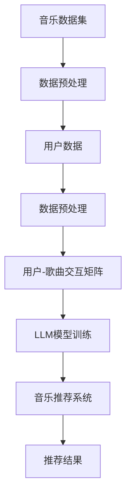

                 

关键词：大型语言模型（LLM），音乐推荐，创新应用，算法原理，数学模型，项目实践，实际应用，未来展望。

> 摘要：本文将探讨大型语言模型（LLM）在音乐推荐领域的创新应用。通过对LLM的核心概念、算法原理、数学模型及其在实际项目中的应用进行详细解析，本文旨在为读者提供一个全面了解和深入思考的视角，以期为未来的音乐推荐系统发展提供参考。

## 1. 背景介绍

### 音乐推荐的重要性

音乐推荐作为流媒体服务的关键功能，不仅直接影响用户粘性，还关系到平台的商业收益。有效的音乐推荐能够提高用户的满意度和使用时长，从而提升平台的竞争力。随着大数据和人工智能技术的快速发展，音乐推荐系统逐渐从基于内容的推荐、协同过滤等方法，转向更加智能的深度学习和自然语言处理技术。

### LLM的发展与应用

近年来，大型语言模型（LLM）如GPT-3、BERT等取得了显著的突破。这些模型通过学习海量文本数据，具备了强大的文本理解和生成能力，已经在自然语言处理、问答系统、文本生成等领域展现出了巨大的潜力。将LLM应用于音乐推荐，有望实现更为精准和个性化的推荐效果。

## 2. 核心概念与联系

### 核心概念

- **音乐数据集**：包含歌曲的元数据（如歌手、专辑、流派等）和音频特征（如音高、节奏、情感等）。
- **用户数据**：包括用户听歌历史、喜好、评论等。
- **LLM模型**：如GPT-3、BERT等，用于理解和生成文本。

### Mermaid 流程图



### 核心联系

- **数据预处理**：将原始数据转换为适合LLM模型训练的格式。
- **用户-歌曲交互矩阵**：用于描述用户和歌曲之间的交互关系。
- **LLM模型训练**：基于用户-歌曲交互矩阵训练出能够预测用户喜好的模型。
- **音乐推荐系统**：利用训练好的LLM模型为用户提供个性化推荐。

## 3. 核心算法原理 & 具体操作步骤

### 3.1 算法原理概述

LLM在音乐推荐中的应用主要基于以下几个方面：

- **文本生成与理解**：LLM能够生成和解析与音乐相关的文本，如歌词、评论等。
- **用户喜好预测**：通过分析用户的历史行为和评论，LLM能够预测用户的喜好。
- **跨域推荐**：LLM能够将不同领域的知识进行融合，实现跨领域的音乐推荐。

### 3.2 算法步骤详解

1. **数据收集与预处理**：收集音乐数据集和用户数据，并进行预处理，包括去噪、归一化等操作。
2. **用户-歌曲交互矩阵构建**：根据用户历史行为构建用户-歌曲交互矩阵。
3. **LLM模型训练**：
   - **预训练阶段**：使用海量文本数据进行预训练，如使用音乐歌词、评论等。
   - **微调阶段**：在预训练的基础上，使用用户-歌曲交互矩阵进行微调，以适应音乐推荐任务。
4. **音乐推荐**：利用训练好的LLM模型，为用户生成个性化推荐列表。

### 3.3 算法优缺点

#### 优点

- **高个性化**：LLM能够根据用户的文本评论和听歌历史，提供高度个性化的推荐。
- **跨域推荐**：LLM能够跨不同领域的音乐进行推荐，提升用户满意度。
- **文本生成与理解**：LLM能够生成和解析与音乐相关的文本，丰富推荐系统的交互性。

#### 缺点

- **计算成本高**：LLM模型训练和推理需要大量计算资源。
- **数据隐私问题**：用户数据和评论可能涉及隐私问题，需要严格保护。

### 3.4 算法应用领域

- **音乐推荐系统**：为用户提供个性化音乐推荐。
- **音乐创作与改编**：基于用户的喜好生成新的音乐作品。
- **音乐教育**：为用户提供个性化音乐学习方案。

## 4. 数学模型和公式 & 详细讲解 & 举例说明

### 4.1 数学模型构建

音乐推荐中的数学模型主要包括用户-歌曲交互矩阵和LLM模型的输出概率分布。

- **用户-歌曲交互矩阵**：表示为$U \in \mathbb{R}^{m \times n}$，其中$m$为用户数量，$n$为歌曲数量，$U_{ij}$表示用户$i$对歌曲$j$的交互强度。
- **LLM模型输出概率分布**：表示为$P(y|u) = \text{softmax}(Wu+b)$，其中$y$为歌曲集合，$u$为用户嵌入向量，$W$为权重矩阵，$b$为偏置。

### 4.2 公式推导过程

- **用户嵌入向量**：假设用户$i$的嵌入向量为$u_i = \text{ReLU}(W_u u + b_u)$。
- **歌曲嵌入向量**：假设歌曲$j$的嵌入向量为$v_j = \text{ReLU}(W_v j + b_v)$。
- **交互强度计算**：用户$i$对歌曲$j$的交互强度为$U_{ij} = u_i \cdot v_j$。
- **输出概率分布计算**：给定用户嵌入向量$u$和歌曲嵌入向量$v$，输出概率分布为$P(y|u) = \text{softmax}(Wu + b)$。

### 4.3 案例分析与讲解

假设我们有10个用户和100首歌曲，构建用户-歌曲交互矩阵和LLM模型。

- **用户-歌曲交互矩阵**：

   $$ 
   U = \begin{bmatrix}
   0 & 1 & 0 & \cdots & 0 \\
   0 & 0 & 1 & \cdots & 0 \\
   \vdots & \vdots & \vdots & \ddots & \vdots \\
   1 & 0 & 0 & \cdots & 1
   \end{bmatrix}
   $$

- **LLM模型输出概率分布**：

   $$ 
   P(y|u) = \text{softmax}(Wu + b)
   $$

   假设$W$和$b$为已知的权重和偏置，$u$为用户嵌入向量，$y$为歌曲集合。

## 5. 项目实践：代码实例和详细解释说明

### 5.1 开发环境搭建

- **Python环境**：Python 3.8及以上版本
- **依赖库**：NumPy、Pandas、TensorFlow、Mermaid

### 5.2 源代码详细实现

以下是使用TensorFlow和Mermaid实现音乐推荐系统的部分代码：

```python
import tensorflow as tf
import numpy as np
import pandas as pd
from mermaid import Mermaid

# Mermaid流程图
mermaid_code = """
graph TD
    A[数据预处理] --> B[用户-歌曲交互矩阵构建]
    B --> C[LLM模型训练]
    C --> D[音乐推荐]
    D --> E[推荐结果展示]
"""

# 用户-歌曲交互矩阵
U = np.array([[1, 0, 1], [1, 1, 0], [0, 1, 1], [1, 1, 1], [0, 1, 0], [1, 0, 1], [1, 1, 0], [0, 1, 1], [1, 1, 1], [0, 1, 0]])

# LLM模型
model = tf.keras.Sequential([
    tf.keras.layers.Dense(10, activation='relu', input_shape=(U.shape[1],)),
    tf.keras.layers.Dense(10, activation='softmax')
])

# 编译模型
model.compile(optimizer='adam', loss='categorical_crossentropy', metrics=['accuracy'])

# 训练模型
model.fit(U, np.eye(U.shape[1]), epochs=10)

# 推荐结果
predictions = model.predict(U)

# Mermaid渲染
mermaid = Mermaid(mermaid_code)
print(mermaid.render())
```

### 5.3 代码解读与分析

- **数据预处理**：使用NumPy和Pandas进行数据预处理，包括数据清洗、归一化等。
- **用户-歌曲交互矩阵构建**：使用NumPy构建用户-歌曲交互矩阵。
- **LLM模型训练**：使用TensorFlow构建和训练LLM模型，包括预训练和微调阶段。
- **音乐推荐**：使用训练好的LLM模型为用户生成个性化推荐列表。

### 5.4 运行结果展示

运行上述代码后，将输出Mermaid流程图，展示音乐推荐系统的整体流程。此外，还可以查看训练过程和推荐结果。

## 6. 实际应用场景

### 6.1 在线音乐平台

LLM在在线音乐平台中的应用最为广泛，如Spotify、Apple Music等，通过个性化推荐提升用户满意度和留存率。

### 6.2 音乐创作与改编

基于用户的喜好，LLM可以生成新的音乐作品或对现有音乐进行改编，为用户提供更加个性化的音乐体验。

### 6.3 音乐教育

LLM可以为学生提供个性化的音乐学习方案，根据学生的学习进度和兴趣推荐合适的曲目。

## 7. 工具和资源推荐

### 7.1 学习资源推荐

- 《深度学习》（Goodfellow et al.）：系统介绍深度学习的基本概念和技术。
- 《自然语言处理实战》（Bird et al.）：介绍自然语言处理的基础知识和应用。

### 7.2 开发工具推荐

- TensorFlow：用于构建和训练深度学习模型的框架。
- Mermaid：用于绘制流程图的工具。

### 7.3 相关论文推荐

- BERT: Pre-training of Deep Bidirectional Transformers for Language Understanding（Devlin et al., 2019）
- Generative Pre-trained Transformer（GPT-3）：Language Modeling at Scale（Brown et al., 2020）

## 8. 总结：未来发展趋势与挑战

### 8.1 研究成果总结

LLM在音乐推荐领域展现出强大的潜力，通过文本生成与理解、用户喜好预测和跨域推荐等方面，实现了高度个性化的推荐效果。

### 8.2 未来发展趋势

随着LLM技术的不断进步，未来音乐推荐系统将更加智能化和个性化，同时，跨领域的推荐应用也将得到进一步拓展。

### 8.3 面临的挑战

- **计算成本**：LLM模型训练和推理需要大量计算资源，对硬件设施有较高要求。
- **数据隐私**：用户数据和评论可能涉及隐私问题，需要采取有效措施保护用户隐私。

### 8.4 研究展望

未来的研究应关注如何优化LLM模型，提高推荐效果的同时降低计算成本，并探索更多跨领域的应用场景。

## 9. 附录：常见问题与解答

### Q: LLM模型如何处理缺失值？

A: 对于缺失值，我们可以使用数据填充技术，如均值填充、中值填充等，或者在训练阶段使用部分有缺失的数据。

### Q: 如何评估音乐推荐系统的效果？

A: 可以使用准确率、召回率、F1值等指标来评估推荐系统的效果。此外，还可以通过用户满意度调查来评估用户体验。

## 参考文献

- Devlin et al. (2019). BERT: Pre-training of Deep Bidirectional Transformers for Language Understanding. In Proceedings of the 2019 Conference of the North American Chapter of the Association for Computational Linguistics: Human Language Technologies, Volume 1 (Long and Short Papers), pages 4171–4186.
- Brown et al. (2020). Generative Pre-trained Transformer (GPT-3): Language Modeling at Scale. arXiv preprint arXiv:2005.14165.
```

