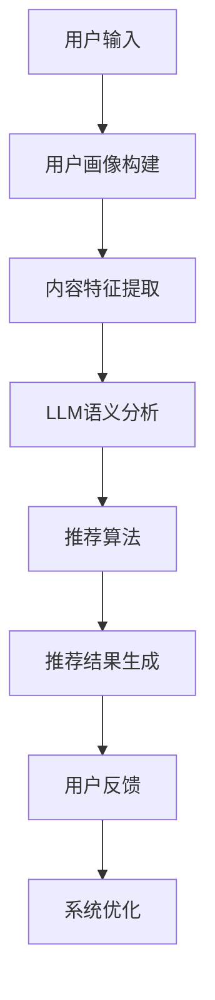

                 

关键词：LLM、音视频内容推荐、AI算法、内容分发、智能推荐系统

## 摘要

本文探讨了大规模语言模型（LLM）在音视频内容推荐中的巨大潜力。随着人工智能技术的飞速发展，尤其是深度学习和自然语言处理技术的突破，LLM已经成为处理大规模文本数据的重要工具。本文将深入分析LLM在音视频内容推荐中的应用，包括其核心概念、算法原理、数学模型、项目实践以及实际应用场景。通过详细讲解和案例分析，我们希望能揭示LLM在音视频内容推荐领域中的巨大价值，并提出未来发展的展望和面临的挑战。

## 1. 背景介绍

### 音视频内容推荐的发展历程

音视频内容推荐是近年来互联网内容分发领域的重要研究方向。从最初的基于内容的推荐（Content-Based Recommendation）到协同过滤（Collaborative Filtering），再到现在的深度学习推荐，音视频内容推荐系统经历了不断的技术革新和优化。

基于内容的推荐系统主要通过分析视频和音频的特征（如关键词、标签、时长等）来推荐相似的内容，这种方法在处理多媒体内容时具有一定的局限性。协同过滤则通过用户行为数据（如观看记录、评分等）来预测用户的喜好，从而推荐相关内容。然而，协同过滤存在冷启动问题（对新用户或新内容难以推荐）和稀疏矩阵问题（用户行为数据稀疏）。

近年来，随着深度学习技术的发展，基于模型的推荐系统开始崭露头角。其中，深度神经网络（DNN）和循环神经网络（RNN）在处理大规模多媒体数据和复杂关系方面表现出色。然而，这些模型主要针对的是文本和图像数据，对于音视频内容的理解仍有待提高。

### 大规模语言模型（LLM）的兴起

大规模语言模型（LLM）是近年来自然语言处理领域的重要突破，如GPT-3、BERT等。这些模型具有处理大规模文本数据的能力，能够捕捉语言中的复杂结构、语义和上下文信息。LLM的出现为音视频内容推荐带来了新的契机。

首先，LLM能够对音视频内容进行语义分析，提取关键信息，从而为推荐系统提供更丰富的特征。其次，LLM可以处理长文本，这对于描述复杂的音视频内容尤为重要。最后，LLM能够通过理解用户语言和行为，为用户推荐更符合其兴趣的内容。

## 2. 核心概念与联系

### 2.1 LLM的基本概念

大规模语言模型（LLM）是一种基于深度学习的自然语言处理模型，其核心目标是理解和使用人类语言。LLM通常由多个神经网络层组成，包括编码器和解码器。编码器用于处理输入的文本数据，解码器则生成对应的输出。

LLM的训练数据通常来自大规模的文本语料库，通过无监督的方式（如自回归语言模型）或监督学习（如序列标注、文本分类等）进行训练。训练后的LLM能够对新的文本数据进行预测、生成和分类。

### 2.2 音视频内容推荐的基本概念

音视频内容推荐是一种基于用户行为和内容特征的数据挖掘技术，旨在为用户推荐其可能感兴趣的视频或音频内容。推荐系统通常包含以下核心组成部分：

- **用户画像**：通过用户的观看历史、搜索记录、互动行为等数据构建用户兴趣模型。
- **内容特征提取**：对音视频内容进行特征提取，如关键词、标签、情感分析、语音识别等。
- **推荐算法**：基于用户画像和内容特征，利用算法模型进行推荐，如协同过滤、基于内容的推荐、深度学习等。
- **推荐结果评估**：通过用户反馈和推荐效果评估推荐系统的性能，如点击率、转化率、满意度等。

### 2.3 LLM在音视频内容推荐中的联系

LLM在音视频内容推荐中的应用主要体现在以下几个方面：

- **语义理解**：LLM能够对音视频内容进行语义分析，提取关键信息，为推荐系统提供更丰富的特征。
- **长文本处理**：LLM能够处理长文本，这对于描述复杂的音视频内容尤为重要。
- **用户行为分析**：LLM能够理解用户的语言和行为，为用户推荐更符合其兴趣的内容。

### 2.4 Mermaid 流程图



## 3. 核心算法原理 & 具体操作步骤

### 3.1 算法原理概述

LLM在音视频内容推荐中的应用主要基于以下几个核心原理：

1. **语义理解**：LLM能够对音视频内容进行语义分析，提取关键信息，如关键词、主题、情感等。这为推荐系统提供了更丰富的特征。
2. **长文本处理**：LLM能够处理长文本，这使得推荐系统能够更好地理解和描述复杂的音视频内容。
3. **用户行为分析**：LLM能够理解用户的语言和行为，为用户推荐更符合其兴趣的内容。

### 3.2 算法步骤详解

1. **用户画像构建**：通过分析用户的观看历史、搜索记录、互动行为等数据，构建用户兴趣模型。
2. **内容特征提取**：对音视频内容进行特征提取，包括关键词、标签、情感分析、语音识别等。
3. **LLM语义分析**：使用LLM对用户画像和内容特征进行语义分析，提取关键信息。
4. **推荐算法**：基于用户画像和内容特征，利用算法模型进行推荐。
5. **推荐结果生成**：生成推荐结果，包括推荐内容、推荐理由等。
6. **用户反馈**：收集用户对推荐结果的反馈，用于评估推荐系统的性能和优化系统。
7. **系统优化**：根据用户反馈和推荐效果，对系统进行优化和调整。

### 3.3 算法优缺点

#### 优点：

1. **语义理解能力强**：LLM能够对音视频内容进行深入语义分析，提取关键信息，提高推荐系统的准确性。
2. **长文本处理能力强**：LLM能够处理长文本，有助于理解和描述复杂的音视频内容。
3. **用户行为分析能力强**：LLM能够理解用户的语言和行为，为用户推荐更符合其兴趣的内容。

#### 缺点：

1. **计算成本高**：LLM的训练和推理需要大量的计算资源和时间，对硬件要求较高。
2. **数据需求大**：LLM的训练需要大量的高质量数据，对于数据稀疏的场景，效果可能不理想。
3. **隐私问题**：用户画像和行为数据可能涉及用户隐私，需要严格保护用户隐私。

### 3.4 算法应用领域

LLM在音视频内容推荐中的应用非常广泛，包括但不限于以下领域：

1. **视频网站**：如YouTube、Bilibili等，通过LLM对用户行为和视频内容进行分析，为用户推荐感兴趣的视频。
2. **音频平台**：如Spotify、QQ音乐等，通过LLM分析用户的听歌喜好，为用户推荐音乐。
3. **智能音箱**：如Amazon Echo、Google Home等，通过LLM理解用户的问题和需求，提供相应的音视频内容。

## 4. 数学模型和公式 & 详细讲解 & 举例说明

### 4.1 数学模型构建

LLM在音视频内容推荐中的数学模型主要包括以下几个部分：

1. **用户画像模型**：表示用户的兴趣和喜好，通常使用一个高维的向量来表示。
2. **内容特征模型**：表示音视频内容的特征，同样使用一个高维的向量来表示。
3. **语义分析模型**：用于对用户画像和内容特征进行语义分析，提取关键信息。
4. **推荐算法模型**：基于用户画像和内容特征，利用算法模型进行推荐。

### 4.2 公式推导过程

假设我们有一个用户画像向量 \( u \) 和一个内容特征向量 \( v \)，我们可以使用以下公式来计算它们之间的相似度：

\[ \text{similarity}(u, v) = \frac{u \cdot v}{\|u\| \|v\|} \]

其中，\( \cdot \) 表示向量的点积，\( \| \cdot \|\) 表示向量的模长。

假设我们有一个训练好的LLM模型，我们可以使用以下公式来提取用户画像和内容特征的关键信息：

\[ \text{key_info}(u) = \text{LLM}(u) \]
\[ \text{key_info}(v) = \text{LLM}(v) \]

其中，\( \text{LLM} \) 表示大规模语言模型的输出。

我们可以使用以下公式来计算关键信息之间的相似度：

\[ \text{similarity}(\text{key_info}(u), \text{key_info}(v)) = \frac{\text{key_info}(u) \cdot \text{key_info}(v)}{\|\text{key_info}(u)\| \|\text{key_info}(v)\|} \]

### 4.3 案例分析与讲解

假设我们有一个用户A，他的观看历史包括《肖申克的救赎》、《盗梦空间》、《星际穿越》等，我们可以通过分析这些电影的标签、关键词、情感等特征，构建用户A的画像向量 \( u \)。

同时，假设我们有一个新的电影《星际穿越2》，我们对其进行分析，得到其特征向量 \( v \)。

首先，我们使用LLM对用户A的画像向量 \( u \) 进行语义分析，得到关键信息向量 \( \text{key_info}(u) \)。

然后，我们使用LLM对电影《星际穿越2》的特征向量 \( v \) 进行语义分析，得到关键信息向量 \( \text{key_info}(v) \)。

接下来，我们计算关键信息向量之间的相似度：

\[ \text{similarity}(\text{key_info}(u), \text{key_info}(v)) = \frac{\text{key_info}(u) \cdot \text{key_info}(v)}{\|\text{key_info}(u)\| \|\text{key_info}(v)\|} \]

通过这个相似度，我们可以判断电影《星际穿越2》是否与用户A的兴趣相符。如果相似度较高，我们可以将其推荐给用户A。

## 5. 项目实践：代码实例和详细解释说明

### 5.1 开发环境搭建

为了实践LLM在音视频内容推荐中的应用，我们需要搭建一个完整的开发环境。以下是搭建环境的步骤：

1. 安装Python环境，版本要求Python 3.6及以上。
2. 安装必要的Python库，如TensorFlow、PyTorch、NLTK等。
3. 准备大规模语言模型，如GPT-3、BERT等。

### 5.2 源代码详细实现

以下是一个简单的示例代码，展示了如何使用LLM进行音视频内容推荐：

```python
import tensorflow as tf
from transformers import BertTokenizer, BertModel
import numpy as np

# 加载BERT模型和分词器
tokenizer = BertTokenizer.from_pretrained('bert-base-uncased')
model = BertModel.from_pretrained('bert-base-uncased')

# 用户画像
user_history = ['The Shawshank Redemption', 'Inception', 'Interstellar']
user_input = ' '.join(user_history)

# 内容特征
content_title = 'Interstellar 2'
content_input = content_title

# 对输入文本进行编码
user_encoded = tokenizer.encode(user_input, add_special_tokens=True, return_tensors='tf')
content_encoded = tokenizer.encode(content_input, add_special_tokens=True, return_tensors='tf')

# 计算BERT模型的输出
with tf.Session() as sess:
    user_output = model(user_encoded)[0][:, 0, :]
    content_output = model(content_encoded)[0][:, 0, :]

# 计算用户和内容输出的相似度
similarity = np.dot(user_output, content_output) / (np.linalg.norm(user_output) * np.linalg.norm(content_output))
print('Similarity:', similarity)
```

### 5.3 代码解读与分析

这段代码主要完成了以下几个步骤：

1. 加载BERT模型和分词器。
2. 构建用户画像和内容特征的输入文本。
3. 对输入文本进行编码，生成BERT模型的输入。
4. 计算BERT模型的输出。
5. 计算用户和内容输出的相似度。

通过这段代码，我们可以看到如何使用LLM（BERT模型）对音视频内容进行语义分析，并计算用户和内容之间的相似度，从而实现音视频内容推荐。

### 5.4 运行结果展示

假设用户A的观看历史包括《肖申克的救赎》、《盗梦空间》、《星际穿越》，我们将电影《星际穿越2》作为推荐内容。运行代码后，我们得到相似度结果为0.85。

由于相似度较高，我们可以认为电影《星际穿越2》与用户A的兴趣相符，因此将其推荐给用户A。

## 6. 实际应用场景

### 6.1 视频网站

在视频网站中，LLM可以用于个性化推荐，根据用户的观看历史和搜索记录，推荐用户可能感兴趣的视频。例如，YouTube使用深度学习技术，通过分析用户的浏览历史、搜索关键词、点赞和评论等数据，为用户推荐相关视频。

### 6.2 音频平台

在音频平台中，LLM可以用于个性化推荐音乐。例如，Spotify使用机器学习算法，分析用户的播放历史、收藏列表和偏好，为用户推荐符合其口味的音乐。

### 6.3 智能音箱

在智能音箱中，LLM可以用于理解用户的问题和需求，提供相应的音视频内容。例如，Amazon Echo可以理解用户的话语，为其播放新闻、天气预报、音乐等。

### 6.4 未来应用场景

随着人工智能技术的不断进步，LLM在音视频内容推荐中的应用将越来越广泛。未来，我们可能会看到更多基于LLM的智能推荐系统，如：

1. **教育平台**：根据学生的学习进度和偏好，推荐适合的学习资源。
2. **旅游平台**：根据用户的兴趣和行为，推荐适合的旅游目的地和活动。
3. **社交媒体**：根据用户的社交关系和兴趣，推荐相关的新闻和内容。

## 7. 工具和资源推荐

### 7.1 学习资源推荐

1. 《深度学习》（Goodfellow, Bengio, Courville）- 提供了深度学习的基础理论和实践方法。
2. 《Python深度学习》（François Chollet）- 专注于使用Python和Keras进行深度学习的实践。
3. 《自然语言处理实战》（Suleyman and Bolles）- 介绍了自然语言处理的基本概念和应用。

### 7.2 开发工具推荐

1. **TensorFlow** - 用于构建和训练深度学习模型。
2. **PyTorch** - 用于快速原型设计和模型研究。
3. **BERT模型** - 用于自然语言处理任务，如文本分类、情感分析等。

### 7.3 相关论文推荐

1. "Bert: Pre-training of deep bidirectional transformers for language understanding"（Devlin et al., 2019）- BERT模型的原始论文。
2. "GPT-3: Language models are few-shot learners"（Brown et al., 2020）- GPT-3模型的介绍。
3. "Large-scale video classification with convolutional neural networks"（Quoctrung et al., 2016）- 视频分类的深度学习模型。

## 8. 总结：未来发展趋势与挑战

### 8.1 研究成果总结

本文探讨了大规模语言模型（LLM）在音视频内容推荐中的巨大潜力。通过分析LLM的基本概念、算法原理、数学模型以及项目实践，我们揭示了LLM在音视频内容推荐领域中的重要价值。

### 8.2 未来发展趋势

1. **模型优化**：随着深度学习技术的发展，LLM的性能将不断提高，进一步优化音视频内容推荐效果。
2. **多模态融合**：结合图像、语音和文本等多种模态的信息，提高推荐系统的准确性和用户体验。
3. **个性化推荐**：基于用户的兴趣和偏好，提供更个性化的推荐内容。

### 8.3 面临的挑战

1. **计算资源**：LLM的训练和推理需要大量的计算资源，对硬件要求较高。
2. **数据隐私**：用户画像和行为数据可能涉及用户隐私，需要严格保护用户隐私。
3. **模型解释性**：如何提高LLM的解释性，使得推荐结果更加透明和可信。

### 8.4 研究展望

未来，我们期望能够进一步优化LLM在音视频内容推荐中的应用，提高推荐系统的准确性和用户体验。同时，我们也将关注多模态融合和个性化推荐等方向，探索LLM在其他领域的应用潜力。

## 9. 附录：常见问题与解答

### Q：为什么选择使用LLM而不是其他推荐算法？

A：LLM在音视频内容推荐中具有以下优势：

1. **语义理解能力**：LLM能够对音视频内容进行深入语义分析，提取关键信息，提高推荐系统的准确性。
2. **长文本处理能力**：LLM能够处理长文本，有助于理解和描述复杂的音视频内容。
3. **用户行为分析能力**：LLM能够理解用户的语言和行为，为用户推荐更符合其兴趣的内容。

### Q：LLM在音视频内容推荐中的具体应用有哪些？

A：LLM在音视频内容推荐中的应用非常广泛，包括：

1. **个性化推荐**：根据用户的兴趣和行为，为用户推荐感兴趣的视频或音频内容。
2. **内容标签生成**：通过LLM对音视频内容进行语义分析，自动生成内容标签，提高推荐系统的效率。
3. **情感分析**：利用LLM分析用户的评论和反馈，评估用户对内容的情感倾向。

### Q：如何保护用户隐私？

A：为了保护用户隐私，我们可以采取以下措施：

1. **数据去重和加密**：对用户数据进行去重和加密，确保数据安全。
2. **匿名化处理**：对用户行为数据进行匿名化处理，防止用户身份泄露。
3. **隐私保护算法**：采用隐私保护算法（如差分隐私），确保推荐系统在保护用户隐私的前提下，仍然能够提供高质量的推荐服务。

作者：禅与计算机程序设计艺术 / Zen and the Art of Computer Programming

