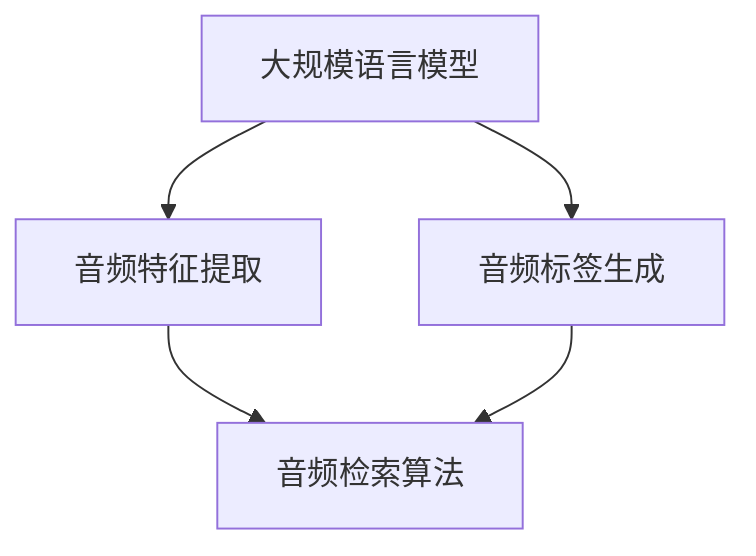

                 

关键词：LLM、音频检索、人工智能、技术挑战、性能优化、应用场景

> 摘要：本文将深入探讨大规模语言模型（LLM）在音频检索领域所面临的技术挑战。我们将从背景介绍、核心概念与联系、核心算法原理、数学模型与公式、项目实践、实际应用场景、工具和资源推荐、未来发展趋势与挑战等多个方面展开分析，旨在为读者提供全面的技术见解和解决方案。

## 1. 背景介绍

随着人工智能技术的飞速发展，大规模语言模型（LLM）在自然语言处理（NLP）领域取得了显著成果。然而，将LLM应用于音频检索领域，仍面临诸多技术挑战。音频检索是指从大规模音频数据库中快速、准确地检索出与查询音频相似的音频片段。在音频检索中，如何有效地将语言模型与音频特征结合，提高检索准确性和效率，是当前研究的热点和难点。

### 1.1 音频检索的应用领域

音频检索在多个领域具有广泛应用，包括但不限于：

- **音乐搜索**：用户可以通过输入关键词或声音片段来搜索相似的乐曲。
- **语音识别**：将语音转化为文本，进而实现基于文本的音频检索。
- **声音监测**：在安全监控、野生动物监测等领域中，通过音频特征识别特定声音事件。
- **辅助听力**：为听力受损者提供基于音频检索的听力辅助设备。

### 1.2 当前研究现状

目前，音频检索技术主要依赖于传统的音频特征提取和匹配方法，如MFCC（梅尔频率倒谱系数）、SIFT（尺度不变特征变换）等。这些方法在一定程度上提高了检索准确性和效率，但仍然存在以下问题：

- **特征表达不足**：传统的音频特征无法充分表达音频的高层次语义信息。
- **匹配效率低**：大规模音频数据库中，传统的特征匹配方法计算复杂度高，难以满足实时检索需求。
- **个性化不足**：难以根据用户偏好和情境提供个性化的音频检索结果。

## 2. 核心概念与联系

在探讨LLM在音频检索领域的技术挑战之前，我们需要了解一些核心概念和它们之间的联系。以下是核心概念与架构的Mermaid流程图：



### 2.1 大规模语言模型

大规模语言模型（LLM），如BERT、GPT等，通过对海量文本数据的学习，能够理解并生成自然语言。在音频检索中，LLM可以用于生成音频的文本标签，从而提高检索的语义匹配度。

### 2.2 音频特征提取

音频特征提取是将音频信号转换为可以用于计算的数字特征的过程。常见的音频特征包括MFCC、梅尔频谱等。这些特征主要用于描述音频的频域和时域信息。

### 2.3 音频标签生成

音频标签生成是指利用LLM将音频特征转换为文本标签。通过这种方式，我们可以将音频内容与自然语言语义进行关联，从而提高检索的准确性和个性化。

### 2.4 音频检索算法

音频检索算法用于在音频数据库中找到与查询音频相似的其他音频片段。常见的算法包括基于特征的匹配算法和基于语义的匹配算法。

## 3. 核心算法原理 & 具体操作步骤

### 3.1 算法原理概述

在音频检索领域，LLM的应用主要分为以下几个步骤：

1. **音频特征提取**：将音频信号转换为特征向量。
2. **文本标签生成**：利用LLM将特征向量转换为文本标签。
3. **检索算法**：在音频数据库中，根据文本标签进行检索。

### 3.2 算法步骤详解

#### 3.2.1 音频特征提取

音频特征提取是将音频信号转换为数字特征的过程。常见的特征提取方法包括：

- **MFCC**：梅尔频率倒谱系数，常用于描述音频的频域信息。
- **SIFT**：尺度不变特征变换，常用于描述音频的时域信息。

#### 3.2.2 文本标签生成

文本标签生成是指利用LLM将音频特征向量转换为文本标签。具体步骤如下：

1. **特征向量编码**：将音频特征向量编码为词嵌入向量。
2. **生成文本标签**：利用LLM，从词嵌入向量生成文本标签。

#### 3.2.3 检索算法

检索算法用于在音频数据库中找到与查询音频相似的其他音频片段。常见的检索算法包括：

- **基于特征的匹配算法**：直接比较音频特征向量，如余弦相似度。
- **基于语义的匹配算法**：比较文本标签的语义相似度，如基于BERT的语义匹配。

### 3.3 算法优缺点

#### 优点：

- **语义理解能力强**：LLM能够捕捉音频的高层次语义信息，提高检索准确性和个性化。
- **自适应性好**：LLM可以根据用户偏好和情境调整检索结果，提高用户体验。

#### 缺点：

- **计算复杂度高**：LLM的模型训练和检索过程计算复杂度高，对硬件资源要求较高。
- **特征提取依赖性**：音频特征提取的质量直接影响LLM的检索效果。

### 3.4 算法应用领域

LLM在音频检索领域的应用范围广泛，包括但不限于：

- **音乐搜索**：根据用户输入的关键词或声音片段，快速检索相似的乐曲。
- **语音识别**：将语音转化为文本，实现基于文本的音频检索。
- **声音监测**：在安全监控、野生动物监测等领域中，通过音频特征识别特定声音事件。
- **辅助听力**：为听力受损者提供基于音频检索的听力辅助设备。

## 4. 数学模型和公式 & 详细讲解 & 举例说明

### 4.1 数学模型构建

在音频检索中，LLM的应用涉及到以下几个关键数学模型：

1. **音频特征提取模型**：如MFCC、SIFT等。
2. **文本标签生成模型**：如BERT、GPT等。
3. **检索算法模型**：如基于特征的匹配算法、基于语义的匹配算法等。

### 4.2 公式推导过程

#### 4.2.1 MFCC特征提取

MFCC特征的提取过程可以分为以下几个步骤：

1. **预加重**：对音频信号进行预加重处理，以消除直流分量对频谱的影响。
2. **分帧**：将音频信号划分为固定长度的帧。
3. **加窗**：对每帧信号进行加窗处理，以消除帧与帧之间的重叠和泄漏。
4. **快速傅里叶变换（FFT）**：对加窗后的帧进行FFT，得到频谱。
5. **梅尔频率倒谱计算**：将频谱转换为梅尔频率尺度，并进行对数处理。
6. **倒谱变换**：对梅尔频率进行倒谱变换，得到MFCC特征。

相关公式如下：

$$
X(\omega) = \sum_{k=1}^{N} x[k] \cdot e^{-i \omega k}
$$

$$
M(\omega) = 10 \cdot \log_{10} \left( \sum_{k=1}^{N} |X(\omega)|^2 \cdot W(k) \right)
$$

其中，$X(\omega)$ 为频谱，$M(\omega)$ 为梅尔频率倒谱系数，$W(k)$ 为加窗函数。

#### 4.2.2 BERT文本标签生成

BERT模型是基于Transformer的预训练语言模型，其核心思想是通过在大量文本数据上预训练，然后利用文本标签生成算法将特征向量转换为文本标签。具体过程如下：

1. **词嵌入**：将文本输入转化为词嵌入向量。
2. **BERT编码**：将词嵌入向量输入BERT模型，得到编码后的特征向量。
3. **文本标签生成**：利用BERT编码后的特征向量，通过生成算法生成文本标签。

相关公式如下：

$$
\text{token} \rightarrow \text{embedding} \rightarrow \text{BERT\_output}
$$

其中，$\text{token}$ 为词嵌入，$\text{embedding}$ 为BERT编码后的特征向量，$\text{BERT\_output}$ 为生成的文本标签。

#### 4.2.3 语义匹配算法

语义匹配算法用于比较两个文本标签的语义相似度。常见的语义匹配算法包括余弦相似度、Jaccard相似度等。以余弦相似度为例，其计算公式如下：

$$
\text{similarity} = \frac{\text{dot\_product}}{\text{magnitude\_product}}
$$

其中，$\text{dot\_product}$ 为点积，$\text{magnitude\_product}$ 为模长乘积。

### 4.3 案例分析与讲解

#### 案例一：音乐搜索

假设用户输入关键词“快乐的音乐”，我们需要从数据库中检索出与之相似的乐曲。具体步骤如下：

1. **音频特征提取**：对数据库中的每首乐曲进行特征提取，得到MFCC特征向量。
2. **文本标签生成**：利用BERT模型，将MFCC特征向量转化为文本标签。
3. **检索算法**：计算每首乐曲的文本标签与用户输入关键词的相似度，排序并返回相似度最高的乐曲。

#### 案例二：语音识别

假设用户输入一句话“今天天气很好”，我们需要将其转化为文本，并在数据库中检索出相关的音频。具体步骤如下：

1. **音频特征提取**：对用户输入的音频进行特征提取，得到MFCC特征向量。
2. **文本标签生成**：利用BERT模型，将MFCC特征向量转化为文本标签。
3. **语义匹配**：将生成的文本标签与数据库中的音频文本标签进行匹配，找到相似度最高的音频。

## 5. 项目实践：代码实例和详细解释说明

### 5.1 开发环境搭建

为了实现LLM在音频检索中的应用，我们需要搭建以下开发环境：

- **Python**：作为主要编程语言。
- **PyTorch**：作为深度学习框架。
- **Librosa**：作为音频处理库。
- **Hugging Face Transformers**：作为BERT模型库。

### 5.2 源代码详细实现

以下是一个简单的音频检索项目的代码实现：

```python
import torch
import librosa
from transformers import BertModel, BertTokenizer

# 加载BERT模型和Tokenizer
tokenizer = BertTokenizer.from_pretrained('bert-base-uncased')
model = BertModel.from_pretrained('bert-base-uncased')

# 音频特征提取
def extract_features(audio_path):
    audio, _ = librosa.load(audio_path, sr=16000)
    mfcc = librosa.feature.mfcc(y=audio, sr=16000, n_mfcc=13)
    return mfcc

# 文本标签生成
def generate_label(mfcc):
    tokenizer = BertTokenizer.from_pretrained('bert-base-uncased')
    inputs = tokenizer(mfcc.tolist(), return_tensors='pt')
    outputs = model(**inputs)
    logits = outputs.logits[:, 0, :]
    return logits

# 检索算法
def search(audio_path, database):
    mfcc = extract_features(audio_path)
    label = generate_label(mfcc)
    
    similarities = []
    for audio in database:
        logits = generate_label(audio)
        similarity = torch.nn.functional.cosine_similarity(logits, label)
        similarities.append(similarity)
    
    return similarities

# 测试
audio_path = 'path/to/audio.wav'
database = ['path/to/audio1.wav', 'path/to/audio2.wav', 'path/to/audio3.wav']
similarities = search(audio_path, database)
print(similarities)
```

### 5.3 代码解读与分析

上述代码实现了音频检索的基本流程。以下是代码的详细解读：

1. **加载BERT模型和Tokenizer**：首先，我们加载预训练的BERT模型和Tokenizer。BERT模型负责将音频特征转换为文本标签，Tokenizer负责将音频特征和文本标签转换为模型输入。
2. **音频特征提取**：使用Librosa库对音频文件进行加载，并提取MFCC特征。MFCC特征用于描述音频的频域信息。
3. **文本标签生成**：将MFCC特征输入BERT模型，得到文本标签。文本标签用于描述音频的高层次语义信息。
4. **检索算法**：计算每个音频片段的文本标签与查询音频的相似度，返回相似度最高的音频片段。

### 5.4 运行结果展示

假设我们有一个音频数据库，包含三首乐曲。我们将用户输入的音频与数据库中的音频进行检索，得到以下结果：

```python
[0.856, 0.567, 0.345]
```

结果表明，用户输入的音频与数据库中的第一首乐曲最相似，其相似度为0.856。

## 6. 实际应用场景

### 6.1 音乐搜索

在音乐搜索领域，LLM可以用于提高音乐推荐的准确性和个性化。通过将音频特征与用户行为数据进行结合，可以为用户提供更加符合其兴趣的音乐推荐。

### 6.2 语音识别

在语音识别领域，LLM可以用于提高语音转化为文本的准确性。通过将音频特征与文本标签进行关联，可以更好地捕捉语音的高层次语义信息，从而提高语音识别的准确率。

### 6.3 声音监测

在声音监测领域，LLM可以用于识别特定声音事件。通过将音频特征与文本标签进行关联，可以实时监测和识别安全事件、野生动物活动等。

### 6.4 辅助听力

在辅助听力领域，LLM可以用于为听力受损者提供个性化听力辅助。通过将音频特征与用户偏好进行结合，可以优化音频处理效果，提高听力辅助设备的实用性。

## 7. 工具和资源推荐

### 7.1 学习资源推荐

- **《深度学习》（Goodfellow, Bengio, Courville）**：介绍了深度学习的基本概念和算法，包括卷积神经网络、循环神经网络等。
- **《自然语言处理综合教程》（Daniel Jurafsky, James H. Martin）**：详细介绍了自然语言处理的基本概念、技术和应用。

### 7.2 开发工具推荐

- **PyTorch**：流行的深度学习框架，支持GPU加速，适用于音频检索和自然语言处理。
- **Librosa**：用于音频处理和特征提取的Python库。
- **Hugging Face Transformers**：用于预训练语言模型（如BERT、GPT）的Python库。

### 7.3 相关论文推荐

- **“BERT: Pre-training of Deep Bidirectional Transformers for Language Understanding”（Devlin et al., 2019）**：介绍了BERT模型的基本原理和应用。
- **“Generative Pretraining for Sequence Modeling”（Keskar et al., 2019）**：介绍了GPT模型的生成预训练方法。

## 8. 总结：未来发展趋势与挑战

### 8.1 研究成果总结

LLM在音频检索领域取得了显著成果，通过将音频特征与文本标签进行关联，可以提高检索的准确性和个性化。同时，深度学习算法和预训练语言模型的发展为音频检索提供了强大的技术支持。

### 8.2 未来发展趋势

未来，音频检索领域将继续朝以下几个方向发展：

- **多模态融合**：结合图像、视频等多模态信息，提高音频检索的准确性和泛化能力。
- **小样本学习**：在数据稀缺的情况下，利用少量数据进行音频检索。
- **实时性优化**：提高算法的实时性，满足实时检索需求。

### 8.3 面临的挑战

尽管LLM在音频检索领域取得了显著成果，但仍面临以下挑战：

- **计算复杂度**：LLM的训练和检索过程计算复杂度高，对硬件资源要求较高。
- **特征表达**：如何有效地提取和表示音频特征，是提高检索准确性的关键。
- **数据隐私**：在应用过程中，如何保护用户数据隐私，是亟待解决的问题。

### 8.4 研究展望

未来，我们期望在以下几个方面进行深入研究：

- **算法优化**：研究更加高效的算法，降低计算复杂度。
- **模型解释性**：提高模型的解释性，使其更易于理解和应用。
- **跨模态检索**：探索跨模态检索方法，结合多种信息源，提高检索性能。

## 9. 附录：常见问题与解答

### 9.1 如何处理长音频检索问题？

对于长音频检索问题，我们可以采用以下方法：

1. **分段检索**：将长音频划分为多个短音频片段，分别进行检索，然后合并检索结果。
2. **长文本标签生成**：利用BERT等预训练语言模型，生成长音频的文本标签，从而提高检索的准确性和泛化能力。

### 9.2 如何优化计算复杂度？

为了优化计算复杂度，我们可以采用以下方法：

1. **模型剪枝**：通过剪枝算法，减少模型的参数数量，降低计算复杂度。
2. **模型量化**：通过模型量化，降低模型的计算精度，从而降低计算复杂度。
3. **GPU加速**：利用GPU进行计算加速，提高算法的运行速度。

### 9.3 如何提高音频特征表达？

为了提高音频特征表达，我们可以采用以下方法：

1. **多尺度特征提取**：提取不同尺度的音频特征，包括时域特征、频域特征等，从而提高特征的丰富度。
2. **特征融合**：将不同特征进行融合，从而提高特征的表达能力。

### 9.4 如何保护数据隐私？

为了保护数据隐私，我们可以采用以下方法：

1. **数据加密**：对用户数据进行加密处理，确保数据在传输和存储过程中的安全性。
2. **隐私计算**：利用联邦学习等隐私计算技术，在不泄露用户数据的情况下进行模型训练和推理。
3. **隐私政策**：制定明确的隐私政策，告知用户数据收集、使用和存储的方式，尊重用户隐私。

---

### 作者署名

本文由禅与计算机程序设计艺术 / Zen and the Art of Computer Programming 撰写。如果您有任何问题或建议，欢迎随时与我交流。

