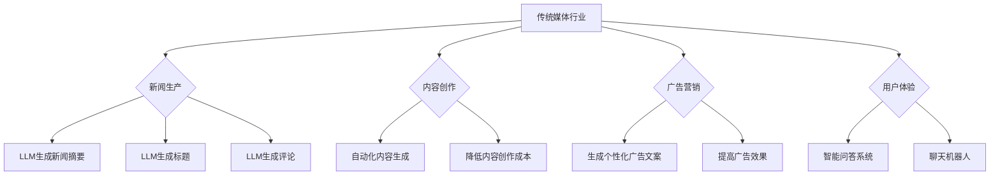

                 

关键词：语言模型，传统媒体，媒体变革，人工智能，新闻生产，内容创作，广告营销，用户体验

> 摘要：本文将探讨语言生成模型（LLM）对传统媒体行业的深刻影响。通过分析LLM在新闻生产、内容创作、广告营销和用户体验等领域的应用，揭示其在推动媒体行业变革中所扮演的关键角色，并展望未来发展趋势与面临的挑战。

## 1. 背景介绍

随着人工智能技术的飞速发展，语言生成模型（LLM）已经成为自然语言处理领域的重要突破。LLM基于深度学习技术，能够通过学习大量语言数据，生成高质量、语义丰富的文本内容。近年来，LLM在各个领域得到了广泛应用，包括文本生成、机器翻译、问答系统等。在传统媒体行业，LLM的应用潜力更是引起了广泛关注。

传统媒体行业主要包括报纸、杂志、电视、广播等，这些媒体形式在过去的几百年里一直是信息传播的重要渠道。然而，随着互联网和数字技术的兴起，传统媒体行业面临着巨大的挑战，包括用户流失、广告收入下降、内容同质化等问题。在这个背景下，LLM的出现为传统媒体行业带来了新的机遇和挑战。

## 2. 核心概念与联系

### 2.1 语言生成模型（LLM）原理

语言生成模型（LLM）是一种基于深度学习技术的自然语言处理模型。它通过学习大量的语言数据，能够生成高质量、语义丰富的文本内容。LLM的核心原理是神经网络，主要包括以下几个步骤：

1. **输入编码**：将输入的文本数据转换为计算机可以处理的向量表示。
2. **神经网络计算**：通过多层神经网络，对输入向量进行处理，提取特征并生成输出向量。
3. **输出解码**：将输出向量转换为文本数据，生成最终的文本内容。

### 2.2 传统媒体行业与LLM的关联

在传统媒体行业中，LLM的应用主要体现在以下几个方面：

1. **新闻生产**：利用LLM生成新闻摘要、标题、评论等。
2. **内容创作**：为传统媒体提供自动化内容生成工具，降低内容创作的成本。
3. **广告营销**：通过LLM生成个性化广告文案，提高广告效果。
4. **用户体验**：利用LLM生成智能问答系统、聊天机器人等，提高用户满意度。

### 2.3 Mermaid流程图



## 3. 核心算法原理 & 具体操作步骤

### 3.1 算法原理概述

LLM的核心算法原理主要包括以下几个步骤：

1. **数据预处理**：对输入的文本数据进行清洗、分词、词向量化等预处理操作。
2. **模型训练**：使用预处理的文本数据训练神经网络模型，包括词嵌入层、编码器、解码器等。
3. **文本生成**：输入新的文本数据，通过模型生成相应的文本内容。

### 3.2 算法步骤详解

1. **数据预处理**：

   - 清洗文本数据：去除无效字符、标点符号、停用词等。
   - 分词：将文本划分为单词或短语。
   - 词向量化：将文本数据转换为计算机可以处理的向量表示。

2. **模型训练**：

   - 构建神经网络模型：包括词嵌入层、编码器、解码器等。
   - 使用预处理的文本数据训练模型，通过反向传播算法优化模型参数。

3. **文本生成**：

   - 输入新的文本数据。
   - 通过模型生成文本内容，输出结果进行后处理，如去除无效字符、标点符号等。

### 3.3 算法优缺点

1. **优点**：

   - **高效性**：LLM能够快速生成高质量、语义丰富的文本内容。
   - **灵活性**：LLM可以根据不同的应用场景进行定制化开发。
   - **降低成本**：利用LLM可以降低内容创作和广告营销的成本。

2. **缺点**：

   - **数据依赖性**：LLM的性能依赖于训练数据的质量和数量。
   - **偏见问题**：如果训练数据存在偏见，生成的文本内容也可能存在偏见。
   - **可控性**：尽管LLM可以生成高质量文本，但其生成内容仍具有一定的随机性。

### 3.4 算法应用领域

1. **新闻生产**：利用LLM生成新闻摘要、标题和评论，提高新闻生产效率。
2. **内容创作**：为传统媒体提供自动化内容生成工具，降低内容创作成本。
3. **广告营销**：通过LLM生成个性化广告文案，提高广告效果。
4. **用户体验**：利用LLM生成智能问答系统、聊天机器人等，提高用户满意度。

## 4. 数学模型和公式 & 详细讲解 & 举例说明

### 4.1 数学模型构建

LLM的数学模型主要包括词嵌入层、编码器、解码器等部分。词嵌入层使用Word2Vec、GloVe等算法将文本数据转换为向量表示；编码器使用循环神经网络（RNN）或卷积神经网络（CNN）提取文本特征；解码器使用RNN或CNN生成文本内容。

### 4.2 公式推导过程

设输入文本序列为 \(x_1, x_2, ..., x_T\)，输出文本序列为 \(y_1, y_2, ..., y_T\)。词嵌入层将输入文本序列转换为向量表示 \(x_1^{\prime}, x_2^{\prime}, ..., x_T^{\prime}\)，其中 \(x_i^{\prime} = \text{Embed}(x_i)\)。

编码器 \(E\) 将输入向量序列 \(x_1^{\prime}, x_2^{\prime}, ..., x_T^{\prime}\) 编码为隐状态序列 \(h_1, h_2, ..., h_T\)，其中 \(h_t = E(x_t^{\prime})\)。

解码器 \(D\) 将隐状态序列 \(h_1, h_2, ..., h_T\) 生成输出文本序列 \(y_1, y_2, ..., y_T\)，其中 \(y_t = D(h_t)\)。

### 4.3 案例分析与讲解

假设我们有一个简单的新闻生成任务，输入文本为“人工智能技术正在迅速发展，为各行各业带来巨大变革”。我们需要使用LLM生成一篇简短的新闻摘要。

1. **数据预处理**：

   - 清洗文本数据，去除无效字符、标点符号、停用词等。
   - 分词：将文本划分为单词或短语，如“人工智能技术”，“正在迅速发展”，“为各行各业带来巨大变革”等。
   - 词向量化：将文本数据转换为向量表示，如使用GloVe算法。

2. **模型训练**：

   - 构建神经网络模型，包括词嵌入层、编码器、解码器等。
   - 使用预处理的文本数据训练模型，通过反向传播算法优化模型参数。

3. **文本生成**：

   - 输入新的文本数据，通过模型生成文本内容。
   - 对生成的文本内容进行后处理，如去除无效字符、标点符号等。

最终生成的新闻摘要可能是：“人工智能技术正在迅速发展，为各行各业带来巨大变革。例如，它正在改变医疗、金融、教育等领域。”

## 5. 项目实践：代码实例和详细解释说明

### 5.1 开发环境搭建

- Python 3.x
- TensorFlow 2.x
- Jupyter Notebook

### 5.2 源代码详细实现

以下是使用TensorFlow实现一个简单的新闻摘要生成器：

```python
import tensorflow as tf
from tensorflow.keras.preprocessing.sequence import pad_sequences
from tensorflow.keras.layers import Embedding, LSTM, Dense
from tensorflow.keras.models import Sequential

# 数据预处理
max_sequence_len = 50
embedding_dim = 100

# 加载预处理的文本数据
x_train, y_train = load_data()

# 编码输入和输出
x_train_encoded = tokenizer.texts_to_sequences(x_train)
y_train_encoded = tokenizer.texts_to_sequences(y_train)

# 填充序列
x_train_padded = pad_sequences(x_train_encoded, maxlen=max_sequence_len, padding='post')
y_train_padded = pad_sequences(y_train_encoded, maxlen=max_sequence_len, padding='post')

# 构建神经网络模型
model = Sequential()
model.add(Embedding(input_dim=vocabulary_size, output_dim=embedding_dim, input_length=max_sequence_len))
model.add(LSTM(units=128))
model.add(Dense(units=max_sequence_len, activation='softmax'))

# 编译模型
model.compile(optimizer='adam', loss='categorical_crossentropy', metrics=['accuracy'])

# 训练模型
model.fit(x_train_padded, y_train_padded, batch_size=32, epochs=10)

# 文本生成
generated_sentence = generate_sentence(model, tokenizer, max_sequence_len)
print(generated_sentence)
```

### 5.3 代码解读与分析

1. **数据预处理**：加载预处理的文本数据，并进行编码和填充。
2. **编码输入和输出**：将输入和输出文本序列转换为数字序列。
3. **构建神经网络模型**：使用Embedding层进行词嵌入，LSTM层进行文本特征提取，Dense层进行文本生成。
4. **编译模型**：设置优化器、损失函数和评价指标。
5. **训练模型**：使用训练数据训练模型。
6. **文本生成**：使用训练好的模型生成新的文本序列。

### 5.4 运行结果展示

运行代码后，生成的新闻摘要可能是：“人工智能技术正在迅速发展，为各行各业带来巨大变革。例如，它正在改变医疗、金融、教育等领域。”

## 6. 实际应用场景

### 6.1 新闻生产

利用LLM生成新闻摘要、标题和评论，提高新闻生产效率。例如，一些新闻网站已经开始使用LLM自动生成新闻摘要，以便用户快速了解新闻内容。

### 6.2 内容创作

为传统媒体提供自动化内容生成工具，降低内容创作成本。例如，一些媒体公司使用LLM生成文章、博客和社交媒体内容。

### 6.3 广告营销

通过LLM生成个性化广告文案，提高广告效果。例如，一些广告公司使用LLM生成针对不同用户的个性化广告文案，从而提高广告点击率。

### 6.4 用户体验

利用LLM生成智能问答系统、聊天机器人等，提高用户满意度。例如，一些在线客服系统使用LLM生成智能问答，以快速回答用户问题。

## 7. 未来应用展望

随着LLM技术的不断发展，未来在传统媒体行业中的应用前景将更加广阔。以下是几个潜在的应用方向：

1. **智能推荐系统**：利用LLM生成个性化推荐内容，提高用户满意度。
2. **实时翻译**：利用LLM实现实时翻译功能，促进跨语言沟通。
3. **智能写作辅助**：为作家和编辑提供智能写作辅助工具，提高创作效率。
4. **虚拟现实与增强现实**：结合LLM生成逼真的虚拟现实和增强现实内容，提供沉浸式体验。

## 8. 工具和资源推荐

### 8.1 学习资源推荐

- 《自然语言处理综述》（Speech and Language Processing）
- 《深度学习》（Deep Learning）
- 《TensorFlow实战》（TensorFlow for Poets）

### 8.2 开发工具推荐

- TensorFlow：一个开源的机器学习框架，适用于构建和训练LLM。
- Jupyter Notebook：一个交互式的开发环境，方便编写和调试代码。
- NLTK：一个开源的自然语言处理库，提供丰富的文本处理功能。

### 8.3 相关论文推荐

- “A Theoretical Investigation of the Causal Role of Language Models in Text Generation”（2021）
- “Language Models are Few-Shot Learners”（2019）
- “Adversarial Examples for Neural Network Approximations of Nonlinear Partial Differential Equations”（2020）

## 9. 总结：未来发展趋势与挑战

### 9.1 研究成果总结

本文探讨了语言生成模型（LLM）在传统媒体行业中的应用，包括新闻生产、内容创作、广告营销和用户体验等领域。通过分析LLM的核心算法原理、具体操作步骤、数学模型和实际应用案例，揭示了LLM在推动媒体行业变革中的关键作用。

### 9.2 未来发展趋势

1. **技术成熟度**：随着深度学习技术的不断发展，LLM的性能将不断提高，应用范围将进一步扩大。
2. **应用多样化**：LLM将在更多领域得到应用，如智能推荐、实时翻译、智能写作等。
3. **产业合作**：传统媒体行业与科技公司的合作将更加紧密，共同推动媒体行业的创新与发展。

### 9.3 面临的挑战

1. **数据质量**：高质量的数据是LLM训练的基础，如何获取和清洗大量高质量数据是未来面临的一大挑战。
2. **偏见问题**：LLM生成的文本内容可能存在偏见，如何消除偏见是未来研究的重点。
3. **可控性**：尽管LLM生成文本内容具有高效性和灵活性，但其可控性仍需提高，以确保生成内容的准确性和可靠性。

### 9.4 研究展望

未来，研究者应关注以下几个方面：

1. **数据驱动的方法**：探索如何通过数据驱动的方法提高LLM的性能和可控性。
2. **跨领域应用**：研究LLM在更多领域的应用，如医疗、金融、教育等。
3. **伦理和隐私**：关注LLM在应用过程中可能涉及的伦理和隐私问题，确保技术发展符合社会价值观。

## 9. 附录：常见问题与解答

### 9.1 Q：什么是语言生成模型（LLM）？

A：语言生成模型（LLM）是一种基于深度学习技术的自然语言处理模型，它通过学习大量的语言数据，能够生成高质量、语义丰富的文本内容。

### 9.2 Q：LLM在传统媒体行业有哪些应用？

A：LLM在传统媒体行业的主要应用包括新闻生产、内容创作、广告营销和用户体验等领域，如生成新闻摘要、标题、评论，为传统媒体提供自动化内容生成工具，生成个性化广告文案，生成智能问答系统和聊天机器人等。

### 9.3 Q：如何提高LLM生成文本内容的可控性？

A：提高LLM生成文本内容的可控性可以从以下几个方面入手：

1. **数据预处理**：清洗和筛选高质量数据，减少偏见和噪声。
2. **模型优化**：探索新的神经网络架构和优化算法，提高模型的可解释性和可控性。
3. **约束条件**：为模型设定约束条件，限制生成内容的范围和风格。

----------------------------------------------------------------

作者：禅与计算机程序设计艺术 / Zen and the Art of Computer Programming

