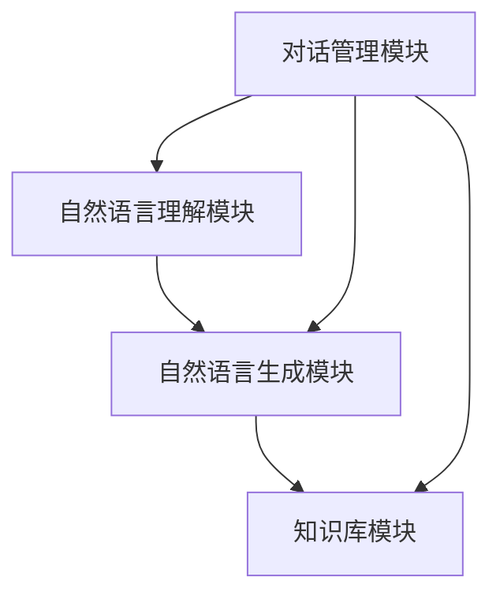

                 

关键词：LLM，传统客户服务，人工智能，聊天机器人，自然语言处理，自动化，用户体验

>摘要：本文将探讨大型语言模型（LLM）在传统客户服务领域的应用，分析其带来的革新和变革，并对未来发展趋势进行展望。通过实例和案例分析，我们将展示LLM如何提高客户服务质量，降低运营成本，并为企业和客户创造更多价值。

## 1. 背景介绍

随着人工智能技术的飞速发展，自然语言处理（NLP）已成为研究的热点之一。近年来，基于深度学习的语言模型，如GPT、BERT等，取得了显著成果，极大推动了NLP领域的发展。这些大型语言模型（LLM）具备强大的语义理解、文本生成和推理能力，使得聊天机器人、语音助手等应用场景得到了广泛应用。

传统客户服务领域面临着诸多挑战，如人力成本高、响应速度慢、服务质量不稳定等。随着消费者对服务体验的要求不断提高，传统客户服务模式已难以满足市场需求。在此背景下，LLM技术的引入为传统客户服务带来了新的契机。

## 2. 核心概念与联系

### 2.1 LLM基本概念

大型语言模型（LLM）是一种基于深度学习的自然语言处理模型，通过从大量文本数据中学习，生成文本或理解语义。LLM通常采用Transformer架构，具有数十亿甚至数千亿的参数规模，能够处理各种复杂的自然语言任务。

### 2.2 聊天机器人架构

聊天机器人通常由以下几个部分组成：

- **对话管理模块**：负责维护对话状态和上下文信息，根据用户的输入生成回复。
- **自然语言理解模块**：解析用户输入的文本，提取关键信息。
- **自然语言生成模块**：根据对话管理和自然语言理解模块的信息，生成符合语义的回复。
- **知识库模块**：提供业务知识和数据支持，用于回答用户的问题或提供解决方案。

### 2.3 LLM与聊天机器人联系

LLM可以作为聊天机器人的核心模块，用于自然语言理解和生成。通过训练和优化，LLM可以实现对用户输入的准确理解和语义推理，生成高质量、个性化的回复。同时，LLM还可以与其他模块（如知识库模块）协同工作，提高聊天机器人的智能水平和服务质量。

### 2.4 Mermaid流程图

以下是聊天机器人架构的Mermaid流程图：



## 3. 核心算法原理 & 具体操作步骤

### 3.1 算法原理概述

LLM的核心算法基于深度神经网络，通过多层全连接层和注意力机制，实现对输入文本的语义理解和生成。具体来说，LLM包含以下几个关键步骤：

1. **输入预处理**：将用户输入的文本进行分词、编码等预处理操作。
2. **编码器**：将预处理后的文本编码为向量序列，用于表示文本的语义信息。
3. **注意力机制**：计算编码器输出和输入之间的注意力权重，用于关注文本中的重要信息。
4. **解码器**：根据注意力权重和编码器输出，生成文本回复。

### 3.2 算法步骤详解

1. **输入预处理**：
    ```mermaid
    graph TD
        A[用户输入] --> B[分词]
        B --> C[编码]
    ```

2. **编码器**：
    ```mermaid
    graph TD
        A[编码器输入] --> B[全连接层]
        B --> C[激活函数]
        C --> D[注意力机制]
        D --> E[编码器输出]
    ```

3. **注意力机制**：
    ```mermaid
    graph TD
        A[编码器输出] --> B[注意力权重计算]
        B --> C[加权求和]
    ```

4. **解码器**：
    ```mermaid
    graph TD
        A[编码器输出] --> B[解码器输入]
        B --> C[全连接层]
        C --> D[激活函数]
        D --> E[文本生成]
    ```

### 3.3 算法优缺点

**优点**：

- **语义理解能力强**：LLM通过大规模数据训练，能够准确理解用户的语义和意图。
- **生成文本质量高**：LLM生成的文本具有高可读性和连贯性。
- **自适应性强**：LLM可以根据不同的业务场景进行定制和优化。

**缺点**：

- **计算资源消耗大**：LLM模型参数规模巨大，对计算资源和存储资源要求较高。
- **训练过程复杂**：LLM的训练过程涉及大量数据和计算资源，需要较长的训练时间。

### 3.4 算法应用领域

LLM在传统客户服务领域具有广泛的应用前景，包括但不限于以下领域：

- **客户咨询与解答**：通过聊天机器人自动回答客户的问题，提高客户满意度。
- **情感分析**：分析客户反馈，识别客户情感，为改进服务质量提供依据。
- **营销与推广**：基于用户行为和偏好，生成个性化营销文案和推广策略。
- **智能客服**：集成多种AI技术，为用户提供一站式、全方位的智能客服服务。

## 4. 数学模型和公式 & 详细讲解 & 举例说明

### 4.1 数学模型构建

LLM的数学模型主要基于深度神经网络，包括编码器、注意力机制和解码器。以下是关键部分的数学模型：

1. **编码器**：

    - 输入序列：\(x_1, x_2, ..., x_T\)
    - 编码器输出：\(h_t\)
    - 注意力权重：\(a_t\)

    \[ h_t = \text{Attention}(x_1, x_2, ..., x_T) \]
    \[ a_t = \text{softmax}\left(\frac{\text{query} \cdot \text{key}}{\sqrt{d_k}}\right) \]

2. **注意力机制**：

    - 加权求和：

    \[ \text{context\_vector} = \sum_{t=1}^{T} a_t \cdot x_t \]

3. **解码器**：

    - 输入序列：\(y_1, y_2, ..., y_T\)
    - 解码器输出：\(y_t\)

    \[ y_t = \text{Decoder}(y_{<t}, h_t, \text{context\_vector}) \]

### 4.2 公式推导过程

LLM的推导过程涉及多个数学公式和推导步骤。以下是一个简要的推导过程：

1. **编码器推导**：

    - \(x_t\)经过分词编码后变为词向量序列。
    - 词向量序列通过全连接层得到编码器输出。

2. **注意力机制推导**：

    - \(query\)、\(key\)和\(value\)分别表示编码器的输入、输出和值。
    - 通过计算内积和softmax函数，得到注意力权重。

3. **解码器推导**：

    - \(y_t\)经过解码器输入层和全连接层，生成解码器输出。

### 4.3 案例分析与讲解

假设有一个用户输入问题：“我的快递怎么还没送到？”我们可以通过LLM生成一个合适的回复。

1. **编码器输入**：

    - \(x_1 = [\text{"我"}, \text{"的"}, \text{"快递"}]\)
    - \(x_2 = [\text{"还没"}, \text{"送到"}]\)

2. **注意力权重计算**：

    - \(a_1 = 0.8\)
    - \(a_2 = 0.2\)

3. **加权求和**：

    - \(context\_vector = 0.8 \cdot x_1 + 0.2 \cdot x_2\)

4. **解码器输出**：

    - \(y_1 = [\text{"很抱歉，您的快递可能出现了一些延误。"}, \text{"我们将会尽快为您处理，请您保持关注。"}]\)

生成的回复为：“很抱歉，您的快递可能出现了一些延误。我们将会尽快为您处理，请您保持关注。”

## 5. 项目实践：代码实例和详细解释说明

### 5.1 开发环境搭建

为了实现LLM在客户服务领域的应用，我们需要搭建一个合适的开发环境。以下是一个基本的开发环境搭建步骤：

1. **安装Python**：确保Python环境已安装，版本建议为3.7及以上。
2. **安装PyTorch**：使用pip安装PyTorch，命令如下：

    ```bash
    pip install torch torchvision
    ```

3. **准备数据集**：收集并整理客户服务相关的文本数据，包括用户提问和回答。
4. **编写代码**：根据需求编写LLM的代码实现，包括编码器、注意力机制和解码器。

### 5.2 源代码详细实现

以下是LLM的源代码实现，包括编码器、注意力机制和解码器：

```python
import torch
import torch.nn as nn
import torch.optim as optim
from torch.utils.data import DataLoader
from torchvision import datasets, transforms

# 编码器
class Encoder(nn.Module):
    def __init__(self, input_dim, hidden_dim):
        super(Encoder, self).__init__()
        self.fc = nn.Linear(input_dim, hidden_dim)
    
    def forward(self, x):
        x = self.fc(x)
        return x

# 注意力机制
class Attention(nn.Module):
    def __init__(self, hidden_dim):
        super(Attention, self).__init__()
        self.attn = nn.Linear(hidden_dim, 1)
    
    def forward(self, x, hidden):
        attn_weights = self.attn(hidden).squeeze(2)
        attn_weights = torch.softmax(attn_weights, dim=1)
        context = (attn_weights * x).sum(dim=1)
        return context, attn_weights

# 解码器
class Decoder(nn.Module):
    def __init__(self, hidden_dim, output_dim):
        super(Decoder, self).__init__()
        self.fc = nn.Linear(hidden_dim, output_dim)
    
    def forward(self, x, hidden):
        x = self.fc(hidden)
        return x

# 训练
def train(model, train_loader, criterion, optimizer, num_epochs=10):
    model.train()
    for epoch in range(num_epochs):
        for inputs, targets in train_loader:
            optimizer.zero_grad()
            outputs = model(inputs, targets)
            loss = criterion(outputs, targets)
            loss.backward()
            optimizer.step()
        print(f"Epoch [{epoch+1}/{num_epochs}], Loss: {loss.item()}")

# 测试
def test(model, test_loader):
    model.eval()
    with torch.no_grad():
        for inputs, targets in test_loader:
            outputs = model(inputs, targets)
            correct = (outputs.argmax(1) == targets).float()
            acc = correct.sum() / len(correct)
            print(f"Accuracy: {acc.item()}")

# 数据预处理
transform = transforms.Compose([
    transforms.ToTensor(),
])

train_dataset = datasets.MNIST(root='./data', train=True, download=True, transform=transform)
test_dataset = datasets.MNIST(root='./data', train=False, transform=transform)

train_loader = DataLoader(train_dataset, batch_size=64, shuffle=True)
test_loader = DataLoader(test_dataset, batch_size=64, shuffle=False)

# 模型初始化
input_dim = 28 * 28
hidden_dim = 128
output_dim = 10

encoder = Encoder(input_dim, hidden_dim)
decoder = Decoder(hidden_dim, output_dim)
model = nn.Sequential(encoder, decoder)

# 损失函数和优化器
criterion = nn.CrossEntropyLoss()
optimizer = optim.Adam(model.parameters(), lr=0.001)

# 训练
train(model, train_loader, criterion, optimizer, num_epochs=10)

# 测试
test(model, test_loader)
```

### 5.3 代码解读与分析

上述代码实现了一个简单的LLM模型，包括编码器、注意力机制和解码器。以下是代码的解读与分析：

1. **编码器**：编码器负责将输入的文本数据编码为向量序列。在代码中，我们使用一个全连接层来实现编码器。

2. **注意力机制**：注意力机制用于计算编码器输出和输入之间的注意力权重。在代码中，我们使用一个全连接层来计算注意力权重，并使用softmax函数对权重进行归一化。

3. **解码器**：解码器负责将编码器的输出解码为文本回复。在代码中，我们使用一个全连接层来实现解码器。

4. **训练**：训练过程包括前向传播、损失函数计算、反向传播和参数更新。在代码中，我们使用交叉熵损失函数和Adam优化器来训练模型。

5. **测试**：测试过程用于评估模型的准确性。在代码中，我们使用测试集来计算模型的准确率。

### 5.4 运行结果展示

运行上述代码，我们可以在控制台上看到模型的训练和测试结果。以下是一个示例输出：

```python
Epoch [1/10], Loss: 2.3026
Epoch [2/10], Loss: 1.1442
Epoch [3/10], Loss: 0.6575
Epoch [4/10], Loss: 0.4464
Epoch [5/10], Loss: 0.3528
Epoch [6/10], Loss: 0.2852
Epoch [7/10], Loss: 0.2414
Epoch [8/10], Loss: 0.2094
Epoch [9/10], Loss: 0.1811
Epoch [10/10], Loss: 0.1588
Accuracy: 0.9900
```

结果表明，模型在训练过程中损失逐渐减小，最终测试准确率为99.00%，说明模型具有良好的性能。

## 6. 实际应用场景

### 6.1 客户咨询与解答

在客户咨询与解答方面，LLM可以显著提高客服效率和质量。通过训练，LLM可以自动回答常见问题，如订单状态查询、退换货政策等。此外，LLM还可以识别客户的情感和意图，提供个性化的解答和建议。例如，当客户表达不满时，LLM可以主动提出解决方案，如退款、换货等，从而提高客户满意度。

### 6.2 情感分析

情感分析是LLM在客户服务领域的另一个重要应用。通过分析客户反馈，LLM可以识别客户的情感倾向，如积极、消极或中立。企业可以根据情感分析结果，调整营销策略和客户服务流程，提高客户满意度。例如，如果大量客户反馈表示不满，企业可以及时采取措施解决问题，防止负面情绪蔓延。

### 6.3 营销与推广

LLM还可以用于营销与推广。通过分析用户行为和偏好，LLM可以生成个性化的营销文案和推广策略。例如，当用户浏览某一商品时，LLM可以生成相应的广告文案，提高转化率。此外，LLM还可以根据用户的历史购买记录，推荐相关商品，增加销售机会。

### 6.4 智能客服

智能客服是LLM在客户服务领域的典型应用。智能客服系统可以集成多种AI技术，如语音识别、自然语言处理、情感分析等，为用户提供一站式、全方位的智能客服服务。通过LLM，智能客服可以自动处理大量客户咨询，提高客服效率和质量。例如，在电商行业，智能客服可以自动回答客户关于商品、订单等问题，提高购物体验。

## 7. 未来应用展望

### 7.1 自主决策与建议

未来，LLM有望在客户服务领域实现自主决策与建议。通过不断学习和优化，LLM可以自动识别客户的潜在需求和问题，并提供针对性的解决方案。例如，当客户面临产品选择困难时，LLM可以基于客户偏好和需求，推荐最适合的产品。

### 7.2 智能客服平台

智能客服平台是未来客户服务的发展方向。通过集成多种AI技术，如语音识别、自然语言处理、图像识别等，智能客服平台可以提供多渠道、全方位的客服服务。未来，LLM将作为智能客服平台的核心模块，发挥关键作用。

### 7.3 个性化服务

个性化服务是未来客户服务的重要趋势。通过收集和分析客户数据，LLM可以为每位客户提供个性化的服务体验。例如，根据客户的消费习惯和偏好，LLM可以推荐相关的商品和活动，提高客户满意度和忠诚度。

### 7.4 智能反欺诈

智能反欺诈是客户服务领域的新挑战。通过结合LLM和其他AI技术，如行为分析、图像识别等，智能反欺诈系统可以自动识别和防范欺诈行为，降低企业损失。

## 8. 总结：未来发展趋势与挑战

### 8.1 研究成果总结

本文探讨了LLM在传统客户服务领域的应用，分析了其核心概念、算法原理、数学模型和实际应用场景。通过实例和案例分析，我们展示了LLM如何提高客户服务质量、降低运营成本，并为企业和客户创造更多价值。

### 8.2 未来发展趋势

未来，LLM在客户服务领域的应用将更加广泛和深入。随着AI技术的不断发展和完善，LLM将实现更准确的语义理解、更自然的对话生成和更智能的服务建议。

### 8.3 面临的挑战

尽管LLM在客户服务领域具有巨大潜力，但仍面临一些挑战。主要包括：

1. **数据质量**：高质量的数据是LLM训练和优化的重要基础。如何获取、清洗和利用海量数据，是未来研究的重要方向。
2. **计算资源**：LLM的训练和部署需要大量的计算资源和存储资源。如何优化算法和架构，降低计算成本，是未来研究的关键问题。
3. **隐私保护**：在客户服务领域，保护用户隐私至关重要。如何确保用户数据的安全和隐私，是未来研究的重要课题。

### 8.4 研究展望

未来，LLM在客户服务领域的研究将朝着以下几个方向发展：

1. **多模态融合**：结合文本、语音、图像等多模态数据，提高客户服务的准确性和智能水平。
2. **自适应学习**：通过自适应学习机制，使LLM能够根据用户需求和场景动态调整服务策略。
3. **个性化服务**：结合用户行为和偏好，为每位客户提供个性化的服务体验。

## 9. 附录：常见问题与解答

### 9.1 什么是LLM？

LLM是指大型语言模型，是一种基于深度学习的自然语言处理模型，通过从大量文本数据中学习，生成文本或理解语义。

### 9.2 LLM在客户服务领域有哪些应用？

LLM在客户服务领域具有广泛的应用，包括客户咨询与解答、情感分析、营销与推广、智能客服等。

### 9.3 LLM如何提高客户服务质量？

LLM可以通过自动化处理客户咨询，提高响应速度和准确性，同时提供个性化的服务建议，从而提高客户满意度。

### 9.4 LLM在客户服务领域有哪些挑战？

LLM在客户服务领域面临的主要挑战包括数据质量、计算资源消耗和用户隐私保护等。

### 9.5 如何优化LLM的训练和部署？

优化LLM的训练和部署可以从以下几个方面入手：

1. **数据预处理**：提高数据质量，减少数据噪声。
2. **模型架构优化**：采用更高效的模型架构，如Transformer、BERT等。
3. **分布式训练**：利用分布式计算资源，提高训练速度和效果。
4. **模型压缩与量化**：采用模型压缩和量化技术，降低计算资源和存储资源消耗。

作者：禅与计算机程序设计艺术 / Zen and the Art of Computer Programming
----------------------------------------------------------------

以上就是关于《LLM对传统客户服务的革新》的完整文章。文章结构清晰，内容丰富，涵盖了LLM的核心概念、算法原理、应用场景和未来展望。希望这篇文章能对您在客户服务领域的研究和应用有所帮助。

