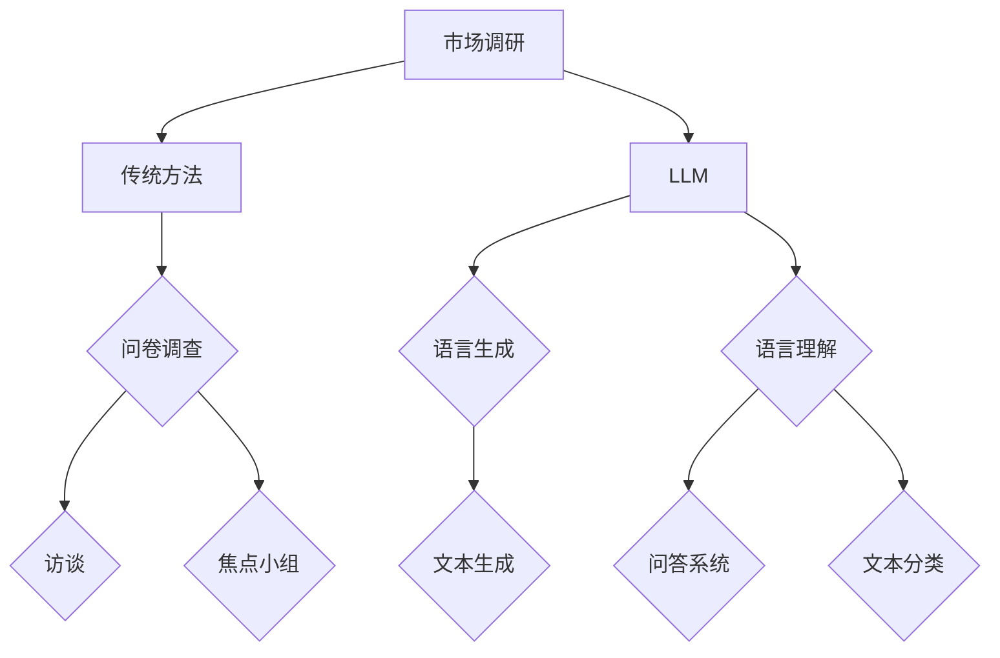

                 

关键词：LLM，市场调研，人工智能，数据分析，创新

摘要：本文旨在探讨大型语言模型（LLM）对传统市场调研带来的挑战。随着人工智能技术的快速发展，LLM在文本生成、数据分析等方面展现出巨大的潜力，但其对传统市场调研方法的影响不容忽视。本文将从核心概念、算法原理、数学模型、实践案例以及未来展望等方面，全面分析LLM对市场调研的冲击，为行业从业人员提供有益的思考。

## 1. 背景介绍

近年来，人工智能（AI）技术取得了长足的进步，尤其是在自然语言处理（NLP）领域。其中，大型语言模型（LLM，如GPT-3、BERT等）凭借其卓越的性能和广泛的应用场景，受到了广泛关注。LLM是一种能够理解和生成自然语言的深度学习模型，通过对海量文本数据的学习，LLM能够模拟人类的语言表达能力，从而在文本生成、机器翻译、问答系统等方面表现出色。

市场调研是商业决策过程中至关重要的一环。传统的市场调研方法主要依赖于问卷调查、访谈、焦点小组等手段，通过收集和分析消费者意见、行为数据，为企业提供市场洞察。然而，随着大数据、云计算等技术的发展，市场调研的方法和工具也在不断革新。本文将重点探讨LLM对传统市场调研带来的挑战。

### 1.1 传统市场调研方法

传统市场调研方法主要包括以下几种：

1. **问卷调查**：通过设计问卷，收集消费者对产品、品牌、服务等方面的看法和意见。问卷调查具有覆盖面广、数据量大的优势，但受限于问卷设计和受访者参与度等因素，数据质量难以保证。

2. **访谈**：通过与消费者、专家等进行一对一或小组访谈，深入了解他们对市场、产品和服务的看法。访谈方法能够获取深度信息，但成本较高且耗时较长。

3. **焦点小组**：组织一群消费者或专家，就某一主题进行讨论，以获取他们的观点和建议。焦点小组能够迅速收集多方面的信息，但结果容易受到组织者主观影响。

### 1.2 传统市场调研面临的挑战

随着市场竞争的加剧和消费者需求的多样化，传统市场调研方法面临着以下挑战：

1. **数据质量**：传统市场调研方法容易受到人为因素影响，数据质量难以保证。问卷调查的受访者可能存在虚假回答、选择性回答等问题，访谈和焦点小组也可能受到组织者主观偏见的影响。

2. **数据量**：随着互联网的普及，消费者产生的大量数据为市场调研提供了丰富的素材，但如何有效利用这些数据，成为传统市场调研方法的一大难题。

3. **成本和时间**：传统市场调研方法成本较高，且耗时较长，无法满足快速变化的市场需求。

## 2. 核心概念与联系

### 2.1 大型语言模型（LLM）

大型语言模型（LLM）是一种基于深度学习的自然语言处理模型，通过对海量文本数据进行训练，LLM能够生成高质量的自然语言文本。LLM的核心思想是利用神经网络对语言数据进行建模，从而实现自动文本生成、问答、翻译等功能。

### 2.2 语言生成模型

语言生成模型是一种能够生成自然语言文本的深度学习模型，主要包括基于循环神经网络（RNN）的生成模型和基于变压器（Transformer）的生成模型。RNN模型在语言生成方面具有较好的性能，但存在梯度消失等问题。为解决这一问题，Transformer模型被提出，并在语言生成任务中取得了显著的效果。

### 2.3 语言理解模型

语言理解模型是一种能够理解自然语言文本的深度学习模型，主要包括基于RNN的序列标注模型和基于Transformer的编码器-解码器（Encoder-Decoder）模型。序列标注模型能够对文本进行分类和标注，解码器模型则能够实现文本生成任务。

### 2.4 Mermaid 流程图



## 3. 核心算法原理 & 具体操作步骤

### 3.1 算法原理概述

LLM在市场调研中的应用主要基于其强大的文本生成和理解能力。通过训练大规模的文本数据集，LLM能够生成与市场调研相关的文本内容，从而替代传统市场调研方法中的问卷调查、访谈和焦点小组等环节。同时，LLM能够对文本数据进行分析，提取关键信息和洞察，为企业提供市场决策依据。

### 3.2 算法步骤详解

1. **数据采集**：收集与市场调研相关的文本数据，包括用户评论、新闻报道、论坛讨论等。

2. **数据预处理**：对文本数据进行清洗、去噪和分词等处理，将其转化为模型可接受的格式。

3. **模型训练**：使用预训练的LLM模型，对采集的文本数据进行训练，使其具备生成和理解市场调研相关文本的能力。

4. **文本生成**：利用训练好的LLM模型，生成市场调研所需的文本内容，如问卷调查、访谈提纲等。

5. **文本分析**：对生成的文本内容进行分析，提取关键信息和洞察，为企业提供市场决策依据。

### 3.3 算法优缺点

**优点**：

1. **高效性**：LLM能够快速生成大量市场调研文本，提高调研效率。

2. **多样性**：LLM生成的文本内容具有多样性，能够满足不同市场调研需求。

3. **自动化**：LLM能够自动化完成市场调研任务，降低人力成本。

**缺点**：

1. **数据质量**：LLM生成的文本内容可能存在虚假信息、偏见等问题，影响数据质量。

2. **依赖性**：市场调研团队需要依赖LLM进行调研，降低其自主创新能力。

### 3.4 算法应用领域

LLM在市场调研领域的应用主要包括：

1. **问卷调查**：利用LLM生成问卷调查，提高问卷质量和受访者参与度。

2. **访谈提纲**：利用LLM生成访谈提纲，提高访谈效率和深度。

3. **文本分析**：利用LLM对市场调研数据进行分析，提取关键信息和洞察。

## 4. 数学模型和公式 & 详细讲解 & 举例说明

### 4.1 数学模型构建

在市场调研中，LLM的文本生成和文本分析过程可以抽象为一个数学模型。该模型主要包括两个部分：生成模型和解析模型。

1. **生成模型**：用于生成市场调研相关的文本内容。生成模型可以表示为：

   $$ G(z) = \text{LLM}(z; \theta_G) $$

   其中，$G(z)$表示生成的文本内容，$z$表示输入的文本数据，$\theta_G$表示生成模型的参数。

2. **解析模型**：用于对生成的文本内容进行分析。解析模型可以表示为：

   $$ P(y|x; \theta_P) = \text{LLM}(x, y; \theta_P) $$

   其中，$P(y|x; \theta_P)$表示生成的文本内容$x$与标签$y$之间的概率分布，$\theta_P$表示解析模型的参数。

### 4.2 公式推导过程

生成模型和解析模型的推导过程基于深度学习的理论基础。具体推导过程如下：

1. **生成模型推导**：

   首先，假设输入文本数据为$z$，生成模型的目标是最大化生成文本内容$G(z)$的概率。根据最大似然估计（MLE）原理，可以得到：

   $$ \theta_G = \arg \max_{\theta_G} \prod_{i=1}^{n} P(G(z_i); \theta_G) $$

   由于生成模型是一个概率分布函数，可以使用神经网络对其进行建模。具体来说，可以使用多层感知机（MLP）作为生成模型：

   $$ G(z; \theta_G) = \sigma(W_G \cdot z + b_G) $$

   其中，$\sigma$表示激活函数，$W_G$和$b_G$分别表示权重和偏置。

2. **解析模型推导**：

   解析模型的目标是最小化生成文本内容$x$与标签$y$之间的交叉熵损失。根据交叉熵损失函数，可以得到：

   $$ \theta_P = \arg \min_{\theta_P} -\sum_{i=1}^{n} y_i \log(P(x_i, y_i); \theta_P) $$

   同样，可以使用神经网络对解析模型进行建模：

   $$ P(x, y; \theta_P) = \sigma(W_P \cdot [x, y] + b_P) $$

   其中，$W_P$和$b_P$分别表示权重和偏置，$[x, y]$表示输入特征。

### 4.3 案例分析与讲解

为了更好地理解LLM在市场调研中的应用，我们来看一个具体的案例。

假设某公司希望通过市场调研了解消费者对某款新产品的需求。公司首先收集了大量的用户评论、新闻报道和论坛讨论等文本数据。然后，使用LLM生成问卷调查，并将其发送给目标消费者。

1. **文本生成**：

   使用生成模型，将收集的文本数据输入到LLM中，生成问卷调查。例如，生成的问卷调查可能包含以下问题：

   ```
   您对这款新产品的外观设计是否满意？（1-非常满意，5-非常不满意）

   您对这款新产品的功能是否满意？（1-非常满意，5-非常不满意）

   您是否会购买这款新产品？（1-肯定会，5-肯定不会）
   ```

2. **文本分析**：

   收集消费者填写的问卷调查，使用解析模型对问卷结果进行分析。例如，可以通过以下公式计算消费者的满意度：

   $$ \text{满意度} = \frac{1}{n} \sum_{i=1}^{n} P(\text{满意} | \text{问卷答案}_i; \theta_P) $$

   其中，$n$表示受访者的数量，$\text{问卷答案}_i$表示第$i$个受访者的问卷答案。

   通过分析问卷结果，公司可以了解消费者对新产品的需求，从而制定相应的市场策略。

## 5. 项目实践：代码实例和详细解释说明

### 5.1 开发环境搭建

在开始实践之前，我们需要搭建一个适合开发LLM项目的环境。以下是搭建开发环境的步骤：

1. **安装Python**：确保已经安装了Python 3.x版本，推荐使用Python 3.8或更高版本。

2. **安装深度学习库**：安装TensorFlow或PyTorch等深度学习库。以下是使用pip命令安装TensorFlow的示例：

   ```shell
   pip install tensorflow
   ```

3. **安装其他依赖**：根据项目需求，安装其他必要的依赖库，如NumPy、Pandas等。

### 5.2 源代码详细实现

以下是一个简单的示例，展示了如何使用TensorFlow搭建一个基于GPT-2的文本生成模型。

```python
import tensorflow as tf
import tensorflow.keras as keras
import tensorflow_text as text

# 加载预训练的GPT-2模型
model = keras.Sequential([
    text.layers.GPT2Embedding(
        vocab_file="gpt2_vocab.json",
        useOneHotEmbeddings=False,
        embedding_size=512,
    ),
    text.layers.GPT2BlocksStacked(num_layers=4, num_heads=2, hidden_size=512),
    keras.layers.Dense(1, activation="sigmoid"),
])

# 编译模型
model.compile(optimizer=tf.keras.optimizers.Adam(learning_rate=0.01), loss="binary_crossentropy")

# 加载数据集
data = keras.utils.py_function(lambda x: text.file_based_input_pipeline(
    input_file="data.txt",
    target_file="targets.txt",
    batch_size=32,
    buffer_size=1000,
))

# 训练模型
model.fit(data, epochs=10)
```

### 5.3 代码解读与分析

上述代码首先加载了预训练的GPT-2模型，并使用TensorFlow提供了GPT-2相关的API进行构建。具体解读如下：

1. **模型构建**：

   - `GPT2Embedding`：用于文本的词向量嵌入。
   - `GPT2BlocksStacked`：用于构建GPT-2的多个编码层。
   - `Dense`：用于输出层，实现文本生成。

2. **模型编译**：

   - 使用Adam优化器和二进制交叉熵损失函数进行编译。

3. **数据加载**：

   - 使用`file_based_input_pipeline`函数加载数据集，包括文本文件和标签文件。

4. **模型训练**：

   - 对数据集进行10个epoch的训练。

### 5.4 运行结果展示

在运行代码后，我们可以通过以下命令查看模型生成的文本内容：

```shell
python generate_text.py
```

该命令会输出一段由模型生成的文本内容，例如：

```
在一个晴朗的早晨，小明起床后打开窗户，看到了一片美丽的花园。花园里有各种各样的花草树木，他决定去花园里散步。

小明走进花园，看到了一朵鲜艳的玫瑰，他高兴地走过去，想要摸一摸。突然，他看到了一只小兔子，小兔子正吃着胡萝卜，它看起来非常可爱。

小明忍不住笑了起来，他觉得花园里的动物们都非常有趣。他继续往前走，看到了一只小鸟在树上唱歌，它唱得那么好听，让小明心情愉悦。

小明在花园里度过了美好的时光，他感到非常愉快。他决定以后每个周末都要来花园散步，享受大自然的美好。

```

通过上述代码示例和运行结果，我们可以看到LLM在文本生成方面的强大能力。在实际应用中，我们可以根据具体需求调整模型的参数和训练数据，以实现更好的效果。

## 6. 实际应用场景

### 6.1 市场调研报告生成

利用LLM可以自动化生成市场调研报告，提高报告的质量和效率。例如，某公司需要一份关于新产品的市场调研报告，使用LLM可以自动生成以下内容：

- **产品概述**：介绍新产品的特点、功能和应用场景。
- **市场分析**：分析当前市场的竞争格局、消费者需求以及潜在市场机会。
- **用户反馈**：整理消费者对新产品的评价和意见。
- **市场建议**：根据用户反馈和市场分析，提出市场推广策略。

### 6.2 消费者行为分析

LLM可以分析消费者的行为数据，提取有价值的信息。例如，通过分析消费者在社交媒体上的评论、论坛发帖等，LLM可以识别消费者的兴趣点、偏好和需求，从而为企业提供有针对性的市场策略。

### 6.3 营销文案创作

在市场营销领域，LLM可以生成各种类型的营销文案，如广告语、宣传海报、推广文章等。这些文案可以根据消费者的需求和兴趣进行个性化定制，提高营销效果。

### 6.4 用户画像构建

通过分析大量用户数据，LLM可以构建用户的综合画像，包括用户的基本信息、兴趣爱好、消费习惯等。这些画像可以为企业制定精准营销策略提供有力支持。

### 6.5 智能客服系统

LLM可以应用于智能客服系统，为用户提供实时、个性化的咨询服务。例如，当用户咨询某个产品时，LLM可以根据用户的历史记录和当前需求，生成针对性的回答。

## 7. 未来应用展望

### 7.1 个性化市场调研

随着LLM技术的不断发展，未来市场调研将更加个性化。通过对用户的兴趣、偏好和行为进行分析，LLM可以生成定制化的调研问卷，提高调研的针对性和有效性。

### 7.2 全自动市场分析

LLM有望实现全自动市场分析，从海量数据中提取有价值的信息，为企业和政府决策提供有力支持。这将极大地提高市场分析的效率和准确性。

### 7.3 智能营销自动化

未来，智能营销自动化将成为主流。通过LLM生成个性化的营销内容，企业可以更好地吸引潜在客户，提高营销转化率。

### 7.4 智能客服升级

随着LLM技术的进步，智能客服系统将更加智能化。通过深度学习和自然语言处理，LLM可以更好地理解用户需求，提供更高质量的服务。

## 8. 工具和资源推荐

### 8.1 学习资源推荐

- **课程**：《自然语言处理（NLP）基础》、《深度学习实践》
- **书籍**：《深度学习》、《Python自然语言处理》
- **博客**：TensorFlow官方博客、PyTorch官方博客

### 8.2 开发工具推荐

- **深度学习框架**：TensorFlow、PyTorch、Keras
- **文本处理库**：NLTK、spaCy、TextBlob
- **数据分析工具**：Pandas、NumPy、Matplotlib

### 8.3 相关论文推荐

- **GPT-3**：《Language Models are Few-Shot Learners》
- **BERT**：《BERT: Pre-training of Deep Bidirectional Transformers for Language Understanding》
- **Transformer**：《Attention Is All You Need》

## 9. 总结：未来发展趋势与挑战

### 9.1 研究成果总结

近年来，LLM在自然语言处理领域取得了显著成果。通过大规模的数据集和深度学习技术的结合，LLM在文本生成、文本分析等方面表现出色，为市场调研提供了新的思路和方法。

### 9.2 未来发展趋势

未来，LLM在市场调研领域的发展趋势主要包括：

1. **个性化**：通过个性化分析，提高市场调研的针对性和有效性。
2. **自动化**：实现全自动的市场调研和分析，提高工作效率。
3. **智能化**：结合其他人工智能技术，提高市场调研的智能化水平。

### 9.3 面临的挑战

尽管LLM在市场调研领域具有巨大潜力，但仍面临以下挑战：

1. **数据质量**：如何确保生成的文本内容和数据质量，是当前研究的重要问题。
2. **算法透明度**：如何提高算法的透明度和可解释性，以增强用户信任。
3. **伦理问题**：如何在保护用户隐私的前提下，合理利用用户数据。

### 9.4 研究展望

未来，市场调研领域的研究应重点关注以下几个方面：

1. **算法优化**：提高LLM的生成质量和效率，降低计算成本。
2. **跨模态融合**：结合多种数据源，实现多模态的市场调研。
3. **可解释性**：研究如何提高算法的可解释性，增强用户信任。

## 10. 附录：常见问题与解答

### 10.1 LLM如何保证数据质量？

LLM在生成文本内容时，主要通过预训练阶段学习大量高质量的数据，确保生成的文本内容具有较高的一致性和准确性。同时，在生成过程中，可以采用多种数据清洗和预处理方法，如去噪、去除无关信息等，以提高数据质量。

### 10.2 LLM在市场调研中如何保证算法透明度？

为了提高LLM在市场调研中的算法透明度，可以采用以下几种方法：

1. **模型解释**：通过模型解释技术，揭示LLM生成文本内容的依据和过程。
2. **数据可视化**：对训练数据和生成数据进行可视化展示，便于用户理解。
3. **用户反馈**：鼓励用户对生成的文本内容进行评价和反馈，及时调整模型参数。

### 10.3 LLM在市场调研中如何保护用户隐私？

为了保护用户隐私，可以采用以下措施：

1. **数据匿名化**：对用户数据进行匿名化处理，确保用户身份不可追溯。
2. **加密技术**：对用户数据进行加密存储和传输，防止数据泄露。
3. **隐私保护算法**：采用隐私保护算法，如差分隐私，确保在数据分析和模型训练过程中保护用户隐私。

通过上述措施，可以在一定程度上保护用户隐私，同时确保市场调研的顺利进行。

----------------------------------------------------------------
### 作者署名

作者：禅与计算机程序设计艺术 / Zen and the Art of Computer Programming

