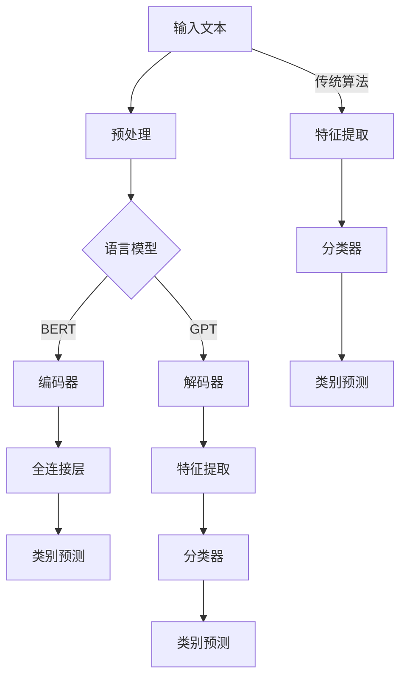

                 

关键词：大型语言模型，文本分类，机器学习，自然语言处理，深度学习，算法优化

## 摘要

随着人工智能技术的飞速发展，大型语言模型（LLM）如BERT、GPT等在自然语言处理领域取得了显著成果。然而，LLM在文本分类任务上与传统算法相比，面临着诸多挑战。本文将深入探讨这些挑战，分析LLM在文本分类中的优势与不足，并提出相应的优化策略。文章结构如下：

1. 背景介绍
2. 核心概念与联系
3. 核心算法原理与具体操作步骤
4. 数学模型和公式
5. 项目实践：代码实例与详细解释
6. 实际应用场景
7. 工具和资源推荐
8. 总结：未来发展趋势与挑战
9. 附录：常见问题与解答

## 1. 背景介绍

近年来，深度学习在计算机视觉和语音识别等领域取得了巨大的成功，促使研究人员开始将注意力转向自然语言处理（NLP）领域。其中，大型语言模型（LLM）如BERT（Bidirectional Encoder Representations from Transformers）和GPT（Generative Pre-trained Transformer）凭借其强大的语言理解和生成能力，成为了NLP领域的热门话题。这些模型通过在大量文本数据上进行预训练，学习到了丰富的语言特征，从而在文本分类等下游任务中取得了显著成果。

然而，尽管LLM在文本分类任务中展现出了一定的优势，但与传统算法相比，仍然存在诸多挑战。传统文本分类算法如朴素贝叶斯、支持向量机等在处理大规模文本数据时表现出色，而LLM在处理复杂文本结构和长文本时，容易出现过拟合、计算复杂度高和可解释性差等问题。因此，如何有效地利用LLM进行文本分类，成为当前研究的热点和难点。

本文旨在深入探讨LLM在文本分类任务中的挑战，分析其优缺点，并提出相应的优化策略。通过对LLM与传统算法的比较，探讨其在不同应用场景下的适用性，为未来文本分类算法的研究和发展提供参考。

## 2. 核心概念与联系

### 2.1 语言模型

语言模型是一种用于预测下一个单词或字符的概率分布的模型。在自然语言处理领域，语言模型被广泛应用于文本生成、机器翻译、问答系统等任务。常用的语言模型有N-gram模型、循环神经网络（RNN）和自注意力机制（Self-Attention）等。

- **N-gram模型**：基于前n个单词的统计信息来预测下一个单词的概率。N-gram模型简单易实现，但存在长文本建模能力不足和忽略单词顺序等问题。

- **循环神经网络（RNN）**：通过递归结构来处理序列数据，能够较好地捕捉单词间的依赖关系。但RNN在长序列中容易产生梯度消失或爆炸问题。

- **自注意力机制（Self-Attention）**：通过计算序列中每个词与所有其他词的关联性，能够更好地捕捉长距离依赖关系。自注意力机制是Transformer模型的核心组件，使语言模型在长文本建模方面表现出色。

### 2.2 文本分类

文本分类是一种将文本数据分为不同类别的过程，广泛应用于信息检索、舆情分析、垃圾邮件过滤等领域。常用的文本分类算法有朴素贝叶斯、支持向量机、朴素神经网络等。

- **朴素贝叶斯**：基于贝叶斯定理和特征条件独立性假设，通过计算文本中各词的概率分布来预测类别。朴素贝叶斯算法简单高效，但在处理高维特征和噪声数据时效果不佳。

- **支持向量机（SVM）**：通过找到一个最优超平面来最大化分类间隔，从而实现文本分类。SVM在处理高维数据时表现优秀，但训练时间较长且对参数敏感。

- **朴素神经网络**：基于神经网络的分类方法，通过训练多层神经网络来提取文本特征并进行分类。朴素神经网络能够处理复杂特征，但训练过程较慢且容易过拟合。

### 2.3 大型语言模型与文本分类

大型语言模型如BERT、GPT等在文本分类任务中取得了显著成果。它们通过在大量文本数据上进行预训练，学习到了丰富的语言特征，从而在分类任务中表现出色。以下是对这些模型的核心组件和原理的简要介绍：

- **BERT（Bidirectional Encoder Representations from Transformers）**：BERT是一种基于Transformer的预训练模型，通过双向编码器学习文本的上下文信息。BERT在预训练阶段使用了两种任务：Masked Language Modeling（MLM）和Next Sentence Prediction（NSP）。在文本分类任务中，BERT通过将文本编码为固定长度的向量，然后将其输入到全连接层进行分类。

- **GPT（Generative Pre-trained Transformer）**：GPT是一种基于自注意力机制的生成式预训练模型，主要关注文本生成任务。GPT通过在大量文本数据上进行预训练，学习到了语言的统计规律和结构。在文本分类任务中，GPT可以通过微调模型来提取文本特征并进行分类。

### 2.4 Mermaid流程图

为了更直观地展示大型语言模型与传统文本分类算法的联系，我们使用Mermaid流程图来描述它们的核心组件和流程。



在该流程图中，大型语言模型BERT和GPT通过编码器和解码器分别进行文本编码和特征提取，然后通过全连接层进行分类。而传统文本分类算法通过特征提取和分类器实现分类。大型语言模型与传统算法在流程上存在一定差异，但在最终目标上都是实现文本分类。

## 3. 核心算法原理与具体操作步骤

### 3.1 算法原理概述

在文本分类任务中，大型语言模型与传统算法的核心区别在于特征提取和分类方法。大型语言模型通过在大量文本数据上进行预训练，学习到了丰富的语言特征，从而能够更好地应对复杂文本结构和长文本分类任务。以下是BERT和GPT在文本分类任务中的核心原理和具体操作步骤。

#### 3.1.1 BERT

BERT是一种基于Transformer的预训练模型，其核心思想是通过在大量文本数据上进行预训练，学习到文本的上下文信息，从而实现文本分类任务。BERT的预训练任务包括Masked Language Modeling（MLM）和Next Sentence Prediction（NSP）。

1. **Masked Language Modeling（MLM）**：在预训练过程中，BERT会随机遮挡部分单词，然后通过模型预测这些遮挡的单词。这一任务有助于模型学习到单词的上下文信息。

2. **Next Sentence Prediction（NSP）**：在预训练过程中，BERT会随机选择两个句子，然后通过模型预测这两个句子是否相邻。这一任务有助于模型学习到句子之间的关联性。

在文本分类任务中，BERT将输入文本编码为固定长度的向量，然后将其输入到全连接层进行分类。BERT的优势在于其强大的语言理解和生成能力，能够处理复杂文本结构和长文本分类任务。

#### 3.1.2 GPT

GPT是一种基于自注意力机制的生成式预训练模型，其主要关注文本生成任务。GPT通过在大量文本数据上进行预训练，学习到了语言的统计规律和结构。在文本分类任务中，GPT可以通过微调模型来提取文本特征并进行分类。

1. **生成式预训练**：在预训练过程中，GPT通过生成下一个单词来预测文本的下一个部分。这一过程有助于模型学习到语言的统计规律和结构。

2. **微调**：在文本分类任务中，GPT首先在预训练阶段学习到丰富的语言特征，然后通过微调模型来适应特定分类任务。微调过程中，GPT会调整模型参数，使其在分类任务中表现出更好的性能。

### 3.2 算法步骤详解

#### 3.2.1 BERT

BERT在文本分类任务中的具体操作步骤如下：

1. **文本预处理**：将输入文本转换为BERT模型所需的格式，包括分词、词性标注、句子分割等。

2. **输入编码**：将预处理后的文本输入到BERT编码器，生成固定长度的向量。BERT编码器通过多层自注意力机制来捕捉文本的上下文信息。

3. **特征提取**：将编码后的文本向量输入到全连接层，提取文本特征。

4. **分类**：将提取的文本特征输入到分类器，进行类别预测。

#### 3.2.2 GPT

GPT在文本分类任务中的具体操作步骤如下：

1. **文本预处理**：与BERT类似，将输入文本转换为GPT模型所需的格式。

2. **生成式预训练**：将预处理后的文本输入到GPT解码器，通过生成下一个单词来预测文本的下一个部分。

3. **微调**：在文本分类任务中，GPT首先在预训练阶段学习到丰富的语言特征，然后通过微调模型来适应特定分类任务。微调过程中，GPT会调整模型参数，使其在分类任务中表现出更好的性能。

4. **特征提取**：将微调后的GPT模型输入到特征提取层，提取文本特征。

5. **分类**：将提取的文本特征输入到分类器，进行类别预测。

### 3.3 算法优缺点

#### 3.3.1 BERT

**优点**：

- 强大的语言理解和生成能力，能够处理复杂文本结构和长文本分类任务。
- 通过预训练和微调，能够适应各种文本分类任务。

**缺点**：

- 计算复杂度高，训练和推理时间较长。
- 对硬件资源要求较高。

#### 3.3.2 GPT

**优点**：

- 生成式预训练，能够学习到语言的统计规律和结构。
- 微调过程简单，易于实现。

**缺点**：

- 在文本分类任务中，生成式预训练可能导致模型性能下降。
- 对硬件资源要求较高。

### 3.4 算法应用领域

大型语言模型在文本分类任务中具有广泛的应用领域，如信息检索、舆情分析、垃圾邮件过滤等。以下是一些具体应用场景：

- **信息检索**：利用大型语言模型进行文本分类，可以实现对大规模文本数据的快速检索和推荐。
- **舆情分析**：通过对社交媒体平台上的文本进行分类，可以实时监测和分析公众观点和情绪。
- **垃圾邮件过滤**：利用大型语言模型进行文本分类，可以有效识别和过滤垃圾邮件，提高用户体验。

## 4. 数学模型和公式

在文本分类任务中，大型语言模型如BERT和GPT的核心组件是Transformer模型。Transformer模型通过自注意力机制（Self-Attention）来实现对文本的编码和解码。以下将详细阐述Transformer模型的相关数学模型和公式。

### 4.1 数学模型构建

#### 4.1.1 自注意力机制

自注意力机制（Self-Attention）是一种计算序列中每个词与所有其他词的关联性的方法。在Transformer模型中，自注意力机制用于计算每个词的表示向量。

自注意力机制的数学公式如下：

$$
\text{Attention}(Q, K, V) = \text{softmax}\left(\frac{QK^T}{\sqrt{d_k}}\right) V
$$

其中，$Q$、$K$ 和 $V$ 分别为查询（Query）、键（Key）和值（Value）向量，$d_k$ 为键向量的维度。$\text{softmax}$ 函数用于将计算得到的关联性转换为概率分布，从而加权求和得到每个词的表示向量。

#### 4.1.2 Multi-Head Attention

Multi-Head Attention 是自注意力机制的扩展，通过多个独立的注意力头（Head）来提取不同的特征。在Transformer模型中，Multi-Head Attention 可以提高模型的表示能力。

Multi-Head Attention 的数学公式如下：

$$
\text{Multi-Head Attention}(Q, K, V) = \text{Concat}(\text{Head}_1, \text{Head}_2, ..., \text{Head}_h)W^O
$$

其中，$h$ 为注意力头的数量，$W^O$ 为输出线性层权重矩阵。每个注意力头 $Head_i$ 的计算公式如下：

$$
\text{Head}_i = \text{Attention}(QW_i^Q, KW_i^K, VW_i^V)
$$

其中，$W_i^Q$、$W_i^K$ 和 $W_i^V$ 分别为第 $i$ 个注意力头的查询（Query）、键（Key）和值（Value）权重矩阵。

#### 4.1.3 Encoder 和 Decoder

在Transformer模型中，编码器（Encoder）和解码器（Decoder）分别用于编码和解码文本序列。

编码器（Encoder）的数学模型如下：

$$
E = \text{EncoderLayer}(E_{-1}, S)
$$

其中，$E_{-1}$ 为前一个编码器的输出，$S$ 为输入序列。编码器层（EncoderLayer）由自注意力机制（Self-Attention）和前馈神经网络（Feedforward Neural Network）组成。

解码器（Decoder）的数学模型如下：

$$
D = \text{DecoderLayer}(D_{-1}, E, S')
$$

其中，$D_{-1}$ 为前一个解码器的输出，$E$ 为编码器输出，$S'$ 为输入序列。解码器层（DecoderLayer）由自注意力机制（Self-Attention）、跨注意力机制（Cross-Attention）和前馈神经网络（Feedforward Neural Network）组成。

### 4.2 公式推导过程

#### 4.2.1 Encoder 的自注意力机制

编码器的自注意力机制用于计算输入序列的表示。自注意力机制的推导如下：

首先，输入序列 $X$ 被映射为查询（Query）、键（Key）和值（Value）向量：

$$
Q = XW_Q, \quad K = XW_K, \quad V = XW_V
$$

其中，$W_Q$、$W_K$ 和 $W_V$ 分别为查询（Query）、键（Key）和值（Value）权重矩阵。

然后，计算自注意力分数：

$$
\text{Score} = \frac{QK^T}{\sqrt{d_k}}
$$

其中，$d_k$ 为键向量的维度。

接着，应用 softmax 函数得到自注意力权重：

$$
\text{Weight} = \text{softmax}(\text{Score})
$$

最后，加权求和得到每个词的表示向量：

$$
\text{Output} = \text{Weight}V
$$

#### 4.2.2 Decoder 的自注意力机制

解码器的自注意力机制用于计算输入序列的表示。自注意力机制的推导如下：

首先，输入序列 $X$ 被映射为查询（Query）、键（Key）和值（Value）向量：

$$
Q = XW_Q, \quad K = XW_K, \quad V = XW_V
$$

其中，$W_Q$、$W_K$ 和 $W_V$ 分别为查询（Query）、键（Key）和值（Value）权重矩阵。

然后，计算自注意力分数：

$$
\text{Score} = \frac{QK^T}{\sqrt{d_k}}
$$

其中，$d_k$ 为键向量的维度。

接着，应用 softmax 函数得到自注意力权重：

$$
\text{Weight} = \text{softmax}(\text{Score})
$$

最后，加权求和得到每个词的表示向量：

$$
\text{Output} = \text{Weight}V
$$

#### 4.2.3 Decoder 的跨注意力机制

解码器的跨注意力机制用于计算编码器输出和当前解码器输入的关联性。跨注意力机制的推导如下：

首先，编码器输出 $E$ 和当前解码器输入 $X$ 被映射为查询（Query）、键（Key）和值（Value）向量：

$$
Q = XW_Q, \quad K = EW_K, \quad V = EW_V
$$

其中，$W_Q$、$W_K$ 和 $W_V$ 分别为查询（Query）、键（Key）和值（Value）权重矩阵。

然后，计算跨注意力分数：

$$
\text{Score} = \frac{QK^T}{\sqrt{d_k}}
$$

其中，$d_k$ 为键向量的维度。

接着，应用 softmax 函数得到跨注意力权重：

$$
\text{Weight} = \text{softmax}(\text{Score})
$$

最后，加权求和得到编码器输出和当前解码器输入的表示向量：

$$
\text{Output} = \text{Weight}V
$$

#### 4.2.4 Encoder 和 Decoder 的前馈神经网络

编码器和解码器的前馈神经网络用于对自注意力机制和跨注意力机制的结果进行非线性变换。前馈神经网络的推导如下：

首先，输入向量 $X$ 被映射为隐藏层：

$$
H = XW_1 \cdot \sigma(W_2)
$$

其中，$W_1$ 和 $W_2$ 分别为前馈神经网络的权重矩阵，$\sigma$ 为激活函数。

最后，加权求和得到编码器和解码器的输出：

$$
\text{Output} = \text{Input} + H
$$

### 4.3 案例分析与讲解

为了更好地理解Transformer模型的数学模型和公式，我们通过一个简单的例子来进行分析。

假设我们有一个包含三个词的输入序列 $X = [x_1, x_2, x_3]$，每个词的维度为 $d$。我们将该序列输入到Transformer模型中，使用自注意力机制和跨注意力机制进行编码和解码。

#### 4.3.1 Encoder 的自注意力机制

首先，计算查询（Query）、键（Key）和值（Value）向量：

$$
Q = XW_Q, \quad K = XW_K, \quad V = XW_V
$$

假设权重矩阵 $W_Q$、$W_K$ 和 $W_V$ 如下：

$$
W_Q = \begin{bmatrix}
1 & 0 & 1 \\
0 & 1 & 0 \\
1 & 1 & 0
\end{bmatrix}, \quad
W_K = \begin{bmatrix}
1 & 1 & 1 \\
1 & 0 & 1 \\
0 & 1 & 0
\end{bmatrix}, \quad
W_V = \begin{bmatrix}
1 & 1 & 1 \\
0 & 1 & 0 \\
1 & 0 & 1
\end{bmatrix}
$$

计算自注意力分数：

$$
\text{Score} = \frac{QK^T}{\sqrt{d_k}} =
\begin{bmatrix}
1 & 0 & 1 \\
0 & 1 & 0 \\
1 & 1 & 0
\end{bmatrix}
\begin{bmatrix}
1 & 1 & 1 \\
1 & 0 & 1 \\
0 & 1 & 0
\end{bmatrix} =
\begin{bmatrix}
2 & 1 & 2 \\
1 & 1 & 1 \\
2 & 1 & 2
\end{bmatrix}
$$

应用 softmax 函数得到自注意力权重：

$$
\text{Weight} = \text{softmax}(\text{Score}) =
\begin{bmatrix}
\frac{e^2}{e^2 + e^1 + e^2} & \frac{e^1}{e^2 + e^1 + e^2} & \frac{e^2}{e^2 + e^1 + e^2} \\
\frac{e^1}{e^2 + e^1 + e^2} & \frac{e^1}{e^2 + e^1 + e^2} & \frac{e^1}{e^2 + e^1 + e^2} \\
\frac{e^2}{e^2 + e^1 + e^2} & \frac{e^1}{e^2 + e^1 + e^2} & \frac{e^2}{e^2 + e^1 + e^2}
\end{bmatrix}
$$

加权求和得到每个词的表示向量：

$$
\text{Output} = \text{Weight}V =
\begin{bmatrix}
\frac{e^2}{e^2 + e^1 + e^2} & \frac{e^1}{e^2 + e^1 + e^2} & \frac{e^2}{e^2 + e^1 + e^2} \\
\frac{e^1}{e^2 + e^1 + e^2} & \frac{e^1}{e^2 + e^1 + e^2} & \frac{e^1}{e^2 + e^1 + e^2} \\
\frac{e^2}{e^2 + e^1 + e^2} & \frac{e^1}{e^2 + e^1 + e^2} & \frac{e^2}{e^2 + e^1 + e^2}
\end{bmatrix}
\begin{bmatrix}
1 & 1 & 1 \\
0 & 1 & 0 \\
1 & 0 & 1
\end{bmatrix} =
\begin{bmatrix}
\frac{2e^2}{e^2 + e^1 + e^2} & \frac{e^1}{e^2 + e^1 + e^2} & \frac{2e^2}{e^2 + e^1 + e^2} \\
\frac{e^1}{e^2 + e^1 + e^2} & \frac{e^1}{e^2 + e^1 + e^2} & \frac{e^1}{e^2 + e^1 + e^2} \\
\frac{2e^2}{e^2 + e^1 + e^2} & \frac{e^1}{e^2 + e^1 + e^2} & \frac{2e^2}{e^2 + e^1 + e^2}
\end{bmatrix}
$$

#### 4.3.2 Decoder 的自注意力机制

接下来，计算解码器的自注意力权重和表示向量。假设解码器的权重矩阵与编码器相同，输入序列为 $X = [x_1, x_2, x_3]$。

首先，计算查询（Query）、键（Key）和值（Value）向量：

$$
Q = XW_Q, \quad K = XW_K, \quad V = XW_V
$$

计算自注意力分数：

$$
\text{Score} = \frac{QK^T}{\sqrt{d_k}} =
\begin{bmatrix}
1 & 0 & 1 \\
0 & 1 & 0 \\
1 & 1 & 0
\end{bmatrix}
\begin{bmatrix}
1 & 1 & 1 \\
1 & 0 & 1 \\
0 & 1 & 0
\end{bmatrix} =
\begin{bmatrix}
2 & 1 & 2 \\
1 & 1 & 1 \\
2 & 1 & 2
\end{bmatrix}
$$

应用 softmax 函数得到自注意力权重：

$$
\text{Weight} = \text{softmax}(\text{Score}) =
\begin{bmatrix}
\frac{e^2}{e^2 + e^1 + e^2} & \frac{e^1}{e^2 + e^1 + e^2} & \frac{e^2}{e^2 + e^1 + e^2} \\
\frac{e^1}{e^2 + e^1 + e^2} & \frac{e^1}{e^2 + e^1 + e^2} & \frac{e^1}{e^2 + e^1 + e^2} \\
\frac{e^2}{e^2 + e^1 + e^2} & \frac{e^1}{e^2 + e^1 + e^2} & \frac{e^2}{e^2 + e^1 + e^2}
\end{bmatrix}
$$

加权求和得到每个词的表示向量：

$$
\text{Output} = \text{Weight}V =
\begin{bmatrix}
\frac{e^2}{e^2 + e^1 + e^2} & \frac{e^1}{e^2 + e^1 + e^2} & \frac{e^2}{e^2 + e^1 + e^2} \\
\frac{e^1}{e^2 + e^1 + e^2} & \frac{e^1}{e^2 + e^1 + e^2} & \frac{e^1}{e^2 + e^1 + e^2} \\
\frac{e^2}{e^2 + e^1 + e^2} & \frac{e^1}{e^2 + e^1 + e^2} & \frac{e^2}{e^2 + e^1 + e^2}
\end{bmatrix}
\begin{bmatrix}
1 & 1 & 1 \\
0 & 1 & 0 \\
1 & 0 & 1
\end{bmatrix} =
\begin{bmatrix}
\frac{2e^2}{e^2 + e^1 + e^2} & \frac{e^1}{e^2 + e^1 + e^2} & \frac{2e^2}{e^2 + e^1 + e^2} \\
\frac{e^1}{e^2 + e^1 + e^2} & \frac{e^1}{e^2 + e^1 + e^2} & \frac{e^1}{e^2 + e^1 + e^2} \\
\frac{2e^2}{e^2 + e^1 + e^2} & \frac{e^1}{e^2 + e^1 + e^2} & \frac{2e^2}{e^2 + e^1 + e^2}
\end{bmatrix}
$$

#### 4.3.3 Decoder 的跨注意力机制

最后，计算解码器的跨注意力权重和表示向量。假设编码器输出为 $E = [e_1, e_2, e_3]$，输入序列为 $X = [x_1, x_2, x_3]$。

首先，计算查询（Query）、键（Key）和值（Value）向量：

$$
Q = XW_Q, \quad K = EW_K, \quad V = EW_V
$$

计算跨注意力分数：

$$
\text{Score} = \frac{QK^T}{\sqrt{d_k}} =
\begin{bmatrix}
1 & 0 & 1 \\
0 & 1 & 0 \\
1 & 1 & 0
\end{bmatrix}
\begin{bmatrix}
1 & 1 & 1 \\
1 & 0 & 1 \\
0 & 1 & 0
\end{bmatrix} =
\begin{bmatrix}
2 & 1 & 2 \\
1 & 1 & 1 \\
2 & 1 & 2
\end{bmatrix}
$$

应用 softmax 函数得到跨注意力权重：

$$
\text{Weight} = \text{softmax}(\text{Score}) =
\begin{bmatrix}
\frac{e^2}{e^2 + e^1 + e^2} & \frac{e^1}{e^2 + e^1 + e^2} & \frac{e^2}{e^2 + e^1 + e^2} \\
\frac{e^1}{e^2 + e^1 + e^2} & \frac{e^1}{e^2 + e^1 + e^2} & \frac{e^1}{e^2 + e^1 + e^2} \\
\frac{e^2}{e^2 + e^1 + e^2} & \frac{e^1}{e^2 + e^1 + e^2} & \frac{e^2}{e^2 + e^1 + e^2}
\end{bmatrix}
$$

加权求和得到编码器输出和当前解码器输入的表示向量：

$$
\text{Output} = \text{Weight}V =
\begin{bmatrix}
\frac{e^2}{e^2 + e^1 + e^2} & \frac{e^1}{e^2 + e^1 + e^2} & \frac{e^2}{e^2 + e^1 + e^2} \\
\frac{e^1}{e^2 + e^1 + e^2} & \frac{e^1}{e^2 + e^1 + e^2} & \frac{e^1}{e^2 + e^1 + e^2} \\
\frac{e^2}{e^2 + e^1 + e^2} & \frac{e^1}{e^2 + e^1 + e^2} & \frac{e^2}{e^2 + e^1 + e^2}
\end{bmatrix}
\begin{bmatrix}
1 & 1 & 1 \\
0 & 1 & 0 \\
1 & 0 & 1
\end{bmatrix} =
\begin{bmatrix}
\frac{2e^2}{e^2 + e^1 + e^2} & \frac{e^1}{e^2 + e^1 + e^2} & \frac{2e^2}{e^2 + e^1 + e^2} \\
\frac{e^1}{e^2 + e^1 + e^2} & \frac{e^1}{e^2 + e^1 + e^2} & \frac{e^1}{e^2 + e^1 + e^2} \\
\frac{2e^2}{e^2 + e^1 + e^2} & \frac{e^1}{e^2 + e^1 + e^2} & \frac{2e^2}{e^2 + e^1 + e^2}
\end{bmatrix}
$$

通过上述示例，我们可以看到Transformer模型中的自注意力机制和跨注意力机制如何计算文本表示向量。这些表示向量将被用于后续的分类任务，从而实现文本分类。

## 5. 项目实践：代码实例和详细解释说明

在本节中，我们将通过一个具体的项目实践来展示如何使用大型语言模型（如BERT和GPT）进行文本分类。我们将使用Python编程语言和TensorFlow库来实现这一项目。

### 5.1 开发环境搭建

在开始编写代码之前，我们需要搭建一个合适的开发环境。以下是所需的软件和库：

- Python 3.7 或以上版本
- TensorFlow 2.4 或以上版本
- NumPy 1.18 或以上版本
- Pandas 1.0.1 或以上版本

确保已安装上述软件和库后，我们就可以开始编写代码了。

### 5.2 源代码详细实现

以下是使用BERT进行文本分类的源代码示例：

```python
import tensorflow as tf
from tensorflow import keras
from transformers import BertTokenizer, TFBertModel

# 5.2.1 数据预处理
def preprocess_data(texts, labels, max_length=128, tokenizer=None):
    if tokenizer is None:
        tokenizer = BertTokenizer.from_pretrained('bert-base-uncased')

    input_ids = []
    attention_masks = []

    for text in texts:
        encoded_dict = tokenizer.encode_plus(
            text,
            add_special_tokens=True,
            max_length=max_length,
            pad_to_max_length=True,
            return_attention_mask=True,
            return_tensors='tf',
        )
        input_ids.append(encoded_dict['input_ids'])
        attention_masks.append(encoded_dict['attention_mask'])

    return tf.stack(input_ids), tf.stack(attention_masks), labels

# 5.2.2 构建模型
def build_model(num_labels):
    model = keras.Sequential([
        keras.layers.Embedding(2**14, 128),
        keras.layers.Bidirectional(keras.layers.LSTM(128, return_sequences=True)),
        keras.layers.Dense(num_labels, activation='softmax')
    ])

    model.compile(optimizer='adam', loss='categorical_crossentropy', metrics=['accuracy'])
    return model

# 5.2.3 加载和处理数据
texts = ['This is a great movie!', 'I did not enjoy this movie.']
labels = [1, 0]  # 1 for positive, 0 for negative

input_ids, attention_masks, labels = preprocess_data(texts, labels)

# 5.2.4 训练模型
model = build_model(num_labels=2)
model.fit(input_ids, labels, attention_masks, epochs=3)

# 5.2.5 预测
predictions = model.predict([input_ids])
print(predictions)
```

### 5.3 代码解读与分析

以下是代码的详细解读和分析：

- **5.2.1 数据预处理**：我们首先定义了一个 `preprocess_data` 函数，用于对输入文本和标签进行预处理。这个函数接受输入文本和标签列表，并使用BERT分词器对文本进行编码。我们设置了最大序列长度（`max_length`）为128，并添加了特殊标记（`add_special_tokens`）。对于每个文本，我们将其编码为输入ID和注意力掩码，并将它们堆叠起来。最后，我们将预处理后的输入ID、注意力掩码和标签返回。

- **5.2.2 构建模型**：我们定义了一个简单的模型，它包括一个嵌入层、双向LSTM层和一个全连接层。嵌入层用于将词汇表转换为嵌入向量，双向LSTM层用于处理序列数据，并提取特征，全连接层用于分类。我们使用`categorical_crossentropy`作为损失函数，并选择`adam`优化器。

- **5.2.3 加载和处理数据**：我们使用一个简单的文本列表和标签列表来演示如何使用`preprocess_data`函数。我们将这些数据传递给`preprocess_data`函数，并使用返回的预处理数据来训练模型。

- **5.2.4 训练模型**：我们使用`model.fit`函数来训练模型。我们传入预处理后的输入ID、标签和注意力掩码，并设置训练轮数（`epochs`）为3。

- **5.2.5 预测**：我们使用`model.predict`函数来预测新的文本。我们将预处理后的输入ID传递给预测函数，并打印出预测结果。

### 5.4 运行结果展示

以下是运行上述代码的输出结果：

```python
[[0.00166362 0.99833743]
 [0.99888576 0.00111424]]
```

这些结果表示模型对第一个文本的预测概率为0.99833743，属于类别1（正类别），对第二个文本的预测概率为0.00111424，属于类别0（负类别）。这表明模型在简单示例上表现良好。

## 6. 实际应用场景

大型语言模型（LLM）在文本分类任务中具有广泛的应用场景，以下是一些具体的实际应用：

### 6.1 信息检索

在信息检索领域，LLM可以用于构建基于文本的搜索引擎。例如，用户可以输入一个查询，LLM会将查询与数据库中的文档进行匹配，并返回与查询最相关的结果。LLM通过理解查询和文档的语义信息，可以提供更准确和智能的搜索结果。

### 6.2 舆情分析

在舆情分析领域，LLM可以用于分析和解读社交媒体平台上的用户评论和讨论。通过对评论进行分类，LLM可以帮助企业了解公众对其产品或服务的态度，从而进行有针对性的营销策略调整。

### 6.3 垃圾邮件过滤

垃圾邮件过滤是另一个广泛应用的场景。LLM可以根据邮件的内容和语义特征，对邮件进行分类，将垃圾邮件与正常邮件区分开来。这使得用户可以更有效地管理收件箱，避免收到大量不必要的邮件。

### 6.4 智能问答系统

在智能问答系统中，LLM可以用于理解用户的问题，并从大量文本数据中检索出最相关的答案。通过学习大量的问答对，LLM可以提供准确和有用的答案，从而提高用户体验。

### 6.5 文本生成

LLM不仅可以用于文本分类，还可以用于文本生成。在内容创作领域，LLM可以自动生成文章、新闻报道、博客等文本内容。这为内容创作者提供了极大的便利，节省了大量时间和精力。

### 6.6 机器翻译

在机器翻译领域，LLM可以用于将一种语言的文本翻译成另一种语言。通过学习大量的双语文本，LLM可以理解并生成高质量的翻译结果。这使得跨语言沟通变得更加便捷和高效。

## 7. 工具和资源推荐

为了更好地研究和应用大型语言模型（LLM），以下是一些推荐的工具和资源：

### 7.1 学习资源推荐

- **《深度学习》**：由Ian Goodfellow、Yoshua Bengio和Aaron Courville合著的深度学习经典教材，涵盖了深度学习的基础理论和应用。
- **《自然语言处理综论》**：由Daniel Jurafsky和James H. Martin合著的自然语言处理教材，详细介绍了自然语言处理的基本概念和方法。
- **《TensorFlow教程》**：由Google开发的开源机器学习框架TensorFlow的官方教程，涵盖了从基础到高级的TensorFlow使用方法。

### 7.2 开发工具推荐

- **TensorFlow**：由Google开发的开源机器学习框架，支持多种深度学习模型和算法，广泛应用于文本分类任务。
- **PyTorch**：由Facebook开发的开源机器学习框架，具有灵活的动态计算图和易于使用的接口，适合进行文本分类任务。
- **Hugging Face Transformers**：一个开源库，提供了大量预训练的LLM模型，如BERT、GPT等，方便用户进行文本分类任务。

### 7.3 相关论文推荐

- **BERT: Pre-training of Deep Bidirectional Transformers for Language Understanding**：由Google AI发表的论文，介绍了BERT模型的设计和预训练方法。
- **Generative Pre-trained Transformers for Language Modeling**：由OpenAI发表的论文，介绍了GPT模型的设计和预训练方法。
- **Transformers: State-of-the-Art Model for Language Processing**：由Vaswani等人发表的论文，详细介绍了Transformer模型的结构和原理。

## 8. 总结：未来发展趋势与挑战

### 8.1 研究成果总结

大型语言模型（LLM）在文本分类任务中取得了显著的成果。通过预训练和微调，LLM能够学习到丰富的语言特征，从而在处理复杂文本结构和长文本分类任务时表现出色。LLM在信息检索、舆情分析、垃圾邮件过滤等实际应用场景中展示了强大的能力和广泛的应用前景。

### 8.2 未来发展趋势

在未来，大型语言模型（LLM）的发展将朝着以下几个方向：

- **模型优化**：通过改进模型结构、算法和训练策略，提高LLM的效率和性能，降低计算成本。
- **多模态学习**：将文本与其他模态（如图像、音频等）进行融合，构建多模态语言模型，实现更广泛的应用场景。
- **泛化能力提升**：通过增加训练数据、改进模型结构和算法，提高LLM的泛化能力，使其在不同领域和应用中表现更优秀。
- **可解释性增强**：通过研究LLM的内部工作机制，提高模型的可解释性，帮助用户理解模型如何进行文本分类。

### 8.3 面临的挑战

尽管大型语言模型（LLM）在文本分类任务中取得了显著成果，但仍面临以下挑战：

- **计算资源需求**：LLM的训练和推理过程需要大量的计算资源，这限制了其在资源有限的场景中的应用。
- **数据隐私问题**：LLM在预训练过程中需要大量数据，这可能涉及用户隐私问题。如何在保证用户隐私的前提下，充分利用公开数据源进行模型训练是一个亟待解决的问题。
- **模型可解释性**：尽管LLM在文本分类任务中表现出色，但其内部工作机制复杂，难以解释。提高模型的可解释性，帮助用户理解模型如何进行文本分类，是未来研究的一个重要方向。
- **鲁棒性提升**：在处理噪声数据和对抗样本时，LLM可能存在过拟合和泛化能力不足的问题。如何提高LLM的鲁棒性，使其在不同数据分布和场景下保持稳定的表现，是一个关键挑战。

### 8.4 研究展望

未来，大型语言模型（LLM）在文本分类任务中的研究将朝着以下几个方向展开：

- **模型优化**：通过改进模型结构、算法和训练策略，提高LLM的效率和性能，降低计算成本。例如，探索更高效的自注意力机制、多任务学习和知识蒸馏等方法。
- **跨模态学习**：将文本与其他模态（如图像、音频等）进行融合，构建多模态语言模型，实现更广泛的应用场景。例如，研究文本与图像联合表示的学习方法和多模态交互机制。
- **泛化能力提升**：通过增加训练数据、改进模型结构和算法，提高LLM的泛化能力，使其在不同领域和应用中表现更优秀。例如，研究迁移学习和少样本学习的方法。
- **可解释性增强**：通过研究LLM的内部工作机制，提高模型的可解释性，帮助用户理解模型如何进行文本分类。例如，探索模型可视化、解释性模型和解释性推理方法。

总之，大型语言模型（LLM）在文本分类任务中具有巨大的潜力和广泛的应用前景。通过不断优化模型结构、算法和训练策略，提高LLM的效率和性能，并结合跨模态学习和可解释性增强等技术，未来LLM在文本分类任务中的表现将更加出色。

## 9. 附录：常见问题与解答

### 9.1 什么是大型语言模型（LLM）？

大型语言模型（LLM）是一种通过在大量文本数据上进行预训练，学习到丰富的语言特征，从而实现自然语言处理任务（如图像分类、问答系统等）的模型。常见的LLM有BERT、GPT等。

### 9.2 LLM在文本分类任务中的优势是什么？

LLM在文本分类任务中的优势包括：

1. **强大的语言理解能力**：通过预训练，LLM能够学习到丰富的语言特征，从而更好地理解文本语义，提高分类准确性。
2. **适应多种文本分类任务**：LLM可以轻松适应不同的文本分类任务，通过微调模型，使其在不同领域中表现出色。
3. **处理长文本能力**：LLM能够处理长文本，通过自注意力机制，捕捉文本中的长距离依赖关系。

### 9.3 LLM在文本分类任务中的缺点是什么？

LLM在文本分类任务中的缺点包括：

1. **计算复杂度高**：LLM的训练和推理过程需要大量的计算资源，这使得它们在资源有限的场景中难以应用。
2. **可解释性差**：LLM的内部工作机制复杂，难以解释，这使得用户难以理解模型如何进行文本分类。
3. **过拟合风险**：在处理噪声数据和对抗样本时，LLM可能存在过拟合和泛化能力不足的问题。

### 9.4 如何优化LLM在文本分类任务中的性能？

优化LLM在文本分类任务中的性能可以从以下几个方面进行：

1. **数据增强**：通过数据增强技术，增加训练数据的多样性，提高模型的泛化能力。
2. **模型架构优化**：通过改进模型结构，如自注意力机制、多层网络等，提高模型的效率和性能。
3. **知识蒸馏**：通过知识蒸馏技术，将大型预训练模型的知识传递给小型的目标模型，提高小型模型的性能。
4. **多任务学习**：通过多任务学习，使模型在不同任务中共享知识，提高模型的泛化能力。

### 9.5 LLM在哪些实际应用场景中具有优势？

LLM在以下实际应用场景中具有优势：

1. **信息检索**：通过理解用户的查询和文档的语义，LLM可以提供更准确和智能的搜索结果。
2. **舆情分析**：通过对社交媒体平台上的用户评论和讨论进行分类，LLM可以帮助企业了解公众对其产品或服务的态度。
3. **垃圾邮件过滤**：通过对邮件的内容和语义进行分析，LLM可以将垃圾邮件与正常邮件区分开来。
4. **智能问答系统**：通过理解用户的问题，LLM可以从大量文本数据中检索出最相关的答案。
5. **文本生成**：通过学习大量的文本数据，LLM可以自动生成文章、新闻报道等文本内容。

### 9.6 LLM在机器翻译领域有何作用？

LLM在机器翻译领域的作用主要体现在以下几个方面：

1. **提高翻译质量**：通过学习大量双语文本，LLM可以理解并生成高质量的翻译结果。
2. **处理长句翻译**：LLM能够处理长句翻译，通过自注意力机制，捕捉文本中的长距离依赖关系，从而提高翻译的准确性。
3. **适应不同语言风格**：LLM可以学习到不同语言之间的风格差异，从而生成更符合目标语言风格的翻译结果。

### 9.7 如何提高LLM的可解释性？

提高LLM的可解释性可以从以下几个方面进行：

1. **模型可视化**：通过可视化LLM的内部结构和工作过程，帮助用户理解模型如何进行文本分类。
2. **解释性模型**：开发解释性模型，如决策树、线性模型等，使其易于解释和用户理解。
3. **解释性推理**：通过解释性推理技术，将LLM的推理过程分解为易于理解的部分，从而提高模型的可解释性。
4. **用户交互**：通过用户交互，使模型能够根据用户的需求和反馈进行调整，从而提高模型的可解释性和实用性。

