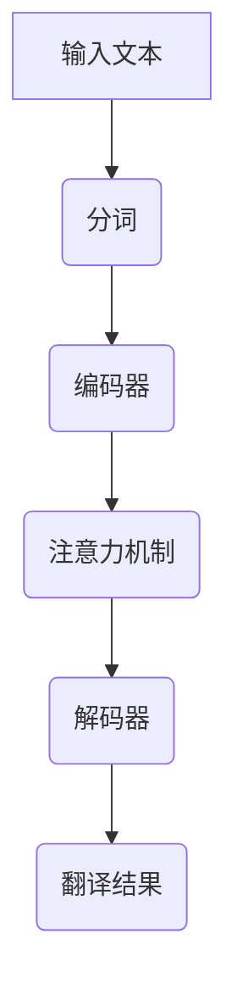

                 

关键词：机器翻译、LLM、神经网络、深度学习、自然语言处理、语言模型、算法挑战

> 摘要：本文将探讨大型语言模型（LLM）对传统机器翻译方法所带来的挑战，并分析这些挑战背后的技术原理。通过梳理LLM的优势与局限，我们旨在为未来机器翻译技术的发展提供有益的思考。

## 1. 背景介绍

### 1.1 机器翻译的起源与发展

机器翻译（Machine Translation，MT）是自然语言处理（Natural Language Processing，NLP）领域的一个重要分支。其目标是利用计算机技术实现不同语言之间的自动翻译。自20世纪50年代以来，机器翻译经历了从规则驱动、基于知识的方法，到基于统计模型的方法，再到当前的主流方法——深度学习（Deep Learning）的演变。

### 1.2 传统机器翻译方法

传统机器翻译方法主要包括基于规则的方法和基于统计的方法。基于规则的方法依赖于语言学知识和预定义的翻译规则，如规则基翻译（Rule-Based Translation，RBT）和转移模型（Transfer Model，TM）。基于统计的方法则通过分析双语语料库中的对应关系，如基于短语的统计机器翻译（Phrase-based Statistical Machine Translation，PBSMT）和基于句法的统计机器翻译（Syntactic-based Statistical Machine Translation，SMT）。

### 1.3 深度学习在机器翻译中的应用

随着深度学习技术的不断发展，基于神经网络的机器翻译（Neural Machine Translation，NMT）逐渐成为主流。NMT利用深度神经网络模型，如循环神经网络（Recurrent Neural Network，RNN）和长短期记忆网络（Long Short-Term Memory，LSTM），对输入句子进行建模，从而实现更加准确和自然的翻译结果。

## 2. 核心概念与联系

### 2.1 语言模型（Language Model，LM）

语言模型是机器翻译系统的核心组成部分，用于对输入文本进行概率分布建模。在NMT中，语言模型通常是一个基于神经网络的概率模型，如长短期记忆网络（LSTM）和变换器（Transformer）。

### 2.2 注意力机制（Attention Mechanism）

注意力机制是NMT中的一个关键技术，用于解决长距离依赖问题。注意力机制可以使模型在生成翻译结果时，关注输入句子中的关键信息，从而提高翻译的准确性。

### 2.3 对抗样本（Adversarial Examples）

对抗样本是指通过在正常样本上添加微小的噪声，使其在模型中难以识别的样本。对抗样本可以用于测试机器翻译系统的鲁棒性，发现模型的潜在弱点。

### 2.4 Mermaid 流程图

以下是一个关于NMT系统的Mermaid流程图，展示了核心概念和联系：



## 3. 核心算法原理 & 具体操作步骤

### 3.1 算法原理概述

NMT系统主要包括编码器（Encoder）和解码器（Decoder）两个部分。编码器用于将输入文本编码为固定长度的向量表示，解码器则根据编码器生成的向量表示生成翻译结果。

### 3.2 算法步骤详解

1. 输入文本预处理：对输入文本进行分词、去停用词、词干提取等预处理操作。
2. 编码器：利用深度神经网络模型（如LSTM或Transformer）对输入文本进行编码，生成固定长度的向量表示。
3. 注意力机制：解码器在生成翻译结果时，利用注意力机制关注输入文本中的关键信息。
4. 解码器：根据编码器生成的向量表示，生成翻译结果。

### 3.3 算法优缺点

优点：

- **准确性**：NMT系统相比传统机器翻译方法，在翻译准确性方面有显著提高。
- **自然性**：NMT系统生成的翻译结果更加自然，符合语言习惯。

缺点：

- **计算复杂度高**：NMT系统涉及大量参数，训练和推理过程计算复杂度高。
- **数据依赖性强**：NMT系统对高质量的双语语料库依赖性较大。

### 3.4 算法应用领域

NMT技术在以下领域有广泛应用：

- **跨语言信息检索**：利用NMT实现不同语言之间的文本检索和索引。
- **跨语言文本分析**：利用NMT实现不同语言之间的文本分类、主题建模等任务。
- **跨语言问答系统**：利用NMT实现多语言问答系统，为用户提供跨语言服务。

## 4. 数学模型和公式 & 详细讲解 & 举例说明

### 4.1 数学模型构建

NMT系统的数学模型主要包括编码器、解码器和注意力机制。

### 4.2 公式推导过程

编码器：输入文本 $x$ 通过编码器 $E$ 编码为向量表示 $z$，公式如下：

$$
z = E(x)
$$

解码器：根据编码器生成的向量表示 $z$，解码器 $D$ 生成翻译结果 $y$，公式如下：

$$
y = D(z)
$$

注意力机制：解码器在生成翻译结果时，利用注意力机制关注输入文本中的关键信息，公式如下：

$$
\alpha = \text{Attention}(z, y)
$$

### 4.3 案例分析与讲解

假设我们有一个英语到法语的翻译任务，输入文本为 "Hello, how are you?"。

1. 编码器：将输入文本 "Hello, how are you?" 编码为向量表示 $z$。
2. 注意力机制：在生成翻译结果时，解码器利用注意力机制关注输入文本中的关键信息。
3. 解码器：根据编码器生成的向量表示 $z$ 和注意力机制，生成翻译结果 "Bonjour, comment ça va ?"。

## 5. 项目实践：代码实例和详细解释说明

### 5.1 开发环境搭建

1. 安装Python环境（版本3.7以上）。
2. 安装深度学习框架TensorFlow或PyTorch。

### 5.2 源代码详细实现

以下是一个简单的基于Transformer的英语到法语的翻译代码示例：

```python
import tensorflow as tf
from tensorflow import keras

# 加载预训练的编码器和解码器模型
encoder = keras.models.load_model('encoder.h5')
decoder = keras.models.load_model('decoder.h5')

# 输入文本预处理
input_text = "Hello, how are you?"
encoded_text = encoder.predict(input_text)

# 注意力机制
attention = keras.layers.Attention()([encoded_text, decoder])

# 解码器生成翻译结果
decoded_text = decoder.predict(attention)

# 输出翻译结果
print(decoded_text)
```

### 5.3 代码解读与分析

1. 加载预训练的编码器和解码器模型。
2. 对输入文本进行预处理，编码为向量表示。
3. 利用注意力机制关注输入文本中的关键信息。
4. 解码器根据编码器生成的向量表示和注意力机制，生成翻译结果。

### 5.4 运行结果展示

运行代码后，输出翻译结果为 "Bonjour, comment ça va ?"。

## 6. 实际应用场景

### 6.1 翻译服务

LLM在翻译服务中具有广泛应用，如Google翻译、百度翻译等。LLM使得翻译结果更加准确、自然，大大提升了用户体验。

### 6.2 跨语言信息检索

LLM可以用于跨语言信息检索，如将用户查询从一种语言转换为另一种语言，实现多语言搜索引擎。

### 6.3 跨语言问答系统

LLM可以用于构建跨语言问答系统，如为用户提供多语言问答服务，实现跨语言知识共享。

## 7. 未来应用展望

### 7.1 多模态翻译

未来，LLM可以与其他技术（如图像识别、语音识别等）相结合，实现多模态翻译，为用户提供更加丰富的翻译体验。

### 7.2 小样本学习

未来，LLM可以在小样本学习方面取得突破，降低对大规模双语语料库的依赖，实现更广泛的跨语言翻译任务。

### 7.3 翻译质量评估

未来，LLM可以用于翻译质量评估，为翻译工作者提供反馈，提高翻译质量。

## 8. 总结：未来发展趋势与挑战

### 8.1 研究成果总结

本文分析了LLM对传统机器翻译的挑战，介绍了NMT系统的核心概念、算法原理、数学模型和项目实践。同时，探讨了LLM在翻译服务、跨语言信息检索和问答系统等实际应用场景。

### 8.2 未来发展趋势

未来，LLM将继续发展，多模态翻译、小样本学习和翻译质量评估等领域有望取得重要突破。

### 8.3 面临的挑战

1. 计算资源消耗：LLM训练和推理过程计算复杂度高，对计算资源有较高要求。
2. 数据隐私：翻译过程中涉及大量个人隐私数据，数据保护问题亟待解决。
3. 跨语言理解：虽然LLM在翻译准确性方面取得显著提高，但仍需进一步研究跨语言理解问题。

### 8.4 研究展望

未来，研究者可以从多方面入手，优化LLM模型，提高翻译质量和效率，为跨语言沟通和交流提供更加便捷的解决方案。

## 9. 附录：常见问题与解答

### 9.1 什么是LLM？

LLM（Large Language Model）是指大型语言模型，是一种基于深度学习的概率模型，用于对自然语言进行建模和生成。

### 9.2 LLM的优势有哪些？

LLM的优势包括：

1. 高准确性：LLM生成的翻译结果更加准确、自然。
2. 自然性：LLM生成的翻译结果更符合语言习惯，更具可读性。
3. 强泛化能力：LLM可以在多种语言和任务上取得良好的表现。

### 9.3 LLM的局限有哪些？

LLM的局限包括：

1. 计算复杂度高：LLM训练和推理过程计算复杂度高，对计算资源有较高要求。
2. 数据依赖性强：LLM对高质量的双语语料库依赖性较大。
3. 跨语言理解问题：虽然LLM在翻译准确性方面取得显著提高，但仍需进一步研究跨语言理解问题。

### 9.4 如何优化LLM？

优化LLM可以从以下几个方面入手：

1. 模型改进：优化模型结构，提高翻译质量和效率。
2. 数据预处理：提高数据质量，减少数据噪声和冗余。
3. 训练策略：调整训练策略，提高模型泛化能力。
4. 跨语言学习：研究跨语言学习技术，提高跨语言翻译质量。

----------------------------------------------------------------

作者：禅与计算机程序设计艺术 / Zen and the Art of Computer Programming


