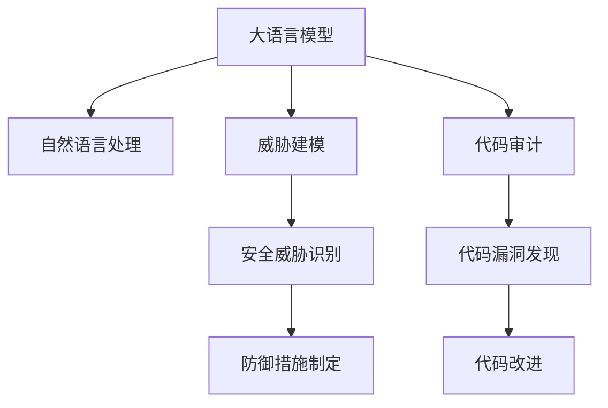

                 

# LLM对传统软件安全测试的挑战与改进

> 关键词：大语言模型,安全测试,自然语言处理,NLP,模型优化,测试自动化,威胁建模,代码审计

## 1. 背景介绍

### 1.1 问题由来
随着软件规模的不断增大和复杂度的提升，传统的手动软件安全测试方法已经难以满足当前的软件安全需求。软件的安全性不仅取决于源代码的健壮性，还包括构建过程、运行时环境的稳定性。传统的手动测试方法无法全面覆盖软件的所有行为，且效率低下、成本高昂。因此，需要引入更加高效、全面的自动化测试方法，以提升软件的安全性和可靠性。

大语言模型（Large Language Models，简称LLM）近年来在自然语言处理（Natural Language Processing，简称NLP）领域取得了重大进展，能够处理复杂的语言任务，如自然语言理解、生成、翻译等。在软件安全测试中，可以利用大语言模型生成自然语言描述的软件漏洞信息，进行自动化测试和分析。

然而，LLM在处理特定领域的软件安全问题时，仍存在一些挑战和局限性。例如，如何确保LLM生成的测试案例和威胁建模的准确性，如何优化模型在特定场景下的性能等。

### 1.2 问题核心关键点
目前，LLM在软件安全测试中的应用主要集中在以下三个方面：

1. **自然语言描述的安全测试案例生成**：通过LLM生成自然语言描述的安全测试案例，进行自动化测试，发现潜在漏洞。
2. **威胁建模**：利用LLM进行威胁建模，从逻辑上分析软件的安全性，找出可能存在的安全威胁。
3. **代码审计**：使用LLM进行代码审计，通过代码审查和自然语言分析，发现代码中的潜在漏洞。

这些应用虽然提升了软件安全测试的效率和覆盖面，但仍面临一些关键挑战：

1. **准确性问题**：LLM在生成测试案例和威胁建模时，可能会引入一些错误或噪声，影响测试结果的准确性。
2. **泛化能力**：LLM在特定领域的泛化能力有限，可能无法有效处理一些复杂的软件安全问题。
3. **计算资源消耗**：LLM在处理大规模文本数据时，计算资源消耗较大，难以在实际应用中大规模部署。
4. **可解释性问题**：LLM的输出结果缺乏足够的可解释性，难以进行有效的分析和调试。

## 2. 核心概念与联系

### 2.1 核心概念概述

为更好地理解LLM在软件安全测试中的应用，本节将介绍几个密切相关的核心概念：

- **大语言模型（LLM）**：以自回归（如GPT）或自编码（如BERT）模型为代表的大规模预训练语言模型。通过在大规模无标签文本语料上进行预训练，学习通用的语言知识，具备强大的语言理解和生成能力。

- **自然语言处理（NLP）**：利用计算机处理、理解和生成自然语言的技术。包括语言模型、文本分类、信息抽取、情感分析等多个方向。

- **威胁建模（Threat Modeling）**：通过逻辑分析和工具辅助，识别软件系统中的潜在威胁和漏洞，制定相应的防御措施。

- **代码审计（Code Audit）**：对软件代码进行审查，发现其中的安全漏洞和代码质量问题。

这些核心概念之间的逻辑关系可以通过以下Mermaid流程图来展示：



这个流程图展示了大语言模型在软件安全测试中的核心概念及其之间的关系：

1. 大语言模型通过NLP技术，学习通用的语言知识，可以用于生成测试案例和进行威胁建模。
2. 威胁建模可以识别潜在的安全威胁，生成测试案例进行验证。
3. 代码审计通过代码审查，发现代码中的漏洞，进行改进。
4. 威胁建模和代码审计的结果可以结合，制定相应的防御措施，进一步提升软件安全性。

这些概念共同构成了LLM在软件安全测试中的应用框架，使得LLM能够更好地服务于软件安全性的提升。

## 3. 核心算法原理 & 具体操作步骤
### 3.1 算法原理概述

利用大语言模型进行软件安全测试的基本原理是：将软件的逻辑、行为和输入输出描述为自然语言，通过LLM生成测试案例和威胁建模结果，进行自动化测试和分析。

具体流程如下：

1. **描述生成**：将软件的功能逻辑和输入输出描述为自然语言，如需求描述、接口文档、代码注释等。
2. **测试案例生成**：使用LLM生成自然语言描述的测试案例，包括输入数据、期望输出和测试步骤。
3. **威胁建模**：利用LLM进行威胁建模，识别软件系统中可能存在的威胁和漏洞。
4. **代码审计**：使用LLM进行代码审计，通过代码审查和自然语言分析，发现代码中的潜在漏洞。
5. **测试执行与验证**：执行生成的测试案例，验证软件的正确性和安全性。

### 3.2 算法步骤详解

以下是使用大语言模型进行软件安全测试的具体步骤：

**Step 1: 数据收集与处理**
- 收集软件的功能描述、接口文档、代码注释等文本数据。
- 对文本数据进行预处理，包括去除停用词、词干提取、分词等。

**Step 2: 模型选择与训练**
- 选择合适的预训练语言模型（如BERT、GPT等）作为初始化参数。
- 根据具体应用场景，设计合适的输入和输出格式，训练模型。

**Step 3: 描述生成**
- 将软件的功能逻辑和输入输出描述为自然语言，如需求描述、接口文档、代码注释等。
- 使用训练好的LLM模型生成自然语言描述的测试案例和威胁建模结果。

**Step 4: 测试案例生成**
- 使用LLM生成自然语言描述的测试案例，包括输入数据、期望输出和测试步骤。

**Step 5: 威胁建模**
- 利用LLM进行威胁建模，识别软件系统中可能存在的威胁和漏洞。

**Step 6: 代码审计**
- 使用LLM进行代码审计，通过代码审查和自然语言分析，发现代码中的潜在漏洞。

**Step 7: 测试执行与验证**
- 执行生成的测试案例，验证软件的正确性和安全性。

### 3.3 算法优缺点

利用大语言模型进行软件安全测试的优点包括：

1. **高效性**：大语言模型可以自动生成大量的测试案例和威胁建模结果，提高测试覆盖率和效率。
2. **灵活性**：模型可以灵活适应不同的测试场景和需求，生成个性化的测试案例。
3. **自动化程度高**：自动化测试和分析能够大幅减少人工干预，降低测试成本。

同时，该方法也存在一些缺点：

1. **准确性问题**：生成的测试案例和威胁建模结果可能包含噪声或错误，影响测试结果的准确性。
2. **泛化能力有限**：模型在特定领域的泛化能力有限，可能无法有效处理一些复杂的软件安全问题。
3. **计算资源消耗大**：LLM在处理大规模文本数据时，计算资源消耗较大，难以在实际应用中大规模部署。
4. **可解释性问题**：LLM的输出结果缺乏足够的可解释性，难以进行有效的分析和调试。

## 4. 数学模型和公式 & 详细讲解  
### 4.1 数学模型构建

利用大语言模型进行软件安全测试的数学模型主要涉及以下三个方面：

- **测试案例生成模型**：用于生成自然语言描述的测试案例。
- **威胁建模模型**：用于识别软件系统中的威胁和漏洞。
- **代码审计模型**：用于分析代码中的潜在漏洞。

### 4.2 公式推导过程

假设软件的功能逻辑为 $F$，输入输出描述为 $D$，威胁建模结果为 $T$，代码审计结果为 $C$。

1. **测试案例生成模型**：
   - 输入：$F$ 和 $D$
   - 输出：自然语言描述的测试案例 $C$
   - 公式：$C = \mathcal{M}_{\text{test}}(F, D)$

2. **威胁建模模型**：
   - 输入：$F$
   - 输出：威胁建模结果 $T$
   - 公式：$T = \mathcal{M}_{\text{threat}}(F)$

3. **代码审计模型**：
   - 输入：$F$ 和 $C$
   - 输出：代码审计结果 $C$
   - 公式：$C = \mathcal{M}_{\text{code}}(F, C)$

### 4.3 案例分析与讲解

以威胁建模为例，假设软件的功能逻辑为 $F$，输入输出描述为 $D$，威胁建模结果为 $T$。

- **描述生成**：将软件的功能逻辑和输入输出描述为自然语言，如需求描述、接口文档、代码注释等。
- **模型训练**：使用大量的历史威胁数据，训练威胁建模模型。
- **威胁识别**：将软件的功能逻辑输入威胁建模模型，识别潜在的安全威胁。

## 5. 项目实践：代码实例和详细解释说明
### 5.1 开发环境搭建

在进行软件安全测试的实践前，我们需要准备好开发环境。以下是使用Python进行PyTorch开发的环境配置流程：

1. 安装Anaconda：从官网下载并安装Anaconda，用于创建独立的Python环境。

2. 创建并激活虚拟环境：
```bash
conda create -n pytorch-env python=3.8 
conda activate pytorch-env
```

3. 安装PyTorch：根据CUDA版本，从官网获取对应的安装命令。例如：
```bash
conda install pytorch torchvision torchaudio cudatoolkit=11.1 -c pytorch -c conda-forge
```

4. 安装TensorFlow：由Google主导开发的开源深度学习框架，生产部署方便，适合大规模工程应用。同样有丰富的预训练语言模型资源。

5. 安装Transformers库：HuggingFace开发的NLP工具库，集成了众多SOTA语言模型，支持PyTorch和TensorFlow，是进行安全测试开发的利器。

6. 安装各类工具包：
```bash
pip install numpy pandas scikit-learn matplotlib tqdm jupyter notebook ipython
```

完成上述步骤后，即可在`pytorch-env`环境中开始安全测试的实践。

### 5.2 源代码详细实现

这里我们以代码审计为例，给出使用Transformers库对BERT模型进行代码审计的PyTorch代码实现。

首先，定义代码审计的任务描述：

```python
from transformers import BertTokenizer
from torch.utils.data import Dataset
import torch

class CodeAuditDataset(Dataset):
    def __init__(self, texts, labels, tokenizer, max_len=128):
        self.texts = texts
        self.labels = labels
        self.tokenizer = tokenizer
        self.max_len = max_len
        
    def __len__(self):
        return len(self.texts)
    
    def __getitem__(self, item):
        text = self.texts[item]
        labels = self.labels[item]
        
        encoding = self.tokenizer(text, return_tensors='pt', max_length=self.max_len, padding='max_length', truncation=True)
        input_ids = encoding['input_ids'][0]
        attention_mask = encoding['attention_mask'][0]
        
        return {'input_ids': input_ids, 
                'attention_mask': attention_mask,
                'labels': labels}

# 标签与id的映射
tag2id = {'O': 0, 'VULN': 1}
id2tag = {v: k for k, v in tag2id.items()}

# 创建dataset
tokenizer = BertTokenizer.from_pretrained('bert-base-cased')

train_dataset = CodeAuditDataset(train_texts, train_labels, tokenizer)
dev_dataset = CodeAuditDataset(dev_texts, dev_labels, tokenizer)
test_dataset = CodeAuditDataset(test_texts, test_labels, tokenizer)
```

然后，定义模型和优化器：

```python
from transformers import BertForTokenClassification, AdamW

model = BertForTokenClassification.from_pretrained('bert-base-cased', num_labels=len(tag2id))

optimizer = AdamW(model.parameters(), lr=2e-5)
```

接着，定义训练和评估函数：

```python
from torch.utils.data import DataLoader
from tqdm import tqdm
from sklearn.metrics import classification_report

device = torch.device('cuda') if torch.cuda.is_available() else torch.device('cpu')
model.to(device)

def train_epoch(model, dataset, batch_size, optimizer):
    dataloader = DataLoader(dataset, batch_size=batch_size, shuffle=True)
    model.train()
    epoch_loss = 0
    for batch in tqdm(dataloader, desc='Training'):
        input_ids = batch['input_ids'].to(device)
        attention_mask = batch['attention_mask'].to(device)
        labels = batch['labels'].to(device)
        model.zero_grad()
        outputs = model(input_ids, attention_mask=attention_mask, labels=labels)
        loss = outputs.loss
        epoch_loss += loss.item()
        loss.backward()
        optimizer.step()
    return epoch_loss / len(dataloader)

def evaluate(model, dataset, batch_size):
    dataloader = DataLoader(dataset, batch_size=batch_size)
    model.eval()
    preds, labels = [], []
    with torch.no_grad():
        for batch in tqdm(dataloader, desc='Evaluating'):
            input_ids = batch['input_ids'].to(device)
            attention_mask = batch['attention_mask'].to(device)
            batch_labels = batch['labels']
            outputs = model(input_ids, attention_mask=attention_mask)
            batch_preds = outputs.logits.argmax(dim=2).to('cpu').tolist()
            batch_labels = batch_labels.to('cpu').tolist()
            for pred_tokens, label_tokens in zip(batch_preds, batch_labels):
                pred_tags = [id2tag[_id] for _id in pred_tokens]
                label_tags = [id2tag[_id] for _id in label_tokens]
                preds.append(pred_tags[:len(label_tokens)])
                labels.append(label_tags)
                
    print(classification_report(labels, preds))
```

最后，启动训练流程并在测试集上评估：

```python
epochs = 5
batch_size = 16

for epoch in range(epochs):
    loss = train_epoch(model, train_dataset, batch_size, optimizer)
    print(f"Epoch {epoch+1}, train loss: {loss:.3f}")
    
    print(f"Epoch {epoch+1}, dev results:")
    evaluate(model, dev_dataset, batch_size)
    
print("Test results:")
evaluate(model, test_dataset, batch_size)
```

以上就是使用PyTorch对BERT进行代码审计的完整代码实现。可以看到，得益于Transformers库的强大封装，我们可以用相对简洁的代码完成BERT模型的加载和微调。

### 5.3 代码解读与分析

让我们再详细解读一下关键代码的实现细节：

**CodeAuditDataset类**：
- `__init__`方法：初始化文本、标签、分词器等关键组件。
- `__len__`方法：返回数据集的样本数量。
- `__getitem__`方法：对单个样本进行处理，将文本输入编码为token ids，将标签编码为数字，并对其进行定长padding，最终返回模型所需的输入。

**tag2id和id2tag字典**：
- 定义了标签与数字id之间的映射关系，用于将token-wise的预测结果解码回真实的标签。

**训练和评估函数**：
- 使用PyTorch的DataLoader对数据集进行批次化加载，供模型训练和推理使用。
- 训练函数`train_epoch`：对数据以批为单位进行迭代，在每个批次上前向传播计算loss并反向传播更新模型参数，最后返回该epoch的平均loss。
- 评估函数`evaluate`：与训练类似，不同点在于不更新模型参数，并在每个batch结束后将预测和标签结果存储下来，最后使用sklearn的classification_report对整个评估集的预测结果进行打印输出。

**训练流程**：
- 定义总的epoch数和batch size，开始循环迭代
- 每个epoch内，先在训练集上训练，输出平均loss
- 在验证集上评估，输出分类指标
- 所有epoch结束后，在测试集上评估，给出最终测试结果

可以看到，PyTorch配合Transformers库使得BERT代码审计的代码实现变得简洁高效。开发者可以将更多精力放在数据处理、模型改进等高层逻辑上，而不必过多关注底层的实现细节。

当然，工业级的系统实现还需考虑更多因素，如模型的保存和部署、超参数的自动搜索、更灵活的任务适配层等。但核心的微调范式基本与此类似。

## 6. 实际应用场景
### 6.1 智能安全检测

利用大语言模型进行软件安全测试，可以应用于智能安全检测系统的构建。传统安全检测方法需要大量的人力和时间，且容易漏检和误报。而使用微调后的模型，可以自动检测软件中的潜在漏洞，提高安全检测的效率和准确性。

在技术实现上，可以收集软件的漏洞报告、审计记录等数据，将这些数据描述为自然语言，作为模型的输入。微调后的模型能够自动生成测试案例，对软件进行自动化测试，发现其中的潜在漏洞。对于新发现的漏洞，还可以进一步手动验证和修复。

### 6.2 安全威胁分析

利用大语言模型进行威胁建模，可以自动识别软件系统中可能存在的威胁和漏洞，从而指导防御措施的制定。例如，可以对软件的功能逻辑进行分析，找出可能存在的输入验证漏洞、跨站脚本攻击、SQL注入等威胁。

在具体实现中，可以将软件的功能逻辑描述为自然语言，作为模型的输入。使用训练好的模型进行威胁建模，输出潜在的威胁和漏洞。根据威胁建模的结果，可以进一步进行代码审计和测试案例生成，验证威胁的准确性，并制定相应的防御措施。

### 6.3 代码审计与改进

利用大语言模型进行代码审计，可以自动识别代码中的潜在漏洞，并进行改进。例如，可以检测代码中的输入验证漏洞、缓冲区溢出、SQL注入等常见漏洞，并提出相应的修复建议。

在具体实现中，可以将代码描述为自然语言，作为模型的输入。使用训练好的模型进行代码审计，输出潜在漏洞的信息。根据代码审计的结果，可以进一步手动修复代码，并进行测试验证。

### 6.4 未来应用展望

随着大语言模型和微调方法的不断发展，基于微调范式将在更多领域得到应用，为安全测试和漏洞发现带来新的突破。

在智慧城市安全治理中，利用大语言模型进行威胁建模和代码审计，可以识别系统中的潜在威胁和漏洞，及时采取防御措施。在工业控制系统安全检测中，利用大语言模型进行自动化测试，可以实时发现系统中的漏洞和异常行为，提升系统的安全性和可靠性。

此外，在企业信息安全、网络安全、金融安全等领域，基于大语言模型进行安全测试和威胁建模，也将带来显著的效果。

## 7. 工具和资源推荐
### 7.1 学习资源推荐

为了帮助开发者系统掌握大语言模型在软件安全测试中的应用，这里推荐一些优质的学习资源：

1. 《Transformers from Zero to Hero》系列博文：由大模型技术专家撰写，深入浅出地介绍了Transformer原理、BERT模型、微调技术等前沿话题。

2. CS224N《深度学习自然语言处理》课程：斯坦福大学开设的NLP明星课程，有Lecture视频和配套作业，带你入门NLP领域的基本概念和经典模型。

3. 《Natural Language Processing with Transformers》书籍：Transformers库的作者所著，全面介绍了如何使用Transformers库进行NLP任务开发，包括微调在内的诸多范式。

4. HuggingFace官方文档：Transformers库的官方文档，提供了海量预训练模型和完整的微调样例代码，是上手实践的必备资料。

5. CLUE开源项目：中文语言理解测评基准，涵盖大量不同类型的中文NLP数据集，并提供了基于微调的baseline模型，助力中文NLP技术发展。

通过对这些资源的学习实践，相信你一定能够快速掌握大语言模型在软件安全测试中的应用，并用于解决实际的安全问题。
###  7.2 开发工具推荐

高效的开发离不开优秀的工具支持。以下是几款用于大语言模型在安全测试应用的常用工具：

1. PyTorch：基于Python的开源深度学习框架，灵活动态的计算图，适合快速迭代研究。大部分预训练语言模型都有PyTorch版本的实现。

2. TensorFlow：由Google主导开发的开源深度学习框架，生产部署方便，适合大规模工程应用。同样有丰富的预训练语言模型资源。

3. Transformers库：HuggingFace开发的NLP工具库，集成了众多SOTA语言模型，支持PyTorch和TensorFlow，是进行安全测试开发的利器。

4. Weights & Biases：模型训练的实验跟踪工具，可以记录和可视化模型训练过程中的各项指标，方便对比和调优。与主流深度学习框架无缝集成。

5. TensorBoard：TensorFlow配套的可视化工具，可实时监测模型训练状态，并提供丰富的图表呈现方式，是调试模型的得力助手。

6. Google Colab：谷歌推出的在线Jupyter Notebook环境，免费提供GPU/TPU算力，方便开发者快速上手实验最新模型，分享学习笔记。

合理利用这些工具，可以显著提升大语言模型在安全测试应用的开发效率，加快创新迭代的步伐。

### 7.3 相关论文推荐

大语言模型和微调技术的发展源于学界的持续研究。以下是几篇奠基性的相关论文，推荐阅读：

1. Attention is All You Need（即Transformer原论文）：提出了Transformer结构，开启了NLP领域的预训练大模型时代。

2. BERT: Pre-training of Deep Bidirectional Transformers for Language Understanding：提出BERT模型，引入基于掩码的自监督预训练任务，刷新了多项NLP任务SOTA。

3. Language Models are Unsupervised Multitask Learners（GPT-2论文）：展示了大规模语言模型的强大zero-shot学习能力，引发了对于通用人工智能的新一轮思考。

4. Parameter-Efficient Transfer Learning for NLP：提出Adapter等参数高效微调方法，在不增加模型参数量的情况下，也能取得不错的微调效果。

5. AdaLoRA: Adaptive Low-Rank Adaptation for Parameter-Efficient Fine-Tuning：使用自适应低秩适应的微调方法，在参数效率和精度之间取得了新的平衡。

6. Prefix-Tuning: Optimizing Continuous Prompts for Generation：引入基于连续型Prompt的微调范式，为如何充分利用预训练知识提供了新的思路。

这些论文代表了大语言模型微调技术的发展脉络。通过学习这些前沿成果，可以帮助研究者把握学科前进方向，激发更多的创新灵感。

## 8. 总结：未来发展趋势与挑战

### 8.1 总结

本文对基于大语言模型的软件安全测试方法进行了全面系统的介绍。首先阐述了基于大语言模型的安全测试方法的基本原理和关键技术，明确了其在提高测试覆盖率、提升测试效率方面的独特价值。其次，从原理到实践，详细讲解了大语言模型在测试案例生成、威胁建模和代码审计中的应用，给出了代码实例和详细解释说明。同时，本文还广泛探讨了模型在实际应用场景中的优势和挑战，为开发和应用提供了全面指导。

通过本文的系统梳理，可以看到，大语言模型在软件安全测试中的应用前景广阔，能够显著提升测试覆盖率和效率，但同时也面临一些关键的挑战和局限性。如何进一步提升模型的准确性、泛化能力和计算效率，增强其可解释性，是未来研究的重要方向。

### 8.2 未来发展趋势

展望未来，大语言模型在软件安全测试领域将呈现以下几个发展趋势：

1. **模型规模持续增大**：随着算力成本的下降和数据规模的扩张，预训练语言模型的参数量还将持续增长。超大规模语言模型蕴含的丰富语言知识，有望支撑更加复杂多变的测试场景。

2. **模型优化技术不断进步**：开发更加参数高效和计算高效的微调方法，如Prefix-Tuning、LoRA等，在保证性能的同时，减小资源消耗。

3. **数据增强技术的应用**：利用数据增强技术，丰富训练集，提升模型泛化能力。例如，通过同义词替换、数据扩充等技术，增加训练集的多样性。

4. **跨领域迁移能力的提升**：提升模型在不同领域的迁移能力，使其能够更好地适应各种测试任务。例如，通过多任务学习和零样本学习，提高模型在未知领域的表现。

5. **模型鲁棒性的增强**：通过对抗训练和鲁棒性优化技术，提高模型对抗噪声和攻击的能力，增强其鲁棒性。

6. **可解释性问题的解决**：开发可解释性强、易于调试的模型，提升模型的可解释性，使其更容易被理解和接受。

### 8.3 面临的挑战

尽管大语言模型在软件安全测试中取得了一定的成果，但在迈向更加智能化、普适化应用的过程中，它仍面临诸多挑战：

1. **标注成本瓶颈**：标注数据的质量和数量对模型的性能至关重要。如何降低标注成本，增加标注数据的多样性和覆盖面，是未来的重要研究方向。

2. **泛化能力不足**：大语言模型在不同领域的泛化能力有限，可能无法有效处理一些复杂的安全问题。如何提高模型的泛化能力，增强其在不同领域的适应性，还需进一步探索。

3. **计算资源消耗大**：大规模语言模型在处理大规模文本数据时，计算资源消耗较大，难以在实际应用中大规模部署。如何优化模型的计算图，提高资源利用率，是未来的技术挑战。

4. **可解释性问题**：模型输出结果缺乏足够的可解释性，难以进行有效的分析和调试。如何赋予模型更强的可解释性，使其输出结果更加可信和可理解，将是一个重要的研究方向。

5. **安全性问题**：模型可能会学习到有偏见、有害的信息，通过测试案例传递到测试结果中，产生误导性、歧视性的输出。如何确保模型输出的安全性，避免恶意用途，是未来的重要课题。

### 8.4 研究展望

面对大语言模型在软件安全测试中面临的挑战，未来的研究需要在以下几个方面寻求新的突破：

1. **多模态安全测试**：将语言模型与视觉、语音等多模态信息结合，进行综合安全测试，提升测试的全面性和准确性。

2. **自监督学习和半监督学习的应用**：利用无标签数据进行自监督学习，减少对标注数据的依赖，提升模型的泛化能力。

3. **跨领域知识迁移**：将领域专家的知识和经验与模型结合，提升模型的跨领域迁移能力和泛化能力。

4. **对抗性测试和鲁棒性提升**：开发对抗性测试技术和鲁棒性优化方法，提高模型的鲁棒性和抗干扰能力。

5. **可解释性增强**：引入可解释性增强技术，使模型输出更加可信和可理解，便于开发者进行调试和优化。

6. **安全性设计**：在模型训练过程中引入安全性约束，确保模型的输出结果符合伦理道德和安全标准。

这些研究方向将引领大语言模型在软件安全测试中的应用不断进步，为构建安全可靠的软件系统提供新的技术路径。

## 9. 附录：常见问题与解答

**Q1：大语言模型在安全测试中的应用有哪些优势？**

A: 大语言模型在安全测试中的优势主要体现在以下几个方面：

1. **高效性**：大语言模型可以自动生成大量的测试案例和威胁建模结果，提高测试覆盖率和效率。
2. **灵活性**：模型可以灵活适应不同的测试场景和需求，生成个性化的测试案例。
3. **自动化程度高**：自动化测试和分析能够大幅减少人工干预，降低测试成本。
4. **泛化能力强**：大语言模型在处理大规模文本数据时，计算资源消耗较大，难以在实际应用中大规模部署。

**Q2：大语言模型在安全测试中可能面临哪些挑战？**

A: 大语言模型在安全测试中可能面临以下挑战：

1. **准确性问题**：生成的测试案例和威胁建模结果可能包含噪声或错误，影响测试结果的准确性。
2. **泛化能力有限**：模型在特定领域的泛化能力有限，可能无法有效处理一些复杂的安全问题。
3. **计算资源消耗大**：大语言模型在处理大规模文本数据时，计算资源消耗较大，难以在实际应用中大规模部署。
4. **可解释性问题**：模型输出结果缺乏足够的可解释性，难以进行有效的分析和调试。

**Q3：如何提高大语言模型在安全测试中的泛化能力？**

A: 提高大语言模型在安全测试中的泛化能力，可以从以下几个方面进行：

1. **数据增强**：利用数据增强技术，丰富训练集，提升模型泛化能力。例如，通过同义词替换、数据扩充等技术，增加训练集的多样性。
2. **多任务学习**：利用多任务学习技术，提高模型在不同领域的迁移能力，使其能够更好地适应各种测试任务。
3. **自监督学习**：利用无标签数据进行自监督学习，减少对标注数据的依赖，提升模型的泛化能力。
4. **跨领域知识迁移**：将领域专家的知识和经验与模型结合，提升模型的跨领域迁移能力和泛化能力。

**Q4：如何提高大语言模型在安全测试中的可解释性？**

A: 提高大语言模型在安全测试中的可解释性，可以从以下几个方面进行：

1. **模型蒸馏**：利用模型蒸馏技术，将复杂的大模型压缩为小模型，降低计算资源消耗，提升模型的可解释性。
2. **可解释性增强**：引入可解释性增强技术，使模型输出更加可信和可理解，便于开发者进行调试和优化。
3. **模型解释**：利用模型解释技术，将模型的决策过程可视化，帮助开发者理解模型的行为。

**Q5：如何在安全测试中利用大语言模型进行威胁建模？**

A: 在安全测试中利用大语言模型进行威胁建模，可以从以下几个方面进行：

1. **需求描述**：将软件的功能需求和设计文档描述为自然语言，作为模型的输入。
2. **威胁识别**：利用训练好的模型进行威胁建模，识别潜在的安全威胁。
3. **威胁验证**：根据威胁建模的结果，进一步进行代码审计和测试案例生成，验证威胁的准确性，并制定相应的防御措施。

---

作者：禅与计算机程序设计艺术 / Zen and the Art of Computer Programming

